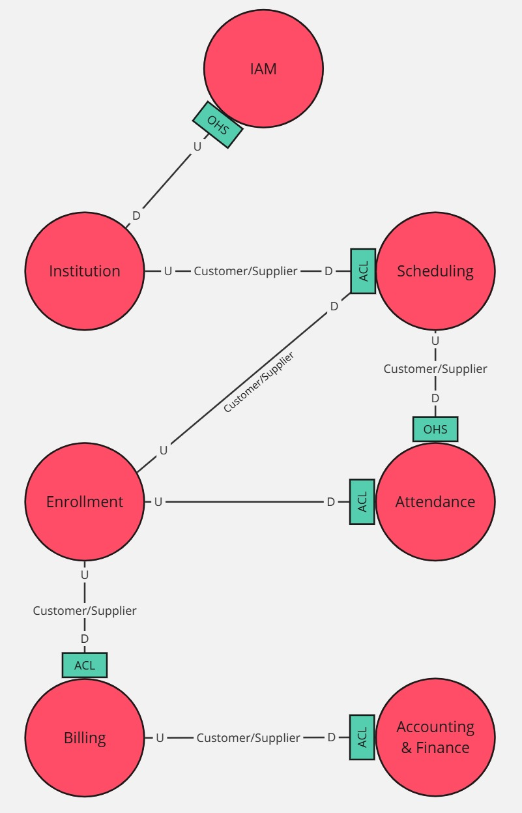

<h2 style="text-align: center;"> Universidad Peruana de Ciencias Aplicadas </h2>

  

<h4 style="text-align: center"> Ingeniería de Software </h4>

<h4 style="text-align: center"> CC238 - Aplicaciones para Dispositivos Móviles </h4>

<h4 style="text-align: center"> NRC: 1798  </h4>

<h4 style="text-align: center"> Docente: Jorge Luis Mayta Guillermo </h4>

<h4 style="text-align: center;"> Informe del Trabajo Final </h4>

<h4 style="text-align: center"> Startup: Nistra </h4>

<h4 style="text-align: center"> Producto: Demy </h4>

<h3 style="text-align: center">Team members:</h2>

  <table style="display:inline-table; border-collapse:collapse; text-align:center; width:550px;">
    <thead>
      <tr>
        <th style="padding:6px 12px;">Código</th>
        <th style="padding:6px 12px;">Nombre</th>
      </tr>
    </thead>
    <tbody>
      <tr>
        <td style="padding:6px 12px;">U202224135</td>
        <td style="padding:6px 12px;">Aponte Cruzado, Andrea Marielena</td>
      </tr>
      <tr>
        <td style="padding:6px 12px;">U20221G120</td>
        <td style="padding:6px 12px;">Crispin Ramos, Daniel Franco</td>
      </tr>
      <tr>
        <td style="padding:6px 12px;">U20201E843</td>
        <td style="padding:6px 12px;">Ramirez Mestanza, Salim Ignacio</td>
      </tr>
      <tr>
        <td style="padding:6px 12px;">U20221C486</td>
        <td style="padding:6px 12px;">Sulca Gonzales, Paúl Fernando</td>
      </tr>
      <tr>
        <td style="padding:6px 12px;">U20231A778</td>
        <td style="padding:6px 12px;">Vilca Saboya, Diego Alejandro</td>
      </tr>
    </tbody>
  </table>

<h5 style="text-align: center"> Ciclo 2025-20 </h5>

# Registro de Versiones del Informe

# Project Report Collaboration Insights

# Contenido

- [Capítulo I: Introducción](#capítulo-i-introducción)
    - [1.1. Startup Profile](#11-startup-profile)
        - [1.1.1. Descripción de la Startup](#111-descripción-de-la-startup)
        - [1.1.2. Perfiles de los integrantes del equipo](#112-perfiles-de-los-integrantes-del-equipo)
    - [1.2. Solution Profile](#12-solution-profile)
        - [1.2.1. Antecedentes y problemática](#121-antecedentes-y-problemática)
        - [1.2.2. Lean UX Process](#122-lean-ux-process)
            - [1.2.2.1. Lean UX Problem Statements](#1221-lean-ux-problem-statements)
            - [1.2.2.2. Lean UX Assumptions](#1222-lean-ux-assumptions)
            - [1.2.2.3. Lean UX Hypothesis](#1223-lean-ux-hypothesis)
            - [1.2.2.4. Lean UX Canvas](#1224-lean-ux-canvas)
    - [1.3. Segmentos objetivo](#13-segmentos-objetivo)

- [Capítulo II: Requirements Elicitation & Analysis](#capítulo-ii-requirements-elicitation--analysis)
    - [2.1. Competidores](#21-competidores)
        - [2.1.1. Análisis competitivo](#211-análisis-competitivo)
        - [2.1.2. Estrategias y tácticas frente a competidores](#212-estrategias-y-tácticas-frente-a-competidores)
    - [2.2. Entrevistas](#22-entrevistas)
        - [2.2.1. Diseño de entrevistas](#221-diseño-de-entrevistas)
        - [2.2.2. Registro de entrevistas](#222-registro-de-entrevistas)
        - [2.2.3. Análisis de entrevistas](#223-análisis-de-entrevistas)
    - [2.3. Needfinding](#23-needfinding)
        - [2.3.1. User Personas](#231-user-personas)
        - [2.3.2. User Task Matrix](#232-user-task-matrix)
        - [2.3.3. User Journey Mapping](#233-user-journey-mapping)
        - [2.3.4. Empathy Mapping](#234-empathy-mapping)
        - [2.3.5. As-is Scenario Mapping](#235-as-is-scenario-mapping)
    - [2.4. Ubiquitous Language](#24-ubiquitous-language)

- [Capítulo III: Requirements Specification](#capítulo-iii-requirements-specification)
    - [3.1. To-Be Scenario Mapping](#31-to-be-scenario-mapping)
    - [3.2. User Stories](#32-user-stories)
    - [3.3. Impact Mapping](#33-impact-mapping)
    - [3.4. Product Backlog](#34-product-backlog)

- [Capítulo IV: Solution Software Design](#capítulo-iv-solution-software-design)
    - [4.1. Strategic-Level Domain-Driven Design](#41-strategic-level-domain-driven-design)
        - [4.1.1. EventStorming](#411-eventstorming)
            - [4.1.1.1. Candidate Context Discovery](#4111-candidate-context-discovery)
            - [4.1.1.2. Domain Message Flows Modeling](#4112-domain-message-flows-modeling)
            - [4.1.1.3. Bounded Context Canvases](#4113-bounded-context-canvases)
        - [4.1.2. Context Mapping](#412-context-mapping)
        - [4.1.3. Software Architecture](#413-software-architecture)
            - [4.1.3.1. Software Architecture Context Level Diagrams](#4131-software-architecture-context-level-diagrams)
            - [4.1.3.2. Software Architecture Container Level Diagrams](#4132-software-architecture-container-level-diagrams)
            - [4.1.3.3. Software Architecture Deployment Diagrams](#4133-software-architecture-deployment-diagrams)
    - [4.2. Tactical-Level Domain-Driven Design](#42-tactical-level-domain-driven-design)
        - [4.2.X. Bounded Context: <Bounded Context Name>](#42x-bounded-context-bounded-context-name)
            - [4.2.X.1. Domain Layer](#42X1-domain-layer)
            - [4.2.X.2. Interface Layer](#42X2-interface-layer)
            - [4.2.X.3. Application Layer](#42X3-application-layer)
            - [4.2.X.4. Infrastructure Layer](#42X4-infrastructure-layer)
            - [4.2.X.5. Bounded Context Software Architecture Component Level Diagrams](#42X5-bounded-context-software-architecture-component-level-diagrams)
            - [4.2.X.6. Bounded Context Software Architecture Code Level Diagrams](#42X6-bounded-context-software-architecture-code-level-diagrams)
                - [4.2.X.6.1. Bounded Context Domain Layer Class Diagrams](#42X61-bounded-context-domain-layer-class-diagrams)
                - [4.2.X.6.2. Bounded Context Database Design Diagram](#42X62-bounded-context-database-design-diagram)

- [Conclusiones](#conclusiones)
    - [Conclusiones y recomendaciones](#conclusiones-y-recomendaciones)
- [Bibliografía](#bibliografía)
- [Anexos](#anexos)

# Student Outcome

# Objetivos SMART

# Capítulo I: Introducción

## 1.1. Startup Profile

### 1.1.1. Descripción de la Startup

La startup **Nistra**, es un equipo conformado por estudiantes de la carrera de Ingeniería de Software, tiene como objetivo desarrollar soluciones tecnológicas innovadoras orientadas a optimizar la gestión administrativa de academias educativas en el Perú. Con nuestra aplicación móvil **Demy**, buscamos digitalizar y simplificar tareas clave de las academias, incluyendo matrículas, control de asistencia, organización de horarios, así como la gestión de pagos.

**Misión**: Transformar la administración de academias educativas en el Perú mediante una aplicación móvil innovadora que optimice procesos clave, incremente la eficiencia y mejore la experiencia de gestión para todos los usuarios.

**Visión**: Ser reconocidos como la startup líder en soluciones móviles para la gestión académica en el Perú, destacando por la accesibilidad, seguridad e innovación de nuestras herramientas digitales.

### 1.1.2. Perfiles de los integrantes del equipo

| **Foto**                                                                     | **Nombres y Apellidos**             | **Código** | **Carrera**            | **Resumen de Conocimientos y Habilidades**                                                                                                                                                  |
|------------------------------------------------------------------------------|-------------------------------------|------------|------------------------|---------------------------------------------------------------------------------------------------------------------------------------------------------------------------------------------|
|   | **Daniel Franco Crispin Ramos**     | 20221G120  | Ingeniería de Software | Tengo conocimientos en desarrollo web frontend y backend, programación orientada a objetos y uso de Git. Soy una persona responsable, comprometida y con facilidad para trabajar en equipo. |
|      | **Paul Fernando Sulca Gonzales**    | 20221C486  | Ingeniería de Software | Conocimiento en diseño de software orientado a objetos y modelado UML. Experiencia en implementación de interfaces web adaptativas.                                                         |
|    | **Salim Ignacio Ramirez Mestanza**  | 20201E843  | Ingeniería de Software | Conocimiento en arquitectura de software y control de versiones con Git. Experiencia en documentación técnica y colaboración en equipos ágiles.                                             |
|    | **Diego Alejandro Vilca Saboya**    | 20231A778  | Ingeniería de Software | Conocimiento en desarrollo web utilizando las últimas tecnologías en tendencia. Experiencia en elaboración de diagramas de arquitectura y prototipado UX/UI.                                |
|  | **Andrea Marielena Aponte Cruzado** | 202224135  | Ingeniería de Software | [ACTUALIZAR]                                                                                                                                                                                |

## 1.2. Solution Profile

### 1.2.1. Antecedentes y problemática

### ¿Cuáles son las 5W?

#### What?

#### ¿Cuál es el problema?

El principal desafío identificado es la ausencia de un sistema centralizado para la gestión administrativa en academias educativas presenciales del Perú. Actualmente, muchas de estas instituciones dependen de hojas de cálculo, documentos físicos o plataformas no integradas, lo que incrementa la carga operativa, favorece errores recurrentes, provoca pérdida de información y reduce la eficiencia en el uso del tiempo. 

Según Naranjo et al. (2025), “the lack of clarity in some procedures, duplication of tasks, and long response times represent obstacles that affect both student satisfaction and administrative staff productivity” (p. 3), lo que evidencia que los procesos administrativos manuales no solo retrasan las operaciones internas, sino que también impactan negativamente en la experiencia del estudiante y en la productividad del personal. De igual manera, Díaz-García et al. (2023) enfatizan que “digitalisation is necessary to implement a data-driven management model. It is necessary to develop systems that provide real-time information to facilitate control, management and decision-making processes” (p. 10), resaltando la necesidad de adoptar soluciones tecnológicas que permitan centralizar la información y facilitar la toma de decisiones estratégicas. Ambos estudios coinciden en que la digitalización y optimización de los procesos administrativos son esenciales para mejorar la eficiencia institucional y la calidad del servicio educativo.

#### When (Cuando)

#### ¿Cuándo sucede el problema?

Esta situación se presenta de manera continua en el funcionamiento diario de las academias, siendo más evidente al inicio de cada ciclo académico. Durante estos periodos críticos se concentran tareas como la matrícula de estudiantes, el registro de asistencia, la organización de horarios y la gestión de pagos. La carencia de procesos automatizados y centralizados ralentiza las operaciones, afectando la productividad desde el primer contacto con el estudiante hasta el final del periodo académico.

#### Where (Dónde)

#### ¿A dónde se dirige?

La solución está orientada a academias educativas que desean modernizar su gestión interna mediante el uso de una herramienta tecnológica práctica, accesible y adaptada a sus necesidades operativas.

#### ¿Dónde surge el problema?

Este problema se origina en academias presenciales a nivel nacional que aún dependen de procesos manuales para la gestión administrativa. Estas instituciones tienen un rol fundamental en la formación académica en el Perú, ya que aproximadamente **cuatro de cada cinco estudiantes universitarios recurrieron a academias y/o centros preuniversitarios como preparación previa a su ingreso a la universidad** (Ministerio de Educación del Perú, 2021). Esta alta participación evidencia la necesidad de optimizar y modernizar sus sistemas de gestión.

#### Who (Quién)

#### ¿Quiénes están involucrados? ¿Quién lo utilizará?

Los principales usuarios de la aplicación serán los administrativos, docentes y estudiantes de las academias. Los administrativos podrán realizar matrículas, gestionar pagos, asignar horarios y generar reportes. Los docentes, por su parte, tendrán acceso a funciones como el registro de asistencia y la reprogramación de clases. Los estudiantes podran visualizar sus respectivos horarios de estudio y modificaciones en caso se realice una reprogramación de clase.

#### Why (Por qué)

#### ¿Cuál es la causa del problema?

La raíz del problema está en la falta de herramientas digitales accesibles y diseñadas específicamente para academias presenciales. Muchas instituciones no han adoptado soluciones tecnológicas debido a limitaciones presupuestarias, desconocimiento o resistencia al cambio, lo que perpetúa el uso de procesos manuales y poco eficientes.

### ¿Cuáles son las 2H?

#### How (Cómo)

#### ¿Cómo se utilizará el producto?

La aplicación móvil multiplataforma será usada diariamente por el personal administrativo, docente y estudiante. A través de una interfaz sencilla e intuitiva, podrán realizar matrículas, programar clases, gestionar pagos y registrar asistencia. El sistema permitirá el acceso desde smartphones o tablets, brindando flexibilidad y disponibilidad de información en cualquier momento con conexión a internet.

#### ¿Cómo lograremos alcanzar la correcta gestión de los procesos administrativos de la academia dentro de la plataforma?

La solución estará compuesta por módulos diseñados específicamente para cada necesidad:

- Módulo de registro completo de usuarios, salones, cursos, aulas, horarios y periodos académicos.

- Módulo de matrícula de estudiantes.

- Módulo de asistencia accesible para docentes.

- Módulo de horarios por visualizar por estudiantes y docentes.

#### How much (Cuánto)

#### ¿Qué porcentaje del personal académico-administrativo se beneficiaría?

Se estima que el sistema podría beneficiar directamente al 80% del personal de una academia promedio, incluyendo al menos 3 a 5 administrativos y entre 10 y 20 docentes, aunque todo esto dependeria del tamaño de la academia y las sedes que esta maneje.

### 1.2.2. Lean UX Process

El Lean UX Process es una metodología ágil enfocada en diseñar soluciones centradas en el usuario mediante ciclos cortos de validación, retroalimentación y mejora continua.
Para este proyecto, utilizamos este enfoque para analizar los desafíos administrativos que enfrentan las academias presenciales y construir una aplicación móvil multiplataforma que responda a sus necesidades reales, mejorando la eficiencia y organización interna.

#### 1.2.2.1 Lean UX Problem Statements

El servicio de Demy tiene como objetivo proporcionar a las instituciones educativas una aplicación móvil integral que permita automatizar procesos administrativos esenciales, como matrículas, control de asistencia, asignación de horarios, docentes y salones y seguimiento de pagos.

El problema se manifiesta en la manera tradicional y desorganizada con la que muchas academias manejan su administración interna. Actualmente, la mayoría utiliza herramientas básicas como hojas de Excel, documentos físicos o plataformas que no están integradas entre sí. Esto genera duplicidad de tareas, falta de trazabilidad, pérdida de información clave, complicaciones en la gestión de pagos y control de asistencia. Como consecuencia, el personal administrativo invierte un tiempo excesivo en tareas repetitivas, y los docentes enfrentan dificultades para coordinar sus horarios o registrar adecuadamente la asistencia de los alumnos.

Hemos identificado que esta deficiencia en la administración limita seriamente la capacidad de crecimiento y profesionalización de muchas academias. Además, deteriora la experiencia de alumnos y profesores, y afecta negativamente la percepción del servicio ofrecido. La ausencia de un sistema unificado también impide tomar decisiones informadas sobre finanzas, rendimiento académico, generando un impacto directo en la sostenibilidad del negocio.

¿Cómo podríamos centralizar y automatizar la gestión administrativa de academias presenciales de forma escalable y accesible, permitiendo al personal administrativo y docente ahorrar tiempo, reducir errores y mejorar el control sobre los procesos clave del día a día?

**Domain:**

La gestión administrativa de academias presenciales en Perú sigue siendo un proceso manual y fragmentado, que depende de documentos físicos, hojas de cálculo y plataformas no integradas.

**Customer Segments:**

- Administrativos: Encargados de matrículas, pagos, reportes y asignación de horarios.

- Docentes: Necesitan herramientas para registrar asistencia, coordinar clases y acceder a sus horarios.

- Estudiantes: Usuarios finales que requieren consultar sus horarios, pagos y actualizaciones de clases.

**Pain Points:**

- Falta de centralización de la información, lo que ocasiona duplicidad de tareas.

- Procesos manuales lentos y propensos a errores, que incrementan la carga operativa.

- Dificultad para generar reportes y analizar datos de manera ágil.

- Falta de trazabilidad en pagos y asistencia.

- Mala experiencia para estudiantes y docentes, afectando la percepción del servicio.

**Gap:**

Actualmente no existe una aplicación móvil enfocada específicamente en academias peruanas que ofrezca una experiencia simple y adaptada a sus flujos de trabajo, lo que limita su capacidad de crecimiento y profesionalización.

**Vision/Strategy:**

Crear una app móvil multiplataforma que centralice la administración académica y facilite tareas clave como matrícula, pagos, control de asistencia y horarios. Su diseño será simple, intuitivo y funcional, con soporte local y opciones escalables según el tamaño de la academia.

**Initial Segment:**

El lanzamiento se enfocará en academias educativas presenciales de tamaño mediano en Lima y otras ciudades principales del Perú. Estas instituciones presentan mayor necesidad de digitalización por su volumen de estudiantes (50-200) y procesos administrativos frecuentes.

#### 1.2.2.2. Lean UX Assumptions

#### Business Assumptions

1. **Creemos que nuestros clientes necesitan** una aplicación móvil multiplataforma que centralice y optimice su gestión administrativa diaria de sus academias.
2. **Estas necesidades se pueden resolver con** una app que simplifique procesos como matrícula, pagos, asistencia, horarios, docentes, salones y cursos.
3. **Nuestros clientes iniciales serán** las academias educativas presenciales pequeñas y medianas que dependen de métodos manuales.
4. **El valor más importante que el cliente quiere de nuestro servicio es** tener mayor eficiencia y control, reduciendo errores y carga operativa.
5. **El cliente también puede obtener beneficios adicionales** como recordatorios automáticos, reportes claros, escalabilidad y soporte técnico.
6. **Vamos a adquirir la mayoría de nuestros clientes mediante** marketing digital en redes sociales, anuncios segmentados y alianzas con asociaciones educativas.
7. **Generaremos dinero a través de** un modelo de suscripción mensual escalable, con tres planes: Essentials (academias pequeñas); Pro (academias medianas); Elite (academias grandes).
8. **Nuestra competencia principal en el mercado son** soluciones genéricas de gestión escolar, sistemas empresariales complejos y hojas de cálculo.
9. **Lo venceremos debido a** ofrecer una solución diseñada específicamente para academias presenciales peruanas, con soporte local y una interfaz intuitiva.
10. **El mayor riesgo del servicio es** la resistencia al cambio o el desconocimiento tecnológico.
11. **Resolveremos esto a través de** capacitación, soporte, una interfaz amigable y un periodo de prueba gratuito.

#### User Assumptions

**¿Quién es el usuario?**

Administrativos que gestionan procesos internos, docentes que registran asistencia y organizan clases, y estudiantes que consultan horarios, pagos y notificaciones.

**¿Qué problema tiene nuestro producto que debe resolver?**

Resolver la desorganización administrativa, el exceso de tareas manuales, la falta de control de pagos y asistencia, y la ausencia de una plataforma centralizada.

**¿Qué características son importantes?**

Control de matrículas, asistencia, horarios y pagos con alertas; reportes claros; y notificaciones en tiempo real para estudiantes.

**¿Dónde encaja nuestro producto en su trabajo o vida?**

Administrativos lo usarán para gestión diaria, docentes para organizar clases y asistencia, y estudiantes para acceder a información académica fácilmente.

**¿Cúando y cómo es nuestro producto? ¿Usado?**

Será usado a diario desde tablets y móviles por administrativos, y principalmente desde smartphones por docentes y estudiantes.

**¿Cómo debe verse nuestro producto y cómo debe comportarse?**

Debe ser moderno, simple, responsivo y seguro, con navegación intuitiva, respuestas rápidas y notificaciones útiles.

#### 1.2.2.3. Lean UX Hypothesis

- **Hypothesis 01:**

  **Creemos que** los administradores de academias presenciales adoptarán nuestra plataforma para digitalizar procesos como matrícula, pagos, asistencia y horarios, mejorando su eficiencia operativa.

  **Sabremos que** hemos tenido éxito.

  **Cuando** al menos el 70% de los usuarios administrativos gestionen estos procesos en el primer mes y el 60% renueve su suscripción al segundo mes.

- **Hypothesis 02:**

  **Creemos que** los recordatorios automáticos de pagos reducirán significativamente la morosidad de los estudiantes.

  **Sabremos que** hemos tenido éxito.

  **Cuando** los pagos atrasados disminuyan en al menos un 40% en los primeros tres meses de uso.

- **Hypothesis 03:**

  **Creemos que** centralizar información académica y financiera en una sola plataforma mejorará la comunicación y el acceso a información para administrativos, docentes y estudiantes.

  **Sabremos que** hemos tenido éxito.

  **Cuando** al menos el 80% de los estudiantes y docentes utilicen la plataforma activamente en el primer ciclo académico.

- **Hypothesis 04:**

  **Creemos que** una interfaz simple, intuitiva y adaptable incrementará el uso de la plataforma por parte de administrativos, docentes y estudiantes, incluso sin experiencia tecnológica previa.

  **Sabremos que** hemos tenido éxito.

  **Cuando** al menos el 75% de los usuarios califiquen la plataforma como “fácil” o “muy fácil” en encuestas de la fase piloto.

- **Hypothesis 05:**

  **Creemos que** los planes escalables (Essentials, Pro, Elite) facilitarán el crecimiento de las academias dentro del sistema.

  **Sabremos que** hemos tenido éxito.

  **Cuando** al menos el 25% de clientes del plan Essentials migren a planes superiores en seis meses.

#### 1.2.2.4. Lean UX Canvas

El **Lean UX Canvas** permite organizar de manera clara y colaborativa los elementos esenciales del diseño, como el problema, los usuarios, las suposiciones, las hipótesis y las métricas.  
En este proyecto, esta herramienta nos ayuda a enfocar el desarrollo en generar **valor real para las academias educativas**.

A continuación, se presenta el Lean UX Canvas elaborado en la herramienta *Miro*:

**Figura 4.** Lean UX Canvas del proyecto *Demy*.

 

**Enlace al Lean UX Canvas:** [*Ver en Miro*](https://miro.com/app/board/uXjVJOf6qbw=/?share_link_id=946873343163)

## 1.3. Segmentos objetivo

En el análisis de los segmentos objetivo de **Demy**, hemos identificado tres grupos clave que se beneficiarán de nuestra plataforma: **profesores**, **personal administrativo** y **estudiantes** de academias educativas presenciales.

### Profesores de academias

Según la revista Gan@Mas (24 de julio, 2014), los docentes dedican hasta el **29% de su tiempo a tareas administrativas**, tiempo que debería enfocarse en la enseñanza. La alta demanda académica y la falta de herramientas integradas dificultan su labor, generando sobrecarga y limitando su rendimiento.

- **Edad:** Profesores de cualquier rango de edad.
- **Necesidad clave:** Reducir tareas administrativas y optimizar su tiempo para enfocarse en la enseñanza.
- **Nivel educativo:** Formación universitaria, preferiblemente con especialización en educación o áreas afines.
- **Uso de tecnología:** Manejo básico a intermedio de herramientas digitales, pero con necesidad de sistemas más eficientes para gestión académica.

---

### Administradores de academias

El personal administrativo de academias suele enfrentarse a una carga de trabajo elevada, desde planificación de horarios hasta control de pagos y matrículas. La **Encuesta Nacional de Uso del Tiempo (ENUT, 2024)** señala que **el 45% de trabajadores en educación dedica más de 20 horas semanales a tareas administrativas**. Además, un estudio de **GRADE (2023)** indica que **el 70% de directores considera ineficientes las herramientas de gestión actuales**, evidenciando la necesidad de soluciones tecnológicas integradas.

- **Edad:** Personal administrativo de cualquier edad.
- **Necesidad clave:** Optimizar procesos internos y reducir errores administrativos mediante tecnología.
- **Nivel educativo:** Formación técnica o universitaria en administración, gestión u otras áreas afines.
- **Uso de tecnología:** Conocimientos básicos a avanzados en herramientas digitales, con necesidad de plataformas más centralizadas.

---

### Estudiantes de academias

Los estudiantes son un segmento clave, ya que su experiencia académica depende directamente de la organización y transparencia en la gestión de información. Actualmente, muchos alumnos aún enfrentan procesos manuales para inscripciones, pagos y horarios, lo que genera pérdida de tiempo e incertidumbre.
Según el **Instituto Nacional de Estadística e Informática (INEI, 2024)**, en el primer trimestre de 2024 el **91,3 % de la población peruana de 6 años a más que accede a Internet lo hace a través del celular**.
Además, **entre 19 y 24 años, el acceso a Internet alcanza el 95,4 %, reflejando que los jóvenes de este rango son altamente digitales** (INEI, 2024).
Estos datos refuerzan la necesidad de plataformas accesibles y adaptadas a dispositivos móviles para atender sus necesidades académicas.

- **Edad:** Principalmente jóvenes entre 16 y 24 años.
- **Necesidad clave:** Acceso rápido y claro a horarios, reprogramación de horarios e información relevante desde el celular.
- **Nivel educativo:** Estudiantes de último grado de secundaria, preparación preuniversitaria o formación técnica.
- **Uso de tecnología:** Usuarios con alta familiaridad con aplicaciones móviles, que esperan interfaces intuitivas y funcionales.

# Capítulo II: Requirements Elicitation & Analysis

## 2.1. Competidores

### 2.1.1. Análisis competitivo

Esta sección tiene como objetivo analizar a los competidores de **Nistra** para comparar sus propuestas con nuestros beneficios.

| **Competitive Analysis Landscape**     |                                                                                                                                                                             |                   
|----------------------------------------|-----------------------------------------------------------------------------------------------------------------------------------------------------------------------------|
| ¿Por qué llevar acabo este análisis?   | El objetivo de este análisis competitivo es evaluar nuestro posicionamiento frente a otras soluciones de gestión académica y determinar nuestro diferencial estratégico.    |

|                     |                                                                    |  Nistra                                                                                                            |  Academygest                                                                 |  Playoff                                              |  Quickschools                                                                                                              |
|---------------------|--------------------------------------------------------------------|---------------------------------------------------------------------------------------------------------------------------------------------------------------------------------------------------|------------------------------------------------------------------------------------------------------------------------------------------------------------------------|-----------------------------------------------------------------------------------------------------------------------------------------|------------------------------------------------------------------------------------------------------------------------------------------------------------------------------------------------------------------------|
| Perfil              | Overview                                                           | Nistra ofrece a Demy una aplicación móvil multiplataforma que centraliza matrícula, pagos, asistencia y horarios, mejorando la eficiencia operativa y la experiencia para estudiantes y docentes. | Plataforma integral que facilita la gestión de academias y centros educativos, permitiendo organizar y mantener datos de alumnos.                                      | Sistema de gestión para entidades, que ofrece también control de cobros, pagos y organización de actividades académicas.                | Plataforma en la nube para gestión escolar, con funciones como calificaciones, asistencia y comunicación con padres. Dirigida a escuelas pequeñas y medianas.                                                          |
|                     | Ventaja   competitiva   ¿Qué valor   ofrece al cliente?   | Diseño específico para academias presenciales, adaptabilidad local, escalabilidad y enfoque en experiencia móvil.                                                                                 | Optimización de la gestión administrativa, ahorro de tiempo y mejora de la eficiencia en la administración de centros educativos.                                      | Incremento de la motivación y participación en programas educativos mediante dinámicas de juego personalizadas.                         | Gestión académica simple y flexible, enfocada en facilidad de uso y personalización para escuelas pequeñas y medianas.                                                                                                 |
| Perfil de marketing | Mercado objetivo                                                   | Academias preuniversitarias presenciales (una o varias sedes) que requieren digitalizar sus procesos administrativos.                                                                             | Academias y centros de formación en España que requieren control académico, administrativo y financiero.                                                               | Entidades educativas y corporativas que buscan motivar mediante estrategias de gamificación.                                            | Escuelas K-12 privadas y pequeñas instituciones educativas a nivel global que necesitan soluciones simples y flexibles.                                                                                                |
|                     | Estrategias de marketing                                           | Campañas digitales en redes sociales (TikTok, Instagram, Facebook), alianzas educativas y referencias locales.                                                                                    | Campañas en línea enfocadas en instituciones educativas que requieren soluciones de gestión.                                                                           | Publicaciones de artículos y casos de éxito sobre implementación de gamificación educativa.                                             | Generación de guías y contenidos educativos para atraer y retener clientes potenciales.                                                                                                                                |
| Perfil de producto  | Productos y servicios                                              | Gestión de entidades de la academia, matrículas, pagos automatizados, asistencia móvil y visualización de horarios desde la app.                                                                  | Asistencia, pagos, reportes académicos, envío de SMS.                                                                                                                  | Gamificación, análisis de participación y personalización de experiencias.                                                              | Comunicación, registro académico, horarios inteligentes y acceso rápido a información.                                                                                                                                 |
|                     | Precios y costos                                                   | Plan Básico: \$50/mes (1 sede).  Plan Intermedio: \$100/mes (2 sedes).  Plan Premium: \$200/mes (varias sedes).                                                                             | Plan único: 25€/mes.  Incluye:  - Sin instalaciones.  - Servicio 24/7.  - Alumnos y cursos ilimitados.  - Gestión de asistencia.  - Soporte técnico. | Plan Base: 34,95€.  Plan Pro: 49,95€.  Plan Top: 69,95€.  Plan Premium: personalizado.  Incluye prueba gratuita de 15 días. | Gaia Plan: \$0.99/estudiante/mes.  Apollo Plan: \$1.49/estudiante/mes.  Athena Plan: \$2.99/estudiante/mes.  Todos incluyen prueba gratuita de 30 días.  Plan Enterprise disponible bajo contacto directo. |
|                     | Canales de distribución                                            | Acceso directo vía app móvil multiplataforma.                                                                                                                                                     | Disponible en navegadores web.                                                                                                                                         | Distribución web y acceso a app móvil con el Plan Pro.                                                                                  | Disponible vía web y aplicaciones móviles.                                                                                                                                                                             |
| Análisis SWOT       | Fortalezas                                                         | Especialización en academias preuniversitarias.  Diseño móvil, planes escalables y usabilidad adaptada.                                                                                        | Plataforma intuitiva, en español, adecuada para academias pequeñas y medianas.  Cobertura completa de funciones básicas.                                            | Enfoque especializado en gamificación educativa.  Adaptable a academias, empresas y áreas de RRHH.                                   | Plataforma madura, flexible y con soporte eficaz.  Planes escalables.                                                                                                                                               |
|                     | Debilidades                                                        | Startup emergente con financiamiento limitado.                                                                                                                                                 | Limitado geográficamente a España.  Sin aplicación móvil.  Menor reconocimiento frente a competidores globales.                                                  | Solución complementaria, no integral.  App móvil solo disponible en ciertos planes.                                                  | Puede resultar costoso en grandes escalas.  Limitación al idioma inglés.                                                                                                                                            |
|                     | Oportunidades                                                      | Mercado poco saturado en Perú.  Creciente apertura digital.  Alta demanda de herramientas locales móviles.                                                                                  | Expansión a Latinoamérica.  Desarrollo de aplicación móvil.                                                                                                         | Creciente interés en gamificación educativa.  Alianzas con plataformas educativas.                                                   | Inclusión del idioma español.  Posibilidad de alianzas con redes escolares y gobiernos.                                                                                                                             |
|                     | Amenazas                                                           | Resistencia al cambio en academias tradicionales.  Competencia global.  Riesgos de seguridad informática por poca experiencia.                                                              | Alta competencia global.  Dependencia de un solo mercado geográfico.                                                                                                | Necesidad de clientes que comprendan el valor de la gamificación.  Riesgo de baja adopción.                                          | Competencia con plataformas multilingües.  Saturación del mercado K-12.                                                                                                                                             |

### 2.1.2. Estrategias y tácticas frente a competidores

Para competir eficazmente en el mercado de plataformas de gestión para academias presenciales, Nistra aplicará las siguientes estrategias y tácticas preliminares, basadas en sus fortalezas y en el entorno digital actual:

* **Diferenciación por enfoque especializado**  
  **Estrategia:** Posicionar a Demy como la app móvil dedicada exclusivamente a academias preuniversitarias presenciales, frente a soluciones más genéricas para colegios o empresas.  
  **Tácticas:** Desarrollar módulos de simulacros de admisión y cronogramas personalizados de preparación.

* **Modelo de precios escalables**  
  **Estrategia:** Ofrecer esquemas de precios accesibles y diferenciados según el tamaño de la academia, con mayor relación costo-beneficio frente a QuickSchools o Playoff.  
  **Tácticas:** Incluir prueba gratuita de X días, aplicar descuentos periódicos y ofrecer tarifas anuales con descuento.

* **Mejora continua del producto**  
  **Estrategia:** Aportar agilidad frente a plataformas consolidadas (como QuickSchools), implementando mejoras frecuentes basadas en la retroalimentación real.  
  **Tácticas:** Actualizaciones mensuales en sprints y priorización del desarrollo móvil nativo.

* **Seguridad y confiabilidad**  
  **Estrategia:** Generar confianza desde etapas tempranas, mitigando la percepción de riesgo sobre ciberseguridad en startups.  
  **Tácticas:** Contratar auditorías de seguridad externas periódicas.

* **Aprovechamiento del impulso tecnológico en educación**  
  **Estrategia:** Aprovechar la consolidación de la transformación digital en instituciones educativas para impulsar la adopción de Demy.  
  **Tácticas:** Organizar webinars gratuitos como “Digitaliza tu academia en 3 pasos con Demy” y compartir casos de éxito que evidencian mejoras operativas.

## 2.2. Entrevistas

Write here...

### 2.2.1. Diseño de entrevistas

Write here...

### 2.2.2. Registro de entrevistas

Write here...

### 2.2.3. Análisis de entrevistas

Write here...

## 2.3. Needfinding

Write here...

### 2.3.1. User Personas

Write here...

### 2.3.2. User Task Matrix

Write here...

### 2.3.3. User Journey Mapping

Write here...

### 2.3.4. Empathy Mapping

Write here...

### 2.3.5. As-Is Scenario Mapping

Write here...

## 2.4. Ubiquitous Language

Un glosario de términos clave utilizados en el dominio de gestión académica de **Demy**, redactado en inglés (con su equivalente en español), para asegurar una comunicación clara y sin ambigüedades entre todos los miembros del equipo y stakeholders.

| Término         | Equivalente       | Definición                                                                                                                                                                    |
|-----------------|-------------------|-------------------------------------------------------------------------------------------------------------------------------------------------------------------------------|
| Academy         | Academia          | Institución educativa presencial que ofrece preparación preuniversitaria.                                                                                                     |
| Administrator   | Administrativo    | Persona encargada de procesos como matrícula, pagos, horarios y generación de reportes.                                                                                       |
| Teacher         | Docente           | Persona responsable de dictar clases, registrar asistencia y reprogramar el horario académico en caso sea necesario.                                                          |
| Student         | Estudiante        | Individuo que estudia en la academia y necesita acceso a información académica y notificaciones.                                                                              |
| Enrollment      | Matrícula         | Proceso de inscripción de un estudiante en una academia.                                                                                                                      |
| Attendance      | Asistencia        | Registro de la participación del estudiante en cada sesión de clase.                                                                                                          |
| Schedule        | Horario           | Organización temporal de clases, docentes, salones y cursos.                                                                                                                  |
| Course          | Curso             | Asignatura académica específica dentro de un ciclo académico, como Matemática, Física, Química, etc.                                                                          |
| Classroom       | Aula              | Espacio físico donde se imparten sesiones de clase, ya sea una sala en sede presencial.                                                                                       |
| Session         | Sesión            | Una clase individual dentro del horario académico.                                                                                                                            |
| Payment         | Pago              | Transferencia de dinero de una parte (pagador) a otra (beneficiario) a cambio de bienes, servicios o para cumplir una obligación legal.                                       |
| Transaction     | Transacción       | El procesamiento de pagos o cualquier operación que modifique el estado financiero o administrativo del sistema.                                                              |
| Notification    | Notificación      | Mensaje enviado a usuarios sobre eventos importantes, como pagos o cambios de horario.                                                                                        |
| Report          | Reporte           | Documento o vista analítica que muestra datos académicos y administrativos (matrículas, asistencia, pagos, etc.).                                                             |
| Academic Period | Periodo académico | Periodo extenso de clases en academias preuniversitarias Identifica un plan de estudios definido en duración y nivel, usado para organizar y administrar la oferta educativa. |

# Capítulo III: Requirements Specification

## 3.1. To-Be Scenario Mapping.

Write here...

## 3.2. User Stories

Write here...

## 3.3. Impact Mapping

Write here...

## 3.4. Product Backlog

Write here...

# Capítulo IV: Solution Software Design

## 4.1. Strategic-Level Domain-Driven Design

Write here...

### 4.1.1. EventStorming

Write here...

#### 4.1.1.1. Candidate Context Discovery

Write here...

#### 4.1.1.2. Domain Message Flows Modeling

Write here...

#### 4.1.1.3. Bounded Context Canvases

Write here...

### 4.1.2. Context Mapping

#### Identificación de las Relaciones Iniciales y Patrones

1. **IAM → Institution**
    - **Patrón**: Open Host Service (OHS)
    - **Relación**: IAM (U) → Institution (D)
    - **Justificación**: IAM centraliza la autenticación y gestión de usuarios para todo el sistema. Institution depende de la verificación de identidad para asignar roles y gestionar perfiles. Se modela IAM como un servicio abierto (OHS), donde Institution accede a servicios documentados (login, validación de usuarios) sin depender de la estructura interna de datos de IAM.

2. **Enrollment → Scheduling**
    - **Patrón**: Customer/Supplier + Anticorruption Layer (ACL)
    - **Relación**: Enrollment (U) → Scheduling (D)
    - **Justificación**: Enrollment requiere consultar horarios creados en Scheduling para ofrecer opciones válidas de matrícula. Scheduling actúa como proveedor de esta información, mientras que Enrollment consume esos datos. Se usa ACL para traducir entidades al modelo propio de matrícula y así evitar acoplamiento directo.

3. **Institution → Scheduling**
    - **Patrón**: Customer/Supplier + Anticorruption Layer (ACL)
    - **Relación**: Institution (U) → Scheduling (D)
    - **Justificación**: Scheduling necesita información de profesores que se gestiona en Institution para poder crear horarios y asignarlos correctamente. Institution actúa como proveedor de estos datos, mientras que Scheduling los consume. Se utiliza ACL para traducir entidades administrativas a su modelo operativo, manteniendo independencia entre contextos y evitando acoplamientos innecesarios.

4. **Enrollment → Billing**
    - **Patrón**: Customer/Supplier + Anticorruption Layer (ACL)
    - **Relación**: Enrollment (U) → Billing (D)
    - **Justificación**: Cuando un alumno se matricula o se generan cambios en su matrícula (por ejemplo, mensualidades, suspensión o reactivación), Enrollment envía esa información a Billing para que cree las boletas correspondientes. Billing depende de los eventos de Enrollment, mientras que Enrollment no necesita detalles internos de Billing. Se utiliza ACL para traducir estos eventos académicos a solicitudes financieras, asegurando independencia entre contextos.

5. **Enrollment → Attendance**
    - **Patrón**: Customer/Supplier + Anticorruption Layer (ACL)
    - **Relación**: Enrollment (U) → Attendance (D)
    - **Justificación**: Attendance necesita información de los alumnos matriculados y su estado actual para poder registrar asistencias correctamente. Enrollment provee esta información, mientras que Attendance no necesita conocer detalles internos de la matrícula. Se usa ACL para traducir y filtrar datos relevantes (como estado activo del alumno), manteniendo independencia entre ambos contextos.
   
6. **Scheduling → Attendance**
    - **Patrón**: Customer/Supplier + Open Host Service (OHS)
    - **Relación**: Scheduling (U) → Attendance (D)
    - **Justificación**: Attendance necesita consultar los horarios de clases creados en Scheduling para registrar asistencias. Scheduling expone esta información mediante un OHS, ofreciendo una interfaz estándar que facilita que Attendance acceda sin acoplarse a detalles internos.

7. **Billing → Accounting & Finance**
    - **Patrón**: Customer/Supplier + Anticorruption Layer (ACL)
    - **Relación**: Billing (U) → Accounting & Finance (D)
    - **Justificación**: Billing es el consumidor principal de las capacidades contables, ya que sus pagos definen los ingresos que el bounded de Accounting & Finance registra y reporta. Se utiliza un ACL para transformar los pagos y boletas en transacciones contables detalladas sin exponer la lógica interna de Accounting & Finance. Esta capa asegura independencia y evita acoplar Billing a estructuras contables que podrían cambiar.

---

#### Análisis de Alternativas y Preguntas Clave

1. ¿Qué pasaría si IAM no fuera un Open Host Service (OHS)?

**Alternativa A: IAM como OHS**  
**Ventajas:**
- Desacoplamiento total: otros contexts consumen solo APIs documentadas.
- Estabilidad: cambios internos en IAM no afectan a otros contexts.
- Escalabilidad: facilita integrar futuros módulos con el mismo servicio.

**Desventajas:**
- Necesidad de mantener documentación y contratos de API robustos.
- Requiere inversión inicial en gobernanza de endpoints y autenticación.

**Alternativa B: Integración directa entre contexts**  
**Ventajas:**
- Desarrollo inicial más rápido.
- No requiere diseñar APIs estables al inicio.

**Desventajas:**
- Alto acoplamiento: cambios internos en IAM afectarían múltiples módulos.
- Dificultad para escalar: integrar nuevos contexts sería costoso.

**Decisión Sustentada: Mantener IAM como OHS**
- **Razón crítica**: La autenticación y gestión de usuarios son funciones transversales que deben escalar sin impactar otros contexts.
- **Evidencia**: El sistema planea crecer, por lo que una interfaz pública es esencial.
- **Mitigación**: Establecer contratos claros de API y versionamiento para evitar rupturas.

2. ¿Qué pasaría si Institution y Scheduling compartieran el mismo modelo de profesores?

**Alternativa A: Customer/Supplier + ACL**  
**Ventajas:**
- Autonomía de dominios: Institution gestiona empleados, Scheduling los consume.
- Facilidad para cambios: ajustes en estructura administrativa no afectan programación.
- Mejor aislamiento: evita modelos inflados o mezclados.

**Desventajas:**
- Sobrecarga de integración al usar ACL.
- Duplicación parcial de datos.

**Alternativa B: Shared Kernel**  
**Ventajas:**
- Consistencia inmediata en ambos contexts.
- Simplificación de sincronización.

**Desventajas:**
- Acoplamiento fuerte entre contextos.
- Evolución más lenta: cambios en uno requieren coordinación estrecha.

**Decisión Sustentada: Mantener Customer/Supplier + ACL**
- **Razón crítica**: Programación de clases y administración de personal tienen ritmos distintos; es preferible aislamiento.
- **Mitigación**: Definir eventos claros para cambios en profesores.

3. ¿Qué pasaría si Enrollment accediera directamente a datos de Scheduling?

**Alternativa A: Customer/Supplier + ACL**  
**Ventajas:**
- Independencia: cada context evoluciona sin compartir modelos internos.
- Flexibilidad: permite cambios en horarios sin afectar matrícula.
- Control de integridad: ACL traduce conceptos al modelo propio.

**Desventajas:**
- Mayor complejidad técnica al incluir capas de traducción.
- Necesidad de sincronización de eventos.

**Alternativa B: Modelo compartido de horarios**  
**Ventajas:**
- Implementación más rápida.
- No se necesita una capa de traducción.

**Desventajas:**
- Acoplamiento alto: cambios en Scheduling romperían Enrollment.
- Dificultad para escalar equipos y dominios.

**Decisión Sustentada: Mantener Customer/Supplier + ACL**
- **Razón crítica**: El negocio requiere flexibilidad y escalabilidad; acoplar horarios y matrícula generaría riesgos.
- **Evidencia**: La creación de horarios es independiente de procesos de matrícula.
- **Mitigación**: Automatizar pruebas de integración para validar contratos.

4. ¿Qué pasaría si Enrollment y Billing estuvieran completamente desacoplados?

**Alternativa A: Customer/Supplier + ACL**  
**Ventajas:**
- Flujo automático: matrícula dispara boletas sin intervención manual.
- Claridad de responsabilidades: Enrollment gestiona matrícula, Billing gestiona finanzas.

**Desventajas:**
- Necesidad de traducir eventos a operaciones financieras.
- Dependencia en tiempo real.

**Alternativa B: Procesos manuales entre sistemas**  
**Ventajas:**
- Implementación inicial más simple.
- Menos complejidad técnica.

**Desventajas:**
- Procesos lentos: requeriría intervención humana.
- Mayor riesgo de errores y retrasos en facturación.

**Decisión Sustentada: Mantener integración automatizada**
- **Razón crítica**: La matrícula y facturación deben estar alineadas en tiempo real para evitar errores administrativos.
- **Evidencia**: Los cobros automáticos son requisito de negocio.

5. ¿Qué pasaría si Attendance se integrara directamente con Enrollment y Scheduling sin capas adicionales?

**Alternativa A: Customer/Supplier + ACL/OHS**  
**Ventajas:**
- Escalabilidad: Attendance depende de interfaces estables.
- Flexibilidad: cambios en matrícula u horarios no afectan lógica interna.
- Seguridad: se filtran datos sensibles.

**Desventajas:**
- Complejidad adicional en diseño de APIs y ACL.

**Alternativa B: Acceso directo a modelos internos**  
**Ventajas:**
- Implementación más rápida.
- No requiere capas de traducción.

**Desventajas:**
- Alto acoplamiento: cualquier cambio rompe integraciones.
- Difícil de mantener a largo plazo.

**Decisión Sustentada: Mantener arquitectura desacoplada**
- **Razón crítica**: Attendance necesita estabilidad; depender de modelos internos generaría fragilidad.
- **Mitigación**: Documentar y versionar contratos de API.

---

#### Decisión Final del Context Mapping

Luego de analizar las alternativas y sus implicancias, el equipo decidió mantener una arquitectura **desacoplada y basada en patrones de integración definidos por Domain-Driven Design (DDD)**. Se priorizó la independencia de cada Bounded Context para facilitar la escalabilidad, el mantenimiento y la evolución del sistema a largo plazo.

- **IAM como Open Host Service (OHS):** Garantiza una autenticación centralizada, estable y reusable, permitiendo que otros contexts accedan mediante APIs documentadas sin acoplarse a detalles internos.
- **Institution y Scheduling mediante Customer/Supplier + ACL:** Se optó por mantener independencia entre la gestión administrativa y la programación de clases, usando eventos y capas anticorrupción para sincronización.
- **Enrollment y Scheduling con Customer/Supplier + ACL:** Asegura flexibilidad para que matrícula y horarios evolucionen de forma independiente, reduciendo riesgos de acoplamiento.
- **Enrollment y Billing integrados automáticamente:** La facturación se dispara a partir de eventos de matrícula, eliminando procesos manuales y mejorando la consistencia financiera.
- **Attendance con ACL/OHS:** La asistencia consume datos de matrícula y horarios a través de interfaces públicas, protegiendo estabilidad y seguridad.

  

**Conclusión:**  
La arquitectura final fomenta desacoplamiento, estabilidad y escalabilidad. Cada contexto mantiene autonomía de modelos y responsabilidades, mientras que las interacciones se realizan mediante APIs estables, ACLs y eventos de dominio. Esto soporta el crecimiento del sistema sin comprometer su mantenibilidad, asegurando que nuevos módulos puedan integrarse fácilmente sin refactorizaciones costosas.

### 4.1.3. Software Architecture

#### 4.1.3.1. Software Architecture Context Level Diagrams

Write here...

#### 4.1.3.2. Software Architecture Container Level Diagrams

Write here...

#### 4.1.3.3. Software Architecture Deployment Diagrams

Write here...

## 4.2. Tactical-Level Domain-Driven Design

Write here...

### 4.2.X. Bounded Context: <Bounded Context Name>

Write here...

#### 4.2.X.1. Domain Layer

Write here...

#### 4.2.X.2. Interface Layer

Write here...

#### 4.2.X.3. Application Layer

Write here...

#### 4.2.X.4. Infrastructure Layer

Write here...

#### 4.2.X.5. Bounded Context Software Architecture Component Level Diagrams

Write here...

#### 4.2.X.6. Bounded Context Software Architecture Code Level Diagrams

Write here...

#### 4.2.X.6.1. Bounded Context Domain Layer Class Diagrams

Write here...

#### 4.2.X.6.2. Bounded Context Database Design Diagram

Write here...

### 4.2.5. Bounded Context: Scheduling

#### 4.2.5.1. Domain Layer

En esta sección se describen los elementos del Domain Layer del contexto de Scheduling, que encapsulan las reglas y lógica del dominio relacionadas con la programación de cursos, aulas y sesiones de clase.

---

1. **`Schedule` (Aggregate Root)**

Representa un horario académico que contiene múltiples sesiones de clase.

**Atributos principales:**

| Atributo        | Tipo                | Visibilidad   | Descripción                                                          |
|-----------------|---------------------|---------------|----------------------------------------------------------------------|
| `id`            | `Long`              | `private`     | Identificador único del horario.                                     |
| `name`          | `String`            | `private`     | Nombre del horario.                                                  |
| `academyId`     | `AcademyId`         | `private`     | Identificador de la academia asociada.                               |
| `classSessions` | `Set<ClassSession>` | `private`     | Conjunto de sesiones de clase que forman parte del horario semanal.  |

**Métodos principales:**

| Método                                  | Tipo de Retorno | Visibilidad | Descripción                                                |
|-----------------------------------------|-----------------|-------------|------------------------------------------------------------|
| `Schedule()`                            | `Constructor`   | `protected` | Constructor protegido para uso por el repositorio.         |
| `addClassSession(ClassSession session)` | `void`          | `public`    | Agrega una nueva sesión de clase al horario.               |
| `removeClassSession(Long sessionId)`    | `void`          | `public`    | Elimina una sesión de clase del horario.                   |
| `validateConflicts(): boolean`          | `boolean`       | `public`    | Verifica si hay conflictos de horarios entre las sesiones. |
| `updateName(String name)`               | `void`          | `public`    | Actualiza el nombre del horario de clase.                  |

---

2. **`Course` (Aggregate Root)**

Representa un curso académico que puede tener múltiples sesiones de clase.

**Atributos principales:**

| Atributo      | Tipo         | Visibilidad | Descripción                            |
|---------------|--------------|-------------|----------------------------------------|
| `id`          | `Long`       | `private`   | Identificador único del curso.         |
| `name`        | `String`     | `private`   | Nombre del curso.                      |
| `courseCode`  | `CourseCode` | `private`   | Código único del curso.                |
| `description` | `String`     | `private`   | Descripción del curso.                 |
| `academyId`   | `AcademyId`  | `private`   | Identificador de la academia asociada. |

**Métodos principales:**

| Método                                                         | Tipo de Retorno | Visibilidad | Descripción                                        |
|----------------------------------------------------------------|-----------------|-------------|----------------------------------------------------|
| `Course()`                                                     | `Constructor`   | `protected` | Constructor protegido para uso por el repositorio. |
| `updateCourse(String name, String code, String description)`   | `Course`        | `public`    | Actualiza los campos del curso correspondiente.    |

---

3. **`Classroom` (Aggregate Root)**

Representa un aula disponible para la programación de sesiones.

**Atributos principales:**

| Atributo       | Tipo          | Visibilidad | Descripción                       |
|---------------|---------------|-------------|-----------------------------------|
| `id`           | `Long`       | `private`   | Identificador único del aula.     |
| `classroomCode`| `ClassroomCode` | `private` | Código del aula.                  |
| `capacity`     | `Integer`    | `private`   | Capacidad máxima de estudiantes. |
| `campus`       | `String`     | `private`   | Campus donde se ubica el aula.   |
| `academyId`    | `AcademyId`  | `private`   | Identificador de la academia asociada.|

**Métodos principales:**

| Método                                                                   | Tipo de Retorno   | Visibilidad | Descripción                                              |
|--------------------------------------------------------------------------|-------------------|-------------|----------------------------------------------------------|
| `Classroom()`                                                            | `Constructor`     | `protected` | Constructor protegido para uso por el repositorio.       |
| `updateClassroom(String classroomCode, Integer capacity, String campus)` | `Classroom`       | `public`    | Actualiza los campos del salon de clase correspondiente. |

---

4. **`ClassSession` (Entity)**

Representa una sesión de clase programada.

**Atributos principales:**

| Atributo       | Tipo           | Visibilidad | Descripción                               |
|----------------|----------------|-------------|-------------------------------------------|
| `id`           | `Long`         | `private`   | Identificador único de la sesión.         |
| `courseId`     | `CourseId`     | `private`   | Referencia al curso asociado.             |
| `classroomId`  | `ClassroomId`  | `private`   | Referencia al aula donde se dicta.        |
| `teacherId`    | `TeacherId`    | `private`   | Identificador del docente asignado.       |
| `dayOfWeek`    | `DayOfWeek`    | `private`   | Día de la semana en que ocurre la sesión. |
| `timeRange`    | `TimeRange`    | `private`   | Intervalo horario de la sesión.           |

**Métodos principales:**

| Método            | Tipo de Retorno | Visibilidad   | Descripción                                         |
|-------------------|-----------------|---------------|-----------------------------------------------------|
| `ClassSession()`  | `Constructor`   | `protected`   | Constructor protegido para uso por el repositorio.  |

---

5. **`DayOfWeek` (Value Object)**

Representa un día de la semana.

| Atributo    | Tipo   | Visibilidad | Descripción               |
|------------|--------|-------------|---------------------------|
| `MONDAY`    | Enum  | `public`    | Lunes                     |
| `TUESDAY`   | Enum  | `public`    | Martes                    |
| `WEDNESDAY` | Enum  | `public`    | Miércoles                 |
| `THURSDAY`  | Enum  | `public`    | Jueves                    |
| `FRIDAY`    | Enum  | `public`    | Viernes                   |
| `SATURDAY`  | Enum  | `public`    | Sábado                    |
| `SUNDAY`    | Enum  | `public`    | Domingo                   |

---

6. **`TimeRange` (Value Object)**

Representa un intervalo de tiempo.

| Atributo    | Tipo       | Visibilidad | Descripción                    |
|------------|------------|-------------|--------------------------------|
| `startTime` | `LocalTime` | `private`  | Hora de inicio del intervalo.  |
| `endTime`   | `LocalTime` | `private`  | Hora de fin del intervalo.     |

**Métodos principales:**

| Método                   | Tipo de Retorno | Visibilidad | Descripción                                         |
|---------------------------|----------------|-------------|---------------------------------------------------|
| `overlapsWith(TimeRange other)` | `boolean` | `public`    | Verifica si dos intervalos de tiempo se superponen.|

---

7. **`ClassroomCommandService` (Domain Service)**

Proporciona métodos para ejecutar comandos relacionados con la gestión de aulas.

**Métodos principales:**

| Método                                | Tipo de Retorno       | Visibilidad | Descripción                                     |
|--------------------------------------|---------------------|-------------|------------------------------------------------|
| `handle(CreateClassroomCommand command)` | `Long`             | `public`    | Crea una nueva aula y retorna su ID.           |
| `handle(UpdateClassroomCommand command)` | `Optional<Classroom>` | `public` | Actualiza los datos de un aula existente.      |
| `handle(DeleteClassroomCommand command)` | `void`             | `public`    | Elimina un aula existente.                     |

---

8. **`ClassroomQueryService` (Domain Service)**

Proporciona métodos para consultar información relacionada con las aulas.

**Métodos principales:**

| Método                           | Tipo de Retorno      | Visibilidad | Descripción                                     |
|---------------------------------|--------------------|-------------|------------------------------------------------|
| `handle(GetAllClassroomsQuery query)` | `List<Classroom>` | `public`    | Obtiene todas las aulas registradas.           |
| `handle(GetClassroomByIdQuery query)` | `Optional<Classroom>` | `public` | Obtiene un aula específica por su ID.         |

---

9. **`CourseCommandService` (Domain Service)**

Proporciona métodos para ejecutar comandos relacionados con la gestión de cursos.

**Métodos principales:**

| Método                                | Tipo de Retorno       | Visibilidad | Descripción                                     |
|--------------------------------------|---------------------|-------------|------------------------------------------------|
| `handle(CreateCourseCommand command)` | `Long`              | `public`    | Crea un nuevo curso y retorna su ID.           |
| `handle(UpdateCourseCommand command)` | `Optional<Course>`  | `public`    | Actualiza los datos de un curso existente.    |
| `handle(DeleteCourseCommand command)` | `void`              | `public`    | Elimina un curso existente.                   |

---

10. **`CourseQueryService` (Domain Service)**

Proporciona métodos para consultar información relacionada con cursos.

**Métodos principales:**

| Método                               | Tipo de Retorno       | Visibilidad | Descripción                                     |
|-------------------------------------|---------------------|-------------|------------------------------------------------|
| `handle(GetAllCoursesQuery query)`   | `List<Course>`       | `public`    | Obtiene todos los cursos registrados.          |
| `handle(GetCourseByIdQuery query)`   | `Optional<Course>`   | `public`    | Obtiene un curso específico por su ID.        |
| `handle(GetCourseByCodeQuery query)` | `Optional<Course>`   | `public`    | Obtiene un curso por su código de curso.      |

11. **`ScheduleCommandService` (Domain Service)**

Proporciona métodos para ejecutar comandos relacionados con la gestión de horarios y sesiones.

**Métodos principales:**

| Método                                                  | Tipo de Retorno          | Visibilidad | Descripción                                               |
|---------------------------------------------------------|--------------------------|-------------|-----------------------------------------------------------|
| `handle(CreateScheduleCommand command)`                 | `Long`                   | `public`    | Crea un nuevo horario semanal y retorna su ID.            |
| `handle(UpdateScheduleNameCommand command)`             | `Optional<Schedule>`     | `public`    | Actualiza el nombre de un horario semanal existente.      |
| `handle(AddClassSessionToScheduleCommand command)`      | `Optional<Schedule>`     | `public`    | Agrega una sesión de clase al horario semanal.            |
| `handle(RemoveClassSessionFromScheduleCommand command)` | `Optional<Schedule>`     | `public`    | Elimina una sesión de clase del horario semanal.          |
| `handle(DeleteScheduleCommand command)`                 | `void`                   | `public`    | Elimina un horario semanal.                               |
| `handle(UpdateClassSessionFromScheduleCommand command)` | `Optional<ClassSession>` | `public`    | Actualiza una sesión de clase dentro del horario semanal. |

---

12. **`ScheduleQueryService` (Domain Service)**

Proporciona métodos para consultar información relacionada con horarios y sesiones.

**Métodos principales:**

| Método                                       | Tipo de Retorno      | Visibilidad | Descripción                                                   |
|----------------------------------------------|----------------------|-------------|---------------------------------------------------------------|
| `handle(GetAllSchedulesQuery query)`         | `List<Schedule>`     | `public`    | Obtiene todos los horarios semanales registrados.             |
| `handle(GetScheduleByIdQuery query)`         | `Optional<Schedule>` | `public`    | Obtiene un horario semanal específico por su ID.              |
| `handle(GetScheduleByNameQuery query)`       | `Optional<Schedule>` | `public`    | Obtiene un horario semanal por su nombre.                     |
| `handle(GetSchedulesByTeacherIdQuery query)` | `List<ClassSession>` | `public`    | Obtiene todos los horarios asignados a un docente específico. |

---

#### 4.2.5.2. Interface Layer

1. **`SchedulesController` (REST Controller)**

Controlador REST que expone endpoints para gestionar **horarios** (Schedules) y las **sesiones de clase** (ClassSessions) asociadas.

**Endpoints principales:**

| Nombre del método                         | Ruta base típica                                      | Método HTTP | Descripción                                                                 |
|-------------------------------------------|-------------------------------------------------------|-------------|-----------------------------------------------------------------------------|
| `createSchedule`                          | `/api/v1/schedules`                                   | `POST`      | Crea un nuevo horario.                                                      |
| `getAllSchedules`                         | `/api/v1/schedules`                                   | `GET`       | Obtiene todos los horarios registrados.                                     |
| `getScheduleById`                         | `/api/v1/schedules/{scheduleId}`                      | `GET`       | Obtiene un horario por su ID.                                               |
| `updateSchedule`                          | `/api/v1/schedules/{scheduleId}`                      | `PUT`       | Actualiza los datos de un horario existente.                                |
| `deleteSchedule`                          | `/api/v1/schedules/{scheduleId}`                      | `DELETE`    | Elimina un horario existente.                                               |
| `addClassSessionToSchedule`               | `/api/v1/schedules/{scheduleId}/sessions`             | `POST`      | Agrega una sesión de clase a un horario.                                    |
| `removeClassSessionFromSchedule`          | `/api/v1/schedules/{scheduleId}/sessions/{sessionId}` | `DELETE`    | Elimina una sesión de clase de un horario.                                  |
| `getSchedulesByTeacherId`                 | `/api/v1/schedules/by-teacher/{teacherId}`            | `GET`       | Obtiene todos los horarios de un docente específico.                        |
| `updateClassSession`                      | `/api/v1/schedules/sessions/{sessionId}`              | `PUT`       | Actualiza los datos de una sesión de clase existente.                       |

---

2. **`CoursesController` (REST Controller)**

Controlador REST que expone endpoints para gestionar **cursos**.

**Endpoints principales:**

| Nombre del método           | Ruta base típica                   | Método HTTP | Descripción                                             |
|-----------------------------|------------------------------------|-------------|---------------------------------------------------------|
| `createCourse`              | `/api/v1/courses`                 | `POST`      | Crea un nuevo curso.                                    |
| `getAllCourses`             | `/api/v1/courses`                 | `GET`       | Obtiene todos los cursos registrados.                   |
| `getCourseById`             | `/api/v1/courses/{courseId}`      | `GET`       | Obtiene un curso por su ID.                             |
| `updateCourse`              | `/api/v1/courses/{courseId}`      | `PUT`       | Actualiza los datos de un curso existente.              |
| `deleteCourse`              | `/api/v1/courses/{courseId}`      | `DELETE`    | Elimina un curso existente.                             |

---

3. **`ClassroomsController` (REST Controller)**

Controlador REST que expone endpoints para gestionar **aulas**.

**Endpoints principales:**

| Nombre del método           | Ruta base típica                      | Método HTTP | Descripción                                             |
|-----------------------------|---------------------------------------|-------------|---------------------------------------------------------|
| `createClassroom`           | `/api/v1/classrooms`                 | `POST`      | Crea una nueva aula.                                    |
| `getAllClassrooms`          | `/api/v1/classrooms`                 | `GET`       | Obtiene todas las aulas registradas.                    |
| `getClassroomById`          | `/api/v1/classrooms/{classroomId}`   | `GET`       | Obtiene un aula por su ID.                              |
| `updateClassroom`           | `/api/v1/classrooms/{classroomId}`   | `PUT`       | Actualiza los datos de un aula existente.               |
| `deleteClassroom`           | `/api/v1/classrooms/{classroomId}`   | `DELETE`    | Elimina un aula existente.                              |

---

#### 4.2.5.3. Application Layer

1. **`ClassroomCommandServiceImpl` (Command Service Implementation)**

Implementación del servicio de comandos para gestionar aulas.

**Atributos principales:**

| Atributo                | Tipo                    | Visibilidad | Descripción                                      |
|-------------------------|-------------------------|-------------|--------------------------------------------------|
| `classroomRepository`   | `ClassroomRepository`   | `private`   | Repositorio para acceder y gestionar aulas.      |

**Métodos principales:**

| Método                                         | Tipo de Retorno        | Visibilidad  | Descripción                                           |
|------------------------------------------------|------------------------|--------------|-------------------------------------------------------|
| `handle(CreateClassroomCommand command)`       | `Long`                 | `public`     | Crea una nueva aula y devuelve su ID.                 |
| `handle(UpdateClassroomCommand command)`       | `Optional<Classroom>`  | `public`     | Actualiza una aula existente.                         |
| `handle(DeleteClassroomCommand command)`       | `void`                 | `public`     | Elimina una aula existente.                           |

---

2. **`CourseCommandServiceImpl` (Command Service Implementation)**

Implementación del servicio de comandos para gestionar cursos.

**Atributos principales:**

| Atributo              | Tipo                 | Visibilidad  | Descripción                                   |
|-----------------------|----------------------|--------------|-----------------------------------------------|
| `courseRepository`    | `CourseRepository`   | `private`    | Repositorio para acceder y gestionar cursos.  |

**Métodos principales:**

| Método                                   | Tipo de Retorno     | Visibilidad | Descripción                              |
|------------------------------------------|---------------------|-------------|------------------------------------------|
| `handle(CreateCourseCommand command)`    | `Long`              | `public`    | Crea un curso nuevo y devuelve su ID.    |
| `handle(UpdateCourseCommand command)`    | `Optional<Course>`  | `public`    | Actualiza los datos de un curso.         |
| `handle(DeleteCourseCommand command)`    | `void`              | `public`    | Elimina un curso existente.              |

---

3. **`ScheduleCommandServiceImpl` (Command Service Implementation)**

Implementación del servicio de comandos para gestionar horarios semanales y sesiones de clase.

**Atributos principales:**

| Atributo                    | Tipo                       | Visibilidad | Descripción                                                        |
|-----------------------------|---------------------------|-------------|--------------------------------------------------------------------|
| `scheduleRepository`        | `ScheduleRepository`      | `private`   | Repositorio para acceder y gestionar horarios semanales.           |
| `scheduleRepository`        | `ClassSessionRepository`  | `private`   | Repositorio para acceder y gestionar sesiones de clase.           |
| `externalIamService`        | `ExternalIamService`      | `private`   | Servicio externo para validar docentes.                           |

**Métodos principales:**

| Método                                                    | Tipo de Retorno          | Visibilidad | Descripción                                                     |
|-----------------------------------------------------------|--------------------------|-------------|-----------------------------------------------------------------|
| `handle(CreateScheduleCommand command)`                   | `Long`                   | `public`    | Crea un nuevo horario semanal.                                  |
| `handle(UpdateScheduleNameCommand command)`               | `Optional<Schedule>`     | `public`    | Actualiza el nombre de un horario semanal.                      |
| `handle(AddClassSessionToScheduleCommand command)`        | `Optional<Schedule>`     | `public`    | Agrega una sesión de clase a un horario semanal.                |
| `handle(RemoveClassSessionFromScheduleCommand command)`   | `Optional<Schedule>`     | `public`    | Elimina una sesión de clase de un horario semanal.              |
| `handle(DeleteScheduleCommand command)`                   | `void`                   | `public`    | Elimina un horario semanal.                                     |
| `handle(UpdateClassSessionCommand command)`               | `Optional<ClassSession>` | `public`    | Actualiza los datos de una sesión de clase.                     |

---

4. **`ClassroomQueryServiceImpl` (Query Service Implementation)**

Implementación del servicio de consultas para aulas.

**Atributos principales:**

| Atributo                | Tipo                    | Visibilidad | Descripción                                      |
|-------------------------|-------------------------|-------------|--------------------------------------------------|
| `classroomRepository`   | `ClassroomRepository`   | `private`   | Repositorio para acceder a las aulas.            |

**Métodos principales:**

| Método                                     | Tipo de Retorno         | Visibilidad | Descripción                                    |
|--------------------------------------------|-------------------------|-------------|------------------------------------------------|
| `handle(GetAllClassroomsQuery query)`      | `List<Classroom>`       | `public`    | Obtiene todas las aulas registradas.           |
| `handle(GetClassroomByIdQuery query)`      | `Optional<Classroom>`   | `public`    | Obtiene un aula por su ID.                     |

---

5. **`CourseQueryServiceImpl` (Query Service Implementation)**

Implementación del servicio de consultas para cursos.

**Atributos principales:**

| Atributo              | Tipo                | Visibilidad | Descripción                                 |
|-----------------------|---------------------|-------------|---------------------------------------------|
| `courseRepository`    | `CourseRepository`  | `private`   | Repositorio para acceder a los cursos.      |

**Métodos principales:**

| Método                                  | Tipo de Retorno      | Visibilidad | Descripción                           |
|-----------------------------------------|----------------------|-------------|---------------------------------------|
| `handle(GetAllCoursesQuery query)`      | `List<Course>`       | `public`    | Obtiene todos los cursos registrados. |
| `handle(GetCourseByIdQuery query)`      | `Optional<Course>`   | `public`    | Obtiene un curso por su ID.           |

---

6. **`ScheduleQueryServiceImpl` (Query Service Implementation)**

Implementación del servicio de consultas para horarios semanales y sesiones de clase.

**Atributos principales:**

| Atributo                    | Tipo                        | Visibilidad  | Descripción                                              |
|-----------------------------|-----------------------------|--------------|----------------------------------------------------------|
| `scheduleRepository`        | `ScheduleRepository`        | `private`    | Repositorio para acceder a los horarios semanales.       |
| `classSessionRepository`    | `ClassSessionRepository`    | `private`    | Repositorio para acceder a las sesiones de clase.        |

**Métodos principales:**

| Método                                            | Tipo de Retorno        | Visibilidad | Descripción                                        |
|---------------------------------------------------|------------------------|-------------|----------------------------------------------------|
| `handle(GetAllSchedulesQuery query)`              | `List<Schedule>`       | `public`    | Obtiene todos los horarios semanales.              |
| `handle(GetScheduleByIdQuery query)`              | `Optional<Schedule>`   | `public`    | Obtiene un horario semanal por su ID.              |
| `handle(GetScheduleByNameQuery query)`            | `Optional<Schedule>`   | `public`    | Obtiene un horario semanal por su nombre.          |
| `handle(GetClassSessionsByTeacherIdQuery query)`  | `List<ClassSession>`   | `public`    | Obtiene todas las sesiones de clase de un docente. |

#### 4.2.5.4. Infrastructure Layer

#### 4.2.5.5. Bounded Context Software Architecture Component Level Diagrams

#### 4.2.5.6. Bounded Context Software Architecture Code Level Diagrams

#### 4.2.5.6.1. Bounded Context Domain Layer Class Diagrams

#### 4.2.5.6.2. Bounded Context Database Design Diagram

## Conclusiones y Recomendaciones

Write here...

### Conclusiones

Write here...

### Recomendaciones

Write here...

# Bibliografía

Díaz-García, V., Montero-Navarro, A., Rodríguez-Sánchez, J.-L., & Gallego-Losada, R. (2023). Managing digital transformation: A case study in a higher education institution. Electronics, 12(11), Artículo e2522. https://doi.org/10.3390/electronics12112522

Instituto Nacional de Estadística e Informática (INEI). (2024). Encuesta Nacional de Uso del Tiempo (ENUT) 2024. Instituto Nacional de Estadística e Informática. https://www.inei.gob.pe/media/MenuRecursivo/publicaciones_digitales/Est/Lib2010/libro.pdf

Instituto Nacional de Estadística e Informática. (2024, 27 de junio). Las Tecnologías de Información y Comunicación en los Hogares: Ene-Feb-Mar 2024. INEI. https://www.gob.pe/institucion/inei/informes-publicaciones/5702640-las-tecnologias-de-informacion-y-comunicacion-en-los-hogares-ene-feb-mar-2024

Gan@Más. (2014, julio 24). Docentes usan hasta el 29% de su tiempo en las tareas administrativas. Revista Gan@Más. https://revistaganamas.com.pe/docentes-utilizan-hasta-el-29-de-su-tiempo-en-las-tareas-administrativas/

GRADE. (2023). Estado de la educación en el Perú. Grupo de Análisis para el Desarrollo. https://repositorio.minedu.gob.pe/bitstream/handle/20.500.12799/5692/Estado%20de%20la%20educaci%C3%B3n%20en%20el%20Per%C3%BA.pdf?isAllowed=y&sequence=1

Ministerio de Educación del Perú. (2021). Encuesta Nacional de Estudiantes de Educación Superior Universitaria 2019: Principales resultados. MINEDU. https://repositorio.minedu.gob.pe/handle/20.500.12799/7745

Naranjo, J. E., Alban, J. S., Balseca, M. S., Bustamante Villagómez, D. F., Mancheno Falconi, M. G., & Garcia, M. V. (2025). Enhancing institutional sustainability through process optimization: A hybrid approach using FMEA and machine learning. Sustainability, 17(4), Artículo e1357. https://doi.org/10.3390/su17041357

# Anexos

Write here...