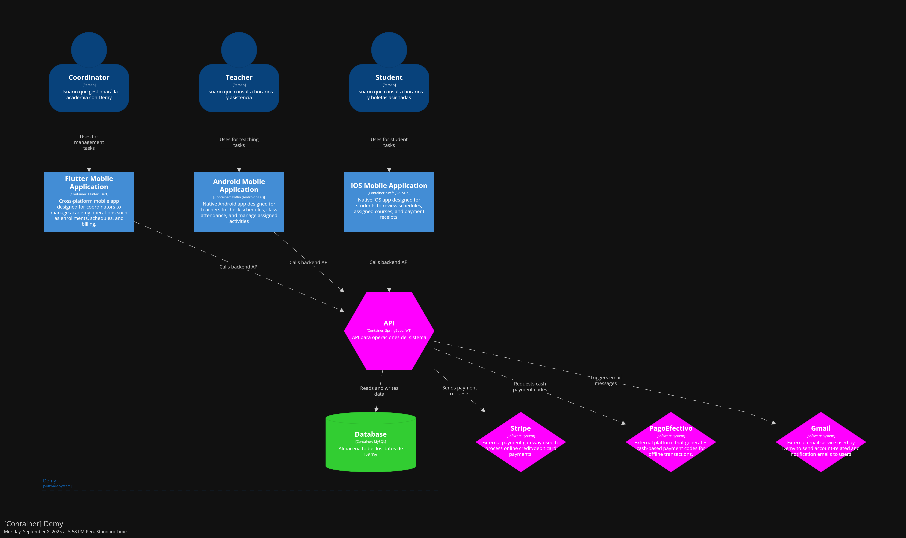
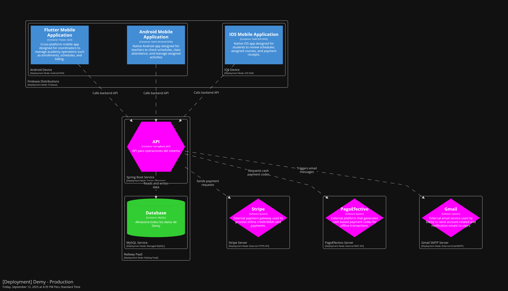

<h2 style="text-align: center;"> Universidad Peruana de Ciencias Aplicadas </h2>

  

<h4 style="text-align: center"> Ingeniería de Software </h4>

<h4 style="text-align: center"> CC238 - Aplicaciones para Dispositivos Móviles </h4>

<h4 style="text-align: center"> NRC: 1798  </h4>

<h4 style="text-align: center"> Docente: Jorge Luis Mayta Guillermo </h4>

<h4 style="text-align: center;"> Informe del Trabajo Final </h4>

<h4 style="text-align: center"> Startup: Nistra </h4>

<h4 style="text-align: center"> Producto: Demy </h4>

<h3 style="text-align: center">Team members:</h2>

  <table style="display:inline-table; border-collapse:collapse; text-align:center; width:550px;">
    <thead>
      <tr>
        <th style="padding:6px 12px;">Código</th>
        <th style="padding:6px 12px;">Nombre</th>
      </tr>
    </thead>
    <tbody>
      <tr>
        <td style="padding:6px 12px;">U202224135</td>
        <td style="padding:6px 12px;">Aponte Cruzado, Andrea Marielena</td>
      </tr>
      <tr>
        <td style="padding:6px 12px;">U20221G120</td>
        <td style="padding:6px 12px;">Crispin Ramos, Daniel Franco</td>
      </tr>
      <tr>
        <td style="padding:6px 12px;">U20201E843</td>
        <td style="padding:6px 12px;">Ramirez Mestanza, Salim Ignacio</td>
      </tr>
      <tr>
        <td style="padding:6px 12px;">U20221C486</td>
        <td style="padding:6px 12px;">Sulca Gonzales, Paúl Fernando</td>
      </tr>
      <tr>
        <td style="padding:6px 12px;">U20231A778</td>
        <td style="padding:6px 12px;">Vilca Saboya, Diego Alejandro</td>
      </tr>
    </tbody>
  </table>

<h5 style="text-align: center"> Ciclo 2025-20 </h5>

# Registro de Versiones del Informe

# Project Report Collaboration Insights

# Contenido

- [Capítulo I: Introducción](#capítulo-i-introducción)
    - [1.1. Startup Profile](#11-startup-profile)
        - [1.1.1. Descripción de la Startup](#111-descripción-de-la-startup)
        - [1.1.2. Perfiles de los integrantes del equipo](#112-perfiles-de-los-integrantes-del-equipo)
    - [1.2. Solution Profile](#12-solution-profile)
        - [1.2.1. Antecedentes y problemática](#121-antecedentes-y-problemática)
        - [1.2.2. Lean UX Process](#122-lean-ux-process)
            - [1.2.2.1. Lean UX Problem Statements](#1221-lean-ux-problem-statements)
            - [1.2.2.2. Lean UX Assumptions](#1222-lean-ux-assumptions)
            - [1.2.2.3. Lean UX Hypothesis](#1223-lean-ux-hypothesis)
            - [1.2.2.4. Lean UX Canvas](#1224-lean-ux-canvas)
    - [1.3. Segmentos objetivo](#13-segmentos-objetivo)

- [Capítulo II: Requirements Elicitation & Analysis](#capítulo-ii-requirements-elicitation--analysis)
    - [2.1. Competidores](#21-competidores)
        - [2.1.1. Análisis competitivo](#211-análisis-competitivo)
        - [2.1.2. Estrategias y tácticas frente a competidores](#212-estrategias-y-tácticas-frente-a-competidores)
    - [2.2. Entrevistas](#22-entrevistas)
        - [2.2.1. Diseño de entrevistas](#221-diseño-de-entrevistas)
        - [2.2.2. Registro de entrevistas](#222-registro-de-entrevistas)
        - [2.2.3. Análisis de entrevistas](#223-análisis-de-entrevistas)
    - [2.3. Needfinding](#23-needfinding)
        - [2.3.1. User Personas](#231-user-personas)
        - [2.3.2. User Task Matrix](#232-user-task-matrix)
        - [2.3.3. User Journey Mapping](#233-user-journey-mapping)
        - [2.3.4. Empathy Mapping](#234-empathy-mapping)
        - [2.3.5. As-is Scenario Mapping](#235-as-is-scenario-mapping)
    - [2.4. Ubiquitous Language](#24-ubiquitous-language)

- [Capítulo III: Requirements Specification](#capítulo-iii-requirements-specification)
    - [3.1. To-Be Scenario Mapping](#31-to-be-scenario-mapping)
    - [3.2. User Stories](#32-user-stories)
    - [3.3. Impact Mapping](#33-impact-mapping)
    - [3.4. Product Backlog](#34-product-backlog)

- [Capítulo IV: Solution Software Design](#capítulo-iv-solution-software-design)
    - [4.1. Strategic-Level Domain-Driven Design](#41-strategic-level-domain-driven-design)
        - [4.1.1. EventStorming](#411-eventstorming)
            - [4.1.1.1. Candidate Context Discovery](#4111-candidate-context-discovery)
            - [4.1.1.2. Domain Message Flows Modeling](#4112-domain-message-flows-modeling)
            - [4.1.1.3. Bounded Context Canvases](#4113-bounded-context-canvases)
        - [4.1.2. Context Mapping](#412-context-mapping)
        - [4.1.3. Software Architecture](#413-software-architecture)
            - [4.1.3.1. Software Architecture Context Level Diagrams](#4131-software-architecture-context-level-diagrams)
            - [4.1.3.2. Software Architecture Container Level Diagrams](#4132-software-architecture-container-level-diagrams)
            - [4.1.3.3. Software Architecture Deployment Diagrams](#4133-software-architecture-deployment-diagrams)
    - [4.2. Tactical-Level Domain-Driven Design](#42-tactical-level-domain-driven-design)
        - [4.2.X. Bounded Context: <Bounded Context Name>](#42x-bounded-context-bounded-context-name)
            - [4.2.X.1. Domain Layer](#42X1-domain-layer)
            - [4.2.X.2. Interface Layer](#42X2-interface-layer)
            - [4.2.X.3. Application Layer](#42X3-application-layer)
            - [4.2.X.4. Infrastructure Layer](#42X4-infrastructure-layer)
            - [4.2.X.5. Bounded Context Software Architecture Component Level Diagrams](#42X5-bounded-context-software-architecture-component-level-diagrams)
            - [4.2.X.6. Bounded Context Software Architecture Code Level Diagrams](#42X6-bounded-context-software-architecture-code-level-diagrams)
                - [4.2.X.6.1. Bounded Context Domain Layer Class Diagrams](#42X61-bounded-context-domain-layer-class-diagrams)
                - [4.2.X.6.2. Bounded Context Database Design Diagram](#42X62-bounded-context-database-design-diagram)

- [Conclusiones](#conclusiones)
    - [Conclusiones y recomendaciones](#conclusiones-y-recomendaciones)
- [Bibliografía](#bibliografía)
- [Anexos](#anexos)

# Student Outcome

# Objetivos SMART

# Capítulo I: Introducción

## 1.1. Startup Profile

### 1.1.1. Descripción de la Startup

Write here...

### 1.1.2. Perfiles de los integrantes del equipo

Write here...

## 1.2. Solution Profile

### 1.2.1. Antecedentes y problemática

Write here...

### 1.2.2. Lean UX Process

Write here...

#### 1.2.2.1 Lean UX Problem Statements

Write here...

#### 1.2.2.2. Lean UX Assumptions

Write here...

#### 1.2.2.3. Lean UX Hypothesis

Write here...

#### 1.2.2.4. Lean UX Canvas

Write here...

## 1.3. Segmentos objetivo

Write here...

# Capítulo II: Requirements Elicitation & Analysis

## 2.1. Competidores

### 2.1.1. Análisis competitivo

Write here...

### 2.1.2. Estrategias y tácticas frente a competidores

Write here...

## 2.2. Entrevistas

Write here...

### 2.2.1. Diseño de entrevistas

Write here...

### 2.2.2. Registro de entrevistas

Write here...

### 2.2.3. Análisis de entrevistas

Write here...

## 2.3. Needfinding

Write here...

### 2.3.1. User Personas

Write here...

### 2.3.2. User Task Matrix

Write here...

### 2.3.3. User Journey Mapping

Write here...

### 2.3.4. Empathy Mapping

Write here...

### 2.3.5. As-Is Scenario Mapping

Write here...

## 2.4. Ubiquitous Language

Write here...

# Capítulo III: Requirements Specification

## 3.1. To-Be Scenario Mapping.

Write here...

## 3.2. User Stories

Write here...

## 3.3. Impact Mapping

Write here...

## 3.4. Product Backlog

Write here...

# Capítulo IV: Solution Software Design

## 4.1. Strategic-Level Domain-Driven Design

Write here...

### 4.1.1. EventStorming

Write here...

#### 4.1.1.1. Candidate Context Discovery

Write here...

#### 4.1.1.2. Domain Message Flows Modeling

Write here...

#### 4.1.1.3. Bounded Context Canvases

Write here...

### 4.1.2. Context Mapping

Write here...

### 4.1.3. Software Architecture

En esta sección se presenta la arquitectura de software de Demy, diseñada bajo un enfoque basado en Domain-Driven Design (DDD) y representada mediante el C4 Model utilizando Structurizr DSL. La arquitectura ilustra cómo se estructura el sistema a distintos niveles de abstracción.

#### 4.1.3.1. Software Architecture Context Level Diagrams

El Context Diagram muestra como el sistema central que interactúa con tres usuarios principales: el coordinador, que gestiona matrículas, horarios y pagos; el docente, que consulta horarios y registra asistencia; y el estudiante, que revisa sus horarios y comprobantes. Además, el sistema se integra con Stripe y PagoEfectivo para la gestión de pagos y con Gmail para el envío de notificaciones por correo electrónico.

#### 4.1.3.2. Software Architecture Container Level Diagrams

El Container Diagram descompone la solución en sus principales contenedores: una Flutter App para coordinadores, una Android App para docentes y una iOS App para estudiantes, todas conectadas a un API Backend desarrollado en Spring Boot que concentra la lógica de negocio y accede a una base de datos MySQL para la información académica. El backend también se integra con Stripe y PagoEfectivo para pagos y con Gmail para notificaciones automáticas.

#### 4.1.3.3. Software Architecture Deployment Diagrams

El Deployment Diagram muestra la distribución física del sistema en producción, detallando cómo se despliegan los contenedores y servicios en la infraestructura y cómo interactúan entre sí. Las aplicaciones móviles (iOS, Android y Flutter) se ejecutan en los dispositivos de los usuarios y son distribuidas mediante Firebase, mientras que el backend en Spring Boot y la base de datos MySQL se alojan en Railway PaaS. Asimismo, se incluyen sistemas externos como Stripe, PagoEfectivo y Gmail. En conjunto, el diagrama ofrece una visión clara de la ubicación de los componentes y de los protocolos de comunicación empleados.

## 4.2. Tactical-Level Domain-Driven Design

Write here...

### 4.2.3. Bounded Context: Enrollment

Este bounded context se encarga de gestionar todo lo relacionado con la matricula de los estudiantes en los cursos ofrecidos por la institución educativa. Incluye la creación, actualización y eliminación de matrículas, así como la validación de requisitos previos y la generación de comprobantes de pago.

#### 4.2.3.1. Domain Layer 

Se describen los elementos del Domain Layer del contexto de Enrollment, que encapsula las reglas y logica del dominio relacionadas con la gestion de matriculas, periodos academicos y alumnos.

---
1. **`Enrollment` (Aggregate Root)**

Representa la matrícula de un estudiante en una academia, con su estado, estudiante, horario y período académico, incluyendo operaciones de gestión y validación.

**Atributos Principales:**

| Atributo     | Tipo               | Visibilidad | Descripción                                                  |
| ------------ | ------------------ | ----------- | ------------------------------------------------------------ |
| `id`         | `Long`             | `private`   | Identificador único de la matrícula.                         |
| `periodId`   | `AcademicPeriodId` | `private`   | Identificador del período académico asociado a la matrícula. |
| `studentId`  | `StudentId`        | `private`   | Identificador del estudiante asociado a la matrícula.        |
| `scheduleId` | `ScheduleId`       | `private`   | Identificador del horario asociado a la matrícula.           |
| `academyId`  | `AcademyId`        | `private`   | Identificador de la academia asociada a la matrícula.        |
| `status`     | `EnrollmentStatus` | `private`   | Estado actual de la matrícula.                               |
| `amount`     | `Money`            | `private`   | Monto a pagar o pagado correspondiente a la matrícula.       |

**Métodos principales:**

| Método                                      | Tipo de Retorno | Visibilidad | Descripción                                                       |
|---------------------------------------------|-----------------| ----------- |-------------------------------------------------------------------|
| `Enrollment()`                              | `Constructor`   | `protected` | Constructor protegido para uso exclusivo del repositorio.         |
| `Enrollment(CreateEnrollmentCommand)`       | `Constructor`   | `public`    | Constructor que instancia un `Enrollment` a partir de un command. |
| `UpdateEnrollment(UpdateEnrollmentCommand)` | `Enrollment`    | `public`    | Actualiza la información de un `Enrollment` a partir de un command. |

---
2. **`AcademicPeriod` (Aggregate Root)**

Representa un período académico dentro de una academia, incluyendo su nombre, duración y estado.

**Atributos Principales:**

| Atributo     | Tipo             | Visibilidad | Descripción                                                 |
| ------------ | ---------------- | ----------- | ----------------------------------------------------------- |
| `id`         | `Long`           | `private`   | Identificador único del período académico.                  |
| `periodName` | `String`         | `private`   | Nombre del período académico (ej. "2025-I").                |
| `duration`   | `PeriodDuration` | `private`   | Duración del período académico (fecha de inicio y fin).     |
| `status`     | `PeriodStatus`   | `private`   | Estado actual del período académico (activo/inactivo).      |
| `academyId`  | `AcademyId`      | `private`   | Identificador de la academia asociada al período académico. |

**Métodos principales:**

| Método                                             | Tipo de Retorno  | Visibilidad | Descripción                                                              |
|----------------------------------------------------|------------------|------------|--------------------------------------------------------------------------|
| `AcademicPeriod()`                                 | `Constructor`    | `protected` | Constructor protegido para uso por el repositorio.                       |
| `AcademicPeriod(CreateAcademicPeriodCommand)`      | `Constructor`    | `public`   | Constructor que instancia un `Academic Period` a partir de un command.                    |
| `UpdateAcademicPeriod(UpdateAcademicPeriodCommand)` | `AcademicPeriod` | `public`   | Actualiza la información de un `Academic Period` a partir de un command. |

---
3. **`Student` (Aggregate Root)**

| Atributo      | Tipo          | Visibilidad | Descripción                                                    |
| ------------- |---------------| ----------- | -------------------------------------------------------------- |
| `id`          | `Long`        | `private`   | Identificador único del estudiante.                            |
| `fullName`    | `FullName`    | `private`   | Nombre completo del estudiante.                                |
| `dni`         | `Dni`         | `private`   | Documento Nacional de Identidad (DNI) del estudiante.          |
| `sex`         | `Sex`         | `private`   | Sexo del estudiante.                                           |
| `birthDate`   | `LocalDate`   | `private`   | Fecha de nacimiento del estudiante.                            |
| `address`     | `String`       | `private`   | Dirección de domicilio del estudiante.                         |
| `phoneNumber` | `PhoneNumber` | `private`   | Número de teléfono del estudiante.                             |
| `email`       | `Email`       | `private`   | Correo electrónico del estudiante.                             |
| `academyId`   | `AcademyId`   | `private`   | Identificador de la academia a la que pertenece el estudiante. |

**Métodos principales:**

| Método                                    | Tipo de Retorno | Visibilidad | Descripción                                                       |
| ----------------------------------------- | --------------- | ----------- | ----------------------------------------------------------------- |
| `Student()`                               | `Constructor`   | `protected` | Constructor protegido para uso exclusivo del repositorio.         |
| `Student(CreateStudentCommand)`           | `Constructor`   | `public`    | Constructor que instancia un `Student` a partir de un command.    |
| `updateInformation(UpdateStudentCommand)` | `Student`       | `public`    | Actualiza la información de un estudiante a partir de un command. |

---

4. **`EnrollmentStatus` (Value Object)**

Representa el estado de una matrícula dentro del sistema académico.

**Atributos principales:**

| Atributo    | Tipo   | Visibilidad | Descripción                       |
| ----------- | ------ | ----------- | --------------------------------- |
| `ACTIVE`    | `Enum` | `public`    | La matrícula se encuentra activa. |
| `CANCELLED` | `Enum` | `public`    | La matrícula ha sido cancelada.   |
| `COMPLETED` | `Enum` | `public`    | La matrícula ha sido completada.  |

**Métodos principales:**

| Método          | Tipo de Retorno | Visibilidad | Descripción                                  |
| --------------- | --------------- | ----------- | -------------------------------------------- |
| `isActive()`    | `boolean`       | `public`    | Verifica si la matrícula está activa.        |
| `isCancelled()` | `boolean`       | `public`    | Verifica si la matrícula ha sido cancelada.  |
| `isCompleted()` | `boolean`       | `public`    | Verifica si la matrícula ha sido completada. |

---

5. **`PeriodDuration` (Value Object)**

Representa la duración de un período académico mediante fechas de inicio y fin.

**Atributos principales:**

| Atributo    | Tipo        | Visibilidad | Descripción                        |
| ----------- | ----------- | ----------- | ---------------------------------- |
| `startDate` | `LocalDate` | `private`   | Fecha de inicio del período.       |
| `endDate`   | `LocalDate` | `private`   | Fecha de finalización del período. |

**Métodos principales:**

| Método                | Tipo de Retorno | Visibilidad | Descripción                                                                 |
| --------------------- | --------------- | ----------- | --------------------------------------------------------------------------- |
| `isCurrentlyActive()` | `boolean`       | `public`    | Verifica si la fecha actual está dentro del rango de duración del período.  |
| `getDurationInDays()` | `long`          | `public`    | Devuelve la cantidad de días entre la fecha de inicio y la de finalización. |

---

6. **`PeriodStatus` (Value Object)**

Representa si un período académico se encuentra activo o inactivo.

**Atributos principales:**

| Atributo   | Tipo      | Visibilidad | Descripción                                   |
| ---------- | --------- | ----------- | --------------------------------------------- |
| `isActive` | `Boolean` | `private`   | Indica si el período está actualmente activo. |

**Métodos principales:**

| Método       | Tipo de Retorno | Visibilidad | Descripción                                          |
| ------------ | --------------- | ----------- | ---------------------------------------------------- |
| `active()`   | `PeriodStatus`  | `public`    | Crea un objeto con el período marcado como activo.   |
| `inactive()` | `PeriodStatus`  | `public`    | Crea un objeto con el período marcado como inactivo. |
| `isActive()` | `boolean`       | `public`    | Retorna `true` si el período se encuentra activo.    |

---
7. **`EnrollmentCommandService` (Domain Service)**

Proporciona métodos para ejecutar comandos relacionados con la gestión de matrículas.

**Métodos principales:**
| Método                                    | Tipo de Retorno        | Visibilidad | Descripción                                                    |
|-------------------------------------------|------------------------|------------|----------------------------------------------------------------|
| `handle(CreateEnrollmentCommand command)` | `Long`   | `public`   | Crea una nueva matricula en la academica a partir de un command. |
| `handle(DeleteEnrollmentCommand command)` | `void`                 | `public`   | Asigna una nueva boleta a una cuenta de facturación.           |
| `handle(UpdateEnrollmentCommand command)` | `Optional<Enrollment>` | `public`   | Registra un pago en una cuenta de facturación.                 |

---
8. **`EnrollmentQueryService` (Domain Service)**

Proporciona métodos para consultar información de matrículas.

**Metodos principales:**

| Método                                             | Tipo de Retorno        | Visibilidad | Descripción                                                       |
| -------------------------------------------------- | ---------------------- | ----------- | ----------------------------------------------------------------- |
| `handle(GetAllEnrollmentsByStudentIdQuery query)`  | `List<Enrollment>`     | `public`    | Obtiene todas las matrículas asociadas a un estudiante (por ID).  |
| `handle(GetAllEnrollmentsQuery query)`             | `List<Enrollment>`     | `public`    | Obtiene todas las matrículas del sistema.                         |
| `handle(GetEnrollmentByIdQuery query)`             | `Optional<Enrollment>` | `public`    | Obtiene una matrícula específica por su identificador.            |
| `handle(GetAllEnrollmentsByStudentDniQuery query)` | `List<Enrollment>`     | `public`    | Obtiene todas las matrículas asociadas a un estudiante (por DNI). |

---
9. **`AcademicPeriodCommandService` (Domain Service)**

Proporciona métodos para ejecutar comandos relacionados con la gestión de períodos académicos.

**Metodos principales:**

| Método                                        | Tipo de Retorno            | Visibilidad | Descripción                                             |
| --------------------------------------------- | -------------------------- | ----------- |---------------------------------------------------------|
| `handle(CreateAcademicPeriodCommand command)` | `Long` | `public`    | Crea un nuevo período académico a partir de un command. |
| `handle(DeleteAcademicPeriodCommand command)` | `void`                     | `public`    | Elimina un período académico existente.                 |
| `handle(UpdateAcademicPeriodCommand command)` | `Optional<AcademicPeriod>` | `public`    | Actualiza los datos de un período académico existente.  |

---
10. **`AcademicPeriodQueryService` (Domain Service)**

Proporciona métodos para consultar información de los períodos académicos.

**Metodos principales:**

| Método                                     | Tipo de Retorno            | Visibilidad | Descripción                                        |
| ------------------------------------------ | -------------------------- | ----------- | -------------------------------------------------- |
| `handle(GetAcademicPeriodByIdQuery query)` | `Optional<AcademicPeriod>` | `public`    | Obtiene un período académico por su identificador. |
| `handle(GetAllAcademicPeriodsQuery query)` | `List<AcademicPeriod>`     | `public`    | Obtiene la lista completa de períodos académicos.  |

---
11. **`StudentCommandService` (Domain Service)**

Proporciona métodos para ejecutar comandos relacionados con la gestión de estudiantes.

**Métodos principales:**

| Método                                 | Tipo de Retorno     | Visibilidad | Descripción                                          |
| -------------------------------------- | ------------------- | ----------- |------------------------------------------------------|
| `handle(CreateStudentCommand command)` | `Long` | `public`    | Crea un nuevo estudiante a partir de un command.     |
| `handle(DeleteStudentCommand command)` | `void`              | `public`    | Elimina un estudiante existente.                     |
| `handle(UpdateStudentCommand command)` | `Optional<Student>` | `public`    | Actualiza la información de un estudiante existente. |

---
12. **`StudentQueryService` (Domain Service)**

Proporciona métodos para consultar información de estudiantes.

**Métodos principales:**

| Método                               | Tipo de Retorno     | Visibilidad | Descripción                                           |
| ------------------------------------ | ------------------- | ----------- | ----------------------------------------------------- |
| `handle(GetStudentByIdQuery query)`  | `Optional<Student>` | `public`    | Obtiene un estudiante por su identificador.           |
| `handle(GetAllStudentsQuery query)`  | `List<Student>`     | `public`    | Obtiene la lista completa de estudiantes registrados. |
| `handle(GetStudentByDniQuery query)` | `Optional<Student>` | `public`    | Obtiene un estudiante a partir de su DNI.             |

#### 4.2.X.2. Interface Layer

Write here...

#### 4.2.X.3. Application Layer

Write here...

#### 4.2.X.4. Infrastructure Layer

Write here...

#### 4.2.X.5. Bounded Context Software Architecture Component Level Diagrams

Write here...

#### 4.2.X.6. Bounded Context Software Architecture Code Level Diagrams

Write here...

#### 4.2.X.6.1. Bounded Context Domain Layer Class Diagrams

Write here...

#### 4.2.X.6.2. Bounded Context Database Design Diagram

Write here...
## Conclusiones y Recomendaciones

Write here...

### Conclusiones

Write here...

### Recomendaciones

Write here...

# Bibliografía

Write here...

# Anexos

Write here...