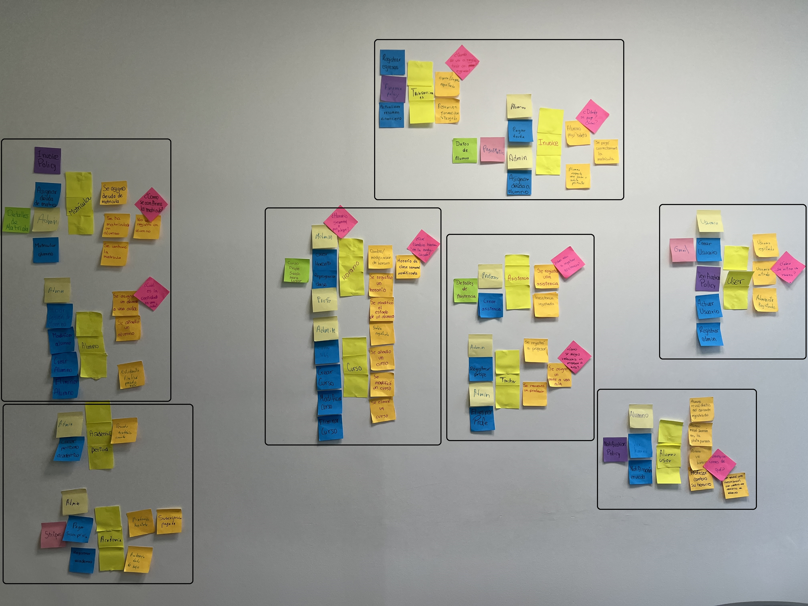
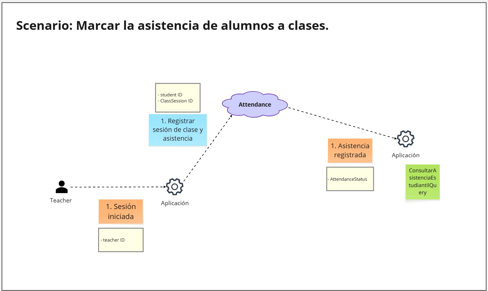
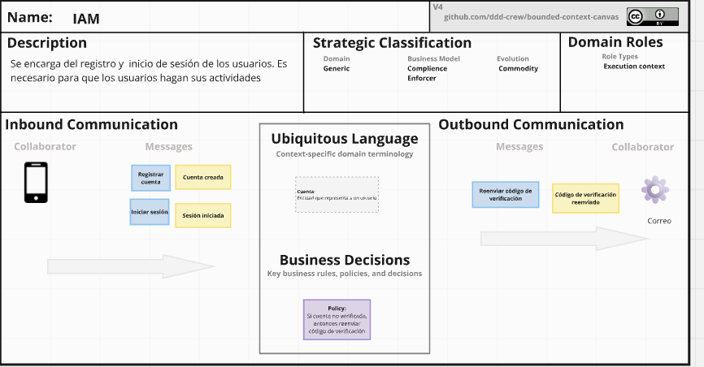
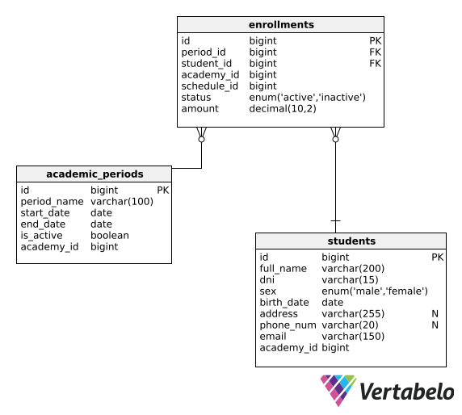

<h2 style="text-align: center;"> Universidad Peruana de Ciencias Aplicadas </h2>

<div style="text-align: center;">
  
</div>

<h4 style="text-align: center"> Ingeniería de Software </h4>

<h4 style="text-align: center"> 1ACC0238 - Aplicaciones para Dispositivos Móviles </h4>

<h4 style="text-align: center"> NRC: 1798  </h4>

<h4 style="text-align: center"> Docente: Jorge Luis Mayta Guillermo </h4>

<h4 style="text-align: center;"> Informe del Trabajo Final </h4>

<h4 style="text-align: center"> Startup: Nistra </h4>

<h4 style="text-align: center"> Producto: Demy </h4>

<h4 style="text-align: center">Team members:</h4>

<div style="text-align:center; margin: 20px 0; font-size: 90%;">
  <table style="display:inline-table; border-collapse:collapse; text-align:center; width:550px;">
    <thead>
      <tr>
        <th style="padding:6px 12px;">Código</th>
        <th style="padding:6px 12px;">Nombre</th>
      </tr>
    </thead>
    <tbody>
      <tr>
        <td style="padding:6px 12px;">U202224135</td>
        <td style="padding:6px 12px;">Aponte Cruzado, Andrea Marielena</td>
      </tr>
      <tr>
        <td style="padding:6px 12px;">U20221G120</td>
        <td style="padding:6px 12px;">Crispin Ramos, Daniel Franco</td>
      </tr>
      <tr>
        <td style="padding:6px 12px;">U20201E843</td>
        <td style="padding:6px 12px;">Ramirez Mestanza, Salim Ignacio</td>
      </tr>
      <tr>
        <td style="padding:6px 12px;">U20221C486</td>
        <td style="padding:6px 12px;">Sulca Gonzales, Paúl Fernando</td>
      </tr>
      <tr>
        <td style="padding:6px 12px;">U20231A778</td>
        <td style="padding:6px 12px;">Vilca Saboya, Diego Alejandro</td>
      </tr>
    </tbody>
  </table>
</div>

<h5 style="text-align: center"> Ciclo 2025-20 </h5>

<hr class="page-break">

# Registro de Versiones del Informe

| Versión | Fecha       | Autor                                                                      | Descripción de modificación                                                       |
|---------|-------------|----------------------------------------------------------------------------|-----------------------------------------------------------------------------------|
| 1.0     | 30/08/2025  | Salim Ramirez                                                              | Creación inicial de la estructura del informe                                     |
| 2.0     | 06/09/2025  | Andrea Aponte, Daniel Crispin, Salim Ramirez, Paúl Sulca, Diego Vilca      | Se completó el Capítulo I: Presentación                                           |
| 3.0     | 17/09/2025  | Andrea Aponte, Daniel Crispin, Salim Ramirez, Paúl Sulca, Diego Vilca      | Se completó el CapÍtulo II: Requirements Development and Software Solution Design |
| 3.1     | 28/09/2025  | Andrea Aponte, Daniel Crispin, Salim Ramirez, Paúl Sulca, Diego Vilca      | Se levantó las observaciones de la primera entrega                                |
| 4.0     | 4/10/2025   | Andrea Aponte, Daniel Crispin, Salim Ramirez, Paúl Sulca, Diego Vilca      | Se completó el CapÍtulo III:  Solution UI/UX Design                               |        
| 5.0     | 7/10/2025   | Andrea Aponte, Daniel Crispin, Salim Ramirez, Paúl Sulca, Diego Vilca      | Se completó el Capítulo IV: : Product Implementation & Validation                 |  

<hr class="page-break">

# Project Report Collaboration Insights

En esta sección se presenta un resumen de las actividades de colaboración realizadas para la elaboración del informe del proyecto.

Se utilizó **GitHub** como plataforma de control de versiones y colaboración en equipo. Se incluye enlace para acceder al repositorio para el reporte del proyecto. [Ver en Github](https://github.com/nistrahq/demy-report)

Los integrantes del equipo y sus nombres de usuario en GitHub son los siguientes:

| Integrantes                      | Nombre en GitHub |
|----------------------------------|------------------|
| Aponte Cruzado, Andrea Marielena | iconicmiau       |
| Crispin Ramos, Daniel Franco     | danielcr04       |
| Ramirez Mestanza, Salim Ignacio  | salimramirez     |
| Sulca Gonzales, Paúl Fernando    | Kyrubi           |
| Vilca Saboya, Diego Alejandro    | diesoks          |

Se usó el flujo de trabajo **GitFlow**, que incluye las siguientes ramas principales:

- **main:** Rama principal que contiene la versión estable y consolidada del documento.
- **develop:** Rama de integración utilizada para fusionar los cambios realizados en las ramas de características.
- **feature/tbX-daniel:** Rama utilizada por Daniel para el desarrollo de las tareas correspondientes para una determinada entrega.
- **feature/tbX-diego:** Rama utilizada por Diego para el desarrollo de las tareas correspondientes para una determinada entrega.
- **feature/tbX-paul:** Rama utilizada por Paul para el desarrollo de las tareas correspondientes para una determinada entrega.
- **feature/tbX-andrea:** Rama utilizada por Andrea para el desarrollo de las tareas correspondientes para una determinada entrega.
- **feature/tbX-salim:** Rama utilizada por Salim para el desarrollo de las tareas correspondientes para una determinada entrega.
- **release/vX.X.X:** Rama creada para preparar versiones candidatas al reporte final, siguiendo *Semantic Versioning 2.0.0*. En esta rama se realizan ajustes finales como correcciones menores y revisiones antes de integrarla a `main`.
- **hotfix/urgent-fix:** Rama utilizada para aplicar correcciones críticas directamente sobre `main`, asegurando la estabilidad de la versión publicada.

## TB1

**Tareas**

Para el desarrollo del TB1, cada participante del equipo realizó las siguientes tareas:

| Integrantes                      | Tarea asignada                                                                                                                                                                                                                                                                 |
|----------------------------------|--------------------------------------------------------------------------------------------------------------------------------------------------------------------------------------------------------------------------------------------------------------------------------|
| Aponte Cruzado, Andrea Marielena | - Diseño de entrevistas <br> - Registro de entrevistas <br> - Análisis de Entrevistas <br> - User personas <br> - User Task Matrix <br> - User Journey Mapping <br> - Empathy Mapping   <br> - Domain Message Flow  Modeling <br> - Tactical Level DDD for Institution Context |
| Crispin Ramos, Daniel Franco     | - Startup Profile <br> - Solution Profile <br> - Segmentos objetivo <br> - Competidores <br> - Ubiquitous Language <br> - Impact mapping  <br> -  Context Mapping <br> - Tactical Level DDD for Scheduling Context                                                             |
| Ramirez Mestanza, Salim Ignacio  | - User stories <br> - Product Backlog <br> - Event Storming documentation <br> - Candidate Context Discovery <br> - Tactical Level DDD for Billing Context and Accounting Context                                                                                              |
| Sulca Gonzales, Paúl Fernando    | - Software Architecture Context Diagram <br> - Software Architecture Container Diagrams <br> - Software Architecture Deployments Diagrams <br> - Tactical Level DDD for Enrollment Context                                                                                     |
| Vilca Saboya, Diego Alejandro    | - Registro de versiones del informe <br> - Project Report Collaboration Insights <br> - Student Outcome documentation <br> - Objetivos Smart documentation <br> - Bounded Context Canvases <br> - Tactical Level DD for Attendance Context                                     |                                                  

**GitHub Collaboration Insights**

En GitHub se presenta un timeline de las principales ramas creadas por cada integrante del equipo, así como los procesos de merge realizados.  
Todas las ramas fueron gestionadas siguiendo el flujo de trabajo **GitFlow**, adaptado para una organización que utiliza un sistema de control de versiones.  

<div style="text-align: center; margin-top: 1rem; margin-bottom: 1rem;">

Gráfico de red (*network graph*) de ramas en el repositorio de GitHub.


</div>

A continuación, se presentan los gráficos que muestran el análisis de los commits en el repositorio correspondiente al informe.  
Estos gráficos detallan la cantidad de líneas de código añadidas por cada miembro del equipo y la actividad de commits registrada.

<div style="text-align: center; margin-top: 1rem; margin-bottom: 1rem;">

Análisis de líneas de código añadidas por contribuyente.


</div>

El siguiente gráfico muestra la cantidad de commits realizados en la semana con mayor actividad en el proyecto.

<div style="text-align: center; margin-top: 1rem; margin-bottom: 1rem;">

Análisis de cantidad de commits realizados por semana.


</div>

<hr class="page-break">

## TP1

**Tareas**

Para el desarrollo del TP1, cada participante del equipo realizó las siguientes tareas:

| Integrantes                      | Tarea asignada                                                                                                                                                                               |
|----------------------------------|----------------------------------------------------------------------------------------------------------------------------------------------------------------------------------------------|
| Aponte Cruzado, Andrea Marielena | - Wireframes y Mock-ups de la Landing Page <br> - Wireframes y Mock-ups de la App para Estudiantes <br> - Wireflow y User Flow Diagrams de la App para Estudiantes                           |
| Crispin Ramos, Daniel Franco     | - Wireframes y Mock-ups de la App para Docentes <br> - Wireflow y User Flow Diagrams de la App para Docentes <br> - Prototipo de Alta Fidelidad de la App para Docentes                      |
| Ramirez Mestanza, Salim Ignacio  | - Style guidelines general <br> - Protitipos de alta fidelidad de las aplicaciones para estudiantes y docentes <br> - Presentación final del TP1                                             |
| Sulca Gonzales, Paúl Fernando    | - Source code management en GitHub <br> - Documentación del proyecto en GitHub <br> - Presentación final del TP1                                                                             |
| Vilca Saboya, Diego Alejandro    | - Wireframes y Mock-ups de la App para Administradores <br> - Wireflow y User Flow Diagrams de la App para Administradores <br> - Prototipo de Alta Fidelidad de la App para Administradores |

**GitHub Collaboration Insights**

Se puede observar la colaboración del equipo en el desarrollo del proyecto a través de la plataforma GitHub. Esta sección destaca las contribuciones individuales y colectivas de los miembros del equipo, así como la gestión del código fuente mediante ramas y merges.

<div style="text-align: center; margin-top: 1rem; margin-bottom: 1rem;">

Gráfico de Pulse Insights del repositorio de GitHub.


</div>

En GitHub se presenta un timeline de las principales ramas creadas por cada integrante del equipo, así como los procesos de merge realizados.  
Todas las ramas fueron gestionadas siguiendo el flujo de trabajo **GitFlow**, adaptado para una organización que utiliza un sistema de control de versiones.

<div style="text-align: center; margin-top: 1rem; margin-bottom: 1rem;">

Gráfico de red (*network graph*) de ramas en el repositorio de GitHub.


</div>

A continuación, se presentan los gráficos que muestran el análisis de los commits en el repositorio correspondiente al informe.  
Estos gráficos detallan la cantidad de líneas de código añadidas por cada miembro del equipo y la actividad de commits registrada.

<div style="text-align: center; margin-top: 1rem; margin-bottom: 1rem;">

Análisis de líneas de código añadidas por contribuyente.


</div>

El siguiente gráfico muestra la cantidad de commits realizados en la semana con mayor actividad en el proyecto.

<div style="text-align: center; margin-top: 1rem; margin-bottom: 1rem;">

Análisis de cantidad de commits realizados por semana.


</div>

<hr class="page-break">

# Contenido

- [Capítulo I: Presentación](#capítulo-i-presentación)
    - [1.1. Startup Profile](#11-startup-profile)
        - [1.1.1. Descripción de la Startup](#111-descripción-de-la-startup)
        - [1.1.2. Perfiles de los integrantes del equipo](#112-perfiles-de-los-integrantes-del-equipo)
    - [1.2. Solution Profile](#12-solution-profile)
        - [1.2.1. Antecedentes y problemática](#121-antecedentes-y-problemática)
        - [1.2.2. Lean UX Process](#122-lean-ux-process)
            - [1.2.2.1. Lean UX Problem Statements](#1221-lean-ux-problem-statements)
            - [1.2.2.2. Lean UX Assumptions](#1222-lean-ux-assumptions)
            - [1.2.2.3. Lean UX Hypothesis](#1223-lean-ux-hypothesis)
            - [1.2.2.4. Lean UX Canvas](#1224-lean-ux-canvas)
    - [1.3. Segmentos objetivo](#13-segmentos-objetivo)

- [Capítulo II: Requirements Development and Software Solution Design](#capítulo-ii-requirements-development-and-software-solution-design)
    - [2.1. Competidores](#21-competidores)
        - [2.1.1. Análisis competitivo](#211-análisis-competitivo)
        - [2.1.2. Estrategias y tácticas frente a competidores](#212-estrategias-y-tácticas-frente-a-competidores)
    - [2.2. Entrevistas](#22-entrevistas)
        - [2.2.1. Diseño de entrevistas](#221-diseño-de-entrevistas)
        - [2.2.2. Registro de entrevistas](#222-registro-de-entrevistas)
        - [2.2.3. Análisis de entrevistas](#223-análisis-de-entrevistas)
    - [2.3. Needfinding](#23-needfinding)
        - [2.3.1. User Personas](#231-user-personas)
        - [2.3.2. User Task Matrix](#232-user-task-matrix)
        - [2.3.3. User Journey Mapping](#233-user-journey-mapping)
        - [2.3.4. Empathy Mapping](#234-empathy-mapping)
        - [2.3.5. Ubiquitous Language](#235-ubiquitous-language)
    - [2.4. Requirements specification](#24-requirements-specification)
        - [2.4.1. User Stories](#241-user-stories)
        - [2.4.2. Impact Mapping](#242-impact-mapping)
        - [2.4.3. Product Backlog](#243-product-backlog)
    - [2.5. Strategic-Level Domain-Driven Design](#25-strategic-level-domain-driven-design)
        - [2.5.1. EventStorming](#251-eventstorming)
            - [2.5.1.1. Candidate Context Discovery](#2511-candidate-context-discovery)
            - [2.5.1.2. Domain Message Flows Modeling](#2512-domain-message-flows-modeling)
            - [2.5.1.3. Bounded Context Canvases](#2513-bounded-context-canvases)
        - [2.5.2. Context Mapping](#252-context-mapping)
        - [2.5.3. Software Architecture](#253-software-architecture)
            - [2.5.3.1. Software Architecture Context Level Diagrams](#2531-software-architecture-context-level-diagrams)
            - [2.5.3.2. Software Architecture Container Level Diagrams](#2532-software-architecture-container-level-diagrams)
            - [2.5.3.3. Software Architecture Deployment Diagrams](#2533-software-architecture-deployment-diagrams)
    - [2.6. Tactical-Level Domain-Driven Design](#26-tactical-level-domain-driven-design)
        - [2.6.1. Bounded Context: Institution](#261-bounded-context-institution)
            - [2.6.1.1. Domain Layer](#2611-domain-layer)
            - [2.6.1.2. Interface Layer](#2612-interface-layer)
            - [2.6.1.3. Application Layer](#2613-application-layer)
            - [2.6.1.4. Infrastructure Layer](#2614-infrastructure-layer)
            - [2.6.1.5. Bounded Context Software Architecture Component Level Diagrams](#2615-bounded-context-software-architecture-component-level-diagrams)
            - [2.6.1.6. Bounded Context Software Architecture Code Level Diagrams](#2616-bounded-context-software-architecture-code-level-diagrams)
                - [2.6.1.6.1. Bounded Context Domain Layer Class Diagrams](#26161-bounded-context-domain-layer-class-diagrams)
                - [2.6.1.6.2. Bounded Context Database Design Diagram](#26162-bounded-context-database-design-diagram)
        - [2.6.2. Bounded Context: IAM](#262-bounded-context-iam)
            - [2.6.2.1. Domain Layer](#2621-domain-layer)
            - [2.6.2.2. Interface Layer](#2622-interface-layer)
            - [2.6.2.3. Application Layer](#2623-application-layer)
            - [2.6.2.4. Infrastructure Layer](#2624-infrastructure-layer)
            - [2.6.2.5. Bounded Context Software Architecture Component Level Diagrams](#2625-bounded-context-software-architecture-component-level-diagrams)
            - [2.6.2.6. Bounded Context Software Architecture Code Level Diagrams](#2626-bounded-context-software-architecture-code-level-diagrams)
                - [2.6.2.6.1. Bounded Context Domain Layer Class Diagrams](#26261-bounded-context-domain-layer-class-diagrams)
                - [2.6.2.6.2. Bounded Context Database Design Diagram](#26262-bounded-context-database-design-diagram)
        - [2.6.3. Bounded Context: Enrollment](#263-bounded-context-enrollment)
            - [2.6.3.1. Domain Layer](#2631-domain-layer)
            - [2.6.3.2. Interface Layer](#2632-interface-layer)
            - [2.6.3.3. Application Layer](#2633-application-layer)
            - [2.6.3.4. Infrastructure Layer](#2634-infrastructure-layer)
            - [2.6.3.5. Bounded Context Software Architecture Component Level Diagrams](#2635-bounded-context-software-architecture-component-level-diagrams)
            - [2.6.3.6. Bounded Context Software Architecture Code Level Diagrams](#2636-bounded-context-software-architecture-code-level-diagrams)
                - [2.6.3.6.1. Bounded Context Domain Layer Class Diagrams](#26361-bounded-context-domain-layer-class-diagrams)
                - [2.6.3.6.2. Bounded Context Database Design Diagram](#26362-bounded-context-database-design-diagram)
        - [2.6.4. Bounded Context: Attendance](#264-bounded-context-attendance)
            - [2.6.4.1. Domain Layer](#2641-domain-layer)
            - [2.6.4.2. Interface Layer](#2642-interface-layer)
            - [2.6.4.3. Application Layer](#2643-application-layer)
            - [2.6.4.4. Infrastructure Layer](#2644-infrastructure-layer)
            - [2.6.4.5. Bounded Context Software Architecture Component Level Diagrams](#2645-bounded-context-software-architecture-component-level-diagrams)
            - [2.6.4.6. Bounded Context Software Architecture Code Level Diagrams](#2646-bounded-context-software-architecture-code-level-diagrams)
                - [2.6.4.6.1. Bounded Context Domain Layer Class Diagrams](#26461-bounded-context-domain-layer-class-diagrams)
                - [2.6.4.6.2. Bounded Context Database Design Diagram](#26462-bounded-context-database-design-diagram)
        - [2.6.5. Bounded Context: Scheduling](#265-bounded-context-scheduling)
            - [2.6.5.1. Domain Layer](#2651-domain-layer)
            - [2.6.5.2. Interface Layer](#2652-interface-layer)
            - [2.6.5.3. Application Layer](#2653-application-layer)
            - [2.6.5.4. Infrastructure Layer](#2654-infrastructure-layer)
            - [2.6.5.5. Bounded Context Software Architecture Component Level Diagrams](#2655-bounded-context-software-architecture-component-level-diagrams)
            - [2.6.5.6. Bounded Context Software Architecture Code Level Diagrams](#2656-bounded-context-software-architecture-code-level-diagrams)
                - [2.6.5.6.1. Bounded Context Domain Layer Class Diagrams](#26561-bounded-context-domain-layer-class-diagrams)
                - [2.6.5.6.2. Bounded Context Database Design Diagram](#26562-bounded-context-database-design-diagram)
        - [2.6.6. Bounded Context: Billing](#266-bounded-context-billing)
            - [2.6.6.1. Domain Layer](#2661-domain-layer)
            - [2.6.6.2. Interface Layer](#2662-interface-layer)
            - [2.6.6.3. Application Layer](#2663-application-layer)
            - [2.6.6.4. Infrastructure Layer](#2664-infrastructure-layer)
            - [2.6.6.5. Bounded Context Software Architecture Component Level Diagrams](#2665-bounded-context-software-architecture-component-level-diagrams)
            - [2.6.6.6. Bounded Context Software Architecture Code Level Diagrams](#2666-bounded-context-software-architecture-code-level-diagrams)
                - [2.6.6.6.1. Bounded Context Domain Layer Class Diagrams](#26661-bounded-context-domain-layer-class-diagrams)
                - [2.6.6.6.2. Bounded Context Database Design Diagram](#26662-bounded-context-database-design-diagram)
        - [2.6.7. Bounded Context: Accounting & Finance](#267-bounded-context-accounting--finance)
            - [2.6.7.1. Domain Layer](#2671-domain-layer)
            - [2.6.7.2. Interface Layer](#2672-interface-layer)
            - [2.6.7.3. Application Layer](#2673-application-layer)
            - [2.6.7.4. Infrastructure Layer](#2674-infrastructure-layer)
            - [2.6.7.5. Bounded Context Software Architecture Component Level Diagrams](#2675-bounded-context-software-architecture-component-level-diagrams)
            - [2.6.7.6. Bounded Context Software Architecture Code Level Diagrams](#2676-bounded-context-software-architecture-code-level-diagrams)
                - [2.6.7.6.1. Bounded Context Domain Layer Class Diagrams](#26761-bounded-context-domain-layer-class-diagrams)
                  - [2.6.7.6.2. Bounded Context Database Design Diagram](#26762-bounded-context-database-design-diagram)

- [Capítulo III: Solution UI/UX Design](#capítulo-iii-solution-uiux-design)
    - [3.1. Product design](#31-product-design)
        - [3.1.1. Style Guidelines](#311-style-guidelines)
            - [3.1.1.1. General Style Guidelines](#3111-general-style-guidelines)
        - [3.1.2. Information Architecture](#312-information-architecture)
            - [3.1.2.1. Organization Systems](#3121-organization-systems)
            - [3.1.2.2. Labelling Systems](#3122-labelling-systems)
            - [3.1.2.3. SEO Tags and Meta Tags](#3123-seo-tags-and-meta-tags)
            - [3.1.2.4. Searching Systems](#3124-searching-systems)
            - [3.1.2.5. Navigation Systems](#3125-navigation-systems)
        - [3.1.3. Landing Page UI Design](#313-landing-page-ui-design)
            - [3.1.3.1. Landing Page Wireframe](#3131-landing-page-wireframe)
            - [3.1.3.2. Landing Page Mock-up](#3132-landing-page-mock-up)
        - [3.1.4. Mobile Applications UX/UI Design](#314-mobile-applications-uxui-design)
            - [3.1.4.1. Mobile Applications Wireframes](#3141-mobile-applications-wireframes)
            - [3.1.4.2. Mobile Applications Wireflow Diagrams](#3142-mobile-applications-wireflow-diagrams)
            - [3.1.4.3. Mobile Applications Mock-ups](#3143-mobile-applications-mock-ups)
            - [3.1.4.4. Mobile Applications User Flow Diagrams](#3144-mobile-applications-user-flow-diagrams)
            - [3.1.4.5. Mobile Applications Prototyping](#3145-mobile-applications-prototyping)

- [Capítulo IV: Product Implementation & Validation](#capítulo-iv-product-implementation--validation)
    - [4.1. Software Configuration Management](#41-software-configuration-management)
        - [4.1.1. Software Development Environment Configuration](#411-software-development-environment-configuration)
        - [4.1.2. Source Code Management](#412-source-code-management)
        - [4.1.3. Source Code Style Guide & Conventions](#413-source-code-style-guide--conventions)
        - [4.1.4. Software Deployment Configuration](#414-software-deployment-configuration)
    - [4.2. Landing Page & Mobile Application Implementation](#42-landing-page--mobile-application-implementation)
        - [4.2.1. Sprint 1](#421-sprint-1)
            - [4.2.1.1. Sprint Planning 1](#4211-sprint-planning-1)
            - [4.2.1.2. Sprint Backlog 1](#4212-sprint-backlog-1)
            - [4.2.1.3. Development Evidence for Sprint Review](#4213-development-evidence-for-sprint-review)
            - [4.2.1.4. Testing Suite Evidence for Sprint Review](#4214-testing-suite-evidence-for-sprint-review)
            - [4.2.1.5. Execution Evidence for Sprint Review](#4215-execution-evidence-for-sprint-review)
            - [4.2.1.6. Services Documentation Evidence for Sprint Review](#4216-services-documentation-evidence-for-sprint-review)
            - [4.2.1.7. Software Deployment Evidence for Sprint Review](#4217-software-deployment-evidence-for-sprint-review)
            - [4.2.1.8. Team Collaboration Insights during Sprint](#4218-team-collaboration-insights-during-sprint)
        - [4.2.2. Sprint 2](#422-sprint-2)
            - [4.2.2.1. Sprint Planning 2](#4221-sprint-planning-2)
            - [4.2.2.2. Sprint Backlog 2](#4222-sprint-backlog-2)
            - [4.2.2.3. Development Evidence for Sprint Review](#4223-development-evidence-for-sprint-review)
            - [4.2.2.4. Testing Suite Evidence for Sprint Review](#4224-testing-suite-evidence-for-sprint-review)
            - [4.2.2.5. Execution Evidence for Sprint Review](#4225-execution-evidence-for-sprint-review)
            - [4.2.2.6. Services Documentation Evidence for Sprint Review](#4226-services-documentation-evidence-for-sprint-review)
            - [4.2.2.7. Software Deployment Evidence for Sprint Review](#4227-software-deployment-evidence-for-sprint-review)
            - [4.2.2.8. Team Collaboration Insights during Sprint](#4228-team-collaboration-insights-during-sprint)
        - [4.3. Validation Interviews](#43-validation-interviews)
            - [4.3.1. Diseño de Entrevistas](#431-diseño-de-entrevistas)
            - [4.3.2. Registro de Entrevistas](#432-registro-de-entrevistas)
            - [4.3.3. Evaluaciones según heurísticas](#433-evaluaciones-según-heurísticas)

- [Conclusiones](#conclusiones)
    - [Conclusiones y recomendaciones](#conclusiones-y-recomendaciones)
    - [Video App Validation](#video-app-validation)
    - [Video About the product](#video-about-the-product)
    - [Video About the team](#video-about-the-team)
- [Glosario](#glosario)
- [Bibliografía](#bibliografía)
- [Anexos](#anexos)
    - [Anexo A: Código Fuente](#anexo-a-código-fuente)
    - [Anexo B: Videos en Microsoft Streams](#anexo-b-videos-en-microsoft-streams)
    - [Anexo C: Detalle de Spike Stories](#anexo-c-detalle-de-spike-stories)

<hr class="page-break">

# Student Outcome

En el siguiente cuadro se describe las acciones realizadas y enunciados de conclusiones por parte del grupo, que permiten sustentar el haber alcanzado el logro del ABET – EAC - Student Outcome 7

| Criterio específico                                                                                                                                             | Acciones realizadas                                                                                                                                                                                                                                                                                                                                                                                                                                                                                                                                                                                                                                                                                                                                                                                                                                                                                                                                                       | Conclusiones                                                                                                                                                                                                                                                                                                                                                                                                                                                  |
|-----------------------------------------------------------------------------------------------------------------------------------------------------------------|---------------------------------------------------------------------------------------------------------------------------------------------------------------------------------------------------------------------------------------------------------------------------------------------------------------------------------------------------------------------------------------------------------------------------------------------------------------------------------------------------------------------------------------------------------------------------------------------------------------------------------------------------------------------------------------------------------------------------------------------------------------------------------------------------------------------------------------------------------------------------------------------------------------------------------------------------------------------------|---------------------------------------------------------------------------------------------------------------------------------------------------------------------------------------------------------------------------------------------------------------------------------------------------------------------------------------------------------------------------------------------------------------------------------------------------------------|
| Actualiza conceptos y<br> conocimientos necesarios <br> para su desarrollo<br> profesional y en especial <br> para su proyecto en <br> soluciones de software.  | Aponte Cruzado, Andrea Marielena <br> *TB1*: Agregue artefactos UX <br> del nuevo segmento objetivo <br> *TP1*: Diseñe en Figma la vista de <br> la aplicación para el segmento de estudiantes <br>  Crispin Ramos, Daniel Franco <br> *TB1*: Investigué los nuevos posibles competidores <br> de la aplicación en un ecosistema móvil  <br>  *TP1*: Diseñe en Figma la aplicación para <br> el segmento de profesores <br> Ramirez Mestanza, Salim Ignacio <br> *TB1*: Actualizé user stories <br> *TP1*: Diseñe en Figma la aplicación <br> para el segmento de Admins <br> Sulca Gonzales, Paúl Fernando <br> *TB1*: Actualizé la arquitectura del software <br> en base al nuevo entorno móvil <br> *TP1*: Diseñe en Figma la aplicación para <br> el segmento de Profesores <br>  Vilca Saboya, Diego Alejandro <br> *TB1*: Actualizé mis conocimientos sobre la <br> parte táctica de DDD <br> *TP1*: Diseñe en Figma la aplicación <br> para el segmento de Admins | *TB1*:Creemos que hemos logrado un buen desempeño en este aspecto, <br> ya que tuvimos que actualizar en algunos aspectos una <br> idea que utilizamos en un curso previo de desarrollo web. <br> *TP1*: Consideramos que si logramos cumplir esta competencia ya que <br> tuvimos que actualizar conceptos de diseño que vimos <br>en un curso anterior para el prototipado de nuestras soluciones móviles                                                   |
| Reconoce la necesidad del <br> aprendizaje permamente <br> para el desempeño <br> profesional y el desarrollo de <br> proyectos en soluciones de <br> software. | Aponte Cruzado, Andrea Marielena <br> *TB1*: Agregue artefactos UX <br> del nuevo segmento objetivo <br> *TP1*: Diseñe en Figma la vista de <br> la aplicación para el segmento de estudiantes <br>  Crispin Ramos, Daniel Franco <br> *TB1*: Investigué los nuevos posibles competidores <br> de la aplicación en un ecosistema móvil  <br>  *TP1*: Diseñe en Figma la aplicación para <br> el segmento de profesores <br> Ramirez Mestanza, Salim Ignacio <br> *TB1*: Actualizé user stories <br> *TP1*: Diseñe en Figma la aplicación <br> para el segmento de Admins <br> Sulca Gonzales, Paúl Fernando <br> *TB1*: Actualizé la arquitectura del software <br> en base al nuevo entorno móvil <br> *TP1*: Diseñe en Figma la aplicación para <br> el segmento de Profesores <br>  Vilca Saboya, Diego Alejandro <br> *TB1*: Actualizé mis conocimientos sobre la <br> parte táctica de DDD <br> *TP1*: Diseñe en Figma la aplicación <br> para el segmento de Admins | *TB1*:Consideramos que logramos cumplir este aspecto, ya que reconocemos la <br> necesidad de tener un aprendizaje permanente sobre nuevos entornos,<br> en este caso móvil, para reestructurar o actualizar<br> ideas de soluciones de software.  <br> *TP1*: Consideramos que si cumplimos esta competencia ya que <br> reconocimos la necesidad de actualizar nuestros conocimientos  en UX/UI para ofrecer <br> una buena experiencia a nuestros usuarios |                                                                                                                                                                                             |           

<hr class="page-break">

# Objetivos SMART

A continuación, cada integrante del equipo presenta sus objetivos SMART, enfocados en su desarrollo profesional luego de culminar la carrera universitaria.

**Integrante 1: Andrea Aponte**  
**Objetivo 1:**
En los primeros 12 meses después de graduarme, completar una certificación internacional en Lean Six Sigma (nivel Green Belt), para adquirir habilidades en la mejora de procesos y gestión de calidad, aplicables a proyectos de innovación en sectores estratégicos del país como minería o exportaciones.

**Objetivo 2:**
En un plazo de 5 años tras mi graduación, ser admitida en un programa de MBA con enfoque en innovación o gestión tecnológica, en una universidad reconocida internacionalmente, con el fin de fortalecer mis competencias de liderazgo y estrategia empresarial para dirigir proyectos con impacto regional.

**Objetivo 3:**  
Antes de cumplir 8 años desde mi graduación, liderar o fundar un equipo tecnológico multidisciplinario dedicado a resolver un problema crítico del Perú, validando el impacto del proyecto a través de pilotos en al menos dos regiones del país.

**Integrante 2: Daniel Crispin**  
**Objetivo 1:**
En los primeros 6 meses luego de graduarme, involucrarme activamente en al menos dos proyectos colaborativos relacionados con la creación de aplicaciones web y móvil, mejorando mis habilidades técnicas y construyendo una red profesional global para incrementar mis oportunidades laborales en el sector tecnológico.

**Objetivo 2:**
Dentro de los próximos 3 años, alcanzar un puesto de liderazgo como coordinador de equipo en una empresa de innovación tecnológica,  fortaleciendo mis habilidades en gestión de proyectos, liderazgo efectivo y metodologías ágiles a través de formación especializada y experiencia práctica, con el fin de optimizar la productividad y el desempeño del equipo.

**Integrante 3: Salim Ramirez**  
**Objetivo 1:**
Dentro de los primeros 12 meses después de graduarme, conseguir un puesto como desarrollador backend en una empresa tecnológica internacional, aplicando mis conocimientos en arquitecturas escalables y buenas prácticas de programación, con el fin de adquirir experiencia práctica en entornos de alto rendimiento.

**Objetivo 2:**
En un plazo máximo de 5 años tras la graduación, completar un MBA en gestión de proyectos tecnológicos en una universidad de prestigio, para fortalecer mis competencias de liderazgo y estrategia empresarial, y sentar las bases para dirigir equipos de desarrollo de software y proyectos innovadores.

**Objetivo 3:**
Antes de cumplir 7 años de egresado, fundar una startup tecnológica enfocada en soluciones móviles, validando el producto en el mercado local primero y luego expandiéndolo internacionalmente, con el objetivo de generar impacto y posicionarme como líder emprendedor en el ecosistema digital.

**Integrante 4: Paúl Sulca**  
**Objetivo 1:**
En un plazo máximo de 18 meses después de mi egreso, conseguir un puesto como desarrollador backend en una empresa consultora de software reconocida en el Perú (por ejemplo, Everis, Globant o Belatrix), aplicando mis conocimientos en desarrollo de software y fortaleciendo mis habilidades técnicas y blandas. Esto será medible al haber obtenido al menos un año de experiencia laboral formal en el sector, lo que me permitirá afianzar mi perfil profesional.

**Objetivo 2:**
En un plazo máximo de 5 años tras la graduación, cursar y completar una maestría en Ingeniería de Software o Gestión de Proyectos Ágiles en una universidad en Canada. Para lograrlo, me comprometo a postular a becas y programas de financiamiento durante los primeros tres años, con el objetivo de ampliar mis competencias de liderazgo, obtener mejores ingresos laborales y acceder a posiciones estratégicas dentro de la industria tecnológica.

**Objetivo 3:**
Antes de cumplir 10 años de egresado, liderar al menos dos proyectos tecnológicos de gran impacto (uno dentro de una empresa reconocida y otro como iniciativa emprendedora propia), enfocados en soluciones innovadoras basadas en inteligencia artificial aplicadas a la industria. El cumplimiento se medirá por mi rol de líder de equipo o gerente de proyecto, validado a través de la entrega de resultados concretos y la generación de valor en el mercado local e internacional.

**Integrante 5: Diego Vilca**  
**Objetivo 1:**
Al culminar mi carrera, conseguir un puesto como desarrollador web o móvil en un plazo máximo de 1 mes después de graduarme, aplicando a un mínimo de 5 ofertas laborales por semana y actualizando constantemente mi portafolio con proyectos en GitHub.

**Objetivo 2:**
Iniciar una maestría en Arquitectura de Software en un plazo máximo de 3 años después de graduarme, complementado mi experiencia laboral. El objetivo es finalizar la maestría en 2 años y, posteriormente, postularme como docente universitario dentro de los 5 años posteriores a la graduación.

<hr class="page-break">

# Capítulo I: Presentación

## 1.1. Startup Profile

### 1.1.1. Descripción de la Startup

La startup **Nistra**, es un equipo conformado por estudiantes de la carrera de Ingeniería de Software, tiene como objetivo desarrollar soluciones tecnológicas innovadoras orientadas a optimizar la gestión administrativa de academias educativas en el Perú. Con nuestra aplicación móvil **Demy**, buscamos digitalizar y simplificar tareas clave de las academias, incluyendo matrículas, control de asistencia, organización de horarios, así como la gestión de pagos.

**Misión**: Transformar la administración de academias educativas en el Perú mediante una aplicación móvil innovadora que optimice procesos clave, incremente la eficiencia y mejore la experiencia de gestión para todos los usuarios.

**Visión**: Ser reconocidos como la startup líder en soluciones móviles para la gestión académica en el Perú, destacando por la accesibilidad, seguridad e innovación de nuestras herramientas digitales.

### 1.1.2. Perfiles de los integrantes del equipo

| **Foto**                                                                            | **Nombres y Apellidos**             | **Código** | **Carrera**            | **Resumen de Conocimientos y Habilidades**                                                                                                                                                  |
|-------------------------------------------------------------------------------------|-------------------------------------|------------|------------------------|---------------------------------------------------------------------------------------------------------------------------------------------------------------------------------------------|
|   | **Daniel Franco Crispin Ramos**     | 20221G120  | Ingeniería de Software | Tengo conocimientos en desarrollo web frontend y backend, programación orientada a objetos y uso de Git. Soy una persona responsable, comprometida y con facilidad para trabajar en equipo. |
|      | **Paul Fernando Sulca Gonzales**    | 20221C486  | Ingeniería de Software | Conocimiento en diseño de software orientado a objetos y modelado UML. Experiencia en implementación de interfaces web adaptativas.                                                         |
|    | **Salim Ignacio Ramirez Mestanza**  | 20201E843  | Ingeniería de Software | Conocimiento en arquitectura de software y control de versiones con Git. Experiencia en documentación técnica y colaboración en equipos ágiles.                                             |
|    | **Diego Alejandro Vilca Saboya**    | 20231A778  | Ingeniería de Software | Conocimiento en desarrollo web utilizando las últimas tecnologías en tendencia. Experiencia en elaboración de diagramas de arquitectura y prototipado UX/UI.                                |
|  | **Andrea Marielena Aponte Cruzado** | 202224135  | Ingeniería de Software | Conocimientos en desarrollo de software, diseño de bases de datos, arquitectura de sistemas y trabajo colaborativo con metodologías ágiles.                                                 |

<hr class="page-break">

## 1.2. Solution Profile

### 1.2.1. Antecedentes y problemática

### ¿Cuáles son las 5W?

#### What?

#### ¿Cuál es el problema?

El principal desafío identificado es la ausencia de un sistema centralizado para la gestión administrativa en academias educativas presenciales del Perú. Actualmente, muchas de estas instituciones dependen de hojas de cálculo, documentos físicos o plataformas no integradas, lo que incrementa la carga operativa, favorece errores recurrentes, provoca pérdida de información y reduce la eficiencia en el uso del tiempo. 

Según Naranjo et al. (2025), los procesos administrativos manuales, con su falta de claridad, duplicación de tareas y largos tiempos de respuesta, son obstáculos que reducen la satisfacción del estudiante y la productividad del personal (p. 3). Esta ineficiencia subraya la necesidad de un cambio. De igual manera, Díaz-García et al. (2023) enfatizan que la digitalización es esencial para implementar un modelo de gestión basado en datos, lo cual requiere sistemas que provean información en tiempo real para facilitar el control, la administración y la toma de decisiones estratégicas (p. 10). Ambos estudios coinciden en que digitalizar y optimizar los procesos administrativos es un paso indispensable para mejorar la eficiencia institucional y elevar la calidad del servicio educativo.

#### When (Cuando)

#### ¿Cuándo sucede el problema?

Esta situación se presenta de manera continua en el funcionamiento diario de las academias, siendo más evidente al inicio de cada ciclo académico. Durante estos periodos críticos se concentran tareas como la matrícula de estudiantes, el registro de asistencia, la organización de horarios y la gestión de pagos. La carencia de procesos automatizados y centralizados ralentiza las operaciones, afectando la productividad desde el primer contacto con el estudiante hasta el final del periodo académico.

#### Where (Dónde)

#### ¿A dónde se dirige?

La solución está orientada a academias educativas que desean modernizar su gestión interna mediante el uso de una herramienta tecnológica práctica, accesible y adaptada a sus necesidades operativas.

#### ¿Dónde surge el problema?

Este problema se origina en academias presenciales a nivel nacional que aún dependen de procesos manuales para la gestión administrativa. Estas instituciones tienen un rol fundamental en la formación académica en el Perú, ya que aproximadamente **cuatro de cada cinco estudiantes universitarios recurrieron a academias y/o centros preuniversitarios como preparación previa a su ingreso a la universidad** (Ministerio de Educación del Perú, 2021). Esta alta participación evidencia la necesidad de optimizar y modernizar sus sistemas de gestión.

#### Who (Quién)

#### ¿Quiénes están involucrados? ¿Quién lo utilizará?

Los principales usuarios de la aplicación serán los administrativos, docentes y estudiantes de las academias. Los administrativos podrán realizar matrículas, gestionar pagos, asignar horarios y generar reportes. Los docentes, por su parte, tendrán acceso a funciones como el registro de asistencia y la reprogramación de clases. Los estudiantes podran visualizar sus respectivos horarios de estudio y modificaciones en caso se realice una reprogramación de clase.

#### Why (Por qué)

#### ¿Cuál es la causa del problema?

La raíz del problema está en la falta de herramientas digitales accesibles y diseñadas específicamente para academias presenciales. Muchas instituciones no han adoptado soluciones tecnológicas debido a limitaciones presupuestarias, desconocimiento o resistencia al cambio, lo que perpetúa el uso de procesos manuales y poco eficientes.

### ¿Cuáles son las 2H?

#### How (Cómo)

#### ¿Cómo se utilizará el producto?

La aplicación móvil multiplataforma será usada diariamente por el personal administrativo, docente y estudiante. A través de una interfaz sencilla e intuitiva, podrán realizar matrículas, programar clases, gestionar pagos y registrar asistencia. El sistema permitirá el acceso desde smartphones o tablets, brindando flexibilidad y disponibilidad de información en cualquier momento con conexión a internet.

#### ¿Cómo lograremos alcanzar la correcta gestión de los procesos administrativos de la academia dentro de la plataforma?

La solución estará compuesta por módulos diseñados específicamente para cada necesidad:

- Módulo de registro completo de usuarios, salones, cursos, aulas, horarios y periodos académicos.

- Módulo de matrícula de estudiantes.

- Módulo de asistencia accesible para docentes.

- Módulo de horarios por visualizar por estudiantes y docentes.

#### How much (Cuánto)

#### ¿Qué porcentaje del personal académico-administrativo se beneficiaría?

Se estima que el sistema podría beneficiar directamente al 80% del personal de una academia promedio, incluyendo al menos 3 a 5 administrativos y entre 10 y 20 docentes, aunque todo esto dependeria del tamaño de la academia y las sedes que esta maneje.

### 1.2.2. Lean UX Process

El Lean UX Process es una metodología ágil enfocada en diseñar soluciones centradas en el usuario mediante ciclos cortos de validación, retroalimentación y mejora continua.
Para este proyecto, utilizamos este enfoque para analizar los desafíos administrativos que enfrentan las academias presenciales y construir una aplicación móvil multiplataforma que responda a sus necesidades reales, mejorando la eficiencia y organización interna.

#### 1.2.2.1 Lean UX Problem Statements

El servicio de Demy tiene como objetivo proporcionar a las instituciones educativas una aplicación móvil integral que permita automatizar procesos administrativos esenciales, como matrículas, control de asistencia, asignación de horarios, docentes y salones y seguimiento de pagos.

El problema se manifiesta en la manera tradicional y desorganizada con la que muchas academias manejan su administración interna. Actualmente, la mayoría utiliza herramientas básicas como hojas de Excel, documentos físicos o plataformas que no están integradas entre sí. Esto genera duplicidad de tareas, falta de trazabilidad, pérdida de información clave, complicaciones en la gestión de pagos y control de asistencia. Como consecuencia, el personal administrativo invierte un tiempo excesivo en tareas repetitivas, y los docentes enfrentan dificultades para coordinar sus horarios o registrar adecuadamente la asistencia de los alumnos.

Hemos identificado que esta deficiencia en la administración limita seriamente la capacidad de crecimiento y profesionalización de muchas academias. Además, deteriora la experiencia de alumnos y profesores, y afecta negativamente la percepción del servicio ofrecido. La ausencia de un sistema unificado también impide tomar decisiones informadas sobre finanzas, rendimiento académico, generando un impacto directo en la sostenibilidad del negocio.

¿Cómo podríamos centralizar y automatizar la gestión administrativa de academias presenciales de forma escalable y accesible, permitiendo al personal administrativo y docente ahorrar tiempo, reducir errores y mejorar el control sobre los procesos clave del día a día?

**Domain:**

La gestión administrativa de academias presenciales en Perú sigue siendo un proceso manual y fragmentado, que depende de documentos físicos, hojas de cálculo y plataformas no integradas.

**Customer Segments:**

- Administrativos: Encargados de matrículas, pagos, reportes y asignación de horarios.

- Docentes: Necesitan herramientas para registrar asistencia, coordinar clases y acceder a sus horarios.

- Estudiantes: Usuarios finales que requieren consultar sus horarios, pagos y actualizaciones de clases.

**Pain Points:**

- Falta de centralización de la información, lo que ocasiona duplicidad de tareas.

- Procesos manuales lentos y propensos a errores, que incrementan la carga operativa.

- Dificultad para generar reportes y analizar datos de manera ágil.

- Falta de trazabilidad en pagos y asistencia.

- Mala experiencia para estudiantes y docentes, afectando la percepción del servicio.

**Gap:**

Actualmente no existe una aplicación móvil enfocada específicamente en academias peruanas que ofrezca una experiencia simple y adaptada a sus flujos de trabajo, lo que limita su capacidad de crecimiento y profesionalización.

**Vision/Strategy:**

Crear una app móvil multiplataforma que centralice la administración académica y facilite tareas clave como matrícula, pagos, control de asistencia y horarios. Su diseño será simple, intuitivo y funcional, con soporte local y opciones escalables según el tamaño de la academia.

**Initial Segment:**

El lanzamiento se enfocará en academias educativas presenciales de tamaño mediano en Lima y otras ciudades principales del Perú. Estas instituciones presentan mayor necesidad de digitalización por su volumen de estudiantes (50-200) y procesos administrativos frecuentes.

#### 1.2.2.2. Lean UX Assumptions

#### Business Assumptions

1. **Creemos que nuestros clientes necesitan** una aplicación móvil multiplataforma que centralice y optimice su gestión administrativa diaria de sus academias.
2. **Estas necesidades se pueden resolver con** una app que simplifique procesos como matrícula, pagos, asistencia, horarios, docentes, salones y cursos.
3. **Nuestros clientes iniciales serán** las academias educativas presenciales pequeñas y medianas que dependen de métodos manuales.
4. **El valor más importante que el cliente quiere de nuestro servicio es** tener mayor eficiencia y control, reduciendo errores y carga operativa.
5. **El cliente también puede obtener beneficios adicionales** como recordatorios automáticos, reportes claros, escalabilidad y soporte técnico.
6. **Vamos a adquirir la mayoría de nuestros clientes mediante** marketing digital en redes sociales, anuncios segmentados y alianzas con asociaciones educativas.
7. **Generaremos dinero a través de** un modelo de suscripción mensual escalable, con tres planes: Essentials (academias pequeñas); Pro (academias medianas); Elite (academias grandes).
8. **Nuestra competencia principal en el mercado son** soluciones genéricas de gestión escolar, sistemas empresariales complejos y hojas de cálculo.
9. **Lo venceremos debido a** ofrecer una solución diseñada específicamente para academias presenciales peruanas, con soporte local y una interfaz intuitiva.
10. **El mayor riesgo del servicio es** la resistencia al cambio o el desconocimiento tecnológico.
11. **Resolveremos esto a través de** capacitación, soporte, una interfaz amigable y un periodo de prueba gratuito.

#### User Assumptions

**¿Quién es el usuario?**

Administrativos que gestionan procesos internos, docentes que registran asistencia y organizan clases, y estudiantes que consultan horarios, pagos y notificaciones.

**¿Qué problema tiene nuestro producto que debe resolver?**

Resolver la desorganización administrativa, el exceso de tareas manuales, la falta de control de pagos y asistencia, y la ausencia de una plataforma centralizada.

**¿Qué características son importantes?**

Control de matrículas, asistencia, horarios y pagos con alertas; reportes claros; y notificaciones en tiempo real para estudiantes.

**¿Dónde encaja nuestro producto en su trabajo o vida?**

Administrativos lo usarán para gestión diaria, docentes para organizar clases y asistencia, y estudiantes para acceder a información académica fácilmente.

**¿Cúando y cómo es nuestro producto? ¿Usado?**

Será usado a diario desde tablets y móviles por administrativos, y principalmente desde smartphones por docentes y estudiantes.

**¿Cómo debe verse nuestro producto y cómo debe comportarse?**

Debe ser moderno, simple, responsivo y seguro, con navegación intuitiva, respuestas rápidas y notificaciones útiles.

#### 1.2.2.3. Lean UX Hypothesis

- **Hypothesis 01:**

  **Creemos que** los administradores de academias presenciales adoptarán nuestra plataforma para digitalizar procesos como matrícula, pagos, asistencia y horarios, mejorando su eficiencia operativa.

  **Sabremos que** hemos tenido éxito.

  **Cuando** al menos el 70% de los usuarios administrativos gestionen estos procesos en el primer mes y el 60% renueve su suscripción al segundo mes.

- **Hypothesis 02:**

  **Creemos que** los recordatorios automáticos de pagos reducirán significativamente la morosidad de los estudiantes.

  **Sabremos que** hemos tenido éxito.

  **Cuando** los pagos atrasados disminuyan en al menos un 40% en los primeros tres meses de uso.

- **Hypothesis 03:**

  **Creemos que** centralizar información académica y financiera en una sola plataforma mejorará la comunicación y el acceso a información para administrativos, docentes y estudiantes.

  **Sabremos que** hemos tenido éxito.

  **Cuando** al menos el 80% de los estudiantes y docentes utilicen la plataforma activamente en el primer ciclo académico.

- **Hypothesis 04:**

  **Creemos que** una interfaz simple, intuitiva y adaptable incrementará el uso de la plataforma por parte de administrativos, docentes y estudiantes, incluso sin experiencia tecnológica previa.

  **Sabremos que** hemos tenido éxito.

  **Cuando** al menos el 75% de los usuarios califiquen la plataforma como “fácil” o “muy fácil” en encuestas de la fase piloto.

- **Hypothesis 05:**

  **Creemos que** los planes escalables (Essentials, Pro, Elite) facilitarán el crecimiento de las academias dentro del sistema.

  **Sabremos que** hemos tenido éxito.

  **Cuando** al menos el 25% de clientes del plan Essentials migren a planes superiores en seis meses.

#### 1.2.2.4. Lean UX Canvas

El **Lean UX Canvas** permite organizar de manera clara y colaborativa los elementos esenciales del diseño, como el problema, los usuarios, las suposiciones, las hipótesis y las métricas.  
En este proyecto, esta herramienta nos ayuda a enfocar el desarrollo en generar **valor real para las academias educativas**.

A continuación, se presenta el Lean UX Canvas elaborado en la herramienta *Miro*:


**Enlace al Lean UX Canvas:** [*Ver en Miro*](https://miro.com/app/board/uXjVJOf6qbw=/?share_link_id=946873343163)

<hr class="page-break">

## 1.3. Segmentos objetivo

En el análisis de los segmentos objetivo de **Demy**, hemos identificado tres grupos clave que se beneficiarán de nuestra plataforma: **profesores**, **personal administrativo** y **estudiantes** de academias educativas presenciales.

### Profesores de academias

Según la revista Gan@Mas (24 de julio, 2014), los docentes dedican hasta el **29% de su tiempo a tareas administrativas**, tiempo que debería enfocarse en la enseñanza. La alta demanda académica y la falta de herramientas integradas dificultan su labor, generando sobrecarga y limitando su rendimiento.

- **Edad:** Profesores de cualquier rango de edad.
- **Necesidad clave:** Reducir tareas administrativas y optimizar su tiempo para enfocarse en la enseñanza.
- **Nivel educativo:** Formación universitaria, preferiblemente con especialización en educación o áreas afines.
- **Uso de tecnología:** Manejo básico a intermedio de herramientas digitales, pero con necesidad de sistemas más eficientes para gestión académica.

---

### Administradores de academias

El personal administrativo de academias suele enfrentarse a una carga de trabajo elevada, desde planificación de horarios hasta control de pagos y matrículas. La **Encuesta Nacional de Uso del Tiempo (ENUT, 2024)** señala que **el 45% de trabajadores en educación dedica más de 20 horas semanales a tareas administrativas**. Además, un estudio de **GRADE (2023)** indica que **el 70% de directores considera ineficientes las herramientas de gestión actuales**, evidenciando la necesidad de soluciones tecnológicas integradas.

- **Edad:** Personal administrativo de cualquier edad.
- **Necesidad clave:** Optimizar procesos internos y reducir errores administrativos mediante tecnología.
- **Nivel educativo:** Formación técnica o universitaria en administración, gestión u otras áreas afines.
- **Uso de tecnología:** Conocimientos básicos a avanzados en herramientas digitales, con necesidad de plataformas más centralizadas.

---

### Estudiantes de academias

Los estudiantes son un segmento clave, ya que su experiencia académica depende directamente de la organización y transparencia en la gestión de información. Actualmente, muchos alumnos aún enfrentan procesos manuales para inscripciones, pagos y horarios, lo que genera pérdida de tiempo e incertidumbre.
Según el **Instituto Nacional de Estadística e Informática (INEI, 2024)**, en el primer trimestre de 2024 el **91,3 % de la población peruana de 6 años a más que accede a Internet lo hace a través del celular**.
Además, **entre 19 y 24 años, el acceso a Internet alcanza el 95,4 %, reflejando que los jóvenes de este rango son altamente digitales** (INEI, 2024).
Estos datos refuerzan la necesidad de plataformas accesibles y adaptadas a dispositivos móviles para atender sus necesidades académicas.

- **Edad:** Principalmente jóvenes entre 16 y 24 años.
- **Necesidad clave:** Acceso rápido y claro a horarios, reprogramación de horarios e información relevante desde el celular.
- **Nivel educativo:** Estudiantes de último grado de secundaria, preparación preuniversitaria o formación técnica.
- **Uso de tecnología:** Usuarios con alta familiaridad con aplicaciones móviles, que esperan interfaces intuitivas y funcionales.

<hr class="page-break">

# Capítulo II: Requirements Development and Software Solution Design

## 2.1. Competidores

### 2.1.1. Análisis competitivo

Esta sección tiene como objetivo analizar a los competidores de **Nistra** para comparar sus propuestas con nuestros beneficios.

| **Competitive Analysis Landscape**     |                                                                                                                                                                             |                   
|----------------------------------------|-----------------------------------------------------------------------------------------------------------------------------------------------------------------------------|
| ¿Por qué llevar acabo este análisis?   | El objetivo de este análisis competitivo es evaluar nuestro posicionamiento frente a otras soluciones de gestión académica y determinar nuestro diferencial estratégico.    |

<div style="font-size: 90%;">

|                     |                                                                    | <br>Nistra                                                                                                            | <br>Academygest                                                                 | <br>Playoff                                              | <br>Quickschools                                                                                                              |
|---------------------|--------------------------------------------------------------------|---------------------------------------------------------------------------------------------------------------------------------------------------------------------------------------------------|------------------------------------------------------------------------------------------------------------------------------------------------------------------------|-----------------------------------------------------------------------------------------------------------------------------------------|------------------------------------------------------------------------------------------------------------------------------------------------------------------------------------------------------------------------|
| Perfil              | Overview                                                           | Nistra ofrece a Demy una aplicación móvil multiplataforma que centraliza matrícula, pagos, asistencia y horarios, mejorando la eficiencia operativa y la experiencia para estudiantes y docentes. | Plataforma integral que facilita la gestión de academias y centros educativos, permitiendo organizar y mantener datos de alumnos.                                      | Sistema de gestión para entidades, que ofrece también control de cobros, pagos y organización de actividades académicas.                | Plataforma en la nube para gestión escolar, con funciones como calificaciones, asistencia y comunicación con padres. Dirigida a escuelas pequeñas y medianas.                                                          |
|                     | Ventaja <br> competitiva <br> ¿Qué valor <br> ofrece al cliente?   | Diseño específico para academias presenciales, adaptabilidad local, escalabilidad y enfoque en experiencia móvil.                                                                                 | Optimización de la gestión administrativa, ahorro de tiempo y mejora de la eficiencia en la administración de centros educativos.                                      | Incremento de la motivación y participación en programas educativos mediante dinámicas de juego personalizadas.                         | Gestión académica simple y flexible, enfocada en facilidad de uso y personalización para escuelas pequeñas y medianas.                                                                                                 |
| Perfil de marketing | Mercado objetivo                                                   | Academias preuniversitarias presenciales (una o varias sedes) que requieren digitalizar sus procesos administrativos.                                                                             | Academias y centros de formación en España que requieren control académico, administrativo y financiero.                                                               | Entidades educativas y corporativas que buscan motivar mediante estrategias de gamificación.                                            | Escuelas K-12 privadas y pequeñas instituciones educativas a nivel global que necesitan soluciones simples y flexibles.                                                                                                |
|                     | Estrategias de marketing                                           | Campañas digitales en redes sociales (TikTok, Instagram, Facebook), alianzas educativas y referencias locales.                                                                                    | Campañas en línea enfocadas en instituciones educativas que requieren soluciones de gestión.                                                                           | Publicaciones de artículos y casos de éxito sobre implementación de gamificación educativa.                                             | Generación de guías y contenidos educativos para atraer y retener clientes potenciales.                                                                                                                                |
| Perfil de producto  | Productos y servicios                                              | Gestión de entidades de la academia, matrículas, pagos automatizados, asistencia móvil y visualización de horarios desde la app.                                                                  | Asistencia, pagos, reportes académicos, envío de SMS.                                                                                                                  | Gamificación, análisis de participación y personalización de experiencias.                                                              | Comunicación, registro académico, horarios inteligentes y acceso rápido a información.                                                                                                                                 |
|                     | Precios y costos                                                   | Plan Básico: \$50/mes (1 sede).<br> Plan Intermedio: \$100/mes (2 sedes).<br> Plan Premium: \$200/mes (varias sedes).                                                                             | Plan único: 25€/mes.<br> Incluye:<br> - Sin instalaciones.<br> - Servicio 24/7.<br> - Alumnos y cursos ilimitados.<br> - Gestión de asistencia.<br> - Soporte técnico. | Plan Base: 34,95€.<br> Plan Pro: 49,95€.<br> Plan Top: 69,95€.<br> Plan Premium: personalizado.<br> Incluye prueba gratuita de 15 días. | Gaia Plan: \$0.99/estudiante/mes.<br> Apollo Plan: \$1.49/estudiante/mes.<br> Athena Plan: \$2.99/estudiante/mes.<br> Todos incluyen prueba gratuita de 30 días.<br> Plan Enterprise disponible bajo contacto directo. |
|                     | Canales de distribución                                            | Acceso directo vía app móvil multiplataforma.                                                                                                                                                     | Disponible en navegadores web.                                                                                                                                         | Distribución web y acceso a app móvil con el Plan Pro.                                                                                  | Disponible vía web y aplicaciones móviles.                                                                                                                                                                             |
| Análisis SWOT       | Fortalezas                                                         | Especialización en academias preuniversitarias. <br>Diseño móvil, planes escalables y usabilidad adaptada.                                                                                        | Plataforma intuitiva, en español, adecuada para academias pequeñas y medianas.<br> Cobertura completa de funciones básicas.                                            | Enfoque especializado en gamificación educativa.<br> Adaptable a academias, empresas y áreas de RRHH.                                   | Plataforma madura, flexible y con soporte eficaz.<br> Planes escalables.                                                                                                                                               |
|                     | Debilidades                                                        | Startup emergente con financiamiento limitado.<br>                                                                                                                                                | Limitado geográficamente a España.<br> Sin aplicación móvil.<br> Menor reconocimiento frente a competidores globales.                                                  | Solución complementaria, no integral.<br> App móvil solo disponible en ciertos planes.                                                  | Puede resultar costoso en grandes escalas.<br> Limitación al idioma inglés.                                                                                                                                            |
|                     | Oportunidades                                                      | Mercado poco saturado en Perú. <br>Creciente apertura digital. <br>Alta demanda de herramientas locales móviles.                                                                                  | Expansión a Latinoamérica.<br> Desarrollo de aplicación móvil.                                                                                                         | Creciente interés en gamificación educativa.<br> Alianzas con plataformas educativas.                                                   | Inclusión del idioma español.<br> Posibilidad de alianzas con redes escolares y gobiernos.                                                                                                                             |
|                     | Amenazas                                                           | Resistencia al cambio en academias tradicionales. <br>Competencia global. <br>Riesgos de seguridad informática por poca experiencia.                                                              | Alta competencia global.<br> Dependencia de un solo mercado geográfico.                                                                                                | Necesidad de clientes que comprendan el valor de la gamificación.<br> Riesgo de baja adopción.                                          | Competencia con plataformas multilingües.<br> Saturación del mercado K-12.                                                                                                                                             |

</div>

### 2.1.2. Estrategias y tácticas frente a competidores

Para competir eficazmente en el mercado de plataformas de gestión para academias presenciales, Nistra aplicará las siguientes estrategias y tácticas preliminares, basadas en sus fortalezas y en el entorno digital actual:

* **Diferenciación por enfoque especializado**  
  **Estrategia:** Posicionar a Demy como la app móvil dedicada exclusivamente a academias preuniversitarias presenciales, frente a soluciones más genéricas para colegios o empresas.  
  **Tácticas:** Desarrollar módulos de simulacros de admisión y cronogramas personalizados de preparación.

* **Modelo de precios escalables**  
  **Estrategia:** Ofrecer esquemas de precios accesibles y diferenciados según el tamaño de la academia, con mayor relación costo-beneficio frente a QuickSchools o Playoff.  
  **Tácticas:** Incluir prueba gratuita de X días, aplicar descuentos periódicos y ofrecer tarifas anuales con descuento.

* **Mejora continua del producto**  
  **Estrategia:** Aportar agilidad frente a plataformas consolidadas (como QuickSchools), implementando mejoras frecuentes basadas en la retroalimentación real.  
  **Tácticas:** Actualizaciones mensuales en sprints y priorización del desarrollo móvil nativo.

* **Seguridad y confiabilidad**  
  **Estrategia:** Generar confianza desde etapas tempranas, mitigando la percepción de riesgo sobre ciberseguridad en startups.  
  **Tácticas:** Contratar auditorías de seguridad externas periódicas.

* **Aprovechamiento del impulso tecnológico en educación**  
  **Estrategia:** Aprovechar la consolidación de la transformación digital en instituciones educativas para impulsar la adopción de Demy.  
  **Tácticas:** Organizar webinars gratuitos como “Digitaliza tu academia en 3 pasos con Demy” y compartir casos de éxito que evidencian mejoras operativas.

<hr class="page-break">

## 2.2. Entrevistas

En esta sección se aborda la investigación cualitativa realizada mediante entrevistas a representantes de los segmentos objetivo del proyecto: administrativos, docentes y alumnos de academias educativas. El objetivo fue comprender las herramientas, procesos y problemáticas actuales en su gestión, así como validar posibles soluciones digitales a partir de sus propias experiencias.

### 2.2.1. Diseño de entrevistas

Para diseñar las entrevistas, se elaboraron dos bloques de preguntas, diferenciados según el segmento objetivo. Las preguntas buscaban obtener tanto información objetiva (como el contexto de trabajo y herramientas utilizadas) como información subjetiva (percepciones, frustraciones y expectativas respecto a posibles soluciones).

**Segmento 1: Administrativos de academias**

**Preguntas sobre la problemática**
1. ¿Cómo gestionan actualmente los procesos administrativos como matrículas, horarios, pagos y asistencia?
2. ¿Qué problemas frecuentes enfrentas con las herramientas o métodos que usas hoy?
3. ¿Qué tipo de información necesitas consultar con frecuencia, y qué tan fácil es acceder a ella?
4. ¿Qué consecuencias trae la desorganización o errores en la administración para ti o tu equipo?

**Preguntas sobre la solución**
1. ¿Qué funcionalidades crees que debería tener una herramienta ideal para facilitar tu trabajo administrativo?
2. ¿Qué tan importante sería para ti recibir alertas sobre tareas o pagos?
3. ¿Preferirías un sistema con muchas funciones o uno más simple pero fácil de usar?
4. ¿Qué beneficios esperas obtener si decides adoptar una nueva plataforma de gestión?
5. ¿Estarías dispuesto a aprender a usar una nueva herramienta si mejora tu gestión (organización)?

**Segmento 2: Docentes de academias**

**Preguntas sobre la problemática**
1. ¿Qué herramientas o métodos usas para registrar asistencia o notas en caso lo hagas? ¿Funcionan bien para usted?
2. ¿Qué tipo de coordinación tiene con el personal administrativo? ¿Es fácil comunicarse con ellos o enfrenta dificultades?
3. ¿Cómo accedes a la información de tus clases o alumnos cuando la necesitas?
4. ¿Cómo manejas los cambios de aula, horarios u otras incidencias en tu día a día?

**Preguntas sobre la solución**
1. ¿Qué funcionalidades te gustaría que tenga una herramienta digital para docentes?
2. ¿Qué tan útil sería para ti revisar tu horario o registrar asistencia desde cualquier dispositivo?
3. ¿Qué tan importante es que la plataforma sea fácil de usar e intuitiva?
4. ¿Preferirías acceder a la plataforma desde tu celular o tablet?
5. ¿Qué tan valioso sería que recibas alertas (notificaciones) sobre cambios de horario o asistencia irregular, y demás?
6. ¿Estarías dispuesto a aprender a usar una nueva herramienta si mejora tu gestión (organización)?

**Segmento 3: Alumnos de academias**

**Preguntas sobre la problemática**
1. ¿Qué medio utilizas para consultar tu horario de academia? ¿Usas algún dispositivo digital?
2. ¿Cuando te matriculas, ¿cómo te entregan o muestran tu horario?
3. ¿Qué tipo de información te gustaría ver en tu horario de clase?
4. ¿Qué haces o cómo te organizas cuando la academia cambia de aula o reprograma alguna clase?

**Preguntas sobre la solución**
1. ¿Qué funcionalidades te gustaría que tenga una herramienta digital para usar como alumno?
2. ¿Qué tan útil sería para ti revisar tu horario desde tu celular?
3. ¿En un sistema que gestione tu horario, ¿qué priorizarías más: facilidad de uso, rapidez, o ambas?
4. ¿Qué características o beneficios esperas encontrar en el sistema?
5. ¿Estarías dispuesto a aprender a usar una nueva herramienta si mejora tu gestión (organización)?

### 2.2.2. Registro de entrevistas

**Segmento Administrativos: Entrevistado 1**

| Atributo                | Detalle                                                                                                                                                                                                                                                                                                                                                                                                                                                                                                                              |
|-------------------------|--------------------------------------------------------------------------------------------------------------------------------------------------------------------------------------------------------------------------------------------------------------------------------------------------------------------------------------------------------------------------------------------------------------------------------------------------------------------------------------------------------------------------------------|
| **Nombre**              | Kevin Rodriguez                                                                                                                                                                                                                                                                                                                                                                                                                                                                                                                      |
| **Edad**                | 28                                                                                                                                                                                                                                                                                                                                                                                                                                                                                                                                   |
| **Sexo**                | Masculino                                                                                                                                                                                                                                                                                                                                                                                                                                                                                                                            |
| **Distrito**            | Ica                                                                                                                                                                                                                                                                                                                                                                                                                                                                                                                                  |
| **Ocupación**           | Coordinador de Academia                                                                                                                                                                                                                                                                                                                                                                                                                                                                                                              |
| **Fecha de entrevista** | 03 de septiembre de 2025                                                                                                                                                                                                                                                                                                                                                                                                                                                                                                             |
| **Timing**              | 00:00 - 05:29                                                                                                                                                                                                                                                                                                                                                                                                                                                                                                                        |
| **Video**               | [Ver en Microsoft Stream](https://upcedupe-my.sharepoint.com/:v:/g/personal/u20201e843_upc_edu_pe/EUeBQObXSdZBvoolgyQ1JmcBRYnwPS0RfsU6kusFf0mfmw?nav=eyJyZWZlcnJhbEluZm8iOnsicmVmZXJyYWxBcHAiOiJPbmVEcml2ZUZvckJ1c2luZXNzIiwicmVmZXJyYWxBcHBQbGF0Zm9ybSI6IldlYiIsInJlZmVycmFsTW9kZSI6InZpZXciLCJyZWZlcnJhbFZpZXciOiJNeUZpbGVzTGlua0NvcHkifX0&e=BINKHX)                                                                                                                                                                               |
| **Captura**             |                                                                                                                                                                                                                                                                                                                                                                                                                                        |
| **Resumen**             | Kevin gestiona actualmente sus procesos administrativos con Excel y listas impresas, lo que considera poco eficiente y repetitivo. Necesita acceder con frecuencia a información como asistencias y notas, pero no siempre la tiene a la mano, lo que afecta la atención a padres. Desea un sistema automatizado con búsquedas rápidas por nombre o código y alertas sobre pagos. Está dispuesto a adoptar una herramienta intuitiva, que centralice la información y tenga un costo accesible, para mejorar organización y control. |

**Segmento Administrativos: Entrevistado 2**

| Atributo                | Detalle                                                                                                                                                                                                                                                                                                                                                                                              |
|-------------------------|------------------------------------------------------------------------------------------------------------------------------------------------------------------------------------------------------------------------------------------------------------------------------------------------------------------------------------------------------------------------------------------------------|
| **Nombre**              | Marleni Rosa Flores                                                                                                                                                                                                                                                                                                                                                                                  |
| **Edad**                | 58                                                                                                                                                                                                                                                                                                                                                                                                   |
| **Sexo**                | Femenino                                                                                                                                                                                                                                                                                                                                                                                             |
| **Distrito**            | Ica                                                                                                                                                                                                                                                                                                                                                                                                  |
| **Ocupación**           | Coordinadora de Academia                                                                                                                                                                                                                                                                                                                                                                             |
| **Fecha de entrevista** | 02 de septiembre de 2025                                                                                                                                                                                                                                                                                                                                                                             |
| **Timing**              | 05:30 - 10:17                                                                                                                                                                                                                                                                                                                                                                                        |
| **Video**               | [Ver en Microsoft Stream](https://upcedupe-my.sharepoint.com/:v:/g/personal/u20201e843_upc_edu_pe/EUeBQObXSdZBvoolgyQ1JmcBRYnwPS0RfsU6kusFf0mfmw?nav=eyJyZWZlcnJhbEluZm8iOnsicmVmZXJyYWxBcHAiOiJPbmVEcml2ZUZvckJ1c2luZXNzIiwicmVmZXJyYWxBcHBQbGF0Zm9ybSI6IldlYiIsInJlZmVycmFsTW9kZSI6InZpZXciLCJyZWZlcnJhbFZpZXciOiJNeUZpbGVzTGlua0NvcHkifX0&e=BINKHX)                                               |
| **Captura**             |                                                                                                                                                                                                                                                                                                        |
| **Resumen**             | Marleni gestiona matrículas, pagos y asistencias de forma manual. Esto dificulta el control de pagos, ingresos, egresos y asistencia, afectando la organización. Le interesa una herramienta con registro de alumnos, control de pagos y reportes, además de alertas por pagos vencidos. Prefiere un sistema simple y con funciones esenciales; adoptaría una nueva plataforma si mejora su gestión. |

**Segmento Administrativos: Entrevistado 3**

| Atributo                | Detalle                                                                                                                                                                                                                                                                                                                                                                                                                        |
|-------------------------|--------------------------------------------------------------------------------------------------------------------------------------------------------------------------------------------------------------------------------------------------------------------------------------------------------------------------------------------------------------------------------------------------------------------------------|
| **Nombre**              | Jhon Robert Candioti                                                                                                                                                                                                                                                                                                                                                                                                           |
| **Edad**                | 42                                                                                                                                                                                                                                                                                                                                                                                                                             |
| **Sexo**                | Masculino                                                                                                                                                                                                                                                                                                                                                                                                                      |
| **Distrito**            | Ica                                                                                                                                                                                                                                                                                                                                                                                                                            |
| **Ocupación**           | Dueño y administrativo de la academia Enigmas                                                                                                                                                                                                                                                                                                                                                                                  |
| **Fecha de entrevista** | 09 de septiembre de 2025                                                                                                                                                                                                                                                                                                                                                                                                       |
| **Timing**              | 10:18 - 18:45                                                                                                                                                                                                                                                                                                                                                                                                                  |
| **Video**               | [Ver en Microsoft Stream](https://upcedupe-my.sharepoint.com/:v:/g/personal/u20201e843_upc_edu_pe/EUeBQObXSdZBvoolgyQ1JmcBRYnwPS0RfsU6kusFf0mfmw?nav=eyJyZWZlcnJhbEluZm8iOnsicmVmZXJyYWxBcHAiOiJPbmVEcml2ZUZvckJ1c2luZXNzIiwicmVmZXJyYWxBcHBQbGF0Zm9ybSI6IldlYiIsInJlZmVycmFsTW9kZSI6InZpZXciLCJyZWZlcnJhbFZpZXciOiJNeUZpbGVzTGlua0NvcHkifX0&e=BINKHX)                                                                         |
| **Captura**             |                                                                                                                                                                                                                                                                                                                          |
| **Resumen**             | Jhon Robert utiliza Excel para manejar matrículas, asistencia, pagos y horarios, lo que le genera desorganización y sobrecarga de tiempo. Reporta estrés y errores por navegar múltiples hojas. Busca una solución sencilla y automatizada, con consulta rápida por DNI de alumnos y apoderados, y registro de pagos pendientes. Está dispuesto a aprender una nueva plataforma si es fácil de usar y mejora la productividad. |

**Segmento Docente: Entrevistado 1**

| Atributo                | Detalle                                                                                                                                                                                                                                                                                                                                                                                                                                                                                                                                                                                                                                                                                                                                                                                                                                                                                                                                                                                                                                                |
|-------------------------|--------------------------------------------------------------------------------------------------------------------------------------------------------------------------------------------------------------------------------------------------------------------------------------------------------------------------------------------------------------------------------------------------------------------------------------------------------------------------------------------------------------------------------------------------------------------------------------------------------------------------------------------------------------------------------------------------------------------------------------------------------------------------------------------------------------------------------------------------------------------------------------------------------------------------------------------------------------------------------------------------------------------------------------------------------|
| **Nombre**              | Diego Meléndez Marín                                                                                                                                                                                                                                                                                                                                                                                                                                                                                                                                                                                                                                                                                                                                                                                                                                                                                                                                                                                                                                   |
| **Edad**                | 24                                                                                                                                                                                                                                                                                                                                                                                                                                                                                                                                                                                                                                                                                                                                                                                                                                                                                                                                                                                                                                                     |
| **Sexo**                | Masculino                                                                                                                                                                                                                                                                                                                                                                                                                                                                                                                                                                                                                                                                                                                                                                                                                                                                                                                                                                                                                                              |
| **Distrito**            | Surquillo                                                                                                                                                                                                                                                                                                                                                                                                                                                                                                                                                                                                                                                                                                                                                                                                                                                                                                                                                                                                                                              |
| **Ocupación**           | Docente de academia                                                                                                                                                                                                                                                                                                                                                                                                                                                                                                                                                                                                                                                                                                                                                                                                                                                                                                                                                                                                                                    |
| **Fecha de entrevista** | 03 de septiembre de 2025                                                                                                                                                                                                                                                                                                                                                                                                                                                                                                                                                                                                                                                                                                                                                                                                                                                                                                                                                                                                                               |
| **Timing**              | 10:19 - 25:02                                                                                                                                                                                                                                                                                                                                                                                                                                                                                                                                                                                                                                                                                                                                                                                                                                                                                                                                                                                                                                          |
| **Video**               | [Ver en Microsoft Stream](https://upcedupe-my.sharepoint.com/:v:/g/personal/u20201e843_upc_edu_pe/EUeBQObXSdZBvoolgyQ1JmcBRYnwPS0RfsU6kusFf0mfmw?nav=eyJyZWZlcnJhbEluZm8iOnsicmVmZXJyYWxBcHAiOiJPbmVEcml2ZUZvckJ1c2luZXNzIiwicmVmZXJyYWxBcHBQbGF0Zm9ybSI6IldlYiIsInJlZmVycmFsTW9kZSI6InZpZXciLCJyZWZlcnJhbFZpZXciOiJNeUZpbGVzTGlua0NvcHkifX0&e=BINKHX)                                                                                                                                                                                                                                                                                                                                                                                                                                                                                                                                                                                                                                                                                                 |
| **Captura**             |                                                                                                                                                                                                                                                                                                                                                                                                                                                                                                                                                                                                                                                                                                                                                                                                                                                                                                                                                     |
| **Resumen**             | Diego Meléndez dicta clases en una academia y actualmente gestiona asistencia y notas en un cuaderno. Este método le resulta poco práctico debido al espacio limitado, la necesidad de transportarlo y la dificultad para acceder rápidamente a la información.<br><br>Para coordinar con la academia o comunicar cambios utiliza WhatsApp, aunque reconoce que no siempre es eficaz ya que algunos padres no leen los mensajes a tiempo. Esto genera descoordinación y retrasos.<br><br>Percibe gran valor en una solución digital que le permita registrar asistencia de forma rápida, consultar perfiles de alumnos, acceder a horarios y recibir notificaciones automáticas sobre cambios o incidencias. Prefiere usar el celular como dispositivo principal y considera fundamental que la aplicación sea intuitiva y fácil de usar, dado que no tiene una alta familiaridad tecnológica.<br><br>Está dispuesto a adoptar nuevas herramientas si le ayudan a ahorrar tiempo, evitar contratiempos y mejorar la comunicación con alumnos y padres. |

**Segmento Docente: Entrevistado 2**

| Atributo                | Detalle                                                                                                                                                                                                                                                                                                                                                                                                                                                      |
|-------------------------|--------------------------------------------------------------------------------------------------------------------------------------------------------------------------------------------------------------------------------------------------------------------------------------------------------------------------------------------------------------------------------------------------------------------------------------------------------------|
| **Nombre**              | Jean Paul Benezú                                                                                                                                                                                                                                                                                                                                                                                                                                             |
| **Edad**                | 21                                                                                                                                                                                                                                                                                                                                                                                                                                                           |
| **Sexo**                | Masculino                                                                                                                                                                                                                                                                                                                                                                                                                                                    |
| **Distrito**            | Santa Anita                                                                                                                                                                                                                                                                                                                                                                                                                                                  |
| **Ocupación**           | Docente en CEPRE Agraria                                                                                                                                                                                                                                                                                                                                                                                                                                     |
| **Fecha de entrevista** | 03 de septiembre de 2025                                                                                                                                                                                                                                                                                                                                                                                                                                     |
| **Timing**              | 25:03 - 39:49                                                                                                                                                                                                                                                                                                                                                                                                                                                |
| **Video**               | [Ver en Microsoft Stream](https://upcedupe-my.sharepoint.com/:v:/g/personal/u20201e843_upc_edu_pe/EUeBQObXSdZBvoolgyQ1JmcBRYnwPS0RfsU6kusFf0mfmw?nav=eyJyZWZlcnJhbEluZm8iOnsicmVmZXJyYWxBcHAiOiJPbmVEcml2ZUZvckJ1c2luZXNzIiwicmVmZXJyYWxBcHBQbGF0Zm9ybSI6IldlYiIsInJlZmVycmFsTW9kZSI6InZpZXciLCJyZWZlcnJhbFZpZXciOiJNeUZpbGVzTGlua0NvcHkifX0&e=BINKHX)                                                                                                       |
| **Captura**             |                                                                                                                                                                                                                                                                                                                                                                |
| **Resumen**             | Jean Paul enseña en CEPRE Agraria y usa Excel y Google Forms para registrar notas y asistencia. Para reprogramar clases recurre a encuestas improvisadas. Considera clave contar con una herramienta centralizada e intuitiva, accesible desde celular. Sugiere que tutores puedan consultar información académica y valora recibir notificaciones de cambios de horario. Está dispuesto a aprender nuevas herramientas si percibe mejoras en productividad. |

**Segmento Docente: Entrevistado 3**

| Atributo                | Detalle                                                                                                                                                                                                                                                                                                                                                                                                                                                                                                    |
|-------------------------|------------------------------------------------------------------------------------------------------------------------------------------------------------------------------------------------------------------------------------------------------------------------------------------------------------------------------------------------------------------------------------------------------------------------------------------------------------------------------------------------------------|
| **Nombre**              | Jeff Aylas Quispe Vergara                                                                                                                                                                                                                                                                                                                                                                                                                                                                                  |
| **Edad**                | 25                                                                                                                                                                                                                                                                                                                                                                                                                                                                                                         |
| **Sexo**                | Masculino                                                                                                                                                                                                                                                                                                                                                                                                                                                                                                  |
| **Distrito**            | San Juan de Lurigancho                                                                                                                                                                                                                                                                                                                                                                                                                                                                                     |
| **Ocupación**           | Docente en Academia ADUNI                                                                                                                                                                                                                                                                                                                                                                                                                                                                                  |
| **Fecha de entrevista** | 02 de septiembre de 2025                                                                                                                                                                                                                                                                                                                                                                                                                                                                                   |
| **Timing**              | 39:51 - 44:17                                                                                                                                                                                                                                                                                                                                                                                                                                                                                              |
| **Video**               | [Ver en Microsoft Stream](https://upcedupe-my.sharepoint.com/:v:/g/personal/u20201e843_upc_edu_pe/EUeBQObXSdZBvoolgyQ1JmcBRYnwPS0RfsU6kusFf0mfmw?nav=eyJyZWZlcnJhbEluZm8iOnsicmVmZXJyYWxBcHAiOiJPbmVEcml2ZUZvckJ1c2luZXNzIiwicmVmZXJyYWxBcHBQbGF0Zm9ybSI6IldlYiIsInJlZmVycmFsTW9kZSI6InZpZXciLCJyZWZlcnJhbFZpZXciOiJNeUZpbGVzTGlua0NvcHkifX0&e=BINKHX)                                                                                                                                                     |
| **Captura**             |                                                                                                                                                                                                                                                                                                                                                                                                                   |
| **Resumen**             | Jeff combina su rol de docente con el de estudiante y organiza asistencia y notas en Excel y cuadernos. La coordinación con administrativos ocurre vía WhatsApp o correo, generando demoras y confusión en cambios de aula. Valora una plataforma digital que integre asistencia, notas y horarios, accesible desde celular. Considera esencial que sea intuitiva, pues si es compleja volvería a métodos tradicionales. Está dispuesto a adoptarla si facilita su gestión y aporta notificaciones claras. |

**Segmento Alumno: Entrevistado 1**

| Atributo                | Detalle                                                                                                                                                                                                                                                                                                                                                                                                                                                                                                                                                                                                                                                                                                                                                                                                                                 |
|-------------------------|-----------------------------------------------------------------------------------------------------------------------------------------------------------------------------------------------------------------------------------------------------------------------------------------------------------------------------------------------------------------------------------------------------------------------------------------------------------------------------------------------------------------------------------------------------------------------------------------------------------------------------------------------------------------------------------------------------------------------------------------------------------------------------------------------------------------------------------------|
| **Nombre**              | Maykel Vivas Savedra                                                                                                                                                                                                                                                                                                                                                                                                                                                                                                                                                                                                                                                                                                                                                                                                                    |
| **Edad**                | 18                                                                                                                                                                                                                                                                                                                                                                                                                                                                                                                                                                                                                                                                                                                                                                                                                                      |
| **Sexo**                | Masculino                                                                                                                                                                                                                                                                                                                                                                                                                                                                                                                                                                                                                                                                                                                                                                                                                               |
| **Distrito**            | Villa El Salvador                                                                                                                                                                                                                                                                                                                                                                                                                                                                                                                                                                                                                                                                                                                                                                                                                       |
| **Ocupación**           | Alumno de Academia                                                                                                                                                                                                                                                                                                                                                                                                                                                                                                                                                                                                                                                                                                                                                                                                                      |
| **Fecha de entrevista** | 02 de septiembre de 2025                                                                                                                                                                                                                                                                                                                                                                                                                                                                                                                                                                                                                                                                                                                                                                                                                |
| **Timing**              | 44:18 - 49:45                                                                                                                                                                                                                                                                                                                                                                                                                                                                                                                                                                                                                                                                                                                                                                                                                           |
| **Video**               | [Ver en Microsoft Stream](https://upcedupe-my.sharepoint.com/:v:/g/personal/u20201e843_upc_edu_pe/EUeBQObXSdZBvoolgyQ1JmcBRYnwPS0RfsU6kusFf0mfmw?nav=eyJyZWZlcnJhbEluZm8iOnsicmVmZXJyYWxBcHAiOiJPbmVEcml2ZUZvckJ1c2luZXNzIiwicmVmZXJyYWxBcHBQbGF0Zm9ybSI6IldlYiIsInJlZmVycmFsTW9kZSI6InZpZXciLCJyZWZlcnJhbFZpZXciOiJNeUZpbGVzTGlua0NvcHkifX0&e=BINKHX)                                                                                                                                                                                                                                                                                                                                                                                                                                                                                  |
| **Captura**             |                                                                                                                                                                                                                                                                                                                                                                                                                                                                                                                                                                                                                                                                                                                                         |
| **Resumen**             | Mikel es un estudiante de academia que consulta su horario principalmente desde el celular, aunque prefiere también tenerlo impreso. Señala que la información recibida al matricularse fue básica y tardía, y le gustaría que el horario incluya además los nombres de los profesores. Eventualmente, cuando hay cambios de clases, anota manualmente las nuevas fechas para reorganizarse. Por lo que, considera clave que una herramienta digital para organizarse exista y sea simple, ligera y fácil de usar, pues no se siente muy hábil con la tecnología. Valora funcionalidades como la posibilidad de revisar el horario desde el móvil y la incorporación de dinámicas interactivas. Además, está dispuesto a adoptar una nueva aplicación siempre que mejore su organización académica y le ayude a mantener todo en orden. |

**Segmento Alumno: Entrevistado 2**

| Atributo                | Detalle                                                                                                                                                                                                                                                                                                                                                                                                                                                                                                                                                                                                                                                                                                                                                                                                                                                                                                                                                                                                                                                                         |
|-------------------------|---------------------------------------------------------------------------------------------------------------------------------------------------------------------------------------------------------------------------------------------------------------------------------------------------------------------------------------------------------------------------------------------------------------------------------------------------------------------------------------------------------------------------------------------------------------------------------------------------------------------------------------------------------------------------------------------------------------------------------------------------------------------------------------------------------------------------------------------------------------------------------------------------------------------------------------------------------------------------------------------------------------------------------------------------------------------------------|
| **Nombre**              | Yolanda Reyes Castillo                                                                                                                                                                                                                                                                                                                                                                                                                                                                                                                                                                                                                                                                                                                                                                                                                                                                                                                                                                                                                                                          |
| **Edad**                | 17                                                                                                                                                                                                                                                                                                                                                                                                                                                                                                                                                                                                                                                                                                                                                                                                                                                                                                                                                                                                                                                                              |
| **Sexo**                | Femenino                                                                                                                                                                                                                                                                                                                                                                                                                                                                                                                                                                                                                                                                                                                                                                                                                                                                                                                                                                                                                                                                        |
| **Distrito**            | Trujillo                                                                                                                                                                                                                                                                                                                                                                                                                                                                                                                                                                                                                                                                                                                                                                                                                                                                                                                                                                                                                                                                        |
| **Ocupación**           | Alumno de Academia                                                                                                                                                                                                                                                                                                                                                                                                                                                                                                                                                                                                                                                                                                                                                                                                                                                                                                                                                                                                                                                              |
| **Fecha de entrevista** | 02 de septiembre de 2025                                                                                                                                                                                                                                                                                                                                                                                                                                                                                                                                                                                                                                                                                                                                                                                                                                                                                                                                                                                                                                                        |
| **Timing**              | 49:45 - 55:25                                                                                                                                                                                                                                                                                                                                                                                                                                                                                                                                                                                                                                                                                                                                                                                                                                                                                                                                                                                                                                                                   |
| **Video**               | [Ver en Microsoft Stream](https://upcedupe-my.sharepoint.com/:v:/g/personal/u20201e843_upc_edu_pe/EUeBQObXSdZBvoolgyQ1JmcBRYnwPS0RfsU6kusFf0mfmw?nav=eyJyZWZlcnJhbEluZm8iOnsicmVmZXJyYWxBcHAiOiJPbmVEcml2ZUZvckJ1c2luZXNzIiwicmVmZXJyYWxBcHBQbGF0Zm9ybSI6IldlYiIsInJlZmVycmFsTW9kZSI6InZpZXciLCJyZWZlcnJhbFZpZXciOiJNeUZpbGVzTGlua0NvcHkifX0&e=BINKHX)                                                                                                                                                                                                                                                                                                                                                                                                                                                                                                                                                                                                                                                                                                                          |
| **Captura**             |                                                                                                                                                                                                                                                                                                                                                                                                                                                                                                                                                                                                                                                                                                                                                                                                                                                                                                                                                                                |
| **Resumen**             | Yolanda es una estudiante que consulta su horario principalmente desde el aula virtual de su academia, aunque afirma que al inicio de clases deben esperar hasta una semana para recibir el horario completo, lo que genera incertidumbre sobre con qué profesores le tocará. Considera necesario que el horario muestre no solo cursos y horas, sino también los nombres y horarios de los docentes, ya que ha tenido experiencias de retrasos significativos. Frente a reprogramaciones, asiste cuando puede y que muchos compañeros con trayectos largos no logran adaptarse a estos cambios inesperados. Considera que de presentarse una aplicación de gestión académica, valoraría que sea rápida y que no se bloquee o caiga con muchos usuarios conectados. Además, le gustaría que incluya mensajes motivacionales y que el horario esté disponible de inmediato en la pantalla de inicio junto con información indicada. Afirma que está dispuesta a usar una nueva herramienta siempre y cuando le facilite la organización y mejore su experiencia como estudiante. |

**Segmento Alumno: Entrevistado 3**

| Atributo                | Detalle                                                                                                                                                                                                                                                                                                                                                                                                                                                                                                                                                                                                                                                                                                                                                                                                                                                                                                                                                                                                                                                                                                                               |
|-------------------------|---------------------------------------------------------------------------------------------------------------------------------------------------------------------------------------------------------------------------------------------------------------------------------------------------------------------------------------------------------------------------------------------------------------------------------------------------------------------------------------------------------------------------------------------------------------------------------------------------------------------------------------------------------------------------------------------------------------------------------------------------------------------------------------------------------------------------------------------------------------------------------------------------------------------------------------------------------------------------------------------------------------------------------------------------------------------------------------------------------------------------------------|
| **Nombre**              | Emy Luz Ganoza Suarez                                                                                                                                                                                                                                                                                                                                                                                                                                                                                                                                                                                                                                                                                                                                                                                                                                                                                                                                                                                                                                                                                                                 |
| **Edad**                | 16                                                                                                                                                                                                                                                                                                                                                                                                                                                                                                                                                                                                                                                                                                                                                                                                                                                                                                                                                                                                                                                                                                                                    |
| **Sexo**                | Femenino                                                                                                                                                                                                                                                                                                                                                                                                                                                                                                                                                                                                                                                                                                                                                                                                                                                                                                                                                                                                                                                                                                                              |
| **Distrito**            | Trujillo                                                                                                                                                                                                                                                                                                                                                                                                                                                                                                                                                                                                                                                                                                                                                                                                                                                                                                                                                                                                                                                                                                                              |
| **Ocupación**           | Alumno de Academia                                                                                                                                                                                                                                                                                                                                                                                                                                                                                                                                                                                                                                                                                                                                                                                                                                                                                                                                                                                                                                                                                                                    |
| **Fecha de entrevista** | 02 de septiembre de 2025                                                                                                                                                                                                                                                                                                                                                                                                                                                                                                                                                                                                                                                                                                                                                                                                                                                                                                                                                                                                                                                                                                              |
| **Timing**              | 55:26 - 01:00:19                                                                                                                                                                                                                                                                                                                                                                                                                                                                                                                                                                                                                                                                                                                                                                                                                                                                                                                                                                                                                                                                                                                      |
| **Video**               | [Ver en Microsoft Stream](https://upcedupe-my.sharepoint.com/:v:/g/personal/u20201e843_upc_edu_pe/EUeBQObXSdZBvoolgyQ1JmcBRYnwPS0RfsU6kusFf0mfmw?nav=eyJyZWZlcnJhbEluZm8iOnsicmVmZXJyYWxBcHAiOiJPbmVEcml2ZUZvckJ1c2luZXNzIiwicmVmZXJyYWxBcHBQbGF0Zm9ybSI6IldlYiIsInJlZmVycmFsTW9kZSI6InZpZXciLCJyZWZlcnJhbFZpZXciOiJNeUZpbGVzTGlua0NvcHkifX0&e=BINKHX)                                                                                                                                                                                                                                                                                                                                                                                                                                                                                                                                                                                                                                                                                                                                                                                |
| **Captura**             |                                                                                                                                                                                                                                                                                                                                                                                                                                                                                                                                                                                                                                                                                                                                                                                                                                                                                                                                                                                                                                         |
| **Resumen**             | Emy es una alumna que consulta su horario principalmente desde el celular, ya que la academia suele enviar imágenes del horario por WhatsApp, además de entregarlo impreso aproximadamente una semana después de la matrícula. El horario que le presentan incluye clases y horas, pero considera importante que también se indiquen los nombres de los profesores, sobre todo para los alumnos nuevos que no los conocen. Cuando ocurre un imprevisto, como un cambio de aula o reprogramación, suele acudir a recepción para preguntar, sin embargo, muchas veces no hay personal disponible, lo que genera incertidumbre. Para una aplicación de gestión académica, valora que sea fácil de usar y rápida de cargar, ya que muchas veces está contra el tiempo y necesita acceder de inmediato. Le gustaría que el sistema muestre también su nombre en pantalla y ofrezca la opción de añadir notas personales sobre el horario, algo que ahora resuelve escribiendo en las hojas impresas. Afirma que está dispuesta a aprender a usar una nueva herramienta siempre que le ayude a mejorar su organización y acceso al horario. |

### 2.2.3. Análisis de entrevistas

Las entrevistas se realizaron entre el 2 y el 3 de septiembre de 2025 a un total de nueve participantes: tres docentes, tres
administrativos/coordinadores de academias preuniversitarias y tres alumnos de las mismas en Lima, Ica y Trujillo. El objetivo fue entender sus contextos
operativos, frustraciones actuales y validar hipótesis sobre posibles soluciones digitales.

---

**Segmento: Docentes de academias**

**Total entrevistados:** 3  
**Edades:** 21, 25, 25 años  
**Distritos:** La Molina, Santa Anita, San Juan de Lurigancho  
**Instituciones:** CEPRE Agraria, Círculos de estudio UNALM, Academia ADUNI  
**Fechas:** 2 y 3 de septiembre de 2025  

**Características objetivas**  
* Usan Excel o Google Forms para registrar notas y asistencias: **3/3 (100%)**  
* Prefieren gestionar tareas desde celulares o laptops: **3/3 (100%)**  
* Los cambios de aula u horarios se gestionan por WhatsApp o encuestas improvisadas: **3/3 (100%)**
* No utilizan plataformas centralizadas ni automatizadas: **3/3 (100%)**  

**Características subjetivas**  
* Encuentran incómodo el uso de Excel en celular: **2/3 (66%)**  
* Consideran que el trabajo administrativo les resta tiempo valioso de enseñanza: **3/3 (100%)**  
* Ven con buenos ojos una solución intuitiva y fácil de usar: **3/3 (100%)**  
* Quieren acceso a la plataforma desde múltiples dispositivos, especialmente celular: **3/3 (100%)**  
* Notificaciones de cambios de horario son altamente valoradas: **2/3 (66%)**  
* Disposición a adoptar nuevas herramientas si mejoran su productividad: **3/3 (100%)**  

---

**Segmento: Administrativos de academias**

**Total entrevistados:** 3  
**Edades:** 28, 42, 58 años  
**Distritos:** Ica (todos)  
**Instituciones:** Enigmas, academias escolares particulares  
**Fechas:** 2 y 3 de septiembre de 2025  

**Características objetivas** 

- Utilizan Excel y registros manuales para manejar pagos, matrículas, asistencia y horarios: **3/3 (100%)**  
- Consultan frecuentemente asistencia, notas y estado de pagos: **3/3 (100%)**  
- Dependen de múltiples hojas y archivos, dificultando la trazabilidad: **3/3 (100%)** 

**Características subjetivas**  

- Consideran sus métodos actuales ineficientes y repetitivos: **3/3 (100%)**  
- Señalan consecuencias negativas como pérdida de tiempo y mala atención a padres: **3/3 (100%)**  
- Alertas para pagos vencidos son altamente valoradas: **3/3 (100%)**  
- Desean funcionalidades como búsqueda rápida por nombre o DNI: **2/3 (66%)**  
- Esperan una solución intuitiva, accesible y asequible: **3/3 (100%)**  
- Disposición a adoptar nuevas plataformas si mejoran su gestión: **3/3 (100%)** 

---

**Segmento: Estudiantes de academias**

**Total entrevistados:** 3  
**Edades:** 16–18 años  
**Ubicación:** Lima y Trujillo (varias academias)  
**Fechas:** 2 y 3 de septiembre de 2025  

**Características objetivas**  
- Consultan el horario desde el celular (aula virtual, WhatsApp, imágenes): **3/3 (100%)**  
- Reciben el horario tarde/incompleto tras la matrícula: **3/3 (100%)**  
- Requieren ver nombres de profesores en el horario: **3/3 (100%)**  
- Gestionan cambios manualmente (anotando o preguntando en recepción): **3/3 (100%)**  

**Características subjetivas**  
- Perciben desorganización por falta de notificaciones de cambios: **2/3 (66%)**  
- Priorizan simplicidad por baja confianza tecnológica: **2/3 (66%)**  
- Valoran rapidez de la app: **3/3 (100%)**  
- Interés por elementos motivacionales o interactivos (mensajes/juegos): **2/3 (66%)**  
- Quieren añadir notas personales en el horario: **1/3 (33%)**  
- Disposición a adoptar la herramienta si mejora su organización: **3/3 (100%)**

---

**Conclusión general**
Este análisis refleja claramente patrones de uso, frustraciones comunes y criterios clave que deben guiar el diseño del sistema. La coincidencia en prioridades entre ambos segmentos refuerza la necesidad de una plataforma centralizada, móvil, intuitiva y orientada a mejorar la eficiencia operativa diaria.

<hr class="page-break">

## 2.3. Needfinding

El Needfinding permite identificar necesidades reales de los usuarios mediante entrevistas y análisis del contexto.
A partir de esta información, se construyeron artefactos clave que ayudaron a comprender mejor sus objetivos, tareas, emociones y frustraciones.

### 2.3.1. User Personas

Los User Personas fueron elaborados a partir de los hallazgos de las entrevistas, reflejando perfiles representativos de los segmentos objetivo.
Cada ficha sintetiza aspectos demográficos, conductuales y emocionales que guían el diseño funcional y visual de la plataforma.

#### User Persona: Administrador de academia

Coordinadora administrativa que necesita centralizar pagos, matrículas y horarios.
Busca evitar errores, ahorrar tiempo y modernizar los procesos de su academia.


<hr class="page-break">

#### User Persona: Docente de academia

Profesor joven que busca herramientas simples y accesibles para gestionar asistencia y horarios desde su dispositivo movil.
Valora la movilidad y odia perder tiempo con tareas repetitivas.


<hr class="page-break">

#### User Persona: Alumno de academia

Estudiante de secundaria o con secundaria completa que busca una herramienta digital rápida para gestionar sus horarios desde su celular. Valora la rapidez, facilidad de uso, y prioriza ahorrar tiempo.


<hr class="page-break">

### 2.3.2. User Task Matrix

En este User Task Matrix se detallan las tareas clave que cada tipo de usuario puede realizar dentro del sistema académico

| **TAREA**                                              |  **Carmen Gutierrez.(Administrador) - Frecuencia**  |  **Carmen Gutierrez.(Administrador) - Importancia**  |
|--------------------------------------------------------|:---------------------------------------------------:|:----------------------------------------------------:|
| Registrar matrícula de estudiantes                     |                       always                        |                         high                         |
| Gestionar los horarios de docentes y estudiantes       |                      sometimes                      |                         high                         |
| Controlar los pagos de estudiantes                     |                      sometimes                      |                         high                         |
| Visualizar la información académica                    |                        never                        |                        medium                        |
| Ver la información financiera de los estudiantes       |                      sometimes                      |                         high                         |
| Coordinar con los docentes para la gestión             |                      sometimes                      |                        medium                        |
| Gestionar reportes para estudiantes y profesores       |                      sometimes                      |                         high                         |
| Gestionar cambios en la asignación de aulas y horarios |                      sometimes                      |                         high                         |
| Supervisar los procesos administrativos                |                       always                        |                         high                         |

| **TAREA**                                       |  **Luis Mendoza(Profesor) - Frecuencia**  |  **Luis Mendoza(Profesor) - Importancia**  |
|-------------------------------------------------|:-----------------------------------------:|:------------------------------------------:|
| Registrar asistencia de estudiantes             |                 sometimes                 |                    high                    |
| Revisar y gestionar horarios de clases          |                 sometimes                 |                   medium                   |
| Registrar calificaciones                        |                  always                   |                    high                    |
| Acceder a información de los estudiantes        |                 sometimes                 |                 sometimes                  |
| Coordinar con el personal administrativo        |                 sometimes                 |                   medium                   |
| Comunicar incidencias en horario regular        |                   never                   |                    high                    |
| Preparar los materiales para las clases         |                  always                   |                    high                    |
| Diseñar las evaluaciones                        |                 sometimes                 |                    high                    |
| Gestionar que se cumplan las normas en el aula  |                  always                   |                    high                    |

| **TAREA**                                       | **Aleza Silva (Alumno) - Frecuencia** | **Aleza Silva (Alumno) - Importancia** |
|-------------------------------------------------|:-------------------------------------:|:--------------------------------------:|
| Visualizar matrícula                            |                always                 |                  high                  |
| Consultar horario de clases                     |                always                 |                  high                  |
| Visualizar detalles de horario                  |               sometimes               |                 medium                 |
| Consultar detalles de profesores                |               sometimes               |                 medium                 |
| Acceder a información personal                  |                 never                 |                 medium                 |
| Consultar pagos                                 |               sometimes               |                  high                  |
| Editar horario de clase                         |                 never                 |                 medium                 |
| Recibir notificaciones sobre cambios de horario |               sometimes               |                 medium                 |
| Revisar cambios del horario                     |               sometimes               |                  high                  |

<hr class="page-break">

### 2.3.3. User Journey Mapping

A continuación se presentarán los User Journey Maps de cada User Persona. Estos mapas nos permitirán comprender los puntos de dolor que experimentan en cada etapa, desde que descubren nuestra app hasta que comparten su opinión sobre ella.

* User Journey Map de Luis Mendoza:
  
  [Ver Imagen detallada aquí](https://drive.google.com/file/d/1ZwP-W8qpUPP0yI6UFXMareIiCiphqNrr/view?usp=sharing)


* User Journey Map de Carmen Gutiérrez:
  
  [Ver Imagen detallada aquí](https://drive.google.com/file/d/1oGSadSkVdSIzf-MeaMGnYL06wVVFKkJG/view?usp=sharing)

* User Journey Map de Aleza Silva:
  
  [Ver Imagen detallada aquí](https://drive.google.com/file/d/1h3VG-vVbut3HhOvJeQxFUFK62cNVABqW/view?usp=sharing)

<hr class="page-break">

### 2.3.4. Empathy Mapping

Se elaboraron los Empathy Mapping para los dos User Personas: el Administrador de la academia y el Profesor. Este proceso permitió comprender mejor lo que dicen, piensan, hacen y sienten en su día a día, identificando sus principales pains y gains para diseñar una solución que realmente se adapte a sus necesidades.

---

#### Administrador de academia


---

#### Docente de academia


---

#### Alumno de academia


---

<hr class="page-break">

### 2.3.5. Ubiquitous Language

Un glosario de términos clave utilizados en el dominio de gestión académica de **Demy**, redactado en inglés (con su equivalente en español), para asegurar una comunicación clara y sin ambigüedades entre todos los miembros del equipo y stakeholders.

| Término         | Equivalente       | Definición                                                                                                                                                                    |
|-----------------|-------------------|-------------------------------------------------------------------------------------------------------------------------------------------------------------------------------|
| Academy         | Academia          | Institución educativa presencial que ofrece preparación preuniversitaria.                                                                                                     |
| Administrator   | Administrativo    | Persona encargada de procesos como matrícula, pagos, horarios y generación de reportes.                                                                                       |
| Teacher         | Docente           | Persona responsable de dictar clases, registrar asistencia y reprogramar el horario académico en caso sea necesario.                                                          |
| Student         | Estudiante        | Individuo que estudia en la academia y necesita acceso a información académica y notificaciones.                                                                              |
| Enrollment      | Matrícula         | Proceso de inscripción de un estudiante en una academia.                                                                                                                      |
| Attendance      | Asistencia        | Registro de la participación del estudiante en cada sesión de clase.                                                                                                          |
| Schedule        | Horario           | Organización temporal de clases, docentes, salones y cursos.                                                                                                                  |
| Course          | Curso             | Asignatura académica específica dentro de un ciclo académico, como Matemática, Física, Química, etc.                                                                          |
| Classroom       | Aula              | Espacio físico donde se imparten sesiones de clase, ya sea una sala en sede presencial.                                                                                       |
| Session         | Sesión            | Una clase individual dentro del horario académico.                                                                                                                            |
| Payment         | Pago              | Transferencia de dinero de una parte (pagador) a otra (beneficiario) a cambio de bienes, servicios o para cumplir una obligación legal.                                       |
| Transaction     | Transacción       | El procesamiento de pagos o cualquier operación que modifique el estado financiero o administrativo del sistema.                                                              |
| Notification    | Notificación      | Mensaje enviado a usuarios sobre eventos importantes, como pagos o cambios de horario.                                                                                        |
| Report          | Reporte           | Documento o vista analítica que muestra datos académicos y administrativos (matrículas, asistencia, pagos, etc.).                                                             |
| Academic Period | Periodo académico | Periodo extenso de clases en academias preuniversitarias Identifica un plan de estudios definido en duración y nivel, usado para organizar y administrar la oferta educativa. |

<hr class="page-break">

## 2.4. Requirements Specification

En esta sección se detallan los requisitos funcionales y no funcionales del sistema, basados en el análisis previo de las necesidades de los usuarios y los objetivos del negocio. Se incluyen historias de usuario que describen las funcionalidades desde la perspectiva del usuario final, así como criterios de aceptación para cada historia.

### 2.4.1. User Stories

En esta sección se presentan las historias de usuario que describen las funcionalidades y características que el sistema debe ofrecer para satisfacer las necesidades de los usuarios y cumplir con los objetivos del negocio. Cada historia de usuario sigue el formato estándar "Como [tipo de usuario], quiero [acción] para [beneficio/valor]", lo que facilita la comprensión de los requisitos desde la perspectiva del usuario final.

Se incluyen diferentes tipos de historias, tales como:
- **Epics:** grandes funcionalidades que pueden descomponerse en varias historias más pequeñas.
- **User Stories:** funcionalidades específicas que aportan valor directo al usuario.
- **Static Web Stories:** historias relacionadas con la presentación y navegación en la interfaz web para los diferentes segmentos identificados.
- **Technical Stories:** historias que abordan aspectos técnicos necesarios para el correcto funcionamiento del sistema, como la integración con servicios externos, seguridad, rendimiento, entre otros.
- **Spike Stories:** historias que representan tareas de investigación o exploración técnica para resolver incertidumbres o evaluar alternativas antes de la implementación.

> **Nota:** Las *Spike Stories* se presentan aquí de manera resumida. Para un detalle completo, incluyendo criterios de aceptación y escenarios específicos, por favor véase el [Anexo C: Detalle de Spike Stories](#anexo-c-detalle-de-spike-stories).

<div style="font-size:55%">
<table>
<thead><tr>
<th>Story ID</th>
<th>User</th>
<th>Title</th>
<th>Description</th>
<th>Acceptance Criteria</th>
<th>Priority</th>
<th>Epic</th>
</tr></thead>
<tbody>
<tr>
<td>EP001</td>
<td>Administrador</td>
<td>Manejo de la Institución y Miembros</td>
<td>Como administrador, quiero gestionar la información de la academia y sus miembros (profesores y alumnos) para mantener datos actualizados y facilitar la administración.</td>
<td>— (Épica, no aplica)</td>
<td>Alta</td>
<td>— (Épica, no aplica)</td>
</tr>
<tr>
<td>EP002</td>
<td>Administrador</td>
<td>Gestión de Matrículas</td>
<td>Como administrador, quiero gestionar las matrículas de los estudiantes para asegurar que todos los alumnos estén correctamente registrados en sus cursos.</td>
<td>— (Épica, no aplica)</td>
<td>Alta</td>
<td>— (Épica, no aplica)</td>
</tr>
<tr>
<td>EP003</td>
<td>Profesor</td>
<td>Registro de Asistencia</td>
<td>Como profesor, quiero registrar la asistencia de los estudiantes en cada clase para llevar un control preciso y facilitar la gestión académica.</td>
<td>— (Épica, no aplica)</td>
<td>Alta</td>
<td>— (Épica, no aplica)</td>
</tr>
<tr>
<td>EP004</td>
<td>Administrador</td>
<td>Gestión de Horarios</td>
<td>Como administrador, quiero gestionar los horarios de clases y asignar salones para optimizar el uso de los recursos y facilitar la planificación académica.</td>
<td>— (Épica, no aplica)</td>
<td>Media</td>
<td>— (Épica, no aplica)</td>
</tr>
<tr>
<td>EP005</td>
<td>Administrador</td>
<td>Gestión de Boletas</td>
<td>Como administrador, quiero gestionar la emisión y seguimiento de las boletas de pago para asegurar que los estudiantes cumplan con sus obligaciones financieras.</td>
<td>— (Épica, no aplica)</td>
<td>Media</td>
<td>— (Épica, no aplica)</td>
</tr>
<tr>
<td>EP006</td>
<td>Administrador</td>
<td>Gestión Financiera y Contable</td>
<td>Como administrador, quiero gestionar los ingresos y egresos de la academia para mantener un control financiero adecuado y generar reportes contables.</td>
<td>— (Épica, no aplica)</td>
<td>Media</td>
<td>— (Épica, no aplica)</td>
</tr>
<tr>
<td>EP007</td>
<td>Profesor</td>
<td>Control de Horarios</td>
<td>Como profesor, quiero visualizar y gestionar mi horario de clases para organizar mejor mi tiempo y prepararme adecuadamente para cada sesión.</td>
<td>— (Épica, no aplica)</td>
<td>Media</td>
<td>— (Épica, no aplica)</td>
</tr>
<tr>
<td>EP008</td>
<td>Alumno</td>
<td>Visualización de Horarios</td>
<td>Como alumno, quiero visualizar mi horario de clases para planificar mis actividades y asistir puntualmente a cada sesión.</td>
<td>— (Épica, no aplica)</td>
<td>Media</td>
<td>— (Épica, no aplica)</td>
</tr>
<tr>
<td>EP009</td>
<td>Usuario</td>
<td>Gestión de Cuentas y Autenticación</td>
<td>Como usuario, quiero gestionar mi cuenta y autenticación para acceder de manera segura a la plataforma y proteger mi información personal.</td>
<td>— (Épica, no aplica)</td>
<td>Alta</td>
<td>— (Épica, no aplica)</td>
</tr>
<tr>
<td>EP010</td>
<td>Visitante</td>
<td>Navegación por el Sitio Web Estático</td>
<td>Como visitante, quiero navegar por el sitio web estático para obtener información sobre la plataforma y sus servicios antes de registrarme.</td>
<td>— (Épica, no aplica)</td>
<td>Baja</td>
<td>— (Épica, no aplica)</td>
</tr>
<tr>
<td>EP011</td>
<td>Developer</td>
<td>Servicios Técnicos y APIs REST</td>
<td>Como developer, quiero implementar servicios técnicos y APIs REST para facilitar la integración con otros sistemas y asegurar la escalabilidad del sistema.</td>
<td>— (Épica, no aplica)</td>
<td>Alta</td>
<td>— (Épica, no aplica)</td>
</tr>
<tr>
<td>EP012</td>
<td>Equipo de Desarrollo</td>
<td>Investigación y Prototipado</td>
<td>Como equipo de desarrollo, quiero realizar investigación y prototipado para explorar nuevas tecnologías y enfoques que puedan mejorar la solución propuesta.</td>
<td>— (Épica, no aplica)</td>
<td>Media</td>
<td>— (Épica, no aplica)</td>
</tr>
<tr>
<td>US001</td>
<td>Administrador</td>
<td>Registro de Academia</td>
<td>Como administrador, quiero registrar una nueva academia para poder gestionar sus miembros.</td>
<td>Scenario 1: Registro exitoso <br>Dado que el administrador está en la página de registro de institución <br>Cuando completa el formulario con datos válidos y envía <br>Entonces la institución se registra correctamente y se muestra un mensaje de éxito.  <br><br>Scenario 2: Error en el registro <br>Dado que el administrador está en la página de registro de institución <br>Cuando completa el formulario con datos inválidos (e.g., nombre vacío) y envía <br>Entonces se muestra un mensaje de error indicando los campos incorrectos.</td>
<td>Alta</td>
<td>EP001</td>
</tr>
<tr>
<td>US002</td>
<td>Administrador</td>
<td>Actualización de Academia</td>
<td>Como administrador, quiero actualizar la información de una academia existente para mantener los datos actualizados.</td>
<td>Scenario 1: Actualización exitosa <br>Dado que el administrador está en la página de edición de una institución <br>Cuando modifica los datos con información válida y guarda los cambios <br>Entonces la institución se actualiza correctamente y se muestra un mensaje de éxito.  <br><br>Scenario 2: Error en la actualización <br>Dado que el administrador está en la página de edición de una institución <br>Cuando modifica los datos con información inválida (e.g., nombre vacío) y guarda los cambios <br>Entonces se muestra un mensaje de error indicando los campos incorrectos.</td>
<td>Alta</td>
<td>EP001</td>
</tr>
<tr>
<td>US003</td>
<td>Administrador</td>
<td>Eliminación de Academia</td>
<td>Como administrador, quiero eliminar una academia existente para deshacerme de una institución que ya no gestiono.</td>
<td>Scenario 1: Eliminación exitosa <br>Dado que el administrador está en la página de detalles de una institución <br>Cuando selecciona la opción de eliminar y confirma la acción <br>Entonces la institución se elimina correctamente y se muestra un mensaje de éxito.  <br><br>Scenario 2: Cancelación de eliminación <br>Dado que el administrador está en la página de detalles de una institución <br>Cuando selecciona la opción de eliminar pero cancela la acción <br>Entonces la institución no se elimina y permanece en la base de datos.</td>
<td>Alta</td>
<td>EP001</td>
</tr>
<tr>
<td>US004</td>
<td>Administrador</td>
<td>Registro de Profesor</td>
<td>Como administrador, quiero registrar un nuevo profesor para poder asignarlo a clases y gestionar su información.</td>
<td>Scenario 1: Registro exitoso <br>Dado que el administrador está en la página de registro de profesor <br>Cuando completa el formulario con datos válidos y envía <br>Entonces el profesor se registra correctamente y se muestra un mensaje de éxito.  <br><br>Scenario 2: Error en el registro <br>Dado que el administrador está en la página de registro de profesor <br>Cuando completa el formulario con datos inválidos (e.g., correo vacío) y envía <br>Entonces se muestra un mensaje de error indicando los campos incorrectos.</td>
<td>Alta</td>
<td>EP001</td>
</tr>
<tr>
<td>US005</td>
<td>Administrador</td>
<td>Actualización de Profesor</td>
<td>Como administrador, quiero actualizar la información de un profesor existente para mantener los datos actualizados.</td>
<td>Scenario 1: Actualización exitosa <br>Dado que el administrador está en la página de edición de un profesor <br>Cuando modifica los datos con información válida y guarda los cambios <br>Entonces el profesor se actualiza correctamente y se muestra un mensaje de éxito.  <br><br>Scenario 2: Error en la actualización <br>Dado que el administrador está en la página de edición de un profesor <br>Cuando modifica los datos con información inválida (e.g., correo vacío) y guarda los cambios <br>Entonces se muestra un mensaje de error indicando los campos incorrectos.</td>
<td>Alta</td>
<td>EP001</td>
</tr>
<tr>
<td>US006</td>
<td>Administrador</td>
<td>Eliminación de Profesor</td>
<td>Como administrador, quiero eliminar un profesor existente para deshacerme de un docente que ya no forma parte de la academia.</td>
<td>Scenario 1: Eliminación exitosa <br>Dado que el administrador está en la página de detalles de un profesor <br>Cuando selecciona la opción de eliminar y confirma la acción <br>Entonces el profesor se elimina correctamente y se muestra un mensaje de éxito.  <br><br>Scenario 2: Cancelación de eliminación <br>Dado que el administrador está en la página de detalles de un profesor <br>Cuando selecciona la opción de eliminar pero cancela la acción <br>Entonces el profesor no se elimina y permanece en la base de datos.</td>
<td>Alta</td>
<td>EP001</td>
</tr>
<tr>
<td>US007</td>
<td>Administrador</td>
<td>Matrícula de Alumno</td>
<td>Como administrador, quiero matricular a un alumno en un periodo académico para que pueda asistir a las clases correspondientes.</td>
<td>Scenario 1: Matrícula exitosa <br>Dado que el administrador está en la página de matrícula de alumno <br>Cuando completa el formulario con datos válidos (alumno, periodo) y envía <br>Entonces el alumno se matricula correctamente y se muestra un mensaje de éxito.  <br><br>Scenario 2: Error en la matrícula <br>Dado que el administrador está en la página de matrícula de alumno <br>Cuando completa el formulario con datos inválidos (e.g., curso no disponible) y envía <br>Entonces se muestra un mensaje de error indicando los campos incorrectos.</td>
<td>Alta</td>
<td>EP002</td>
</tr>
<tr>
<td>US008</td>
<td>Administrador</td>
<td>Actualización de Matrícula</td>
<td>Como administrador, quiero actualizar la información de una matrícula existente para corregir datos o cambiar el estado del alumno.</td>
<td>Scenario 1: Actualización exitosa <br>Dado que el administrador está en la página de edición de una matrícula <br>Cuando modifica los datos con información válida y guarda los cambios <br>Entonces la matrícula se actualiza correctamente y se muestra un mensaje de éxito.  <br><br>Scenario 2: Error en la actualización <br>Dado que el administrador está en la página de edición de una matrícula <br>Cuando modifica los datos con información inválida (e.g., periodo no válido) y guarda los cambios <br>Entonces se muestra un mensaje de error indicando los campos incorrectos.</td>
<td>Alta</td>
<td>EP002</td>
</tr>
<tr>
<td>US009</td>
<td>Administrador</td>
<td>Cancelación de Matrícula</td>
<td>Como administrador, quiero cancelar la matrícula de un alumno para gestionar bajas o cambios en la inscripción académica.</td>
<td>Scenario 1: Cancelación exitosa <br>Dado que el administrador está en la página de detalles de una matrícula <br>Cuando selecciona la opción de cancelar y confirma la acción <br>Entonces la matrícula se cancela correctamente y se muestra un mensaje de éxito.  <br><br>Scenario 2: Cancelación de acción <br>Dado que el administrador está en la página de detalles de una matrícula <br>Cuando selecciona la opción de cancelar pero cancela la acción <br>Entonces la matrícula no se cancela y permanece activa.</td>
<td>Alta</td>
<td>EP002</td>
</tr>
<tr>
<td>US010</td>
<td>Profesor</td>
<td>Registro de Asistencia</td>
<td>Como profesor, quiero registrar la asistencia de los alumnos en mis clases para llevar un control preciso y facilitar la gestión académica.</td>
<td>Scenario 1: Registro exitoso <br>Dado que el profesor está en la página de registro de asistencia <br>Cuando selecciona la clase y marca la asistencia de los alumnos, luego envía <br>Entonces la asistencia se registra correctamente y se muestra un mensaje de éxito.  <br><br>Scenario 2: Error en el registro <br>Dado que el profesor está en la página de registro de asistencia <br>Cuando intenta enviar sin marcar ningún alumno <br>Entonces se muestra un mensaje de error indicando que debe seleccionar al menos un alumno.</td>
<td>Alta</td>
<td>EP003</td>
</tr>
<tr>
<td>US011</td>
<td>Profesor</td>
<td>Actualización de Asistencia</td>
<td>Como profesor, quiero actualizar la asistencia de los alumnos para corregir errores o reflejar cambios en la asistencia real.</td>
<td>Scenario 1: Actualización exitosa <br>Dado que el profesor está en la página de edición de asistencia <br>Cuando modifica los registros de asistencia y guarda los cambios <br>Entonces la asistencia se actualiza correctamente y se muestra un mensaje de éxito.  <br><br>Scenario 2: Error en la actualización <br>Dado que el profesor está en la página de edición de asistencia <br>Cuando intenta guardar sin realizar cambios <br>Entonces se muestra un mensaje indicando que no hay cambios para guardar.</td>
<td>Alta</td>
<td>EP003</td>
</tr>
<tr>
<td>US012</td>
<td>Profesor</td>
<td>Visualización de Reportes de Asistencia</td>
<td>Como profesor, quiero visualizar reportes de asistencia de mis alumnos para analizar patrones y tomar decisiones informadas sobre la gestión académica.</td>
<td>Scenario 1: Visualización exitosa <br>Dado que el profesor está en la página de reportes de asistencia <br>Cuando selecciona un periodo y genera el reporte <br>Entonces se muestra el reporte con los datos de asistencia correspondientes.  <br><br>Scenario 2: Error en la generación del reporte <br>Dado que el profesor está en la página de reportes de asistencia <br>Cuando selecciona un periodo sin datos disponibles y genera el reporte <br>Entonces se muestra un mensaje indicando que no hay datos para el periodo seleccionado.</td>
<td>Media</td>
<td>EP003</td>
</tr>
<tr>
<td>US013</td>
<td>Administrador</td>
<td>Creación de Periodo Académico</td>
<td>Como administrador, quiero crear un nuevo periodo académico para organizar las clases y matrículas correspondientes.</td>
<td>Scenario 1: Creación exitosa <br>Dado que el administrador está en la página de creación de periodo académico <br>Cuando completa el formulario con datos válidos y envía <br>Entonces el periodo académico se crea correctamente y se muestra un mensaje de éxito.  <br><br>Scenario 2: Error en la creación <br>Dado que el administrador está en la página de creación de periodo académico <br>Cuando completa el formulario con datos inválidos (e.g., fechas incorrectas) y envía <br>Entonces se muestra un mensaje de error indicando los campos incorrectos.</td>
<td>Media</td>
<td>EP004</td>
</tr>
<tr>
<td>US014</td>
<td>Administrador</td>
<td>Actualización de Periodo Académico</td>
<td>Como administrador, quiero actualizar la información de un periodo académico existente para mantener los datos actualizados.</td>
<td>Scenario 1: Actualización exitosa <br>Dado que el administrador está en la página de edición de un periodo académico <br>Cuando modifica los datos con información válida y guarda los cambios <br>Entonces el periodo académico se actualiza correctamente y se muestra un mensaje de éxito.  <br><br>Scenario 2: Error en la actualización <br>Dado que el administrador está en la página de edición de un periodo académico <br>Cuando modifica los datos con información inválida (e.g., fechas incorrectas) y guarda los cambios <br>Entonces se muestra un mensaje de error indicando los campos incorrectos.</td>
<td>Media</td>
<td>EP004</td>
</tr>
<tr>
<td>US015</td>
<td>Administrador</td>
<td>Eliminación de Periodo Académico</td>
<td>Como administrador, quiero eliminar un periodo académico existente para deshacerme de un periodo que ya no es relevante.</td>
<td>Scenario 1: Eliminación exitosa <br>Dado que el administrador está en la página de detalles de un periodo académico <br>Cuando selecciona la opción de eliminar y confirma la acción <br>Entonces el periodo académico se elimina correctamente y se muestra un mensaje de éxito.  <br><br>Scenario 2: Cancelación de eliminación <br>Dado que el administrador está en la página de detalles de un periodo académico <br>Cuando selecciona la opción de eliminar pero cancela la acción <br>Entonces el periodo académico no se elimina y permanece en la base de datos.</td>
<td>Media</td>
<td>EP004</td>
</tr>
<tr>
<td>US016</td>
<td>Administrador</td>
<td>Creación de Salones de Clase</td>
<td>Como administrador, quiero crear nuevos salones de clase para asignarlos a las clases y optimizar el uso de los recursos.</td>
<td>Scenario 1: Creación exitosa <br>Dado que el administrador está en la página de creación de salón de clase <br>Cuando completa el formulario con datos válidos y envía <br>Entonces el salón de clase se crea correctamente y se muestra un mensaje de éxito.  <br><br>Scenario 2: Error en la creación <br>Dado que el administrador está en la página de creación de salón de clase <br>Cuando completa el formulario con datos inválidos (e.g., capacidad negativa) y envía <br>Entonces se muestra un mensaje de error indicando los campos incorrectos.</td>
<td>Media</td>
<td>EP004</td>
</tr>
<tr>
<td>US017</td>
<td>Administrador</td>
<td>Actualización de Salones de Clase</td>
<td>Como administrador, quiero actualizar la información de un salón de clase existente para mantener los datos actualizados.</td>
<td>Scenario 1: Actualización exitosa <br>Dado que el administrador está en la página de edición de un salón de clase <br>Cuando modifica los datos con información válida y guarda los cambios <br>Entonces el salón de clase se actualiza correctamente y se muestra un mensaje de éxito.  <br><br>Scenario 2: Error en la actualización <br>Dado que el administrador está en la página de edición de un salón de clase <br>Cuando modifica los datos con información inválida (e.g., capacidad negativa) y guarda los cambios <br>Entonces se muestra un mensaje de error indicando los campos incorrectos.</td>
<td>Media</td>
<td>EP004</td>
</tr>
<tr>
<td>US018</td>
<td>Administrador</td>
<td>Eliminación de Salones de Clase</td>
<td>Como administrador, quiero eliminar un salón de clase existente para deshacerme de un recurso que ya no es necesario.</td>
<td>Scenario 1: Eliminación exitosa <br>Dado que el administrador está en la página de detalles de un salón de clase <br>Cuando selecciona la opción de eliminar y confirma la acción <br>Entonces el salón de clase se elimina correctamente y se muestra un mensaje de éxito.  <br><br>Scenario 2: Cancelación de eliminación <br>Dado que el administrador está en la página de detalles de un salón de clase <br>Cuando selecciona la opción de eliminar pero cancela la acción <br>Entonces el salón de clase no se elimina y permanece en la base de datos.</td>
<td>Media</td>
<td>EP004</td>
</tr>
<tr>
<td>US019</td>
<td>Administrador</td>
<td>Creación de Horarios</td>
<td>Como administrador, quiero crear horarios de clase para organizar las sesiones y asignar salones y profesores.</td>
<td>Scenario 1: Creación exitosa <br>Dado que el administrador está en la página de creación de horario <br>Cuando completa el formulario con datos válidos y envía <br>Entonces el horario se crea correctamente y se muestra un mensaje de éxito.  <br><br>Scenario 2: Error en la creación <br>Dado que el administrador está en la página de creación de horario <br>Cuando completa el formulario con datos inválidos (e.g., conflicto de horarios) y envía <br>Entonces se muestra un mensaje de error indicando los campos incorrectos.</td>
<td>Media</td>
<td>EP004</td>
</tr>
<tr>
<td>US020</td>
<td>Administrador</td>
<td>Actualización de Horarios</td>
<td>Como administrador, quiero actualizar la información de un horario existente para mantener los datos actualizados.</td>
<td>Scenario 1: Actualización exitosa <br>Dado que el administrador está en la página de edición de un horario <br>Cuando modifica los datos con información válida y guarda los cambios <br>Entonces el horario se actualiza correctamente y se muestra un mensaje de éxito.  <br><br>Scenario 2: Error en la actualización <br>Dado que el administrador está en la página de edición de un horario <br>Cuando modifica los datos con información inválida (e.g., conflicto de horarios) y guarda los cambios <br>Entonces se muestra un mensaje de error indicando los campos incorrectos.</td>
<td>Media</td>
<td>EP004</td>
</tr>
<tr>
<td>US021</td>
<td>Administrador</td>
<td>Eliminación de Horarios</td>
<td>Como administrador, quiero eliminar un horario existente para deshacerme de una programación que ya no es necesaria.</td>
<td>Scenario 1: Eliminación exitosa <br>Dado que el administrador está en la página de detalles de un horario <br>Cuando selecciona la opción de eliminar y confirma la acción <br>Entonces el horario se elimina correctamente y se muestra un mensaje de éxito.  <br><br>Scenario 2: Cancelación de eliminación <br>Dado que el administrador está en la página de detalles de un horario <br>Cuando selecciona la opción de eliminar pero cancela la acción <br>Entonces el horario no se elimina y permanece en la base de datos.</td>
<td>Media</td>
<td>EP004</td>
</tr>
<tr>
<td>US022</td>
<td>Administrador</td>
<td>Generación de Boletas de Pago</td>
<td>Como administrador, quiero generar boletas de pago para los alumnos para facilitar el proceso de cobro y seguimiento financiero.</td>
<td>Scenario 1: Generación exitosa <br>Dado que el administrador está en la página de generación de boletas <br>Cuando selecciona un alumno y un periodo, luego envía <br>Entonces la boleta de pago se genera correctamente y se muestra un mensaje de éxito.  <br><br>Scenario 2: Error en la generación <br>Dado que el administrador está en la página de generación de boletas <br>Cuando intenta generar una boleta para un alumno sin matrícula activa <br>Entonces se muestra un mensaje de error indicando que el alumno no tiene matrícula activa.</td>
<td>Media</td>
<td>EP005</td>
</tr>
<tr>
<td>US023</td>
<td>Administrador</td>
<td>Actualización de Boletas de Pago</td>
<td>Como administrador, quiero actualizar la información de una boleta de pago existente para corregir errores o reflejar cambios en los montos.</td>
<td>Scenario 1: Actualización exitosa <br>Dado que el administrador está en la página de edición de una boleta de pago <br>Cuando modifica los datos con información válida y guarda los cambios <br>Entonces la boleta de pago se actualiza correctamente y se muestra un mensaje de éxito.  <br><br>Scenario 2: Error en la actualización <br>Dado que el administrador está en la página de edición de una boleta de pago <br>Cuando modifica los datos con información inválida (e.g., monto negativo) y guarda los cambios <br>Entonces se muestra un mensaje de error indicando los campos incorrectos.</td>
<td>Media</td>
<td>EP005</td>
</tr>
<tr>
<td>US024</td>
<td>Administrador</td>
<td>Eliminación de Boletas de Pago</td>
<td>Como administrador, quiero eliminar una boleta de pago existente para deshacerme de un registro incorrecto o duplicado.</td>
<td>Scenario 1: Eliminación exitosa <br>Dado que el administrador está en la página de detalles de una boleta de pago <br>Cuando selecciona la opción de eliminar y confirma la acción <br>Entonces la boleta de pago se elimina correctamente y se muestra un mensaje de éxito.  <br><br>Scenario 2: Cancelación de eliminación <br>Dado que el administrador está en la página de detalles de una boleta de pago <br>Cuando selecciona la opción de eliminar pero cancela la acción <br>Entonces la boleta de pago no se elimina y permanece en la base de datos.</td>
<td>Media</td>
<td>EP005</td>
</tr>
<tr>
<td>US025</td>
<td>Administrador</td>
<td>Registro de Ingreso/Egreso</td>
<td>Como administrador, quiero registrar ingresos y egresos financieros para mantener un control adecuado de las finanzas de la academia.</td>
<td>Scenario 1: Registro exitoso <br>Dado que el administrador está en la página de registro financiero <br>Cuando completa el formulario con datos válidos y envía <br>Entonces el ingreso/egreso se registra correctamente y se muestra un mensaje de éxito.  <br><br>Scenario 2: Error en el registro <br>Dado que el administrador está en la página de registro financiero <br>Cuando completa el formulario con datos inválidos (e.g., monto negativo) y envía <br>Entonces se muestra un mensaje de error indicando los campos incorrectos.</td>
<td>Media</td>
<td>EP006</td>
</tr>
<tr>
<td>US026</td>
<td>Administrador</td>
<td>Actualización de Ingreso/Egreso</td>
<td>Como administrador, quiero actualizar la información de un ingreso o egreso existente para corregir errores o reflejar cambios en los montos.</td>
<td>Scenario 1: Actualización exitosa <br>Dado que el administrador está en la página de edición de un registro financiero <br>Cuando modifica los datos con información válida y guarda los cambios <br>Entonces el ingreso/egreso se actualiza correctamente y se muestra un mensaje de éxito.  <br><br>Scenario 2: Error en la actualización <br>Dado que el administrador está en la página de edición de un registro financiero <br>Cuando modifica los datos con información inválida (e.g., monto negativo) y guarda los cambios <br>Entonces se muestra un mensaje de error indicando los campos incorrectos.</td>
<td>Media</td>
<td>EP006</td>
</tr>
<tr>
<td>US027</td>
<td>Administrador</td>
<td>Eliminación de Ingreso/Egreso</td>
<td>Como administrador, quiero eliminar un registro de ingreso o egreso existente para deshacerme de un registro incorrecto o duplicado.</td>
<td>Scenario 1: Eliminación exitosa <br>Dado que el administrador está en la página de detalles de un registro financiero <br>Cuando selecciona la opción de eliminar y confirma la acción <br>Entonces el ingreso/egreso se elimina correctamente y se muestra un mensaje de éxito.  <br><br>Scenario 2: Cancelación de eliminación <br>Dado que el administrador está en la página de detalles de un registro financiero <br>Cuando selecciona la opción de eliminar pero cancela la acción <br>Entonces el ingreso/egreso no se elimina y permanece en la base de datos.</td>
<td>Media</td>
<td>EP006</td>
</tr>
<tr>
<td>US028</td>
<td>Administrador</td>
<td>Visualización de Resumen de Finanzas</td>
<td>Como administrador, quiero visualizar un resumen financiero para tener una visión clara de la situación económica de la academia.</td>
<td>Scenario 1: Visualización exitosa <br>Dado que el administrador está en la página de resumen financiero <br>Cuando accede a la sección <br>Entonces se muestra un resumen con los ingresos, egresos y balance actualizados.  <br><br>Scenario 2: Error en la visualización <br>Dado que el administrador está en la página de resumen financiero <br>Cuando hay un problema de conexión con la base de datos <br>Entonces se muestra un mensaje de error indicando que no se pueden cargar los datos en ese momento.</td>
<td>Media</td>
<td>EP006</td>
</tr>
<tr>
<td>US029</td>
<td>Administrador</td>
<td>Generación de Reportes Financieros</td>
<td>Como administrador, quiero generar reportes financieros para analizar la situación económica de la academia y tomar decisiones informadas.</td>
<td>Scenario 1: Generación exitosa <br>Dado que el administrador está en la página de reportes financieros <br>Cuando selecciona un periodo y genera el reporte <br>Entonces se muestra el reporte con los datos financieros correspondientes.  <br><br>Scenario 2: Error en la generación del reporte <br>Dado que el administrador está en la página de reportes financieros <br>Cuando selecciona un periodo sin datos disponibles y genera el reporte <br>Entonces se muestra un mensaje indicando que no hay datos para el periodo seleccionado.</td>
<td>Media</td>
<td>EP006</td>
</tr>
<tr>
<td>US030</td>
<td>Profesor</td>
<td>Visualización de Horario de Clases</td>
<td>Como profesor, quiero visualizar mi horario de clases para organizar mejor mi tiempo y prepararme adecuadamente para cada sesión.</td>
<td>Scenario 1: Visualización exitosa <br>Dado que el profesor está en la página de horario <br>Cuando accede a la sección <br>Entonces se muestra su horario con las clases asignadas y los detalles correspondientes.  <br><br>Scenario 2: Error en la visualización <br>Dado que el profesor está en la página de horario <br>Cuando hay un problema de conexión con la base de datos <br>Entonces se muestra un mensaje de error indicando que no se pueden cargar los datos en ese momento.</td>
<td>Media</td>
<td>EP007</td>
</tr>
<tr>
<td>US031</td>
<td>Profesor</td>
<td>Reprogramación de Clase</td>
<td>Como profesor, quiero reprogramar una clase para ajustar el horario según las necesidades de los alumnos o imprevistos.</td>
<td>Scenario 1: Reprogramación exitosa <br>Dado que el profesor está en la página de edición de una clase <br>Cuando modifica la fecha y hora con información válida y guarda los cambios <br>Entonces la clase se reprograma correctamente y se muestra un mensaje de éxito.  <br><br>Scenario 2: Error en la reprogramación <br>Dado que el profesor está en la página de edición de una clase <br>Cuando modifica la fecha y hora con información inválida (e.g., conflicto de horarios) y guarda los cambios <br>Entonces se muestra un mensaje de error indicando los campos incorrectos.</td>
<td>Media</td>
<td>EP007</td>
</tr>
<tr>
<td>US032</td>
<td>Alumno</td>
<td>Visualización de Horario de Clases</td>
<td>Como alumno, quiero visualizar mi horario de clases para planificar mis actividades y asistir puntualmente a cada sesión.</td>
<td>Scenario 1: Visualización exitosa <br>Dado que el alumno está en la página de horario <br>Cuando accede a la sección <br>Entonces se muestra su horario con las clases asignadas y los detalles correspondientes.  <br><br>Scenario 2: Error en la visualización <br>Dado que el alumno está en la página de horario <br>Cuando hay un problema de conexión con la base de datos <br>Entonces se muestra un mensaje de error indicando que no se pueden cargar los datos en ese momento.</td>
<td>Media</td>
<td>EP008</td>
</tr>
<tr>
<td>US033</td>
<td>Alumno</td>
<td>Visualizar detalles de los Profesores</td>
<td>Como alumno, quiero consultar los detalles de los profesores con los que tengo clases para conocer más sobre su experiencia y especialidades.</td>
<td>Scenario 1: Visualización exitosa <br>Dado que el alumno está en la página de detalles del profesor <br>Cuando accede a la sección <br>Entonces se muestra la información del profesor, incluyendo su nombre, foto, biografía y especialidades.  <br><br>Scenario 2: Error en la visualización <br>Dado que el alumno está en la página de detalles del profesor <br>Cuando hay un problema de conexión con la base de datos <br>Entonces se muestra un mensaje de error indicando que no se pueden cargar los datos en ese momento.</td>
<td>Media</td>
<td>EP008</td>
</tr>
<tr>
<td>US034</td>
<td>Alumno</td>
<td>Visualizar detalles de los Cursos</td>
<td>Como alumno, quiero consultar los detalles de los cursos en los que estoy inscrito para entender mejor el contenido y los objetivos de cada curso.</td>
<td>Scenario 1: Visualización exitosa <br>Dado que el alumno está en la página de detalles del curso <br>Cuando accede a la sección <br>Entonces se muestra la información del curso, incluyendo su nombre, descripción, temario y requisitos.  <br><br>Scenario 2: Error en la visualización <br>Dado que el alumno está en la página de detalles del curso <br>Cuando hay un problema de conexión con la base de datos <br>Entonces se muestra un mensaje de error indicando que no se pueden cargar los datos en ese momento.</td>
<td>Media</td>
<td>EP008</td>
</tr>
<tr>
<td>US035</td>
<td>Alumno</td>
<td>Recibir alertas por cambio de horario</td>
<td>Como alumno, quiero recibir notificaciones cuando haya cambios en mi horario de clases para estar siempre informado y evitar confusiones.</td>
<td>Scenario 1: Notificación exitosa <br>Dado que el alumno tiene una clase reprogramada <br>Cuando el sistema envía una notificación al correo electrónico del alumno <br>Entonces el alumno recibe la notificación con los detalles del cambio.  <br><br>Scenario 2: Error en la notificación <br>Dado que el alumno tiene una clase reprogramada <br>Cuando hay un problema con el servicio de correo electrónico <br>Entonces se muestra un mensaje de error indicando que no se pudo enviar la notificación.</td>
<td>Media</td>
<td>EP008</td>
</tr>
<tr>
<td>US036</td>
<td>Usuario</td>
<td>Registro de Cuenta</td>
<td>Como usuario, quiero registrarme en la plataforma para acceder a los servicios ofrecidos.</td>
<td>Scenario 1: Registro exitoso <br>Dado que el usuario está en la página de registro <br>Cuando completa el formulario con datos válidos y envía <br>Entonces la cuenta se crea correctamente y se muestra un mensaje de éxito.  <br><br>Scenario 2: Error en el registro <br>Dado que el usuario está en la página de registro <br>Cuando completa el formulario con datos inválidos (e.g., correo vacío) y envía <br>Entonces se muestra un mensaje de error indicando los campos incorrectos.</td>
<td>Alta</td>
<td>EP009</td>
</tr>
<tr>
<td>US037</td>
<td>Usuario</td>
<td>Activación de Cuenta</td>
<td>Como usuario, quiero activar mi cuenta después del registro para poder iniciar sesión y utilizar los servicios.</td>
<td>Scenario 1: Activación exitosa <br>Dado que el usuario ha recibido un correo de activación <br>Cuando copia el código de activación y lo pega en la página de activación <br>Entonces la cuenta se activa correctamente y se muestra un mensaje de éxito.  <br><br>Scenario 2: Error en la activación <br>Dado que el usuario ha recibido un correo de activación <br>Cuando usa un código de verificación inválido o expirado <br>Entonces se muestra un mensaje de error indicando que el código no es válido.</td>
<td>Alta</td>
<td>EP009</td>
</tr>
<tr>
<td>US038</td>
<td>Usuario</td>
<td>Inicio de Sesión</td>
<td>Como usuario, quiero iniciar sesión en la plataforma para acceder a mi cuenta y utilizar los servicios.</td>
<td>Scenario 1: Inicio de sesión exitoso <br>Dado que el usuario está en la página de inicio de sesión con una cuenta activada <br>Cuando ingresa credenciales válidas y envía <br>Entonces el usuario accede a su cuenta y se muestra un mensaje de bienvenida.  <br><br>Scenario 2: Error en el inicio de sesión <br>Dado que el usuario está en la página de inicio de sesión <br>Cuando ingresa credenciales inválidas (e.g., contraseña incorrecta) y envía <br>Entonces se muestra un mensaje de error indicando que las credenciales son incorrectas.  <br><br>Scenario 3: Cuenta no activada <br>Dado que el usuario está en la página de inicio de sesión con una cuenta no activada <br>Cuando ingresa credenciales válidas y envía <br>Entonces se muestra un mensaje indicando que la cuenta no está activada y debe activarla primero.</td>
<td>Alta</td>
<td>EP009</td>
</tr>
<tr>
<td>SWS001</td>
<td>Visitante</td>
<td>Ver sección Hero</td>
<td>Como visitante del segmento administrador, quiero ver la sección Hero en la página de inicio para entender rápidamente el propósito y beneficios de la plataforma.</td>
<td>Scenario 1: Visualización exitosa <br>Dado que el visitante está en la página de inicio <br>Cuando accede a la sección principal <br>Entonces se muestra la sección Hero con un título claro, una breve descripción y un llamado a la acción visible.  <br><br>Scenario 2: Error en la visualización <br>Dado que el visitante está en la página de inicio <br>Cuando hay un problema de carga de recursos <br>Entonces se muestra un mensaje de error indicando que no se pueden cargar los elementos visuales en ese momento.</td>
<td>Baja</td>
<td>EP010</td>
</tr>
<tr>
<td>SWS002</td>
<td>Visitante</td>
<td>Ver sección Features</td>
<td>Como visitante del segmento administrador, quiero ver la sección Features en la página de inicio para conocer las funcionalidades clave que ofrece la plataforma.</td>
<td>Scenario 1: Visualización exitosa <br>Dado que el visitante está en la página de inicio <br>Cuando accede a la sección de características <br>Entonces se muestra la sección Features con una lista de funcionalidades, cada una acompañada de un ícono representativo y una breve descripción.  <br><br>Scenario 2: Error en la visualización <br>Dado que el visitante está en la página de inicio <br>Cuando hay un problema de carga de recursos <br>Entonces se muestra un mensaje de error indicando que no se pueden cargar los elementos visuales en ese momento.</td>
<td>Baja</td>
<td>EP010</td>
</tr>
<tr>
<td>SWS003</td>
<td>Visitante</td>
<td>Ver sección How It Works</td>
<td>Como visitante del segmento administrador, quiero ver la sección How It Works en la página de inicio para entender el proceso de uso de la plataforma.</td>
<td>Scenario 1: Visualización exitosa <br>Dado que el visitante está en la página de inicio <br>Cuando accede a la sección How It Works <br>Entonces se muestra la sección con unos pasos numerados que explican cómo utilizar la plataforma, junto con descripciones claras.  <br><br>Scenario 2: Error en la visualización <br>Dado que el visitante está en la página de inicio <br>Cuando hay un problema de carga de recursos <br>Entonces se muestra un mensaje de error indicando que no se pueden cargar los elementos visuales en ese momento.</td>
<td>Baja</td>
<td>EP010</td>
</tr>
<tr>
<td>SWS004</td>
<td>Visitante</td>
<td>Ver sección About The Product</td>
<td>Como visitante del segmento administrador, quiero ver la sección About The Product en la página de inicio para conocer más sobre las características y beneficios del producto.</td>
<td>Scenario 1: Visualización exitosa <br>Dado que el visitante está en la página de inicio <br>Cuando accede a la sección About The Product <br>Entonces se muestra la sección con una descripción detallada del producto, sus características principales y beneficios para los usuarios.  <br><br>Scenario 2: Error en la visualización <br>Dado que el visitante está en la página de inicio <br>Cuando hay un problema de carga de recursos <br>Entonces se muestra un mensaje de error indicando que no se pueden cargar los elementos visuales en ese momento.</td>
<td>Baja</td>
<td>EP010</td>
</tr>
<tr>
<td>SWS005</td>
<td>Visitante</td>
<td>Ver sección Testimonials</td>
<td>Como visitante del segmento administrador, quiero ver la sección Testimonials en la página de inicio para conocer el paso a paso de cómo funciona la plataforma.</td>
<td>Scenario 1: Visualización exitosa <br>Dado que el visitante está en la página de inicio <br>Cuando accede a la sección Testimonials <br>Entonces se muestra la sección con testimonios de usuarios, incluyendo citas, nombres y fotos (si están disponibles).  <br><br>Scenario 2: Error en la visualización <br>Dado que el visitante está en la página de inicio <br>Cuando hay un problema de carga de recursos <br>Entonces se muestra un mensaje de error indicando que no se pueden cargar los elementos visuales en ese momento.</td>
<td>Baja</td>
<td>EP010</td>
</tr>
<tr>
<td>SWS006</td>
<td>Visitante</td>
<td>Ver sección About Us</td>
<td>Como visitante del segmento administrador, quiero ver la sección About Us en la página de inicio para conocer más sobre la empresa y su misión.</td>
<td>Scenario 1: Visualización exitosa <br>Dado que el visitante está en la página de inicio <br>Cuando accede a la sección About Us <br>Entonces se muestra la sección con información sobre la empresa, su misión, visión y valores.  <br><br>Scenario 2: Error en la visualización <br>Dado que el visitante está en la página de inicio <br>Cuando hay un problema de carga de recursos <br>Entonces se muestra un mensaje de error indicando que no se pueden cargar los elementos visuales en ese momento.</td>
<td>Baja</td>
<td>EP010</td>
</tr>
<tr>
<td>SWS007</td>
<td>Visitante</td>
<td>Ver sección About The Team</td>
<td>Como visitante del segmento administrador, quiero ver la sección About The Team en la página de inicio para conocer al equipo detrás de la plataforma.</td>
<td>Scenario 1: Visualización exitosa <br>Dado que el visitante está en la página de inicio <br>Cuando accede a la sección About The Team <br>Entonces se muestra la sección con fotos, nombres y roles del equipo, junto con una breve biografía.  <br><br>Scenario 2: Error en la visualización <br>Dado que el visitante está en la página de inicio <br>Cuando hay un problema de carga de recursos <br>Entonces se muestra un mensaje de error indicando que no se pueden cargar los elementos visuales en ese momento.</td>
<td>Baja</td>
<td>EP010</td>
</tr>
<tr>
<td>SWS008</td>
<td>Visitante</td>
<td>Ver sección Pricing</td>
<td>Como visitante del segmento administrador, quiero ver la sección Pricing en la página de inicio para conocer los planes y precios disponibles de la plataforma.</td>
<td>Scenario 1: Visualización exitosa <br>Dado que el visitante está en la página de inicio <br>Cuando accede a la sección Pricing <br>Entonces se muestra la sección con una tabla comparativa de los diferentes planes, sus características y precios.  <br><br>Scenario 2: Error en la visualización <br>Dado que el visitante está en la página de inicio <br>Cuando hay un problema de carga de recursos <br>Entonces se muestra un mensaje de error indicando que no se pueden cargar los elementos visuales en ese momento.</td>
<td>Baja</td>
<td>EP010</td>
</tr>
<tr>
<td>SWS009</td>
<td>Visitante</td>
<td>Ver sección FAQ</td>
<td>Como visitante del segmento administrador, quiero ver la sección FAQ en la página de inicio para encontrar respuestas a preguntas comunes sobre la plataforma.</td>
<td>Scenario 1: Visualización exitosa <br>Dado que el visitante está en la página de inicio <br>Cuando accede a la sección FAQ <br>Entonces se muestra la sección con una lista de preguntas frecuentes y sus respuestas.  <br><br>Scenario 2: Error en la visualización <br>Dado que el visitante está en la página de inicio <br>Cuando hay un problema de carga de recursos <br>Entonces se muestra un mensaje de error indicando que no se pueden cargar los elementos visuales en ese momento.</td>
<td>Baja</td>
<td>EP010</td>
</tr>
<tr>
<td>SWS010</td>
<td>Visitante</td>
<td>Ver sección Contact</td>
<td>Como visitante del segmento administrador, quiero ver la sección Contact en la página de inicio para obtener información de contacto y soporte.</td>
<td>Scenario 1: Visualización exitosa <br>Dado que el visitante está en la página de inicio <br>Cuando accede a la sección Contact <br>Entonces se muestra la sección con información de contacto, incluyendo dirección, teléfono, correo electrónico y un formulario de contacto.  <br><br>Scenario 2: Error en la visualización <br>Dado que el visitante está en la página de inicio <br>Cuando hay un problema de carga de recursos <br>Entonces se muestra un mensaje de error indicando que no se pueden cargar los elementos visuales en ese momento.</td>
<td>Baja</td>
<td>EP010</td>
</tr>
<tr>
<td>SWS011</td>
<td>Visitante</td>
<td>Ver sección Footer</td>
<td>Como visitante del segmento administrador, quiero ver la sección Footer en la página de inicio para acceder a enlaces importantes y redes sociales.</td>
<td>Scenario 1: Visualización exitosa <br>Dado que el visitante está en la página de inicio <br>Cuando accede a la sección Footer <br>Entonces se muestra la sección con enlaces a políticas de privacidad, términos de servicio, redes sociales y otra información relevante.  <br><br>Scenario 2: Error en la visualización <br>Dado que el visitante está en la página de inicio <br>Cuando hay un problema de carga de recursos <br>Entonces se muestra un mensaje de error indicando que no se pueden cargar los elementos visuales en ese momento.</td>
<td>Baja</td>
<td>EP010</td>
</tr>
<tr>
<td>TS001</td>
<td>Developer</td>
<td>Exponer endpoint para registrar academias</td>
<td>Como developer, quiero exponer POST /api/academies para permitir el registro de nuevas academias en el sistema.</td>
<td>Scenario 1: Registro exitoso <br>Dado que el cliente envía una solicitud POST /api/academies con datos válidos <br>Cuando el servidor procesa la solicitud <br>Entonces se crea una nueva academia y se devuelve un estado 201 Created con los detalles de la academia.  <br><br>Scenario 2: Error por datos inválidos <br>Dado que el cliente envía una solicitud POST /api/academies con datos inválidos (e.g., falta el nombre de la academia) <br>Cuando el servidor procesa la solicitud <br>Entonces se devuelve un estado 400 Bad Request con un mensaje de error indicando los campos incorrectos.  <br><br>Scenario 3: Error por academia duplicada <br>Dado que el cliente envía una solicitud POST /api/academies para una academia que ya existe <br>Cuando el servidor procesa la solicitud <br>Entonces se devuelve un estado 409 Conflict con un mensaje indicando que la academia ya está registrada.</td>
<td>Alta</td>
<td>EP011</td>
</tr>
<tr>
<td>TS002</td>
<td>Developer</td>
<td>Exponer endpoint para actualizar academias</td>
<td>Como developer, quiero exponer PUT /api/academies/{id} para permitir la actualización de academias existentes en el sistema.</td>
<td>Scenario 1: Actualización exitosa <br>Dado que el cliente envía una solicitud PUT /api/academies/{id} con datos válidos <br>Cuando el servidor procesa la solicitud <br>Entonces se actualiza la academia y se devuelve un estado 200 OK con los detalles actualizados de la academia.  <br><br>Scenario 2: Error por datos inválidos <br>Dado que el cliente envía una solicitud PUT /api/academies/{id} con datos inválidos (e.g., nombre vacío) <br>Cuando el servidor procesa la solicitud <br>Entonces se devuelve un estado 400 Bad Request con un mensaje de error indicando los campos incorrectos.  <br><br>Scenario 3: Error por academia no encontrada <br>Dado que el cliente envía una solicitud PUT /api/academies/{id} para una academia que no existe <br>Cuando el servidor procesa la solicitud <br>Entonces se devuelve un estado 404 Not Found con un mensaje indicando que la academia no fue encontrada.</td>
<td>Alta</td>
<td>EP011</td>
</tr>
<tr>
<td>TS003</td>
<td>Developer</td>
<td>Exponer endpoint para eliminar academias</td>
<td>Como developer, quiero exponer DELETE /api/academies/{id} para permitir la eliminación de academias existentes en el sistema.</td>
<td>Scenario 1: Eliminación exitosa <br>Dado que el cliente envía una solicitud DELETE /api/academies/{id} para una academia existente <br>Cuando el servidor procesa la solicitud <br>Entonces se elimina la academia y se devuelve un estado 204 No Content.  <br><br>Scenario 2: Error por academia no encontrada <br>Dado que el cliente envía una solicitud DELETE /api/academies/{id} para una academia que no existe <br>Cuando el servidor procesa la solicitud <br>Entonces se devuelve un estado 404 Not Found con un mensaje indicando que la academia no fue encontrada.</td>
<td>Alta</td>
<td>EP011</td>
</tr>
<tr>
<td>TS004</td>
<td>Developer</td>
<td>Exponer endpoint para listar academias</td>
<td>Como developer, quiero exponer GET /api/academies para permitir la obtención de una lista de academias en el sistema.</td>
<td>Scenario 1: Listado exitoso <br>Dado que el cliente envía una solicitud GET /api/academies <br>Cuando el servidor procesa la solicitud <br>Entonces se devuelve un estado 200 OK con una lista de academias.  <br><br>Scenario 2: Listado vacío <br>Dado que el cliente envía una solicitud GET /api/academies cuando no hay academias registradas <br>Cuando el servidor procesa la solicitud <br>Entonces se devuelve un estado 200 OK con una lista vacía.</td>
<td>Alta</td>
<td>EP011</td>
</tr>
<tr>
<td>TS005</td>
<td>Developer</td>
<td>Exponer endpoint para obtener detalles de una academia</td>
<td>Como developer, quiero exponer GET /api/academies/{id} para permitir la obtención de los detalles de una academia específica en el sistema.</td>
<td>Scenario 1: Obtención exitosa <br>Dado que el cliente envía una solicitud GET /api/academies/{id} para una academia existente <br>Cuando el servidor procesa la solicitud <br>Entonces se devuelve un estado 200 OK con los detalles de la academia.  <br><br>Scenario 2: Error por academia no encontrada <br>Dado que el cliente envía una solicitud GET /api/academies/{id} para una academia que no existe <br>Cuando el servidor procesa la solicitud <br>Entonces se devuelve un estado 404 Not Found con un mensaje indicando que la academia no fue encontrada.</td>
<td>Alta</td>
<td>EP011</td>
</tr>
<tr>
<td>TS006</td>
<td>Developer</td>
<td>Exponer endpoint para registrar administrador</td>
<td>Como developer, quiero exponer POST /api/admins para permitir el registro de nuevos administradores en el sistema.</td>
<td>Scenario 1: Registro exitoso <br>Dado que el cliente envía una solicitud POST /api/admins con datos válidos <br>Cuando el servidor procesa la solicitud <br>Entonces se crea un nuevo administrador y se devuelve un estado 201 Created con los detalles del administrador.  <br><br>Scenario 2: Error por datos inválidos <br>Dado que el cliente envía una solicitud POST /api/admins con datos inválidos (e.g., falta el correo electrónico) <br>Cuando el servidor procesa la solicitud <br>Entonces se devuelve un estado 400 Bad Request con un mensaje de error indicando los campos incorrectos.  <br><br>Scenario 3: Error por administrador duplicado <br>Dado que el cliente envía una solicitud POST /api/admins para un administrador que ya existe <br>Cuando el servidor procesa la solicitud <br>Entonces se devuelve un estado 409 Conflict con un mensaje indicando que el administrador ya está registrado.</td>
<td>Alta</td>
<td>EP011</td>
</tr>
<tr>
<td>TS007</td>
<td>Developer</td>
<td>Exponer endpoint para actualizar administrador</td>
<td>Como developer, quiero exponer PUT /api/admins/{id} para permitir la actualización de administradores existentes en el sistema.</td>
<td>Scenario 1: Actualización exitosa <br>Dado que el cliente envía una solicitud PUT /api/admins/{id} con datos válidos <br>Cuando el servidor procesa la solicitud <br>Entonces se actualiza el administrador y se devuelve un estado 200 OK con los detalles actualizados del administrador.  <br><br>Scenario 2: Error por datos inválidos <br>Dado que el cliente envía una solicitud PUT /api/admins/{id} con datos inválidos (e.g., correo vacío) <br>Cuando el servidor procesa la solicitud <br>Entonces se devuelve un estado 400 Bad Request con un mensaje de error indicando los campos incorrectos.  <br><br>Scenario 3: Error por administrador no encontrado <br>Dado que el cliente envía una solicitud PUT /api/admins/{id} para un administrador que no existe <br>Cuando el servidor procesa la solicitud <br>Entonces se devuelve un estado 404 Not Found con un mensaje indicando que el administrador no fue encontrado.</td>
<td>Alta</td>
<td>EP011</td>
</tr>
<tr>
<td>TS008</td>
<td>Developer</td>
<td>Exponer endpoint para eliminar administrador</td>
<td>Como developer, quiero exponer DELETE /api/admins/{id} para permitir la eliminación de administradores existentes en el sistema.</td>
<td>Scenario 1: Eliminación exitosa <br>Dado que el cliente envía una solicitud DELETE /api/admins/{id} para un administrador existente <br>Cuando el servidor procesa la solicitud <br>Entonces se elimina el administrador y se devuelve un estado 204 No Content.  <br><br>Scenario 2: Error por administrador no encontrado <br>Dado que el cliente envía una solicitud DELETE /api/admins/{id} para un administrador que no existe <br>Cuando el servidor procesa la solicitud <br>Entonces se devuelve un estado 404 Not Found con un mensaje indicando que el administrador no fue encontrado.</td>
<td>Alta</td>
<td>EP011</td>
</tr>
<tr>
<td>TS009</td>
<td>Developer</td>
<td>Exponer endpoint para listar administradores</td>
<td>Como developer, quiero exponer GET /api/admins para permitir la obtención de una lista de administradores en el sistema.</td>
<td>Scenario 1: Listado exitoso <br>Dado que el cliente envía una solicitud GET /api/admins <br>Cuando el servidor procesa la solicitud <br>Entonces se devuelve un estado 200 OK con una lista de administradores.  <br><br>Scenario 2: Listado vacío <br>Dado que el cliente envía una solicitud GET /api/admins cuando no hay administradores registrados <br>Cuando el servidor procesa la solicitud <br>Entonces se devuelve un estado 200 OK con una lista vacía.</td>
<td>Alta</td>
<td>EP011</td>
</tr>
<tr>
<td>TS010</td>
<td>Developer</td>
<td>Exponer endpoint para obtener detalles de un administrador</td>
<td>Como developer, quiero exponer GET /api/admins/{id} para permitir la obtención de los detalles de un administrador específico en el sistema.</td>
<td>Scenario 1: Obtención exitosa <br>Dado que el cliente envía una solicitud GET /api/admins/{id} para un administrador existente <br>Cuando el servidor procesa la solicitud <br>Entonces se devuelve un estado 200 OK con los detalles del administrador.  <br><br>Scenario 2: Error por administrador no encontrado <br>Dado que el cliente envía una solicitud GET /api/admins/{id} para un administrador que no existe <br>Cuando el servidor procesa la solicitud <br>Entonces se devuelve un estado 404 Not Found con un mensaje indicando que el administrador no fue encontrado.</td>
<td>Alta</td>
<td>EP011</td>
</tr>
<tr>
<td>TS011</td>
<td>Developer</td>
<td>Exponer endpoint para registrar matrículas</td>
<td>Como developer, quiero exponer POST /api/enrollments para permitir el registro de nuevas matrículas en el sistema.</td>
<td>Scenario 1: Registro exitoso <br>Dado que el cliente envía una solicitud POST /api/enrollments con datos válidos <br>Cuando el servidor procesa la solicitud <br>Entonces se crea una nueva matrícula y se devuelve un estado 201 Created con los detalles de la matrícula.  <br><br>Scenario 2: Error por datos inválidos <br>Dado que el cliente envía una solicitud POST /api/enrollments con datos inválidos (e.g., falta el ID del alumno) <br>Cuando el servidor procesa la solicitud <br>Entonces se devuelve un estado 400 Bad Request con un mensaje de error indicando los campos incorrectos.  <br><br>Scenario 3: Error por conflicto de matrícula <br>Dado que el cliente envía una solicitud POST /api/enrollments para un alumno que ya tiene una matrícula activa <br>Cuando el servidor procesa la solicitud <br>Entonces se devuelve un estado 409 Conflict con un mensaje indicando que el alumno ya está matriculado.</td>
<td>Alta</td>
<td>EP011</td>
</tr>
<tr>
<td>TS012</td>
<td>Developer</td>
<td>Exponer endpoint para actualizar matrículas</td>
<td>Como developer, quiero exponer PUT /api/enrollments/{id} para permitir la actualización de matrículas existentes en el sistema.</td>
<td>Scenario 1: Actualización exitosa <br>Dado que el cliente envía una solicitud PUT /api/enrollments/{id} con datos válidos <br>Cuando el servidor procesa la solicitud <br>Entonces se actualiza la matrícula y se devuelve un estado 200 OK con los detalles actualizados de la matrícula.  <br><br>Scenario 2: Error por datos inválidos <br>Dado que el cliente envía una solicitud PUT /api/enrollments/{id} con datos inválidos (e.g., fecha de inicio posterior a la fecha de fin) <br>Cuando el servidor procesa la solicitud <br>Entonces se devuelve un estado 400 Bad Request con un mensaje de error indicando los campos incorrectos.  <br><br>Scenario 3: Error por matrícula no encontrada <br>Dado que el cliente envía una solicitud PUT /api/enrollments/{id} para una matrícula que no existe <br>Cuando el servidor procesa la solicitud <br>Entonces se devuelve un estado 404 Not Found con un mensaje indicando que la matrícula no fue encontrada.</td>
<td>Alta</td>
<td>EP011</td>
</tr>
<tr>
<td>TS013</td>
<td>Developer</td>
<td>Exponer endpoint para eliminar matrículas</td>
<td>Como developer, quiero exponer DELETE /api/enrollments/{id} para permitir la eliminación de matrículas existentes en el sistema.</td>
<td>Scenario 1: Eliminación exitosa <br>Dado que el cliente envía una solicitud DELETE /api/enrollments/{id} para una matrícula existente <br>Cuando el servidor procesa la solicitud <br>Entonces se elimina la matrícula y se devuelve un estado 204 No Content.  <br><br>Scenario 2: Error por matrícula no encontrada <br>Dado que el cliente envía una solicitud DELETE /api/enrollments/{id} para una matrícula que no existe <br>Cuando el servidor procesa la solicitud <br>Entonces se devuelve un estado 404 Not Found con un mensaje indicando que la matrícula no fue encontrada.</td>
<td>Alta</td>
<td>EP011</td>
</tr>
<tr>
<td>TS014</td>
<td>Developer</td>
<td>Exponer endpoint para listar matrículas</td>
<td>Como developer, quiero exponer GET /api/enrollments para permitir la obtención de una lista de matrículas en el sistema.</td>
<td>Scenario 1: Listado exitoso <br>Dado que el cliente envía una solicitud GET /api/enrollments <br>Cuando el servidor procesa la solicitud <br>Entonces se devuelve un estado 200 OK con una lista de matrículas.  <br><br>Scenario 2: Listado vacío <br>Dado que el cliente envía una solicitud GET /api/enrollments cuando no hay matrículas registradas <br>Cuando el servidor procesa la solicitud <br>Entonces se devuelve un estado 200 OK con una lista vacía.</td>
<td>Alta</td>
<td>EP011</td>
</tr>
<tr>
<td>TS015</td>
<td>Developer</td>
<td>Exponer endpoint para obtener detalles de una matrícula</td>
<td>Como developer, quiero exponer GET /api/enrollments/{id} para permitir la obtención de los detalles de una matrícula específica en el sistema.</td>
<td>Scenario 1: Obtención exitosa <br>Dado que el cliente envía una solicitud GET /api/enrollments/{id} para una matrícula existente <br>Cuando el servidor procesa la solicitud <br>Entonces se devuelve un estado 200 OK con los detalles de la matrícula.  <br><br>Scenario 2: Error por matrícula no encontrada <br>Dado que el cliente envía una solicitud GET /api/enrollments/{id} para una matrícula que no existe <br>Cuando el servidor procesa la solicitud <br>Entonces se devuelve un estado 404 Not Found con un mensaje indicando que la matrícula no fue encontrada.</td>
<td>Alta</td>
<td>EP011</td>
</tr>
<tr>
<td>TS016</td>
<td>Developer</td>
<td>Exponer endpoint para registrar asistencias de clase</td>
<td>Como developer, quiero exponer POST /api/class-attendances para permitir el registro de asistencias a clases en el sistema.</td>
<td>Scenario 1: Registro exitoso <br>Dado que el cliente envía una solicitud POST /api/class-attendances con datos válidos <br>Cuando el servidor procesa la solicitud <br>Entonces se crea un nuevo registro de asistencia y se devuelve un estado 201 Created con los detalles de la asistencia.  <br><br>Scenario 2: Error por datos inválidos <br>Dado que el cliente envía una solicitud POST /api/class-attendances con datos inválidos (e.g., falta el ID del alumno) <br>Cuando el servidor procesa la solicitud <br>Entonces se devuelve un estado 400 Bad Request con un mensaje de error indicando los campos incorrectos.  <br><br>Scenario 3: Error por asistencia duplicada <br>Dado que el cliente envía una solicitud POST /api/class-attendances para un alumno que ya tiene una asistencia registrada para la misma clase <br>Cuando el servidor procesa la solicitud <br>Entonces se devuelve un estado 409 Conflict con un mensaje indicando que la asistencia ya está registrada.</td>
<td>Alta</td>
<td>EP011</td>
</tr>
<tr>
<td>TS017</td>
<td>Developer</td>
<td>Exponer endpoint para actualizar asistencias de clase</td>
<td>Como developer, quiero exponer PUT /api/class-attendances/{id} para permitir la actualización de registros de asistencia existentes en el sistema.</td>
<td>Scenario 1: Actualización exitosa <br>Dado que el cliente envía una solicitud PUT /api/class-attendances/{id} con datos válidos <br>Cuando el servidor procesa la solicitud <br>Entonces se actualiza el registro de asistencia y se devuelve un estado 200 OK con los detalles actualizados de la asistencia.  <br><br>Scenario 2: Error por datos inválidos <br>Dado que el cliente envía una solicitud PUT /api/class-attendances/{id} con datos inválidos (e.g., fecha futura) <br>Cuando el servidor procesa la solicitud <br>Entonces se devuelve un estado 400 Bad Request con un mensaje de error indicando los campos incorrectos.  <br><br>Scenario 3: Error por asistencia no encontrada <br>Dado que el cliente envía una solicitud PUT /api/class-attendances/{id} para una asistencia que no existe <br>Cuando el servidor procesa la solicitud <br>Entonces se devuelve un estado 404 Not Found con un mensaje indicando que la asistencia no fue encontrada.</td>
<td>Alta</td>
<td>EP011</td>
</tr>
<tr>
<td>TS018</td>
<td>Developer</td>
<td>Exponer endpoint para eliminar asistencias de clase</td>
<td>Como developer, quiero exponer DELETE /api/class-attendances/{id} para permitir la eliminación de registros de asistencia existentes en el sistema.</td>
<td>Scenario 1: Eliminación exitosa <br>Dado que el cliente envía una solicitud DELETE /api/class-attendances/{id} para una asistencia existente <br>Cuando el servidor procesa la solicitud <br>Entonces se elimina el registro de asistencia y se devuelve un estado 204 No Content.  <br><br>Scenario 2: Error por asistencia no encontrada <br>Dado que el cliente envía una solicitud DELETE /api/class-attendances/{id} para una asistencia que no existe <br>Cuando el servidor procesa la solicitud <br>Entonces se devuelve un estado 404 Not Found con un mensaje indicando que la asistencia no fue encontrada.</td>
<td>Alta</td>
<td>EP011</td>
</tr>
<tr>
<td>TS019</td>
<td>Developer</td>
<td>Exponer endpoint para listar asistencias de clase</td>
<td>Como developer, quiero exponer GET /api/class-attendances para permitir la obtención de una lista de registros de asistencia en el sistema.</td>
<td>Scenario 1: Listado exitoso <br>Dado que el cliente envía una solicitud GET /api/class-attendances <br>Cuando el servidor procesa la solicitud <br>Entonces se devuelve un estado 200 OK con una lista de registros de asistencia.  <br><br>Scenario 2: Listado vacío <br>Dado que el cliente envía una solicitud GET /api/class-attendances cuando no hay registros de asistencia <br>Cuando el servidor procesa la solicitud <br>Entonces se devuelve un estado 200 OK con una lista vacía.</td>
<td>Alta</td>
<td>EP011</td>
</tr>
<tr>
<td>TS020</td>
<td>Developer</td>
<td>Exponer endpoint para obtener detalles de una asistencia de clase</td>
<td>Como developer, quiero exponer GET /api/class-attendances/{id} para permitir la obtención de los detalles de un registro de asistencia específico en el sistema.</td>
<td>Scenario 1: Obtención exitosa <br>Dado que el cliente envía una solicitud GET /api/class-attendances/{id} para una asistencia existente <br>Cuando el servidor procesa la solicitud <br>Entonces se devuelve un estado 200 OK con los detalles del registro de asistencia.  <br><br>Scenario 2: Error por asistencia no encontrada <br>Dado que el cliente envía una solicitud GET /api/class-attendances/{id} para una asistencia que no existe <br>Cuando el servidor procesa la solicitud <br>Entonces se devuelve un estado 404 Not Found con un mensaje indicando que la asistencia no fue encontrada.</td>
<td>Alta</td>
<td>EP011</td>
</tr>
<tr>
<td>TS021</td>
<td>Developer</td>
<td>Exponer endpoint para registrar periodos académicos</td>
<td>Como developer, quiero exponer POST /api/academic-periods para permitir el registro de nuevos periodos académicos en el sistema.</td>
<td>Scenario 1: Registro exitoso <br>Dado que el cliente envía una solicitud POST /api/academic-periods con datos válidos <br>Cuando el servidor procesa la solicitud <br>Entonces se crea un nuevo periodo académico y se devuelve un estado 201 Created con los detalles del periodo.  <br><br>Scenario 2: Error por datos inválidos <br>Dado que el cliente envía una solicitud POST /api/academic-periods con datos inválidos (e.g., fecha de fin anterior a la fecha de inicio) <br>Cuando el servidor procesa la solicitud <br>Entonces se devuelve un estado 400 Bad Request con un mensaje de error indicando los campos incorrectos.  <br><br>Scenario 3: Error por conflicto de periodo <br>Dado que el cliente envía una solicitud POST /api/academic-periods para un periodo que ya existe <br>Cuando el servidor procesa la solicitud <br>Entonces se devuelve un estado 409 Conflict con un mensaje indicando que el periodo ya está registrado.</td>
<td>Alta</td>
<td>EP011</td>
</tr>
<tr>
<td>TS022</td>
<td>Developer</td>
<td>Exponer endpoint para actualizar periodos académicos</td>
<td>Como developer, quiero exponer PUT /api/academic-periods/{id} para permitir la actualización de periodos académicos existentes en el sistema.</td>
<td>Scenario 1: Actualización exitosa <br>Dado que el cliente envía una solicitud PUT /api/academic-periods/{id} con datos válidos <br>Cuando el servidor procesa la solicitud <br>Entonces se actualiza el periodo académico y se devuelve un estado 200 OK con los detalles actualizados del periodo.  <br><br>Scenario 2: Error por datos inválidos <br>Dado que el cliente envía una solicitud PUT /api/academic-periods/{id} con datos inválidos (e.g., fecha de fin anterior a la fecha de inicio) <br>Cuando el servidor procesa la solicitud <br>Entonces se devuelve un estado 400 Bad Request con un mensaje de error indicando los campos incorrectos.  <br><br>Scenario 3: Error por periodo no encontrado <br>Dado que el cliente envía una solicitud PUT /api/academic-periods/{id} para un periodo que no existe <br>Cuando el servidor procesa la solicitud <br>Entonces se devuelve un estado 404 Not Found con un mensaje indicando que el periodo no fue encontrado.</td>
<td>Alta</td>
<td>EP011</td>
</tr>
<tr>
<td>TS023</td>
<td>Developer</td>
<td>Exponer endpoint para eliminar periodos académicos</td>
<td>Como developer, quiero exponer DELETE /api/academic-periods/{id} para permitir la eliminación de periodos académicos existentes en el sistema.</td>
<td>Scenario 1: Eliminación exitosa <br>Dado que el cliente envía una solicitud DELETE /api/academic-periods/{id} para un periodo existente <br>Cuando el servidor procesa la solicitud <br>Entonces se elimina el periodo académico y se devuelve un estado 204 No Content.  <br><br>Scenario 2: Error por periodo no encontrado <br>Dado que el cliente envía una solicitud DELETE /api/academic-periods/{id} para un periodo que no existe <br>Cuando el servidor procesa la solicitud <br>Entonces se devuelve un estado 404 Not Found con un mensaje indicando que el periodo no fue encontrado.</td>
<td>Alta</td>
<td>EP011</td>
</tr>
<tr>
<td>TS024</td>
<td>Developer</td>
<td>Exponer endpoint para listar periodos académicos</td>
<td>Como developer, quiero exponer GET /api/academic-periods para permitir la obtención de una lista de periodos académicos en el sistema.</td>
<td>Scenario 1: Listado exitoso <br>Dado que el cliente envía una solicitud GET /api/academic-periods <br>Cuando el servidor procesa la solicitud <br>Entonces se devuelve un estado 200 OK con una lista de periodos académicos.  <br><br>Scenario 2: Listado vacío <br>Dado que el cliente envía una solicitud GET /api/academic-periods cuando no hay periodos registrados <br>Cuando el servidor procesa la solicitud <br>Entonces se devuelve un estado 200 OK con una lista vacía.</td>
<td>Alta</td>
<td>EP011</td>
</tr>
<tr>
<td>TS025</td>
<td>Developer</td>
<td>Exponer endpoint para obtener detalles de un periodo académico</td>
<td>Como developer, quiero exponer GET /api/academic-periods/{id} para permitir la obtención de los detalles de un periodo académico específico en el sistema.</td>
<td>Scenario 1: Obtención exitosa <br>Dado que el cliente envía una solicitud GET /api/academic-periods/{id} para un periodo existente <br>Cuando el servidor procesa la solicitud <br>Entonces se devuelve un estado 200 OK con los detalles del periodo académico.  <br><br>Scenario 2: Error por periodo no encontrado <br>Dado que el cliente envía una solicitud GET /api/academic-periods/{id} para un periodo que no existe <br>Cuando el servidor procesa la solicitud <br>Entonces se devuelve un estado 404 Not Found con un mensaje indicando que el periodo no fue encontrado.</td>
<td>Alta</td>
<td>EP011</td>
</tr>
<tr>
<td>TS026</td>
<td>Developer</td>
<td>Exponer endpoint para registrar salones de clase</td>
<td>Como developer, quiero exponer POST /api/classrooms para permitir el registro de nuevos salones de clase en el sistema.</td>
<td>Scenario 1: Registro exitoso <br>Dado que el cliente envía una solicitud POST /api/classrooms con datos válidos <br>Cuando el servidor procesa la solicitud <br>Entonces se crea un nuevo salón de clase y se devuelve un estado 201 Created con los detalles del salón.  <br><br>Scenario 2: Error por datos inválidos <br>Dado que el cliente envía una solicitud POST /api/classrooms con datos inválidos (e.g., falta el nombre del salón) <br>Cuando el servidor procesa la solicitud <br>Entonces se devuelve un estado 400 Bad Request con un mensaje de error indicando los campos incorrectos.  <br><br>Scenario 3: Error por conflicto de salón <br>Dado que el cliente envía una solicitud POST /api/classrooms para un salón que ya existe <br>Cuando el servidor procesa la solicitud <br>Entonces se devuelve un estado 409 Conflict con un mensaje indicando que el salón ya está registrado.</td>
<td>Alta</td>
<td>EP011</td>
</tr>
<tr>
<td>TS027</td>
<td>Developer</td>
<td>Exponer endpoint para actualizar salones de clase</td>
<td>Como developer, quiero exponer PUT /api/classrooms/{id} para permitir la actualización de salones de clase existentes en el sistema.</td>
<td>Scenario 1: Actualización exitosa <br>Dado que el cliente envía una solicitud PUT /api/classrooms/{id} con datos válidos <br>Cuando el servidor procesa la solicitud <br>Entonces se actualiza el salón de clase y se devuelve un estado 200 OK con los detalles actualizados del salón.  <br><br>Scenario 2: Error por datos inválidos <br>Dado que el cliente envía una solicitud PUT /api/classrooms/{id} con datos inválidos (e.g., nombre vacío) <br>Cuando el servidor procesa la solicitud <br>Entonces se devuelve un estado 400 Bad Request con un mensaje de error indicando los campos incorrectos.  <br><br>Scenario 3: Error por salón no encontrado <br>Dado que el cliente envía una solicitud PUT /api/classrooms/{id} para un salón que no existe <br>Cuando el servidor procesa la solicitud <br>Entonces se devuelve un estado 404 Not Found con un mensaje indicando que el salón no fue encontrado.</td>
<td>Alta</td>
<td>EP011</td>
</tr>
<tr>
<td>TS028</td>
<td>Developer</td>
<td>Exponer endpoint para eliminar salones de clase</td>
<td>Como developer, quiero exponer DELETE /api/classrooms/{id} para permitir la eliminación de salones de clase existentes en el sistema.</td>
<td>Scenario 1: Eliminación exitosa <br>Dado que el cliente envía una solicitud DELETE /api/classrooms/{id} para un salón existente <br>Cuando el servidor procesa la solicitud <br>Entonces se elimina el salón de clase y se devuelve un estado 204 No Content.  <br><br>Scenario 2: Error por salón no encontrado <br>Dado que el cliente envía una solicitud DELETE /api/classrooms/{id} para un salón que no existe <br>Cuando el servidor procesa la solicitud <br>Entonces se devuelve un estado 404 Not Found con un mensaje indicando que el salón no fue encontrado.</td>
<td>Alta</td>
<td>EP011</td>
</tr>
<tr>
<td>TS029</td>
<td>Developer</td>
<td>Exponer endpoint para listar salones de clase</td>
<td>Como developer, quiero exponer GET /api/classrooms para permitir la obtención de una lista de salones de clase en el sistema.</td>
<td>Scenario 1: Listado exitoso <br>Dado que el cliente envía una solicitud GET /api/classrooms <br>Cuando el servidor procesa la solicitud <br>Entonces se devuelve un estado 200 OK con una lista de salones de clase.  <br><br>Scenario 2: Listado vacío <br>Dado que el cliente envía una solicitud GET /api/classrooms cuando no hay salones registrados <br>Cuando el servidor procesa la solicitud <br>Entonces se devuelve un estado 200 OK con una lista vacía.</td>
<td>Alta</td>
<td>EP011</td>
</tr>
<tr>
<td>TS030</td>
<td>Developer</td>
<td>Exponer endpoint para obtener detalles de un salón de clase</td>
<td>Como developer, quiero exponer GET /api/classrooms/{id} para permitir la obtención de los detalles de un salón de clase específico en el sistema.</td>
<td>Scenario 1: Obtención exitosa <br>Dado que el cliente envía una solicitud GET /api/classrooms/{id} para un salón existente <br>Cuando el servidor procesa la solicitud <br>Entonces se devuelve un estado 200 OK con los detalles del salón de clase.  <br><br>Scenario 2: Error por salón no encontrado <br>Dado que el cliente envía una solicitud GET /api/classrooms/{id} para un salón que no existe <br>Cuando el servidor procesa la solicitud <br>Entonces se devuelve un estado 404 Not Found con un mensaje indicando que el salón no fue encontrado.</td>
<td>Alta</td>
<td>EP011</td>
</tr>
<tr>
<td>TS031</td>
<td>Developer</td>
<td>Exponer endpoint para registrar cursos</td>
<td>Como developer, quiero exponer POST /api/courses para permitir el registro de nuevos cursos en el sistema.</td>
<td>Scenario 1: Registro exitoso <br>Dado que el cliente envía una solicitud POST /api/courses con datos válidos <br>Cuando el servidor procesa la solicitud <br>Entonces se crea un nuevo curso y se devuelve un estado 201 Created con los detalles del curso.  <br><br>Scenario 2: Error por datos inválidos <br>Dado que el cliente envía una solicitud POST /api/courses con datos inválidos (e.g., falta el nombre del curso) <br>Cuando el servidor procesa la solicitud <br>Entonces se devuelve un estado 400 Bad Request con un mensaje de error indicando los campos incorrectos.  <br><br>Scenario 3: Error por conflicto de curso <br>Dado que el cliente envía una solicitud POST /api/courses para un curso que ya existe <br>Cuando el servidor procesa la solicitud <br>Entonces se devuelve un estado 409 Conflict con un mensaje indicando que el curso ya está registrado.</td>
<td>Alta</td>
<td>EP011</td>
</tr>
<tr>
<td>TS032</td>
<td>Developer</td>
<td>Exponer endpoint para actualizar cursos</td>
<td>Como developer, quiero exponer PUT /api/courses/{id} para permitir la actualización de cursos existentes en el sistema.</td>
<td>Scenario 1: Actualización exitosa <br>Dado que el cliente envía una solicitud PUT /api/courses/{id} con datos válidos <br>Cuando el servidor procesa la solicitud <br>Entonces se actualiza el curso y se devuelve un estado 200 OK con los detalles actualizados del curso.  <br><br>Scenario 2: Error por datos inválidos <br>Dado que el cliente envía una solicitud PUT /api/courses/{id} con datos inválidos (e.g., nombre vacío) <br>Cuando el servidor procesa la solicitud <br>Entonces se devuelve un estado 400 Bad Request con un mensaje de error indicando los campos incorrectos.  <br><br>Scenario 3: Error por curso no encontrado <br>Dado que el cliente envía una solicitud PUT /api/courses/{id} para un curso que no existe <br>Cuando el servidor procesa la solicitud <br>Entonces se devuelve un estado 404 Not Found con un mensaje indicando que el curso no fue encontrado.</td>
<td>Alta</td>
<td>EP011</td>
</tr>
<tr>
<td>TS033</td>
<td>Developer</td>
<td>Exponer endpoint para eliminar cursos</td>
<td>Como developer, quiero exponer DELETE /api/courses/{id} para permitir la eliminación de cursos existentes en el sistema.</td>
<td>Scenario 1: Eliminación exitosa <br>Dado que el cliente envía una solicitud DELETE /api/courses/{id} para un curso existente <br>Cuando el servidor procesa la solicitud <br>Entonces se elimina el curso y se devuelve un estado 204 No Content.  <br><br>Scenario 2: Error por curso no encontrado <br>Dado que el cliente envía una solicitud DELETE /api/courses/{id} para un curso que no existe <br>Cuando el servidor procesa la solicitud <br>Entonces se devuelve un estado 404 Not Found con un mensaje indicando que el curso no fue encontrado.</td>
<td>Alta</td>
<td>EP011</td>
</tr>
<tr>
<td>TS034</td>
<td>Developer</td>
<td>Exponer endpoint para listar cursos</td>
<td>Como developer, quiero exponer GET /api/courses para permitir la obtención de una lista de cursos en el sistema.</td>
<td>Scenario 1: Listado exitoso <br>Dado que el cliente envía una solicitud GET /api/courses <br>Cuando el servidor procesa la solicitud <br>Entonces se devuelve un estado 200 OK con una lista de cursos.  <br><br>Scenario 2: Listado vacío <br>Dado que el cliente envía una solicitud GET /api/courses cuando no hay cursos registrados <br>Cuando el servidor procesa la solicitud <br>Entonces se devuelve un estado 200 OK con una lista vacía.</td>
<td>Alta</td>
<td>EP011</td>
</tr>
<tr>
<td>TS035</td>
<td>Developer</td>
<td>Exponer endpoint para obtener detalles de un curso</td>
<td>Como developer, quiero exponer GET /api/courses/{id} para permitir la obtención de los detalles de un curso específico en el sistema.</td>
<td>Scenario 1: Obtención exitosa <br>Dado que el cliente envía una solicitud GET /api/courses/{id} para un curso existente <br>Cuando el servidor procesa la solicitud <br>Entonces se devuelve un estado 200 OK con los detalles del curso.  <br><br>Scenario 2: Error por curso no encontrado <br>Dado que el cliente envía una solicitud GET /api/courses/{id} para un curso que no existe <br>Cuando el servidor procesa la solicitud <br>Entonces se devuelve un estado 404 Not Found con un mensaje indicando que el curso no fue encontrado.</td>
<td>Alta</td>
<td>EP011</td>
</tr>
<tr>
<td>TS036</td>
<td>Developer</td>
<td>Exponer endpoint para registrar horarios</td>
<td>Como developer, quiero exponer POST /api/schedules para permitir el registro de nuevos horarios en el sistema.</td>
<td>Scenario 1: Registro exitoso <br>Dado que el cliente envía una solicitud POST /api/schedules con datos válidos <br>Cuando el servidor procesa la solicitud <br>Entonces se crea un nuevo horario y se devuelve un estado 201 Created con los detalles del horario.  <br><br>Scenario 2: Error por datos inválidos <br>Dado que el cliente envía una solicitud POST /api/schedules con datos inválidos (e.g., falta la hora de inicio) <br>Cuando el servidor procesa la solicitud <br>Entonces se devuelve un estado 400 Bad Request con un mensaje de error indicando los campos incorrectos.  <br><br>Scenario 3: Error por conflicto de horario <br>Dado que el cliente envía una solicitud POST /api/schedules para un horario que ya existe <br>Cuando el servidor procesa la solicitud <br>Entonces se devuelve un estado 409 Conflict con un mensaje indicando que el horario ya está registrado.</td>
<td>Alta</td>
<td>EP011</td>
</tr>
<tr>
<td>TS037</td>
<td>Developer</td>
<td>Exponer endpoint para actualizar horarios</td>
<td>Como developer, quiero exponer PUT /api/schedules/{id} para permitir la actualización de horarios existentes en el sistema.</td>
<td>Scenario 1: Actualización exitosa <br>Dado que el cliente envía una solicitud PUT /api/schedules/{id} con datos válidos <br>Cuando el servidor procesa la solicitud <br>Entonces se actualiza el horario y se devuelve un estado 200 OK con los detalles actualizados del horario.  <br><br>Scenario 2: Error por datos inválidos <br>Dado que el cliente envía una solicitud PUT /api/schedules/{id} con datos inválidos (e.g., hora de fin anterior a la hora de inicio) <br>Cuando el servidor procesa la solicitud <br>Entonces se devuelve un estado 400 Bad Request con un mensaje de error indicando los campos incorrectos.  <br><br>Scenario 3: Error por horario no encontrado <br>Dado que el cliente envía una solicitud PUT /api/schedules/{id} para un horario que no existe <br>Cuando el servidor procesa la solicitud <br>Entonces se devuelve un estado 404 Not Found con un mensaje indicando que el horario no fue encontrado.</td>
<td>Alta</td>
<td>EP011</td>
</tr>
<tr>
<td>TS038</td>
<td>Developer</td>
<td>Exponer endpoint para eliminar horarios</td>
<td>Como developer, quiero exponer DELETE /api/schedules/{id} para permitir la eliminación de horarios existentes en el sistema.</td>
<td>Scenario 1: Eliminación exitosa <br>Dado que el cliente envía una solicitud DELETE /api/schedules/{id} para un horario existente <br>Cuando el servidor procesa la solicitud <br>Entonces se elimina el horario y se devuelve un estado 204 No Content.  <br><br>Scenario 2: Error por horario no encontrado <br>Dado que el cliente envía una solicitud DELETE /api/schedules/{id} para un horario que no existe <br>Cuando el servidor procesa la solicitud <br>Entonces se devuelve un estado 404 Not Found con un mensaje indicando que el horario no fue encontrado.</td>
<td>Alta</td>
<td>EP011</td>
</tr>
<tr>
<td>TS039</td>
<td>Developer</td>
<td>Exponer endpoint para listar horarios</td>
<td>Como developer, quiero exponer GET /api/schedules para permitir la obtención de una lista de horarios en el sistema.</td>
<td>Scenario 1: Listado exitoso <br>Dado que el cliente envía una solicitud GET /api/schedules <br>Cuando el servidor procesa la solicitud <br>Entonces se devuelve un estado 200 OK con una lista de horarios.  <br><br>Scenario 2: Listado vacío <br>Dado que el cliente envía una solicitud GET /api/schedules cuando no hay horarios registrados <br>Cuando el servidor procesa la solicitud <br>Entonces se devuelve un estado 200 OK con una lista vacía.</td>
<td>Alta</td>
<td>EP011</td>
</tr>
<tr>
<td>TS040</td>
<td>Developer</td>
<td>Exponer endpoint para obtener detalles de un horario</td>
<td>Como developer, quiero exponer GET /api/schedules/{id} para permitir la obtención de los detalles de un horario específico en el sistema.</td>
<td>Scenario 1: Obtención exitosa <br>Dado que el cliente envía una solicitud GET /api/schedules/{id} para un horario existente <br>Cuando el servidor procesa la solicitud <br>Entonces se devuelve un estado 200 OK con los detalles del horario.  <br><br>Scenario 2: Error por horario no encontrado <br>Dado que el cliente envía una solicitud GET /api/schedules/{id} para un horario que no existe <br>Cuando el servidor procesa la solicitud <br>Entonces se devuelve un estado 404 Not Found con un mensaje indicando que el horario no fue encontrado.</td>
<td>Alta</td>
<td>EP011</td>
</tr>
<tr>
<td>TS041</td>
<td>Developer</td>
<td>Exponer endpoint para registrar cuentas de cobro</td>
<td>Como developer, quiero exponer POST /api/billing-accounts para permitir el registro de nuevas cuentas de cobro en el sistema.</td>
<td>Scenario 1: Registro exitoso <br>Dado que el cliente envía una solicitud POST /api/billing-accounts con datos válidos <br>Cuando el servidor procesa la solicitud <br>Entonces se crea una nueva cuenta de cobro y se devuelve un estado 201 Created con los detalles de la cuenta.  <br><br>Scenario 2: Error por datos inválidos <br>Dado que el cliente envía una solicitud POST /api/billing-accounts con datos inválidos (e.g., falta el nombre del titular) <br>Cuando el servidor procesa la solicitud <br>Entonces se devuelve un estado 400 Bad Request con un mensaje de error indicando los campos incorrectos.  <br><br>Scenario 3: Error por conflicto de cuenta <br>Dado que el cliente envía una solicitud POST /api/billing-accounts para una cuenta que ya existe <br>Cuando el servidor procesa la solicitud <br>Entonces se devuelve un estado 409 Conflict con un mensaje indicando que la cuenta ya está registrada.</td>
<td>Alta</td>
<td>EP011</td>
</tr>
<tr>
<td>TS042</td>
<td>Developer</td>
<td>Exponer endpoint para actualizar cuentas de cobro</td>
<td>Como developer, quiero exponer PUT /api/billing-accounts/{id} para permitir la actualización de cuentas de cobro existentes en el sistema.</td>
<td>Scenario 1: Actualización exitosa <br>Dado que el cliente envía una solicitud PUT /api/billing-accounts/{id} con datos válidos <br>Cuando el servidor procesa la solicitud <br>Entonces se actualiza la cuenta de cobro y se devuelve un estado 200 OK con los detalles actualizados de la cuenta.  <br><br>Scenario 2: Error por datos inválidos <br>Dado que el cliente envía una solicitud PUT /api/billing-accounts/{id} con datos inválidos (e.g., nombre vacío) <br>Cuando el servidor procesa la solicitud <br>Entonces se devuelve un estado 400 Bad Request con un mensaje de error indicando los campos incorrectos.  <br><br>Scenario 3: Error por cuenta no encontrada <br>Dado que el cliente envía una solicitud PUT /api/billing-accounts/{id} para una cuenta que no existe <br>Cuando el servidor procesa la solicitud <br>Entonces se devuelve un estado 404 Not Found con un mensaje indicando que la cuenta no fue encontrada.</td>
<td>Alta</td>
<td>EP011</td>
</tr>
<tr>
<td>TS043</td>
<td>Developer</td>
<td>Exponer endpoint para eliminar cuentas de cobro</td>
<td>Como developer, quiero exponer DELETE /api/billing-accounts/{id} para permitir la eliminación de cuentas de cobro existentes en el sistema.</td>
<td>Scenario 1: Eliminación exitosa <br>Dado que el cliente envía una solicitud DELETE /api/billing-accounts/{id} para una cuenta existente <br>Cuando el servidor procesa la solicitud <br>Entonces se elimina la cuenta de cobro y se devuelve un estado 204 No Content.  <br><br>Scenario 2: Error por cuenta no encontrada <br>Dado que el cliente envía una solicitud DELETE /api/billing-accounts/{id} para una cuenta que no existe <br>Cuando el servidor procesa la solicitud <br>Entonces se devuelve un estado 404 Not Found con un mensaje indicando que la cuenta no fue encontrada.</td>
<td>Alta</td>
<td>EP011</td>
</tr>
<tr>
<td>TS044</td>
<td>Developer</td>
<td>Exponer endpoint para listar cuentas de cobro</td>
<td>Como developer, quiero exponer GET /api/billing-accounts para permitir la obtención de una lista de cuentas de cobro en el sistema.</td>
<td>Scenario 1: Listado exitoso <br>Dado que el cliente envía una solicitud GET /api/billing-accounts <br>Cuando el servidor procesa la solicitud <br>Entonces se devuelve un estado 200 OK con una lista de cuentas de cobro.  <br><br>Scenario 2: Listado vacío <br>Dado que el cliente envía una solicitud GET /api/billing-accounts cuando no hay cuentas registradas <br>Cuando el servidor procesa la solicitud <br>Entonces se devuelve un estado 200 OK con una lista vacía.</td>
<td>Alta</td>
<td>EP011</td>
</tr>
<tr>
<td>TS045</td>
<td>Developer</td>
<td>Exponer endpoint para obtener detalles de una cuenta de cobro</td>
<td>Como developer, quiero exponer GET /api/billing-accounts/{id} para permitir la obtención de los detalles de una cuenta de cobro específica en el sistema.</td>
<td>Scenario 1: Obtención exitosa <br>Dado que el cliente envía una solicitud GET /api/billing-accounts/{id} para una cuenta existente <br>Cuando el servidor procesa la solicitud <br>Entonces se devuelve un estado 200 OK con los detalles de la cuenta de cobro.  <br><br>Scenario 2: Error por cuenta no encontrada <br>Dado que el cliente envía una solicitud GET /api/billing-accounts/{id} para una cuenta que no existe <br>Cuando el servidor procesa la solicitud <br>Entonces se devuelve un estado 404 Not Found con un mensaje indicando que la cuenta no fue encontrada.</td>
<td>Alta</td>
<td>EP011</td>
</tr>
<tr>
<td>TS046</td>
<td>Developer</td>
<td>Exponer endpoint para asignar boletas de pago</td>
<td>Como developer, quiero exponer POST /api/billing-acounts/invoices para permitir la asignación de boletas de pago a las cuentas de cobro en el sistema.</td>
<td>Scenario 1: Asignación exitosa <br>Dado que el cliente envía una solicitud POST /api/billing-accounts/invoices con datos válidos <br>Cuando el servidor procesa la solicitud <br>Entonces se asigna la boleta de pago a la cuenta de cobro y se devuelve un estado 201 Created con los detalles de la boleta.  <br><br>Scenario 2: Error por datos inválidos <br>Dado que el cliente envía una solicitud POST /api/billing-accounts/invoices con datos inválidos (e.g., falta el monto de la boleta) <br>Cuando el servidor procesa la solicitud <br>Entonces se devuelve un estado 400 Bad Request con un mensaje de error indicando los campos incorrectos.  <br><br>Scenario 3: Error por cuenta no encontrada <br>Dado que el cliente envía una solicitud POST /api/billing-accounts/invoices para una cuenta que no existe <br>Cuando el servidor procesa la solicitud <br>Entonces se devuelve un estado 404 Not Found con un mensaje indicando que la cuenta no fue encontrada.</td>
<td>Alta</td>
<td>EP011</td>
</tr>
<tr>
<td>TS047</td>
<td>Developer</td>
<td>Exponer endpoint para actualizar boletas de pago asignadas a una cuenta de cobro</td>
<td>Como developer, quiero exponer PUT /api/billing-accounts/{accountId}/invoices/{invoiceId} para permitir la actualización de boletas de pago asignadas a una cuenta de cobro en el sistema.</td>
<td>Scenario 1: Actualización exitosa <br>Dado que el cliente envía una solicitud PUT /api/billing-accounts/{accountId}/invoices/{invoiceId} con datos válidos <br>Cuando el servidor procesa la solicitud <br>Entonces se actualiza la boleta de pago de la cuenta y se devuelve un estado 200 OK con los detalles actualizados de la boleta.  <br><br>Scenario 2: Error por datos inválidos <br>Dado que el cliente envía una solicitud PUT /api/billing-accounts/{accountId}/invoices/{invoiceId} con datos inválidos (e.g., monto negativo) <br>Cuando el servidor procesa la solicitud <br>Entonces se devuelve un estado 400 Bad Request con un mensaje de error indicando los campos incorrectos.  <br><br>Scenario 3: Error por boleta no encontrada <br>Dado que el cliente envía una solicitud PUT /api/billing-accounts/{accountId}/invoices/{invoiceId} para una boleta que no existe <br>Cuando el servidor procesa la solicitud <br>Entonces se devuelve un estado 404 Not Found con un mensaje indicando que la boleta no fue encontrada.  <br><br>Scenario 4: Error por cuenta no encontrada <br>Dado que el cliente envía una solicitud PUT /api/billing-accounts/{accountId}/invoices/{invoiceId} para una cuenta que no existe <br>Cuando el servidor procesa la solicitud <br>Entonces se devuelve un estado 404 Not Found con un mensaje indicando que la cuenta no fue encontrada.</td>
<td>Alta</td>
<td>EP011</td>
</tr>
<tr>
<td>TS048</td>
<td>Developer</td>
<td>Exponer endpoint para listar boletas de pago asignadas a una cuenta de cobro</td>
<td>Como developer, quiero exponer GET /api/billing-accounts/{id}/invoices para permitir la obtención de una lista de boletas de pago asignadas a una cuenta de cobro en el sistema.</td>
<td>Scenario 1: Listado exitoso <br>Dado que el cliente envía una solicitud GET /api/billing-accounts/{id}/invoices para una cuenta existente <br>Cuando el servidor procesa la solicitud <br>Entonces se devuelve un estado 200 OK con una lista de boletas de pago asignadas a la cuenta.  <br><br>Scenario 2: Listado vacío <br>Dado que el cliente envía una solicitud GET /api/billing-accounts/{id}/invoices para una cuenta que no tiene boletas asignadas <br>Cuando el servidor procesa la solicitud <br>Entonces se devuelve un estado 200 OK con una lista vacía.  <br><br>Scenario 3: Error por cuenta no encontrada <br>Dado que el cliente envía una solicitud GET /api/billing-accounts/{id}/invoices para una cuenta que no existe <br>Cuando el servidor procesa la solicitud <br>Entonces se devuelve un estado 404 Not Found con un mensaje indicando que la cuenta no fue encontrada.</td>
<td>Alta</td>
<td>EP011</td>
</tr>
<tr>
<td>TS049</td>
<td>Developer</td>
<td>Exponer endpoint para eliminar boletas de pago asignadas a una cuenta de cobro</td>
<td>Como developer, quiero exponer DELETE /api/billing-accounts/{accountId}/invoices/{invoiceId} para permitir la eliminación de boletas de pago asignadas a una cuenta de cobro en el sistema.</td>
<td>Scenario 1: Eliminación exitosa <br>Dado que el cliente envía una solicitud DELETE /api/billing-accounts/{accountId}/invoices/{invoiceId} para una boleta asignada a una cuenta existente <br>Cuando el servidor procesa la solicitud <br>Entonces se elimina la boleta de pago de la cuenta y se devuelve un estado 204 No Content.  <br><br>Scenario 2: Error por boleta no encontrada <br>Dado que el cliente envía una solicitud DELETE /api/billing-accounts/{accountId}/invoices/{invoiceId} para una boleta que no existe <br>Cuando el servidor procesa la solicitud <br>Entonces se devuelve un estado 404 Not Found con un mensaje indicando que la boleta no fue encontrada.  <br><br>Scenario 3: Error por cuenta no encontrada <br>Dado que el cliente envía una solicitud DELETE /api/billing-accounts/{accountId}/invoices/{invoiceId} para una cuenta que no existe <br>Cuando el servidor procesa la solicitud <br>Entonces se devuelve un estado 404 Not Found con un mensaje indicando que la cuenta no fue encontrada.</td>
<td>Alta</td>
<td>EP011</td>
</tr>
<tr>
<td>TS050</td>
<td>Developer</td>
<td>Exponer endpoint para registrar transacciones</td>
<td>Como developer, quiero exponer POST /api/transactions para permitir el registro de nuevas transacciones en el sistema.</td>
<td>Scenario 1: Registro exitoso <br>Dado que el cliente envía una solicitud POST /api/transactions con datos válidos <br>Cuando el servidor procesa la solicitud <br>Entonces se crea una nueva transacción y se devuelve un estado 201 Created con los detalles de la transacción.  <br><br>Scenario 2: Error por datos inválidos <br>Dado que el cliente envía una solicitud POST /api/transactions con datos inválidos (e.g., falta el monto de la transacción) <br>Cuando el servidor procesa la solicitud <br>Entonces se devuelve un estado 400 Bad Request con un mensaje de error indicando los campos incorrectos.  <br><br>Scenario 3: Error por conflicto de transacción <br>Dado que el cliente envía una solicitud POST /api/transactions para una transacción que ya existe <br>Cuando el servidor procesa la solicitud <br>Entonces se devuelve un estado 409 Conflict con un mensaje indicando que la transacción ya está registrada.</td>
<td>Alta</td>
<td>EP011</td>
</tr>
<tr>
<td>TS051</td>
<td>Developer</td>
<td>Exponer endpoint para actualizar transacciones</td>
<td>Como developer, quiero exponer PUT /api/transactions/{id} para permitir la actualización de transacciones existentes en el sistema.</td>
<td>Scenario 1: Actualización exitosa <br>Dado que el cliente envía una solicitud PUT /api/transactions/{id} con datos válidos <br>Cuando el servidor procesa la solicitud <br>Entonces se actualiza la transacción y se devuelve un estado 200 OK con los detalles actualizados de la transacción.  <br><br>Scenario 2: Error por datos inválidos <br>Dado que el cliente envía una solicitud PUT /api/transactions/{id} con datos inválidos (e.g., monto negativo) <br>Cuando el servidor procesa la solicitud <br>Entonces se devuelve un estado 400 Bad Request con un mensaje de error indicando los campos incorrectos.  <br><br>Scenario 3: Error por transacción no encontrada <br>Dado que el cliente envía una solicitud PUT /api/transactions/{id} para una transacción que no existe <br>Cuando el servidor procesa la solicitud <br>Entonces se devuelve un estado 404 Not Found con un mensaje indicando que la transacción no fue encontrada.</td>
<td>Alta</td>
<td>EP011</td>
</tr>
<tr>
<td>TS052</td>
<td>Developer</td>
<td>Exponer endpoint para eliminar transacciones</td>
<td>Como developer, quiero exponer DELETE /api/transactions/{id} para permitir la eliminación de transacciones existentes en el sistema.</td>
<td>Scenario 1: Eliminación exitosa <br>Dado que el cliente envía una solicitud DELETE /api/transactions/{id} para una transacción existente <br>Cuando el servidor procesa la solicitud <br>Entonces se elimina la transacción y se devuelve un estado 204 No Content.  <br><br>Scenario 2: Error por transacción no encontrada <br>Dado que el cliente envía una solicitud DELETE /api/transactions/{id} para una transacción que no existe <br>Cuando el servidor procesa la solicitud <br>Entonces se devuelve un estado 404 Not Found con un mensaje indicando que la transacción no fue encontrada.</td>
<td>Alta</td>
<td>EP011</td>
</tr>
<tr>
<td>TS051</td>
<td>Developer</td>
<td>Exponer endpoint para listar transacciones</td>
<td>Como developer, quiero exponer GET /api/transactions para permitir la obtención de una lista de transacciones en el sistema.</td>
<td>Scenario 1: Listado exitoso <br>Dado que el cliente envía una solicitud GET /api/transactions <br>Cuando el servidor procesa la solicitud <br>Entonces se devuelve un estado 200 OK con una lista de transacciones.  <br><br>Scenario 2: Listado vacío <br>Dado que el cliente envía una solicitud GET /api/transactions cuando no hay transacciones registradas <br>Cuando el servidor procesa la solicitud <br>Entonces se devuelve un estado 200 OK con una lista vacía.</td>
<td>Alta</td>
<td>EP011</td>
</tr>
<tr>
<td>TS052</td>
<td>Developer</td>
<td>Exponer endpoint para obtener detalles de una transacción</td>
<td>Como developer, quiero exponer GET /api/transactions/{id} para permitir la obtención de los detalles de una transacción específica en el sistema.</td>
<td>Scenario 1: Obtención exitosa <br>Dado que el cliente envía una solicitud GET /api/transactions/{id} para una transacción existente <br>Cuando el servidor procesa la solicitud <br>Entonces se devuelve un estado 200 OK con los detalles de la transacción.  <br><br>Scenario 2: Error por transacción no encontrada <br>Dado que el cliente envía una solicitud GET /api/transactions/{id} para una transacción que no existe <br>Cuando el servidor procesa la solicitud <br>Entonces se devuelve un estado 404 Not Found con un mensaje indicando que la transacción no fue encontrada.</td>
<td>Alta</td>
<td>EP011</td>
</tr>
<tr>
<td>TS053</td>
<td>Developer</td>
<td>Exponer endpoint para generar reportes financieros</td>
<td>Como developer, quiero exponer GET /api/reports/financial para permitir la generación de reportes financieros en el sistema.</td>
<td>Scenario 1: Generación exitosa <br>Dado que el cliente envía una solicitud GET /api/reports/financial con parámetros válidos (e.g., rango de fechas) <br>Cuando el servidor procesa la solicitud <br>Entonces se genera el reporte financiero y se devuelve un estado 200 OK con el reporte en formato PDF o Excel.  <br><br>Scenario 2: Error por parámetros inválidos <br>Dado que el cliente envía una solicitud GET /api/reports/financial con parámetros inválidos (e.g., fecha de inicio posterior a la fecha de fin) <br>Cuando el servidor procesa la solicitud <br>Entonces se devuelve un estado 400 Bad Request con un mensaje de error indicando los parámetros incorrectos.  <br><br>Scenario 3: Error por falta de datos <br>Dado que el cliente envía una solicitud GET /api/reports/financial cuando no hay datos disponibles para el rango solicitado <br>Cuando el servidor procesa la solicitud <br>Entonces se devuelve un estado 204 No Content indicando que no hay datos para generar el reporte.</td>
<td>Alta</td>
<td>EP011</td>
</tr>
<tr>
<td>TS054</td>
<td>Developer</td>
<td>Exponer endpoint para visualizar horarios de un profesor</td>
<td>Como developer, quiero exponer GET /api/teachers/{id}/schedules para permitir la visualización de los horarios asignados a un profesor específico en el sistema.</td>
<td>Scenario 1: Visualización exitosa <br>Dado que el cliente envía una solicitud GET /api/teachers/{id}/schedules para un profesor existente <br>Cuando el servidor procesa la solicitud <br>Entonces se devuelve un estado 200 OK con una lista de horarios asignados al profesor.  <br><br>Scenario 2: Error por profesor no encontrado <br>Dado que el cliente envía una solicitud GET /api/teachers/{id}/schedules para un profesor que no existe <br>Cuando el servidor procesa la solicitud <br>Entonces se devuelve un estado 404 Not Found con un mensaje indicando que el profesor no fue encontrado.  <br><br>Scenario 3: Listado vacío <br>Dado que el cliente envía una solicitud GET /api/teachers/{id}/schedules para un profesor que no tiene horarios asignados <br>Cuando el servidor procesa la solicitud <br>Entonces se devuelve un estado 200 OK con una lista vacía.</td>
<td>Alta</td>
<td>EP011</td>
</tr>
<tr>
<td>TS055</td>
<td>Developer</td>
<td>Exponer endpoint para reprogramar una sesión de clases de un horario</td>
<td>Como developer, quiero exponer PUT /api/schedules/{id}/reschedule para permitir la reprogramación de una sesión de clases en un horario específico en el sistema.</td>
<td>Scenario 1: Reprogramación exitosa <br>Dado que el cliente envía una solicitud PUT /api/schedules/{id}/reschedule con una nueva fecha y hora válidas <br>Cuando el servidor procesa la solicitud <br>Entonces se actualiza la sesión de clases y se devuelve un estado 200 OK con los detalles actualizados del horario.  <br><br>Scenario 2: Error por datos inválidos <br>Dado que el cliente envía una solicitud PUT /api/schedules/{id}/reschedule con una nueva fecha y hora inválidas (e.g., fecha en el pasado) <br>Cuando el servidor procesa la solicitud <br>Entonces se devuelve un estado 400 Bad Request con un mensaje de error indicando los campos incorrectos.  <br><br>Scenario 3: Error por horario no encontrado <br>Dado que el cliente envía una solicitud PUT /api/schedules/{id}/reschedule para un horario que no existe <br>Cuando el servidor procesa la solicitud <br>Entonces se devuelve un estado 404 Not Found con un mensaje indicando que el horario no fue encontrado.</td>
<td>Alta</td>
<td>EP011</td>
</tr>
<tr>
<td>TS056</td>
<td>Developer</td>
<td>Exponer endpoint para visualizar horarios de un alumno</td>
<td>Como developer, quiero exponer GET /api/students/{id}/schedules para permitir la visualización de los horarios asignados a un alumno específico en el sistema.</td>
<td>Scenario 1: Visualización exitosa <br>Dado que el cliente envía una solicitud GET /api/students/{id}/schedules para un alumno existente <br>Cuando el servidor procesa la solicitud <br>Entonces se devuelve un estado 200 OK con una lista de horarios asignados al alumno.  <br><br>Scenario 2: Error por alumno no encontrado <br>Dado que el cliente envía una solicitud GET /api/students/{id}/schedules para un alumno que no existe <br>Cuando el servidor procesa la solicitud <br>Entonces se devuelve un estado 404 Not Found con un mensaje indicando que el alumno no fue encontrado.  <br><br>Scenario 3: Listado vacío <br>Dado que el cliente envía una solicitud GET /api/students/{id}/schedules para un alumno que no tiene horarios asignados <br>Cuando el servidor procesa la solicitud <br>Entonces se devuelve un estado 200 OK con una lista vacía.</td>
<td>Alta</td>
<td>EP011</td>
</tr>
<tr>
<td>TS057</td>
<td>Developer</td>
<td>Exponer endpoint para registrar cuenta de usuario</td>
<td>Como developer, quiero exponer POST /api/auth/sign-up para permitir el registro de nuevas cuentas de usuario en el sistema.</td>
<td>Scenario 1: Registro exitoso <br>Dado que el cliente envía una solicitud POST /api/auth/sign-up con datos válidos <br>Cuando el servidor procesa la solicitud <br>Entonces se crea una nueva cuenta de usuario y se devuelve un estado 201 Created con los detalles del usuario.  <br><br>Scenario 2: Error por datos inválidos <br>Dado que el cliente envía una solicitud POST /api/auth/sign-up con datos inválidos (e.g., correo electrónico mal formado) <br>Cuando el servidor procesa la solicitud <br>Entonces se devuelve un estado 400 Bad Request con un mensaje de error indicando los campos incorrectos.  <br><br>Scenario 3: Error por usuario ya existente <br>Dado que el cliente envía una solicitud POST /api/auth/sign-up para un usuario que ya existe <br>Cuando el servidor procesa la solicitud <br>Entonces se devuelve un estado 409 Conflict con un mensaje indicando que el usuario ya está registrado.</td>
<td>Alta</td>
<td>EP011</td>
</tr>
<tr>
<td>TS058</td>
<td>Developer</td>
<td>Exponer endpoint para actualizar cuenta de usuario</td>
<td>Como developer, quiero exponer PUT /api/users/{id} para permitir la actualización de cuentas de usuario existentes en el sistema.</td>
<td>Scenario 1: Actualización exitosa <br>Dado que el cliente envía una solicitud PUT /api/users/{id} con datos válidos <br>Cuando el servidor procesa la solicitud <br>Entonces se actualiza la cuenta de usuario y se devuelve un estado 200 OK con los detalles actualizados del usuario.  <br><br>Scenario 2: Error por datos inválidos <br>Dado que el cliente envía una solicitud PUT /api/users/{id} con datos inválidos (e.g., correo electrónico mal formado) <br>Cuando el servidor procesa la solicitud <br>Entonces se devuelve un estado 400 Bad Request con un mensaje de error indicando los campos incorrectos.  <br><br>Scenario 3: Error por usuario no encontrado <br>Dado que el cliente envía una solicitud PUT /api/users/{id} para un usuario que no existe <br>Cuando el servidor procesa la solicitud <br>Entonces se devuelve un estado 404 Not Found con un mensaje indicando que el usuario no fue encontrado.</td>
<td>Alta</td>
<td>EP011</td>
</tr>
<tr>
<td>TS059</td>
<td>Developer</td>
<td>Exponer endpoint para eliminar cuenta de usuario</td>
<td>Como developer, quiero exponer DELETE /api/users/{id} para permitir la eliminación de cuentas de usuario existentes en el sistema.</td>
<td>Scenario 1: Eliminación exitosa <br>Dado que el cliente envía una solicitud DELETE /api/users/{id} para un usuario existente <br>Cuando el servidor procesa la solicitud <br>Entonces se elimina la cuenta de usuario y se devuelve un estado 204 No Content.  <br><br>Scenario 2: Error por usuario no encontrado <br>Dado que el cliente envía una solicitud DELETE /api/users/{id} para un usuario que no existe <br>Cuando el servidor procesa la solicitud <br>Entonces se devuelve un estado 404 Not Found con un mensaje indicando que el usuario no fue encontrado.</td>
<td>Alta</td>
<td>EP011</td>
</tr>
<tr>
<td>TS060</td>
<td>Developer</td>
<td>Exponer endpoint para activar cuenta de usuario</td>
<td>Como developer, quiero exponer POST /api/users/{id}/activate para permitir la activación de cuentas de usuario en el sistema.</td>
<td>Scenario 1: Activación exitosa <br>Dado que el cliente envía una solicitud POST /api/users/{id}/activate para un usuario existente y desactivado <br>Cuando el servidor procesa la solicitud <br>Entonces se activa la cuenta de usuario y se devuelve un estado 200 OK con los detalles del usuario.  <br><br>Scenario 2: Error por usuario no encontrado <br>Dado que el cliente envía una solicitud POST /api/users/{id}/activate para un usuario que no existe <br>Cuando el servidor procesa la solicitud <br>Entonces se devuelve un estado 404 Not Found con un mensaje indicando que el usuario no fue encontrado.  <br><br>Scenario 3: Error por usuario ya activo <br>Dado que el cliente envía una solicitud POST /api/users/{id}/activate para un usuario que ya está activo <br>Cuando el servidor procesa la solicitud <br>Entonces se devuelve un estado 400 Bad Request con un mensaje indicando que la cuenta ya está activa.</td>
<td>Alta</td>
<td>EP011</td>
</tr>
<tr>
<td>TS061</td>
<td>Developer</td>
<td>Exponer endpoint para reenviar código de verificación de usuario</td>
<td>Como developer, quiero exponer POST /api/users/{id}/resend-verification para permitir el reenvío del código de verificación a la cuenta de usuario en el sistema.</td>
<td>Scenario 1: Reenvío exitoso <br>Dado que el cliente envía una solicitud POST /api/users/{id}/resend-verification para un usuario existente y no verificado <br>Cuando el servidor procesa la solicitud <br>Entonces se reenvía el código de verificación a la cuenta de usuario y se devuelve un estado 200 OK con un mensaje de éxito.  <br><br>Scenario 2: Error por usuario no encontrado <br>Dado que el cliente envía una solicitud POST /api/users/{id}/resend-verification para un usuario que no existe <br>Cuando el servidor procesa la solicitud <br>Entonces se devuelve un estado 404 Not Found con un mensaje indicando que el usuario no fue encontrado.  <br><br>Scenario 3: Error por usuario ya verificado <br>Dado que el cliente envía una solicitud POST /api/users/{id}/resend-verification para un usuario que ya está verificado <br>Cuando el servidor procesa la solicitud <br>Entonces se devuelve un estado 400 Bad Request con un mensaje indicando que la cuenta ya está verificada.</td>
<td>Alta</td>
<td>EP011</td>
</tr>
<tr>
<td>TS062</td>
<td>Developer</td>
<td>Exponer endpoint para cambiar contraseña mediante código de verificación</td>
<td>Como developer, quiero exponer POST /api/users/{id}/change-password para permitir el cambio de contraseña de la cuenta de usuario mediante un código de verificación en el sistema.</td>
<td>Scenario 1: Cambio exitoso <br>Dado que el cliente envía una solicitud POST /api/users/{id}/change-password con un código de verificación válido y una nueva contraseña <br>Cuando el servidor procesa la solicitud <br>Entonces se cambia la contraseña de la cuenta de usuario y se devuelve un estado 200 OK con un mensaje de éxito.  <br><br>Scenario 2: Error por usuario no encontrado <br>Dado que el cliente envía una solicitud POST /api/users/{id}/change-password para un usuario que no existe <br>Cuando el servidor procesa la solicitud <br>Entonces se devuelve un estado 404 Not Found con un mensaje indicando que el usuario no fue encontrado.  <br><br>Scenario 3: Error por código inválido <br>Dado que el cliente envía una solicitud POST /api/users/{id}/change-password con un código de verificación inválido <br>Cuando el servidor procesa la solicitud <br>Entonces se devuelve un estado 400 Bad Request con un mensaje indicando que el código es inválido.  <br><br>Scenario 4: Error por datos inválidos <br>Dado que el cliente envía una solicitud POST /api/users/{id}/change-password con una nueva contraseña que no cumple los requisitos (e.g., demasiado corta) <br>Cuando el servidor procesa la solicitud <br>Entonces se devuelve un estado 400 Bad Request con un mensaje de error indicando los campos incorrectos.</td>
<td>Alta</td>
<td>EP011</td>
</tr>
<tr>
<td>TS063</td>
<td>Developer</td>
<td>Exponer endpoint para iniciar sesión de usuario</td>
<td>Como developer, quiero exponer POST /api/auth/login para permitir a los usuarios iniciar sesión en el sistema.</td>
<td>Scenario 1: Inicio de sesión exitoso <br>Dado que el cliente envía una solicitud POST /api/auth/login con credenciales válidas (correo electrónico y contraseña) <br>Cuando el servidor procesa la solicitud <br>Entonces se autentica al usuario y se devuelve un estado 200 OK con un token JWT para futuras solicitudes.  <br><br>Scenario 2: Error por credenciales inválidas <br>Dado que el cliente envía una solicitud POST /api/auth/login con credenciales inválidas (correo electrónico o contraseña incorrectos) <br>Cuando el servidor procesa la solicitud <br>Entonces se devuelve un estado 401 Unauthorized con un mensaje indicando que las credenciales son incorrectas.  <br><br>Scenario 3: Error por cuenta no verificada <br>Dado que el cliente envía una solicitud POST /api/auth/login para una cuenta que no ha sido verificada <br>Cuando el servidor procesa la solicitud <br>Entonces se devuelve un estado 403 Forbidden con un mensaje indicando que la cuenta no ha sido verificada.</td>
<td>Alta</td>
<td>EP011</td>
</tr>
<tr>
<td>TS064</td>
<td>Developer</td>
<td>Exponer endpoint para validación de recursos</td>
<td>Como developer, quiero exponer HEAD /api/resource/{id} para permitir la validación de la existencia de recursos específicos en el sistema.</td>
<td>Scenario 1: Recurso existe <br>Dado que el cliente envía una solicitud HEAD /api/resource/{id} para un recurso existente <br>Cuando el servidor procesa la solicitud <br>Entonces se devuelve un estado 200 OK indicando que el recurso existe.  <br><br>Scenario 2: Recurso no encontrado <br>Dado que el cliente envía una solicitud HEAD /api/resource/{id} para un recurso que no existe <br>Cuando el servidor procesa la solicitud <br>Entonces se devuelve un estado 404 Not Found indicando que el recurso no fue encontrado.</td>
<td>Alta</td>
<td>EP011</td>
</tr>
<tr>
<td>TS065</td>
<td>Developer</td>
<td>Exponer endpoint para manejo de CORS y métodos permitidos</td>
<td>Como developer, quiero exponer OPTIONS /api/resource para permitir la gestión de CORS y definir los métodos HTTP permitidos para un recurso específico en el sistema.</td>
<td>Scenario 1: Métodos permitidos <br>Dado que el cliente envía una solicitud OPTIONS /api/resource <br>Cuando el servidor procesa la solicitud <br>Entonces se devuelve un estado 204 No Content con los encabezados Access-Control-Allow-Methods y Access-Control-Allow-Origin indicando los métodos HTTP permitidos y los orígenes autorizados.  <br><br>Scenario 2: Error por recurso no encontrado <br>Dado que el cliente envía una solicitud OPTIONS /api/resource para un recurso que no existe <br>Cuando el servidor procesa la solicitud <br>Entonces se devuelve un estado 404 Not Found indicando que el recurso no fue encontrado.</td>
<td>Alta</td>
<td>EP011</td>
</tr>
<tr>
<td>SS001</td>
<td>Equipo de Desarrollo</td>
<td>Investigación de la integración de Stripe</td>
<td>Como equipo de desarrollo, quiero investigar la integración de Stripe para comprender cómo utilizar sus servicios de pago en la plataforma.</td>
<td>Tarea 1: Revisión de la documentación oficial de Stripe <br>Dado que el equipo de desarrollo accede a la documentación oficial de Stripe <br>Cuando revisan las guías y tutoriales disponibles <br>Entonces adquieren un entendimiento básico de los conceptos y funcionalidades principales de Stripe.  <br><br>Tarea 2: Análisis de casos de uso relevantes <br>Dado que el equipo de desarrollo identifica casos de uso específicos para la plataforma educativa <br>Cuando analizan cómo Stripe puede ser utilizado para cubrir estos casos <br>Entonces determinan las funcionalidades necesarias para la integración.  <br><br>Tarea 3: Evaluación de costos y beneficios <br>Dado que el equipo de desarrollo investiga los costos asociados con el uso de Stripe <br>Cuando comparan estos costos con los beneficios potenciales <br>Entonces pueden tomar una decisión informada sobre la viabilidad de la integración.</td>
<td>Media</td>
<td>EP012</td>
</tr>
<tr>
<td>SS002</td>
<td>Equipo de Desarrollo</td>
<td>Investigación de la integración de Gmail</td>
<td>Como equipo de desarrollo, quiero investigar la integración de Gmail para comprender cómo utilizar sus servicios de correo electrónico en la plataforma.</td>
<td>Tarea 1: Revisión de la documentación oficial de Gmail API <br>Dado que el equipo de desarrollo accede a la documentación oficial de Gmail API <br>Cuando revisan las guías y tutoriales disponibles <br>Entonces adquieren un entendimiento básico de los conceptos y funcionalidades principales de Gmail API.  <br><br>Tarea 2: Análisis de casos de uso relevantes <br>Dado que el equipo de desarrollo identifica casos de uso específicos para la plataforma educativa <br>Cuando analizan cómo Gmail API puede ser utilizado para cubrir estos casos <br>Entonces determinan las funcionalidades necesarias para la integración.  <br><br>Tarea 3: Evaluación de costos y beneficios <br>Dado que el equipo de desarrollo investiga los costos asociados con el uso de Gmail API <br>Cuando comparan estos costos con los beneficios potenciales <br>Entonces pueden tomar una decisión informada sobre la viabilidad de la integración.</td>
<td>Media</td>
<td>EP012</td>
</tr>
<tr>
<td>SS003</td>
<td>Equipo de Desarrollo</td>
<td>Investigación de la integración de PagoEfectivo</td>
<td>Como equipo de desarrollo, quiero investigar la integración de PagoEfectivo para comprender cómo utilizar sus servicios de pago en la plataforma.</td>
<td>Tarea 1: Revisión de la documentación oficial de PagoEfectivo <br>Dado que el equipo de desarrollo accede a la documentación oficial de PagoEfectivo <br>Cuando revisan las guías y tutoriales disponibles <br>Entonces adquieren un entendimiento básico de los conceptos y funcionalidades principales de PagoEfectivo.  <br><br>Tarea 2: Análisis de casos de uso relevantes <br>Dado que el equipo de desarrollo identifica casos de uso específicos para la plataforma educativa <br>Cuando analizan cómo PagoEfectivo puede ser utilizado para cubrir estos casos <br>Entonces determinan las funcionalidades necesarias para la integración.  <br><br>Tarea 3: Evaluación de costos y beneficios <br>Dado que el equipo de desarrollo investiga los costos asociados con el uso de PagoEfectivo <br>Cuando comparan estos costos con los beneficios potenciales <br>Entonces pueden tomar una decisión informada sobre la viabilidad de la integración.</td>
<td>Media</td>
<td>EP012</td>
</tr>
<tr>
<td>SS004</td>
<td>Equipo de Desarrollo</td>
<td>Probar bibliotecas de generación de archivos PDF y Excel</td>
<td>Como equipo de desarrollo, quiero probar bibliotecas de generación de archivos PDF y Excel para seleccionar las más adecuadas para la plataforma.</td>
<td>Tarea 1: Investigación de bibliotecas populares <br>Dado que el equipo de desarrollo investiga bibliotecas populares para la generación de archivos PDF y Excel <br>Cuando revisan reseñas, comparativas y documentación <br>Entonces crean una lista de posibles bibliotecas a evaluar.  <br><br>Tarea 2: Implementación de pruebas básicas <br>Dado que el equipo de desarrollo selecciona un conjunto de bibliotecas para probar <br>Cuando implementan pruebas básicas para generar archivos PDF y Excel <br>Entonces evalúan la facilidad de uso, rendimiento y calidad de los archivos generados.  <br><br>Tarea 3: Evaluación y selección <br>Dado que el equipo de desarrollo analiza los resultados de las pruebas <br>Cuando comparan las características, costos y soporte de cada biblioteca <br>Entonces seleccionan las bibliotecas más adecuadas para su integración en la plataforma.</td>
<td>Media</td>
<td>EP012</td>
</tr>
<tr>
<td>SS005</td>
<td>Equipo de Desarrollo</td>
<td>Probar bibliotecas de generación de gráficos</td>
<td>Como equipo de desarrollo, quiero probar bibliotecas de generación de gráficos para seleccionar las más adecuadas para la plataforma.</td>
<td>Tarea 1: Investigación de bibliotecas populares <br>Dado que el equipo de desarrollo investiga bibliotecas populares para la generación de gráficos <br>Cuando revisan reseñas, comparativas y documentación <br>Entonces crean una lista de posibles bibliotecas a evaluar.  <br><br>Tarea 2: Implementación de pruebas básicas <br>Dado que el equipo de desarrollo selecciona un conjunto de bibliotecas para probar <br>Cuando implementan pruebas básicas para generar diferentes tipos de gráficos (barras, líneas, pastel, etc.) <br>Entonces evalúan la facilidad de uso, rendimiento y calidad visual de los gráficos generados.  <br><br>Tarea 3: Evaluación y selección <br>Dado que el equipo de desarrollo analiza los resultados de las pruebas <br>Cuando comparan las características, costos y soporte de cada biblioteca <br>Entonces seleccionan las bibliotecas más adecuadas para su integración en la plataforma.</td>
<td>Media</td>
<td>EP012</td>
</tr>
<tr>
<td>SS006</td>
<td>Equipo de Desarrollo</td>
<td>Probar bibliotecas de generación de códigos QR</td>
<td>Como equipo de desarrollo, quiero probar bibliotecas de generación de códigos QR para seleccionar las más adecuadas para la plataforma.</td>
<td>Tarea 1: Investigación de bibliotecas populares <br>Dado que el equipo de desarrollo investiga bibliotecas populares para la generación de códigos QR <br>Cuando revisan reseñas, comparativas y documentación <br>Entonces crean una lista de posibles bibliotecas a evaluar.  <br><br>Tarea 2: Implementación de pruebas básicas <br>Dado que el equipo de desarrollo selecciona un conjunto de bibliotecas para probar <br>Cuando implementan pruebas básicas para generar códigos QR con diferentes niveles de corrección de errores y tamaños <br>Entonces evalúan la facilidad de uso, rendimiento y calidad visual de los códigos generados.  <br><br>Tarea 3: Evaluación y selección <br>Dado que el equipo de desarrollo analiza los resultados de las pruebas <br>Cuando comparan las características, costos y soporte de cada biblioteca <br>Entonces seleccionan las bibliotecas más adecuadas para su integración en la plataforma.</td>
<td>Media</td>
<td>EP012</td>
</tr>
</tbody>
</table>
</div>

<hr class="page-break">

### 2.4.2. Impact Mapping

En esta sección hemos elaborado nuestro Impact Mapping. Para ello, utilizamos la hipótesis desarrollada durante nuestro proceso de Lean UX. Reemplazamos los segmentos de cliente por los User Personas, los cuales fueron elaborados en las secciones previas, y conectamos las funcionalidades con los objetivos, para que formen parte del Product Backlog.


[Ver Imagen detallada aquí](https://drive.google.com/file/d/1qX03tIoB5RfaTdrvkf7_UE9ZsFycgXJ-/view?usp=sharing)

Dentro de nuestro Impact Mapping se puede observar cómo los segmentos objetivos están relacionados con una acción representativa de cada uno, la cual, a su vez, es parte esencial de los business goals planteados anteriormente. Tanto el administrador, alumno como el profesor de academias desempeñan un papel crucial en el cumplimiento de los objetivos propuestos por Demy.

<hr class="page-break">

### 2.4.3. Product Backlog

En esta sección se presenta el Product Backlog del proyecto, el cual contiene una lista priorizada de todas las funcionalidades, mejoras y correcciones necesarias para el desarrollo de la plataforma educativa. Cada ítem del backlog está detallado con su User Story ID, Título y Story Points.

La priorización se ha realizado considerando el valor que cada ítem aporta al negocio, la complejidad técnica y la dependencia entre tareas. Este backlog servirá como guía para el equipo de desarrollo durante las diferentes fases del proyecto, asegurando que se enfoquen en entregar el mayor valor posible en cada iteración.

| # Orden | User Story ID | Título                                                                             | Story Points |
|---------|---------------|------------------------------------------------------------------------------------|--------------|
| 1       | US001         | Registro de Academia                                                               | 5            |
| 2       | TS006         | Exponer *endpoint* para registrar administrador                                    | 3            |
| 3       | TS001         | Exponer *endpoint* para registrar academias                                        | 3            |
| 4       | US004         | Registro de Profesor                                                               | 5            |
| 5       | US013         | Creación de Periodo Académico                                                      | 5            |
| 6       | TS021         | Exponer *endpoint* para registrar periodos académicos                              | 3            |
| 7       | US016         | Creación de Salones de Clase                                                       | 5            |
| 8       | TS026         | Exponer *endpoint* para registrar salones de clase                                 | 3            |
| 9       | US019         | Creación de Horarios                                                               | 5            |
| 10      | TS031         | Exponer *endpoint* para registrar cursos                                           | 3            |
| 11      | US007         | Matrícula de Alumno                                                                | 5            |
| 12      | TS011         | Exponer *endpoint* para registrar matrículas                                       | 3            |
| 13      | US010         | Registro de Asistencia                                                             | 3            |
| 14      | TS016         | Exponer *endpoint* para registrar asistencias de clase                             | 2            |
| 15      | US030         | Visualización de Horario de Clases                                                 | 3            |
| 16      | TS036         | Exponer *endpoint* para registrar horarios                                         | 3            |
| 17      | US031         | Reprogramación de Clase                                                            | 5            |
| 18      | TS055         | Exponer *endpoint* para reprogramar una sesión de clases de un horario             | 2            |
| 19      | US022         | Generación de Boletas de Pago                                                      | 5            |
| 20      | TS041         | Exponer *endpoint* para registrar cuentas de cobro                                 | 3            |
| 21      | TS046         | Exponer *endpoint* para asignar boletas de pago                                    | 2            |
| 22      | US025         | Registro de Ingreso/Egreso                                                         | 5            |
| 23      | TS050         | Exponer *endpoint* para registrar transacciones                                    | 3            |
| 24      | US028         | Visualización de Resumen de Finanzas                                               | 5            |
| 25      | US029         | Generación de Reportes Financieros                                                 | 8            |
| 26      | TS053         | Exponer *endpoint* para generar reportes financieros                               | 5            |
| 27      | US032         | Visualización de Horario de Clases                                                 | 3            |
| 28      | TS054         | Exponer *endpoint* para visualizar horarios de un profesor                         | 3            |
| 29      | TS056         | Exponer *endpoint* para visualizar horarios de un alumno                           | 3            |
| 30      | US033         | Visualizar detalles de los Profesores                                              | 2            |
| 31      | US034         | Visualizar detalles de los Cursos                                                  | 2            |
| 32      | US035         | Recibir alertas por cambio de horario                                              | 5            |
| 33      | US036         | Registro de Cuenta                                                                 | 3            |
| 34      | TS057         | Exponer *endpoint* para registrar cuenta de usuario                                | 2            |
| 35      | US037         | Activación de Cuenta                                                               | 3            |
| 36      | TS060         | Exponer *endpoint* para activar cuenta de usuario                                  | 3            |
| 37      | TS061         | Exponer *endpoint* para reenviar código de verificación de usuario                 | 3            |
| 38      | US038         | Inicio de Sesión                                                                   | 2            |
| 39      | TS063         | Exponer *endpoint* para iniciar sesión de usuario                                  | 2            |
| 40      | US002         | Actualización de Academia                                                          | 2            |
| 41      | US003         | Eliminación de Academia                                                            | 2            |
| 42      | TS002         | Exponer *endpoint* para actualizar academias                                       | 3            |
| 43      | TS003         | Exponer *endpoint* para eliminar academias                                         | 3            |
| 44      | TS004         | Exponer *endpoint* para listar academias                                           | 2            |
| 45      | TS005         | Exponer *endpoint* para obtener detalles de una academia                           | 1            |
| 46      | US005         | Actualización de Profesor                                                          | 2            |
| 47      | US006         | Eliminación de Profesor                                                            | 2            |
| 48      | TS007         | Exponer *endpoint* para actualizar administrador                                   | 3            |
| 49      | TS008         | Exponer *endpoint* para eliminar administrador                                     | 3            |
| 50      | TS009         | Exponer *endpoint* para listar administradores                                     | 3            |
| 51      | TS010         | Exponer *endpoint* para obtener detalles de un administrador                       | 2            |
| 52      | US008         | Actualización de Matrícula                                                         | 5            |
| 53      | US009         | Cancelación de Matrícula                                                           | 2            |
| 54      | TS012         | Exponer *endpoint* para actualizar matrículas                                      | 3            |
| 55      | TS013         | Exponer *endpoint* para eliminar matrículas                                        | 3            |
| 56      | TS014         | Exponer *endpoint* para listar matrículas                                          | 2            |
| 57      | TS015         | Exponer *endpoint* para obtener detalles de una matrícula                          | 1            |
| 58      | US011         | Actualización de Asistencia                                                        | 3            |
| 59      | US012         | Visualización de Reportes de Asistencia                                            | 5            |
| 60      | TS017         | Exponer *endpoint* para actualizar asistencias de clase                            | 3            |
| 61      | TS018         | Exponer *endpoint* para eliminar asistencias de clase                              | 2            |
| 62      | TS019         | Exponer *endpoint* para listar asistencias de clase                                | 2            |
| 63      | TS020         | Exponer *endpoint* para obtener detalles de una asistencia de clase                | 1            |
| 64      | US014         | Actualización de Periodo Académico                                                 | 3            |
| 65      | US015         | Eliminación de Periodo Académico                                                   | 3            |
| 66      | TS022         | Exponer *endpoint* para actualizar periodos académicos                             | 2            |
| 67      | TS023         | Exponer *endpoint* para eliminar periodos académicos                               | 1            |
| 68      | TS024         | Exponer *endpoint* para listar periodos académicos                                 | 2            |
| 69      | TS025         | Exponer *endpoint* para obtener detalles de un periodo académico                   | 1            |
| 70      | US017         | Actualización de Salones de Clase                                                  | 3            |
| 71      | US018         | Eliminación de Salones de Clase                                                    | 2            |
| 72      | TS027         | Exponer *endpoint* para actualizar salones de clase                                | 3            |
| 73      | TS028         | Exponer *endpoint* para eliminar salones de clase                                  | 2            |
| 74      | TS029         | Exponer *endpoint* para listar salones de clase                                    | 2            |
| 75      | TS030         | Exponer *endpoint* para obtener detalles de un salón de clase                      | 1            |
| 76      | US020         | Actualización de Horarios                                                          | 5            |
| 77      | US021         | Eliminación de Horarios                                                            | 2            |
| 78      | TS032         | Exponer *endpoint* para actualizar cursos                                          | 3            |
| 79      | TS033         | Exponer *endpoint* para eliminar cursos                                            | 2            |
| 80      | TS034         | Exponer *endpoint* para listar cursos                                              | 2            |
| 81      | TS035         | Exponer *endpoint* para obtener detalles de un curso                               | 2            |
| 82      | TS037         | Exponer *endpoint* para actualizar horarios                                        | 2            |
| 83      | TS038         | Exponer *endpoint* para eliminar horarios                                          | 1            |
| 84      | TS039         | Exponer *endpoint* para listar horarios                                            | 2            |
| 85      | TS040         | Exponer *endpoint* para obtener detalles de un horario                             | 1            |
| 86      | US023         | Actualización de Boletas de Pago                                                   | 3            |
| 87      | US024         | Eliminación de Boletas de Pago                                                     | 1            |
| 88      | TS042         | Exponer *endpoint* para actualizar cuentas de cobro                                | 5            |
| 89      | TS043         | Exponer *endpoint* para eliminar cuentas de cobro                                  | 3            |
| 90      | TS044         | Exponer *endpoint* para listar cuentas de cobro                                    | 2            |
| 91      | TS045         | Exponer *endpoint* para obtener detalles de una cuenta de cobro                    | 2            |
| 92      | TS047         | Exponer *endpoint* para actualizar boletas de pago asignadas a una cuenta de cobro | 3            |
| 93      | TS048         | Exponer *endpoint* para listar boletas de pago asignadas a una cuenta de cobro     | 3            |
| 94      | TS049         | Exponer *endpoint* para eliminar boletas de pago asignadas a una cuenta de cobro   | 2            |
| 95      | US026         | Actualización de Ingreso/Egreso                                                    | 3            |
| 96      | US027         | Eliminación de Ingreso/Egreso                                                      | 2            |
| 97      | TS051         | Exponer *endpoint* para actualizar transacciones                                   | 3            |
| 98      | TS052         | Exponer *endpoint* para eliminar transacciones                                     | 2            |
| 99      | TS051         | Exponer *endpoint* para listar transacciones                                       | 2            |
| 100     | TS052         | Exponer *endpoint* para obtener detalles de una transacción                        | 2            |
| 101     | TS058         | Exponer *endpoint* para actualizar cuenta de usuario                               | 3            |
| 102     | TS059         | Exponer *endpoint* para eliminar cuenta de usuario                                 | 1            |
| 103     | TS062         | Exponer *endpoint* para cambiar contraseña mediante código de verificación         | 5            |
| 104     | SWS001        | Ver sección *Hero*                                                                 | 5            |
| 105     | SWS002        | Ver sección *Features*                                                             | 3            |
| 106     | SWS003        | Ver sección *How It Works*                                                         | 3            |
| 107     | SWS004        | Ver sección *About The Product*                                                    | 5            |
| 108     | SWS005        | Ver sección *Testimonials*                                                         | 3            |
| 109     | SWS006        | Ver sección *About Us*                                                             | 2            |
| 110     | SWS007        | Ver sección *About The Team*                                                       | 5            |
| 111     | SWS008        | Ver sección *Pricing*                                                              | 3            |
| 112     | SWS009        | Ver sección *FAQ*                                                                  | 5            |
| 113     | SWS010        | Ver sección *Contact*                                                              | 3            |
| 114     | SWS011        | Ver sección *Footer*                                                               | 2            |
| 115     | SS001         | Investigación de la integración de Stripe                                          | 8            |
| 116     | SS002         | Investigación de la integración de Gmail                                           | 8            |
| 117     | SS003         | Investigación de la integración de PagoEfectivo                                    | 8            |
| 118     | SS004         | Probar bibliotecas de generación de archivos PDF y Excel                           | 8            |
| 119     | SS005         | Probar bibliotecas de generación de gráficos                                       | 8            |
| 120     | SS006         | Probar bibliotecas de generación de códigos QR                                     | 8            |
| 121     | TS064         | Exponer *endpoint* para validación de recursos                                     | 1            |
| 122     | TS065         | Exponer *endpoint* para manejo de CORS y métodos permitidos                        | 2            |

<hr class="page-break">

## 2.5 Strategic-Level Domain-Driven Design

En esta sección se aborda la perspectiva estratégica del enfoque Domain-Driven Design (DDD), la cual se centra en definir los límites del dominio y establecer una visión clara de cómo las diferentes partes del sistema interactúan entre sí. A través de técnicas como Event Storming, Context Mapping y la definición de una arquitectura de software adecuada, se busca garantizar que el diseño del sistema esté alineado con los objetivos del negocio y las necesidades de los usuarios.

### 2.5.1. EventStorming

El Event Storming se llevó a cabo en una sesión colaborativa con la participación de cinco miembros del equipo, incluyendo un facilitador y un relator. Durante la sesión, se utilizaron notas adhesivas de colores para representar eventos de dominio, comandos, agregados y otros elementos clave del sistema. El objetivo principal fue capturar una visión integral del flujo de eventos dentro del dominio educativo, identificar puntos críticos y descubrir posibles bounded contexts.

A continuación, se detallan los pasos seguidos y los resultados obtenidos en cada una de las fases del Event Storming.

**Antes de la sesión:**

Primero, se preparó el espacio de trabajo con un mural digital (Miro) y se definieron las reglas básicas para la participación. Se estableció que todas las ideas eran bienvenidas y que el objetivo era fomentar la colaboración y la creatividad.

**Durante la sesión:**

1. **Unstructured Exploration**: Se comenzó con una lluvia de ideas para identificar eventos de dominio relevantes. Cada participante escribió eventos en notas adhesivas y las colocó en el mural, sin preocuparse inicialmente por el orden o la estructura.


2. **Timelines**: Se organizó la secuencia temporal de los eventos identificados, creando una línea de tiempo que reflejaba el flujo natural del dominio. Se agruparon eventos relacionados y se identificaron interacciones clave.


3. **Paint Points**: Se identificaron puntos de dolor y áreas de incertidumbre dentro del flujo de eventos. Estos puntos se marcaron con notas de color diferente para destacarlos y facilitar su análisis posterior.


4. **Pivotal Points**: Se destacaron eventos clave que representaban cambios significativos en el estado del sistema o que tenían un impacto considerable en el negocio. Estos eventos se utilizaron como referencia para definir los límites de los bounded contexts.


5. **Commands**: Se añadieron comandos que desencadenaban los eventos identificados. Esto ayudó a clarificar las acciones que los usuarios o sistemas externos podían realizar dentro del dominio.


6. **Policies**: Se definieron políticas que regulaban cómo y cuándo se ejecutaban ciertos comandos o eventos, estableciendo reglas de negocio claras.


7. **Read Models**: Se identificaron modelos de lectura necesarios para consultar el estado del sistema y presentar información relevante a los usuarios.


8. **External Systems**: Se mapearon sistemas externos que interactuaban con el dominio, identificando puntos de integración y comunicación.


9. **Aggregates**: Se agruparon eventos y comandos en agregados, definiendo las unidades de consistencia dentro del dominio.


10. **Bounded Contexts**: Finalmente, se delinearon los límites de los bounded contexts basados en los eventos, agregados y puntos clave identificados. Esta agrupación en clústeres permitirá discutir y clasificar los contexts en Core, Supporting y Generic.



#### 2.5.1.1. Candidate Context Discovery

En esta sección se presenta el proceso seguido por el equipo para la descubierta de clasificación de bounded contexts candidatos a partir del Event Storming realizado previamente. El objetivo fue identificar los límites naturales del dominio, determinar cuáles son las partes core del negocio y cuáles cumplen roles de apoyo o genéricos, con el fin de priorizar los esfuerzos de diseño en aquellos elementos que aportan mayor valor estratégico.

**Preparación de la sesión:**

La sesión de Candidate Context Discovery se desarrolló en un espacio colaborativo inmediatamente después del taller de Event Storming, con una duración aproximada de 1 hora 30 minutos. Como insumo se utilizaron:

- La línea de tiempo de eventos generada en el Event Storming.
- Los clusters iniciales de eventos y agregados identificados.
- Los eventos clave (pivotal events) que marcaban cambios de estado relevantes.

El equipo estuvo conformado por cinco participantes, con un facilitador encargado de guiar la dinámica y un relator responsable de documentar la evolución del mural mediante fotografías.

**Técnica aplicada: *Start-with-Value***

Para este trabajo se aplicó la técnica Start-with-Value, cuyo principio consiste en priorizar aquellas partes del dominio que representan el mayor valor para el negocio. Esta técnica permitió separar con claridad qué bounded contexts debían ser considerados como Core, y cuáles como Supporting o Generic.

El proceso aplicado se organizó en tres pasos principales:

1. **Identificación de valor estratégico:** cada miembro del equipo respondió a la pregunta “¿Qué parte del sistema genera directamente valor para los usuarios y diferencia la solución de otras similares?”.

   

2. **Agrupación de eventos en torno al valor:** se revisaron los clusters de eventos y agregados formados en el Event Storming, destacando aquellos que respondían a las necesidades de mayor impacto.

   

3. **Clasificación Core, Supporting, Generic:** los contexts se categorizaron según su aporte al negocio y el nivel de complejidad de su modelo.

   

**Candidate Contexts identificados**

El análisis permitió identificar los siguientes bounded contexts candidatos:

| Candidate Context    | Eventos Clave Asociados                                                                                                                                   | Clasificación | Descripción                                                    | Justificación                                                                                         |
|----------------------|-----------------------------------------------------------------------------------------------------------------------------------------------------------|---------------|----------------------------------------------------------------|-------------------------------------------------------------------------------------------------------|
| Identity & Access    | Cuenta creada, Cuenta verificada, Organización asignada, Contraseña restablecida                                                                          | Generic       | Gestión de usuarios, roles y autenticación.                    | Es necesario para operar, pero no es diferenciador; existen soluciones estándar que podrían cubrirlo. |
| Institution          | Administrador registrado, Academia registrada, Academia asignada, Profesor registrado                                                                     | Core          | Administración de instituciones, academias y personal docente. | Representa la base del modelo educativo, aporta diferenciación al negocio.                            |
| Enrollment           | Alumno registrado, Alumno matriculado, Periodo académico registrado, Matrícula de alumno marcada con deuda                                                | Core          | Gestión del ciclo de vida de las matrículas y alumnos.         | Constituye el corazón del negocio académico, directamente ligado al valor central de la plataforma.   |
| Attendance           | Asistencia de sesión de clase registrada, Alumno marcado como inasistió, QR único de registro de asistencia de clase creado, Asistencia por QR registrada | Core          | Registro y control de la asistencia de alumnos.                | Provee trazabilidad y control, diferenciador frente a procesos manuales.                              |
| Scheduling           | Salón de clase registrado, Curso registrado, Horario registrado, Clase reprogramada                                                                       | Supporting    | Gestión de horarios, salones y clases programadas.             | Apoya el funcionamiento de las matrículas y asistencia, pero no es el núcleo del negocio.             |
| Billing              | Boleta de matrícula de alumno registrada, Boleta mensual asignada a estudiante, Boleta de estudiante pagada, Boleta de estudiante vencida                 | Supporting    | Emisión y control de boletas y obligaciones de pago.           | Es clave para la sostenibilidad financiera, pero su complejidad es secundaria frente al core.         |
| Accounting & Finance | Ingreso registrado, Egreso registrado, Reporte financiero creado, Reporte exportado a PDF                                                                 | Generic       | Registro de ingresos/egresos y reportes financieros.           | Puede externalizarse con software contable estándar, no genera diferenciación.                        |

**Clasificación estratégica**

Como parte del análisis Start-with-Value, se representó gráficamente la clasificación de los bounded contexts en una matriz de dos ejes:

- **Business Differentiation** (eje X): grado en que el contexto aporta valor estratégico o diferenciación frente a otras soluciones.
- **Model Complexity (eje Y):** nivel de complejidad requerido para implementar y mantener el contexto.

En esta matriz de clasificación de bounded contexts, distribuyeron los contextos en los tres tipos:

- **Core:** Institution, Enrollment, Attendance.
- **Supporting:** Scheduling, Billing.
- **Generic:** Identity & Access, Accounting & Finance.


**Resultados**

Se definieron siete bounded contexts candidatos, de los cuales:

- 3 Core (Institution, Enrollment y Attendance).
- 2 Supporting (Scheduling, Billing).
- 2 Generic (Identity & Access y Accounting & Finance).


La aplicación de la técnica Start-with-Value permitió asegurar que la atención principal del diseño táctico se concentre en el contexto de Institution, Enrollment y Attendance, dado que allí reside la propuesta de valor diferenciadora.

El resto de contexts serán modelados en las siguientes secciones mediante Bounded Context Canvas y Domain Message Flows, garantizando consistencia y claridad en la arquitectura estratégica.

#### 2.5.1.2. Domain Message Flows Modeling

El Domain Storytelling es una técnica visual y colaborativa que facilita la exploración del conocimiento dentro del dominio del negocio, cuyo propósito principal es generar una comprensión común sobre lo que se desarrolla en un proceso específico, involucrando tanto a los expertos del negocio como a los equipos técnicos.

En este sentido, elaboramos los domain storytelling tomando como referencia las interacciones entre los bounded contexts, con el fin de analizar y comprender de manera más clara la lógica del negocio.

**Escenario 1:** Academia creada
**Objetivo:** Registrar una nueva academia en el sistema para habilitar su operación.


**Escenario 2:** Matricular alumno en periodo académico
**Objetivo:** Un alumno quiere matricularse en un nuevo periodo académico y hacer el pago de la matrícula.


**Escenario 3:** Periodo académico creado
**Objetivo:** Un administrador quiere abrir un nuevo periodo académico en su academia para habilitar matrículas, cursos y horarios correspondientes al ciclo.


**Escenario 4:** Gestionar horario académico
**Objetivo:** El alumno desea administrar su horario académico, pudiendo reorganizar sus cursos y consultar los detalles de cada curso y de los profesores que los dictan.


**Escenario 5:** Gestionar finanzas de alumnos en pagos académicos
**Objetivo:** La administración de la academia quiere manejar los cobros y pagos derivados de la matrícula, generando facturas, registrando pagos y actualizando el estado de cuenta


**Escenario 6:** Gestionar la asistencia de personal académico a las instalaciones de la academia
**Objetivo:** La administración de la academia quiere manejar la hora de llegada de su personal académico.


**Escenario 7:** Marcar la asistencia de alumnos a clases.
**Objetivo:** Los profesores quieren poder marcar la asistencia de los alumnos a las clases regulares.



#### 2.5.1.3. Bounded Context Canvases

En esta sección el equipo presenta sus Bounded Context Canvases, empezando por los importantes.

**Institution**  
Encargado de gestionar el ciclo de vida de las academias y su personal docente.  


**Enrollment**  
Encargado de gestionar el ciclo de vida de las matrículas y el registro de alumnos.  


**Attendance**  
Encargado de gestionar las asistencias de una clase.  


**Scheduling**  
Encargado de la gestión de horarios, salones y clases programadas.  


**Billing**
Encargado de la emisión y control de boletas y obligaciones de pago.  


**Accounting & Finance**  
Encargado del control de ingresos y egresos de la academia.    


**IAM**  
Contexto génerico para la identificación y acceso.  


<hr class="page-break">

### 2.5.2. Context Mapping

#### Identificación de las Relaciones Iniciales y Patrones

1. **IAM → Institution**
    - **Patrón**: Open Host Service (OHS)
    - **Relación**: IAM (U) → Institution (D)
    - **Justificación**: IAM centraliza la autenticación y gestión de usuarios para todo el sistema. Institution depende de la verificación de identidad para asignar roles y gestionar perfiles. Se modela IAM como un servicio abierto (OHS), donde Institution accede a servicios documentados (login, validación de usuarios) sin depender de la estructura interna de datos de IAM.

2. **Enrollment → Scheduling**
    - **Patrón**: Customer/Supplier + Anticorruption Layer (ACL)
    - **Relación**: Enrollment (U) → Scheduling (D)
    - **Justificación**: Enrollment requiere consultar horarios creados en Scheduling para ofrecer opciones válidas de matrícula. Scheduling actúa como proveedor de esta información, mientras que Enrollment consume esos datos. Se usa ACL para traducir entidades al modelo propio de matrícula y así evitar acoplamiento directo.

3. **Institution → Scheduling**
    - **Patrón**: Customer/Supplier + Anticorruption Layer (ACL)
    - **Relación**: Institution (U) → Scheduling (D)
    - **Justificación**: Scheduling necesita información de profesores que se gestiona en Institution para poder crear horarios y asignarlos correctamente. Institution actúa como proveedor de estos datos, mientras que Scheduling los consume. Se utiliza ACL para traducir entidades administrativas a su modelo operativo, manteniendo independencia entre contextos y evitando acoplamientos innecesarios.

4. **Enrollment → Billing**
    - **Patrón**: Customer/Supplier + Anticorruption Layer (ACL)
    - **Relación**: Enrollment (U) → Billing (D)
    - **Justificación**: Cuando un alumno se matricula o se generan cambios en su matrícula (por ejemplo, mensualidades, suspensión o reactivación), Enrollment envía esa información a Billing para que cree las boletas correspondientes. Billing depende de los eventos de Enrollment, mientras que Enrollment no necesita detalles internos de Billing. Se utiliza ACL para traducir estos eventos académicos a solicitudes financieras, asegurando independencia entre contextos.

5. **Enrollment → Attendance**
    - **Patrón**: Customer/Supplier + Anticorruption Layer (ACL)
    - **Relación**: Enrollment (U) → Attendance (D)
    - **Justificación**: Attendance necesita información de los alumnos matriculados y su estado actual para poder registrar asistencias correctamente. Enrollment provee esta información, mientras que Attendance no necesita conocer detalles internos de la matrícula. Se usa ACL para traducir y filtrar datos relevantes (como estado activo del alumno), manteniendo independencia entre ambos contextos.
   
6. **Scheduling → Attendance**
    - **Patrón**: Customer/Supplier + Open Host Service (OHS)
    - **Relación**: Scheduling (U) → Attendance (D)
    - **Justificación**: Attendance necesita consultar los horarios de clases creados en Scheduling para registrar asistencias. Scheduling expone esta información mediante un OHS, ofreciendo una interfaz estándar que facilita que Attendance acceda sin acoplarse a detalles internos.

7. **Billing → Accounting & Finance**
    - **Patrón**: Customer/Supplier + Anticorruption Layer (ACL)
    - **Relación**: Billing (U) → Accounting & Finance (D)
    - **Justificación**: Billing es el consumidor principal de las capacidades contables, ya que sus pagos definen los ingresos que el bounded de Accounting & Finance registra y reporta. Se utiliza un ACL para transformar los pagos y boletas en transacciones contables detalladas sin exponer la lógica interna de Accounting & Finance. Esta capa asegura independencia y evita acoplar Billing a estructuras contables que podrían cambiar.

---

#### Análisis de Alternativas y Preguntas Clave

1. ¿Qué pasaría si IAM no fuera un Open Host Service (OHS)?

**Alternativa A: IAM como OHS**  
**Ventajas:**
- Desacoplamiento total: otros contexts consumen solo APIs documentadas.
- Estabilidad: cambios internos en IAM no afectan a otros contexts.
- Escalabilidad: facilita integrar futuros módulos con el mismo servicio.

**Desventajas:**
- Necesidad de mantener documentación y contratos de API robustos.
- Requiere inversión inicial en gobernanza de endpoints y autenticación.

**Alternativa B: Integración directa entre contexts**  
**Ventajas:**
- Desarrollo inicial más rápido.
- No requiere diseñar APIs estables al inicio.

**Desventajas:**
- Alto acoplamiento: cambios internos en IAM afectarían múltiples módulos.
- Dificultad para escalar: integrar nuevos contexts sería costoso.

**Decisión Sustentada: Mantener IAM como OHS**
- **Razón crítica**: La autenticación y gestión de usuarios son funciones transversales que deben escalar sin impactar otros contexts.
- **Evidencia**: El sistema planea crecer, por lo que una interfaz pública es esencial.
- **Mitigación**: Establecer contratos claros de API y versionamiento para evitar rupturas.

2. ¿Qué pasaría si Institution y Scheduling compartieran el mismo modelo de profesores?

**Alternativa A: Customer/Supplier + ACL**  
**Ventajas:**
- Autonomía de dominios: Institution gestiona empleados, Scheduling los consume.
- Facilidad para cambios: ajustes en estructura administrativa no afectan programación.
- Mejor aislamiento: evita modelos inflados o mezclados.

**Desventajas:**
- Sobrecarga de integración al usar ACL.
- Duplicación parcial de datos.

**Alternativa B: Shared Kernel**  
**Ventajas:**
- Consistencia inmediata en ambos contexts.
- Simplificación de sincronización.

**Desventajas:**
- Acoplamiento fuerte entre contextos.
- Evolución más lenta: cambios en uno requieren coordinación estrecha.

**Decisión Sustentada: Mantener Customer/Supplier + ACL**
- **Razón crítica**: Programación de clases y administración de personal tienen ritmos distintos; es preferible aislamiento.
- **Mitigación**: Definir eventos claros para cambios en profesores.

3. ¿Qué pasaría si Enrollment accediera directamente a datos de Scheduling?

**Alternativa A: Customer/Supplier + ACL**  
**Ventajas:**
- Independencia: cada context evoluciona sin compartir modelos internos.
- Flexibilidad: permite cambios en horarios sin afectar matrícula.
- Control de integridad: ACL traduce conceptos al modelo propio.

**Desventajas:**
- Mayor complejidad técnica al incluir capas de traducción.
- Necesidad de sincronización de eventos.

**Alternativa B: Modelo compartido de horarios**  
**Ventajas:**
- Implementación más rápida.
- No se necesita una capa de traducción.

**Desventajas:**
- Acoplamiento alto: cambios en Scheduling romperían Enrollment.
- Dificultad para escalar equipos y dominios.

**Decisión Sustentada: Mantener Customer/Supplier + ACL**
- **Razón crítica**: El negocio requiere flexibilidad y escalabilidad; acoplar horarios y matrícula generaría riesgos.
- **Evidencia**: La creación de horarios es independiente de procesos de matrícula.
- **Mitigación**: Automatizar pruebas de integración para validar contratos.

4. ¿Qué pasaría si Enrollment y Billing estuvieran completamente desacoplados?

**Alternativa A: Customer/Supplier + ACL**  
**Ventajas:**
- Flujo automático: matrícula dispara boletas sin intervención manual.
- Claridad de responsabilidades: Enrollment gestiona matrícula, Billing gestiona finanzas.

**Desventajas:**
- Necesidad de traducir eventos a operaciones financieras.
- Dependencia en tiempo real.

**Alternativa B: Procesos manuales entre sistemas**  
**Ventajas:**
- Implementación inicial más simple.
- Menos complejidad técnica.

**Desventajas:**
- Procesos lentos: requeriría intervención humana.
- Mayor riesgo de errores y retrasos en facturación.

**Decisión Sustentada: Mantener integración automatizada**
- **Razón crítica**: La matrícula y facturación deben estar alineadas en tiempo real para evitar errores administrativos.
- **Evidencia**: Los cobros automáticos son requisito de negocio.

5. ¿Qué pasaría si Attendance se integrara directamente con Enrollment y Scheduling sin capas adicionales?

**Alternativa A: Customer/Supplier + ACL/OHS**  
**Ventajas:**
- Escalabilidad: Attendance depende de interfaces estables.
- Flexibilidad: cambios en matrícula u horarios no afectan lógica interna.
- Seguridad: se filtran datos sensibles.

**Desventajas:**
- Complejidad adicional en diseño de APIs y ACL.

**Alternativa B: Acceso directo a modelos internos**  
**Ventajas:**
- Implementación más rápida.
- No requiere capas de traducción.

**Desventajas:**
- Alto acoplamiento: cualquier cambio rompe integraciones.
- Difícil de mantener a largo plazo.

**Decisión Sustentada: Mantener arquitectura desacoplada**
- **Razón crítica**: Attendance necesita estabilidad; depender de modelos internos generaría fragilidad.
- **Mitigación**: Documentar y versionar contratos de API.

---

#### Decisión Final del Context Mapping

Luego de analizar las alternativas y sus implicancias, el equipo decidió mantener una arquitectura **desacoplada y basada en patrones de integración definidos por Domain-Driven Design (DDD)**. Se priorizó la independencia de cada Bounded Context para facilitar la escalabilidad, el mantenimiento y la evolución del sistema a largo plazo.

- **IAM como Open Host Service (OHS):** Garantiza una autenticación centralizada, estable y reusable, permitiendo que otros contexts accedan mediante APIs documentadas sin acoplarse a detalles internos.
- **Institution y Scheduling mediante Customer/Supplier + ACL:** Se optó por mantener independencia entre la gestión administrativa y la programación de clases, usando eventos y capas anticorrupción para sincronización.
- **Enrollment y Scheduling con Customer/Supplier + ACL:** Asegura flexibilidad para que matrícula y horarios evolucionen de forma independiente, reduciendo riesgos de acoplamiento.
- **Enrollment y Billing integrados automáticamente:** La facturación se dispara a partir de eventos de matrícula, eliminando procesos manuales y mejorando la consistencia financiera.
- **Attendance con ACL/OHS:** La asistencia consume datos de matrícula y horarios a través de interfaces públicas, protegiendo estabilidad y seguridad.

<div style="text-align: center;">
  
</div>

**Conclusión:**  
La arquitectura final fomenta desacoplamiento, estabilidad y escalabilidad. Cada contexto mantiene autonomía de modelos y responsabilidades, mientras que las interacciones se realizan mediante APIs estables, ACLs y eventos de dominio. Esto soporta el crecimiento del sistema sin comprometer su mantenibilidad, asegurando que nuevos módulos puedan integrarse fácilmente sin refactorizaciones costosas.

<hr class="page-break">

### 2.5.3. Software Architecture

#### 2.5.3.1. Software Architecture Context Level Diagrams

El Context Diagram muestra como el sistema central que interactúa con tres usuarios principales: el coordinador, que gestiona matrículas, horarios y pagos; el docente, que consulta horarios y registra asistencia; y el estudiante, que revisa sus horarios y comprobantes. Además, el sistema se integra con Stripe y PagoEfectivo para la gestión de pagos y con Gmail para el envío de notificaciones por correo electrónico.


#### 2.5.3.2. Software Architecture Container Level Diagrams

El Container Diagram descompone la solución en sus principales contenedores: una Flutter App para coordinadores, una Android App para docentes y una iOS App para estudiantes, todas conectadas a un API Backend desarrollado en Spring Boot que concentra la lógica de negocio y accede a una base de datos MySQL para la información académica. El backend también se integra con Stripe y PagoEfectivo para pagos y con Gmail para notificaciones automáticas.


#### 2.5.3.3. Software Architecture Deployment Diagrams

El Deployment Diagram muestra la distribución física del sistema en producción, detallando cómo se despliegan los contenedores y servicios en la infraestructura y cómo interactúan entre sí. Las aplicaciones móviles (iOS, Android y Flutter) se ejecutan en los dispositivos de los usuarios y son distribuidas mediante Firebase, mientras que el backend en Spring Boot y la base de datos MySQL se alojan en Railway PaaS. Asimismo, se incluyen sistemas externos como Stripe, PagoEfectivo y Gmail. En conjunto, el diagrama ofrece una visión clara de la ubicación de los componentes y de los protocolos de comunicación empleados.


<hr class="page-break">

## 2.6. Tactical-Level Domain-Driven Design

En esta sección se aborda la perspectiva táctica del enfoque Domain-Driven Design (DDD), la cual se centra en representar el dominio del negocio mediante elementos concretos de software. A partir de los límites definidos en el diseño estratégico, se modelan entidades, objetos de valor, servicios y otros componentes clave que encapsulan las reglas del dominio y responden a las necesidades del sistema. Este nivel permite estructurar la solución de manera más alineada con los procesos y problemáticas reales, garantizando una implementación coherente y sostenible.

Cada bounded context contará con su propio apartado, donde se detallará cómo estos elementos se articulan para gestionar los flujos de aplicación, facilitar la interacción con sistemas externos y contribuir al objetivo central de la solución.

### 2.6.1. Bounded Context: Institution

Este contexto se encarga de la gestión de academias, administradores y docentes dentro de la plataforma.

#### 2.6.1.1. Domain Layer

En esta sección se describen los elementos del Domain Layer del contexto de Institution, que encapsulan la lógica central relacionada con el registro y administración de instituciones educativas.

1. **`Academy` (Aggregate Root)**

**Atributos principales:**

| Atributo             | Tipo                 | Visibilidad | Descripción                                             |
|----------------------|----------------------|-------------|---------------------------------------------------------|
| `id`                 | `Long`               | `private`   | Identificador único de la academia.                     |
| `administratorId`    | `AdministratorId`    | `private`   | Identificador del administrador asignado a la academia. |
| `academyName`        | `AcademyName`        | `private`   | Nombre oficial de la academia.                          |
| `academyDescription` | `AcademyDescription` | `private`   | Descripción de la academia.                             |
| `streetAddress`      | `StreetAddress`      | `private`   | Dirección física de la academia.                        |
| `emailAddress`       | `EmailAddress`       | `private`   | Correo electrónico institucional.                       |
| `phoneNumber`        | `PhoneNumber`        | `private`   | Número de teléfono institucional.                       |
| `ruc`                | `Ruc`                | `private`   | Registro Único de Contribuyentes de la academia.        |

**Métodos principales:**

| Método                                                                                    | Tipo Retorno  | Visibilidad | Descripción                                                    |
|-------------------------------------------------------------------------------------------|---------------|-------------|----------------------------------------------------------------|
| `Academy()`                                                                               | `Constructor` | `protected` | Constructor protegido para JPA.                                |
| `Academy(AcademyName, AcademyDescription, StreetAddress, EmailAddress, PhoneNumber, Ruc)` | `Constructor` | `public`    | Crea una academia con sus datos básicos.                       |
| `Academy(RegisterAcademyCommand command)`                                                 | `Constructor` | `public`    | Crea una academia a partir de un comando de registro.          |
| `assignAdministrator(AdministratorId administratorId)`                                    | `void`        | `public`    | Asigna un administrador a la academia si no existe uno previo. |

---

2. **`Administrator` (Aggregate Root)**

**Atributos principales:**

| Atributo      | Tipo          | Visibilidad | Descripción                                      |
|---------------|---------------|-------------|--------------------------------------------------|
| `id`          | `Long`        | `private`   | Identificador único del administrador.           |
| `personName`  | `PersonName`  | `private`   | Nombre completo del administrador.               |
| `phoneNumber` | `PhoneNumber` | `private`   | Número de contacto del administrador.            |
| `dniNumber`   | `DniNumber`   | `private`   | Documento Nacional de Identidad.                 |
| `academyId`   | `AcademyId`   | `private`   | Identificador de la academia a la que pertenece. |
| `userId`      | `UserId`      | `private`   | Identificador del usuario asociado.              |

**Métodos principales:**

| Método                                                                 | Tipo Retorno  | Visibilidad | Descripción                                               |
|------------------------------------------------------------------------|---------------|-------------|-----------------------------------------------------------|
| `Administrator()`                                                      | `Constructor` | `protected` | Constructor protegido para JPA.                           |
| `Administrator(PersonName, PhoneNumber, DniNumber, AcademyId, UserId)` | `Constructor` | `public`    | Crea un administrador con sus datos básicos.              |
| `Administrator(RegisterAdministratorCommand command)`                  | `Constructor` | `public`    | Crea un administrador a partir de un comando de registro. |
| `registerAdministrator(Long academyId, Long userId)`                   | `void`        | `public`    | Publica un evento de registro de administrador.           |
| `disassociateAcademy(AcademyId academyId)`                             | `void`        | `public`    | Desasocia al administrador de una academia.               |

---

3. **`Teacher`(Aggregate Root)**

**Atributos principales:**

| Atributo     | Tipo         | Visibilidad | Descripción                                  |
|--------------|--------------|-------------|----------------------------------------------|
| `id`         | `Long`       | `private`   | Identificador único del docente.             |
| `personName` | `PersonName` | `private`   | Nombre completo del docente.                 |
| `academyId`  | `AcademyId`  | `private`   | Academia a la que está vinculado el docente. |
| `userId`     | `UserId`     | `private`   | Identificador del usuario asociado.          |

**Métodos principales:**

| Método      | Tipo Retorno  | Visibilidad | Descripción                |
|-------------|---------------|-------------|----------------------------|
| `Teacher()` | `Constructor` | `protected` | Constructor protegido JPA. |

---

4. **`RegisterAcademyCommand`(Command)**

**Atributos principales:**

| Atributo             | Tipo                 | Visibilidad | Descripción                       |
|----------------------|----------------------|-------------|-----------------------------------|
| `academyName`        | `AcademyName`        | `public`    | Nombre de la academia.            |
| `academyDescription` | `AcademyDescription` | `public`    | Descripción de la academia.       |
| `streetAddress`      | `StreetAddress`      | `public`    | Dirección física.                 |
| `emailAddress`       | `EmailAddress`       | `public`    | Correo electrónico institucional. |
| `phoneNumber`        | `PhoneNumber`        | `public`    | Número de contacto.               |
| `ruc`                | `Ruc`                | `public`    | Registro Único de Contribuyentes. |

---

5. **`RegisterAdministratorCommand`(Command)**

**Atributos principales:**

| Atributo      | Tipo          | Visibilidad | Descripción                         |
|---------------|---------------|-------------|-------------------------------------|
| `personName`  | `PersonName`  | `public`    | Nombre del administrador.           |
| `phoneNumber` | `PhoneNumber` | `public`    | Número de contacto.                 |
| `dniNumber`   | `DniNumber`   | `public`    | DNI del administrador.              |
| `academyId`   | `AcademyId`   | `public`    | Identificador de la academia.       |
| `userId`      | `UserId`      | `public`    | Identificador del usuario asociado. |

---

6. **`RegisterTeacherCommand`(Command)**

**Atributos principales:**

| Atributo     | Tipo         | Visibilidad | Descripción                   |
|--------------|--------------|-------------|-------------------------------|
| `personName` | `PersonName` | `public`    | Nombre del docente.           |
| `academyId`  | `AcademyId`  | `public`    | Identificador de la academia. |
| `userId`     | `UserId`     | `public`    | Identificador del usuario.    |

---

7. **`Queries` (Query)**

| Query                              | Atributos principales   | Descripción                                |
|------------------------------------|-------------------------|--------------------------------------------|
| `GetAcademyByIdQuery`              | `academyId : Long`      | Obtiene una academia por su identificador. |
| `GetAdministratorByDniNumberQuery` | `dniNumber : DniNumber` | Busca administrador por DNI.               |
| `GetAllTeachersQuery`              | `*(sin atributos)*`     | Devuelve todos los docentes registrados.   |

---

8. **`AdministratorRegisteredEvent` (Domain Event)**

| Atributo    | Tipo     | Visibilidad | Descripción                              |
|-------------|----------|-------------|------------------------------------------|
| `source`    | `Object` | `private`   | Objeto origen del evento.                |
| `academyId` | `Long`   | `private`   | Identificador de la academia asociada.   |
| `userId`    | `Long`   | `private`   | Identificador del usuario administrador. |

---

9. **`AcademyCommandService` (Domain Service)**

Proporciona métodos para manejar comandos relacionados con la gestión de academias.

**Métodos principales:**

<div style="font-size:80%;">

| Método                                                 | Tipo de Retorno     | Visibilidad | Descripción                                                     |
|--------------------------------------------------------|---------------------|-------------|-----------------------------------------------------------------|
| `handle(RegisterAcademyCommand command)`               | `Optional<Academy>` | `public`    | Crea y registra una nueva academia a partir de un comando.      |
| `handle(AssignAdministratorToAcademyCommand command)`  | `void`              | `public`    | Asigna un administrador a una academia existente.               |

</div>

---

10. **`AcademyQueryService` (Domain Service)**

Permite consultar información relacionada con academias.

**Métodos principales:**

| Método                                   | Tipo de Retorno     | Visibilidad | Descripción                                            |
|------------------------------------------|---------------------|-------------|--------------------------------------------------------|
| `handle(GetAcademyByIdQuery query)`      | `Optional<Academy>` | `public`    | Obtiene una academia específica por su identificador.  |

---

11. **`AdministratorCommandService` (Domain Service)**

Proporciona métodos para manejar comandos relacionados con la gestión de administradores.

**Métodos principales:**

| Método                                          | Tipo de Retorno            | Visibilidad | Descripción                                                           |
|-------------------------------------------------|----------------------------|-------------|-----------------------------------------------------------------------|
| `handle(RegisterAdministratorCommand command)`  | `Optional<Administrator>`  | `public`    | Registra un nuevo administrador a partir de un comando.               |

---

12. **`AdministratorQueryService` (Domain Service)**

Permite consultar información relacionada con administradores.

**Métodos principales:**

<div style="font-size:80%;">

| Método                                                | Tipo de Retorno            | Visibilidad | Descripción                                                    |
|-------------------------------------------------------|----------------------------|-------------|----------------------------------------------------------------|
| `handle(GetAdministratorByDniNumberQuery query)`      | `Optional<Administrator>`  | `public`    | Obtiene un administrador usando su número de DNI.              |

</div>

---

13. **`TeacherCommandService` (Domain Service)**

Proporciona métodos para manejar comandos relacionados con la gestión de docentes.

**Métodos principales:**

| Método                                   | Tipo de Retorno     | Visibilidad | Descripción                                                      |
|------------------------------------------|---------------------|-------------|------------------------------------------------------------------|
| `handle(RegisterTeacherCommand command)` | `Optional<Teacher>` | `public`    | Registra un nuevo docente en el sistema a partir de un comando.  |

---

14. **`TeacherQueryService` (Domain Service)**

Permite consultar información relacionada con docentes.

**Métodos principales:**

| Método                                 | Tipo de Retorno | Visibilidad | Descripción                                         |
|----------------------------------------|-----------------|-------------|-----------------------------------------------------|
| `handle(GetAllTeachersQuery query)`    | `List<Teacher>` | `public`    | Obtiene la lista completa de docentes registrados.  |

15. **`AcademyName` (Value Object)**

Representa el nombre de una academia, asegurando que no sea nulo, vacío ni supere los 80 caracteres.

**Atributos principales:**

| Atributo | Tipo     | Visibilidad | Descripción                                  |
|----------|----------|-------------|----------------------------------------------|
| `name`   | `String` | `private`   | Nombre de la academia (máx. 80 caracteres).  |

**Métodos principales:**

| Método                 | Tipo Retorno  | Visibilidad | Descripción                                   |
|------------------------|---------------|-------------|-----------------------------------------------|
| `AcademyName()`        | `Constructor` | `public`    | Constructor requerido por JPA (valor vacío).  |
| `AcademyName(String)`  | `Constructor` | `public`    | Inicializa y valida el nombre de la academia. |

---

16. **`AcademyDescription` (Value Object)**

Encapsula la descripción de una academia, validando que no sea nula ni vacía.

**Atributos principales:**

| Atributo      | Tipo     | Visibilidad | Descripción                   |
|---------------|----------|-------------|-------------------------------|
| `description` | `String` | `private`   | Descripción de la academia.   |

**Métodos principales:**

| Método                        | Tipo Retorno  | Visibilidad | Descripción                                  |
|-------------------------------|---------------|-------------|----------------------------------------------|
| `AcademyDescription()`        | `Constructor` | `public`    | Constructor requerido por JPA (valor vacío). |
| `AcademyDescription(String)`  | `Constructor` | `public`    | Inicializa y valida la descripción.          |

---

17. **`AdministratorId` (Value Object)**

Identificador único de un administrador, con la invariante de ser mayor que cero.

**Atributos principales:**

| Atributo           | Tipo   | Visibilidad | Descripción                                 |
|--------------------|--------|-------------|---------------------------------------------|
| `administratorId`  | `Long` | `private`   | Id del administrador.                       |

**Métodos principales:**

| Método                                   | Tipo Retorno  | Visibilidad | Descripción                                      |
|------------------------------------------|---------------|-------------|--------------------------------------------------|
| `AdministratorId()`                      | `Constructor` | `public`    | Constructor requerido por JPA (valor `null`).    |
| `AdministratorId(Long administratorId)`  | `Constructor` | `public`    | Inicializa y valida que sea mayor que cero.      |
| `isAssigned()`                           | `boolean`     | `public`    | Devuelve `true` si hay un ID válido asignado.    |

---

18. **`Ruc` (Value Object)**

Representa el RUC de la academia, validando que tenga exactamente 11 dígitos numéricos.

**Atributos principales:**

| Atributo | Tipo     | Visibilidad | Descripción                                  |
|----------|----------|-------------|----------------------------------------------|
| `ruc`    | `String` | `private`   | Número único de contribuyente (11 dígitos).  |

**Métodos principales:**

| Método        | Tipo Retorno  | Visibilidad | Descripción                                      |
|---------------|---------------|-------------|--------------------------------------------------|
| `Ruc()`       | `Constructor` | `public`    | Constructor requerido por JPA (valor vacío).     |
| `Ruc(String)` | `Constructor` | `public`    | Inicializa y valida longitud y formato numérico. |

---

19. **`UserId` (Value Object)**

Identificador único de un usuario dentro del sistema.

**Atributos principales:**

| Atributo | Tipo    | Visibilidad | Descripción                           |
|----------|---------|-------------|---------------------------------------|
| `userId` | `Long`  | `private`   | Identificador único del usuario.      |

**Métodos principales:**

| Método               | Tipo Retorno  | Visibilidad | Descripción                                   |
|----------------------|---------------|-------------|-----------------------------------------------|
| `UserId()`           | `Constructor` | `public`    | Constructor requerido por JPA (valor `0L`).   |
| `UserId(Long)`       | `Constructor` | `public`    | Inicializa y valida que el ID sea mayor a 0.  |

#### 2.6.1.2. Interface Layer

1. **`AcademiesController` (REST Controller)**

Representa los endpoints para gestionar academias.

**Endpoints principales:**

| Nombre del método | Ruta base típica    | Método HTTP | Descripción                  |
|-------------------|---------------------|-------------|------------------------------|
| `registerAcademy` | `/api/v1/academies` | `POST`      | Registra una nueva academia. |

---

2. **`AdministratorsController` (REST Controller)**

Representa los endpoints para gestionar administradores.

**Endpoints principales:**

| Nombre del método       | Ruta base típica         | Método HTTP | Descripción                       |
|-------------------------|--------------------------|-------------|-----------------------------------|
| `registerAdministrator` | `/api/v1/administrators` | `POST`      | Registra un nuevo administrador.  |

---

3. **`TeachersController` (REST Controller)**

Representa los endpoints para gestionar docentes.

**Endpoints principales:**

| Nombre del método | Ruta base típica   | Método HTTP | Descripción                            |
|-------------------|--------------------|-------------|----------------------------------------|
| `getAllTeachers`  | `/api/v1/teachers` | `GET`       | Obtiene la lista completa de docentes. |

#### 2.6.1.3. Application Layer

1. **`AcademyCommandServiceImpl` (Command Service Implementation)**

Implementación del servicio de comandos para gestionar academias.

**Atributos principales:**

| Atributo            | Tipo                | Visibilidad | Descripción                                   |
|---------------------|---------------------|-------------|-----------------------------------------------|
| `academyRepository` | `AcademyRepository` | `private`   | Repositorio para operaciones de persistencia. |

**Métodos principales:**

<div style="font-size:80%;">

| Método                                            | Tipo de Retorno     | Visibilidad | Descripción                                                           |
|---------------------------------------------------|---------------------|-------------|-----------------------------------------------------------------------|
| `handle(RegisterAcademyCommand command)`          | `Optional<Academy>` | `public`    | Crea y persiste una nueva academia; valida email y RUC únicos.        |
| `handle(AssignAdministratorToAcademyCommand cmd)` | `void`              | `public`    | Asigna un administrador existente a una academia; persiste el cambio. |

</div>

---

2. **`AdministratorCommandServiceImpl` (Command Service Implementation)**

Implementación del servicio de comandos para gestionar administradores.

**Atributos principales:**

| Atributo                  | Tipo                      | Visibilidad | Descripción                                              |
|---------------------------|---------------------------|-------------|----------------------------------------------------------|
| `academyRepository`       | `AcademyRepository`       | `private`   | Acceso a academias para asociación y persistencia.       |
| `administratorRepository` | `AdministratorRepository` | `private`   | Acceso a administradores para validación y persistencia. |

**Métodos principales:**

<div style="font-size:80%;">

| Método                                         | Tipo de Retorno           | Visibilidad | Descripción                                                                                                  |
|------------------------------------------------|---------------------------|-------------|--------------------------------------------------------------------------------------------------------------|
| `handle(RegisterAdministratorCommand command)` | `Optional<Administrator>` | `public`    | Registra un administrador; valida duplicados por DNI; publica evento; asocia a la academia y persiste ambos. |

</div>

---

3. **`TeacherCommandServiceImpl` (Command Service Implementation)**

Implementación del servicio de comandos para gestionar docentes.

**Atributos principales:**

| Atributo             | Tipo                | Visibilidad | Descripción                                  |
|----------------------|---------------------|-------------|----------------------------------------------|
| `teacherRepository`  | `TeacherRepository` | `private`   | Repositorio para persistencia de docentes.   |

**Métodos principales:**

| Método                                   | Tipo de Retorno     | Visibilidad | Descripción                                    |
|------------------------------------------|---------------------|-------------|------------------------------------------------|
| `handle(RegisterTeacherCommand command)` | `Optional<Teacher>` | `public`    | Registra un nuevo docente en la academia.      |

---

4. **`ExternalIamService` (Outbound ACL Service)**

Adaptador de salida hacia IAM para obtener el contexto del usuario autenticado.

**Atributos principales:**

| Atributo           | Tipo               | Visibilidad | Descripción                                 |
|--------------------|--------------------|-------------|---------------------------------------------|
| `iamContextFacade` | `IamContextFacade` | `private`   | Fachada del contexto IAM (sistema externo). |

**Métodos principales:**

| Método                    | Tipo de Retorno       | Visibilidad | Descripción                                                           |
|---------------------------|-----------------------|-------------|-----------------------------------------------------------------------|
| `fetchCurrentAcademyId()` | `Optional<AcademyId>` | `public`    | Obtiene el `AcademyId` del usuario autenticado desde IAM (si existe). |

---

5. **`AcademyQueryServiceImpl` (Query Service Implementation)**

Implementación del servicio de consultas para academias.

**Atributos principales:**

| Atributo            | Tipo                | Visibilidad | Descripción                         |
|---------------------|---------------------|-------------|-------------------------------------|
| `academyRepository` | `AcademyRepository` | `private`   | Repositorio para acceso de lectura. |

**Métodos principales:**

| Método                              | Tipo de Retorno     | Visibilidad | Descripción                                |
|-------------------------------------|---------------------|-------------|--------------------------------------------|
| `handle(GetAcademyByIdQuery query)` | `Optional<Academy>` | `public`    | Obtiene una academia por su identificador. |

---

6. **`AdministratorQueryServiceImpl` (Query Service Implementation)**

Implementación del servicio de consultas para administradores.

**Atributos principales:**

| Atributo                  | Tipo                      | Visibilidad | Descripción                         |
|---------------------------|---------------------------|-------------|-------------------------------------|
| `administratorRepository` | `AdministratorRepository` | `private`   | Repositorio para acceso de lectura. |

**Métodos principales:**

<div style="font-size:80%;">

| Método                                           | Tipo de Retorno           | Visibilidad | Descripción                          |
|--------------------------------------------------|---------------------------|-------------|--------------------------------------|
| `handle(GetAdministratorByDniNumberQuery query)` | `Optional<Administrator>` | `public`    | Obtiene un administrador por su DNI. |

</div>

---

7. **`TeacherQueryServiceImpl` (Query Service Implementation)**

Implementación del servicio de consultas para docentes.

**Atributos principales:**

| Atributo             | Tipo                 | Visibilidad | Descripción                                                      |
|----------------------|----------------------|-------------|------------------------------------------------------------------|
| `teacherRepository`  | `TeacherRepository`  | `private`   | Repositorio para acceso de lectura de docentes.                  |
| `externalIamService` | `ExternalIamService` | `private`   | Servicio para obtener `AcademyId` del usuario autenticado (IAM). |

**Métodos principales:**

| Método                               | Tipo de Retorno  | Visibilidad  | Descripción                                                                                  |
|--------------------------------------|------------------|--------------|----------------------------------------------------------------------------------------------|
| `handle(GetAllTeachersQuery query)`  | `List<Teacher>`  | `public`     | Lista docentes filtrando por `AcademyId` obtenido desde IAM; requiere contexto de academia.  |

#### 2.6.1.4. Infrastructure Layer

1. **`AcademyRepository` (Repository Interface)**

Interfaz del repositorio para gestionar academias.

**Métodos principales:**

| Método                                             | Tipo de Retorno      | Visibilidad  | Descripción                                                |
|----------------------------------------------------|----------------------|--------------|------------------------------------------------------------|
| `findById(Long id)`                                | `Optional<Academy>`  | `public`     | Busca una academia por su identificador.                   |
| `save(Academy academy)`                            | `Academy`            | `public`     | Persiste o actualiza una academia.                         |
| `existsByEmailAddress(EmailAddress emailAddress)`  | `boolean`            | `public`     | Verifica si existe una academia con el email especificado. |
| `existsByRuc(Ruc ruc)`                             | `boolean`            | `public`     | Verifica si existe una academia con el RUC especificado.   |

---

2. **`AdministratorRepository` (Repository Interface)**

Interfaz del repositorio para gestionar administradores.

**Métodos principales:**

| Método                                   | Tipo de Retorno           | Visibilidad   | Descripción                                              |
|------------------------------------------|---------------------------|---------------|----------------------------------------------------------|
| `findById(Long id)`                      | `Optional<Administrator>` | `public`      | Busca un administrador por su identificador.             |
| `save(Administrator administrator)`      | `Administrator`           | `public`      | Persiste o actualiza un administrador.                   |
| `findByDniNumber(DniNumber dniNumber)`   | `Optional<Administrator>` | `public`      | Obtiene un administrador por su DNI.                     |
| `existsByDniNumber(DniNumber dniNumber)` | `boolean`                 | `public`      | Verifica si existe un administrador con el DNI indicado. |

---

3. **`TeacherRepository` (Repository Interface)**

Interfaz del repositorio para gestionar docentes.

**Métodos principales:**

| Método                                    | Tipo de Retorno     | Visibilidad   | Descripción                                                   |
|-------------------------------------------|---------------------|---------------|---------------------------------------------------------------|
| `findById(Long id)`                       | `Optional<Teacher>` | `public`      | Busca un docente por su identificador.                        |
| `save(Teacher teacher)`                   | `Teacher`           | `public`      | Persiste o actualiza un docente.                              |
| `findAllByAcademyId(AcademyId academyId)` | `List<Teacher>`     | `public`      | Recupera todos los docentes asociados a la academia indicada. |

#### 2.6.1.5. Bounded Context Software Architecture Component Level Diagrams

En esta sección se presentan los diagramas de nivel componente que ilustran la arquitectura de software del contexto de Institution. Se muestra la interacción entre los diferentes componentes, servicios y capas que conforman este bounded context. Se integra con la base de datos relacional definida en el diagrama de contenedores.


Además, se incluye el [código fuente del diagrama de componentes de Intitution](./assets/diagrams/software-architecture/components/src/institution-component-level-diagram.dsl).

#### 2.6.1.6. Bounded Context Software Architecture Code Level Diagrams

En esta sección se presentan los diagramas de nivel código que detallan la estructura interna del contexto de Institution. Se incluyen diagramas de clases y diseño de base de datos que reflejan cómo se implementan los elementos del dominio y cómo se gestionan las relaciones entre ellos.

#### 2.6.1.6.1. Bounded Context Domain Layer Class Diagrams

El diagrama de clases del Domain Layer del contexto de Institution ilustra las entidades, objetos de valor y servicios que componen este bounded context. Se muestran las relaciones entre los diferentes elementos del dominio, así como sus atributos y métodos principales.


Además, se incluye el [código fuente del diagrama de clases del Domain Layer de Institution](./assets/diagrams/uml/class/src/institution-domain-layer-class-diagram.puml).

#### 2.6.1.6.2. Bounded Context Database Design Diagram

El diagrama de diseño de base de datos del contexto de Institution muestra la estructura de las tablas y sus relaciones en la base de datos relacional. Se detallan las tablas principales, sus columnas, tipos de datos y claves primarias/foráneas que permiten gestionar la información relacionada con los docentes, administradores y profesores.


Además, se incluye el [esquema SQL del diagrama de base de datos de Institution](./assets/diagrams/database/schema/src/institution-database-diagram-create.sql).

<hr class="page-break">

### 2.6.2. Bounded Context: IAM

Este contexto se encarga de la gestión de identidad y accesos de toda la plataforma. Provee registro y autenticación de usuarios, verificación de correo, gestión de contraseñas, sesiones, roles y permisos.

#### 2.6.2.1. Domain Layer

En esta sección se describen los elementos del Domain Layer del contexto de IAM, que son necesarios para modelar la gestión de identidades y accesos. Estos componentes definen las reglas de negocio y las invariantes asociadas a la autenticación, autorización y administración de usuarios dentro de la plataforma.

1. **`User` (Aggregate Root)**

Representa al usuario del sistema, con sus credenciales, estados y roles.

**Atributos principales:**

| Atributo              | Tipo                 | Visibilidad | Descripción                                                                 |
|-----------------------|----------------------|-------------|-----------------------------------------------------------------------------|
| `emailAddress`        | `EmailAddress`       | `private`   | Correo del usuario (VO compartido).                                         |
| `password`            | `String`             | `private`   | Contraseña hasheada almacenada como texto (según código actual).            |
| `roles`               | `Set<Role>`          | `private`   | Conjunto de roles asignados al usuario.                                     |
| `verificationStatus`  | `VerificationStatus` | `private`   | Estado de verificación de correo (`NOT_VERIFIED`/`VERIFIED`).               |
| `accountStatus`       | `AccountStatus`      | `private`   | Estado de la cuenta (`PENDING`, `ACTIVE`, `BLOCKED`, `DELETED`).            |
| `verificationCode`    | `VerificationCode`   | `private`   | Código y expiración para verificación de cuenta.                            |
| `tenantId`            | `TenantId`           | `private`   | Identificador del tenant con el que se asocia el usuario.                   |

**Métodos principales:**

<div style="font-size:80%;">

| Método                                                                         | Tipo Retorno  | Visibilidad | Descripción                                                                                 |
|--------------------------------------------------------------------------------|---------------|-------------|---------------------------------------------------------------------------------------------|
| `User()`                                                                       | `Constructor` | `public`    | Constructor vacío requerido por JPA.                                                        |
| `User(EmailAddress, String, VerificationCode)`                                 | `Constructor` | `public`    | Crea usuario en estado `PENDING` y `NOT_VERIFIED`, con `tenantId` vacío y `roles` vacíos.   |
| `User(EmailAddress, String, VerificationCode, List<Role>)`                     | `Constructor` | `public`    | Crea usuario e inicializa roles usando `validateRoleSet`.                                   |
| `addRole(Role role)`                                                           | `User`        | `public`    | Agrega un rol al set de roles.                                                              |
| `addRoles(List<Role> roles)`                                                   | `User`        | `public`    | Valida y agrega múltiples roles.                                                            |
| `isVerified()`                                                                 | `boolean`     | `public`    | Devuelve `true` si `verificationStatus == VERIFIED`.                                        |
| `activate()`                                                                   | `void`        | `public`    | Cambia `accountStatus` a `ACTIVE` solo si `verificationStatus == VERIFIED`.                 |
| `assignVerificationCode(String email, String code, Integer expirationMinutes)` | `void`        | `public`    | Asigna un nuevo `VerificationCode` y publica `UserVerificationCodeAssignedEvent`.           |
| `verifyUser(String code)`                                                      | `void`        | `public`    | Verifica el código, marca `VERIFIED` y activa la cuenta; limpia `verificationCode`.         |
| `associateTenant(TenantId tenantId)`                                           | `void`        | `public`    | Asocia un `tenantId` si aún no tenía uno asignado.                                          |
| `disassociateTenant(TenantId tenantId)`                                        | `void`        | `public`    | Desasocia si coincide con el tenant actual; si no, lanza excepción.                         |

</div>

---

2. **`Role` (Entity)**

Define un rol específico que puede ser asignado a un usuario.

**Atributos principales:**

| Atributo   | Tipo    | Visibilidad | Descripción                                          |
|------------|---------|-------------|------------------------------------------------------|
| `id`       | `Long`  | `private`   | Identificador único del rol.                         |
| `name`     | `Roles` | `private`   | Nombre del rol (enum): USER, ADMINISTRATOR, TEACHER. |

**Métodos principales:**

| Método                                         | Tipo Retorno   | Visibilidad   | Descripción                                       |
|------------------------------------------------|----------------|---------------|---------------------------------------------------|
| `Role()`                                       | `Constructor`  | `public`      | Constructor vacío (JPA/Lombok).                   |
| `Role(Roles name)`                             | `Constructor`  | `public`      | Inicializa rol con el enum correspondiente.       |
| `getStringName()`                              | `String`       | `public`      | Devuelve el nombre del enum como `String`.        |
| `getDefaultRole()` *(static)*                  | `Role`         | `public`      | Devuelve el rol por defecto (`ROLE_USER`).        |
| `toRoleFromName(String name)` *(static)*       | `Role`         | `public`      | Crea un `Role` a partir del nombre del enum.      |
| `validateRoleSet(List<Role> roles)` *(static)* | `List<Role>`   | `public`      | Si la lista es nula/vacía, retorna `[ROLE_USER]`. |

---

3. **`AccountStatus` (Value Object)**

Estado actual de la cuenta del usuario (pendiente, activa, bloqueada, eliminada).

**Atributos principales:**

| Atributo   | Tipo   | Visibilidad  | Descripción                             |
|------------|--------|--------------|-----------------------------------------|
| `PENDING`  | `Enum` | `public`     | La cuenta está pendiente de activación. |
| `ACTIVE`   | `Enum` | `public`     | La cuenta está activa.                  |
| `BLOCKED`  | `Enum` | `public`     | La cuenta está bloqueada.               |
| `DELETED`  | `Enum` | `public`     | La cuenta fue eliminada.                |

---

4. **`VerificationStatus` (Value Object)**

Indica si el usuario ha sido verificado o no.

**Atributos principales:**

| Atributo        | Tipo   | Visibilidad   | Descripción                        |
|-----------------|--------|---------------|------------------------------------|
| `NOT_VERIFIED`  | `Enum` | `public`      | El usuario aún no está verificado. |
| `VERIFIED`      | `Enum` | `public`      | El usuario ha sido verificado.     |

---

5. **`Roles` (Value Object)**

Enumera los distintos roles disponibles en el sistema.

**Atributos principales:**

| Atributo             | Tipo   | Visibilidad  | Descripción                           |
|----------------------|--------|--------------|---------------------------------------|
| `ROLE_USER`          | `Enum` | `public`     | Rol básico de usuario estándar.       |
| `ROLE_ADMINISTRATOR` | `Enum` | `public`     | Rol con privilegios administrativos.  |
| `ROLE_TEACHER`       | `Enum` | `public`     | Rol para usuarios con perfil docente. |

---

6. **`TenantId` (Value Object)**

Identificador único del tenant asociado a un usuario.

**Atributos principales:**

| Atributo   | Tipo   | Visibilidad   | Descripción                                                |
|------------|--------|---------------|------------------------------------------------------------|
| `tenantId` | `Long` | `private`     | Identificador del tenant; puede ser `null` si no asignado. |

**Métodos principales:**

| Método                            | Tipo Retorno   | Visibilidad  | Descripción                                |
|-----------------------------------|----------------|--------------|--------------------------------------------|
| `TenantId()`                      | `Constructor`  | `public`     | Inicializa con `null` (no asignado).       |
| `TenantId(Long tenantId)`         | `Constructor`  | `public`     | Valida `tenantId > 0` cuando no es `null`. |
| `isAssigned()`                    | `boolean`      | `public`     | `true` si `tenantId != null`.              |

---

7. **`VerificationCode` (Value Object)**

Código y fecha de expiración usados para verificar usuarios.

**Atributos principales:**

| Atributo     | Tipo            | Visibilidad  | Descripción                                   |
|--------------|-----------------|--------------|-----------------------------------------------|
| `code`       | `String`        | `private`    | Código de verificación (puede quedar `null`). |
| `expiration` | `LocalDateTime` | `private`    | Fecha/hora de expiración del código.          |

**Métodos principales:**

| Método                                    | Tipo Retorno   | Visibilidad   | Descripción                                                          |
|-------------------------------------------|----------------|---------------|----------------------------------------------------------------------|
| `VerificationCode(String, LocalDateTime)` | `Constructor`  | `public`      | Valida que no esté expirado al crearse y que el código no sea vacío. |
| `isExpired()`                             | `boolean`      | `public`      | `true` si `now > expiration`.                                        |
| `matches(String inputCode)`               | `boolean`      | `public`      | `true` si coincide y **no** está expirado.                           |

---

8. **`SignUpCommand` (Command)**

Comando para registrar un nuevo usuario en el sistema.

**Atributos principales:**

| Atributo       | Tipo           | Visibilidad   | Descripción                            |
|----------------|----------------|---------------|----------------------------------------|
| `emailAddress` | `EmailAddress` | `public`      | Correo del usuario a registrar.        |
| `password`     | `String`       | `public`      | Contraseña en texto (se hashea luego). |
| `roles`        | `List<Role>`   | `public`      | Roles iniciales (validados).           |

---

9. **`SignInCommand` (Command)**

Comando para autenticar un usuario con credenciales.

**Atributos principales:**

| Atributo        | Tipo           | Visibilidad  | Descripción                      |
|-----------------|----------------|--------------|----------------------------------|
| `emailAddress`  | `EmailAddress` | `public`     | Correo de acceso.                |
| `password`      | `String`       | `public`     | Contraseña provista por el user. |

---

10. **`VerifyUserCommand` (Command)**

Comando para verificar un usuario mediante código.

**Atributos principales:**

| Atributo | Tipo     | Visibilidad | Descripción                            |
|----------|----------|-------------|----------------------------------------|
| `email`  | `String` | `public`    | Correo a verificar (no vacío).         |
| `code`   | `String` | `public`    | Código de verificación (no vacío).     |

---

11. **`ResendVerificationCodeCommand` (Command)**

Comando para reenviar un código de verificación.

**Atributos principales:**

| Atributo | Tipo     | Visibilidad | Descripción                      |
|----------|----------|-------------|----------------------------------|
| `email`  | `String` | `public`    | Correo válido y no vacío.        |

---

12. **`AssignUserTenantId` (Command)**

Comando para asociar un usuario a un tenant.

**Atributos principales:**

| Atributo   | Tipo   | Visibilidad | Descripción                 |
|------------|--------|-------------|-----------------------------|
| `userId`   | `Long` | `public`    | ID del usuario objetivo.    |
| `tenantId` | `Long` | `public`    | ID del tenant a asociar.    |

---

13. **`SeedRolesCommand` (Command)**

Comando utilizado para sembrar los roles base en el sistema.

**Atributos principales:**  

| Atributo     | Tipo  | Visibilidad  | Descripción                                                 |
|--------------|-------|--------------|-------------------------------------------------------------|
| *(ninguno)*  | -     | -            | No requiere atributos; su ejecución siembra los roles base. |

---

14. **`GetAuthenticatedUserTenantIdQuery` (Query)**

Consulta utilizada para obtener el tenant asociado al usuario autenticado.

**Atributos principales:** 

| Atributo    | Tipo  | Visibilidad  | Descripción                                                           |
|-------------|-------|--------------|-----------------------------------------------------------------------|
| *(ninguno)* | -     | -            | No requiere atributos; retorna el `TenantId` del usuario autenticado. |

---

15. **`UserVerificationCodeAssignedEvent` (Domain Event)**

Evento publicado al asignar un código de verificación.

**Atributos principales:**

| Atributo              | Tipo      | Visibilidad   | Descripción                                  |
|-----------------------|-----------|---------------|----------------------------------------------|
| `source` *(heredado)* | `Object`  | `private`     | Objeto origen del evento (ApplicationEvent). |
| `email`               | `String`  | `private`     | Correo destinatario del código.              |
| `code`                | `String`  | `private`     | Código generado.                             |
| `expirationMinutes`   | `Integer` | `private`     | Minutos hasta la expiración.                 |

---

16. **`UserCommandService` (Domain Service)**

Maneja comandos relacionados con usuarios.

**Métodos principales:**

<div style="font-size:60%;">

| Método                                      | Tipo de Retorno                        | Visibilidad  | Descripción                                                         |
|---------------------------------------------|----------------------------------------|--------------|---------------------------------------------------------------------|
| `handle(SignInCommand command)`             | `Optional<ImmutablePair<User,String>>` | `public`     | Autentica y retorna user + token/credencial (según implementación). |
| `handle(SignUpCommand command)`             | `Optional<User>`                       | `public`     | Registra un usuario nuevo.                                          |
| `handle(VerifyUserCommand command)`         | `boolean`                              | `public`     | Verifica usuario por código.                                        |
| `handle(ResendVerificationCodeCommand cmd)` | `boolean`                              | `public`     | Reenvía código de verificación.                                     |
| `handle(AssignUserTenantId command)`        | `void`                                 | `public`     | Asocia usuario a un tenant.                                         |

</div>

---

17. **`UserQueryService` (Domain Service)**

Maneja consultas relacionadas con usuarios.

**Métodos principales:**

| Método                                            | Tipo de Retorno      | Visibilidad | Descripción                                    |
|---------------------------------------------------|----------------------|-------------|------------------------------------------------|
| `handle(GetAuthenticatedUserTenantIdQuery query)` | `Optional<TenantId>` | `public`    | Obtiene el `TenantId` del usuario autenticado. |

---

18. **`RoleCommandService` (Domain Service)**

Maneja comandos relacionados con la gestión de roles.

**Métodos principales:**

| Método                         | Tipo de Retorno | Visibilidad | Descripción                               |
|--------------------------------|-----------------|-------------|-------------------------------------------|
| `handle(SeedRolesCommand cmd)` | `void`          | `public`    | Siembra los roles base si aún no existen. |

---

#### 2.6.2.2. Interface Layer

1. **`AuthenticationController` (REST Controller)**

Representa el controlador REST que expone las funcionalidades de autenticación y gestión de usuarios a través de endpoints HTTP.

**Endpoints principales:**

| Nombre del método | Ruta base típica                     | Método HTTP | Descripción                                  |
|-------------------|--------------------------------------|-------------|----------------------------------------------|
| `signIn`          | `/api/v1/authentication/sign-in`     | `POST`      | Autentica con credenciales y retorna sesión. |
| `signUp`          | `/api/v1/authentication/sign-up`     | `POST`      | Registra un nuevo usuario.                   |
| `verify`          | `/api/v1/authentication/verify`      | `POST`      | Verifica al usuario con el código enviado.   |
| `resendCode`      | `/api/v1/authentication/resend-code` | `POST`      | Reenvía el código de verificación al correo. |

---

2. **`Resources` (Resources)**

Representan los DTOs que se utilizan para la comunicación a través de la API REST.

| Resource                         | Atributos principales                                                       | Descripción                                   |
|----------------------------------|-----------------------------------------------------------------------------|-----------------------------------------------|
| `AuthenticatedUserResource`      | `id: Long`, `emailAddress: String`, `token: String`                         | Respuesta de autenticación (sign-in).         |
| `ResendVerificationCodeResource` | `email: String`                                                             | Solicita reenviar el código de verificación.  |
| `RoleResource`                   | `id: Long`, `name: String`                                                  | Representación de un rol.                     |
| `SignInResource`                 | `emailAddress: String`, `password: String`                                  | Credenciales para iniciar sesión.             |
| `SignUpResource`                 | `emailAddress: String`, `password: String`, `roles: List<String>`           | Datos para registrar usuario (incluye roles). |
| `UserResource`                   | `id: Long`, `emailAddress: String`, `roles: List<String>`, `tenantId: Long` | Usuario expuesto por la API.                  |
| `VerifyUserResource`             | `email: String`, `code: String`                                             | Verificación de usuario por código.           |

---

3. **`Transform` (Assemblers)**

Responsables de convertir entre entidades del dominio y recursos REST, así como de transformar comandos y consultas desde y hacia los recursos.

<div style="font-size:55%;">

| Assembler                                            | Entrada                          | Salida                          | Descripción                                                     |
|------------------------------------------------------|----------------------------------|---------------------------------|-----------------------------------------------------------------|
| `AuthenticatedUserResourceFromEntityAssembler`       | `User`, `token: String`          | `AuthenticatedUserResource`     | Mapea user y token a recurso de autenticación.                  |
| `ResendVerificationCodeCommandFromResourceAssembler` | `ResendVerificationCodeResource` | `ResendVerificationCodeCommand` | Convierte el DTO de reenvío en comando.                         |
| `RoleResourceFromEntityAssembler`                    | `Role`                           | `RoleResource`                  | Expone el rol como recurso.                                     |
| `SignInCommandFromResourceAssembler`                 | `SignInResource`                 | `SignInCommand`                 | Construye comando de inicio de sesión (crea `EmailAddress` VO). |
| `SignUpCommandFromResourceAssembler`                 | `SignUpResource`                 | `SignUpCommand`                 | Construye comando de registro (mapea `roles` `String` `Role`).  |
| `UserResourceFromEntityAssembler`                    | `User`                           | `UserResource`                  | Expone usuario con `roles` y `tenantId`.                        |
| `VerifyUserCommandFromResourceAssembler`             | `VerifyUserResource`             | `VerifyUserCommand`             | Construye comando de verificación por código.                   |

</div>

---

#### 2.6.2.3. Application Layer

1. **`IamContextFacadeImpl` (ACL Facade)**
Implementación de la fachada hacia otros bounded contexts para obtener datos del contexto IAM.

**Atributos principales:**

| Atributo           | Tipo               | Visibilidad   | Descripción                            |
|--------------------|--------------------|---------------|----------------------------------------|
| `userQueryService` | `UserQueryService` | `private`     | Servicio de consultas del dominio IAM. |

**Métodos principales:**

| Método                             | Tipo de Retorno   | Visibilidad  | Descripción                                                   |
|------------------------------------|-------------------|--------------|---------------------------------------------------------------|
| `fetchAuthenticatedUserTenantId()` | `Long`            | `public`     | Retorna el `tenantId` actual (0 si no existe en el contexto). |

---

2. **`RoleCommandServiceImpl` (Command Service Implementation)**.

**Atributos principales:**

| Atributo         | Tipo             | Visibilidad | Descripción                     |
|------------------|------------------|-------------|---------------------------------|
| `roleRepository` | `RoleRepository` | `private`   | Acceso a persistencia de roles. |

**Métodos principales:**

| Método                     | Tipo de Retorno   | Visibilidad | Descripción                                |
|----------------------------|-------------------|-------------|--------------------------------------------|
| `handle(SeedRolesCommand)` | `void`            | `public`    | Crea roles del enum `Roles` si no existen. |

---

3. **`UserCommandServiceImpl` (Command Service Implementation)**
Gestión de registro, autenticación, verificación y asociación de tenant.

**Atributos principales:**

| Atributo              | Tipo                  | Visibilidad   | Descripción                            |
|-----------------------|-----------------------|---------------|----------------------------------------|
| `userRepository`      | `UserRepository`      | `private`     | Persistencia de usuarios.              |
| `hashingService`      | `HashingService`      | `private`     | Hashing y verificación de contraseñas. |
| `tokenService`        | `TokenService`        | `private`     | Emisión de tokens de autenticación.    |
| `verificationService` | `VerificationService` | `private`     | Generación y validación de códigos.    |
| `roleRepository`      | `RoleRepository`      | `private`     | Resolución de roles por nombre.        |

**Métodos principales:**

<div style="font-size:60%;">

| Método                                  | Tipo de Retorno                        | Visibilidad | Descripción                                                              |
|-----------------------------------------|----------------------------------------|-------------|--------------------------------------------------------------------------|
| `handle(SignInCommand)`                 | `Optional<ImmutablePair<User,String>>` | `public`    | Autentica: valida credenciales, genera token y retorna `(user, token)`.  |
| `handle(SignUpCommand)`                 | `Optional<User>`                       | `public`    | Registra usuario, asigna roles, genera y publica código de verificación. |
| `handle(VerifyUserCommand)`             | `boolean`                              | `public`    | Verifica usuario por código y activa la cuenta.                          |
| `handle(ResendVerificationCodeCommand)` | `boolean`                              | `public`    | Reenvía código de verificación si aún no está verificado.                |
| `handle(AssignUserTenantId)`            | `void`                                 | `public`    | Asocia un `tenantId` al usuario indicado.                                |

</div>

---

4. **`UserQueryServiceImpl` (Query Service Implementation)**
Obtiene datos del contexto del usuario autenticado.

**Atributos principales:**

| Atributo          | Tipo              | Visibilidad | Descripción                       |
|-------------------|-------------------|-------------|-----------------------------------|
| `userRepository`  | `UserRepository`  | `private`   | (No usado en el método mostrado). |
| `identityService` | `IdentityService` | `private`   | Proveedor de identidad actual.    |

**Métodos principales:**

<div style="font-size:70%;">

| Método                                      | Tipo de Retorno         | Visibilidad | Descripción                                      |
|---------------------------------------------|-------------------------|-------------|--------------------------------------------------|
| `handle(GetAuthenticatedUserTenantIdQuery)` | `Optional<TenantId>`    | `public`    | Retorna el `TenantId` del contexto de identidad. |

</div>

---

5. **`AdministratorRegisteredEventHandler` (Domain Event Handler)**
Sincroniza tenant en IAM cuando se registra un administrador en Institution.

**Atributos principales:**

| Atributo               | Tipo                 | Visibilidad | TheDescripción                     |
|------------------------|----------------------|-------------|------------------------------------|
| `userCommandService`   | `UserCommandService` | `private`   | Envía comando para asociar tenant. |

**Métodos principales:**

| Método                                    | Tipo de Retorno  | Visibilidad | Descripción                                               |
|-------------------------------------------|------------------|-------------|-----------------------------------------------------------|
| `on(AdministratorRegisteredEvent)`        | `void`           | `public`    | Asigna `tenantId` al usuario usando `AssignUserTenantId`. |

---

6. **`ApplicationReadyEventHandler` (Framework Event Handler)**

**Atributos principales:**

| Atributo              | Tipo                 | Visibilidad | Descripción                   |
|-----------------------|----------------------|-------------|-------------------------------|
| `roleCommandService`  | `RoleCommandService` | `private`   | Orquesta la siembra de roles. |

**Métodos principales:**

| Método                          | Tipo de Retorno   | Visibilidad | Descripción                             |
|---------------------------------|-------------------|-------------|-----------------------------------------|
| `on(ApplicationReadyEvent)`     | `void`            | `public`    | Ejecuta `SeedRolesCommand` al arrancar. |

---

7. **`UserVerificationCodeAssignedEventHandler` (Domain Event Handler)**
Envía el correo con el código de verificación.

**Atributos principales:**

| Atributo        | Tipo           | Visibilidad | Descripción                     |
|-----------------|----------------|-------------|---------------------------------|
| `emailService`  | `EmailService` | `private`   | Servicio para envío de correos. |

**Métodos principales:**

| Método                                      | Tipo de Retorno   | Visibilidad | Descripción                                               |
|---------------------------------------------|-------------------|-------------|-----------------------------------------------------------|
| `handle(UserVerificationCodeAssignedEvent)` | `void`            | `public`    | Envía email con código y expiración (ejecución `@Async`). |

---

8. **`EmailService` (Outbound Service Port)**
Interfaz para envío de correos.

**Métodos principales:**

| Método                                       | Tipo de Retorno  | Visibilidad | Descripción                                     |
|----------------------------------------------|------------------|-------------|-------------------------------------------------|
| `sendVerificationEmail(String, String, int)` | `void`           | `public`    | Envía correo de verificación.                   |
| `sendPasswordResetEmail(String, String)`     | `void`           | `public`    | Envía correo de restablecimiento de contraseña. |

---

9. **`HashingService` (Outbound Service Port)**
Interfaz para hashing de contraseñas.

**Métodos principales:**

| Método                                 | Tipo de Retorno   | Visibilidad | Descripción                            |
|----------------------------------------|-------------------|-------------|----------------------------------------|
| `encode(CharSequence)`                 | `String`          | `public`    | Genera hash de la contraseña.          |
| `matches(CharSequence, String)`        | `boolean`         | `public`    | Verifica contraseña cruda contra hash. |

---

10. **`IdentityService` (Outbound Service Port)**
Interfaz para obtener roles del contexto actual.

**Métodos principales:**

| Método                 | Tipo de Retorno          | Visibilidad | Descripción                           |
|------------------------|--------------------------|-------------|---------------------------------------|
| `getUserId()`          | `Optional<Long>`         | `public`    | ID del usuario autenticado.           |
| `getUsername()`        | `Optional<String>`       | `public`    | Username del contexto.                |
| `getRoles()`           | `Set<String>`            | `public`    | Roles del contexto.                   |
| `getTenantId()`        | `Optional<Long>`         | `public`    | Tenant actual.                        |
| `isServiceAccount()`   | `boolean`                | `public`    | Indica si es cuenta de servicio.      |

---

11. **`TokenService` (Outbound Service Port)**
Interfaz para emisión y validación de tokens.

**Métodos principales:**

| Método                         | Tipo de Retorno   | Visibilidad | Descripción                             |
|--------------------------------|-------------------|-------------|-----------------------------------------|
| `generateToken(String)`        | `String`          | `public`    | Genera token a partir del username.     |
| `getUsernameFromToken(String)` | `String`          | `public`    | Extrae username del token.              |
| `getUserIdFromToken(String)`   | `Long`            | `public`    | Extrae userId del token.                |
| `getTenantIdFromToken(String)` | `Long`            | `public`    | Extrae tenantId del token.              |
| `validateToken(String)`        | `boolean`         | `public`    | Valida integridad/expiración del token. |

---

12. **`VerificationService` (Outbound Service Port)**
Interfaz para generación de códigos de verificación.

**Métodos principales:**

| Método                                                    | Tipo de Retorno   | Visibilidad | Descripción                                  |
|-----------------------------------------------------------|-------------------|-------------|----------------------------------------------|
| `generateCode()`                                          | `String`          | `public`    | Genera un código por defecto.                |
| `generateCode(int length)`                                | `String`          | `public`    | Genera un código con longitud indicada.      |
| `generateExpirationMinutes()`                             | `Integer`         | `public`    | Define minutos de expiración.                |
| `verifyCode(String code, String expected, LocalDateTime)` | `boolean`         | `public`    | Verifica coincidencia y vigencia del código. |

---

#### 2.6.2.4. Infrastructure Layer

1. **`RoleRepository` (Repository Interface)**  
Interfaz de acceso a datos para roles (Spring Data JPA).

**Métodos principales:**

| Método                     | Tipo de Retorno     | Visibilidad | Descripción                            |
|----------------------------|---------------------|-------------|----------------------------------------|
| `findById(Long id)`        | `Optional<Role>`    | `public`    | Busca un rol por su identificador.     |
| `save(Role role)`          | `Role`              | `public`    | Persiste o actualiza un rol.           |
| `findByName(Roles name)`   | `Optional<Role>`    | `public`    | Obtiene un rol por su enum `Roles`.    |
| `existsByName(Roles name)` | `boolean`           | `public`    | Verifica existencia por nombre de rol. |

---

2. **`UserRepository` (Repository Interface)**  
Interfaz de acceso a datos para usuarios (Spring Data JPA).

**Métodos principales:**

| Método                                     | Tipo de Retorno         | Visibilidad  | Descripción                               |
|--------------------------------------------|-------------------------|--------------|-------------------------------------------|
| `findById(Long id)`                        | `Optional<User>`        | `public`     | Busca un usuario por su identificador.    |
| `save(User user)`                          | `User`                  | `public`     | Persiste o actualiza un usuario.          |
| `findByEmailAddress(EmailAddress email)`   | `Optional<User>`        | `public`     | Obtiene un usuario por su `EmailAddress`. |
| `existsByEmailAddress(EmailAddress email)` | `boolean`               | `public`     | Verifica existencia por correo.           |

---

3. **`WebSecurityConfiguration` (Security Config)**  
Configuración Spring Security (stateless, JWT, CORS).

**Métodos/Beans principales:**

<div style="font-size:60%;">

| Método/Bean                      | Tipo de Retorno                    | Visibilidad   | Descripción                                                                                       |
|----------------------------------|------------------------------------|---------------|---------------------------------------------------------------------------------------------------|
| `authorizationRequestFilter()`   | `BearerAuthorizationRequestFilter` | `public`      | Filtro que extrae, valida JWT y autentica en el contexto.                                         |
| `authenticationManager(config)`  | `AuthenticationManager`            | `public`      | Expone el `AuthenticationManager`.                                                                |
| `authenticationProvider()`       | `DaoAuthenticationProvider`        | `public`      | Provider con `UserDetailsService` y `PasswordEncoder (BCrypt)`.                                   |
| `passwordEncoder()`              | `PasswordEncoder`                  | `public`      | Usa `BCryptHashingService` como encoder.                                                          |
| `filterChain(HttpSecurity http)` | `SecurityFilterChain`              | `public`      | CORS, CSRF off, 401 handler, stateless, `permitAll` a `/api/v1/authentication/**` y Swagger, etc. |

</div>

---

4. **`BearerAuthorizationRequestFilter` (Security Filter)**  
Filtro JWT que autentica peticiones con token Bearer.

**Métodos principales:**

| Método                                             | Tipo de Retorno  | Visibilidad | Descripción                                                             |
|----------------------------------------------------|------------------|-------------|-------------------------------------------------------------------------|
| `doFilterInternal(request, response, chain)`       | `void`           | `protected` | Extrae token, valida, carga `UserDetails` y establece la autenticación. |

---

5. **`UnauthorizedRequestHandlerEntryPoint` (Auth EntryPoint)**  
Maneja respuestas 401 no autorizadas.

**Métodos principales:**

| Método                                       | Tipo de Retorno   | Visibilidad | Descripción                      |
|----------------------------------------------|-------------------|-------------|----------------------------------|
| `commence(request, response, authException)` | `void`            | `public`    | Responde con `401 Unauthorized`. |

---

6. **`UserDetailsServiceImpl` (UserDetailsService)**  
Carga usuarios para Spring Security desde `UserRepository`.

**Métodos principales:**

| Método                            | Tipo de Retorno  | Visibilidad | Descripción                         |
|-----------------------------------|------------------|-------------|-------------------------------------|
| `loadUserByUsername(String user)` | `UserDetails`    | `public`    | Carga usuario por email (username). |

---

7. **`UserDetailsImpl` (Security Model)**  
Adaptador con authorities y tenant.

**Métodos principales:**

| Método             | Tipo de Retorno      | Visibilidad | Descripción                                           |
|--------------------|----------------------|-------------|-------------------------------------------------------|
| `build(User user)` | `UserDetailsImpl`    | `public`    | Construye desde entidad `User` (roles → authorities). |

---

8. **`UsernamePasswordAuthenticationTokenBuilder` (Helper)**  
Crea `UsernamePasswordAuthenticationToken` con detalles de request.

**Métodos principales:**

| Método                                                 | Tipo de Retorno                       | Visibilidad | Descripción                                        |
|--------------------------------------------------------|---------------------------------------|-------------|----------------------------------------------------|
| `build(UserDetails principal, HttpServletRequest req)` | `UsernamePasswordAuthenticationToken` | `public`    | Genera el token de autenticación con detalles web. |

---

9. **`TokenServiceImpl` (JWT Service)**  
Servicio JWT basado en JJWT (HS key, expiración configurable).

**Métodos principales:**

| Método                                   | Tipo de Retorno   | Visibilidad | Descripción                                  |
|------------------------------------------|-------------------|-------------|----------------------------------------------|
| `generateToken(Authentication auth)`     | `String`          | `public`    | Genera JWT desde `Authentication`.           |
| `generateToken(String username)`         | `String`          | `public`    | Genera JWT desde username.                   |
| `getUsernameFromToken(String token)`     | `String`          | `public`    | Extrae `sub` (username).                     |
| `getUserIdFromToken(String token)`       | `Long`            | `public`    | Extrae claim `userId` (si existe).           |
| `getTenantIdFromToken(String token)`     | `Long`            | `public`    | Extrae claim `tenantId` (si existe).         |
| `validateToken(String token)`            | `boolean`         | `public`    | Valida firma/fecha/estructura del JWT.       |
| `getBearerTokenFrom(HttpServletRequest)` | `String`          | `public`    | Obtiene el token del header `Authorization`. |

---

10. **`BearerTokenService` (Interface)**  
Contrato para manejo de JWT Bearer (extiende `TokenService`).

**Métodos principales:**

| Método                                   | Tipo de Retorno   | Visibilidad | Descripción                          |
|------------------------------------------|-------------------|-------------|--------------------------------------|
| `getBearerTokenFrom(HttpServletRequest)` | `String`          | `public`    | Extrae token Bearer del request.     |
| `generateToken(Authentication auth)`     | `String`          | `public`    | Genera token desde `Authentication`. |

---

11. **`HashingServiceImpl` (BCrypt Service)**  
Implementación de hashing de contraseñas con `BCryptPasswordEncoder`.

**Métodos principales:**

| Método                                  | Tipo de Retorno   | Visibilidad | Descripción                         |
|-----------------------------------------|-------------------|-------------|-------------------------------------|
| `encode(CharSequence rawPassword)`      | `String`          | `public`    | Genera hash con BCrypt.             |
| `matches(CharSequence raw, String enc)` | `boolean`         | `public`    | Compara texto plano vs hash BCrypt. |

---

12. **`BCryptHashingService` (Interface)**  
Contrato que combina `HashingService` y `PasswordEncoder`.

**Métodos principales:**

| Método                                  | Tipo de Retorno   | Visibilidad | Descripción                 |
|-----------------------------------------|-------------------|-------------|-----------------------------|
| `encode(CharSequence rawPassword)`      | `String`          | `public`    | Hash de contraseña.         |
| `matches(CharSequence raw, String enc)` | `boolean`         | `public`    | Verificación de contraseña. |

---

13. **`VerificationServiceImpl` (Verification Service)**

Generación y validación de códigos con configuración externa.

**Métodos principales:**

| Método                                                    | Tipo de Retorno   | Visibilidad | Descripción                                  |
|-----------------------------------------------------------|-------------------|-------------|----------------------------------------------|
| `generateCode()`                                          | `String`          | `public`    | Genera código con longitud por defecto.      |
| `generateCode(int length)`                                | `String`          | `public`    | Genera código con longitud indicada.         |
| `generateExpirationMinutes()`                             | `Integer`         | `public`    | Minutos de expiración configurados.          |
| `verifyCode(String code, String expected, LocalDateTime)` | `boolean`         | `public`    | Verifica coincidencia y vigencia del código. |

---

14. **`VerificationProperties` (Configuration Properties)**  
Propiedades externas para OTP (prefijo `app.verification`).

**Campos principales:**

| Campo                | Tipo      | Visibilidad | Descripción                        |
|----------------------|-----------|-------------|------------------------------------|
| `expirationMinutes`  | `Integer` | `private`   | Minutos de expiración por defecto. |
| `codeLength`         | `Integer` | `private`   | Longitud del código OTP.           |

---

15. **`UserNotificationEmailService` (Interface)**  
Adaptador de salida para notificaciones por email (extiende `EmailService`).

**Métodos principales:**

| Método                                                   | Tipo de Retorno  | Visibilidad | Descripción                             |
|----------------------------------------------------------|------------------|-------------|-----------------------------------------|
| `sendVerificationEmail(String to, String code, int exp)` | `void`           | `public`    | Envía email con código de verificación. |
| `sendPasswordResetEmail(String to, String link)`         | `void`           | `public`    | Envía email con enlace de reseteo.      |

---

16. **`NotificationEmailServiceImpl` (Email Adapter)**  
Implementación que usa `TemplatedEmailService` para emails.

**Métodos principales:**

| Método                                                   | Tipo de Retorno   | Visibilidad | Descripción                                 |
|----------------------------------------------------------|-------------------|-------------|---------------------------------------------|
| `sendVerificationEmail(String to, String code, int exp)` | `void`            | `public`    | Envía correo de verificación con plantilla. |
| `sendPasswordResetEmail(String to, String link)`         | `void`            | `public`    | Envía correo de reseteo con plantilla.      |

---

17. **`CurrentUserProviderImpl` (Identity Adapter)**  
Proveedor de identidad actual basado en Spring Security (`SecurityContextHolder`).

**Métodos principales:**

| Método               | Tipo de Retorno      | Visibilidad | Descripción                            |
|----------------------|----------------------|-------------|----------------------------------------|
| `getUserId()`        | `Optional<Long>`     | `public`    | Retorna el ID del usuario autenticado. |
| `getUsername()`      | `Optional<String>`   | `public`    | Retorna el username (email).           |
| `getRoles()`         | `Set<String>`        | `public`    | Retorna los authorities del contexto.  |
| `getTenantId()`      | `Optional<Long>`     | `public`    | Retorna el tenant actual (si existe).  |
| `isServiceAccount()` | `boolean`            | `public`    | Indica si es una cuenta de servicio.   |

---

18. **`SpringSecurityCurrentUserProvider` (Interface)**  
Contrato que extiende `IdentityService` para exponer identidad vía Spring Security.

**Métodos principales:** *(hereda de `IdentityService`)*

| Método               | Tipo de Retorno      | Descripción                    |
|----------------------|----------------------|--------------------------------|
| `getUserId()`        | `Optional<Long>`     | ID del usuario autenticado.    |
| `getUsername()`      | `Optional<String>`   | Username del contexto.         |
| `getRoles()`         | `Set<String>`        | Roles/autorizaciones actuales. |
| `getTenantId()`      | `Optional<Long>`     | Tenant actual (si existe).     |
| `isServiceAccount()` | `boolean`            | Indica cuenta de servicio.     |

#### 2.6.2.5. Bounded Context Software Architecture Component Level Diagrams

En esta sección se presentan los diagramas de nivel componente que ilustran la arquitectura de software del contexto de IAM. Se muestra la interacción entre los diferentes componentes, servicios y capas que conforman este bounded context. Se integra con la base de datos relacional definida en el diagrama de contenedores.


Además, se incluye el [código fuente del diagrama de componentes de IAM](./assets/diagrams/software-architecture/components/src/IAM-component-level-diagram.dsl).

#### 2.6.2.6. Bounded Context Software Architecture Code Level Diagrams

En esta sección se presentan los diagramas de nivel código que detallan la estructura interna del contexto de IAM. Se incluyen diagramas de clases y diseño de base de datos que reflejan cómo se implementan los elementos del dominio y cómo se gestionan las relaciones entre ellos.

#### 2.6.2.6.1 Bounded Context Domain Layer Class Diagrams

El diagrama de clases del Domain Layer del contexto de IAM ilustra las entidades, objetos de valor y servicios que componen este bounded context. Se muestran las relaciones entre los diferentes elementos del dominio, así como sus atributos y métodos principales.


Además, se incluye el [código fuente del diagrama de clases del Domain Layer de IAM](./assets/diagrams/uml/class/src/IAM-domain-layer-class-diagram.puml).

#### 2.6.2.6.2 Bounded Context Database Design Diagram

El diagrama de diseño de base de datos del contexto de IAM muestra la estructura de las tablas y sus relaciones en la base de datos relacional. Se detallan las tablas principales, sus columnas, tipos de datos y claves primarias/foráneas que permiten gestionar la información relacionada con los usuarios.


Además, se incluye el [esquema SQL del diagrama de base de datos de IAM](./assets/diagrams/database/schema/src/IAM-database-diagram-create.sql).

<hr class="page-break">

### 2.6.3. Bounded Context: Enrollment

Este bounded context se encarga de gestionar todo lo relacionado con la matricula de los estudiantes en los cursos ofrecidos por la institución educativa. Incluye la creación, actualización y eliminación de matrículas, así como la validación de requisitos previos y la generación de comprobantes de pago.

#### 2.6.3.1. Domain Layer

Se describen los elementos del Domain Layer del contexto de Enrollment, que encapsula las reglas y logica del dominio relacionadas con la gestion de matriculas, periodos academicos y alumnos.

---
1. **`Enrollment` (Aggregate Root)**

Representa la matrícula de un estudiante en una academia, con su estado, estudiante, horario y período académico, incluyendo operaciones de gestión y validación.

**Atributos Principales:**

| Atributo     | Tipo               | Visibilidad | Descripción                                                  |
| ------------ | ------------------ | ----------- | ------------------------------------------------------------ |
| `id`         | `Long`             | `private`   | Identificador único de la matrícula.                         |
| `periodId`   | `AcademicPeriodId` | `private`   | Identificador del período académico asociado a la matrícula. |
| `studentId`  | `StudentId`        | `private`   | Identificador del estudiante asociado a la matrícula.        |
| `scheduleId` | `ScheduleId`       | `private`   | Identificador del horario asociado a la matrícula.           |
| `academyId`  | `AcademyId`        | `private`   | Identificador de la academia asociada a la matrícula.        |
| `status`     | `EnrollmentStatus` | `private`   | Estado actual de la matrícula.                               |
| `amount`     | `Money`            | `private`   | Monto a pagar o pagado correspondiente a la matrícula.       |

**Métodos principales:**

<div style="font-size:55%;">

| Método                                      | Tipo de Retorno | Visibilidad | Descripción                                                       |
|---------------------------------------------|-----------------| ----------- |-------------------------------------------------------------------|
| `Enrollment()`                              | `Constructor`   | `protected` | Constructor protegido para uso exclusivo del repositorio.         |
| `Enrollment(CreateEnrollmentCommand)`       | `Constructor`   | `public`    | Constructor que instancia un `Enrollment` a partir de un command. |
| `UpdateEnrollment(UpdateEnrollmentCommand)` | `Enrollment`    | `public`    | Actualiza la información de un `Enrollment` a partir de un command. |

</div>

---

2. **`AcademicPeriod` (Aggregate Root)**

Representa un período académico dentro de una academia, incluyendo su nombre, duración y estado.

**Atributos Principales:**

| Atributo     | Tipo             | Visibilidad | Descripción                                                 |
| ------------ | ---------------- | ----------- | ----------------------------------------------------------- |
| `id`         | `Long`           | `private`   | Identificador único del período académico.                  |
| `periodName` | `String`         | `private`   | Nombre del período académico (ej. "2025-I").                |
| `duration`   | `PeriodDuration` | `private`   | Duración del período académico (fecha de inicio y fin).     |
| `status`     | `PeriodStatus`   | `private`   | Estado actual del período académico (activo/inactivo).      |
| `academyId`  | `AcademyId`      | `private`   | Identificador de la academia asociada al período académico. |

**Métodos principales:**

| Método                                             | Tipo de Retorno  | Visibilidad | Descripción                                                              |
|----------------------------------------------------|------------------|------------|--------------------------------------------------------------------------|
| `AcademicPeriod()`                                 | `Constructor`    | `protected` | Constructor protegido para uso por el repositorio.                       |
| `AcademicPeriod(CreateAcademicPeriodCommand)`      | `Constructor`    | `public`   | Constructor que instancia un `Academic Period` a partir de un command.                    |
| `UpdateAcademicPeriod(UpdateAcademicPeriodCommand)` | `AcademicPeriod` | `public`   | Actualiza la información de un `Academic Period` a partir de un command. |

---

3. **`Student` (Aggregate Root)**

| Atributo      | Tipo          | Visibilidad | Descripción                                                    |
| ------------- |---------------| ----------- | -------------------------------------------------------------- |
| `id`          | `Long`        | `private`   | Identificador único del estudiante.                            |
| `fullName`    | `FullName`    | `private`   | Nombre completo del estudiante.                                |
| `dni`         | `Dni`         | `private`   | Documento Nacional de Identidad (DNI) del estudiante.          |
| `sex`         | `Sex`         | `private`   | Sexo del estudiante.                                           |
| `birthDate`   | `LocalDate`   | `private`   | Fecha de nacimiento del estudiante.                            |
| `address`     | `String`       | `private`   | Dirección de domicilio del estudiante.                         |
| `phoneNumber` | `PhoneNumber` | `private`   | Número de teléfono del estudiante.                             |
| `email`       | `Email`       | `private`   | Correo electrónico del estudiante.                             |
| `academyId`   | `AcademyId`   | `private`   | Identificador de la academia a la que pertenece el estudiante. |

**Métodos principales:**

| Método                                    | Tipo de Retorno | Visibilidad | Descripción                                                       |
| ----------------------------------------- | --------------- | ----------- | ----------------------------------------------------------------- |
| `Student()`                               | `Constructor`   | `protected` | Constructor protegido para uso exclusivo del repositorio.         |
| `Student(CreateStudentCommand)`           | `Constructor`   | `public`    | Constructor que instancia un `Student` a partir de un command.    |
| `updateInformation(UpdateStudentCommand)` | `Student`       | `public`    | Actualiza la información de un estudiante a partir de un command. |

---

4. **`EnrollmentStatus` (Value Object)**

Representa el estado de una matrícula dentro del sistema académico.

**Atributos principales:**

| Atributo    | Tipo   | Visibilidad | Descripción                       |
| ----------- | ------ | ----------- | --------------------------------- |
| `ACTIVE`    | `Enum` | `public`    | La matrícula se encuentra activa. |
| `CANCELLED` | `Enum` | `public`    | La matrícula ha sido cancelada.   |
| `COMPLETED` | `Enum` | `public`    | La matrícula ha sido completada.  |

**Métodos principales:**

| Método          | Tipo de Retorno | Visibilidad | Descripción                                  |
| --------------- | --------------- | ----------- | -------------------------------------------- |
| `isActive()`    | `boolean`       | `public`    | Verifica si la matrícula está activa.        |
| `isCancelled()` | `boolean`       | `public`    | Verifica si la matrícula ha sido cancelada.  |
| `isCompleted()` | `boolean`       | `public`    | Verifica si la matrícula ha sido completada. |

---

5. **`PeriodDuration` (Value Object)**

Representa la duración de un período académico mediante fechas de inicio y fin.

**Atributos principales:**

| Atributo    | Tipo        | Visibilidad | Descripción                        |
| ----------- | ----------- | ----------- | ---------------------------------- |
| `startDate` | `LocalDate` | `private`   | Fecha de inicio del período.       |
| `endDate`   | `LocalDate` | `private`   | Fecha de finalización del período. |

**Métodos principales:**

| Método                | Tipo de Retorno | Visibilidad | Descripción                                                                 |
| --------------------- | --------------- | ----------- | --------------------------------------------------------------------------- |
| `isCurrentlyActive()` | `boolean`       | `public`    | Verifica si la fecha actual está dentro del rango de duración del período.  |
| `getDurationInDays()` | `long`          | `public`    | Devuelve la cantidad de días entre la fecha de inicio y la de finalización. |

---

6. **`PeriodStatus` (Value Object)**

Representa si un período académico se encuentra activo o inactivo.

**Atributos principales:**

| Atributo   | Tipo      | Visibilidad | Descripción                                   |
| ---------- | --------- | ----------- | --------------------------------------------- |
| `isActive` | `Boolean` | `private`   | Indica si el período está actualmente activo. |

**Métodos principales:**

| Método        | Tipo de Retorno | Visibilidad | Descripción                                          |
|---------------|-----------------|-------------|------------------------------------------------------|
| `active()`    | `PeriodStatus`  | `public`    | Crea un objeto con el período marcado como activo.   |
| `inactive()`  | `PeriodStatus`  | `public`    | Crea un objeto con el período marcado como inactivo. |
| `isActive()`  | `boolean`       | `public`    | Retorna `true` si el período se encuentra activo.    |

---

7. **`EnrollmentCommandService` (Domain Service)**

Proporciona métodos para ejecutar comandos relacionados con la gestión de matrículas.

**Métodos principales:**

<div style="font-size:80%;">

| Método                                     | Tipo de Retorno        | Visibilidad | Descripción                                                      |
|--------------------------------------------|------------------------|-------------|------------------------------------------------------------------|
| `handle(CreateEnrollmentCommand command)`  | `Long`                 | `public`    | Crea una nueva matricula en la academica a partir de un command. |
| `handle(DeleteEnrollmentCommand command)`  | `void`                 | `public`    | Asigna una nueva boleta a una cuenta de facturación.             |
| `handle(UpdateEnrollmentCommand command)`  | `Optional<Enrollment>` | `public`    | Registra un pago en una cuenta de facturación.                   |

</div>

---

8. **`EnrollmentQueryService` (Domain Service)**

Proporciona métodos para consultar información de matrículas.

**Metodos principales:**

<div style="font-size:60%;">

| Método                                             | Tipo de Retorno        | Visibilidad | Descripción                                                       |
|----------------------------------------------------|------------------------|-------------|-------------------------------------------------------------------|
| `handle(GetAllEnrollmentsByStudentIdQuery query)`  | `List<Enrollment>`     | `public`    | Obtiene todas las matrículas asociadas a un estudiante (por ID).  |
| `handle(GetAllEnrollmentsQuery query)`             | `List<Enrollment>`     | `public`    | Obtiene todas las matrículas del sistema.                         |
| `handle(GetEnrollmentByIdQuery query)`             | `Optional<Enrollment>` | `public`    | Obtiene una matrícula específica por su identificador.            |
| `handle(GetAllEnrollmentsByStudentDniQuery query)` | `List<Enrollment>`     | `public`    | Obtiene todas las matrículas asociadas a un estudiante (por DNI). |

</div>

---

9. **`AcademicPeriodCommandService` (Domain Service)**

Proporciona métodos para ejecutar comandos relacionados con la gestión de períodos académicos.

**Metodos principales:**

| Método                                         | Tipo de Retorno            | Visibilidad | Descripción                                             |
|------------------------------------------------|----------------------------|-------------|---------------------------------------------------------|
| `handle(CreateAcademicPeriodCommand command)`  | `Long`                     | `public`    | Crea un nuevo período académico a partir de un command. |
| `handle(DeleteAcademicPeriodCommand command)`  | `void`                     | `public`    | Elimina un período académico existente.                 |
| `handle(UpdateAcademicPeriodCommand command)`  | `Optional<AcademicPeriod>` | `public`    | Actualiza los datos de un período académico existente.  |

---

10. **`AcademicPeriodQueryService` (Domain Service)**

Proporciona métodos para consultar información de los períodos académicos.

**Metodos principales:**

| Método                                      | Tipo de Retorno            | Visibilidad | Descripción                                         |
|---------------------------------------------|----------------------------|-------------|-----------------------------------------------------|
| `handle(GetAcademicPeriodByIdQuery query)`  | `Optional<AcademicPeriod>` | `public`    | Obtiene un período académico por su identificador.  |
| `handle(GetAllAcademicPeriodsQuery query)`  | `List<AcademicPeriod>`     | `public`    | Obtiene la lista completa de períodos académicos.   |

---

11. **`StudentCommandService` (Domain Service)**

Proporciona métodos para ejecutar comandos relacionados con la gestión de estudiantes.

**Métodos principales:**

| Método                                  | Tipo de Retorno     | Visibilidad | Descripción                                          |
|-----------------------------------------|---------------------|-------------|------------------------------------------------------|
| `handle(CreateStudentCommand command)`  | `Long`              | `public`    | Crea un nuevo estudiante a partir de un command.     |
| `handle(DeleteStudentCommand command)`  | `void`              | `public`    | Elimina un estudiante existente.                     |
| `handle(UpdateStudentCommand command)`  | `Optional<Student>` | `public`    | Actualiza la información de un estudiante existente. |

---

12. **`StudentQueryService` (Domain Service)**

Proporciona métodos para consultar información de estudiantes.

**Métodos principales:**

| Método                                | Tipo de Retorno     | Visibilidad  | Descripción                                           |
|---------------------------------------|---------------------|--------------|-------------------------------------------------------|
| `handle(GetStudentByIdQuery query)`   | `Optional<Student>` | `public`     | Obtiene un estudiante por su identificador.           |
| `handle(GetAllStudentsQuery query)`   | `List<Student>`     | `public`     | Obtiene la lista completa de estudiantes registrados. |
| `handle(GetStudentByDniQuery query)`  | `Optional<Student>` | `public`     | Obtiene un estudiante a partir de su DNI.             |

#### 2.6.3.2. Interface Layer

1. **`EnrollmentsController` (REST Controller)**

Controlador REST que expone endpoints para gestionar matrículas.

**Endpoints principales:**

<div style="font-size:55%;">

| Nombre del método             | Ruta base típica                        | Método HTTP | Descripción                                                        |
|-------------------------------|-----------------------------------------|-------------|--------------------------------------------------------------------|
| `createEnrollment`            | `/api/v1/enrollments`                   | `POST`      | Crea una nueva matrícula.                                          |
| `getAllEnrollments`           | `/api/v1/enrollments`                   | `GET`       | Obtiene la lista completa de matrículas.                           |
| `getEnrollmentById`           | `/api/v1/enrollments/{id}`              | `GET`       | Obtiene una matrícula específica por su ID.                        |
| `getEnrollmentsByStudentId`   | `/api/v1/enrollments/student/{id}`      | `GET`       | Obtiene todas las matrículas asociadas a un estudiante por su ID.  |
| `getEnrollmentsByStudentDni`  | `/api/v1/enrollments/student/dni/{dni}` | `GET`       | Obtiene todas las matrículas asociadas a un estudiante por su DNI. |
| `updateEnrollment`            | `/api/v1/enrollments/{id}`              | `PUT`       | Actualiza los datos de una matrícula existente.                    |
| `deleteEnrollment`            | `/api/v1/enrollments/{id}`              | `DELETE`    | Elimina una matrícula por su ID.                                   |

</div>

2. **`AcademicPeriodsController` (REST Controller)**

Controlador REST que expone endpoints para gestionar períodos académicos.

**Endpoints principales:**

| Nombre del método       | Ruta base típica                | Método HTTP | Descripción                                            |
|-------------------------|---------------------------------|-------------|--------------------------------------------------------|
| `createAcademicPeriod`  | `/api/v1/academic-periods`      | `POST`      | Crea un nuevo período académico.                       |
| `getAllAcademicPeriods` | `/api/v1/academic-periods`      | `GET`       | Obtiene la lista completa de períodos académicos.      |
| `updateAcademicPeriod`  | `/api/v1/academic-periods/{id}` | `PUT`       | Actualiza los datos de un período académico existente. |
| `deleteAcademicPeriod`  | `/api/v1/academic-periods/{id}` | `DELETE`    | Elimina un período académico por su ID.                |

---

3. **`StudentsController` (REST Controller)**

Controlador REST que expone endpoints para gestionar estudiantes.

**Endpoints principales:**

| Nombre del método | Ruta base típica             | Método HTTP | Descripción                                           |
|-------------------|------------------------------|-------------|-------------------------------------------------------|
| `createStudent`   | `/api/v1/students`           | `POST`      | Crea un nuevo estudiante.                             |
| `getAllStudents`  | `/api/v1/students`           | `GET`       | Obtiene la lista completa de estudiantes registrados. |
| `getStudentById`  | `/api/v1/students/{id}`      | `GET`       | Obtiene un estudiante específico por su ID.           |
| `getStudentByDni` | `/api/v1/students/dni/{dni}` | `GET`       | Obtiene un estudiante a partir de su DNI.             |
| `updateStudent`   | `/api/v1/students/{id}`      | `PUT`       | Actualiza la información de un estudiante existente.  |
| `deleteStudent`   | `/api/v1/students/{id}`      | `DELETE`    | Elimina un estudiante por su ID.                      |

#### 2.6.3.3. Application Layer

1. **`EnrollmentCommandServiceImpl` (Command Service Implementation)**

Implementación del servicio de comandos para gestionar matrículas.

**Atributos principales:**

| Atributo                    | Tipo                        | Visibilidad | Descripción                                                   |
|-----------------------------|-----------------------------|-------------|---------------------------------------------------------------|
| `enrollmentRepository`      | `EnrollmentRepository`      | `private`   | Repositorio para acceder y persistir matrículas.              |
| `externalSchedulingService` | `ExternalSchedulingService` | `private`   | Servicio externo para obtener horarios semanales disponibles. |

**Métodos principales:**

| Método                                     | Tipo de Retorno        | Visibilidad | Descripción                                                        |
|--------------------------------------------|------------------------|-------------|--------------------------------------------------------------------|
| `handle(CreateEnrollmentCommand command)`  | `Long`                 | `public`    | Maneja el comando para crear una nueva matrícula.                  |
| `handle(DeleteEnrollmentCommand command)`  | `void`                 | `public`    | Maneja el comando para eliminar una matrícula existente.           |
| `handle(UpdateEnrollmentCommand command)`  | `Optional<Enrollment>` | `public`    | Maneja el comando para actualizar la información de una matrícula. |

---

2. **`EnrollmentQueryServiceImpl` (Query Service Implementation)**

Implementación del servicio de consultas para obtener información sobre matrículas.

**Atributos principales:**

| Atributo               | Tipo                   | Visibilidad | Descripción                                        |
|------------------------|------------------------|-------------|----------------------------------------------------|
| `enrollmentRepository` | `EnrollmentRepository` | `private`   | Repositorio para acceder a las matrículas.         |
| `studentRepository`    | `StudentRepository`    | `private`   | Repositorio para acceder a estudiantes vinculados. |

**Métodos principales:**

<div style="font-size:80%;">

| Método                                             | Tipo de Retorno        | Visibilidad | Descripción                                                           |
|----------------------------------------------------|------------------------|-------------|-----------------------------------------------------------------------|
| `handle(GetAllEnrollmentsByStudentIdQuery query)`  | `List<Enrollment>`     | `public`    | Obtiene todas las matrículas de un estudiante por su ID.              |
| `handle(GetAllEnrollmentsQuery query)`             | `List<Enrollment>`     | `public`    | Obtiene todas las matrículas registradas en el sistema.               |
| `handle(GetEnrollmentByIdQuery query)`             | `Optional<Enrollment>` | `public`    | Obtiene una matrícula específica por su ID.                           |
| `handle(GetAllEnrollmentsByStudentDniQuery query)` | `List<Enrollment>`     | `public`    | Obtiene todas las matrículas asociadas a un estudiante usando su DNI. |

</div>

---

3. **`AcademicPeriodCommandServiceImpl` (Command Service Implementation)**

Implementación del servicio de comandos para gestionar períodos académicos.

**Atributos principales:**

| Atributo                    | Tipo                        | Visibilidad | Descripción                                     |
|-----------------------------|-----------------------------|-------------|-------------------------------------------------|
| `academicPeriodRepository`  | `AcademicPeriodRepository`  | `private`   | Repositorio para acceder y persistir períodos.  |

**Métodos principales:**

| Método                                         | Tipo de Retorno            | Visibilidad | Descripción                                                       |
|------------------------------------------------|----------------------------|-------------|-------------------------------------------------------------------|
| `handle(CreateAcademicPeriodCommand command)`  | `Long`                     | `public`    | Maneja el comando para crear un nuevo período académico.          |
| `handle(DeleteAcademicPeriodCommand command)`  | `void`                     | `public`    | Maneja el comando para eliminar un período académico existente.   |
| `handle(UpdateAcademicPeriodCommand command)`  | `Optional<AcademicPeriod>` | `public`    | Maneja el comando para actualizar un período académico existente. |

---

4. **`AcademicPeriodQueryServiceImpl` (Query Service Implementation)**

Implementación del servicio de consultas para obtener información sobre períodos académicos.

**Atributos principales:**

| Atributo                    | Tipo                         | Visibilidad | Descripción                                          |
|-----------------------------|------------------------------|-------------|------------------------------------------------------|
| `academicPeriodRepository`  | `AcademicPeriodRepository`   | `private`   | Repositorio para acceder a los períodos académicos.  |

**Métodos principales:**

| Método                                      | Tipo de Retorno            | Visibilidad | Descripción                                         |
|---------------------------------------------|----------------------------|-------------|-----------------------------------------------------|
| `handle(GetAllAcademicPeriodsQuery query)`  | `List<AcademicPeriod>`     | `public`    | Obtiene todos los períodos académicos registrados.  |
| `handle(GetAcademicPeriodByIdQuery query)`  | `Optional<AcademicPeriod>` | `public`    | Obtiene un período académico específico por su ID.  |

---

5. **`StudentCommandServiceImpl` (Command Service Implementation)**

Implementación del servicio de comandos para gestionar estudiantes.

**Atributos principales:**

| Atributo             | Tipo                 | Visibilidad | Descripción                                        |
|----------------------|----------------------|-------------|----------------------------------------------------|
| `studentRepository`  | `StudentRepository`  | `private`   | Repositorio para acceder y persistir estudiantes.  |

**Métodos principales:**

| Método                                  | Tipo de Retorno     | Visibilidad | Descripción                                                        |
|-----------------------------------------|---------------------|-------------|--------------------------------------------------------------------|
| `handle(CreateStudentCommand command)`  | `Long`              | `public`    | Maneja el comando para crear un nuevo estudiante.                  |
| `handle(DeleteStudentCommand command)`  | `void`              | `public`    | Maneja el comando para eliminar un estudiante existente.           |
| `handle(UpdateStudentCommand command)`  | `Optional<Student>` | `public`    | Maneja el comando para actualizar la información de un estudiante. |

---

6. **`StudentQueryServiceImpl` (Query Service Implementation)**

Implementación del servicio de consultas para obtener información sobre estudiantes.

**Atributos principales:**

| Atributo             | Tipo                 | Visibilidad | Descripción                                  |
|----------------------|----------------------|-------------|----------------------------------------------|
| `studentRepository`  | `StudentRepository`  | `private`   | Repositorio para acceder a los estudiantes.  |

**Métodos principales:**

| Método                                | Tipo de Retorno     | Visibilidad | Descripción                                            |
|---------------------------------------|---------------------|-------------|--------------------------------------------------------|
| `handle(GetStudentByIdQuery query)`   | `Optional<Student>` | `public`    | Obtiene un estudiante específico por su ID.            |
| `handle(GetAllStudentsQuery query)`   | `List<Student>`     | `public`    | Obtiene la lista de todos los estudiantes registrados. |
| `handle(GetStudentByDniQuery query)`  | `Optional<Student>` | `public`    | Obtiene un estudiante a partir de su DNI.              |

#### 2.6.3.4. Infrastructure Layer

1. **`EnrollmentRepository` (Repository Interface)**

Interfaz del repositorio para acceder y gestionar matrículas.

**Métodos principales:**

<div style="font-size:70%;">

| Método                                                                       | Tipo de Retorno        | Visibilidad | Descripción                                                              |
|------------------------------------------------------------------------------|------------------------|-------------|--------------------------------------------------------------------------|
| `findAllByStudentId(StudentId studentId)`                                    | `List<Enrollment>`     | `public`    | Obtiene todas las matrículas asociadas a un estudiante por su ID.        |
| `findAllByAcademicPeriodId(PeriodId periodId)`                               | `List<Enrollment>`     | `public`    | Obtiene todas las matrículas registradas en un período académico.        |
| `findByStudentIdAndAcademicPeriodId(StudentId studentId, PeriodId periodId)` | `Optional<Enrollment>` | `public`    | Busca una matrícula específica por ID de estudiante y período académico. |

</div>

---

2. **`AcademicPeriodRepository` (Repository Interface)**

Interfaz del repositorio para acceder y gestionar períodos académicos.

**Métodos principales:**

<div style="font-size:80%;">

| Método                                                     | Tipo de Retorno            | Visibilidad | Descripción                                                                  |
|------------------------------------------------------------|----------------------------|-------------|------------------------------------------------------------------------------|
| `existsByPeriodName(String periodName)`                    | `boolean`                  | `public`    | Verifica si existe un período académico con el nombre especificado.          |
| `findByPeriodName(String periodName)`                      | `Optional<AcademicPeriod>` | `public`    | Busca un período académico por su nombre.                                    |
| `existsByPeriodNameAndIdIsNot(String periodName, Long id)` | `boolean`                  | `public`    | Verifica si existe otro período académico con el mismo nombre y distinto ID. |

</div>

---

3. **`StudentRepository` (Repository Interface)**

Interfaz del repositorio para acceder y gestionar estudiantes.

**Métodos principales:**

| Método                               | Tipo de Retorno     | Visibilidad | Descripción                                                           |
|--------------------------------------|---------------------|-------------|-----------------------------------------------------------------------|
| `existsStudentByDni_Dni(String dni)` | `boolean`           | `public`    | Verifica si existe un estudiante registrado con el DNI proporcionado. |
| `findByDni_Dni(String dni)`          | `Optional<Student>` | `public`    | Busca un estudiante específico a partir de su DNI.                    |

#### 2.6.3.5. Bounded Context Software Architecture Component Level Diagrams

El Component Diagram muestra la arquitectura interna del bounded context Enrollment, detallando cómo se organizan e interactúan entre las capas de application, domain, infrastructure y interfaces.


#### 2.6.3.6. Bounded Context Software Architecture Code Level Diagrams

En esta sección se presentan los diagramas de nivel código que detallan la estructura interna del contexto de Enrollment. Se incluyen diagramas de clases y diseño de base de datos que reflejan cómo se implementan los elementos del dominio y cómo se gestionan las relaciones entre ellos.

#### 2.6.3.6.1. Bounded Context Domain Layer Class Diagrams

El diagrama de clases del Domain Layer del contexto de Enrollment ilustra las entities, value objects y services que componen este bounded context. Se muestran las relaciones entre los diferentes elementos del dominio, así como sus atributos y métodos principales.


#### 2.6.3.6.2. Bounded Context Database Design Diagram

El diagrama de base de datos del contexto Enrollment muestra las tablas y relaciones que persisten los aggregates del dominio.



<hr class="page-break">

### 2.6.4. Bounded Context: Attendance

El bounded context de Attendance gestiona todo el ciclo de registro y control de la asistencia de los estudiantes. Es un contexto core del dominio educativo, ya que brinda a los profesores la capacidad de monitorear, registrar y consultar la asistencia de manera estructurada y confiable.

#### 2.6.4.1. Domain Layer

En esta sección se describen los elementos del Domain Layer del contexto de Attendance, que encapsulan las reglas y lógica del dominio relacionadas con la gestión de asistencias.
<hr>  

1.**`ClassAttendance` (Aggregate Root)**

Representa la asistencia de todos los estudiantes de una sesión de clase.

**Atributos principales:**

| Atributo         | Tipo                    | Visibilidad | Descripción                                                     |
|------------------|-------------------------|-------------|-----------------------------------------------------------------|
| `id`             | `Long`                  | `private`   | Identificador único de la asistencia de una sesión de clase     |
| `classSessionId` | `ClassSessionId`        | `private`   | Identificador único de una sesión de clase                      |
| `date`           | `LocalDate`             | `private`   | Fecha en la que fue tomada la asistencia de una sesión de clase |
| `attendances`    | `List<AttendanceRecord` | `private`   | Lista de asistencia  de cada estudiante                         |
| `academyId`      | `AcademyId`             | `private`   | Identificador único de la academia                              |

**Métodos principales:**

| Método                                                   | Tipo de retorno | Visibilidad    | Descripción                                                                          |
|----------------------------------------------------------|-----------------|----------------|--------------------------------------------------------------------------------------|
| `ClassAttendance()`                                      | `Constructor `  | `protected   ` | Constructor protegido para uso por el repositorio.                                   |
| `ClassAttendance(CreateClassAttendanceCommand command)`  | `Constructor`   | `public`       | Constructor que inicializa la asistencia de una sesión de clase mediante un comando  |

2.**`AttendanceRecord` (Entity)**

Representa la asistencia de un solo estudiante.

| Atributo     | Tipo         | Visibilidad | Descripción                                            |
|--------------|--------------|-------------|--------------------------------------------------------|
| `id`         | `Long`       | `private`   | Identificador único de una asistencia de un estudiante | 
| `studentId`  | `StudentId`  | `private`   | Identificador único de un estudiante.                  |

**Métodos principales:**

| Método                                     | Tipo de retorno | Visibilidad | Descripción                                      |
|--------------------------------------------|-----------------|-------------|--------------------------------------------------|
| `changeStatus(AttendanceStatus newStatus)` | `void`          | `public`    | Cambia el status de asistencia de un estudiante  |

3.**`AttendanceStatus` (Value object)**

| Atributo     | Tipo    | Visibilidad | Descripción                        |
|--------------|---------|-------------|------------------------------------|
| `PRESENT`    | `Enum`  | `public`    | Estudiante presente en la clase    |
| `ABSENT`     | `Enum`  | `public`    | Estudiante ausente en la clase     |
| `EXCUSED`    | `Enum`  | `public`    | Estudiante con falta justificada   |

4.**`ClassSessionId` (Value object)**

| Atributo | Tipo   | Visibilidad | Descripción                                |
|----------|--------|-------------|--------------------------------------------|
| `id`     | `Long` | `public`    | Identificador único de una sesión de clase |

5.**`ClassAttendanceCommandService` (Domain Service)**

| Atributo                                           | Tipo                         | Visibilidad | Descripción                                                                |
|----------------------------------------------------|------------------------------|-------------|----------------------------------------------------------------------------|
| `handle (CreateClassAttendanceCommand command)`    | `Optional<ClassAttendance>`  | `public`    | Crea un nuevo registro de asistencia de una clase a partir de un comando.  |

6.**`ClassAttendanceQueryService` (Domain Service)**

<div style="font-size:55%;">

| Atributo                                                               | Tipo                         | Visibilidad | Descripción                                                                       |
|------------------------------------------------------------------------|------------------------------|-------------|-----------------------------------------------------------------------------------|
| `handle(GetAttendanceRecordsByStudentIdCourseAndDateRangeQuery query)` | `Optional<AttendanceRecord>` | `public`    | Obtiene todas las asistencias por ID del estudiante, curso en un rango de fechas. |

</div>

#### 2.6.4.2. Interface Layer

1.**`ClassAttendanceController` (REST controller)**  

Controlador REST que expone endpoints para registrar asistencia o obtenerlas.

**Endpoints Principales:**

| Nombre del método       | Ruta base típica                    | Método HTTP | Descripción                                                                                         |
|-------------------------|-------------------------------------|-------------|-----------------------------------------------------------------------------------------------------|
| `CreateClassAttendance` | `/api/v1/class-attendances`         | `POST`      | Crea un nuevo registro de asistencia de una clase                                                   |
| `getAttendanceReport`   | `/api/v1/class-attendances/report`  | `GET`       | Obtiene el registro de asistencia de un estudiante según ID del estudiante, curso y rango de fechas |

#### 2.6.4.3. Application Layer

1.**`ClassAttendanceCommandServiceImpl` (Command Service Implementation)**  

Implementación del servicio de comandos para gestionar asistencias de una clase.

**Atributos principales**

| Atributo                     | Tipo                         | Visibilidad | Descripción                                              |
|------------------------------|------------------------------|-------------|----------------------------------------------------------|
| `classAttendanceRepository`  | `ClassAttendanceRepository`  | `private`   | Repositorio para acceder a las asistencias de una clase  |

**Métodos principales**

| Nombre del método                                 | Tipo                        | Visibilidad | Descripción                                                                 |
|---------------------------------------------------|-----------------------------|-------------|-----------------------------------------------------------------------------|
| `handle (CreateClassAttendanceCommand command)`   | `Optional<ClassAttendance>` | `public`    | Maneja el comando para crear un nuevo registro de asistencia de una clase   |

2.**`ClassAttendanceQueryServiceImpl` (Query Service Implementation)**  
Implementación del servicio de consultas para obtener asistencias de una clase.

**Atributos principales**

| Atributo                     | Tipo                         | Visibilidad | Descripción                                              |
|------------------------------|------------------------------|-------------|----------------------------------------------------------|
| `classAttendanceRepository`  | `ClassAttendanceRepository`  | `private`   | Repositorio para acceder a las asistencias de una clase  |

**Métodos principales**

<div style="font-size:55%;">

| Nombre del método                                                     | Tipo                    | Visibilidad | Descripción                                                                                                           |
|-----------------------------------------------------------------------|-------------------------|-------------|-----------------------------------------------------------------------------------------------------------------------|
| `handle(GetAttendanceRecordsByStudentIdCourseAndDateRangeQuery query` | `List<ClassAttendance>` | `public`    | Maneja la consulta para obtener registros de asistencia de una clase según ID del estudiante, curso y rango de fechas |

</div>

#### 2.6.4.4. Infrastructure Layer

1.**`ClassAttendanceRepository` (Repository Interface)**  
Interfaz del repositorio para acceder a los registros de asistencia de una sesión de clase.

**Métodos principales**

| Nombre del método                                                                          | Tipo de Retorno          | Visibilidad | Descripción                                                           |
|--------------------------------------------------------------------------------------------|--------------------------|-------------|-----------------------------------------------------------------------|
| `findByCourseIdAndDateBetween(CourseId courseId, LocalDate startDate, LocalDate endDate)`  | `List<ClassAttendance>`  | `public`    | Obtiene todas las asistencias por ID del course y un rango de fechas  |

#### 2.6.4.5. Bounded Context Software Architecture Component Level Diagrams

En esta sección se presentan los diagramas de nivel componente que ilustran la arquitectura de software del contexto de Attendance. Se muestra la interacción entre los diferentes componentes, servicios y capas que conforman este bounded context. Se integra con la base de datos relacional definida en el diagrama de contenedores.


Además, se incluye el [código fuente del diagrama de componentes de Attendance](./assets/diagrams/software-architecture/components/src/attendance-component-level-diagram.dsl)

#### 2.6.4.6. Bounded Context Software Architecture Code Level Diagrams

En esta sección se presentan los diagramas de nivel código que detallan la estructura interna del contexto de Attendance. Se incluyen diagramas de clases y diseño de base de datos que reflejan cómo se implementan los elementos del dominio y cómo se gestionan las relaciones entre ellos.

#### 2.6.4.6.1. Bounded Context Domain Layer Class Diagrams

El diagrama de clases del Domain Layer del contexto de Attendance ilustra las entidades, objetos de valor y servicios que componen este bounded context. Se muestran las relaciones entre los diferentes elementos del dominio, así como sus atributos y métodos principales.


Además, se incluye el [código fuente del diagrama de clases del Domain Layer de Attendance](./assets/diagrams/uml/class/src/attendance-domain-layer-class-diagram.puml).

#### 2.6.4.6.2. Bounded Context Database Design Diagram

El diagrama de diseño de base de datos del contexto de Attendance muestra la estructura de las tablas y sus relaciones en la base de datos relacional. Se detallan las tablas principales, sus columnas, tipos de datos y claves primarias/foráneas que permiten gestionar la información relacionada con las asistencias de una clase.


Además, se incluye el [esquema SQL del diagrama de base de datos de Attendance](./assets/diagrams/database/schema/src/attendance-database-diagram-create.sql).

<hr class="page-break">

### 2.6.5. Bounded Context: Scheduling

#### 2.6.5.1. Domain Layer

En esta sección se describen los elementos del Domain Layer del contexto de Scheduling, que encapsulan las reglas y lógica del dominio relacionadas con la programación de cursos, aulas y sesiones de clase.

---

1. **`Schedule` (Aggregate Root)**

Representa un horario académico que contiene múltiples sesiones de clase.

**Atributos principales:**

| Atributo        | Tipo                | Visibilidad   | Descripción                                                          |
|-----------------|---------------------|---------------|----------------------------------------------------------------------|
| `id`            | `Long`              | `private`     | Identificador único del horario.                                     |
| `name`          | `String`            | `private`     | Nombre del horario.                                                  |
| `academyId`     | `AcademyId`         | `private`     | Identificador de la academia asociada.                               |
| `classSessions` | `Set<ClassSession>` | `private`     | Conjunto de sesiones de clase que forman parte del horario semanal.  |

**Métodos principales:**

| Método                                  | Tipo de Retorno | Visibilidad | Descripción                                                |
|-----------------------------------------|-----------------|-------------|------------------------------------------------------------|
| `Schedule()`                            | `Constructor`   | `protected` | Constructor protegido para uso por el repositorio.         |
| `addClassSession(ClassSession session)` | `void`          | `public`    | Agrega una nueva sesión de clase al horario.               |
| `removeClassSession(Long sessionId)`    | `void`          | `public`    | Elimina una sesión de clase del horario.                   |
| `validateConflicts(): boolean`          | `boolean`       | `public`    | Verifica si hay conflictos de horarios entre las sesiones. |
| `updateName(String name)`               | `void`          | `public`    | Actualiza el nombre del horario de clase.                  |

---

2. **`Course` (Aggregate Root)**

Representa un curso académico que puede tener múltiples sesiones de clase.

**Atributos principales:**

| Atributo      | Tipo         | Visibilidad | Descripción                            |
|---------------|--------------|-------------|----------------------------------------|
| `id`          | `Long`       | `private`   | Identificador único del curso.         |
| `name`        | `String`     | `private`   | Nombre del curso.                      |
| `courseCode`  | `CourseCode` | `private`   | Código único del curso.                |
| `description` | `String`     | `private`   | Descripción del curso.                 |
| `academyId`   | `AcademyId`  | `private`   | Identificador de la academia asociada. |

**Métodos principales:**

| Método                                                         | Tipo de Retorno | Visibilidad | Descripción                                        |
|----------------------------------------------------------------|-----------------|-------------|----------------------------------------------------|
| `Course()`                                                     | `Constructor`   | `protected` | Constructor protegido para uso por el repositorio. |
| `updateCourse(String name, String code, String description)`   | `Course`        | `public`    | Actualiza los campos del curso correspondiente.    |

---


3. **`Classroom` (Aggregate Root)**

Representa un aula disponible para la programación de sesiones.

**Atributos principales:**

| Atributo        | Tipo            | Visibilidad | Descripción                            |
|-----------------|-----------------|-------------|----------------------------------------|
| `id`            | `Long`          | `private`   | Identificador único del aula.          |
| `classroomCode` | `ClassroomCode` | `private`   | Código del aula.                       |
| `capacity`      | `Integer`       | `private`   | Capacidad máxima de estudiantes.       |
| `campus`        | `String`        | `private`   | Campus donde se ubica el aula.         |
| `academyId`     | `AcademyId`     | `private`   | Identificador de la academia asociada. |

**Métodos principales:**

| Método                                                                   | Tipo de Retorno   | Visibilidad | Descripción                                              |
|--------------------------------------------------------------------------|-------------------|-------------|----------------------------------------------------------|
| `Classroom()`                                                            | `Constructor`     | `protected` | Constructor protegido para uso por el repositorio.       |
| `updateClassroom(String classroomCode, Integer capacity, String campus)` | `Classroom`       | `public`    | Actualiza los campos del salon de clase correspondiente. |

---

4. **`ClassSession` (Entity)**

Representa una sesión de clase programada.

**Atributos principales:**

| Atributo       | Tipo           | Visibilidad | Descripción                               |
|----------------|----------------|-------------|-------------------------------------------|
| `id`           | `Long`         | `private`   | Identificador único de la sesión.         |
| `courseId`     | `CourseId`     | `private`   | Referencia al curso asociado.             |
| `classroomId`  | `ClassroomId`  | `private`   | Referencia al aula donde se dicta.        |
| `teacherId`    | `TeacherId`    | `private`   | Identificador del docente asignado.       |
| `dayOfWeek`    | `DayOfWeek`    | `private`   | Día de la semana en que ocurre la sesión. |
| `timeRange`    | `TimeRange`    | `private`   | Intervalo horario de la sesión.           |

**Métodos principales:**

| Método            | Tipo de Retorno | Visibilidad   | Descripción                                         |
|-------------------|-----------------|---------------|-----------------------------------------------------|
| `ClassSession()`  | `Constructor`   | `protected`   | Constructor protegido para uso por el repositorio.  |

---

5. **`DayOfWeek` (Value Object)**

Representa un día de la semana.

| Atributo    | Tipo   | Visibilidad  | Descripción           |
|-------------|--------|--------------|-----------------------|
| `MONDAY`    | Enum   | `public`     | Lunes                 |
| `TUESDAY`   | Enum   | `public`     | Martes                |
| `WEDNESDAY` | Enum   | `public`     | Miércoles             |
| `THURSDAY ` | Enum   | `public`     | Jueves                |
| `FRIDAY`    | Enum   | `public`     | Viernes               |
| `SATURDAY`  | Enum   | `public`     | Sábado                |
| `SUNDAY`    | Enum   | `public`     | Domingo               |

---

6. **`TimeRange` (Value Object)**

Representa un intervalo de tiempo.

| Atributo    | Tipo          | Visibilidad | Descripción                    |
|-------------|---------------|-------------|--------------------------------|
| `startTime` | `LocalTime`   | `private`   | Hora de inicio del intervalo.  |
| `endTime`   | `LocalTime`   | `private`   | Hora de fin del intervalo.     |

**Métodos principales:**

| Método                            | Tipo de Retorno | Visibilidad | Descripción                                          |
|-----------------------------------|-----------------|-------------|------------------------------------------------------|
| `overlapsWith(TimeRange other)`   | `boolean`       | `public`    | Verifica si dos intervalos de tiempo se superponen.  |

---

7. **`ClassroomCommandService` (Domain Service)**

Proporciona métodos para ejecutar comandos relacionados con la gestión de aulas.

**Métodos principales:**

| Método                                    | Tipo de Retorno       | Visibilidad  | Descripción                               |
|-------------------------------------------|-----------------------|--------------|-------------------------------------------|
| `handle(CreateClassroomCommand command)`  | `Long`                | `public`     | Crea una nueva aula y retorna su ID.      |
| `handle(UpdateClassroomCommand command)`  | `Optional<Classroom>` | `public`     | Actualiza los datos de un aula existente. |
| `handle(DeleteClassroomCommand command)`  | `void`                | `public`     | Elimina un aula existente.                |

---

8. **`ClassroomQueryService` (Domain Service)**

Proporciona métodos para consultar información relacionada con las aulas.

**Métodos principales:**

| Método                                  | Tipo de Retorno         | Visibilidad | Descripción                                  |
|-----------------------------------------|-------------------------|-------------|----------------------------------------------|
| `handle(GetAllClassroomsQuery query)`   | `List<Classroom>`       | `public`    | Obtiene todas las aulas registradas.         |
| `handle(GetClassroomByIdQuery query)`   | `Optional<Classroom>`   | `public`    | Obtiene un aula específica por su ID.        |

---

9. **`CourseCommandService` (Domain Service)**

Proporciona métodos para ejecutar comandos relacionados con la gestión de cursos.

**Métodos principales:**

| Método                                  | Tipo de Retorno    | Visibilidad  | Descripción                                 |
|-----------------------------------------|--------------------|--------------|---------------------------------------------|
| `handle(CreateCourseCommand command)`   | `Long`             | `public`     | Crea un nuevo curso y retorna su ID.        |
| `handle(UpdateCourseCommand command)`   | `Optional<Course>` | `public`     | Actualiza los datos de un curso existente.  |
| `handle(DeleteCourseCommand command)`   | `void`             | `public`     | Elimina un curso existente.                 |

---

10. **`CourseQueryService` (Domain Service)**

Proporciona métodos para consultar información relacionada con cursos.

**Métodos principales:**

| Método                                | Tipo de Retorno    | Visibilidad  | Descripción                                |
|---------------------------------------|--------------------|--------------|--------------------------------------------|
| `handle(GetAllCoursesQuery query)`    | `List<Course>`     | `public`     | Obtiene todos los cursos registrados.      |
| `handle(GetCourseByIdQuery query)`    | `Optional<Course>` | `public`     | Obtiene un curso específico por su ID.     |
| `handle(GetCourseByCodeQuery query)`  | `Optional<Course>` | `public`     | Obtiene un curso por su código de curso.   |

11. **`ScheduleCommandService` (Domain Service)**

Proporciona métodos para ejecutar comandos relacionados con la gestión de horarios y sesiones.

**Métodos principales:**

<div style="font-size:70%;">

| Método                                                  | Tipo de Retorno          | Visibilidad | Descripción                                               |
|---------------------------------------------------------|--------------------------|-------------|-----------------------------------------------------------|
| `handle(CreateScheduleCommand command)`                 | `Long`                   | `public`    | Crea un nuevo horario semanal y retorna su ID.            |
| `handle(UpdateScheduleNameCommand command)`             | `Optional<Schedule>`     | `public`    | Actualiza el nombre de un horario semanal existente.      |
| `handle(AddClassSessionToScheduleCommand command)`      | `Optional<Schedule>`     | `public`    | Agrega una sesión de clase al horario semanal.            |
| `handle(RemoveClassSessionFromScheduleCommand command)` | `Optional<Schedule>`     | `public`    | Elimina una sesión de clase del horario semanal.          |
| `handle(DeleteScheduleCommand command)`                 | `void`                   | `public`    | Elimina un horario semanal.                               |
| `handle(UpdateClassSessionFromScheduleCommand command)` | `Optional<ClassSession>` | `public`    | Actualiza una sesión de clase dentro del horario semanal. |

</div>

---

12. **`ScheduleQueryService` (Domain Service)**

Proporciona métodos para consultar información relacionada con horarios y sesiones.

**Métodos principales:**

| Método                                       | Tipo de Retorno      | Visibilidad | Descripción                                                   |
|----------------------------------------------|----------------------|-------------|---------------------------------------------------------------|
| `handle(GetAllSchedulesQuery query)`         | `List<Schedule>`     | `public`    | Obtiene todos los horarios semanales registrados.             |
| `handle(GetScheduleByIdQuery query)`         | `Optional<Schedule>` | `public`    | Obtiene un horario semanal específico por su ID.              |
| `handle(GetScheduleByNameQuery query)`       | `Optional<Schedule>` | `public`    | Obtiene un horario semanal por su nombre.                     |
| `handle(GetSchedulesByTeacherIdQuery query)` | `List<ClassSession>` | `public`    | Obtiene todos los horarios asignados a un docente específico. |

---

#### 2.6.5.2. Interface Layer

1. **`SchedulesController` (REST Controller)**

Controlador REST que expone endpoints para gestionar **horarios** (Schedules) y las **sesiones de clase** (ClassSessions) asociadas.

**Endpoints principales:**

<div style="font-size:55%;">

| Nombre del método                         | Ruta base típica                                      | Método HTTP | Descripción                                                                 |
|-------------------------------------------|-------------------------------------------------------|-------------|-----------------------------------------------------------------------------|
| `createSchedule`                          | `/api/v1/schedules`                                   | `POST`      | Crea un nuevo horario.                                                      |
| `getAllSchedules`                         | `/api/v1/schedules`                                   | `GET`       | Obtiene todos los horarios registrados.                                     |
| `getScheduleById`                         | `/api/v1/schedules/{scheduleId}`                      | `GET`       | Obtiene un horario por su ID.                                               |
| `updateSchedule`                          | `/api/v1/schedules/{scheduleId}`                      | `PUT`       | Actualiza los datos de un horario existente.                                |
| `deleteSchedule`                          | `/api/v1/schedules/{scheduleId}`                      | `DELETE`    | Elimina un horario existente.                                               |
| `addClassSessionToSchedule`               | `/api/v1/schedules/{scheduleId}/sessions`             | `POST`      | Agrega una sesión de clase a un horario.                                    |
| `removeClassSessionFromSchedule`          | `/api/v1/schedules/{scheduleId}/sessions/{sessionId}` | `DELETE`    | Elimina una sesión de clase de un horario.                                  |
| `getSchedulesByTeacherId`                 | `/api/v1/schedules/by-teacher/{teacherId}`            | `GET`       | Obtiene todos los horarios de un docente específico.                        |
| `updateClassSession`                      | `/api/v1/schedules/sessions/{sessionId}`              | `PUT`       | Actualiza los datos de una sesión de clase existente.                       |

</div>

---

2. **`CoursesController` (REST Controller)**

Controlador REST que expone endpoints para gestionar **cursos**.

**Endpoints principales:**

| Nombre del método | Ruta base típica             | Método HTTP | Descripción                                |
|-------------------|------------------------------|-------------|--------------------------------------------|
| `createCourse`    | `/api/v1/courses`            | `POST`      | Crea un nuevo curso.                       |
| `getAllCourses`   | `/api/v1/courses`            | `GET`       | Obtiene todos los cursos registrados.      |
| `getCourseById`   | `/api/v1/courses/{courseId}` | `GET`       | Obtiene un curso por su ID.                |
| `updateCourse`    | `/api/v1/courses/{courseId}` | `PUT`       | Actualiza los datos de un curso existente. |
| `deleteCourse`    | `/api/v1/courses/{courseId}` | `DELETE`    | Elimina un curso existente.                |

---

3. **`ClassroomsController` (REST Controller)**

Controlador REST que expone endpoints para gestionar **aulas**.

**Endpoints principales:**

| Nombre del método   | Ruta base típica                   | Método HTTP | Descripción                               |
|---------------------|------------------------------------|-------------|-------------------------------------------|
| `createClassroom`   | `/api/v1/classrooms`               | `POST`      | Crea una nueva aula.                      |
| `getAllClassrooms`  | `/api/v1/classrooms`               | `GET`       | Obtiene todas las aulas registradas.      |
| `getClassroomById`  | `/api/v1/classrooms/{classroomId}` | `GET`       | Obtiene un aula por su ID.                |
| `updateClassroom`   | `/api/v1/classrooms/{classroomId}` | `PUT`       | Actualiza los datos de un aula existente. |
| `deleteClassroom`   | `/api/v1/classrooms/{classroomId}` | `DELETE`    | Elimina un aula existente.                |

---

#### 2.6.5.3. Application Layer

1. **`ClassroomCommandServiceImpl` (Command Service Implementation)**

Implementación del servicio de comandos para gestionar aulas.

**Atributos principales:**

| Atributo                | Tipo                    | Visibilidad | Descripción                                      |
|-------------------------|-------------------------|-------------|--------------------------------------------------|
| `classroomRepository`   | `ClassroomRepository`   | `private`   | Repositorio para acceder y gestionar aulas.      |

**Métodos principales:**

| Método                                         | Tipo de Retorno        | Visibilidad  | Descripción                                           |
|------------------------------------------------|------------------------|--------------|-------------------------------------------------------|
| `handle(CreateClassroomCommand command)`       | `Long`                 | `public`     | Crea una nueva aula y devuelve su ID.                 |
| `handle(UpdateClassroomCommand command)`       | `Optional<Classroom>`  | `public`     | Actualiza una aula existente.                         |
| `handle(DeleteClassroomCommand command)`       | `void`                 | `public`     | Elimina una aula existente.                           |

---

2. **`CourseCommandServiceImpl` (Command Service Implementation)**

Implementación del servicio de comandos para gestionar cursos.

**Atributos principales:**

| Atributo              | Tipo                 | Visibilidad  | Descripción                                   |
|-----------------------|----------------------|--------------|-----------------------------------------------|
| `courseRepository`    | `CourseRepository`   | `private`    | Repositorio para acceder y gestionar cursos.  |

**Métodos principales:**

| Método                                   | Tipo de Retorno     | Visibilidad | Descripción                              |
|------------------------------------------|---------------------|-------------|------------------------------------------|
| `handle(CreateCourseCommand command)`    | `Long`              | `public`    | Crea un curso nuevo y devuelve su ID.    |
| `handle(UpdateCourseCommand command)`    | `Optional<Course>`  | `public`    | Actualiza los datos de un curso.         |
| `handle(DeleteCourseCommand command)`    | `void`              | `public`    | Elimina un curso existente.              |

---

3. **`ScheduleCommandServiceImpl` (Command Service Implementation)**

Implementación del servicio de comandos para gestionar horarios semanales y sesiones de clase.

**Atributos principales:**

| Atributo              | Tipo                     | Visibilidad | Descripción                                              |
|-----------------------|--------------------------|-------------|----------------------------------------------------------|
| `scheduleRepository`  | `ScheduleRepository`     | `private`   | Repositorio para acceder y gestionar horarios semanales. |
| `scheduleRepository`  | `ClassSessionRepository` | `private`   | Repositorio para acceder y gestionar sesiones de clase.  |
| `externalIamService`  | `ExternalIamService`     | `private`   | Servicio externo para validar docentes.                  |

**Métodos principales:**

<div style="font-size:70%;">

| Método                                                    | Tipo de Retorno          | Visibilidad | Descripción                                                     |
|-----------------------------------------------------------|--------------------------|-------------|-----------------------------------------------------------------|
| `handle(CreateScheduleCommand command)`                   | `Long`                   | `public`    | Crea un nuevo horario semanal.                                  |
| `handle(UpdateScheduleNameCommand command)`               | `Optional<Schedule>`     | `public`    | Actualiza el nombre de un horario semanal.                      |
| `handle(AddClassSessionToScheduleCommand command)`        | `Optional<Schedule>`     | `public`    | Agrega una sesión de clase a un horario semanal.                |
| `handle(RemoveClassSessionFromScheduleCommand command)`   | `Optional<Schedule>`     | `public`    | Elimina una sesión de clase de un horario semanal.              |
| `handle(DeleteScheduleCommand command)`                   | `void`                   | `public`    | Elimina un horario semanal.                                     |
| `handle(UpdateClassSessionCommand command)`               | `Optional<ClassSession>` | `public`    | Actualiza los datos de una sesión de clase.                     |

</div>

---

4. **`ClassroomQueryServiceImpl` (Query Service Implementation)**

Implementación del servicio de consultas para aulas.

**Atributos principales:**

| Atributo                | Tipo                    | Visibilidad | Descripción                                      |
|-------------------------|-------------------------|-------------|--------------------------------------------------|
| `classroomRepository`   | `ClassroomRepository`   | `private`   | Repositorio para acceder a las aulas.            |

**Métodos principales:**

| Método                                     | Tipo de Retorno         | Visibilidad | Descripción                                    |
|--------------------------------------------|-------------------------|-------------|------------------------------------------------|
| `handle(GetAllClassroomsQuery query)`      | `List<Classroom>`       | `public`    | Obtiene todas las aulas registradas.           |
| `handle(GetClassroomByIdQuery query)`      | `Optional<Classroom>`   | `public`    | Obtiene un aula por su ID.                     |

---

5. **`CourseQueryServiceImpl` (Query Service Implementation)**

Implementación del servicio de consultas para cursos.

**Atributos principales:**

| Atributo              | Tipo                | Visibilidad | Descripción                                 |
|-----------------------|---------------------|-------------|---------------------------------------------|
| `courseRepository`    | `CourseRepository`  | `private`   | Repositorio para acceder a los cursos.      |

**Métodos principales:**

| Método                                  | Tipo de Retorno      | Visibilidad | Descripción                           |
|-----------------------------------------|----------------------|-------------|---------------------------------------|
| `handle(GetAllCoursesQuery query)`      | `List<Course>`       | `public`    | Obtiene todos los cursos registrados. |
| `handle(GetCourseByIdQuery query)`      | `Optional<Course>`   | `public`    | Obtiene un curso por su ID.           |

---

6. **`ScheduleQueryServiceImpl` (Query Service Implementation)**

Implementación del servicio de consultas para horarios semanales y sesiones de clase.

**Atributos principales:**

| Atributo                    | Tipo                        | Visibilidad  | Descripción                                              |
|-----------------------------|-----------------------------|--------------|----------------------------------------------------------|
| `scheduleRepository`        | `ScheduleRepository`        | `private`    | Repositorio para acceder a los horarios semanales.       |
| `classSessionRepository`    | `ClassSessionRepository`    | `private`    | Repositorio para acceder a las sesiones de clase.        |

**Métodos principales:**

| Método                                            | Tipo de Retorno        | Visibilidad | Descripción                                        |
|---------------------------------------------------|------------------------|-------------|----------------------------------------------------|
| `handle(GetAllSchedulesQuery query)`              | `List<Schedule>`       | `public`    | Obtiene todos los horarios semanales.              |
| `handle(GetScheduleByIdQuery query)`              | `Optional<Schedule>`   | `public`    | Obtiene un horario semanal por su ID.              |
| `handle(GetScheduleByNameQuery query)`            | `Optional<Schedule>`   | `public`    | Obtiene un horario semanal por su nombre.          |
| `handle(GetClassSessionsByTeacherIdQuery query)`  | `List<ClassSession>`   | `public`    | Obtiene todas las sesiones de clase de un docente. |

#### 2.6.5.4. Infrastructure Layer

1. **`ScheduleRepository` (Repository Interface)**

Interfaz del repositorio para acceder a los horarios semanales (schedules).

**Métodos principales:**

| Método                                       | Tipo de Retorno      | Visibilidad | Descripción                                                                              |
|----------------------------------------------|----------------------|-------------|------------------------------------------------------------------------------------------|
| `findByName(String name)`                    | `Optional<Schedule>` | `public`    | Busca un horario semanal por su nombre único.                                            |
| `existsByName(String name)`                  | `boolean`            | `public`    | Verifica si existe un horario semanal con el nombre especificado.                        |
| `existsByNameAndIdNot(String name, Long id)` | `boolean`            | `public`    | Verifica si existe un horario semanal con el nombre dado, excluyendo el ID especificado. |

---

2. **`ClassSessionRepository` (Repository Interface)**

Interfaz del repositorio para acceder a las sesiones de clase (class sessions).

**Métodos principales:**

| Método                                 | Tipo de Retorno           | Visibilidad | Descripción                                                                 |
|----------------------------------------|---------------------------|-------------|-----------------------------------------------------------------------------|
| `findByTeacherId(UserId teacherId)`    | `List<ClassSession>`      | `public`    | Busca todas las sesiones de clase asignadas a un profesor específico.       |

---

3. **`CourseRepository` (Repository Interface)**

Interfaz del repositorio para gestionar cursos.

**Métodos principales:**

| Método                                              | Tipo de Retorno | Visibilidad | Descripción                                                                           |
|-----------------------------------------------------|-----------------|-------------|---------------------------------------------------------------------------------------|
| `existsByName(String name)`                         | `boolean`       | `public`    | Verifica si existe un curso con el nombre especificado.                               |
| `existsByNameAndIdNot(String name, Long id)`        | `boolean`       | `public`    | Verifica si existe un curso con el nombre dado, excluyendo el ID especificado.        |

---

4. **`ClassroomRepository` (Repository Interface)**

Interfaz del repositorio para gestionar aulas.

**Métodos principales:**

| Método                                              | Tipo de Retorno | Visibilidad | Descripción                                                                        |
|-----------------------------------------------------|-----------------|-------------|------------------------------------------------------------------------------------|
| `existsByCode(String code)`                         | `boolean`       | `public`    | Verifica si existe un aula con el código especificado.                             |
| `existsByCodeAndIdNot(String code, Long id)`        | `boolean`       | `public`    | Verifica si existe un aula con el código dado, excluyendo el ID especificado.      |

#### 2.6.5.5. Bounded Context Software Architecture Component Level Diagrams

En esta sección se presentan los diagramas de nivel componente que ilustran la arquitectura de software del contexto de **Scheduling**. Se muestra la interacción entre los diferentes componentes, servicios y capas que conforman este bounded context. Se integra con la base de datos relacional definida en el diagrama de contenedores.


Además, se incluye el [código fuente del diagrama de componentes de Scheduling](./assets/diagrams/software-architecture/components/src/scheduling-component-level-diagram.dsl).

#### 2.6.5.6. Bounded Context Software Architecture Code Level Diagrams

En esta sección se presentan los diagramas de nivel código que detallan la estructura interna del contexto de **Scheduling**. Se incluyen diagramas de clases y diseño de base de datos que reflejan cómo se implementan los elementos del dominio y cómo se gestionan las relaciones entre ellos.


#### 2.6.5.6.1. Bounded Context Domain Layer Class Diagrams


El diagrama de clases del **Domain Layer** del contexto de Scheduling ilustra las entidades, objetos de valor y servicios que componen este bounded context. Se muestran las relaciones entre los diferentes elementos del dominio, así como sus atributos y métodos principales.


Además, se incluye el [código fuente del diagrama de clases del Domain Layer de Scheduling](./assets/diagrams/uml/class/src/scheduling-domain-layer-class-diagram.puml).

#### 2.6.5.6.2. Bounded Context Database Design Diagram

El diagrama de diseño de base de datos del contexto de Scheduling muestra la estructura de las tablas y sus relaciones en la base de datos relacional. Se detallan las tablas principales, sus columnas, tipos de datos y claves primarias/foráneas que permiten gestionar la información relacionada con la programación de horarios académicos, la asignación de cursos, el uso de aulas y las sesiones de clase.


Además, se incluye el [esquema SQL del diagrama de base de datos de Scheduling](./assets/diagrams/database/schema/src/scheduling-database-diagram-create.sql).

<hr class="page-break">

### 2.6.6. Bounded Context: Billing

Este contexto se encarga de la gestión de las boletas y obligaciones de pago de los estudiantes. Incluye la emisión, seguimiento y control de las boletas mensuales y de matrícula, así como la gestión de pagos y vencimientos. Este contexto es crucial para asegurar la sostenibilidad financiera de la institución educativa. Aunque no es el núcleo del negocio, su correcta implementación es vital para el funcionamiento general del sistema.

#### 2.6.6.1. Domain Layer

En esta sección se describen los elementos del Domain Layer del contexto de Billing, que encapsulan las reglas y lógica del dominio relacionadas con la gestión de boletas y pagos.

---

1. **`BillingAccount` (Aggregate Root)**

Representa la cuenta de facturación de un estudiante, incluyendo su historial de boletas y pagos.

**Atributos principales:**

| Atributo        | Tipo             | Visibilidad | Descripción                                            |
|-----------------|------------------|-------------|--------------------------------------------------------|
| `id`            | `Long`           | `private`   | Identificador único de la cuenta de facturación.       |
| `studentId`     | `StudentId`      | `private`   | Identificador del estudiante asociado a la cuenta.     |
| `invoices`      | `Set<Invoice>`   | `private`   | Conjunto de boletas emitidas a la cuenta.              |
| `accountStatus` | `AccountStatus`  | `private`   | Estado actual de la cuenta (activa, suspendida, etc.). |
| `academyId`     | `AcademyId`      | `private`   | Identificador de la academia asociada a la cuenta.     |

**Métodos principales:**

| Método                                                | Tipo de Retorno | Visibilidad | Descripción                                                     |
|-------------------------------------------------------|-----------------|-------------|-----------------------------------------------------------------|
| `BillingAccount()`                                    | `Constructor`   | `protected` | Constructor protegido para uso por el repositorio.              |
| `BillingAccount(StudentId studentId)`                 | `Constructor`   | `public`    | Constructor que inicializa la cuenta con el ID del estudiante.  |
| `BillingAccount(CreateBillingAccountCommand command)` | `Constructor`   | `public`    | Constructor que inicializa la cuenta a partir de un comando.    |
| `addInvoice(Invoice invoice)`                         | `void`          | `public`    | Agrega una nueva boleta a la cuenta.                            |
| `recordPayment(Payment payment)`                      | `void`          | `public`    | Registra un pago realizado en la cuenta.                        |
| `getOutstandingBalance()`                             | `BigDecimal`    | `public`    | Calcula el saldo pendiente de la cuenta.                        |
| `suspendAccount()`                                    | `void`          | `public`    | Suspende la cuenta por falta de pago.                           |
| `reactivateAccount()`                                 | `void`          | `public`    | Reactiva una cuenta suspendida.                                 |

---

2. **`Invoice` (Entity)**

Representa una boleta de pago emitida a un estudiante.

**Atributos principales:**

| Atributo           | Tipo            | Visibilidad | Descripción                                          |
|--------------------|-----------------|-------------|------------------------------------------------------|
| `id`               | `Long`          | `private`   | Identificador único de la boleta.                    |
| `invoiceType`      | `InvoiceType`   | `private`   | Tipo de boleta (matrícula, mensualidad, etc.).       |
| `amount`           | `Money`         | `private`   | Monto total de la boleta.                            |
| `description`      | `String`        | `private`   | Descripción o detalles adicionales de la boleta.     |
| `issuedDate`       | `LocalDate`     | `private`   | Fecha de emisión de la boleta.                       |
| `dueDate`          | `LocalDate`     | `private`   | Fecha de vencimiento de la boleta.                   |
| `invoiceStatus`    | `InvoiceStatus` | `private`   | Estado de la boleta (pendiente, pagada, vencida).    |
| `billingAccountId` | `Long`          | `private`   | Identificador de la cuenta de facturación asociada.  |

**Métodos principales:**

| Método                                  | Tipo de Retorno | Visibilidad | Descripción                                                  |
|-----------------------------------------|-----------------|-------------|--------------------------------------------------------------|
| `Invoice()`                             | `Constructor`   | `protected` | Constructor protegido para uso por el repositorio.           |
| `Invoice(AssignInvoiceCommand command)` | `Constructor`   | `public`    | Constructor que inicializa la boleta a partir de un comando. |
| `markAsPaid()`                          | `void`          | `public`    | Marca la boleta como pagada.                                 |
| `isOverdue()`                           | `boolean`       | `public`    | Verifica si la boleta está vencida.                          |
| `getOutstandingAmount()`                | `Money`         | `public`    | Obtiene el monto pendiente de la boleta.                     |
| `updateDueDate(LocalDate newDueDate)`   | `void`          | `public`    | Actualiza la fecha de vencimiento de la boleta.              |
| `cancelInvoice()`                       | `void`          | `public`    | Cancela la boleta si es necesario.                           | 

---

3. **`AccountStatus` (Value Object)**

Representa el estado de una cuenta de facturación.

**Atributos principales:**

| Atributo    | Tipo   | Visibilidad | Descripción                     |
|-------------|--------|-------------|---------------------------------|
| `ACTIVE`    | `Enum` | `public`    | La cuenta está activa.          |
| `OVERDUE`   | `Enum` | `public`    | La cuenta tiene pagos vencidos. |
| `SUSPENDED` | `Enum` | `public`    | La cuenta está suspendida.      |
| `CANCELED`  | `Enum` | `public`    | La cuenta ha sido cancelada.    |

**Métodos principales:**

| Método          | Tipo de Retorno | Visibilidad | Descripción                                 |
|-----------------|-----------------|-------------|---------------------------------------------|
| `isActive()`    | `boolean`       | `public`    | Verifica si la cuenta está activa.          |
| `isOverdue()`   | `boolean`       | `public`    | Verifica si la cuenta tiene pagos vencidos. |
| `isSuspended()` | `boolean`       | `public`    | Verifica si la cuenta está suspendida.      |
| `isCanceled()`  | `boolean`       | `boolean`   | Verifica si la cuenta ha sido cancelada.    |

---

4. **`InvoiceType` (Value Object)**

Representa el tipo de boleta emitida.

**Atributos principales:**

| Atributo     | Tipo   | Visibilidad | Descripción                    |
|--------------|--------|-------------|--------------------------------|
| `ENROLLMENT` | `Enum` | `public`    | Boleta de matrícula.           |
| `MONTHLY`    | `Enum` | `public`    | Boleta de mensualidad.         |
| `OTHER`      | `Enum` | `public`    | Boleta de otro tipo.           |

**Métodos principales:**

| Método           | Tipo de Retorno | Visibilidad | Descripción                               |
|------------------|-----------------|-------------|-------------------------------------------|
| `isEnrollment()` | `boolean`       | `public`    | Verifica si es una boleta de matrícula.   |
| `isMonthly()`    | `boolean`       | `public`    | Verifica si es una boleta de mensualidad. |
| `isOther()`      | `boolean`       | `public`    | Verifica si es una boleta de otro tipo.   |

---

5. **`InvoiceStatus` (Value Object)**

Representa el estado de una boleta.

**Atributos principales:**

| Atributo     | Tipo   | Visibilidad | Descripción                       |
|--------------|--------|-------------|-----------------------------------|
| `PENDING`    | `Enum` | `public`    | La boleta está pendiente de pago. |
| `PAID`       | `Enum` | `public`    | La boleta ha sido pagada.         |
| `OVERDUE`    | `Enum` | `public`    | La boleta está vencida.           |
| `CANCELED`   | `Enum` | `public`    | La boleta ha sido cancelada.      |

**Métodos principales:**

| Método         | Tipo de Retorno | Visibilidad | Descripción                               |
|----------------|-----------------|-------------|-------------------------------------------|
| `isPending()`  | `boolean`       | `public`    | Verifica si la boleta está pendiente.     |
| `isPaid()`     | `boolean`       | `public`    | Verifica si la boleta ha sido pagada.     |
| `isOverdue()`  | `boolean`       | `public`    | Verifica si la boleta está vencida.       |
| `isCanceled()` | `boolean`       | `public`    | Verifica si la boleta ha sido cancelada.  |

---

6. **`BillingAccountCommandService` (Domain Service)**

Proporciona métodos para ejecutar comandos relacionados con la gestión de cuentas de facturación y boletas.

**Métodos principales:**

| Método                                        | Tipo de Retorno            | Visibilidad | Descripción                                                     |
|-----------------------------------------------|----------------------------|-------------|-----------------------------------------------------------------|
| `handle(CreateBillingAccountCommand command)` | `Optional<BillingAccount>` | `public`    | Crea una nueva cuenta de facturación a partir de un comando.    |
| `handle(AssignInvoiceCommand command)`        | `Optional<Invoice>`        | `public`    | Asigna una nueva boleta a una cuenta de facturación.            |
| `handle(RecordPaymentCommand command)`        | `void`                     | `public`    | Registra un pago en una cuenta de facturación.                  |
| `handle(SuspendAccountCommand command)`       | `void`                     | `public`    | Suspende una cuenta de facturación por falta de pago.           |
| `handle(ReactivateAccountCommand command)`    | `void`                     | `public`    | Reactiva una cuenta de facturación suspendida.                  |

---

7. **`BillingAccountQueryService` (Domain Service)**

Proporciona métodos para consultar información relacionada con las cuentas de facturación y boletas.

**Métodos principales:**

| Método                                      | Tipo de Retorno            | Visibilidad | Descripción                                                        |
|---------------------------------------------|----------------------------|-------------|--------------------------------------------------------------------|
| `handle(GetBillingAccountByIdQuery query)`  | `Optional<BillingAccount>` | `public`    | Obtiene una cuenta de facturación por su ID.                       |
| `handle(GetInvoicesByAccountIdQuery query)` | `List<Invoice>`            | `public`    | Obtiene todas las boletas asociadas a una cuenta de facturación.   |
| `handle(GetOutstandingBalanceQuery query)`  | `Optional<Money>`          | `public`    | Obtiene el saldo pendiente de una cuenta de facturación.           |
| `handle(GetOverdueInvoicesQuery query)`     | `List<Invoice>`            | `public`    | Obtiene todas las boletas vencidas de una cuenta de facturación.   |
| `handle(GetAccountStatusQuery query)`       | `Optional<AccountStatus>`  | `public`    | Obtiene el estado actual de una cuenta de facturación.             |

---

#### 2.6.6.2. Interface Layer

1. **`BillingAccountsController` (REST Controller)**

Controlador REST que expone endpoints para gestionar cuentas de facturación y boletas.

**Endpoints principales:**

| Nombre del método        | Ruta base típica                           | Método HTTP | Descripción                                                      |
|--------------------------|--------------------------------------------|-------------|------------------------------------------------------------------|
| `createBillingAccount`   | `/api/v1/billing-accounts`                 | `POST`      | Crea una nueva cuenta de facturación.                            |
| `getBillingAccountById`  | `/api/v1/billing-accounts/{id}`            | `GET`       | Obtiene una cuenta de facturación por su ID.                     |
| `assignInvoice`          | `/api/v1/billing-accounts/{id}/invoices`   | `POST`      | Asigna una nueva boleta a una cuenta de facturación.             |
| `getInvoicesByAccountId` | `/api/v1/billing-accounts/{id}/invoices`   | `GET`       | Obtiene todas las boletas asociadas a una cuenta de facturación. |
| `recordPayment`          | `/api/v1/billing-accounts/{id}/payments`   | `POST`      | Registra un pago en una cuenta de facturación.                   |
| `getOutstandingBalance`  | `/api/v1/billing-accounts/{id}/balance`    | `GET`       | Obtiene el saldo pendiente de una cuenta de facturación.         |
| `suspendAccount`         | `/api/v1/billing-accounts/{id}/suspend`    | `POST`      | Suspende una cuenta de facturación por falta de pago.            |
| `reactivateAccount`      | `/api/v1/billing-accounts/{id}/reactivate` | `POST`      | Reactiva una cuenta de facturación suspendida.                   |

#### 2.6.6.3. Application Layer

1. **`BillingAccountCommandServiceImpl` (Command Service Implementation)**

Implementación del servicio de comandos para gestionar cuentas de facturación y boletas.

**Atributos principales:**

| Atributo                     | Tipo                       | Visibilidad | Descripción                                             |
|------------------------------|----------------------------|-------------|---------------------------------------------------------|
| `billingAccountRepository`   | `BillingAccountRepository` | `private`   | Repositorio para acceder a las cuentas de facturación.  |

**Métodos principales:**

| Método                                        | Tipo de Retorno            | Visibilidad | Descripción                                                   |
|-----------------------------------------------|----------------------------|-------------|---------------------------------------------------------------|
| `hnadle(CreateBillingAccountCommand command)` | `Optional<BillingAccount>` | `public`    | Maneja el comando para crear una nueva cuenta de facturación. |
| `handle(AssignInvoiceCommand command)`        | `Optional<Invoice>`        | `public`    | Maneja el comando para asignar una nueva boleta.              |
| `handle(RecordPaymentCommand command)`        | `void`                     | `public`    | Maneja el comando para registrar un pago.                     |
| `handle(SuspendAccountCommand command)`       | `void`                     | `public`    | Maneja el comando para suspender una cuenta de facturación.   |
| `handle(ReactivateAccountCommand command)`    | `void`                     | `public`    | Maneja el comando para reactivar una cuenta suspendida.       |

2. **`BillingAccountQueryServiceImpl` (Query Service Implementation)**

Implementación del servicio de consultas para obtener información sobre cuentas de facturación y boletas.

**Atributos principales:**

| Atributo                   | Tipo                       | Visibilidad | Descripción                                             |
|----------------------------|----------------------------|-------------|---------------------------------------------------------|
| `billingAccountRepository` | `BillingAccountRepository` | `private`   | Repositorio para acceder a las cuentas de facturación.  |

**Métodos principales:**

| Método                                      | Tipo de Retorno            | Visibilidad | Descripción                                                     |
|---------------------------------------------|----------------------------|-------------|-----------------------------------------------------------------|
| `handle(GetBillingAccountByIdQuery query)`  | `Optional<BillingAccount>` | `public`    | Maneja la consulta para obtener una cuenta por su ID.           |
| `handle(GetInvoicesByAccountIdQuery query)` | `List<Invoice>`            | `public`    | Maneja la consulta para obtener boletas asociadas a una cuenta. |
| `handle(GetOutstandingBalanceQuery query)`  | `Optional<Money>`          | `public`    | Maneja la consulta para obtener el saldo pendiente.             |
| `handle(GetOverdueInvoicesQuery query)`     | `List<Invoice>`            | `public`    | Maneja la consulta para obtener boletas vencidas.               |
| `handle(GetAccountStatusQuery query)`       | `Optional<AccountStatus>`  | `public`    | Maneja la consulta para obtener el estado de una cuenta.        |

#### 2.6.6.4. Infrastructure Layer

1. **`BillingAccountRepository` (Repository Interface)**

Interfaz del repositorio para acceder a las cuentas de facturación y boletas.

**Métodos principales:**

<div style="font-size:80%;">

| Método                                           | Tipo de Retorno            | Visibilidad | Descripción                                                    |
|--------------------------------------------------|----------------------------|-------------|----------------------------------------------------------------|
| `findById(Long id)`                              | `Optional<BillingAccount>` | `public`    | Busca una cuenta de facturación por su ID.                     |
| `findInvoicesByAccountId(Long accountId)`        | `List<Invoice>`            | `public`    | Busca todas las boletas asociadas a una cuenta de facturación. |
| `findOverdueInvoicesByAccountId(Long accountId)` | `List<Invoice>`            | `public`    | Busca todas las boletas vencidas de una cuenta de facturación. |

</div>

#### 2.6.6.5. Bounded Context Software Architecture Component Level Diagrams

En esta sección se presentan los diagramas de nivel componente que ilustran la arquitectura de software del contexto de Billing. Se muestra la interacción entre los diferentes componentes, servicios y capas que conforman este bounded context. Se integra con la base de datos relacional definida en el diagrama de contenedores.


Además, se incluye el [código fuente del diagrama de componentes de Billing](./assets/diagrams/software-architecture/components/src/billing-component-level-diagram.dsl).

#### 2.6.6.6. Bounded Context Software Architecture Code Level Diagrams

En esta sección se presentan los diagramas de nivel código que detallan la estructura interna del contexto de Billing. Se incluyen diagramas de clases y diseño de base de datos que reflejan cómo se implementan los elementos del dominio y cómo se gestionan las relaciones entre ellos.

#### 2.6.6.6.1. Bounded Context Domain Layer Class Diagrams

El diagrama de clases del Domain Layer del contexto de Billing ilustra las entidades, objetos de valor y servicios que componen este bounded context. Se muestran las relaciones entre los diferentes elementos del dominio, así como sus atributos y métodos principales.


Además, se incluye el [código fuente del diagrama de clases del Domain Layer de Billing](./assets/diagrams/uml/class/src/billing-domain-layer-class-diagram.puml).

#### 2.6.6.6.2. Bounded Context Database Design Diagram

El diagrama de diseño de base de datos del contexto de Billing muestra la estructura de las tablas y sus relaciones en la base de datos relacional. Se detallan las tablas principales, sus columnas, tipos de datos y claves primarias/foráneas que permiten gestionar la información relacionada con las cuentas de facturación y boletas.


Además, se incluye el [esquema SQL del diagrama de base de datos de Billing](./assets/diagrams/database/schema/src/billing-database-diagram-create.sql).

<hr class="page-break">

### 2.6.7. Bounded Context: Accounting & Finance

Este contexto se encarga de la gestión contable y financiera de la academia. Incluye el registro de ingresos y egresos, así como la generación de reportes financieros que permiten a los administradores tener una visión clara de la situación económica de la institución. Aunque este contexto no es el núcleo del negocio, su correcta implementación es esencial para asegurar la transparencia y el cumplimiento de las normativas financieras.

#### 2.6.7.1. Domain Layer

En esta sección se describen los elementos del Domain Layer del contexto de Accounting & Finance, que encapsulan las reglas y lógica del dominio relacionadas con la gestión contable y financiera.

---

1. **`Transaction` (Aggregate Root)**


Representa una transacción financiera, ya sea un ingreso o un egreso registrado en la academia.

**Atributos principales:**

| Atributo              | Tipo                  | Visibilidad | Descripción                                                  |
|-----------------------|-----------------------|-------------|--------------------------------------------------------------|
| `id`                  | `Long`                | `private`   | Identificador único de la transacción.                       |
| `transactionType`     | `TransactionType`     | `private`   | Tipo de transacción (ingreso o egreso).                      |
| `transactionCategory` | `TransactionCategory` | `private`   | Categoría de la transacción (matrícula, salario, etc.).      |
| `transactionMethod`   | `TransactionMethod`   | `private`   | Método de la transacción (efectivo, tarjeta, transferencia). |
| `amount`              | `Money`               | `private`   | Monto de la transacción.                                     |
| `description`         | `String`              | `private`   | Descripción o detalles adicionales de la transacción.        |
| `transactionDate`     | `LocalDate`           | `private`   | Fecha de la transacción.                                     |
| `academyId`           | `AcademyId`           | `private`   | Identificador de la academia asociada a la transacción.      |

**Métodos principales:**

| Método                                          | Tipo de Retorno | Visibilidad | Descripción                                                       |
|-------------------------------------------------|-----------------|-------------|-------------------------------------------------------------------|
| `Transaction()`                                 | `Constructor`   | `protected` | Constructor protegido para uso por el repositorio.                |
| `Transaction(CreateTransactionCommand command)` | `Constructor`   | `public`    | Constructor que inicializa la transacción a partir de un comando. |
| `getDetails()`                                  | `String`        | `public`    | Obtiene los detalles completos de la transacción.                 |

---

2. **`Report` (Aggregate Root)**

Representa un reporte financiero generado para la academia.

**Atributos principales:**


| Atributo         | Tipo           | Visibilidad | Descripción                                         |
|------------------|----------------|-------------|-----------------------------------------------------|
| `id`             | `Long`         | `private`   | Identificador único del reporte.                    |
| `reportType`     | `ReportType`   | `private`   | Tipo de reporte (ingresos, egresos, balance, etc.). |
| `reportPeriod`   | `ReportPeriod` | `private`   | Período cubierto por el reporte.                    |
| `generatedDate`  | `LocalDate`    | `private`   | Fecha de generación del reporte.                    |
| `academyId`      | `AcademyId`    | `private`   | Identificador de la academia asociada al reporte.   |

**Métodos principales:**

| Método                                    | Tipo de Retorno | Visibilidad | Descripción                                                   |
|-------------------------------------------|-----------------|-------------|---------------------------------------------------------------|
| `Report()`                                | `Constructor`   | `protected` | Constructor protegido para uso por el repositorio.            |
| `Report(GenerateReportCommand command)`   | `Constructor`   | `public`    | Constructor que inicializa el reporte a partir de un comando. |
| `getSummary()`                            | `String`        | `public`    | Obtiene un resumen del contenido del reporte.                 |
| `exportToPDF()`                           | `byte[]`        | `public`    | Exporta el reporte a formato PDF.                             |
| `exportToExcel()`                         | `byte[]`        | `public`    | Exporta el reporte a formato Excel.                           |
| `sendToEmail(String email)`               | `void`          | `public`    | Envía el reporte por correo electrónico.                      |

3. **`TransactionType` (Value Object)**

Representa el tipo de transacción financiera.

**Atributos principales:**

| Atributo  | Tipo   | Visibilidad | Descripción             |
|-----------|--------|-------------|-------------------------|
| `INCOME`  | `Enum` | `public`    | Transacción de ingreso. |
| `EXPENSE` | `Enum` | `public`    | Transacción de egreso.  |

**Métodos principales:**

| Método        | Tipo de Retorno  | Visibilidad   | Descripción                                |
|---------------|------------------|---------------|--------------------------------------------|
| `isIncome()`  | `boolean`        | `public`      | Verifica si es una transacción de ingreso. |
| `isExpense()` | `boolean`        | `public`      | Verifica si es una transacción de egreso.  |

---

4. **`TransactionCategory` (Value Object)**

Representa la categoría de una transacción financiera.

**Atributos principales:**

| Atributo        | Tipo    | Visibilidad  | Descripción                 |
|-----------------|---------|--------------|-----------------------------|
| `ENROLLMENT`    | `Enum`  | `public`     | Categoría de matrícula.     |
| `MONTHLY_FEE`   | `Enum`  | `public`     | Categoría de mensualidad.   |
| `SALARY`        | `Enum`  | `public`     | Categoría de salario.       |
| `SUPPLIES`      | `Enum`  | `public`     | Categoría de suministros.   |
| `MAINTENANCE`   | `Enum`  | `public`     | Categoría de mantenimiento. |
| `OTHER`         | `Enum`  | `public`     | Categoría de otro tipo.     |

**Métodos principales:**

| Método              | Tipo de Retorno | Visibilidad | Descripción                                |
|---------------------|-----------------|-------------|--------------------------------------------|
| `isEnrollment()`    | `boolean`       | `public`    | Verifica si es categoría de matrícula.     |
| `isMonthlyFee()`    | `boolean`       | `public`    | Verifica si es categoría de mensualidad.   |
| `isSalary()`        | `boolean`       | `public`    | Verifica si es categoría de salario.       |
| `isSupplies()`      | `boolean`       | `public`    | Verifica si es categoría de suministros.   |
| `isMaintenance()`   | `boolean`       | `public`    | Verifica si es categoría de mantenimiento. |  
| `isOther()`         | `boolean`       | `public`    | Verifica si es categoría de otro tipo.     |

---

5. **`TransactionMethod` (Value Object)**

Representa el método utilizado para una transacción financiera.

**Atributos principales:**

| Atributo        | Tipo    | Visibilidad | Descripción                       |
|-----------------|---------|-------------|-----------------------------------|
| `CASH`          | `Enum`  | `public`    | Método de efectivo.               |
| `CREDIT_CARD`   | `Enum`  | `public`    | Método de tarjeta de crédito.     |
| `DEBIT_CARD`    | `Enum`  | `public`    | Método de tarjeta de débito.      |
| `BANK_TRANSFER` | `Enum`  | `public`    | Método de transferencia bancaria. |
| `WALLET`        | `Enum`  | `public`    | Método de billetera digital.      |
| `OTHER`         | `Enum`  | `public`    | Método de otro tipo.              |

---

6. **`ReportType` (Value Object)**

Representa el tipo de reporte financiero.

**Atributos principales:**

| Atributo     | Tipo    | Visibilidad | Descripción                    |
|--------------|---------|-------------|--------------------------------|
| `INCOME`     | `Enum`  | `public`    | Reporte de ingresos.           |
| `EXPENSE`    | `Enum`  | `public`    | Reporte de egresos.            |
| `BALANCE`    | `Enum`  | `public`    | Reporte de balance financiero. |
| `CASH_FLOW`  | `Enum`  | `public`    | Reporte de flujo de caja.      |
| `OTHER`      | `Enum`  | `public`    | Reporte de otro tipo.          |

**Métodos principales:**

| Método         | Tipo de Retorno | Visibilidad | Descripción                                      |
|----------------|-----------------|-------------|--------------------------------------------------|
| `isIncome()`   | `boolean`       | `public`    | Verifica si es un reporte de ingresos.           |
| `isExpense()`  | `boolean`       | `public`    | Verifica si es un reporte de egresos.            |
| `isBalance()`  | `boolean`       | `public`    | Verifica si es un reporte de balance financiero. |
| `isCashFlow()` | `boolean`       | `public`    | Verifica si es un reporte de flujo de caja.      |
| `isOther()`    | `boolean`       | `public`    | Verifica si es un reporte de otro tipo.          |

---

7. **`ReportPeriod` (Value Object)**

Representa el período cubierto por un reporte financiero.

**Atributos principales:**

| Atributo     | Tipo         | Visibilidad | Descripción                     |
|--------------|--------------|-------------|---------------------------------|
| `startDate`  | `LocalDate`  | `private`   | Fecha de inicio del período.    |
| `endDate`    | `LocalDate`  | `private`   | Fecha de fin del período.       |

**Métodos principales:**

| Método                         | Tipo de Retorno | Visibilidad | Descripción                                    |
|--------------------------------|-----------------|-------------|------------------------------------------------|
| `getDuration()`                | `Period`        | `public`    | Obtiene la duración del período.               |
| `includesDate(LocalDate date)` | `boolean`       | `public`    | Verifica si una fecha está dentro del período. |

---

8. **`TransactionCommandService` (Domain Service)**

Proporciona métodos para ejecutar comandos relacionados con la gestión de transacciones financieras y reportes.

**Métodos principales:**

| Método                                        | Tipo de Retorno         | Visibilidad | Descripción                                                     |
|-----------------------------------------------|-------------------------|-------------|-----------------------------------------------------------------|
| `handle(RegisterTransactionCommand command)`  | `Optional<Transaction>` | `public`    | Registra una nueva transacción financiera.                      |
| `handle(UpdateTransactionCommand command)`    | `void`                  | `public`    | Actualiza los detalles de una transacción existente.            |

---

9. **`TransactionQueryService` (Domain Service)**

Proporciona métodos para consultar información relacionada con las transacciones financieras y reportes.

**Métodos principales:**

<div style="font-size:80%;">

| Método                                          | Tipo de Retorno         | Visibilidad | Descripción                                                   |
|-------------------------------------------------|-------------------------|-------------|---------------------------------------------------------------|
| `handle(GetTransactionByIdQuery query)`         | `Optional<Transaction>` | `public`    | Obtiene una transacción por su ID.                            |
| `handle(GetTransactionsByDateRangeQuery query)` | `List<Transaction>`     | `public`    | Obtiene todas las transacciones dentro de un rango de fechas. |

</div>

---

10. **`ReportCommandService` (Domain Service)**

Proporciona métodos para ejecutar comandos relacionados con la generación de reportes financieros.

**Métodos principales:**

| Método                                     | Tipo de Retorno     | Visibilidad | Descripción                                      |
|--------------------------------------------|---------------------|-------------|--------------------------------------------------|
| `handle(GenerateReportCommand command)`    | `Optional<Report>`  | `public`    | Genera un nuevo reporte financiero.              |
| `handle(DeleteReportCommand command)`      | `void`              | `public`    | Elimina un reporte financiero existente.         |

---

11. **`ReportQueryService` (Domain Service)**

Proporciona métodos para consultar información relacionada con los reportes financieros.

**Métodos principales:**

| Método                                  | Tipo de Retorno         | Visibilidad | Descripción                                      |
|-----------------------------------------|-------------------------|-------------|--------------------------------------------------|
| `handle(GetReportByIdQuery query)`      | `Optional<Report>`      | `public`    | Obtiene un reporte por su ID.                    |
| `handle(GetReportsByPeriodQuery query)` | `List<Report>`          | `public`    | Obtiene todos los reportes dentro de un período. |

---

#### 2.6.7.2. Interface Layer

1. **`TransactionsController` (REST Controller)**

Controlador REST que expone endpoints para gestionar transacciones financieras.

**Endpoints principales:**

| Nombre del método            | Ruta base típica                     | Método HTTP | Descripción                                         |
|------------------------------|--------------------------------------|-------------|-----------------------------------------------------|
| `registerTransaction`        | `/api/v1/transactions`               | `POST`      | Registra una nueva transacción financiera.          |
| `getTransactionById`         | `/api/v1/transactions/{id}`          | `GET`       | Obtiene una transacción por su ID.                  |
| `getTransactionsByDateRange` | `/api/v1/transactions`               | `GET`       | Obtiene transacciones dentro de un rango de fechas. |
| `updateTransaction`          | `/api/v1/transactions/{id}`          | `PUT`       | Actualiza los detalles de una transacción.          |
| `deleteTransaction`          | `/api/v1/transactions/{id}`          | `DELETE`    | Elimina una transacción por su ID.                  |

---

2. **`ReportsController` (REST Controller)**

Controlador REST que expone endpoints para gestionar reportes financieros.

**Endpoints principales:**

| Nombre del método       | Ruta base típica         | Método HTTP | Descripción                            |
|-------------------------|--------------------------|-------------|----------------------------------------|
| `generateReport`        | `/api/v1/reports`        | `POST`      | Genera un nuevo reporte financiero.    |
| `getReportById`         | `/api/v1/reports/{id}`   | `GET`       | Obtiene un reporte por su ID.          |
| `getReportsByPeriod`    | `/api/v1/reports`        | `GET`       | Obtiene reportes dentro de un período. |
| `deleteReport`          | `/api/v1/reports/{id}`   | `DELETE`    | Elimina un reporte por su ID.          |

---

#### 2.6.7.3. Application Layer

1. **`TransactionCommandServiceImpl` (Command Service Implementation)**

Implementación del servicio de comandos para gestionar transacciones financieras.

**Atributos principales:**

| Atributo                     | Tipo                       | Visibilidad | Descripción                                   |
|------------------------------|----------------------------|-------------|-----------------------------------------------|
| `transactionRepository`      | `TransactionRepository`    | `private`   | Repositorio para acceder a las transacciones. |

**Métodos principales:**

| Método                                        | Tipo de Retorno         | Visibilidad | Descripción                                                   |
|-----------------------------------------------|-------------------------|-------------|---------------------------------------------------------------|
| `handle(RegisterTransactionCommand command)`  | `Optional<Transaction>` | `public`    | Maneja el comando para registrar una nueva transacción.       |
| `handle(UpdateTransactionCommand command)`    | `void`                  | `public`    | Maneja el comando para actualizar una transacción existente.  |

---

2. **`TransactionQueryServiceImpl` (Query Service Implementation)**

Implementación del servicio de consultas para obtener información sobre transacciones financieras.

**Atributos principales:**

| Atributo                   | Tipo                       | Visibilidad | Descripción                                   |
|----------------------------|----------------------------|-------------|-----------------------------------------------|
| `transactionRepository`    | `TransactionRepository`    | `private`   | Repositorio para acceder a las transacciones. |

**Métodos principales:**

<div style="font-size:80%;">

| Método                                          | Tipo de Retorno         | Visibilidad | Descripción                                                   |
|-------------------------------------------------|-------------------------|-------------|---------------------------------------------------------------|
| `handle(GetTransactionByIdQuery query)`         | `Optional<Transaction>` | `public`    | Maneja la consulta para obtener una transacción por su ID.    |
| `handle(GetTransactionsByDateRangeQuery query)` | `List<Transaction>`     | `public`    | Maneja la consulta para obtener transacciones en un rango.    |

</div>

---

3. **`ReportCommandServiceImpl` (Command Service Implementation)**

Implementación del servicio de comandos para gestionar reportes financieros.

**Atributos principales:**

| Atributo                | Tipo                  | Visibilidad | Descripción                              |
|-------------------------|-----------------------|-------------|------------------------------------------|
| `reportRepository`      | `ReportRepository`    | `private`   | Repositorio para acceder a los reportes. |

**Métodos principales:**

| Método                                     | Tipo de Retorno     | Visibilidad | Descripción                                      |
|--------------------------------------------|---------------------|-------------|--------------------------------------------------|
| `handle(GenerateReportCommand command)`    | `Optional<Report>`  | `public`    | Maneja el comando para generar un nuevo reporte. |
| `handle(DeleteReportCommand command)`      | `void`              | `public`    | Maneja el comando para eliminar un reporte.      |

---

4. **`ReportQueryServiceImpl` (Query Service Implementation)**

Implementación del servicio de consultas para obtener información sobre reportes financieros.

**Atributos principales:**

| Atributo               | Tipo                  | Visibilidad | Descripción                              |
|------------------------|-----------------------|-------------|------------------------------------------|
| `reportRepository`     | `ReportRepository`    | `private`   | Repositorio para acceder a los reportes. |

**Métodos principales:**

| Método                                  | Tipo de Retorno         | Visibilidad | Descripción                                             |
|-----------------------------------------|-------------------------|-------------|---------------------------------------------------------|
| `handle(GetReportByIdQuery query)`      | `Optional<Report>`      | `public`    | Maneja la consulta para obtener un reporte por su ID.   |
| `handle(GetReportsByPeriodQuery query)` | `List<Report>`          | `public`    | Maneja la consulta para obtener reportes en un período. |

---

#### 2.6.7.4. Infrastructure Layer

1. **`TransactionRepository` (Repository Interface)**

Interfaz del repositorio para acceder a las transacciones financieras.

**Métodos principales:**

| Método                                            | Tipo de Retorno         | Visibilidad | Descripción                                                   |
|---------------------------------------------------|-------------------------|-------------|---------------------------------------------------------------|
| `findById(Long id)`                               | `Optional<Transaction>` | `public`    | Busca una transacción por su ID.                              |
| `findByDateRange(LocalDate start, LocalDate end)` | `List<Transaction>`     | `public`    | Busca todas las transacciones dentro de un rango de fechas.   |

---

2. **`ReportRepository` (Repository Interface)**

Interfaz del repositorio para acceder a los reportes financieros.

**Métodos principales:**

| Método                                         | Tipo de Retorno         | Visibilidad | Descripción                                         |
|------------------------------------------------|-------------------------|-------------|-----------------------------------------------------|
| `findById(Long id)`                            | `Optional<Report>`      | `public`    | Busca un reporte por su ID.                         |
| `findByPeriod(LocalDate start, LocalDate end)` | `List<Report>`          | `public`    | Busca todos los reportes dentro de un período.      |

---

#### 2.6.7.5. Bounded Context Software Architecture Component Level Diagrams

En esta sección se presentan los diagramas de nivel componente que ilustran la arquitectura de software del contexto de Accounting & Finance. Se muestra la interacción entre los diferentes componentes, servicios y capas que conforman este bounded context. Se integra con la base de datos relacional definida en el diagrama de contenedores.


Además, se incluye el [código fuente del diagrama de componentes de Accounting & Finance](./assets/diagrams/software-architecture/components/src/accountingfinance-component-level-diagram.dsl).

#### 2.6.7.6. Bounded Context Software Architecture Code Level Diagrams

En esta sección se presentan los diagramas de nivel código que detallan la estructura interna del contexto de Accounting & Finance. Se incluyen diagramas de clases y diseño de base de datos que reflejan cómo se implementan los elementos del dominio y cómo se gestionan las relaciones entre ellos.

#### 2.6.7.6.1. Bounded Context Domain Layer Class Diagrams

El diagrama de clases del Domain Layer del contexto de Accounting & Finance ilustra las entidades, objetos de valor y servicios que componen este bounded context. Se muestran las relaciones entre los diferentes elementos del dominio, así como sus atributos y métodos principales.


Además, se incluye el [código fuente del diagrama de clases del Domain Layer de Accounting & Finance](./assets/diagrams/uml/class/src/accountingfinance-domain-layer-class-diagram.puml)

#### 2.6.7.6.2. Bounded Context Database Design Diagram

El diagrama de diseño de base de datos del contexto de Accounting & Finance muestra la estructura de las tablas y sus relaciones en la base de datos relacional. Se detallan las tablas principales, sus columnas, tipos de datos y claves primarias/foráneas que permiten gestionar la información relacionada con las transacciones financieras y reportes.


Además, se incluye el [esquema SQL del diagrama de base de datos de Accounting & Finance](./assets/diagrams/database/schema/src/accountingfinance-database-diagram-create.sql).

<hr class="page-break">

# Capítulo III: Solution UI/UX Design

El capítulo presenta el diseño de la interfaz de usuario (UI) y la experiencia de usuario (UX) de la plataforma Demy. Se detallan los principios de diseño, la arquitectura de la información, los wireframes y prototipos de las principales pantallas de la aplicación. Además, se describen las herramientas y tecnologías utilizadas para el desarrollo del diseño UI/UX.

## 3.1. Product design

En esta sección se describe el diseño del producto, incluyendo los principios de diseño, la arquitectura de la información y los wireframes de las principales pantallas de la aplicación.

### 3.1.1. Style Guidelines

La guía de estilos sienta las bases de diseño para la plataforma Demy, asegurando una experiencia de usuario coherente y atractiva. En esta sección se detallan los colores, tipografías, iconografía y otros elementos visuales que conforman la identidad de la marca.

#### 3.1.1.1. General Style Guidelines

La identidad visual de Demy ha sido diseñada para transmitir cercanía, confianza y profesionalismo, cualidades esenciales en una herramienta dirigida a academias educativas que buscan modernizar sus procesos. El estilo visual se basa en principios de simplicidad, accesibilidad y consistencia, permitiendo que los usuarios, incluso aquellos con poca experiencia digital, puedan interactuar con facilidad tanto en la versión web como en móvil.

**Color**

Los colores juegan un papel clave en la primera impresión que los usuarios tienen de Demy, por lo que se seleccionaron con base en la psicología del color y la teoría del color para reforzar los valores de la marca.

La psicología del color es el estudio de cómo los colores afectan las percepciones y comportamientos humanos. Colores como el azul y el verde son asociados con la confianza, la calma y la seguridad, mientras que colores como el rojo y el amarillo pueden evocar emociones más intensas como la urgencia o la felicidad.


En el caso de Demy, se eligieron colores que evocan sentimientos de confianza, seguridad y profesionalismo, esenciales para una plataforma educativa.

Por otro lado, la teoría del color se refiere a la forma en que los colores interactúan entre sí y cómo pueden ser combinados para crear armonía visual. Existen varias armonías de color según el uso del círculo cromático, como los esquemas de colores complementarios, análogos y triádicos.


Para Demy, se escogió un esquema *Split-Complementary Colors* (colores complementarios divididos) que incluye un color principal y dos colores secundarios que son adyacentes al color complementario del color principal. Este esquema proporciona un alto contraste visual, manteniendo al mismo tiempo una armonía agradable.


Después de este análisis, se seleccionaron los tonos de colores en base a los estilos de diseño Material Design de Google, que promueven la claridad y la funcionalidad. Se muestran a continuación la paleta de colores de Demy:

- **Color Primario:** Índigo 500 (#3F51B5): El color principal de la marca, utilizado en elementos clave como botones de acción, encabezados y enlaces. Este tono de azul transmite confianza y profesionalismo.
- **Color Secundario:** Orange 700 (#F57C00): Utilizado para resaltar elementos secundarios y llamadas a la acción menos prominentes. Este tono de naranja aporta energía y dinamismo.
- **Color Terciario:** Purple 400 (#AB47BC): Utilizado para acentos y detalles, proporcionando un contraste visual atractivo. Este tono de púrpura añade un toque de creatividad y sofisticación.
- **Color de Información:** Blue 500 (#2196F3): Utilizado para mensajes informativos y enlaces, este tono de azul claro es amigable y accesible.
- **Color de Éxito:** Green 500 (#4CAF50): Utilizado para indicar acciones exitosas y estados positivos, este tono de verde transmite crecimiento y estabilidad.
- **Color de Advertencia:** Amber 500 (#FFC107): Utilizado para alertas y mensajes de precaución, este tono de ámbar es llamativo sin ser alarmante.
- **Color de Error:** Red 500 (#F44336): Utilizado para mensajes de error y advertencias críticas, este tono de rojo es intenso y urgente.


**Tipografía**

La tipografía es otro componente esencial de la identidad visual de una marca. La elección de fuentes tipográficas debe reflejar la personalidad de la marca y garantizar la legibilidad en todos los dispositivos.

En el caso de Demy, se seleccionaron las siguientes fuentes:

- **Títulos y Encabezados:** *Montserrat* - Una fuente sans-serif moderna y geométrica que transmite profesionalismo y claridad. Es ideal para títulos y encabezados debido a su fuerte presencia visual.
- **Cuerpo de Texto:** *Poppins* - Una fuente sans-serif redondeada y amigable que facilita la lectura en bloques de texto más largos. Su diseño limpio y contemporáneo la hace adecuada para el cuerpo de texto en interfaces digitales.

Con estas elecciones tipográficas, Demy logra un equilibrio entre modernidad y accesibilidad, asegurando que los usuarios puedan leer y comprender el contenido sin esfuerzo.


**Iconografía**

La iconografía utilizada en Demy sigue un estilo lineal y minimalista, alineado con las tendencias actuales de diseño. Los iconos son simples, claros y fácilmente reconocibles, lo que facilita la navegación y la comprensión de las funciones de la plataforma.

Además, se sigue el estilo de Material Design Icons, que proporciona una amplia variedad de iconos coherentes y bien diseñados. Los iconos se utilizan para representar acciones comunes, estados y categorías, ayudando a los usuarios a identificar rápidamente las funciones disponibles.


**Sistema de Cuadrículas**

El diseño de la interfaz de usuario de Demy se basa en un sistema de cuadrículas flexible que asegura una disposición ordenada y coherente de los elementos visuales. Este sistema facilita la alineación y el espaciado, mejorando la legibilidad y la estética general de la plataforma.


**Espaciado**

El espaciado entre los elementos es crucial para evitar la saturación visual y mejorar la experiencia del usuario. En Demy, se utiliza un sistema de espaciado consistente basado en unidades de 8px, lo que permite una distribución equilibrada y armoniosa de los componentes en la interfaz.


**Branding**

Según Brandemia (2024), los arquetipos de marca representan patrones de comportamiento universales que son fácilmente reconocibles por las personas. Estos arquetipos ayudan a definir la personalidad de una marca y a establecer una conexión emocional con su audiencia.


El arquetipo de marca elegido para Demy es el del "Cuidador" (The Caregiver). Este arquetipo se caracteriza por su deseo de ayudar a los demás, proteger y cuidar. Las marcas que adoptan este arquetipo suelen ser vistas como confiables, compasivas y dedicadas al bienestar de sus usuarios. Es adecuado para una plataforma educativa como Demy, ya que refleja el compromiso de la marca con la mejora de la educación y el apoyo a las academias y sus estudiantes.

Por otra parte, la identidad visual de Demy se ve reflejada en la elección de su imagen de marca. Holum Studio (2022) explica que existen siete tipos principales de logotipos, cada uno con una función comunicativa distinta en la construcción de marca:

- Logotipo (Wordmark): basado únicamente en texto o tipografía (ej. Google).
- Isotipo (Brandmark): símbolo o ícono sin texto (ej. Apple).
- Imagotipo: texto e ícono combinados, pero que pueden funcionar por separado (ej. Lacoste).
- Isologo: texto e ícono integrados en una misma unidad visual (ej. Burger King).
- Monograma: siglas o iniciales estilizadas (ej. IBM).
- Emblema: texto dentro de una forma o escudo (ej. Harley-Davidson).
- Símbolo abstracto: figura no literal que representa un concepto (ej. Nike).

Se muestra a continuación una representación visual de algunos de estos tipos:


Para Demy, se optó por un imagotipo que combina un símbolo gráfico con el nombre de la marca. Un imagotipo es una representación visual que integra tanto un logotipo (el nombre de la marca) como un isotipo (un símbolo o icono) en una sola unidad coherente. Este enfoque permite que la marca sea fácilmente reconocible y memorable, ya que el símbolo gráfico puede ser utilizado de manera independiente en ciertos contextos, mientras que el nombre de la marca refuerza la identidad verbal.


El imagotipo de Demy se compone por un símbolo "D" estilizado, que representa tanto la inicial de la marca como un elemento visual que evoca tecnología y modernidad. El diseño del símbolo es simple y limpio, utilizando líneas suaves y formas geométricas que transmiten profesionalismo y accesibilidad. El color principal del imagotipo es el Índigo 500 (#3F51B5), que refuerza la identidad visual de la marca y su asociación con la confianza y la seguridad.

Además, el imagotipo incluye el nombre "Demy" en una tipografía moderna y legible, utilizando la fuente Montserrat en un peso semi-bold para asegurar visibilidad y claridad. La combinación del símbolo gráfico con el nombre de la marca crea una identidad visual fuerte y coherente que puede ser aplicada en diversos medios y formatos, desde la interfaz de usuario de la plataforma hasta materiales de marketing y comunicación.

Finalmente, el tono de comunicación de Demy se escogió para reflejar los valores de la marca y conectar emocionalmente con su audiencia. El tono es amigable, accesible y profesional, buscando transmitir confianza y cercanía. Se evita el uso de jerga técnica o lenguaje demasiado formal, optando por un estilo conversacional que facilite la comprensión y genere empatía. Se utilizan frases cortas y directas, con un enfoque en los beneficios y soluciones que la plataforma ofrece a sus usuarios.

### 3.1.2. Information Architecture

En esta sección se describe la arquitectura de la información de la plataforma Demy, incluyendo la estructura de navegación, la organización del contenido, el sistema de etiquetas y búsqueda.

#### 3.1.2.1. Organization Systems

Se usarán diferentes sistemas de organización para estructurar y categorizar la información en la plataforma Demy, facilitando la navegación y el acceso a los contenidos por parte de los usuarios. A continuación, se describen los principales sistemas de organización que se implementarán:

1. **Visual Organization *(organización visual del contenido):***
    - Jerárquica *(visual hierarchy)*: La información se presenta en niveles de importancia, con los elementos más relevantes destacados visualmente mediante el uso de tamaños de fuente, colores y espacios en blanco. Por ejemplo, los títulos y encabezados serán más grandes y llamativos que el cuerpo del texto. Este sistema ayuda a los usuarios a identificar rápidamente la información clave y a comprender la estructura del contenido.
    - Secuencial *(step-by-step to accomplish)*: La información se organiza en un orden lógico o cronológico, guiando a los usuarios a través de un proceso o flujo de trabajo. Por ejemplo, en la sección de creación de cursos, los usuarios serán guiados paso a paso desde la configuración inicial hasta la publicación del curso. Este sistema facilita la comprensión y el seguimiento de tareas complejas, asegurando que los usuarios no se pierdan en el proceso.
    - Matricial *(matrix to show relationships)*: La información se presenta en una cuadrícula o tabla, permitiendo a los usuarios comparar y contrastar diferentes elementos de manera rápida y eficiente. Por ejemplo, en la sección de gestión de estudiantes, los usuarios podrán ver una tabla con información relevante como nombres o correos electrónicos. Este sistema es especialmente útil para organizar grandes cantidades de datos y facilitar la toma de decisiones.

2. **Categorization Schemes *(esquemas de categorización)***
    - Por tema *(by topic)*: La información se agrupa en categorías basadas en temas o áreas de interés. Por ejemplo, los recursos se organizan en categorías como "Salones de clase", "Cursos" y "Horarios". Este esquema facilita a los usuarios encontrar información relevante según sus intereses específicos.
    - Por función *(by function)*: La información se clasifica según las funciones o tareas que los usuarios pueden realizar. Por ejemplo, las opciones de configuración se agrupan en categorías como "Perfil", "Configuración" y "Ayuda". Este esquema ayuda a los usuarios a localizar rápidamente las herramientas y opciones que necesitan para completar sus tareas.
    - Por audiencia *(by audience)*: La información se segmenta según los diferentes tipos de usuarios que interactúan con la plataforma. Por ejemplo, se crean apartados específicos para "Administradores", "Profesores" y "Estudiantes". Este esquema asegura que cada grupo de usuarios tenga acceso a la información y funcionalidades relevantes para sus roles y necesidades.

#### 3.1.2.2. Labelling Systems

Se implementarán sistemas de etiquetado claros y consistentes para facilitar la navegación y la comprensión del contenido en la plataforma Demy. A continuación, se describen los principales sistemas de etiquetado que se utilizarán, clasificados según el tipo de usuario:

1. **Etiquetado para Administradores:** Los administradores tendrán acceso a una variedad de funciones y herramientas para gestionar la plataforma. Las etiquetas estarán diseñadas para ser intuitivas y descriptivas, facilitando la identificación rápida de las secciones y funcionalidades disponibles.

| Etiqueta    | Qué comunica                           | Qué encontrará el usuario    |
|-------------|----------------------------------------|------------------------------|
| Dashboard   | Panel de control principal             | Resumen de la actividad      |
| Teachers    | Gestión de profesores                  | Información y actividades    |
| Students    | Gestión de estudiantes                 | Información y actividades    |
| Classrooms  | Administración de salones de clase     | Crear y gestionar salones    |
| Courses     | Gestión de cursos                      | Crear y gestionar cursos     |
| Periods     | Administración de periodos académicos  | Definir y gestionar periodos |
| Schedules   | Gestión de horarios                    | Crear y gestionar horarios   |
| Enrollments | Gestión de inscripciones               | Inscribir estudiantes        |
| Billing     | Administración de facturación          | Gestionar pagos              |
| Finances    | Gestión de finanzas                    | Reportes económicos          |
| Profile     | Información personal del administrador | Ver y editar información     |
| Settings    | Configuración de la plataforma         | Ajustes y preferencias       |
| Help        | Soporte y recursos                     | Resolver dudas y problemas   |
| Logout      | Cerrar sesión de manera segura         | Salir de la plataforma       |

2. **Etiquetado para Profesores:** Los profesores tendrán acceso a herramientas específicas para gestionar sus clases y estudiantes. Las etiquetas estarán diseñadas para ser claras y funcionales, facilitando la navegación y el acceso a las funcionalidades necesarias.

| Etiqueta          | Qué comunica                      | Qué encontrará el usuario       |
|-------------------|-----------------------------------|---------------------------------|
| Home              | Página principal                  | Resumen de cursos y actividades |
| Schedule          | Gestión de horario                | Ver y gestionar horario         |
| Reschedule        | Solicitud de cambios en horario   | Cambiar horario                 |
| Attendance        | Registro de asistencia            | Gestionar asistencia            |
| Attendance Report | Reportes de asistencia            | Generar y ver reportes          |
| Profile           | Información personal del profesor | Ver y editar información        |
| Settings          | Configuración de la plataforma    | Ajustes y preferencias          |

3. **Etiquetado para Estudiantes:** Los estudiantes tendrán acceso a herramientas para gestionar su aprendizaje y actividades. Las etiquetas estarán diseñadas para ser amigables y fáciles de entender, facilitando la navegación y el acceso a los recursos educativos.

| Etiqueta | Qué comunica                     | Qué encontrará el usuario       |
|----------|----------------------------------|---------------------------------|
| Home     | Página principal                 | Resumen de cursos y actividades |
| Schedule | Ver horario                      | Ver su horario de clases        |
| Courses  | Gestión de cursos                | Ver y gestionar cursos          |
| Profile  | Información personal del alumno  | Ver y editar información        |
| Settings | Configuración de la plataforma   | Ajustes y preferencias          |

#### 3.1.2.3. SEO Tags and Meta Tags

Para mejorar la visibilidad y el posicionamiento de la plataforma Demy en los motores de búsqueda, se implementarán etiquetas SEO (Search Engine Optimization) y meta etiquetas adecuadas en todas las páginas web. Además, para las aplicaciones móviles, se optimizarán los títulos y descripciones de las aplicaciones en las tiendas de aplicaciones (App Store y Google Play) para atraer a más usuarios. Estas etiquetas ayudarán a los motores de búsqueda a comprender el contenido y la relevancia de cada página, mejorando así el tráfico orgánico hacia la plataforma. A continuación, se describen las principales etiquetas SEO y meta etiquetas que se utilizarán:

**Landing Page SEO Tags and Meta Tags:**

Se muestran a continuación las etiquetas SEO y meta etiquetas recomendadas para la página de inicio de la plataforma Demy:

| Etiqueta         | Contenido                                                                                                                                                                           |
|------------------|-------------------------------------------------------------------------------------------------------------------------------------------------------------------------------------|
| Title            | Demy - Plataforma de Gestión para Academias Educativas                                                                                                                              |
| Meta Description | Demy es una plataforma innovadora diseñada para ayudar a academias educativas a gestionar sus operaciones de manera eficiente y mejorar la experiencia de estudiantes y profesores. |
| Meta Keywords    | gestión académica, plataforma educativa, administración de academias, herramientas para profesores, gestión de estudiantes                                                          |
| Meta Author      | Nistra Team                                                                                                                                                                         |
| Meta Viewport    | width=device-width, initial-scale=1.0                                                                                                                                               |
| Meta Charset     | UTF-8                                                                                                                                                                               |
| OG Title         | Demy - Plataforma de Gestión para Academias Educativas                                                                                                                              |
| OG Description   | Demy es una plataforma innovadora diseñada para ayudar a academias educativas a gestionar sus operaciones de manera eficiente y mejorar la experiencia de estudiantes y profesores. |
| OG Image         | URL del logo de la aplicación                                                                                                                                                       |
| OG URL           | URL de la página web de la plataforma                                                                                                                                               |

Se muestra también su representación en HTML:

```html
<title>Demy - Plataforma de Gestión para Academias Educativas</title>
<meta name="description" content="Demy es una plataforma innovadora diseñada para ayudar a academias educativas a gestionar sus operaciones de manera eficiente y mejorar la experiencia de estudiantes y profesores.">
<meta name="keywords" content="gestión académica, plataforma educativa, administración de academias, herramientas para profesores, gestión de estudiantes">
<meta name="author" content="Nistra Team">
<meta name="viewport" content="width=device-width, initial-scale=1.0">
<meta charset="UTF-8">
<meta property="og:title" content="Demy - Plataforma de Gestión para Academias Educativas">
<meta property="og:description" content="Demy es una plataforma innovadora diseñada para ayudar a academias educativas a gestionar sus operaciones de manera eficiente y mejorar la experiencia de estudiantes y profesores.">
<meta property="og:image" content="https://www.demy.nistra.com/assets/images/demy-logo.png">
<meta property="og:url" content="https://www.demy.nistra.com">
```

**Android Native-Mobile Application ASO**:

Se muestran a continuación las etiquetas recomendadas para la optimización en la tienda de Google Play para la aplicación móvil nativa de Demy:

| Etiqueta          | Contenido                                                                                                                                                                                                                                                                            |
|-------------------|--------------------------------------------------------------------------------------------------------------------------------------------------------------------------------------------------------------------------------------------------------------------------------------|
| Title             | Demy - Gestión para Academias Educativas                                                                                                                                                                                                                                             |
| Short Description | Demy es una plataforma para gestionar academias educativas de manera eficiente.                                                                                                                                                                                                      |
| Full Description  | Demy es una plataforma innovadora diseñada para ayudar a academias educativas a gestionar sus operaciones de manera eficiente y mejorar la experiencia de estudiantes y profesores. Con Demy, podrás administrar cursos, horarios, inscripciones y mucho más, todo en un solo lugar. |
| Keywords          | gestión académica, plataforma educativa, administración de academias, herramientas para profesores, gestión de estudiantes                                                                                                                                                           |
| Developer Name    | Nistra Team                                                                                                                                                                                                                                                                          |
| Category          | Educación                                                                                                                                                                                                                                                                            |
| Icon              | Icono de la aplicación (512x512 PNG)                                                                                                                                                                                                                                                 |
| Feature Graphic   | Gráfico destacado (1024x500 PNG)                                                                                                                                                                                                                                                     |
| Screenshots       | Capturas de pantalla de la aplicación (mínimo 2, máximo 8)                                                                                                                                                                                                                           |

**Cross-Platform Mobile Application ASO**:

Se muestran a continuación las etiquetas recomendadas para la optimización en las tiendas de aplicaciones (App Store y Google Play) para la aplicación móvil multiplataforma de Demy, comenzando con la Google Play Store:

| Etiqueta          | Contenido                                                                                                                                                                                                                                                                                   |
|-------------------|---------------------------------------------------------------------------------------------------------------------------------------------------------------------------------------------------------------------------------------------------------------------------------------------|
| Title             | Demy for Teachers - Gestión para Academias Educativas                                                                                                                                                                                                                                       |
| Short Description | Demy for Teacehrs es una plataforma para profesores que facilita la gestión en academias educativas.                                                                                                                                                                                        |
| Full Description  | Demy for Teachers es una plataforma innovadora diseñada para ayudar a profesores en academias educativas a gestionar sus clases, horarios y estudiantes de manera eficiente. Con Demy for Teachers, podrás administrar tus actividades diarias y mejorar la experiencia de tus estudiantes. |
| Keywords          | gestión académica, plataforma educativa, administración de academias, herramientas para profesores, gestión de estudiantes                                                                                                                                                                  |
| Developer Name    | Nistra Team                                                                                                                                                                                                                                                                                 |
| Category          | Educación                                                                                                                                                                                                                                                                                   |
| Icon              | Icono de la aplicación (512x512 PNG)                                                                                                                                                                                                                                                        |
| Feature Graphic   | Gráfico destacado (1024x500 PNG)                                                                                                                                                                                                                                                            |
| Screenshots       | Capturas de pantalla de la aplicación (mínimo 2, máximo 8)                                                                                                                                                                                                                                  |

También se muestran las etiquetas recomendadas para la optimización en la App Store de Apple:

| Etiqueta       | Contenido                                                                                                                                                                                                                                                                                   |
|----------------|---------------------------------------------------------------------------------------------------------------------------------------------------------------------------------------------------------------------------------------------------------------------------------------------|
| App Name       | Demy for Teachers - Gestión para Academias Educativas                                                                                                                                                                                                                                       |
| Subtitle       | Plataforma para profesores en academias educativas                                                                                                                                                                                                                                          |
| Description    | Demy for Teachers es una plataforma innovadora diseñada para ayudar a profesores en academias educativas a gestionar sus clases, horarios y estudiantes de manera eficiente. Con Demy for Teachers, podrás administrar tus actividades diarias y mejorar la experiencia de tus estudiantes. |
| Keywords       | gestión académica, plataforma educativa, administración de academias, herramientas para profesores, gestión de estudiantes                                                                                                                                                                  |
| Developer Name | Nistra Team                                                                                                                                                                                                                                                                                 |
| Category       | Educación                                                                                                                                                                                                                                                                                   |
| Icon           | Icono de la aplicación (1024x1024 PNG)                                                                                                                                                                                                                                                      |
| Screenshots    | Capturas de pantalla de la aplicación (mínimo 2, máximo 10)                                                                                                                                                                                                                                 |

**iOS Native-Mobile Application ASO**:

Se muestran a continuación las etiquetas recomendadas para la optimización en la App Store de Apple para la aplicación móvil nativa de Demy:

| Etiqueta       | Contenido                                                                                                                                                                                                                                                                |
|----------------|--------------------------------------------------------------------------------------------------------------------------------------------------------------------------------------------------------------------------------------------------------------------------|
| App Name       | Demy for Students - Gestiona tus cursos y horarios                                                                                                                                                                                                                       |
| Subtitle       | Plataforma para estudiantes en academias educativas                                                                                                                                                                                                                      |
| Description    | Demy for Students es una plataforma innovadora diseñada para ayudar a estudiantes en academias educativas a gestionar sus cursos, horarios y actividades de manera eficiente. Con Demy for Students, podrás organizar tu aprendizaje y mejorar tu experiencia educativa. |
| Keywords       | gestión académica, plataforma educativa, administración de academias, herramientas para estudiantes, gestión de cursos                                                                                                                                                   |
| Developer Name | Nistra Team                                                                                                                                                                                                                                                              |
| Category       | Educación                                                                                                                                                                                                                                                                |
| Icon           | Icono de la aplicación (1024x1024 PNG)                                                                                                                                                                                                                                   |
| Screenshots    | Capturas de pantalla de la aplicación (mínimo 2, máximo 10)                                                                                                                                                                                                              |

#### 3.1.2.4. Searching Systems

A medida que se incrementa la cantidad de información almacenada en la plataforma, resulta esencial brindar herramientas que ayuden a los usuarios a encontrar lo que necesitan de forma ágil y precisa. Para evitar que se sientan abrumados por la cantidad de datos, se implementarán sistemas de búsqueda avanzados que permitan filtrar y localizar información específica de manera eficiente.

**Búsqueda por palabras clave:**

Se implementará un sistema de búsqueda que permita a los usuarios ingresar palabras clave relacionadas con la información que desean encontrar. El sistema analizará las palabras clave y mostrará resultados relevantes basados en coincidencias exactas o similares. Esto es esencial en secciones como "Cursos" o "Estudiantes", donde los usuarios pueden buscar por nombres, temas o categorías específicas, permitiendo que los usuarios encuentren rápidamente lo que necesitan sin tener que navegar por múltiples páginas.

**Filtros por categoría:**

Además de la búsqueda por palabras clave, se ofrecerán filtros que permitan a los usuarios refinar sus resultados según diferentes criterios. Por ejemplo, en la sección de "Transacciones", los usuarios podrán filtrar por rango de fechas, tipo de transacción o estado del pago. En la sección de "Asistencia", los profesores podrán filtrar por fecha, curso o estado de asistencia. Estos filtros ayudarán a los usuarios a reducir la cantidad de resultados y a encontrar la información más relevante para sus necesidades específicas.

**Visualización de resultados:**

Los resultados de búsqueda se presentarán de manera clara y organizada, utilizando listas o tarjetas que muestren información relevante como títulos, descripciones y fechas. Además, se destacarán las palabras clave coincidentes para facilitar la identificación rápida de los resultados más relevantes. En secciones con grandes volúmenes de datos, como "Estudiantes" o "Transacciones", se implementará paginación con tablas para mejorar la navegación y evitar la sobrecarga de información en una sola página.

**Mensajes de ayuda:**

En caso de que una búsqueda no arroje resultados, se mostrarán mensajes de ayuda que sugieran posibles soluciones, como verificar la ortografía, utilizar sinónimos o ampliar los criterios de búsqueda. Esto ayudará a los usuarios a ajustar sus búsquedas y a encontrar la información que necesitan sin frustrarse.

#### 3.1.2.5. Navigation Systems

Para garantizar una experiencia de usuario fluida y eficiente en la plataforma Demy, se implementarán diversos sistemas de navegación que faciliten el acceso a las diferentes secciones y funcionalidades. A continuación, se describen los principales sistemas de navegación que se utilizarán:

**Landing Page Navigation:**

La página de inicio contará con un menú de navegación principal ubicado en la parte superior, que incluirá enlaces a las secciones clave de la plataforma, como "Inicio", "Características", "Precios", y "Contacto". Además, se incluirán botones de llamada a la acción (CTA) destacados para incentivar a los usuarios a registrarse o iniciar sesión. La navegación será intuitiva y accesible, permitiendo a los usuarios encontrar rápidamente la información que buscan.

Se incluye también un *scroll* suave para mejorar la experiencia de navegación al desplazarse por la página, facilitando el acceso a diferentes secciones sin perder el contexto.

**Mobile Navigation:**

Para las versiones móviles de la plataforma, se usarán diferentes sistemas de navegación según el tipo de usuario:

- Administradores: Se implementará un menú lateral (sidebar) que contenga los enlaces a las secciones principales, como "Dashboard", "Teachers", "Students", "Classrooms", "Courses", "Periods", "Schedules", "Enrollments", "Billing", "Finances", "Profile", "Settings", "Help" y "Logout". Este menú estará visible por defecto y no se ocultará al hacer *scroll*, asegurando un acceso rápido a las funcionalidades más importantes. No hará falta un botón de menú hamburguesa, ya que el menú lateral estará siempre accesible. Tampoco será necesario un menú superior ni inferior, ya que el menú lateral cubrirá todas las necesidades de navegación.
- Profesores: Se implementará un menú inferior (bottom navigation) que contenga los enlaces a las secciones principales, como "Home", "Profile" y "Settings". Este menú estará visible por defecto y no se ocultará al hacer *scroll*, asegurando un acceso rápido a las funcionalidades más importantes. No hará falta un botón de menú hamburguesa, ya que el menú inferior estará siempre accesible. Tampoco será necesario un menú lateral ni superior, ya que el menú inferior cubrirá todas las necesidades de navegación.
- Estudiantes: Al igual que para los profesores, se implementará un menú inferior (bottom navigation) que contenga los enlaces a las secciones principales, como "Home", "Profile" y "Settings". Este menú estará visible por defecto y no se ocultará al hacer *scroll*, asegurando un acceso rápido a las funcionalidades más importantes. No hará falta un botón de menú hamburguesa, ya que el menú inferior estará siempre accesible. Tampoco será necesario un menú lateral ni superior, ya que el menú inferior cubrirá todas las necesidades de navegación.

Se incluirá también botones de navegación contextuales dentro de las diferentes secciones para facilitar el acceso a funcionalidades específicas, como "Agregar nuevo", "Editar" o "Eliminar". Estos botones estarán ubicados en lugares estratégicos para mejorar la usabilidad y la eficiencia en la realización de tareas.

Finalmente, el flujo de navegación será coherente en todas las secciones, permitiendo a los usuarios moverse fácilmente entre diferentes áreas de la plataforma sin perder el contexto. Se implementarán enlaces de retroceso (back links) en lugares estratégicos para facilitar la navegación hacia páginas anteriores.

<hr class="page-break">

### 3.1.3. Landing Page UI Design

En esta sección se presentan los wireframes y mock-ups de la página de inicio (landing page) de la plataforma Demy. Se describen las principales secciones, funcionalidades y elementos visuales que componen esta pantalla.

#### 3.1.3.1. Landing Page Wireframe

A continuación se presenta la sustentación de la landing page. El diseño se enfoca en la claridad y eficiencia para mostrar el producto a futuros usuarios.

**Sección Hero**

Encabezado claro, subtítulo con propuesta de valor y dos capturas para descargar la app en iOS y android. Incluye foto de portada y fondo con efecto “glass” suave.


**Cómo Funciona**

Proceso en 3 pasos (descubre, configura y comienza). Refuerza la facilidad de adopción de la idea del producto.


**Características (features)**

Features principales con características cortas sobre el producto.


**Otras características (features)**

Descripción con características cortas sobre el producto.


**Precios**

Planes comparables (Essential/Pro/Elite) con lista de inclusiones y recomendaciones. Transparencia en términos y facturación.


**Testimonios**

Prueba social con citas verificables dados por usuarios clientes.


**Equipo**

Cards de integrantes con rol y enlaces profesionales. Refuerza credibilidad técnica y de soporte.


**Preguntas Frecuentes (FAQ)**

Resuelve objeciones comunes ( datos, cancelación, soporte).


**Contáctanos**

Formulario breve y canales alternativos (correo, WhatsApp, redes).


**Footer**

Navegación secundaria, legales (Términos/Privacidad), redes sociales y sello de derechos.


#### 3.1.3.2. Landing Page Mock-up

A continuación se presenta la sustentación de los mockups de la landing page. El diseño prioriza claridad, escaneabilidad y consistencia visual con un estilo “glass” sutil, gradientes suaves y contraste de colores para legibilidad.

**Sección Hero**

Toolbar y texto con dos badges de descarga (App Store / Google Play). Imagen principal a la derecha y fondo con efecto “liquid glass” para dar profundidad sin distraer.


**Cómo Funciona**

Flujo en 3 pasos (descubre, configura, comienza) con numeración clara, íconos consistentes y tarjetas para separar etapas.


**Características (features)**

Bloque principal de features de la aplicación.


**Otras características (features)**

Descripción complementaria sobre la aplicación. Se emplea tipografía y colores en escala.


**Precios**

Comparativa de planes (Essential / Pro / Elite) con lista de inclusiones. El plan recomendado resalta con un tono de acento y un borde más notorio. Información de facturación y términos visible.


**Testimonios**

Testimonios con foto, nombre y rol; calificación visible. Opción de mostrar perfil de clientes para reforzar credibilidad.


**Equipo**

Grid de integrantes con rol y enlaces profesionales. Tarjetas con efecto vidrio y borde redondeado para mantener coherencia visual.


**Preguntas Frecuentes (FAQ)**

Acordeón con preguntas habituales (datos, cancelación, soporte).


**Contáctanos**

Formulario breve (nombre, correo, mensaje) y canales alternativos (correo, WhatsApp, redes).


**Footer**

Navegación secundaria, enlaces legales (Términos/Privacidad) y redes sociales. Contraste elevado para accesibilidad y lectura final.


<hr class="page-break">

### 3.1.4. Mobile Applications UX/UI Design

En esta sección se presentan los wireframes y mock-ups de las aplicaciones móviles de la plataforma Demy. Se describen las principales pantallas, funcionalidades y elementos visuales que componen estas aplicaciones.

#### 3.1.4.1. Mobile Applications Wireframes

**Mobile Applications Wireframes: Flujo de Administrador**

A continuación, se presenta la sustentación de los wireframes para la aplicación del **Administrador**. El diseño se enfoca en la seguridad, claridad y eficiencia, aplicando un Design System consistente para una experiencia de usuario intuitiva.

**Registro y Creación de Cuenta**

Estas pantallas guían al nuevo administrador en tres pasos claros y seguros: registro, verificación por email y finalización del perfil. Se utiliza un diseño minimalista para no abrumar al usuario, pidiendo la información de manera progresiva y asegurando la cuenta a través de la verificación del correo electrónico.


**Inicio de Sesión (Login)**

Pantalla de acceso estándar y familiar diseñada para un ingreso rápido a la plataforma. Prioriza la usabilidad con campos claros y un enlace fácilmente accesible para la recuperación de contraseña, permitiendo la autogestión del usuario.


**Recuperación de Contraseña**

Estas pantallas garantizan el guiado en cuatro pasos simples para una recuperación de cuenta segura:
1.  **Solicitud:** El usuario ingresa su email.
2.  **Verificación:** Confirma su identidad con un código.
3.  **Restablecimiento:** Crea una nueva contraseña.
4.  **Confirmación:** Recibe una notificación de éxito.

Solo el propietario de la cuenta pueda realizar cambios, ofreciendo una experiencia clara y sin fricciones.


**Documentación Legal**

Pantallas dedicadas para los **Términos y Condiciones** y la **Política de Privacidad**. El diseño es limpio y se centra en la legibilidad del contenido, asegurando la transparencia y facilitando la consulta desde el flujo de registro.


**Suscripción y Configuración de Academia**

Estas pantallas de onboarding que sigue al registro. Guía al administrador a través de la selección de un plan, el ingreso seguro de los datos de pago y la configuración inicial de la academia. El proceso está diseñado para ser rápido y motivador, finalizando con una pantalla de éxito que da la bienvenida al usuario y lo dirige al panel principal.


**Pantalla Principal (Dashboard)**

Muestra un resumen visual del estado de la institución con métricas clave, gráficos de ingresos/gastos y datos importantes del periodo académico actual. Permite una visión general rápida.


**Gestión de Periodos Académicos**

Permite crear, ver, editar y eliminar periodos académicos. Muestra el periodo actual de forma destacada y un listado completo para una gestión sencilla.


**Gestión de Profesores**

Facilita la administración de profesores, permitiendo registrar, editar y eliminar sus perfiles. El diseño es consistente con otras secciones de gestión para optimizar el flujo de trabajo.


**Seguimiento de Estudiantes**

Permite buscar y visualizar el perfil de cada estudiante. Al seleccionar uno, se muestra una tarjeta con su información principal para un seguimiento rápido y eficiente.


**Componente Reutilizable: Modal de Confirmación**

Este modal de advertencia aparece antes de realizar acciones destructivas, como eliminar datos. Su propósito es prevenir errores, forzando al usuario a confirmar su decisión.


**Gestión de Aulas (Classrooms)**

Esta sección permite administrar la infraestructura de aulas. El administrador puede registrar nuevas aulas con detalles como código y capacidad, además de editar o eliminar las existentes. La interfaz mantiene la consistencia visual y funcional del resto de la aplicación para facilitar su uso.


**Gestión de Cursos**

Aquí se gestiona la oferta académica de la institución. Permite la creación, edición y eliminación de cursos, asignando nombre, código y descripción. El diseño sigue el patrón de las demás pantallas de gestión para una experiencia de usuario unificada y predecible.


**Gestión de Horarios**

Permite al administrador crear y gestionar horarios para los cursos. La interfaz es intuitiva, facilitando la asignación de días y horas, y asegurando que los horarios no se solapen.


**Gestión de Matrículas**

Permite al administrador revisar y gestionar las inscripciones de los estudiantes a los cursos. Incluye funcionalidades para aprobar o rechazar inscripciones, así como ver detalles específicos de cada una.


**Gestión de Facturación (Billing)**

Esta sección se centra en el control de las cuentas de facturación de los estudiantes. Permite buscar cuentas, ver su estado (activo, cancelado, suspendido) y gestionar facturas individuales. El administrador puede crear nuevas facturas directamente desde este módulo.


**Finanzas y Contabilidad (Finance & Accounting)**

Funciona como el centro financiero general de la institución. Aquí, el administrador puede registrar todas las transacciones de ingresos y gastos, ver un historial detallado y analizar resúmenes visuales a través de gráficos para un mejor seguimiento contable.


**Perfil del Administrador**

Pantalla donde el administrador puede ver y editar su información personal y los datos de la academia asociada a su cuenta. También muestra el estado de su cuenta de usuario (rol, estado de verificación).


**Configuración (Settings)**

Permite al administrador personalizar su experiencia en la aplicación. Incluye opciones de accesibilidad, configuración de tema (modo oscuro, alto contraste), gestión de notificaciones y cambio de contraseña.


**Ayuda y Cierre de Sesión**

La sección de Ayuda centraliza los recursos de soporte, como información de contacto y enlaces a documentos legales. El cierre de sesión se realiza de forma segura a través de un modal de confirmación para evitar salidas accidentales.


**Mobile Applications Wireframes: Flujo de Profesor**

A continuación, se presentan los wireframes de la versión móvil destinados al perfil de docente. Estas pantallas muestran el flujo principal de interacción dentro de la aplicación, incluyendo el inicio de sesión, la gestión de asistencia, la visualización de horarios, la reprogramación de clases, el acceso al perfil del usuario, y la configuración de ajustes.

Los wireframes permiten visualizar de manera clara la estructura, distribución y funcionalidad de cada sección antes de la etapa de diseño visual definitivo.

**Flujo de Acceso y Recuperación de Contraseña**
Este grupo incluye las pantallas necesarias para que el profesor ingrese a la aplicación o recupere su cuenta si ha olvidado la contraseña. El flujo está diseñado en pasos discretos para minimizar la frustración del usuario.


**Flujo Principal y Gestión de Cuenta**
Este flujo representa el centro de navegación de la aplicación. La Home actúa como dashboard con acceso rápido a las funciones clave, mientras que Profile y Settings permiten la gestión de la identidad y las preferencias del profesor.


**Flujo de Asistencia**
El objetivo de este flujo es la toma de asistencia rápida y la generación estructurada de informes. El proceso de reporte está dividido en pantallas de elección para asegurar la precisión de los filtros.


**Flujo de Horario y Reprogramación**
Este grupo gestiona la visualización del horario del profesor y ofrece una funcionalidad guiada de reprogramación de clases a través de múltiples pasos de confirmación.


**Mobile Application Wireframes: Flujo de estudiante**

A continuación se presenta la sustentación de los wireframes para la aplicación del estudiante. El diseño se enfoca en la seguridad, claridad y eficiencia, aplicando Human Interface Guidelines consistente para una experiencia de usuario intuitiva.

**Estado de Carga (Loader)**

Pantalla de transición que mantiene la percepción de respuesta del sistema mientras se inicia la aplicación.


**Inicio de sesión (Login)**

Pantalla de acceso standard que permite al usuario ingresar a la plataforma en dos pasos seguros. Colocando email y contraseña.


**Términos y condiciones**

Vista de los términos y condiciones establecidos por la app que se muestran en el inicio de sesión.


**Política de privacidad**

Vista de las políticas de privacidad establecidas por la app que se muestran en el inicio de sesión.


**Inicio (Home)**

Resumen del día: próximas clases, tareas y accesos rápidos a pagos y actualizaciones de la academia.


**Horario Académico**

Consulta del horario por día/semana y detalle por curso. Incluye una acción directa para visualizar las **reprogramaciones** cuando las haya.

  
  


**Notificaciones**

Centro unificado de avisos (clases, pagos, evaluaciones).


**Pagos y Comprobantes**

Flujo seguro y claro para realizar pagos de matrículas o cuotas. El detalle muestra el desglose antes de confirmar. Tras completar, se presenta una **confirmación de éxito** con próxima acción sugerida.

  
  


**Perfil del Estudiante**

Gestión de datos personales (foto, contacto, preferencias) y cierre de sesión. En esta sección el estudiante es capaz de colocar su fecha de cumpleaños, cambiar el idioma, entrar a los ajustes de privacidad y a la configuración de la app.


**Configuración**

Gestión de ajustes de la app (tema, notificaciones, privacidad). Se promueve la autogestión para reducir solicitudes de soporte.


**Componentes Reutilizables: Modales**

Modales consistentes para confirmaciones, advertencias y acciones críticas. Refuerzan la prevención de errores y la claridad de decisiones.

  


#### 3.1.4.2. Mobile Applications Wireflow Diagrams

**Mobile Applications Wireflow: Flujo de Administrador**

**User Goal**  
Tener un control eficiente y organizado de los pagos de los alumnos, tanto por concepto de mensualidad como de matrícula, permitiendo un seguimiento claro del estado de cada pago y evitando retrasos o confusiones en la gestión administrativa.


**User Goal**  
Acceder de forma rápida y segura a los datos del alumno, incluyendo su información personal, académica y estado de pagos, para facilitar la gestión y toma de decisiones dentro del sistema.


**User Goal**  
Realizar de manera sencilla, rápida y satisfactoria el proceso de matrícula del alumno, asegurando que los datos ingresados sean correctos y que la inscripción quede correctamente registrada en el sistema.


**User Goal**  
Llevar un control claro y preciso de los ingresos y egresos de la academia, permitiendo supervisar el flujo económico, generar reportes financieros y optimizar la gestión administrativa.


**User Goal**  
Gestionar de forma eficiente y organizada los recursos de la academia, incluyendo cursos, salones, horarios y periodos, con el fin de optimizar su uso y garantizar el correcto funcionamiento de las actividades académicas y administrativas.


**Mobile Applications Wireflow: Flujo de Profesor**

**User Goal** 
Tener una vista clara y concisa de su horario semanal de clases y actividades, permitiendo una planificación eficiente de su tiempo y evitando conflictos o inasistencias.


**User Goal** 
Solicitar o ejecutar la reprogramación de una clase de manera eficiente, indicando el motivo y proponiendo una nueva fecha/hora, con la aprobación administrativa correspondiente.


**User Goal** 
Realizar la toma de asistencia de los alumnos de forma rápida y sencilla al inicio de cada clase, asegurando un registro preciso para fines académicos y administrativos.


**User Goal** 
Reportar la asistencia consolidada de un grupo o período al sistema, facilitando la gestión administrativa y la generación de informes finales de asistencia.


**Mobile Applications Wireflow: Flujo de Estudiante**

**User Goal** 
Consultar de forma rápida y clara su horario de clases completo, incluyendo el día, la hora, el nombre del curso y la ubicación (salón), para poder asistir puntualmente y planificar sus actividades académicas sin confusiones.


**User Goal** 
El estudiante necesita consultar el estado de sus pagos pendientes de forma clara y detallada, incluyendo el monto, la fecha de vencimiento y el concepto, para evitar cargos por mora y planificar sus finanzas.


**User Goal** 
El estudiante debe recibir y consultar inmediatamente cualquier cambio o reprogramación de sus clases y confirmar que ha sido notificado, para evitar asistir a clases canceladas o llegar tarde a clases movidas.


#### 3.1.4.3. Mobile Applications Mock-ups

**Mobile Applications Mock-ups: Administrador**

A continuación, se presenta la sustentación de los mockups para la aplicación del **Administrador**. El diseño se enfoca en la seguridad, claridad y eficiencia, aplicando un Design System consistente para una experiencia de usuario intuitiva.

**Registro y Creación de Cuenta**

Estas pantallas guían al nuevo administrador en tres pasos claros y seguros: registro, verificación por email y finalización del perfil. Se utiliza un diseño minimalista para no abrumar al usuario, pidiendo la información de manera progresiva y asegurando la cuenta a través de la verificación del correo electrónico.


**Inicio de Sesión (Login)**

Pantalla de acceso estándar y familiar diseñada para un ingreso rápido a la plataforma. Prioriza la usabilidad con campos claros y un enlace fácilmente accesible para la recuperación de contraseña, permitiendo la autogestión del usuario.


**Recuperación de Contraseña**

Estas pantallas garantizan el guiado en cuatro pasos simples para una recuperación de cuenta segura:
1.  **Solicitud:** El usuario ingresa su email.
2.  **Verificación:** Confirma su identidad con un código.
3.  **Restablecimiento:** Crea una nueva contraseña.
4.  **Confirmación:** Recibe una notificación de éxito.

Solo el propietario de la cuenta pueda realizar cambios, ofreciendo una experiencia clara y sin fricciones.


**Documentación Legal**

Pantallas dedicadas para los **Términos y Condiciones** y la **Política de Privacidad**. El diseño es limpio y se centra en la legibilidad del contenido, asegurando la transparencia y facilitando la consulta desde el flujo de registro.


**Suscripción y Configuración de Academia**

Estas pantallas de onboarding que sigue al registro. Guía al administrador a través de la selección de un plan, el ingreso seguro de los datos de pago y la configuración inicial de la academia. El proceso está diseñado para ser rápido y motivador, finalizando con una pantalla de éxito que da la bienvenida al usuario y lo dirige al panel principal.


**Pantalla Principal (Dashboard)**

Muestra un resumen visual del estado de la institución con métricas clave, gráficos de ingresos/gastos y datos importantes del periodo académico actual. Permite una visión general rápida.


**Gestión de Periodos Académicos**

Permite crear, ver, editar y eliminar periodos académicos. Muestra el periodo actual de forma destacada y un listado completo para una gestión sencilla.


**Gestión de Profesores**

Facilita la administración de profesores, permitiendo registrar, editar y eliminar sus perfiles. El diseño es consistente con otras secciones de gestión para optimizar el flujo de trabajo.


**Seguimiento de Estudiantes**

Permite buscar y visualizar el perfil de cada estudiante. Al seleccionar uno, se muestra una tarjeta con su información principal para un seguimiento rápido y eficiente.


**Componente Reutilizable: Modal de Confirmación**

Este modal de advertencia aparece antes de realizar acciones destructivas, como eliminar datos. Su propósito es prevenir errores, forzando al usuario a confirmar su decisión.


**Gestión de Aulas (Classrooms)**

Esta sección permite administrar la infraestructura de aulas. El administrador puede registrar nuevas aulas con detalles como código y capacidad, además de editar o eliminar las existentes. La interfaz mantiene la consistencia visual y funcional del resto de la aplicación para facilitar su uso.


**Gestión de Cursos**

Aquí se gestiona la oferta académica de la institución. Permite la creación, edición y eliminación de cursos, asignando nombre, código y descripción. El diseño sigue el patrón de las demás pantallas de gestión para una experiencia de usuario unificada y predecible.


**Gestión de Facturación (Billing)**

Esta sección se centra en el control de las cuentas de facturación de los estudiantes. Permite buscar cuentas, ver su estado (activo, cancelado, suspendido) y gestionar facturas individuales. El administrador puede crear nuevas facturas directamente desde este módulo.


**Finanzas y Contabilidad (Finance & Accounting)**

Funciona como el centro financiero general de la institución. Aquí, el administrador puede registrar todas las transacciones de ingresos y gastos, ver un historial detallado y analizar resúmenes visuales a través de gráficos para un mejor seguimiento contable.


**Perfil del Administrador**

Pantalla donde el administrador puede ver y editar su información personal y los datos de la academia asociada a su cuenta. También muestra el estado de su cuenta de usuario (rol, estado de verificación).


**Configuración (Settings)**

Permite al administrador personalizar su experiencia en la aplicación. Incluye opciones de accesibilidad, configuración de tema (modo oscuro, alto contraste), gestión de notificaciones y cambio de contraseña.


**Ayuda y Cierre de Sesión**

La sección de Ayuda centraliza los recursos de soporte, como información de contacto y enlaces a documentos legales. El cierre de sesión se realiza de forma segura a través de un modal de confirmación para evitar salidas accidentales.


**Mobile Applications Mock-ups: Profesor**

A continuación, se presentan los mockups de la versión móvil destinados al perfil de docente. Estas pantallas muestran el flujo principal de interacción dentro de la aplicación, incluyendo el inicio de sesión, la gestión de asistencia, la visualización de horarios, la reprogramación de clases, el acceso al perfil del usuario, y la configuración de ajustes.

Los mockups permiten visualizar de manera clara la estructura, distribución y funcionalidad de cada sección antes de la etapa de diseño visual definitivo.

**Acceso y Recuperación de Contraseña**

Este grupo incluye las pantallas necesarias para que el profesor ingrese a la aplicación o recupere su cuenta si ha olvidado la contraseña. El flujo está diseñado en pasos discretos para minimizar la frustración del usuario.


**Principal y Gestión de Cuenta**

Este flujo representa el centro de navegación de la aplicación. La Home actúa como dashboard con acceso rápido a las funciones clave, mientras que Profile y Settings permiten la gestión de la identidad y las preferencias del profesor.


**Asistencia**

El objetivo de este flujo es la toma de asistencia rápida y la generación estructurada de informes. El proceso de reporte está dividido en pantallas de elección para asegurar la precisión de los filtros.


**Horario y Reprogramación**

Este grupo gestiona la visualización del horario del profesor y ofrece una funcionalidad guiada de reprogramación de clases a través de múltiples pasos de confirmación.


**Mobile Aplication MockUps: Flujo de estudiante**

A continuación se presenta la sustentación de los mockups para la aplicación del estudiante. Aplicamos Human Interface Guidelines consistente para una experiencia de usuario intuitiva y consistencia del color para mejor visibilidad.

**Estado de Carga (Loader)**

Pantalla de transición que mantiene la percepción de respuesta del sistema mientras se inicia la aplicación. Muestra el logo de Demy


**Inicio de sesión (Login)**

Pantalla de acceso estándar que permite al usuario ingresar a la plataforma en dos pasos seguros: correo y contraseña.


**Términos y condiciones**

Modal de los términos y condiciones establecidos por la app que se muestran en el inicio de sesión.


**Política de privacidad**

Modal de las políticas de privacidad establecidas por la app que se muestran en el inicio de sesión.


**Inicio (Home)**

Resumen del día: próximas clases, tareas y accesos rápidos a pagos y actualizaciones de la academia. Se agregaron los colores principales de Demy más el uso de liquid glass como concepto de diseño de Apple.


**Horario Académico**

Consulta del horario por día/semana y detalle por curso. Incluye una acción directa para visualizar las **reprogramaciones** cuando las haya.

  
  


**Notificaciones**

Centro unificado de avisos (clases, pagos, evaluaciones). Se apertura en modo pop-up cuando el usuario presiona en el ícono.


**Pagos y Comprobantes**

Flujo seguro y claro para realizar pagos de matrículas o cuotas. El detalle muestra el desglose antes de confirmar. Tras completar, se presenta una **confirmación de éxito** con próxima acción sugerida.

  
  


**Perfil del Estudiante**

Gestión de datos personales (foto, contacto, preferencias) y cierre de sesión. En esta sección el estudiante es capaz de colocar su fecha de cumpleaños, cambiar el idioma, entrar a los ajustes de privacidad y a la configuración de la app.

  


**Configuración**

Gestión de ajustes de la app (tema, contraste, notificaciones). Se promueve la autogestión para reducir solicitudes de soporte.


**Componentes Reutilizables: Modales**

Modales consistentes para confirmaciones, advertencias y acciones críticas. Refuerzan la prevención de errores y la claridad de decisiones.

  


#### 3.1.4.4. Mobile Applications User Flow Diagrams

**SEGMENTO: ADMIN**

**User Goal**  
Tener un control eficiente y organizado de los pagos de los alumnos, tanto por concepto de mensualidad como de matrícula, permitiendo un seguimiento claro del estado de cada pago y evitando retrasos o confusiones en la gestión administrativa.


***User Goal***  
Acceder de forma rápida y segura a los datos del alumno, incluyendo su información personal, académica y estado de pagos, para facilitar la gestión y toma de decisiones dentro del sistema.


**User Goal**  
Realizar de manera sencilla, rápida y satisfactoria el proceso de matrícula del alumno, asegurando que los datos ingresados sean correctos y que la inscripción quede correctamente registrada en el sistema.


**User Goal**    
Llevar un control claro y preciso de los ingresos y egresos de la academia, permitiendo supervisar el flujo económico, generar reportes financieros y optimizar la gestión administrativa.


**User Goal**     
Gestionar de forma eficiente y organizada los recursos de la academia, incluyendo cursos, salones, horarios y periodos, con el fin de optimizar su uso y garantizar el correcto funcionamiento de las actividades académicas y administrativas.


**SEGMENTO: TEACHER**

**User Goal** 
Tener una vista clara y concisa de su horario semanal de clases y actividades, permitiendo una planificación eficiente de su tiempo y evitando conflictos o inasistencias.


**User Goal**
Solicitar o ejecutar la reprogramación de una clase de manera eficiente, indicando el motivo y proponiendo una nueva fecha/hora, con la aprobación administrativa correspondiente.


**User Goal**
Realizar la toma de asistencia de los alumnos de forma rápida y sencilla al inicio de cada clase, asegurando un registro preciso para fines académicos y administrativos.


**User Goal**
Reportar la asistencia consolidada de un grupo o período al sistema, facilitando la gestión administrativa y la generación de informes finales de asistencia.


**SEGMENTO: STUDENTS**

**User Goal**
Visualizar de forma clara y ordenada su **horario semanal de clases**, incluyendo materias, docentes y aulas asignadas, para optimizar su organización y evitar confusiones o ausencias.


**User Goal**
Consultar de manera rápida y segura **sus deudas o pagos pendientes** con la academia, visualizando montos, fechas límite y opciones de pago disponibles.


**User Goal**
Visualizar en tiempo real **los cambios de horario o reprogramaciones de clases**, recibiendo notificaciones automáticas y actualizaciones inmediatas en su calendario personal.


#### 3.1.4.5. Mobile Applications Prototyping

En esta sección se presentan los prototipos interactivos de las aplicaciones móviles de la plataforma Demy. Estos prototipos permiten simular la experiencia de usuario y validar el diseño antes de la implementación, facilitando la identificación de posibles mejoras y ajustes necesarios.

A continuación, se presentan capturas y enlaces a los prototipos interactivos para cada tipo de usuario:

**Android Native-Mobile App: Administrador**


Enlace para acceder al video del prototipo interactivo del Administrador: [Abrir en OneDrive](https://upcedupe-my.sharepoint.com/:v:/g/personal/u20201e843_upc_edu_pe/Ed7chq8B365KiHTYFYpKCu0BoIx1j6Zfy2sb557bVAUxlA?nav=eyJyZWZlcnJhbEluZm8iOnsicmVmZXJyYWxBcHAiOiJPbmVEcml2ZUZvckJ1c2luZXNzIiwicmVmZXJyYWxBcHBQbGF0Zm9ybSI6IldlYiIsInJlZmVycmFsTW9kZSI6InZpZXciLCJyZWZlcnJhbFZpZXciOiJNeUZpbGVzTGlua0NvcHkifX0&e=ec5GPS)

Enlace para acceder al prototipo interactivo del Administrador: [Abrir en Figma](https://www.figma.com/proto/dxy4SyBNhaqOU8KWEg5iyT/Android---iOS?page-id=0%3A1&node-id=342-3088&p=f&viewport=201%2C127%2C0.09&t=SfUpqFSc50n0lcZK-1&scaling=contain&content-scaling=fixed)

**Android Native-Mobile App: Teacher**


Enlace para acceder al video del prototipo interactivo del Teacher: [Abrir en OneDrive](https://upcedupe-my.sharepoint.com/:v:/g/personal/u20201e843_upc_edu_pe/EdfPOjWDG5BAje78fLFpmOQBRBtAZkTkZ8cx079QHRBPXg?nav=eyJyZWZlcnJhbEluZm8iOnsicmVmZXJyYWxBcHAiOiJPbmVEcml2ZUZvckJ1c2luZXNzIiwicmVmZXJyYWxBcHBQbGF0Zm9ybSI6IldlYiIsInJlZmVycmFsTW9kZSI6InZpZXciLCJyZWZlcnJhbFZpZXciOiJNeUZpbGVzTGlua0NvcHkifX0&e=88eBoH)

Enlace para acceder al prototipo interactivo del Teacher: [Abrir en Figma](https://www.figma.com/proto/dxy4SyBNhaqOU8KWEg5iyT/Android---iOS?page-id=22%3A2&node-id=500-11832&viewport=-1680%2C423%2C0.16&t=Acjxu5be6q8vxEMG-1&scaling=scale-down&content-scaling=fixed&starting-point-node-id=500%3A11832)

**iOS Native-Mobile App: Student**


Enlace para acceder al video del prototipo interactivo del Student: [Abrir en OneDrive](https://upcedupe-my.sharepoint.com/:v:/g/personal/u20201e843_upc_edu_pe/EauAiSyzTXlEnPzg8sC7VJABSV6SRaHf-YseFnxp3xbACw?nav=eyJyZWZlcnJhbEluZm8iOnsicmVmZXJyYWxBcHAiOiJPbmVEcml2ZUZvckJ1c2luZXNzIiwicmVmZXJyYWxBcHBQbGF0Zm9ybSI6IldlYiIsInJlZmVycmFsTW9kZSI6InZpZXciLCJyZWZlcnJhbFZpZXciOiJNeUZpbGVzTGlua0NvcHkifX0&e=ENLqMs)

Enlace para acceder al prototipo interactivo del Student: [Abrir en Figma](https://www.figma.com/proto/dxy4SyBNhaqOU8KWEg5iyT/Android---iOS?page-id=114%3A22&node-id=589-11102&p=f&viewport=56%2C339%2C0.06&t=He6yTJjLBTnc2htY-1&scaling=scale-down&content-scaling=fixed&starting-point-node-id=589%3A11102&show-proto-sidebar=1)

<hr class="page-break">

# Capítulo IV: Product Implementation & Validation

El capítulo presenta la implementación y validación de la plataforma Demy. Se describen las herramientas y tecnologías utilizadas para el desarrollo del software, así como los procesos de configuración y gestión del proyecto. Se presenta los sprints realizados, las funcionalidades implementadas y los resultados obtenidos.

## 4.1. Software Configuration Management

En esta sección se describen las herramientas y procesos utilizados para la gestión de la configuración del software, incluyendo el control de versiones, configuración de entornos y despliegue.

### 4.1.1. Software Development Environment Configuration

A continuación se presentan los productos de software seleccionados para apoyar cada etapa del ciclo de vida del producto digital. Se detallan sus nombres, propósitos específicos dentro del proyecto y enlaces para su acceso o descarga, diferenciando entre soluciones SaaS y software instalable.

**Project Management**

| **Herramienta**        | **Propósito**                                                                                   | **Enlace / Ruta de Acceso**                              |
|------------------------|-------------------------------------------------------------------------------------------------|----------------------------------------------------------|
| **Trello**             | Gestión ágil de tareas y tableros para organizar entregables, tareas individuales y por módulo. | [https://trello.com](https://trello.com)                 |

<br>

**Requirements Management**

| **Herramienta**   | **Propósito**                                                                             | **Enlace / Ruta de Acceso**                    |
|-------------------|-------------------------------------------------------------------------------------------|------------------------------------------------|
| **UXPressia**     | Creación de User Personas, Empathy Maps, Journey Maps e Impact Maps.                      | [https://uxpressia.com](https://uxpressia.com) |

<br>

**Domain-Driven Design Approach**

| **Herramienta** | **Propósito**                                                                                                             | **Enlace / Ruta de Acceso**                    |
|-----------------|---------------------------------------------------------------------------------------------------------------------------|------------------------------------------------|
| **Miro**        | Creación de Event Storming, Candidate Context Discovery, Domain Message Flows, Bounded Context Canvases and Context Maps. | [https://miro.com](https://miro.com)           |

<br>

**Software Architecture Design**

| **Herramienta**      | **Propósito**                                                                                             | **Enlace / Ruta de Acceso**                                |
|----------------------|-----------------------------------------------------------------------------------------------------------|------------------------------------------------------------|
| **Structurizr DSL**  | Elaboración de diagramas de arquitectura siguiendo el C4 Model mediante código (Diagrams-as-Code).        | [https://structurizr.com/dsl](https://structurizr.com/dsl) |
| **PlantUML**         | Creación de diagramas UML utilizando sintaxis de texto (compatible con Markdown y documentación técnica). | [https://plantuml.com](https://plantuml.com)               |
| **Vertabelo**        | Diseño estructurado de bases de datos relacionales de forma visual y profesional.                         | [https://vertabelo.com](https://vertabelo.com)             |

<br>

**Product UX/UI Design**

| **Herramienta**     | **Propósito**                                                         | **Enlace / Ruta de Acceso**                      |
|---------------------|-----------------------------------------------------------------------|--------------------------------------------------|
| **Figma**           | Diseño colaborativo de wireframes, mockups y prototipos interactivos. | [https://figma.com](https://figma.com)           |
| **Lucidchart**      | Creación de wireflows y user flows.                                   | [https://lucidchart.com](https://lucidchart.com) |

<br>

**Software Development**

| **Herramienta / Tecnología** | **Propósito**                                                                                                             | **Enlace / Ruta de Descarga**                                                                          |
|------------------------------|---------------------------------------------------------------------------------------------------------------------------|--------------------------------------------------------------------------------------------------------|
| **WebStorm**                 | Desarrollo de la landing page del proyecto utilizando HTML5, CSS3, JavaScript y Tailwind CSS.                             | [https://www.jetbrains.com/webstorm](https://www.jetbrains.com/webstorm)                               |
| **IntelliJ IDEA**            | Elaboración del servicio REST API utilizando Java y Spring Boot.                                                          | [https://www.jetbrains.com/idea](https://www.jetbrains.com/idea)                                       |
| **Android Studio**           | Desarrollo de la aplicación móvil nativa para Android utilizando Kotlin y Jetpack Compose.                                | [https://developer.android.com/studio](https://developer.android.com/studio)                           |
| **Visual Studio Code**       | Desarrollo de la aplicación móvil multiplataforma utilizando Dart y Flutter.                                              | [https://code.visualstudio.com](https://code.visualstudio.com)                                         |
| **Xcode**                    | Desarrollo de la aplicación móvil nativa para iOS utilizando Swift y SwiftUI.                                             | [https://developer.apple.com/xcode](https://developer.apple.com/xcode)                                 |
| **HTML5**                    | Lenguaje de marcado utilizado para definir la estructura semántica del contenido en la landing page.                      | [https://developer.mozilla.org/docs/Web/HTML](https://developer.mozilla.org/docs/Web/HTML)             |
| **CSS3**                     | Lenguaje de estilos utilizado para definir la apariencia visual de la landing page.                                       | [https://developer.mozilla.org/docs/Web/CSS](https://developer.mozilla.org/docs/Web/CSS)               |
| **JavaScript**               | Lenguaje de programación usado para manipular el DOM y permitir la internacionalización del contenido en la landing page. | [https://developer.mozilla.org/docs/Web/JavaScript](https://developer.mozilla.org/docs/Web/JavaScript) |
| **Tailwind CSS**             | Framework de estilos CSS utilizado para construir visualmente la landing page de manera eficiente.                        | [https://tailwindcss.com](https://tailwindcss.com)                                                     |
| **Java**                     | Lenguaje de programación utilizado para desarrollar el backend del servicio REST API.                                     | [https://www.oracle.com/java](https://www.oracle.com/java)                                             |
| **Spring Boot**              | Framework basado en Java utilizado para construir el servicio REST API de manera rápida y eficiente.                      | [https://spring.io/projects/spring-boot](https://spring.io/projects/spring-boot)                       |
| **Kotlin**                   | Lenguaje de programación utilizado para desarrollar la aplicación móvil nativa para Android.                              | [https://kotlinlang.org](https://kotlinlang.org)                                                       |
| **Jetpack Compose**          | Toolkit moderno para construir interfaces de usuario nativas en Android de manera declarativa.                            | [https://developer.android.com/jetpack/compose](https://developer.android.com/jetpack/compose)         |
| **Dart**                     | Lenguaje de programación utilizado para desarrollar la aplicación móvil multiplataforma con Flutter.                      | [https://dart.dev](https://dart.dev)                                                                   |
| **Flutter**                  | Framework UI de código abierto para construir aplicaciones nativas compiladas multiplataforma para móviles.               | [https://flutter.dev](https://flutter.dev)                                                             |
| **Swift**                    | Lenguaje de programación utilizado para desarrollar la aplicación móvil nativa para iOS.                                  | [https://swift.org](https://swift.org)                                                                 |
| **SwiftUI**                  | Framework de desarrollo de interfaces de usuario declarativas para aplicaciones iOS.                                      | [https://developer.apple.com/xcode/swiftui](https://developer.apple.com/xcode/swiftui)                 |

<br>

**Software Testing**

| **Herramienta / Tecnología** | **Propósito**                                                                                                                                                  | **Enlace / Ruta de Descarga**                                        |
|------------------------------|----------------------------------------------------------------------------------------------------------------------------------------------------------------|----------------------------------------------------------------------|
| **Gherkin**                  | Lenguaje utilizado para escribir los criterios de aceptación de las **User Stories** de manera estructurada y comprensible para todos los miembros del equipo. | [https://cucumber.io/docs/gherkin](https://cucumber.io/docs/gherkin) |

<br>

**Software Deployment**

| **Herramienta / Plataforma** | **Propósito**                                                                                     | **Enlace / Ruta de Acceso**                                        |
|------------------------------|---------------------------------------------------------------------------------------------------|--------------------------------------------------------------------|
| **Netlify**                  | Plataforma utilizada para el despliegue automático y gratuito de la landing page.                 | [https://www.netlify.com](https://www.netlify.com)                 |
| **Railway**                  | Plataforma utilizada para el despliegue automático del servicio REST API, con prueba gratuita.    | [https://railway.app](https://railway.app)                         |
| **Firebase**                 | Plataforma utilizada para el despliegue automático de la aplicación móvil multiplataforma.        | [https://firebase.google.com](https://firebase.google.com)         |
| **Google Play Console**      | Plataforma utilizada para la publicación y distribución de la aplicación móvil nativa en Android. | [https://play.google.com/console](https://play.google.com/console) |

<br>

**Software Documentation**

| **Herramienta / Recurso** | **Propósito**                                                                                                                                                                        | **Enlace / Ruta de Acceso**                                                                                        |
|---------------------------|--------------------------------------------------------------------------------------------------------------------------------------------------------------------------------------|--------------------------------------------------------------------------------------------------------------------|
| **IntelliJ IDEA**         | Herramienta utilizada para redactar y editar el archivo README.md, relacionada a la documentación del proyecto. Incluye extensiones para visualización previa de diagramas PlantUML. | [https://www.jetbrains.com/idea](https://www.jetbrains.com/idea)                                                   |
| **Visual Studio Code**    | Herramienta utilizada para redactar y editar el archivo README.md, relacionada a la documentación del proyecto. Incluye extensión para exportación formateada de Markdown a PDF.     | [https://code.visualstudio.com](https://code.visualstudio.com)                                                     |
| **Markdown**              | Lenguaje de marcado ligero utilizado para escribir la documentación técnica del proyecto.                                                                                            | [https://www.markdownguide.org](https://www.markdownguide                                                          |
| **Git**                   | Sistema de control de versiones distribuido utilizado para gestionar el código fuente del proyecto.                                                                                  | [https://git-scm.com](https://git-scm.com)                                                                         |
| **GitHub**                | Repositorio con control de versiones que también sirve como canal de documentación técnica en issues y PRs.                                                                          | [https://github.com](https://github.com)                                                                           |
| **GitFlow Workflow**      | Estrategia de ramificación utilizada para mantener la documentación y el código bien organizados.                                                                                    | [https://nvie.com/posts/a-successful-git-branching-model](https://nvie.com/posts/a-successful-git-branching-model) |
| **Conventional Commits**  | Estándar de nombres de commits que ayuda a generar changelogs y mantener trazabilidad.                                                                                               | [https://www.conventionalcommits.org](https://www.conventionalcommits.org)                                         |
| **Semantic Versioning**   | Sistema de versionado utilizado para asignar versiones a las releases del software de manera coherente.                                                                              | [https://semver.org](https://semver.org)                                                                           |

### 4.1.2. Source Code Management

El equipo utilizará **GitHub** como plataforma de alojamiento y **Git** como control de versiones para todos los productos del proyecto **Demy**, aplicando la estrategia de ramificación **GitFlow Workflow**, con estándares de versionado **Semantic Versioning** y mensajes estructurados mediante **Conventional Commits**.

**Repositorios del Proyecto**

| **Producto**                          | **Repositorio GitHub**                                                                 |
|---------------------------------------|----------------------------------------------------------------------------------------|
| **Organization**                      | [https://github.com/nistrahq](https://github.com/nistrahq)                             |
| **Organization Profile**              | [https://github.com/nistrahq/.github](https://github.com/nistrahq/.github)             |                         
| **Report**                            | [https://github.com/nistrahq/demy-report](https://github.com/nistrahq/demy-report)     |
| **Landing Page**                      | [https://github.com/nistrahq/demy-landing](https://github.com/nistrahq/demy-landing)   |
| **RESTful API**                       | [https://github.com/nistrahq/demy-api](https://github.com/nistrahq/demy-api)           |
| **Android Native-Mobile App**         | [https://github.com/nistrahq/demy-admins](https://github.com/nistrahq/demy-admins)     |
| **Flutter Cross-Platform Mobile App** | [https://github.com/nistrahq/demy-teachers](https://github.com/nistrahq/demy-teachers) |
| **iOS Native-Mobile App**             | [https://github.com/nistrahq/demy-students](https://github.com/nistrahq/demy-students) |

**GitFlow Workflow**


Se seguirá el modelo propuesto por Vincent Driessen, el cual define las siguientes ramas principales:

- **main**: Rama principal, contiene las versiones estables en producción.
- **develop**: Rama de desarrollo, donde se integran nuevas funcionalidades antes de pasar a producción.

**Branches usados en GitFlow**

| **Tipo de rama**   | **Propósito**                                         | **Convención de nombres**         | **Ejemplo**                  |
|--------------------|-------------------------------------------------------|-----------------------------------|------------------------------|
| **feature**        | Desarrollo de nuevas funcionalidades.                 | `feature/<nombre-descriptivo>`    | `feature/profile-management` |
| **release**        | Preparación de una nueva versión de producción.       | `release/vX.Y.Z`                  | `release/v1.0.0`             |
| **hotfix**         | Corrección urgente en producción.                     | `hotfix/<problema>`               | `hotfix/fix-crash-navbar`    |

**Semantic Versioning**

Se aplicará el esquema de **versionado semántico 2.0.0**, con el siguiente formato:

`vMAJOR.MINOR.PATCH`

- **MAJOR**: Cambios incompatibles con versiones anteriores.
- **MINOR**: Nuevas funcionalidades compatibles con versiones anteriores.
- **PATCH**: Correcciones de errores o mejoras menores.

**Conventional Commits**

Para los mensajes de commit, se utilizará el estándar **Conventional Commits**, que permite mayor trazabilidad y generación automática de changelogs.

**Formato general**:

`<tipo>(opcional-scope): descripción breve`

**Tipos a usar**:
- `feat`: una nueva funcionalidad
- `fix`: corrección de errores
- `docs`: cambios en documentación
- `style`: formato (espacios, punto y coma, etc.)
- `refactor`: cambios de código que no corrigen errores ni agregan funciones
- `test`: agregar o modificar pruebas
- `chore`: tareas generales o mantenimiento

### 4.1.3. Source Code Style Guide & Conventions

Con el fin de asegurar un código limpio, mantenible y coherente entre todos los miembros del equipo, se han adoptado las siguientes convenciones de estilo y nomenclatura. Todas las variables, funciones, clases, archivos y elementos seguirán una **nomenclatura en inglés**.

**Nomenclature General**

- Se utilizará **inglés** como idioma único para nombres de variables, funciones, clases, comentarios y documentación.
- Se evitarán abreviaciones innecesarias y nombres genéricos como `data1`, `temp`, `info`, etc.

**HTML**

Basado en las [Convenciones de Código de HTML](https://www.w3.org/TR/html52/) y las [Buenas Prácticas de HTML](https://developer.mozilla.org/en-US/docs/Learn/HTML/Introduction_to_HTML/Getting_started), se adoptan las siguientes reglas:

- Atributos en minúsculas y nombres de clase con **kebab-case** (`section-title`, `main-container`).
- Uso de comillas dobles para atributos (`class="example"`).
- Estructura semántica clara: uso de etiquetas como `<header>`, `<nav>`, `<main>`, `<section>`, `<footer>`.
- Sangría con 2 espacios.
- Atributos ordenados de manera lógica: `id`, `class`, `type`, `name`, `placeholder`, `value`, `required`, etc.
- Uso adecuado de etiquetas auto-cerradas (``, `<input />`).

**CSS / Tailwind CSS**

Basado en las [Convenciones de Código de CSS](https://developer.mozilla.org/en-US/docs/Web/CSS) y las [Buenas Prácticas de Tailwind CSS](https://tailwindcss.com/docs/installation), se adoptan las siguientes reglas:

- Nombres de clases en minúsculas.
- Para clases personalizadas: usar **kebab-case**.
- Se prioriza el uso de **Tailwind CSS** sobre CSS puro para la landing page.
- Para clases de utilidad de Tailwind: usar **snake_case** (`text_center`, `bg_blue_500`).
- Se agruparán clases de utilidad por orden lógico (layout -> spacing -> color -> typography).

**Google JavaScript Style Guide**

Basado en el [Google JavaScript Style Guide](https://google.github.io/styleguide/jsguide.html), se adoptan las siguientes reglas para mantener un código limpio y coherente:

Nombres y sintaxis:
- **camelCase** para variables, funciones y parámetros.
- **PascalCase** para clases y constructores.
- Constantes con `UPPER_CASE_WITH_UNDERSCORES` si son globales.

Módulos y imports:
- Preferir **imports explícitos y ordenados**: primero bibliotecas externas, luego internas.
- Evitar `default exports`, usar siempre `export const` o `export class`.

Buenas prácticas:
- Preferir `const` sobre `let`, y evitar `var`.
- Evitar usar `this` fuera de clases.
- No mezclar funciones y lógica en componentes — delegar a servicios.

**Java & Spring Boot**

Basado en las [Convenciones de Código de Java](https://www.oracle.com/java/technologies/javase/codeconventions-contents.html) y las [Buenas Prácticas de Spring](https://spring.io/guides/gs/spring-boot/), se adoptan las siguientes reglas:

Nombres y sintaxis:
- **camelCase** para variables, métodos y parámetros.
- **PascalCase** para clases y interfaces.
- Nombres de paquetes en minúsculas y separados por puntos (`com.example.project`).
- Constantes en `UPPER_CASE_WITH_UNDERSCORES`.

Estructura y organización:
- Cada clase en su propio archivo.
- Métodos cortos y enfocados en una sola responsabilidad.
- Uso de anotaciones de Spring para inyección de dependencias y configuración.

Buenas prácticas:
- Evitar lógica de negocio en controladores; usar servicios.
- Manejo adecuado de excepciones con `@ControllerAdvice`.
- Documentar APIs REST con Swagger/OpenAPI.

**Kotlin & Jetpack Compose**

Basado en las [Convenciones de Código de Kotlin](https://kotlinlang.org/docs/coding-conventions.html) y las [Buenas Prácticas de Jetpack Compose](https://developer.android.com/jetpack/compose), se adoptan las siguientes reglas:

Nombres y sintaxis:
- **camelCase** para variables, funciones y parámetros.
- **PascalCase** para clases y objetos.
- Nombres de paquetes en minúsculas y separados por puntos (`com.example.project`).
- Constantes en `UPPER_CASE_WITH_UNDERSCORES`.

Estructura y organización:
- Cada clase y objeto en su propio archivo.
- Funciones cortas y enfocadas en una sola responsabilidad.
- Uso de `@Composable` para funciones de UI.

Buenas prácticas:
- Evitar lógica de negocio en composables; usar ViewModels.
- Manejo adecuado del estado con `State` y `MutableState`.
- Documentar funciones públicas con KDoc.

**Dart & Flutter**

Basado en las [Convenciones de Código de Dart](https://dart.dev/guides/language/effective-dart/style) y las [Buenas Prácticas de Flutter](https://flutter.dev/docs/development/ui/advanced), se adoptan las siguientes reglas:

Nombres y sintaxis:
- **camelCase** para variables, funciones y parámetros.
- **PascalCase** para clases y enums.
- Nombres de paquetes en minúsculas y separados por guiones bajos (`my_package`).
- Constantes en `lowercase_with_underscores`.

Estructura y organización:
- Cada clase en su propio archivo.
- Widgets cortos y enfocados en una sola responsabilidad.
- Uso de `StatelessWidget` y `StatefulWidget` según corresponda.

Buenas prácticas:
- Evitar lógica de negocio en widgets; usar Providers o Bloc.
- Manejo adecuado del estado con `setState`, `Provider` o `Bloc`.
- Documentar clases y métodos públicos con DartDoc.

**Swift & SwiftUI**

Basado en las [Convenciones de Código de Swift](https://swift.org/documentation/api-design-guidelines/) y las [Buenas Prácticas de SwiftUI](https://developer.apple.com/documentation/swiftui), se adoptan las siguientes reglas:

Nombres y sintaxis:
- **camelCase** para variables, funciones y parámetros.
- **PascalCase** para clases, structs y enums.
- Nombres de módulos en minúsculas y separados por puntos (`com.example.project`).
- Constantes en `lowerCamelCase`.

Estructura y organización:
- Cada clase y struct en su propio archivo.
- Funciones cortas y enfocadas en una sola responsabilidad.
- Uso de `@State`, `@Binding` y `@Environment` para manejo de estado.

Buenas prácticas:
- Evitar lógica de negocio en vistas; usar ViewModels.
- Manejo adecuado del estado con `@State` y `@ObservedObject`.
- Documentar funciones públicas con SwiftDoc.

**Pruebas / Gherkin**

Basado en las [Buenas Prácticas de Gherkin](https://cucumber.io/docs/gherkin/reference/), se adoptan las siguientes reglas para la redacción de pruebas automatizadas:

- Los archivos de características (`.feature`) se escribirán en inglés.
- Cada escenario debe ser independiente y autocontenido.
- Utilizar nombres descriptivos para características y escenarios.
- Seguir la estructura Given-When-Then para claridad.

### 4.1.4. Software Deployment Configuration

Se utilizarán las siguientes plataformas para el despliegue de los diferentes productos del proyecto:

| **Producto**                          | **Plataforma de Despliegue** | **Propósito**                                                                                     | **Enlace / Ruta de Acceso**                                            |
|---------------------------------------|------------------------------|---------------------------------------------------------------------------------------------------|------------------------------------------------------------------------|
| **Landing Page**                      | **Netlify**                  | Plataforma utilizada para el despliegue automático y gratuito de la landing page.                 | [https://www.netlify.com](https://www.netlify.com)                     |
| **RESTful API**                       | **Railway**                  | Plataforma utilizada para el despliegue automático del servicio REST API, con prueba gratuita.    | [https://railway.app](https://railway.app)                             |
| **Flutter Cross-Platform Mobile App** | **Firebase**                 | Plataforma utilizada para el despliegue automático de la aplicación móvil multiplataforma.        | [https://firebase.google.com](https://firebase.google.com)             |
| **Android Native-Mobile App**         | **Google Play Console**      | Plataforma utilizada para la publicación y distribución de la aplicación móvil nativa en Android. | [https://play.google.com/console](https://play.google.com/console)     |
| **iOS Native-Mobile App**             | **Apple App Store Connect**  | Plataforma utilizada para la publicación y distribución de la aplicación móvil nativa en iOS.     | [https://appstoreconnect.apple.com](https://appstoreconnect.apple.com) |

**Netlify**

Netlify es una plataforma de alojamiento y despliegue continuo para sitios web estáticos y aplicaciones frontend. Ofrece integración con repositorios GitHub, permitiendo despliegues automáticos al hacer push en ramas específicas.

Para configurar el despliegue automático de la landing page en Netlify, se siguen los siguientes pasos:
1. Crear una cuenta en [Netlify](https://www.netlify.com) y vincularla con el repositorio de GitHub que contiene el código de la landing page.
2. Configurar un nuevo sitio en Netlify, seleccionando el repositorio correspondiente.
3. Definir la rama de despliegue (por ejemplo, `main` o `develop`).
4. Especificar los comandos de construcción y la carpeta de publicación (por ejemplo, `npm run build` y `dist/`).
5. Guardar la configuración y permitir que Netlify realice el primer despliegue automático.

**Railway**

Railway es una plataforma de despliegue y gestión de aplicaciones backend que facilita la implementación de servicios REST API. Ofrece integración con repositorios GitHub y soporte para múltiples lenguajes y frameworks.

Para configurar el despliegue automático del servicio REST API en Railway, se siguen los siguientes pasos:
1. Crear una cuenta en [Railway](https://railway.app) y vincularla con el repositorio de GitHub que contiene el código del servicio REST API.
2. Crear un nuevo proyecto en Railway, seleccionando el repositorio correspondiente.
3. Definir la rama de despliegue (por ejemplo, `main` o `develop`).
4. Configurar las variables de entorno necesarias para la aplicación.
5. Guardar la configuración y permitir que Railway realice el primer despliegue automático.

**Firebase**

Firebase es una plataforma de desarrollo de aplicaciones móviles y web que ofrece servicios como autenticación, base de datos en tiempo real y alojamiento. También permite el despliegue automático de aplicaciones móviles multiplataforma desarrolladas con Flutter.

Para configurar el despliegue automático de la aplicación móvil multiplataforma en Firebase, se siguen los siguientes pasos:
1. Crear una cuenta en [Firebase](https://firebase.google.com) y crear un nuevo proyecto.
2. Vincular el proyecto de Firebase con el repositorio de GitHub que contiene el código de la aplicación móvil.
3. Configurar la integración continua utilizando GitHub Actions o Firebase CLI.
4. Definir los comandos de construcción y despliegue (por ejemplo, `flutter build apk` y `firebase appdistribution:distribute`).
5. Guardar la configuración y permitir que Firebase realice el primer despliegue automático.

**Google Play Console**

Google Play Console es la plataforma oficial para publicar y gestionar aplicaciones móviles nativas en Android. Permite la distribución de aplicaciones a través de Google Play Store, así como la gestión de versiones, análisis y monetización.

Para publicar la aplicación móvil nativa en Android en Google Play Console, se siguen los siguientes pasos:
1. Crear una cuenta de desarrollador en [Google Play Console](https://play.google.com/console) y pagar la tarifa de registro única.
2. Crear un nuevo proyecto de aplicación, proporcionando la información básica como el nombre, la descripción y las capturas de pantalla.
3. Subir el archivo APK o AAB generado por Android Studio.
4. Completar los detalles de la ficha de la aplicación, incluyendo la categoría, el contenido y la política de privacidad.
5. Enviar la aplicación para revisión y publicación en Google Play Store.

**Apple App Store Connect**

Apple App Store Connect es la plataforma oficial para publicar y gestionar aplicaciones móviles nativas en iOS. Permite la distribución de aplicaciones a través de Apple App Store, así como la gestión de versiones, análisis y monetización.

Para publicar la aplicación móvil nativa en iOS en Apple App Store Connect, se siguen los siguientes pasos:
1. Crear una cuenta de desarrollador en [Apple Developer](https://developer.apple.com/programs/) y pagar la tarifa de registro anual.
2. Crear un nuevo proyecto de aplicación en Apple App Store Connect, proporcionando la información básica como el nombre, la descripción y las capturas de pantalla.
3. Subir el archivo IPA generado por Xcode utilizando Transporter o Xcode.
4. Completar los detalles de la ficha de la aplicación, incluyendo la categoría, el contenido y la política de privacidad.
5. Enviar la aplicación para revisión y publicación en Apple App Store.

> Nota: La publicación en Apple App Store está considerada fuera del alcance de este proyecto debido a limitaciones de recursos.

Adicionalmente, se incluye el diagrama de despliegue de la arquitectura del sistema, que ilustra cómo los diferentes componentes del proyecto Demy interactúan entre sí y con las plataformas de despliegue.


<hr class="page-break">

## 4.2. Landing Page & Mobile Application Implementation

En esta sección se describen las herramientas y tecnologías utilizadas para el desarrollo de la página de inicio (landing page) y las aplicaciones móviles de la plataforma Demy. Se presentan los sprints realizados, las funcionalidades implementadas y los resultados obtenidos.

### 4.2.1. Sprint 1

Durante el primer sprint, el equipo se enfocó en la implementación de la página de inicio, de las funcionalidades básicas de la aplicación móvil y del servicio de REST API. Se establecieron los objetivos del sprint, se planificaron las tareas y se asignaron responsabilidades a los miembros del equipo.

#### 4.2.1.1. Sprint Planning 1

A continuación se presentará el sprint planning para esta entrega, detallando los objetivos, las historias de usuario y la velocidad del sprint.

| Sprint #                        | Sprint 1                                                                                                                                                                                                                                                                                                                                                                                                                                                                     |
|---------------------------------|------------------------------------------------------------------------------------------------------------------------------------------------------------------------------------------------------------------------------------------------------------------------------------------------------------------------------------------------------------------------------------------------------------------------------------------------------------------------------|
| **Sprint Planning Background**  |                                                                                                                                                                                                                                                                                                                                                                                                                                                                              |
| Date                            | 2025-09-22                                                                                                                                                                                                                                                                                                                                                                                                                                                                   |
| Time                            | 03:00 PM                                                                                                                                                                                                                                                                                                                                                                                                                                                                     |
| Location                        | Llamada grupal en la plataforma Discord                                                                                                                                                                                                                                                                                                                                                                                                                                      |
| Prepared By                     | Salim Ramirez                                                                                                                                                                                                                                                                                                                                                                                                                                                                |
| Attendees (to planning meeting) | Paúl Sulca, Daniel Crispin, Diego Vilca, Andrea Aponte                                                                                                                                                                                                                                                                                                                                                                                                                       |
| **Sprint Goal & User Stories**  |                                                                                                                                                                                                                                                                                                                                                                                                                                                                              |
| Sprint 1 Goal                   | Nos centramos en presentar la landing page de Demy, implementar las funcionalidades básicas de la aplicación móvil y desarrollar el servicio REST API. Creemos que esto entregará una versión funcional y verificable de la plataforma a los usuarios. Esto se confirmará cuando todas las funcionalidades principales (creación de estudiantes, registro de pagos y visualizaciones) estén accesibles a través de la interfaz móvil y probadas mediante Swagger y emulador. |
| Sprint 1 Velocity               | 191                                                                                                                                                                                                                                                                                                                                                                                                                                                                          |
| Sum of Story Points             | 191                                                                                                                                                                                                                                                                                                                                                                                                                                                                          |

#### 4.2.1.2. Sprint Backlog 1

El objetivo de este Sprint es presentar la Landing Page para que los usuarios tengan un primer acercamiento a lo que es Demy y todo lo que ofrecemos. Así mismo, presentar la primera versión de nuestra app móvil nativa en Android que represente el core del negocio.  
A continuación se presenta una captura de pantalla de nuestro tablero en Trello:  
  
[Enlace del Trello](https://trello.com/b/7y3R3AOk/sprint-1-app-moviles)  

<div style="font-size:80%; overflow-x:auto;">
  <table border="1" cellspacing="0" cellpadding="5">
    <thead>
      <tr>
        <th colspan="2">Sprint #</th>
        <th colspan="6">Sprint 1</th>
      </tr>
      <tr>
        <th colspan="2">User Story</th>
        <th colspan="6">Work-Item / Task</th>
      </tr>
      <tr>
        <th>Id</th>
        <th>Title</th>
        <th>Id</th>
        <th>Title</th>
        <th>Description</th>
        <th>Estimation (Hours)</th>
        <th>Assigned To</th>
        <th>Status (To-do / In-Process / To-Review / Done)</th>
      </tr>
    </thead>
    <tbody>
      <tr>
        <td>SWS001</td>
        <td>Ver sección Hero</td>
        <td>SWS001a</td>
        <td>Maquetar Hero Section</td>
        <td>Diseñar estructura con título, descripción y CTA principal</td>
        <td>3</td>
        <td>Salim</td>
        <td>Done</td>
      </tr>
      <tr>
        <td>SWS001</td>
        <td>Ver sección Hero</td>
        <td>SWS001b</td>
        <td>Aplicar contenido y responsive</td>
        <td>Agregar textos finales y adaptar vista móvil/tablet</td>
        <td>2</td>
        <td>Salim</td>
        <td>Done</td>
      </tr>
      <tr>
        <td>SWS002</td>
        <td>Ver sección Features</td>
        <td>SWS002a</td>
        <td>Maquetar estructura base</td>
        <td>Crear contenedor con título y colocar las features</td>
        <td>2</td>
        <td>Diego</td>
        <td>Done</td>
      </tr>
      <tr>
        <td>SWS002</td>
        <td>Ver sección Features</td>
        <td>SWS002b</td>
        <td>Agregar iconos y estilos</td>
        <td>Implementar título y descripción y una imagen, de manera alineada</td>
        <td>2</td>
        <td>Diego</td>
        <td>Done</td>
      </tr>
      <tr>
        <td>SWS003</td>
        <td>Ver sección How It Works</td>
        <td>SWS003a</td>
        <td>Estructurar pasos del flujo</td>
        <td>Maquetar pasos del proceso con íconos y descripciones</td>
        <td>3</td>
        <td>Andrea</td>
        <td>Done</td>
      </tr>
      <tr>
        <td>SWS003</td>
        <td>Ver sección How It Works</td>
        <td>SWS003b</td>
        <td>Optimizar interactividad</td>
        <td>Agregar animaciones y responsividad del bloque</td>
        <td>2</td>
        <td>Andrea</td>
        <td>Done</td>
      </tr>
      <tr>
        <td>SWS004</td>
        <td>Ver sección About The Product</td>
        <td>SWS004a</td>
        <td>Diseñar encabezado</td>
        <td>Agregar título, subtítulo y descripción general</td>
        <td>1</td>
        <td>Daniel</td>
        <td>Done</td>
      </tr>
      <tr>
        <td>SWS004</td>
        <td>Ver sección About The Product</td>
        <td>SWS004b</td>
        <td>Agregar características visuales</td>
        <td>Incluir iconos y texto explicativo por característica</td>
        <td>3</td>
        <td>Daniel</td>
        <td>Done</td>
      </tr>
      <tr>
        <td>SWS005</td>
        <td>Ver sección Testimonials</td>
        <td>SWS005a</td>
        <td>Maquetar Cards de Testimonios</td>
        <td>Agregar nombre, foto y texto de testimonio</td>
        <td>2</td>
        <td>Paul</td>
        <td>Done</td>
      </tr>
      <tr>
        <td>SWS005</td>
        <td>Ver sección Testimonials</td>
        <td>SWS005b</td>
        <td>Aplicar estilo y responsive</td>
        <td>Agregar puntuación de estrellas y adaptar vista móvil</td>
        <td>2</td>
        <td>Paul</td>
        <td>Done</td>
      </tr>
      <tr>
        <td>SWS006</td>
        <td>Ver sección About Us</td>
        <td>SWS006a</td>
        <td>Maquetar contenido</td>
        <td>Agregar título, subtítulo e imagen del equipo</td>
        <td>2</td>
        <td>Andrea</td>
        <td>Done</td>
      </tr>
      <tr>
        <td>SWS006</td>
        <td>Ver sección About Us</td>
        <td>SWS006b</td>
        <td>Optimizar presentación</td>
        <td>Aplicar estilos visuales y distribución responsive</td>
        <td>2</td>
        <td>Andrea</td>
        <td>Done</td>
      </tr>
      <tr>
        <td>SWS007</td>
        <td>Ver sección About The Team</td>
        <td>SWS007a</td>
        <td>Diseñar cards del equipo</td>
        <td>Agregar nombre, rol y foto de cada integrante</td>
        <td>2</td>
        <td>Paul</td>
        <td>Done</td>
      </tr>
      <tr>
        <td>SWS007</td>
        <td>Ver sección About The Team</td>
        <td>SWS007b</td>
        <td>Aplicar efectos y responsive</td>
        <td>Ajustar alineación, hover y vista móvil</td>
        <td>1</td>
        <td>Paul</td>
        <td>Done</td>
      </tr>
      <tr>
        <td>SWS008</td>
        <td>Ver sección Pricing</td>
        <td>SWS008a</td>
        <td>Maquetar estructura de planes</td>
        <td>Crear layout con 3 pricing cards básicas</td>
        <td>2</td>
        <td>Andrea</td>
        <td>Done</td>
      </tr>
      <tr>
        <td>SWS008</td>
        <td>Ver sección Pricing</td>
        <td>SWS008b</td>
        <td>Agregar detalles y CTA</td>
        <td>Aplicar botones de compra y diseño responsive</td>
        <td>2</td>
        <td>Andrea</td>
        <td>Done</td>
      </tr>
      <tr>
        <td>SWS009</td>
        <td>Ver sección FAQ</td>
        <td>SWS009a</td>
        <td>Diseñar estructura de preguntas</td>
        <td>Maquetar lista de preguntas con comportamiento expandible</td>
        <td>2</td>
        <td>Andrea</td>
        <td>Done</td>
      </tr>
      <tr>
        <td>SWS009</td>
        <td>Ver sección FAQ</td>
        <td>SWS009b</td>
        <td>Optimizar visual y responsive</td>
        <td>Aplicar estilos visuales y transiciones de apertura</td>
        <td>1</td>
        <td>Andrea</td>
        <td>Done</td>
      </tr>
      <tr>
        <td>SWS010</td>
        <td>Ver sección Contact</td>
        <td>SWS010a</td>
        <td>Maquetar formulario</td>
        <td>Agregar inputs de Name, Email, Phone y Message</td>
        <td>3</td>
        <td>Daniel</td>
        <td>Done</td>
      </tr>
      <tr>
        <td>SWS010</td>
        <td>Ver sección Contact</td>
        <td>SWS010b</td>
        <td>Aplicar estilos y responsive</td>
        <td>Agregar imagen lateral y validaciones visuales</td>
        <td>2</td>
        <td>Daniel</td>
        <td>Done</td>
      </tr>
      <tr>
        <td>SWS011</td>
        <td>Ver sección Footer</td>
        <td>SWS011a</td>
        <td>Estructurar Footer</td>
        <td>Agregar logo, links y derechos reservados</td>
        <td>1</td>
        <td>Paul</td>
        <td>Done</td>
      </tr>
      <tr>
        <td>SWS011</td>
        <td>Ver sección Footer</td>
        <td>SWS011b</td>
        <td>Agregar redes y responsive</td>
        <td>Incluir iconos de redes y diseño adaptable</td>
        <td>1</td>
        <td>Paul</td>
        <td>Done</td>
      </tr>
      <tr>
        <td>US001</td>
        <td>Registrar nueva academia</td>
        <td>US001a</td>
        <td>Crear formulario de registro</td>
        <td>Inputs, validaciones y envío al backend</td>
        <td>3</td>
        <td>Andrea</td>
        <td>In-Process</td>
      </tr>
      <tr>
        <td>US001</td>
        <td>Registrar nueva academia</td>
        <td>US001b</td>
        <td>Diseñar layout y feedback visual</td>
        <td>Diseño responsive con snackbar y alerts</td>
        <td>2</td>
        <td>Andrea</td>
        <td>In-Process</td>
      </tr>
      <tr>
        <td>US004</td>
        <td>Registrar profesor</td>
        <td>US004a</td>
        <td>Formulario de registro</td>
        <td>Inputs, validaciones y envío</td>
        <td>3</td>
        <td>Andrea</td>
        <td>In-Process</td>
      </tr>
      <tr>
        <td>US004</td>
        <td>Registrar profesor</td>
        <td>US004b</td>
        <td>Feedback visual</td>
        <td>Diseño responsive y alerts de confirmación</td>
        <td>2</td>
        <td>Andrea</td>
        <td>In-Process</td>
      </tr>
      <tr>
        <td>US007</td>
        <td>Matricular alumno</td>
        <td>US007a</td>
        <td>Formulario matrícula</td>
        <td>Campos alumno, periodo y clase</td>
        <td>3</td>
        <td>Paul</td>
        <td>In-Process</td>
      </tr>
      <tr>
        <td>US007</td>
        <td>Matricular alumno</td>
        <td>US007b</td>
        <td>Validaciones visuales</td>
        <td>Mensajes de éxito/error</td>
        <td>2</td>
        <td>Paul</td>
        <td>In-Process</td>
      </tr>
<tr>
  <td>US016</td>
  <td>Creación de Salones de Clase</td>
  <td>US016a</td>
  <td>Diseñar formulario de creación</td>
  <td>Implementar vista y formulario con campos de nombre, capacidad y descripción, usando React Hook Form + Zod para validaciones</td>
  <td>4</td>
  <td>Andrea</td>
  <td>In-Process</td>
</tr>
<tr>
  <td>US016</td>
  <td>Creación de Salones de Clase</td>
  <td>US016b</td>
  <td>Integrar con API de salones</td>
  <td>Conectar formulario al endpoint POST /api/classrooms y mostrar feedback visual (éxito/error) con snackbar o modal</td>
  <td>3</td>
  <td>Andrea</td>
  <td>In-Process</td>
</tr>
<tr>
  <td>US019</td>
  <td>Creación de Horarios</td>
  <td>US019a</td>
  <td>Diseñar formulario de creación de horarios</td>
  <td>Crear formulario con campos de curso, profesor, salón, hora de inicio y fin, y formato horario</td>
  <td>4</td>
  <td>Diego</td>
  <td>To-do</td>
</tr>
<tr>
  <td>US019</td>
  <td>Creación de Horarios</td>
  <td>US019b</td>
  <td>Integrar con API de horarios</td>
  <td>Conectar formulario al endpoint POST /api/schedules, manejar validaciones y mostrar confirmación de registro</td>
  <td>3</td>
  <td>Diego</td>
  <td>To-do</td>
</tr>
<tr>
  <td>US036</td>
  <td>Registro de cuenta</td>
  <td>US036a</td>
  <td>Diseñar e implementar formulario de registro</td>
  <td>Crear vista de registro con campos de nombre, correo, contraseña y validaciones usando React Hook Form + Zod</td>
  <td>4</td>
  <td>Andrea</td>
  <td>In-Process</td>
</tr>
<tr>
  <td>US036</td>
  <td>Registro de cuenta</td>
  <td>US036b</td>
  <td>Integrar con API de registro</td>
  <td>Conectar el formulario al endpoint POST /api/auth/sign-up y mostrar mensajes de éxito o error</td>
  <td>3</td>
  <td>Andrea</td>
  <td>In-Process</td>
</tr>
<tr>
  <td>US037</td>
  <td>Activación de cuenta</td>
  <td>US037a</td>
  <td>Implementar vista de activación</td>
  <td>Diseñar pantalla de activación que consuma el endpoint POST /api/users/{id}/activate y muestre mensajes de confirmación</td>
  <td>3</td>
  <td>Salim</td>
  <td>To-do</td>
</tr>
<tr>
  <td>US037</td>
  <td>Activación de cuenta</td>
  <td>US037b</td>
  <td>Diseñar feedback visual</td>
  <td>Agregar notificaciones visuales (alert o snackbar) de activación exitosa y redirección automática al login</td>
  <td>2</td>
  <td>Salim</td>
  <td>To-do</td>
</tr>
<tr>
  <td>US038</td>
  <td>Inicio de sesión</td>
  <td>US038a</td>
  <td>Diseñar e implementar formulario de login</td>
  <td>Crear vista de login con campos de correo y contraseña y feedback de errores</td>
  <td>4</td>
  <td>Diego</td>
  <td>Done</td>
</tr>
<tr>
  <td>US038</td>
  <td>Inicio de sesión</td>
  <td>US038b</td>
  <td>Integrar con API de autenticación</td>
  <td>Conectar al endpoint POST /api/auth/login, almacenar token JWT y redirigir al dashboard</td>
  <td>3</td>
  <td>Diego</td>
  <td>Done</td>
</tr>
<tr>
  <td>US040</td>
  <td>Registro de Curso</td>
  <td>US040a</td>
  <td>Diseñar formulario de registro de curso</td>
  <td>Implementar vista y formulario con campos de nombre, código, descripción y créditos usando React Hook Form + Zod para validaciones</td>
  <td>4</td>
  <td>Andrea</td>
  <td>In-Process</td>
</tr>
<tr>
  <td>US040</td>
  <td>Registro de Curso</td>
  <td>US040b</td>
  <td>Integrar con API de cursos</td>
  <td>Conectar formulario al endpoint POST /api/courses, manejar respuestas y mostrar mensajes de éxito o error en UI</td>
  <td>3</td>
  <td>Andrea</td>
  <td>In-Process</td>
</tr>
<tr>
  <td>TS001</td>
  <td>Exponer endpoint para registrar academias</td>
  <td>TS001a</td>
  <td>Implementar capa de dominio y aplicación</td>
  <td>Crear entidad Academy, interfaz de repositorio y caso de uso RegisterAcademyCommand en la capa Application</td>
  <td>4</td>
  <td>Andrea</td>
  <td>In-Process</td>
  </tr>
<tr>
  <td>TS001</td>
  <td>Exponer endpoint para registrar academias</td>
  <td>TS001b</td>
  <td>Implementar capa de infraestructura e interfaces REST</td>
  <td>Crear repositorio concreto, controlador POST /api/academies y configuración de dependencias</td>
  <td>3</td>
  <td>Andrea</td>
  <td>In-Process</td>
</tr>
<tr>
  <td>TS002</td>
  <td>Exponer endpoint para actualizar academias</td>
  <td>TS002a</td>
  <td>Implementar capa de dominio y aplicación</td>
  <td>Agregar  UpdateAcademyCommandHandler y lógica de validación de cambios</td>
  <td>3</td>
  <td>Andrea</td>
  <td>To-do</td>
</tr>
<tr>
  <td>TS002</td>
  <td>Exponer endpoint para actualizar academias</td>
  <td>TS002b</td>
  <td>Implementar capa de infraestructura e interfaces REST</td>
  <td>Desarrollar método PUT /api/academies/{id}, resource de actualización y manejo de errores</td>
  <td>3</td>
  <td>Andrea</td>
  <td>To-do</td>
</tr>
<tr>
  <td>TS003</td>
  <td>Exponer endpoint para eliminar academias</td>
  <td>TS003a</td>
  <td>Implementar capa de dominio y aplicación</td>
  <td>Crear DeleteAcademyCommandHandler con validaciones de existencia y reglas de negocio</td>
  <td>3</td>
  <td>Andrea</td>
  <td>To-do</td>
</tr>
<tr>
  <td>TS003</td>
  <td>Exponer endpoint para eliminar academias</td>
  <td>TS003b</td>
  <td>Implementar capa de infraestructura e interfaces REST</td>
  <td>Configurar controlador DELETE /api/academies/{id} con respuesta estandarizada</td>
  <td>2</td>
  <td>Andrea</td>
  <td>To-do</td>
</tr>
<tr>
  <td>TS004</td>
  <td>Exponer endpoint para listar academias</td>
  <td>TS004a</td>
  <td>Implementar capa de dominio y aplicación</td>
  <td>Crear consulta GetAllAcademiesQuery</td>
  <td>3</td>
  <td>Andrea</td>
  <td>To-do</td>
</tr>
<tr>
  <td>TS004</td>
  <td>Exponer endpoint para listar academias</td>
  <td>TS004b</td>
  <td>Implementar capa de infraestructura e interfaces REST</td>
  <td>Desarrollar endpoint GET /api/academies con parámetros de búsqueda y respuesta JSON</td>
  <td>2</td>
  <td>Andrea</td>
  <td>To-do</td>
</tr>
<tr>
  <td>TS005</td>
  <td>Exponer endpoint para obtener detalles de una academia</td>
  <td>TS005a</td>
  <td>Implementar capa de dominio y aplicación</td>
  <td>Crear GetAcademyByIdQueryHandler con validaciones y resource de salida</td>
  <td>3</td>
  <td>Andrea</td>
  <td>To-do</td>
</tr>
<tr>
  <td>TS005</td>
  <td>Exponer endpoint para obtener detalles de una academia</td>
  <td>TS005b</td>
  <td>Implementar capa de infraestructura e interfaces REST</td>
  <td>Desarrollar GET /api/academies/{id} con manejo de errores y mapping de dominio con un assembler</td>
  <td>2</td>
  <td>Andrea</td>
  <td>To-do</td>
</tr>
<tr>
  <td>TS006</td>
  <td>Exponer endpoint para registrar administrador</td>
  <td>TS006a</td>
  <td>Implementar capa de dominio y aplicación</td>
  <td>Definir entidad Admin, repositorio y  RegisterAdminCommand</td>
  <td>4</td>
  <td>Andrea</td>
  <td>To-do</td>
</tr>
<tr>
  <td>TS006</td>
  <td>Exponer endpoint para registrar administrador</td>
  <td>TS006b</td>
  <td>Implementar capa de infraestructura e interfaces REST</td>
  <td>Configurar POST /api/admins y mapeo de resource a entidad con un assembler</td>
  <td>3</td>
  <td>Andrea</td>
  <td>To-do</td>
</tr>
<tr>
  <td>TS007</td>
  <td>Exponer endpoint para actualizar administrador</td>
  <td>TS007a</td>
  <td>Implementar capa de dominio y aplicación</td>
  <td>Agregar UpdateAdminCommandHandler y validaciones de datos únicos</td>
  <td>3</td>
  <td>Andrea</td>
  <td>In-Process</td>
</tr>
<tr>
  <td>TS007</td>
  <td>Exponer endpoint para actualizar administrador</td>
  <td>TS007b</td>
  <td>Implementar capa de infraestructura e interfaces REST</td>
  <td>Implementar PUT /api/admins/{id} con control de errores y respuesta uniforme</td>
  <td>2</td>
  <td>Andrea</td>
  <td>In-Process</td>
</tr>
<tr>
  <td>TS008</td>
  <td>Exponer endpoint para eliminar administrador</td>
  <td>TS008a</td>
  <td>Implementar capa de dominio y aplicación</td>
  <td>Crear DeleteAdminCommandHandler con validación de existencia y restricciones</td>
  <td>3</td>
  <td>Andrea</td>
  <td>To-do</td>
</tr>
<tr>
  <td>TS008</td>
  <td>Exponer endpoint para eliminar administrador</td>
  <td>TS008b</td>
  <td>Implementar capa de infraestructura e interfaces REST</td>
  <td>Desarrollar DELETE /api/admins/{id} con manejo de excepciones</td>
  <td>2</td>
  <td>Andrea</td>
  <td>To-do</td>
</tr>
<tr>
  <td>TS009</td>
  <td>Exponer endpoint para listar administradores</td>
  <td>TS009a</td>
  <td>Implementar capa de dominio y aplicación</td>
  <td>Definir GetAllAdminsQueryHandler </td>
  <td>3</td>
  <td>Andrea</td>
  <td>To-do</td>
</tr>
<tr>
  <td>TS009</td>
  <td>Exponer endpoint para listar administradores</td>
  <td>TS009b</td>
  <td>Implementar capa de infraestructura e interfaces REST</td>
  <td>Implementar GET /api/admins con parámetros de búsqueda y respuesta estandarizada</td>
  <td>2</td>
  <td>Paul</td>
  <td>To-do</td>
</tr>
<tr>
  <td>TS010</td>
  <td>Exponer endpoint para obtener detalles de un administrador</td>
  <td>TS010a</td>
  <td>Implementar capa de dominio y aplicación</td>
  <td>Crear GetAdminByIdQueryHandler y resource de salida con validaciones</td>
  <td>3</td>
  <td>Daniel</td>
  <td>To-do</td>
</tr>
<tr>
  <td>TS010</td>
  <td>Exponer endpoint para obtener detalles de un administrador</td>
  <td>TS010b</td>
  <td>Implementar capa de infraestructura e interfaces REST</td>
  <td>Desarrollar GET /api/admins/{id} y mapear entidad Admin a resource</td>
  <td>2</td>
  <td>Daniel</td>
  <td>To-do</td>
</tr>
<tr>
  <td>TS011</td>
  <td>Exponer endpoint para registrar matrículas</td>
  <td>TS011a</td>
  <td>Implementar capa de dominio y aplicación</td>
  <td>Crear entidad Enrollment, repositorio y caso de uso RegisterEnrollmentCommand con validaciones de alumno y periodo</td>
  <td>4</td>
  <td>Daniel</td>
  <td>In-Process</td>
</tr>
<tr>
  <td>TS011</td>
  <td>Exponer endpoint para registrar matrículas</td>
  <td>TS011b</td>
  <td>Implementar capa de infraestructura e interfaces REST</td>
  <td>Implementar POST /api/enrollments con mapeo resource y manejo de respuestas</td>
  <td>3</td>
  <td>Daniel</td>
  <td>In-Process</td>
</tr>
<tr>
  <td>TS012</td>
  <td>Exponer endpoint para actualizar matrículas</td>
  <td>TS012a</td>
  <td>Implementar capa de dominio y aplicación</td>
  <td>Agregar UpdateEnrollmentCommandHandler con validación de estado y consistencia de datos</td>
  <td>3</td>
  <td>Andrea</td>
  <td>To-do</td>
</tr>
<tr>
  <td>TS012</td>
  <td>Exponer endpoint para actualizar matrículas</td>
  <td>TS012b</td>
  <td>Implementar capa de infraestructura e interfaces REST</td>
  <td>Desarrollar PUT /api/enrollments/{id} con respuestas estandarizadas</td>
  <td>2</td>
  <td>Andrea</td>
  <td>To-do</td>
</tr>
<tr>
  <td>TS013</td>
  <td>Exponer endpoint para eliminar matrículas</td>
  <td>TS013a</td>
  <td>Implementar capa de dominio y aplicación</td>
  <td>Crear DeleteEnrollmentCommandHandler verificando integridad referencial antes de eliminar</td>
  <td>3</td>
  <td>Salim</td>
  <td>To-do</td>
</tr>
<tr>
  <td>TS013</td>
  <td>Exponer endpoint para eliminar matrículas</td>
  <td>TS013b</td>
  <td>Implementar capa de infraestructura e interfaces REST</td>
  <td>Configurar DELETE /api/enrollments/{id} con manejo de excepciones controladas</td>
  <td>2</td>
  <td>Salim</td>
  <td>To-do</td>
</tr>
<tr>
  <td>TS014</td>
  <td>Exponer endpoint para listar matrículas</td>
  <td>TS014a</td>
  <td>Implementar capa de dominio y aplicación</td>
  <td>Crear GetAllEnrollmentsQueryHandler con soporte de filtros por alumno, clase y periodo</td>
  <td>3</td>
  <td>Paul</td>
  <td>In-Process</td>
</tr>
<tr>
  <td>TS014</td>
  <td>Exponer endpoint para listar matrículas</td>
  <td>TS014b</td>
  <td>Implementar capa de infraestructura e interfaces REST</td>
  <td>Implementar GET /api/enrollments con paginación y parámetros de búsqueda</td>
  <td>2</td>
  <td>Paul</td>
  <td>In-Process</td>
</tr>
<tr>
  <td>TS015</td>
  <td>Exponer endpoint para obtener detalles de una matrícula</td>
  <td>TS015a</td>
  <td>Implementar capa de dominio y aplicación</td>
  <td>Definir GetEnrollmentByIdQueryHandler y resource con información del alumno y clase</td>
  <td>3</td>
  <td>Diego</td>
  <td>To-do</td>
</tr>
<tr>
  <td>TS015</td>
  <td>Exponer endpoint para obtener detalles de una matrícula</td>
  <td>TS015b</td>
  <td>Implementar capa de infraestructura e interfaces REST</td>
  <td>Desarrollar GET /api/enrollments/{id} y mapear entidades a la respuesta</td>
  <td>2</td>
  <td>Diego</td>
  <td>To-do</td>
</tr>
<tr>
  <td>TS016</td>
  <td>Exponer endpoint para registrar periodos académicos</td>
  <td>TS016a</td>
  <td>Implementar capa de dominio y aplicación</td>
  <td>Crear entidad AcademicPeriod y caso de uso RegisterPeriodCommandHandler con validaciones de fechas</td>
  <td>4</td>
  <td>Andrea</td>
  <td>To-do</td>
</tr>
<tr>
  <td>TS016</td>
  <td>Exponer endpoint para registrar periodos académicos</td>
  <td>TS016b</td>
  <td>Implementar capa de infraestructura e interfaces REST</td>
  <td>Configurar POST /api/academic-periods con validación de fechas y formato de respuesta</td>
  <td>3</td>
  <td>Andrea</td>
  <td>To-do</td>
</tr>
<tr>
  <td>TS017</td>
  <td>Exponer endpoint para actualizar periodos académicos</td>
  <td>TS017a</td>
  <td>Implementar capa de dominio y aplicación</td>
  <td>Agregar UpdatePeriodCommandHandler con validación de solapamiento de fechas</td>
  <td>3</td>
  <td>Diego</td>
  <td>To-do</td>
</tr>
<tr>
  <td>TS017</td>
  <td>Exponer endpoint para actualizar periodos académicos</td>
  <td>TS017b</td>
  <td>Implementar capa de infraestructura e interfaces REST</td>
  <td>Desarrollar PUT /api/academic-periods/{id} con respuesta estructurada</td>
  <td>2</td>
  <td>Diego</td>
  <td>To-do</td>
</tr>
<tr>
  <td>TS018</td>
  <td>Exponer endpoint para eliminar periodos académicos</td>
  <td>TS018a</td>
  <td>Implementar capa de dominio y aplicación</td>
  <td>Crear DeletePeriodCommandHandler con reglas para evitar eliminar periodos activos</td>
  <td>3</td>
  <td>Salim</td>
  <td>To-do</td>
</tr>
<tr>
  <td>TS018</td>
  <td>Exponer endpoint para eliminar periodos académicos</td>
  <td>TS018b</td>
  <td>Implementar capa de infraestructura e interfaces REST</td>
  <td>Implementar DELETE /api/academic-periods/{id} con manejo de estados HTTP</td>
  <td>2</td>
  <td>Salim</td>
  <td>To-do</td>
</tr>
<tr>
  <td>TS019</td>
  <td>Exponer endpoint para listar periodos académicos</td>
  <td>TS019a</td>
  <td>Implementar capa de dominio y aplicación</td>
  <td>Definir GetAllPeriodsQueryHandler con filtros por año y estado</td>
  <td>3</td>
  <td>Paul</td>
  <td>In-Process</td>
</tr>
<tr>
  <td>TS019</td>
  <td>Exponer endpoint para listar periodos académicos</td>
  <td>TS019b</td>
  <td>Implementar capa de infraestructura e interfaces REST</td>
  <td>Desarrollar GET /api/academic-periods con paginación y respuesta JSON</td>
  <td>2</td>
  <td>Paul</td>
  <td>In-Process</td>
</tr>
<tr>
  <td>TS020</td>
  <td>Exponer endpoint para obtener detalles de un periodo académico</td>
  <td>TS020a</td>
  <td>Implementar capa de dominio y aplicación</td>
  <td>Crear GetPeriodByIdQueryHandler con validación de existencia y resource detallado</td>
  <td>3</td>
  <td>Daniel</td>
  <td>To-do</td>
</tr>
<tr>
  <td>TS020</td>
  <td>Exponer endpoint para obtener detalles de un periodo académico</td>
  <td>TS020b</td>
  <td>Implementar capa de infraestructura e interfaces REST</td>
  <td>Desarrollar GET /api/academic-periods/{id} con manejo de errores controlados</td>
  <td>2</td>
  <td>Daniel</td>
  <td>To-do</td>
</tr>
<tr>
  <td>TS021</td>
  <td>Exponer endpoint para registrar salones de clase</td>
  <td>TS021a</td>
  <td>Implementar capa de dominio y aplicación</td>
  <td>Crear entidad Classroom, interfaz de repositorio y caso de uso RegisterClassroomCommand con validaciones de capacidad</td>
  <td>4</td>
  <td>Andrea</td>
  <td>In-Process</td>
</tr>
<tr>
  <td>TS021</td>
  <td>Exponer endpoint para registrar salones de clase</td>
  <td>TS021b</td>
  <td>Implementar capa de infraestructura e interfaces REST</td>
  <td>Implementar POST /api/classrooms y configurar mapeo entre resource y entidad Classroom</td>
  <td>3</td>
  <td>Andrea</td>
  <td>In-Process</td>
</tr>
<tr>
  <td>TS022</td>
  <td>Exponer endpoint para actualizar salones de clase</td>
  <td>TS022a</td>
  <td>Implementar capa de dominio y aplicación</td>
  <td>Agregar UpdateClassroomCommandHandler con validación de disponibilidad y capacidad</td>
  <td>3</td>
  <td>Diego</td>
  <td>To-do</td>
</tr>
<tr>
  <td>TS022</td>
  <td>Exponer endpoint para actualizar salones de clase</td>
  <td>TS022b</td>
  <td>Implementar capa de infraestructura e interfaces REST</td>
  <td>Desarrollar PUT /api/classrooms/{id} con respuestas estructuradas</td>
  <td>2</td>
  <td>Diego</td>
  <td>To-do</td>
</tr>
<tr>
  <td>TS023</td>
  <td>Exponer endpoint para eliminar salones de clase</td>
  <td>TS023a</td>
  <td>Implementar capa de dominio y aplicación</td>
  <td>Crear DeleteClassroomCommandHandler con validación de uso en horarios activos</td>
  <td>3</td>
  <td>Salim</td>
  <td>To-do</td>
</tr>
<tr>
  <td>TS023</td>
  <td>Exponer endpoint para eliminar salones de clase</td>
  <td>TS023b</td>
  <td>Implementar capa de infraestructura e interfaces REST</td>
  <td>Configurar DELETE /api/classrooms/{id} con manejo de códigos HTTP</td>
  <td>2</td>
  <td>Salim</td>
  <td>To-do</td>
</tr>
<tr>
  <td>TS024</td>
  <td>Exponer endpoint para listar salones de clase</td>
  <td>TS024a</td>
  <td>Implementar capa de dominio y aplicación</td>
  <td>Definir GetAllClassroomsQueryHandler con soporte de filtros por ubicación y capacidad</td>
  <td>3</td>
  <td>Paul</td>
  <td>In-Process</td>
</tr>
<tr>
  <td>TS024</td>
  <td>Exponer endpoint para listar salones de clase</td>
  <td>TS024b</td>
  <td>Implementar capa de infraestructura e interfaces REST</td>
  <td>Desarrollar GET /api/classrooms con paginación y formato JSON</td>
  <td>2</td>
  <td>Paul</td>
  <td>In-Process</td>
</tr>
<tr>
  <td>TS025</td>
  <td>Exponer endpoint para obtener detalles de un salón de clase</td>
  <td>TS025a</td>
  <td>Implementar capa de dominio y aplicación</td>
  <td>Crear GetClassroomByIdQueryHandler y resource con datos del aula y capacidad</td>
  <td>3</td>
  <td>Daniel</td>
  <td>To-do</td>
</tr>
<tr>
  <td>TS025</td>
  <td>Exponer endpoint para obtener detalles de un salón de clase</td>
  <td>TS025b</td>
  <td>Implementar capa de infraestructura e interfaces REST</td>
  <td>Implementar GET /api/classrooms/{id} con validación de existencia</td>
  <td>2</td>
  <td>Daniel</td>
  <td>To-do</td>
</tr>
<tr>
  <td>TS026</td>
  <td>Exponer endpoint para registrar cursos</td>
  <td>TS026a</td>
  <td>Implementar capa de dominio y aplicación</td>
  <td>Crear entidad Course, interfaz de repositorio y caso RegisterCourseCommandHandler</td>
  <td>4</td>
  <td>Andrea</td>
  <td>To-do</td>
</tr>
<tr>
  <td>TS026</td>
  <td>Exponer endpoint para registrar cursos</td>
  <td>TS026b</td>
  <td>Implementar capa de infraestructura e interfaces REST</td>
  <td>Configurar POST /api/courses con validación de datos de entrada</td>
  <td>3</td>
  <td>Andrea</td>
  <td>To-do</td>
</tr>
<tr>
  <td>TS027</td>
  <td>Exponer endpoint para actualizar cursos</td>
  <td>TS027a</td>
  <td>Implementar capa de dominio y aplicación</td>
  <td>Agregar UpdateCourseCommandHandler y validaciones de unicidad</td>
  <td>3</td>
  <td>Diego</td>
  <td>To-do</td>
</tr>
<tr>
  <td>TS027</td>
  <td>Exponer endpoint para actualizar cursos</td>
  <td>TS027b</td>
  <td>Implementar capa de infraestructura e interfaces REST</td>
  <td>Desarrollar PUT /api/courses/{id} con respuestas uniformes</td>
  <td>2</td>
  <td>Diego</td>
  <td>To-do</td>
</tr>
<tr>
  <td>TS028</td>
  <td>Exponer endpoint para eliminar cursos</td>
  <td>TS028a</td>
  <td>Implementar capa de dominio y aplicación</td>
  <td>Crear DeleteCourseCommandHandler con control de dependencias activas</td>
  <td>3</td>
  <td>Salim</td>
  <td>To-do</td>
</tr>
<tr>
  <td>TS028</td>
  <td>Exponer endpoint para eliminar cursos</td>
  <td>TS028b</td>
  <td>Implementar capa de infraestructura e interfaces REST</td>
  <td>Configurar DELETE /api/courses/{id} con manejo de excepciones</td>
  <td>2</td>
  <td>Salim</td>
  <td>To-do</td>
</tr>
<tr>
  <td>TS029</td>
  <td>Exponer endpoint para listar cursos</td>
  <td>TS029a</td>
  <td>Implementar capa de dominio y aplicación</td>
  <td>Definir GetAllCoursesQueryHandler con soporte de paginación y filtros por categoría</td>
  <td>3</td>
  <td>Paul</td>
  <td>In-Process</td>
</tr>
<tr>
  <td>TS029</td>
  <td>Exponer endpoint para listar cursos</td>
  <td>TS029b</td>
  <td>Implementar capa de infraestructura e interfaces REST</td>
  <td>Desarrollar GET /api/courses con parámetros de búsqueda y respuesta JSON</td>
  <td>2</td>
  <td>Paul</td>
  <td>In-Process</td>
</tr>
<tr>
  <td>TS030</td>
  <td>Exponer endpoint para obtener detalles de un curso</td>
  <td>TS030a</td>
  <td>Implementar capa de dominio y aplicación</td>
  <td>Crear GetCourseByIdQueryHandler con resource completo de datos del curso</td>
  <td>3</td>
  <td>Daniel</td>
  <td>To-do</td>
</tr>
<tr>
  <td>TS030</td>
  <td>Exponer endpoint para obtener detalles de un curso</td>
  <td>TS030b</td>
  <td>Implementar capa de infraestructura e interfaces REST</td>
  <td>Implementar GET /api/courses/{id} con validaciones y respuesta uniforme</td>
  <td>2</td>
  <td>Daniel</td>
  <td>To-do</td>
</tr>
<tr>
  <td>TS031</td>
  <td>Exponer endpoint para registrar horarios</td>
  <td>TS031a</td>
  <td>Implementar capa de dominio y aplicación</td>
  <td>Crear entidad Schedule, interfaz de repositorio y caso RegisterScheduleCommandHandler con validaciones de solapamiento</td>
  <td>4</td>
  <td>Andrea</td>
  <td>In-Process</td>
</tr>
<tr>
  <td>TS031</td>
  <td>Exponer endpoint para registrar horarios</td>
  <td>TS031b</td>
  <td>Implementar capa de infraestructura e interfaces REST</td>
  <td>Implementar POST /api/schedules con mapeo resources y validación de horas duplicadas</td>
  <td>3</td>
  <td>Andrea</td>
  <td>In-Process</td>
</tr>
<tr>
  <td>TS032</td>
  <td>Exponer endpoint para actualizar horarios</td>
  <td>TS032a</td>
  <td>Implementar capa de dominio y aplicación</td>
  <td>Agregar UpdateScheduleCommandHandler con validaciones de superposición y formato de horas</td>
  <td>3</td>
  <td>Diego</td>
  <td>To-do</td>
</tr>
<tr>
  <td>TS032</td>
  <td>Exponer endpoint para actualizar horarios</td>
  <td>TS032b</td>
  <td>Implementar capa de infraestructura e interfaces REST</td>
  <td>Desarrollar PUT /api/schedules/{id} con manejo de estados HTTP y respuesta estandarizada</td>
  <td>2</td>
  <td>Diego</td>
  <td>To-do</td>
</tr>
<tr>
  <td>TS033</td>
  <td>Exponer endpoint para eliminar horarios</td>
  <td>TS033a</td>
  <td>Implementar capa de dominio y aplicación</td>
  <td>Crear DeleteScheduleCommandHandler con validaciones para evitar eliminación de clases activas</td>
  <td>3</td>
  <td>Salim</td>
  <td>To-do</td>
</tr>
<tr>
  <td>TS033</td>
  <td>Exponer endpoint para eliminar horarios</td>
  <td>TS033b</td>
  <td>Implementar capa de infraestructura e interfaces REST</td>
  <td>Configurar DELETE /api/schedules/{id} con manejo de excepciones</td>
  <td>2</td>
  <td>Salim</td>
  <td>To-do</td>
</tr>
<tr>
  <td>TS034</td>
  <td>Exponer endpoint para listar horarios</td>
  <td>TS034a</td>
  <td>Implementar capa de dominio y aplicación</td>
  <td>Definir GetAllSchedulesQueryHandler con filtros por curso, profesor y aula</td>
  <td>3</td>
  <td>Paul</td>
  <td>In-Process</td>
</tr>
<tr>
  <td>TS034</td>
  <td>Exponer endpoint para listar horarios</td>
  <td>TS034b</td>
  <td>Implementar capa de infraestructura e interfaces REST</td>
  <td>Desarrollar GET /api/schedules con soporte de paginación y filtros</td>
  <td>2</td>
  <td>Paul</td>
  <td>In-Process</td>
</tr>
<tr>
  <td>TS035</td>
  <td>Exponer endpoint para obtener detalles de un horario</td>
  <td>TS035a</td>
  <td>Implementar capa de dominio y aplicación</td>
  <td>Crear GetScheduleByIdQueryHandler con resource detallado (curso, aula, docente, horas)</td>
  <td>3</td>
  <td>Daniel</td>
  <td>To-do</td>
</tr>
<tr>
  <td>TS035</td>
  <td>Exponer endpoint para obtener detalles de un horario</td>
  <td>TS035b</td>
  <td>Implementar capa de infraestructura e interfaces REST</td>
  <td>Implementar GET /api/schedules/{id} con manejo de errores controlado</td>
  <td>2</td>
  <td>Daniel</td>
  <td>To-do</td>
</tr>
<tr>
  <td>TS036</td>
  <td>Exponer endpoint para eliminar horarios antiguos</td>
  <td>TS036a</td>
  <td>Implementar capa de dominio y aplicación</td>
  <td>Desarrollar CleanUpOldSchedulesJob y repositorio para eliminar registros caducados</td>
  <td>3</td>
  <td>Diego</td>
  <td>To-do</td>
</tr>
<tr>
  <td>TS036</td>
  <td>Exponer endpoint para eliminar horarios antiguos</td>
  <td>TS036b</td>
  <td>Implementar capa de infraestructura e interfaces REST</td>
  <td>Configurar DELETE /api/schedules/old con manejo de ejecución programada</td>
  <td>2</td>
  <td>Diego</td>
  <td>To-do</td>
</tr>
<tr>
  <td>TS037</td>
  <td>Exponer endpoint para obtener horarios por profesor</td>
  <td>TS037a</td>
  <td>Implementar capa de dominio y aplicación</td>
  <td>Crear GetSchedulesByTeacherQueryHandler con validación de rango de fechas</td>
  <td>3</td>
  <td>Salim</td>
  <td>To-do</td>
</tr>
<tr>
  <td>TS037</td>
  <td>Exponer endpoint para obtener horarios por profesor</td>
  <td>TS037b</td>
  <td>Implementar capa de infraestructura e interfaces REST</td>
  <td>Desarrollar GET /api/schedules/teacher/{id} con parámetros de fecha y formato JSON</td>
  <td>2</td>
  <td>Salim</td>
  <td>To-do</td>
</tr>
<tr>
  <td>TS038</td>
  <td>Exponer endpoint para obtener horarios por aula</td>
  <td>TS038a</td>
  <td>Implementar capa de dominio y aplicación</td>
  <td>Definir GetSchedulesByClassroomQueryHandler con validación de disponibilidad</td>
  <td>3</td>
  <td>Andrea</td>
  <td>To-do</td>
</tr>
<tr>
  <td>TS038</td>
  <td>Exponer endpoint para obtener horarios por aula</td>
  <td>TS038b</td>
  <td>Implementar capa de infraestructura e interfaces REST</td>
  <td>Implementar GET /api/schedules/classroom/{id} con manejo de excepciones</td>
  <td>2</td>
  <td>Andrea</td>
  <td>To-do</td>
</tr>
<tr>
  <td>TS039</td>
  <td>Exponer endpoint para obtener horarios por curso</td>
  <td>TS039a</td>
  <td>Implementar capa de dominio y aplicación</td>
  <td>Crear GetSchedulesByCourseQueryHandler con validación de relación curso–profesor</td>
  <td>3</td>
  <td>Paul</td>
  <td>To-do</td>
</tr>
<tr>
  <td>TS039</td>
  <td>Exponer endpoint para obtener horarios por curso</td>
  <td>TS039b</td>
  <td>Implementar capa de infraestructura e interfaces REST</td>
  <td>Desarrollar GET /api/schedules/course/{id} con respuesta estandarizada</td>
  <td>2</td>
  <td>Paul</td>
  <td>To-do</td>
</tr>
<tr>
  <td>TS040</td>
  <td>Exponer endpoint para obtener todos los horarios</td>
  <td>TS040a</td>
  <td>Implementar capa de dominio y aplicación</td>
  <td>Desarrollar GetAllSchedulesQueryHandler con filtros avanzados y paginación</td>
  <td>3</td>
  <td>Daniel</td>
  <td>In-Process</td>
</tr>
<tr>
  <td>TS040</td>
  <td>Exponer endpoint para obtener todos los horarios</td>
  <td>TS040b</td>
  <td>Implementar capa de infraestructura e interfaces REST</td>
  <td>Implementar GET /api/schedules con parámetros dinámicos y formato JSON</td>
  <td>2</td>
  <td>Daniel</td>
  <td>In-Process</td>
</tr>
<tr>
  <td>TS041</td>
  <td>Exponer endpoint para registrar cuentas de cobro</td>
  <td>TS041a</td>
  <td>Implementar capa de dominio y aplicación</td>
  <td>Crear entidad BillingAccount, repositorio y caso RegisterBillingAccountCommandHandler con validaciones de duplicidad</td>
  <td>4</td>
  <td>Andrea</td>
  <td>In-Process</td>
</tr>
<tr>
  <td>TS041</td>
  <td>Exponer endpoint para registrar cuentas de cobro</td>
  <td>TS041b</td>
  <td>Implementar capa de infraestructura e interfaces REST</td>
  <td>Implementar POST /api/billing-accounts y configurar resource de entrada/salida</td>
  <td>3</td>
  <td>Andrea</td>
  <td>In-Process</td>
</tr>
<tr>
  <td>TS042</td>
  <td>Exponer endpoint para actualizar cuentas de cobro</td>
  <td>TS042a</td>
  <td>Implementar capa de dominio y aplicación</td>
  <td>Agregar UpdateBillingAccountCommandHandler con validación de estado y consistencia</td>
  <td>3</td>
  <td>Diego</td>
  <td>To-do</td>
</tr>
<tr>
  <td>TS042</td>
  <td>Exponer endpoint para actualizar cuentas de cobro</td>
  <td>TS042b</td>
  <td>Implementar capa de infraestructura e interfaces REST</td>
  <td>Desarrollar PUT /api/billing-accounts/{id} con respuesta estandarizada y manejo de errores</td>
  <td>2</td>
  <td>Diego</td>
  <td>To-do</td>
</tr>
<tr>
  <td>TS043</td>
  <td>Exponer endpoint para eliminar cuentas de cobro</td>
  <td>TS043a</td>
  <td>Implementar capa de dominio y aplicación</td>
  <td>Crear DeleteBillingAccountCommandHandler con verificación de dependencias activas</td>
  <td>3</td>
  <td>Salim</td>
  <td>To-do</td>
</tr>
<tr>
  <td>TS043</td>
  <td>Exponer endpoint para eliminar cuentas de cobro</td>
  <td>TS043b</td>
  <td>Implementar capa de infraestructura e interfaces REST</td>
  <td>Implementar DELETE /api/billing-accounts/{id} con control de excepciones</td>
  <td>2</td>
  <td>Salim</td>
  <td>To-do</td>
</tr>
<tr>
  <td>TS044</td>
  <td>Exponer endpoint para listar cuentas de cobro</td>
  <td>TS044a</td>
  <td>Implementar capa de dominio y aplicación</td>
  <td>Definir GetAllBillingAccountsQueryHandler con filtros por comercio o estado</td>
  <td>3</td>
  <td>Paul</td>
  <td>In-Process</td>
</tr>
<tr>
  <td>TS044</td>
  <td>Exponer endpoint para listar cuentas de cobro</td>
  <td>TS044b</td>
  <td>Implementar capa de infraestructura e interfaces REST</td>
  <td>Desarrollar GET /api/billing-accounts con paginación y formato JSON</td>
  <td>2</td>
  <td>Paul</td>
  <td>In-Process</td>
</tr>
<tr>
  <td>TS045</td>
  <td>Exponer endpoint para obtener detalles de una cuenta de cobro</td>
  <td>TS045a</td>
  <td>Implementar capa de dominio y aplicación</td>
  <td>Crear GetBillingAccountByIdQueryHandler y resource con información de referencia bancaria</td>
  <td>3</td>
  <td>Daniel</td>
  <td>To-do</td>
</tr>
<tr>
  <td>TS045</td>
  <td>Exponer endpoint para obtener detalles de una cuenta de cobro</td>
  <td>TS045b</td>
  <td>Implementar capa de infraestructura e interfaces REST</td>
  <td>Implementar GET /api/billing-accounts/{id} con manejo de errores controlado</td>
  <td>2</td>
  <td>Daniel</td>
  <td>To-do</td>
</tr>
<tr>
  <td>TS046</td>
  <td>Exponer endpoint para asignar boletas de pago</td>
  <td>TS046a</td>
  <td>Implementar capa de dominio y aplicación</td>
  <td>Definir AssignInvoiceToAccountCommandHandler con validación de duplicidad</td>
  <td>3</td>
  <td>Andrea</td>
  <td>To-do</td>
</tr>
<tr>
  <td>TS046</td>
  <td>Exponer endpoint para asignar boletas de pago</td>
  <td>TS046b</td>
  <td>Implementar capa de infraestructura e interfaces REST</td>
  <td>Desarrollar POST /api/billing-accounts/invoices con validaciones y respuesta uniforme</td>
  <td>2</td>
  <td>Andrea</td>
  <td>To-do</td>
</tr>
<tr>
  <td>TS047</td>
  <td>Exponer endpoint para actualizar boletas asignadas</td>
  <td>TS047a</td>
  <td>Implementar capa de dominio y aplicación</td>
  <td>Agregar UpdateAssignedInvoiceCommandHandler con control de estado de pago</td>
  <td>3</td>
  <td>Diego</td>
  <td>To-do</td>
</tr>
<tr>
  <td>TS047</td>
  <td>Exponer endpoint para actualizar boletas asignadas</td>
  <td>TS047b</td>
  <td>Implementar capa de infraestructura e interfaces REST</td>
  <td>Implementar PUT /api/billing-accounts/{accountId}/invoices/{invoiceId} con validación de acceso</td>
  <td>2</td>
  <td>Diego</td>
  <td>To-do</td>
</tr>
<tr>
  <td>TS048</td>
  <td>Exponer endpoint para listar boletas de pago asignadas</td>
  <td>TS048a</td>
  <td>Implementar capa de dominio y aplicación</td>
  <td>Crear GetInvoicesByBillingAccountQueryHandler con soporte de filtros por estado</td>
  <td>3</td>
  <td>Salim</td>
  <td>In-Process</td>
</tr>
<tr>
  <td>TS048</td>
  <td>Exponer endpoint para listar boletas de pago asignadas</td>
  <td>TS048b</td>
  <td>Implementar capa de infraestructura e interfaces REST</td>
  <td>Desarrollar GET /api/billing-accounts/{id}/invoices con respuesta JSON paginada</td>
  <td>2</td>
  <td>Salim</td>
  <td>In-Process</td>
</tr>
<tr>
  <td>TS049</td>
  <td>Exponer endpoint para eliminar boletas asignadas</td>
  <td>TS049a</td>
  <td>Implementar capa de dominio y aplicación</td>
  <td>Definir DeleteAssignedInvoiceCommandHandler con validaciones de estado</td>
  <td>3</td>
  <td>Paul</td>
  <td>To-do</td>
</tr>
<tr>
  <td>TS049</td>
  <td>Exponer endpoint para eliminar boletas asignadas</td>
  <td>TS049b</td>
  <td>Implementar capa de infraestructura e interfaces REST</td>
  <td>Implementar DELETE /api/billing-accounts/{accountId}/invoices/{invoiceId} con control de errores</td>
  <td>2</td>
  <td>Paul</td>
  <td>To-do</td>
</tr>
<tr>
  <td>TS050</td>
  <td>Exponer endpoint para registrar transacciones</td>
  <td>TS050a</td>
  <td>Implementar capa de dominio y aplicación</td>
  <td>Crear entidad Transaction, repositorio y RegisterTransactionCommandHandler</td>
  <td>4</td>
  <td>Daniel</td>
  <td>In-Process</td>
</tr>
<tr>
  <td>TS050</td>
  <td>Exponer endpoint para registrar transacciones</td>
  <td>TS050b</td>
  <td>Implementar capa de infraestructura e interfaces REST</td>
  <td>Implementar POST /api/transactions y configurar resource con validación de monto</td>
  <td>3</td>
  <td>Daniel</td>
  <td>In-Process</td>
</tr>
<tr>
  <td>TS051</td>
  <td>Exponer endpoint para actualizar transacciones</td>
  <td>TS051a</td>
  <td>Implementar capa de dominio y aplicación</td>
  <td>Agregar UpdateTransactionCommandHandler con reglas de estado de pago</td>
  <td>3</td>
  <td>Andrea</td>
  <td>To-do</td>
</tr>
<tr>
  <td>TS051</td>
  <td>Exponer endpoint para actualizar transacciones</td>
  <td>TS051b</td>
  <td>Implementar capa de infraestructura e interfaces REST</td>
  <td>Desarrollar PUT /api/transactions/{id} con manejo de respuestas</td>
  <td>2</td>
  <td>Andrea</td>
  <td>To-do</td>
</tr>
<tr>
  <td>TS052</td>
  <td>Exponer endpoint para eliminar transacciones</td>
  <td>TS052a</td>
  <td>Implementar capa de dominio y aplicación</td>
  <td>Crear DeleteTransactionCommandHandler con validaciones de registros conciliados</td>
  <td>3</td>
  <td>Salim</td>
  <td>To-do</td>
</tr>
<tr>
  <td>TS052</td>
  <td>Exponer endpoint para eliminar transacciones</td>
  <td>TS052b</td>
  <td>Implementar capa de infraestructura e interfaces REST</td>
  <td>Configurar DELETE /api/transactions/{id} con manejo de excepciones</td>
  <td>2</td>
  <td>Salim</td>
  <td>To-do</td>
</tr>
<tr>
  <td>TS053</td>
  <td>Exponer endpoint para generar reportes financieros</td>
  <td>TS053a</td>
  <td>Implementar capa de dominio y aplicación</td>
  <td>Desarrollar GenerateFinancialReportQueryHandler con agregaciones y métricas</td>
  <td>4</td>
  <td>Paul</td>
  <td>In-Process</td>
</tr>
<tr>
  <td>TS053</td>
  <td>Exponer endpoint para generar reportes financieros</td>
  <td>TS053b</td>
  <td>Implementar capa de infraestructura e interfaces REST</td>
  <td>Implementar GET /api/reports/financial con filtros de fechas y exportación CSV</td>
  <td>3</td>
  <td>Paul</td>
  <td>In-Process</td>
</tr>
<tr>
  <td>TS057</td>
  <td>Exponer endpoint para registrar cuenta de usuario</td>
  <td>TS057a</td>
  <td>Implementar capa de dominio y aplicación</td>
  <td>Crear entidad User, caso SignUpUserCommandHandler con validación de correo único y cifrado</td>
  <td>4</td>
  <td>Daniel</td>
  <td>To-do</td>
</tr>
<tr>
  <td>TS057</td>
  <td>Exponer endpoint para registrar cuenta de usuario</td>
  <td>TS057b</td>
  <td>Implementar capa de infraestructura e interfaces REST</td>
  <td>Configurar POST /api/auth/sign-up con validaciones y respuesta estandarizada</td>
  <td>3</td>
  <td>Daniel</td>
  <td>To-do</td>
</tr>
<tr>
  <td>TS059</td>
  <td>Exponer endpoint para eliminar cuenta de usuario</td>
  <td>TS059a</td>
  <td>Implementar capa de dominio y aplicación</td>
  <td>Agregar DeleteUserCommandHandler con validación de estado inactivo</td>
  <td>3</td>
  <td>Diego</td>
  <td>To-do</td>
</tr>
<tr>
  <td>TS059</td>
  <td>Exponer endpoint para eliminar cuenta de usuario</td>
  <td>TS059b</td>
  <td>Implementar capa de infraestructura e interfaces REST</td>
  <td>Desarrollar DELETE /api/users/{id} con manejo de errores controlados</td>
  <td>2</td>
  <td>Diego</td>
  <td>To-do</td>
</tr>
<tr>
  <td>TS060</td>
  <td>Exponer endpoint para activar cuenta de usuario</td>
  <td>TS060a</td>
  <td>Implementar capa de dominio y aplicación</td>
  <td>Crear ActivateUserCommandHandler con verificación de token de activación</td>
  <td>3</td>
  <td>Salim</td>
  <td>To-do</td>
</tr>
<tr>
  <td>TS060</td>
  <td>Exponer endpoint para activar cuenta de usuario</td>
  <td>TS060b</td>
  <td>Implementar capa de infraestructura e interfaces REST</td>
  <td>Implementar POST /api/users/{id}/activate con validación de token</td>
  <td>2</td>
  <td>Salim</td>
  <td>To-do</td>
</tr>
<tr>
  <td>TS061</td>
  <td>Exponer endpoint para reenviar código de verificación</td>
  <td>TS061a</td>
  <td>Implementar capa de dominio y aplicación</td>
  <td>Definir ResendVerificationCodeCommandHandler y lógica de envío de correo</td>
  <td>3</td>
  <td>Andrea</td>
  <td>To-do</td>
</tr>
<tr>
  <td>TS061</td>
  <td>Exponer endpoint para reenviar código de verificación</td>
  <td>TS061b</td>
  <td>Implementar capa de infraestructura e interfaces REST</td>
  <td>Configurar POST /api/users/{id}/resend-verification y servicio de correo</td>
  <td>2</td>
  <td>Andrea</td>
  <td>To-do</td>
</tr>
<tr>
  <td>TS063</td>
  <td>Exponer endpoint para iniciar sesión de usuario</td>
  <td>TS063a</td>
  <td>Implementar capa de dominio y aplicación</td>
  <td>Desarrollar LoginUserCommandHandler con validación de credenciales y generación de JWT</td>
  <td>4</td>
  <td>Diego</td>
  <td>In-Process</td>
</tr>
<tr>
  <td>TS063</td>
  <td>Exponer endpoint para iniciar sesión de usuario</td>
  <td>TS063b</td>
  <td>Implementar capa de infraestructura e interfaces REST</td>
  <td>Implementar POST /api/auth/login con retorno de token y roles</td>
  <td>3</td>
  <td>Diego</td>
  <td>In-Process</td>
</tr>
<tr>
  <td>TS065</td>
  <td>Exponer endpoint para manejo de CORS y métodos permitidos</td>
  <td>TS065a</td>
  <td>Implementar capa de infraestructura</td>
  <td>Configurar middleware global para manejo de CORS, dominios y cabeceras</td>
  <td>3</td>
  <td>Salim</td>
  <td>Done</td>
</tr>
<tr>
  <td>TS065</td>
  <td>Exponer endpoint para manejo de CORS y métodos permitidos</td>
  <td>TS065b</td>
  <td>Implementar capa de interfaces REST</td>
  <td>Implementar OPTIONS /api/resource con respuesta de métodos permitidos (GET, POST, PUT, DELETE)</td>
  <td>2</td>
  <td>Salim</td>
  <td>Done</td>
</tr>
    </tbody>
  </table>
</div>


#### 4.2.1.3. Development Evidence for Sprint Review

Con el sprint 1 se avanzó con la creación del landing page para Demy, que incluyo estas secciones: testimonials, pricing, hero-section, footer, faq, contact, about-us y about-product.

**Development Evidence - Landing Page**

<table>
  <thead>
    <tr>
      <th>Repository</th>
      <th>Branch</th>
      <th>Commit ID</th>
      <th>Commit Message</th>
      <th>Commit Body</th>
      <th>Committed On</th>
    </tr>
  </thead>
  <tbody>
    <tr><td>demy-landing</td><td>main</td><td>c63f5f6</td><td>Merge branch 'release/v1.0.0'</td><td>-</td><td>08/10/2025</td></tr>
    <tr><td>demy-landing</td><td>release/v1.0.0</td><td>499fb3d</td><td>chore(release): add logo images in public folder</td><td>-</td><td>08/10/2025</td></tr>
    <tr><td>demy-landing</td><td>release/v1.0.0</td><td>f098359</td><td>Merge pull request #11 from nistrahq/release/v1.0.0</td><td>-</td><td>08/10/2025</td></tr>
    <tr><td>demy-landing</td><td>release/v1.0.0</td><td>56591c8</td><td>chore(release): prepare v1.0.0</td><td>-</td><td>08/10/2025</td></tr>
    <tr><td>demy-landing</td><td>develop</td><td>0dcaf11</td><td>feat: add mobile anchors and improve navigation in JSON and HTML files</td><td>-</td><td>08/10/2025</td></tr>
    <tr><td>demy-landing</td><td>develop</td><td>2712a48</td><td>Merge remote-tracking branch 'origin/develop' into develop</td><td>-</td><td>08/10/2025</td></tr>
    <tr><td>demy-landing</td><td>develop</td><td>0c4474c</td><td>feat: enhance messaging in en.json for clarity and improved user engagement</td><td>-</td><td>08/10/2025</td></tr>
    <tr><td>demy-landing</td><td>develop</td><td>9efd307</td><td>feat: update hero section and testimonials for improved messaging and clarity</td><td>-</td><td>08/10/2025</td></tr>
    <tr><td>demy-landing</td><td>develop</td><td>95df6f5</td><td>feat: update hero section and testimonials for improved messaging and clarity</td><td>-</td><td>08/10/2025</td></tr>
    <tr><td>demy-landing</td><td>develop</td><td>68e0102</td><td>feat: update navigation and pricing section anchors in JSON and HTML files</td><td>-</td><td>08/10/2025</td></tr>
    <tr><td>demy-landing</td><td>develop</td><td>732d77a</td><td>Merge pull request #10 from nistrahq/feature/about-us-section</td><td>-</td><td>08/10/2025</td></tr>
    <tr><td>demy-landing</td><td>feature/about-us-section</td><td>be72b3a</td><td>Merge remote-tracking branch 'origin/develop' into feature/about-us-section</td><td>-</td><td>08/10/2025</td></tr>
    <tr><td>demy-landing</td><td>feature/about-us-section</td><td>5aaf6af</td><td>feat: enhance about us section with new styles and member role updates</td><td>-</td><td>08/10/2025</td></tr>
    <tr><td>demy-landing</td><td>develop</td><td>e5ec849</td><td>Merge remote-tracking branch 'origin/develop' into develop</td><td>-</td><td>07/10/2025</td></tr>
    <tr><td>demy-landing</td><td>develop</td><td>e86763d</td><td>Merge pull request #9 from nistrahq/feature/pricing-section</td><td>-</td><td>07/10/2025</td></tr>
    <tr><td>demy-landing</td><td>feature/pricing-section</td><td>f61524e</td><td>feat: add pricing section with plans and descriptions</td><td>-</td><td>07/10/2025</td></tr>
    <tr><td>demy-landing</td><td>feature/pricing-section</td><td>7ab2f3a</td><td>Merge remote-tracking branch 'origin/develop' into feature/pricing-section</td><td>-</td><td>07/10/2025</td></tr>
    <tr><td>demy-landing</td><td>feature/pricing-section</td><td>7a703a6</td><td>refactor: update pricing section layout and styles for improved clarity and aesthetics</td><td>-</td><td>07/10/2025</td></tr>
    <tr><td>demy-landing</td><td>feature/pricing-section</td><td>eba0acb</td><td>refactor: remove unused button texts from hero section in English and Spanish translations</td><td>-</td><td>07/10/2025</td></tr>
    <tr><td>demy-landing</td><td>feature/pricing-section</td><td>b010522</td><td>Merge pull request #8 from nistrahq/feature/language-support</td><td>-</td><td>07/10/2025</td></tr>
    <tr><td>demy-landing</td><td>feature/language-support</td><td>7ad1c5e</td><td>Merge remote-tracking branch 'origin/develop' into feature/language-support</td><td>-</td><td>07/10/2025</td></tr>
    <tr><td>demy-landing</td><td>develop</td><td>70fbf0c</td><td>Merge pull request #6 from nistrahq/feature/about-us-section</td><td>-</td><td>07/10/2025</td></tr>
    <tr><td>demy-landing</td><td>develop</td><td>9840420</td><td>Merge pull request #5 from nistrahq/feature/contact-section</td><td>-</td><td>07/10/2025</td></tr>
    <tr><td>demy-landing</td><td>feature/contact-section</td><td>f189ffa</td><td>Merge remote-tracking branch 'origin/develop' into feature/contact-section</td><td>-</td><td>07/10/2025</td></tr>
    <tr><td>demy-landing</td><td>feature/contact-section</td><td>e8944ad</td><td>Merge pull request #4 from nistrahq/feature/faq-section</td><td>-</td><td>07/10/2025</td></tr>
    <tr><td>demy-landing</td><td>feature/faq-section</td><td>6d4d80f</td><td>Merge remote-tracking branch 'origin/develop' into feature/faq-section</td><td>-</td><td>07/10/2025</td></tr>
    <tr><td>demy-landing</td><td>develop</td><td>e0b0721</td><td>Merge pull request #3 from nistrahq/feature/footer-section</td><td>-</td><td>07/10/2025</td></tr>
    <tr><td>demy-landing</td><td>develop</td><td>b2759ec</td><td>Merge pull request #2 from nistrahq/feature/hero-section</td><td>-</td><td>07/10/2025</td></tr>
    <tr><td>demy-landing</td><td>feature/about-us-section</td><td>8eddc8a</td><td>fix: correct css style for about us section</td><td>-</td><td>07/10/2025</td></tr>
    <tr><td>demy-landing</td><td>feature/about-us-section</td><td>80e9ae1</td><td>feat: update images of feature section</td><td>-</td><td>07/10/2025</td></tr>
    <tr><td>demy-landing</td><td>feature/about-us-section</td><td>e573b25</td><td>feat: update dom.js and index.html</td><td>-</td><td>07/10/2025</td></tr>
    <tr><td>demy-landing</td><td>feature/about-us-section</td><td>477bfbd</td><td>feat: update en and es json for language</td><td>-</td><td>07/10/2025</td></tr>
    <tr><td>demy-landing</td><td>feature/hero-section</td><td>97cb09e</td><td>feat: update session buttons and add app store links in index.html</td><td>-</td><td>06/10/2025</td></tr>
    <tr><td>demy-landing</td><td>feature/faq-section</td><td>2928256</td><td>feat(i18n): add English and Spanish languages for FAQ section</td><td>-</td><td>06/10/2025</td></tr>
    <tr><td>demy-landing</td><td>feature/faq-section</td><td>1845ec0</td><td>feat: add FAQ section with accordion functionality and styles</td><td>-</td><td>06/10/2025</td></tr>
    <tr><td>demy-landing</td><td>feature/faq-section</td><td>3a23153</td><td>fix(html): add missing IDs to labels for pricing section</td><td>-</td><td>06/10/2025</td></tr>
    <tr><td>demy-landing</td><td>feature/pricing-section</td><td>cd590d0</td><td>feat: add pricing details and update DOM manipulation for pricing section in en.json, es.json, and update-dom.js</td><td>-</td><td>06/10/2025</td></tr>
    <tr><td>demy-landing</td><td>feature/pricing-section</td><td>6ad6935</td><td>feat: update pricing section layout and styles in index.html and pricing-section.css</td><td>-</td><td>06/10/2025</td></tr>
    <tr><td>demy-landing</td><td>feature/footer-section</td><td>e262c96</td><td>feat(i18n): add translations for footer section</td><td>-</td><td>28/09/2025</td></tr>
    <tr><td>demy-landing</td><td>feature/footer-section</td><td>d09f82e</td><td>feat(footer): add modal structure and styles for terms and conditions</td><td>-</td><td>28/09/2025</td></tr>
    <tr><td>demy-landing</td><td>feature/footer-section</td><td>73214ec</td><td>feat(footer): add component styles for footer section</td><td>-</td><td>28/09/2025</td></tr>
    <tr><td>demy-landing</td><td>feature/footer-section</td><td>7b017f7</td><td>feat(footer): build initial html structure for footer section</td><td>-</td><td>28/09/2025</td></tr>
    <tr><td>demy-landing</td><td>feature/contact-section</td><td>29f0615</td><td>feat(i18n): add translations for contact section</td><td>-</td><td>26/09/2025</td></tr>
    <tr><td>demy-landing</td><td>feature/contact-section</td><td>23b2690</td><td>feat(contact): implement form validation</td><td>-</td><td>26/09/2025</td></tr>
    <tr><td>demy-landing</td><td>feature/contact-section</td><td>efe427d</td><td>style(contact): add component styles for contact section</td><td>-</td><td>26/09/2025</td></tr>
    <tr><td>demy-landing</td><td>feature/contact-section</td><td>6269d89</td><td>feat(assets): add illustration for contact section</td><td>-</td><td>26/09/2025</td></tr>
    <tr><td>demy-landing</td><td>feature/contact-section</td><td>9890d52</td><td>feat(contact): build initial html structure for contact section</td><td>-</td><td>26/09/2025</td></tr>
    <tr><td>demy-landing</td><td>feature/initial-structure</td><td>09aab85</td><td>Merge pull request #1 from nistrahq/feature/initial-structure</td><td>-</td><td>24/09/2025</td></tr>
    <tr><td>demy-landing</td><td>feature/initial-structure</td><td>7151ede</td><td>feat: update primary, secondary, and accent color variables in main.css</td><td>-</td><td>23/09/2025</td></tr>
    <tr><td>demy-landing</td><td>feature/initial-structure</td><td>89bc5b9</td><td>feat: add new SVG branding assets for the project</td><td>-</td><td>23/09/2025</td></tr>
    <tr><td>demy-landing</td><td>feature/initial-structure</td><td>03976cf</td><td>feat: add new SVG logo and update logo reference in index.html</td><td>-</td><td>23/09/2025</td></tr>
    <tr><td>demy-landing</td><td>feature/initial-structure</td><td>ed05de8</td><td>feat: add new SVG logo files for branding</td><td>-</td><td>23/09/2025</td></tr>
    <tr><td>demy-landing</td><td>feature/initial-structure</td><td>0e92d9f</td><td>refactor: update image paths to use new icons directory structure</td><td>-</td><td>23/09/2025</td></tr>
    <tr><td>demy-landing</td><td>feature/initial-structure</td><td>06dfd62</td><td>feat: update favicon and add site webmanifest with new logo</td><td>-</td><td>23/09/2025</td></tr>
    <tr><td>demy-landing</td><td>feature/initial-structure</td><td>a8316c2</td><td>fix(i18n): update language loading path to correct directory structure</td><td>-</td><td>23/09/2025</td></tr>
    <tr><td>demy-landing</td><td>feature/initial-structure</td><td>a662f83</td><td>feat: update favicon path to use assets directory</td><td>-</td><td>23/09/2025</td></tr>
    <tr><td>demy-landing</td><td>feature/initial-structure</td><td>bfe5cc8</td><td>feat: add English and Spanish localization first version files for hero and navigation sections</td><td>-</td><td>23/09/2025</td></tr>
    <tr><td>demy-landing</td><td>feature/initial-structure</td><td>4f83430</td><td>feat: add FAQ, contact, and footer sections placeholders to index.html</td><td>-</td><td>23/09/2025</td></tr>
    <tr><td>demy-landing</td><td>feature/initial-structure</td><td>44fad06</td><td>feat: add pricing section with plans, descriptions, and styling</td><td>-</td><td>23/09/2025</td></tr>
    <tr><td>demy-landing</td><td>feature/initial-structure</td><td>9d93fa9</td><td>feat: add about team section with team story and video</td><td>-</td><td>23/09/2025</td></tr>
    <tr><td>demy-landing</td><td>feature/initial-structure</td><td>5bf7a72</td><td>feat: add about us section with team member profiles and styling</td><td>-</td><td>23/09/2025</td></tr>
    <tr><td>demy-landing</td><td>feature/initial-structure</td><td>9191e16</td><td>feat: add testimonials section with content, styling, and responsive layout</td><td>-</td><td>23/09/2025</td></tr>
    <tr><td>demy-landing</td><td>feature/initial-structure</td><td>ba5244b</td><td>feat: add about product section with video and descriptive content</td><td>-</td><td>23/09/2025</td></tr>
    <tr><td>demy-landing</td><td>feature/initial-structure</td><td>c937bd7</td><td>feat: add highlighted message section with content and styling</td><td>-</td><td>23/09/2025</td></tr>
    <tr><td>demy-landing</td><td>feature/initial-structure</td><td>11ec6b3</td><td>feat: add 'how it works' section with content and styling</td><td>-</td><td>23/09/2025</td></tr>
    <tr><td>demy-landing</td><td>feature/initial-structure</td><td>a0533ad</td><td>feat: add features section with content and styling</td><td>-</td><td>23/09/2025</td></tr>
    <tr><td>demy-landing</td><td>feature/initial-structure</td><td>bd5d6da</td><td>feat: add hero section with responsive layout and styling</td><td>-</td><td>23/09/2025</td></tr>
    <tr><td>demy-landing</td><td>feature/initial-structure</td><td>f2b9186</td><td>feat: enhance index.html with responsive navigation and language selector</td><td>-</td><td>23/09/2025</td></tr>
    <tr><td>demy-landing</td><td>feature/initial-structure</td><td>accae7b</td><td>feat: update index.html with new title and Google Fonts integration</td><td>-</td><td>23/09/2025</td></tr>
    <tr><td>demy-landing</td><td>feature/initial-structure</td><td>0023ca8</td><td>styles: integrate Tailwind CSS and establish theme configuration</td><td>-</td><td>23/09/2025</td></tr>
    <tr><td>demy-landing</td><td>feature/initial-structure</td><td>8a751d6</td><td>styles: add base, components, layout, and utilities CSS for initial styling structure</td><td>-</td><td>23/09/2025</td></tr>
    <tr><td>demy-landing</td><td>feature/initial-structure</td><td>87efa19</td><td>feat: restructure main.js to initialize language selector, menu toggle, and tilt effects</td><td>-</td><td>23/09/2025</td></tr>
    <tr><td>demy-landing</td><td>feature/initial-structure</td><td>334fae7</td><td>chore: rename style.css to main.css</td><td>-</td><td>23/09/2025</td></tr>
    <tr><td>demy-landing</td><td>feature/initial-structure</td><td>5fbef16</td><td>build(package): add vanilla-tilt for enhanced UI effects</td><td>-</td><td>23/09/2025</td></tr>
    <tr><td>demy-landing</td><td>feature/initial-structure</td><td>5fe5771</td><td>feat(ui): add tilt effect to testimonial cards using VanillaTilt</td><td>-</td><td>23/09/2025</td></tr>
    <tr><td>demy-landing</td><td>feature/initial-structure</td><td>d1562e1</td><td>feat(i18n): add language selection functionality with dynamic text updates</td><td>-</td><td>23/09/2025</td></tr>
    <tr><td>demy-landing</td><td>feature/initial-structure</td><td>79a89fc</td><td>feat: implement menu toggle functionality for mobile navigation</td><td>-</td><td>23/09/2025</td></tr>
    <tr><td>demy-landing</td><td>feature/initial-structure</td><td>9b295b4</td><td>feat: add getElement function to retrieve DOM elements by ID</td><td>-</td><td>23/09/2025</td></tr>
    <tr><td>demy-landing</td><td>feature/initial-structure</td><td>5a0d3bf</td><td>refactor: update file paths for main.js and style.css</td><td>-</td><td>23/09/2025</td></tr>
    <tr><td>demy-landing</td><td>feature/initial-structure</td><td>b8c41ec</td><td>build: add Vite configuration with Tailwind CSS plugin</td><td>-</td><td>23/09/2025</td></tr>
    <tr><td>demy-landing</td><td>feature/initial-structure</td><td>1c59756</td><td>chore: initial commit</td><td>-</td><td>23/09/2025</td></tr>
    <tr><td>demy-landing</td><td>feature/initial-structure</td><td>46c13fa</td><td>chore: add Tailwind CSS and Vite dependencies</td><td>-</td><td>23/09/2025</td></tr>
  </tbody>
</table>

**Development Evidence - Backend y Mobile**

<table>
  <thead>
    <tr>
      <th>Repository</th>
      <th>Branch</th>
      <th>Commit ID</th>
      <th>Commit Message</th>
      <th>Commit Body</th>
      <th>Committed On</th>
    </tr>
  </thead>
  <tbody>
    <tr><td>demy-admins</td><td>feature/courses-management</td><td>53d4259</td><td>Merge pull request #2 from nistrahq/feature/initial-structure</td><td>-</td><td>06/10/2025</td></tr>
    <tr><td>demy-admins</td><td>feature/courses-management</td><td>61ad787</td><td>feat(core): add new sections to AppShell for improved navigation</td><td>-</td><td>06/10/2025</td></tr>
    <tr><td>demy-admins</td><td>feature/courses-management</td><td>b0bbfa9</td><td>feat(core): restructure MainDrawer and MainDestination for improved navigation and add new sections</td><td>-</td><td>06/10/2025</td></tr>
    <tr><td>demy-admins</td><td>feature/courses-management</td><td>0c1697a</td><td>feat(dashboard): enhance DashboardScreen with new UI state management and components</td><td>-</td><td>06/10/2025</td></tr>
    <tr><td>demy-admins</td><td>feature/courses-management</td><td>48518b6</td><td>feat(dashboard): implement DashboardRepository and its implementation for fetching dashboard stats</td><td>-</td><td>06/10/2025</td></tr>
    <tr><td>demy-admins</td><td>feature/courses-management</td><td>5f5dd33</td><td>feat(dashboard): update package structure for Dashboard navigation components</td><td>-</td><td>06/10/2025</td></tr>
    <tr><td>demy-admins</td><td>feature/courses-management</td><td>5409ebc</td><td>feat(dashboard): add DashboardStats data class and DashboardViewModel for managing dashboard state</td><td>-</td><td>06/10/2025</td></tr>
    <tr><td>demy-admins</td><td>feature/courses-management</td><td>e00eddb</td><td>feat(core): add TopEdgeFade and BottomEdgeFade components for scroll edge indicators</td><td>-</td><td>06/10/2025</td></tr>
    <tr><td>demy-admins</td><td>feature/courses-management</td><td>e6951f6</td><td>feat(core): add new card components for academic period details, overloaded teacher, and classrooms and courses</td><td>-</td><td>06/10/2025</td></tr>
    <tr><td>demy-admins</td><td>feature/courses-management</td><td>8f409c9</td><td>feat(core): replace Card with OutlinedCard in SmallCard component for improved styling</td><td>-</td><td>06/10/2025</td></tr>
    <tr><td>demy-admins</td><td>feature/courses-management</td><td>d2cedf4</td><td>feat(core): add AcademicCard component with labeled value display and card container</td><td>-</td><td>06/10/2025</td></tr>
    <tr><td>demy-admins</td><td>feature/courses-management</td><td>be00702</td><td>feat(core): add SmallCard component for displaying label and value</td><td>-</td><td>06/10/2025</td></tr>
    <tr><td>demy-admins</td><td>feature/courses-management</td><td>fab68aa</td><td>feat(core): add MainLayoutPreviewDefaults and container for MainLayout composable</td><td>-</td><td>06/10/2025</td></tr>
    <tr><td>demy-admins</td><td>feature/courses-management</td><td>9c19037</td><td>feat(core): add TabletPreviewBoth annotation for dual theme previews on tablets</td><td>-</td><td>06/10/2025</td></tr>
    <tr><td>demy-admins</td><td>feature/courses-management</td><td>22ec8e0</td><td>feat(theme): refactor color management and add extended color scheme support</td><td>-</td><td>06/10/2025</td></tr>
    <tr><td>demy-admins</td><td>feature/courses-management</td><td>46fb63d</td><td>feat(core): update MainDrawer styling for selected item colors</td><td>-</td><td>06/10/2025</td></tr>
    <tr><td>demy-admins</td><td>feature/courses-management</td><td>7303062</td><td>feat(teachers): add Teachers navigation graph and screen for teacher management</td><td>-</td><td>06/10/2025</td></tr>
    <tr><td>demy-admins</td><td>feature/courses-management</td><td>67f9725</td><td>feat(auth): add AuthNavigation and AuthScreen for authentication flow</td><td>-</td><td>06/10/2025</td></tr>
    <tr><td>demy-admins</td><td>feature/courses-management</td><td>714d8cf</td><td>feat(dashboard): implement DashboardNavGraph and DashboardScreen for dashboard navigation and UI</td><td>-</td><td>06/10/2025</td></tr>
    <tr><td>demy-admins</td><td>feature/courses-management</td><td>eaf7cb6</td><td>feat(dashboard): add DashboardUiState and DashboardViewModel for managing dashboard state</td><td>-</td><td>06/10/2025</td></tr>
    <tr><td>demy-admins</td><td>feature/courses-management</td><td>eab56a0</td><td>feat(core): enhance MainDrawer and MainLayout with improved styling and layout adjustments</td><td>-</td><td>06/10/2025</td></tr>
    <tr><td>demy-admins</td><td>feature/courses-management</td><td>ecd5fa1</td><td>feat(core): replace RootNavGraph with AppShell for improved navigation structure</td><td>-</td><td>06/10/2025</td></tr>
    <tr><td>demy-admins</td><td>feature/courses-management</td><td>6dbb4d4</td><td>feat(core): add AppShell component for navigation and layout management</td><td>-</td><td>06/10/2025</td></tr>
    <tr><td>demy-admins</td><td>feature/courses-management</td><td>f54f17a</td><td>feat(core): add MainLayout component for application structure</td><td>-</td><td>06/10/2025</td></tr>
    <tr><td>demy-admins</td><td>feature/courses-management</td><td>f0b7c92</td><td>feat(core): add MainDrawer component for navigation layout</td><td>-</td><td>06/10/2025</td></tr>
    <tr><td>demy-admins</td><td>feature/courses-management</td><td>e67e49e</td><td>feat(core): add MainDestination sealed class for top-level navigation</td><td>-</td><td>06/10/2025</td></tr>
    <tr><td>demy-admins</td><td>feature/courses-management</td><td>fb393a4</td><td>feat(core): add DrawerModels for user interface layout management</td><td>-</td><td>06/10/2025</td></tr>
    <tr><td>demy-admins</td><td>feature/courses-management</td><td>fba5e58</td><td>refactor(test): rename Theme.kt package for improved structure</td><td>-</td><td>06/10/2025</td></tr>
    <tr><td>demy-admins</td><td>feature/courses-management</td><td>d112c85</td><td>feat(core): update TabletPreviewSamples to use MainLayout for light and dark mode previews</td><td>-</td><td>06/10/2025</td></tr>
    <tr><td>demy-admins</td><td>feature/courses-management</td><td>f888a1c</td><td>feat(core): add TabletPreviewSamples for demonstrating light and dark mode previews</td><td>-</td><td>06/10/2025</td></tr>
    <tr><td>demy-admins</td><td>feature/courses-management</td><td>0588215</td><td>feat(core): add UserChip composable for displaying user information</td><td>-</td><td>06/10/2025</td></tr>
    <tr><td>demy-admins</td><td>feature/courses-management</td><td>a7511de</td><td>feat(core): add annotations for tablet previews in dark and light modes</td><td>-</td><td>06/10/2025</td></tr>
    <tr><td>demy-admins</td><td>feature/courses-management</td><td>08e6bbf</td><td>feat(core): add RootNavGraph for managing navigation structure and start destination</td><td>-</td><td>05/10/2025</td></tr>
    <tr><td>demy-admins</td><td>feature/courses-management</td><td>d540ee7</td><td>feat(core): enhance navigateOnce function with popUpTo support and overload for Destination</td><td>-</td><td>05/10/2025</td></tr>
    <tr><td>demy-admins</td><td>feature/courses-management</td><td>56b715f</td><td>feat(core): add sealed interface for defining navigation destinations</td><td>-</td><td>05/10/2025</td></tr>
    <tr><td>demy-admins</td><td>feature/courses-management</td><td>552b2b1</td><td>feat(MainActivity): enhance entry point with navigation setup and documentation</td><td>-</td><td>05/10/2025</td></tr>
    <tr><td>demy-admins</td><td>feature/courses-management</td><td>aad3fa7</td><td>feat(app): restrict usage to tablets in landscape mode</td><td>-</td><td>05/10/2025</td></tr>
    <tr><td>demy-admins</td><td>feature/courses-management</td><td>5241f1a</td><td>feat(i18n): add tablet-only message for landscape mode support</td><td>-</td><td>05/10/2025</td></tr>
    <tr><td>demy-admins</td><td>feature/courses-management</td><td>9e94f99</td><td>build(manifest): configure screen support and set landscape orientation for MainActivity</td><td>-</td><td>05/10/2025</td></tr>
    <tr><td>demy-admins</td><td>feature/courses-management</td><td>991b0a1</td><td>build(manifest): add INTERNET permission for network access</td><td>-</td><td>05/10/2025</td></tr>
    <tr><td>demy-admins</td><td>feature/courses-management</td><td>d9990a4</td><td>build(dependencies): add Coil library and update Compose dependencies</td><td>-</td><td>05/10/2025</td></tr>
    <tr><td>demy-admins</td><td>feature/courses-management</td><td>0167a1b</td><td>feat(proguard): add ProGuard rules for Hilt, Retrofit, Moshi, and Room</td><td>-</td><td>01/10/2025</td></tr>
    <tr><td>demy-admins</td><td>feature/courses-management</td><td>8895f5f</td><td>feat(core): add Hilt dependency injection support in MainActivity</td><td>-</td><td>01/10/2025</td></tr>
    <tr><td>demy-admins</td><td>feature/courses-management</td><td>a09efe0</td><td>feat(core): add AppDatabase for Room database setup</td><td>-</td><td>01/10/2025</td></tr>
    <tr><td>demy-admins</td><td>feature/courses-management</td><td>1fd7857</td><td>feat(core): add StorageModule for database and data store provision</td><td>-</td><td>01/10/2025</td></tr>
    <tr><td>demy-admins</td><td>feature/courses-management</td><td>fcbcd13</td><td>feat(core): add RepositoryModule for dependency injection of ItemRepository</td><td>-</td><td>01/10/2025</td></tr>
    <tr><td>demy-admins</td><td>feature/courses-management</td><td>b8d81d3</td><td>build(dependencies): add moshi-kotlin-codegen dependency and clean up build.gradle.kts</td><td>-</td><td>01/10/2025</td></tr>
    <tr><td>demy-admins</td><td>feature/courses-management</td><td>5716c62</td><td>feat(core): add ItemRepository interface and ItemRepositoryImpl for data management</td><td>-</td><td>01/10/2025</td></tr>
    <tr><td>demy-admins</td><td>feature/courses-management</td><td>dd98e5e</td><td>feat(core): add ItemEntity and ItemDao for local data management</td><td>-</td><td>01/10/2025</td></tr>
    <tr><td>demy-admins</td><td>feature/courses-management</td><td>afbeb01</td><td>fix(core): update import for Named annotation in NetworkModule</td><td>-</td><td>01/10/2025</td></tr>
    <tr><td>demy-admins</td><td>feature/courses-management</td><td>6b0600d</td><td>feat(core): add ApiService interface and enhance NetworkModule documentation</td><td>-</td><td>30/09/2025</td></tr>
    <tr><td>demy-admins</td><td>feature/courses-management</td><td>9bde199</td><td>feat(core): add NetworkModule for Retrofit and OkHttp setup with Hilt</td><td>-</td><td>30/09/2025</td></tr>
    <tr><td>demy-admins</td><td>feature/courses-management</td><td>0354bac</td><td>feat(app): add application class for Hilt dependency injection</td><td>-</td><td>30/09/2025</td></tr>
    <tr><td>demy-admins</td><td>feature/courses-management</td><td>4a07011</td><td>build(gradle): update Gradle configuration for Java 17 and add API_BASE_URL and LOG_HTTP fields</td><td>-</td><td>30/09/2025</td></tr>
    <tr><td>demy-admins</td><td>feature/courses-management</td><td>55a0e44</td><td>build(dependencies): add Hilt, Retrofit, OkHttp, Moshi, Room, DataStore, and Coroutines dependencies</td><td>-</td><td>30/09/2025</td></tr>
    <tr><td>demy-admins</td><td>feature/courses-management</td><td>9cbd508</td><td>feat(config): add CODEOWNERS file for automatic review requests</td><td>-</td><td>29/09/2025</td></tr>
    <tr><td>demy-admins</td><td>feature/courses-management</td><td>55f65cc</td><td>feat(config): add .editorconfig for consistent code style and formatting</td><td>-</td><td>29/09/2025</td></tr>
    <tr><td>demy-admins</td><td>feature/courses-management</td><td>534b848</td><td>merge: integrate feature/initial-structure into develop</td><td>-</td><td>26/09/2025</td></tr>
    <tr><td>demy-admins</td><td>feature/courses-management</td><td>39f4aef</td><td>feat(docs): add initial README with project overview, features, and setup instructions</td><td>-</td><td>26/09/2025</td></tr>
    <tr><td>demy-admins</td><td>feature/courses-management</td><td>aaba0e1</td><td>feat(config): add configuration file with project resources and links</td><td>-</td><td>26/09/2025</td></tr>
    <tr><td>demy-admins</td><td>feature/courses-management</td><td>f5c52b0</td><td>feat(docs): add initial changelog for Sprint 1</td><td>-</td><td>26/09/2025</td></tr>
    <tr><td>demy-admins</td><td>feature/courses-management</td><td>1cd34d1</td><td>feat(docs): add initial documentation structure for Demy Android App</td><td>-</td><td>26/09/2025</td></tr>
    <tr><td>demy-admins</td><td>feature/courses-management</td><td>98deca2</td><td>feat(docs): add navigation diagram for Demy Android App (Admin)</td><td>-</td><td>26/09/2025</td></tr>
    <tr><td>demy-admins</td><td>feature/courses-management</td><td>907f3e3</td><td>feat(docs): add setup guide for local development of the Demy Android App</td><td>-</td><td>26/09/2025</td></tr>
    <tr><td>demy-admins</td><td>feature/courses-management</td><td>6f35a0c</td><td>feat(docs): add style guide for UI/UX design of the Demy Android App</td><td>-</td><td>26/09/2025</td></tr>
    <tr><td>demy-admins</td><td>feature/courses-management</td><td>9da4a80</td><td>feat(docs): add backend integration documentation for the Demy Android App</td><td>-</td><td>26/09/2025</td></tr>
    <tr><td>demy-admins</td><td>feature/courses-management</td><td>262934b</td><td>feat(docs): add bibliography to document references and resources for the Demy Android App</td><td>-</td><td>26/09/2025</td></tr>
    <tr><td>demy-admins</td><td>feature/courses-management</td><td>44ffa36</td><td>feat(docs): add MVVM overview documentation for the Demy Android App</td><td>-</td><td>26/09/2025</td></tr>
    <tr><td>demy-admins</td><td>feature/courses-management</td><td>8a6d737</td><td>feat(docs): add Spanish version of CONTRIBUTING.md to outline collaboration guidelines</td><td>-</td><td>26/09/2025</td></tr>
    <tr><td>demy-admins</td><td>feature/courses-management</td><td>a77900e</td><td>feat(docs): add CONTRIBUTING.md to outline collaboration guidelines and workflow</td><td>-</td><td>26/09/2025</td></tr>
    <tr><td>demy-admins</td><td>feature/courses-management</td><td>4205c7c</td><td>feat(authors): add Spanish version of the AUTHORS.md to recognize project contributors</td><td>-</td><td>26/09/2025</td></tr>
    <tr><td>demy-admins</td><td>feature/courses-management</td><td>275addc</td><td>feat(authors): add AUTHORS.md to acknowledge project contributors and team structure</td><td>-</td><td>26/09/2025</td></tr>
    <tr><td>demy-admins</td><td>feature/courses-management</td><td>69c6364</td><td>feat(conduct): add Spanish version of the Code of Conduct document</td><td>-</td><td>26/09/2025</td></tr>
    <tr><td>demy-admins</td><td>feature/courses-management</td><td>1952d8b</td><td>feat(conduct): add Code of Conduct document to establish team guidelines</td><td>-</td><td>26/09/2025</td></tr>
    <tr><td>demy-admins</td><td>feature/courses-management</td><td>4dcf74f</td><td>feat(security): add Spanish version of the security policy document</td><td>-</td><td>26/09/2025</td></tr>
    <tr><td>demy-admins</td><td>feature/courses-management</td><td>3cf4cc0</td><td>feat(security): add security policy document outlining vulnerability reporting and responsible disclosure</td><td>-</td><td>26/09/2025</td></tr>
    <tr><td>demy-admins</td><td>feature/courses-management</td><td>7a7950e</td><td>feat(github): update pull request template to include additional checklist items</td><td>-</td><td>26/09/2025</td></tr>
    <tr><td>demy-admins</td><td>feature/courses-management</td><td>7228086</td><td>feat(github): add general issue template for capturing miscellaneous issues</td><td>-</td><td>26/09/2025</td></tr>
    <tr><td>demy-admins</td><td>feature/courses-management</td><td>43f2729</td><td>feat(github): add documentation improvement template for enhancing project clarity</td><td>-</td><td>26/09/2025</td></tr>
    <tr><td>demy-admins</td><td>feature/courses-management</td><td>21a3ef5</td><td>feat(github): add refactor/technical debt template for improving maintainability</td><td>-</td><td>26/09/2025</td></tr>
    <tr><td>demy-admins</td><td>feature/courses-management</td><td>6579745</td><td>feat(github): add performance issue template for tracking app performance problems</td><td>-</td><td>26/09/2025</td></tr>
    <tr><td>demy-admins</td><td>feature/courses-management</td><td>a3535ca</td><td>feat(github): add UI/UX issue template for reporting design inconsistencies</td><td>-</td><td>26/09/2025</td></tr>
    <tr><td>demy-admins</td><td>feature/courses-management</td><td>88c4e9d</td><td>feat(github): add feature request template for structured enhancement suggestions</td><td>-</td><td>26/09/2025</td></tr>
    <tr><td>demy-admins</td><td>feature/courses-management</td><td>b5b98e1</td><td>feat(github): add bug report template for consistent issue reporting</td><td>-</td><td>26/09/2025</td></tr>
    <tr><td>demy-admins</td><td>feature/courses-management</td><td>5059432</td><td>feat(github): add pull request template for consistent PR submissions</td><td>-</td><td>26/09/2025</td></tr>
    <tr><td>demy-admins</td><td>feature/courses-management</td><td>a76ae22</td><td>feat(main): refactor MainActivity to use navigation graph and remove Greeting composable</td><td>-</td><td>20/09/2025</td></tr>
    <tr><td>demy-admins</td><td>feature/courses-management</td><td>1af9201</td><td>feat(navigation): add sealed class for navigation destinations</td><td>-</td><td>20/09/2025</td></tr>
    <tr><td>demy-admins</td><td>feature/courses-management</td><td>add8fbc</td><td>feat(navigation): add navigation arguments and extension functions for NavController</td><td>-</td><td>20/09/2025</td></tr>
    <tr><td>demy-admins</td><td>feature/courses-management</td><td>4108fb3</td><td>feat(navigation): implement initial navigation graph and route definitions</td><td>-</td><td>20/09/2025</td></tr>
    <tr><td>demy-admins</td><td>feature/courses-management</td><td>5224fbf</td><td>feat(navigation): add androidx.navigation dependencies for runtime and compose</td><td>-</td><td>20/09/2025</td></tr>
    <tr><td>demy-admins</td><td>feature/courses-management</td><td>d228580</td><td>feat(theme): add ThemePreview and previews for light and dark modes</td><td>-</td><td>20/09/2025</td></tr>
    <tr><td>demy-admins</td><td>feature/courses-management</td><td>042dc6b</td><td>fix(theme): disable dynamic color in DemyTheme by default</td><td>-</td><td>20/09/2025</td></tr>
    <tr><td>demy-admins</td><td>feature/courses-management</td><td>b0865ba</td><td>feat(fonts): add local fallback fonts for Poppins and Montserrat</td><td>-</td><td>20/09/2025</td></tr>
    <tr><td>demy-admins</td><td>feature/courses-management</td><td>986981b</td><td>build(dependencies): add androidx.compose.ui.text library</td><td>-</td><td>20/09/2025</td></tr>
    <tr><td>demy-admins</td><td>feature/courses-management</td><td>c536423</td><td>feat(fonts): add montserrat and poppins fonts</td><td>-</td><td>20/09/2025</td></tr>
    <tr><td>demy-admins</td><td>feature/courses-management</td><td>ba9282e</td><td>build(fonts): add font certificates for Google Fonts integration</td><td>-</td><td>20/09/2025</td></tr>
    <tr><td>demy-admins</td><td>feature/courses-management</td><td>0bd7f66</td><td>build(dependencies): add androidx.compose.ui.text.google.fonts library</td><td>-</td><td>20/09/2025</td></tr>
    <tr><td>demy-admins</td><td>feature/courses-management</td><td>3bebb86</td><td>feat(theme): implement extended color schemes and typography</td><td>-</td><td>20/09/2025</td></tr>
    <tr><td>demy-admins</td><td>feature/courses-management</td><td>4630337</td><td>chore(theme): move theme package to core</td><td>-</td><td>20/09/2025</td></tr>
    <tr><td>demy-admins</td><td>feature/courses-management</td><td>f57cb82</td><td>chore: change MainActivity.kt package for root</td><td>-</td><td>20/09/2025</td></tr>
    <tr><td>demy-admins</td><td>feature/courses-management</td><td>d25b340</td><td>chore: change MainActivity.kt package for "app"</td><td>-</td><td>20/09/2025</td></tr>
    <tr><td>demy-admins</td><td>feature/courses-management</td><td>6c42126</td><td>build(libs): update package name for "com.nistra.demy.admins"</td><td>-</td><td>20/09/2025</td></tr>
    <tr><td>demy-admins</td><td>feature/courses-management</td><td>beef0db</td><td>build(libs): update kotlin and composeBom version</td><td>-</td><td>05/09/2025</td></tr>
    <tr><td>demy-admins</td><td>feature/courses-management</td><td>f9d4e87</td><td>build(libs): update agp version</td><td>-</td><td>05/09/2025</td></tr>
    <tr><td>demy-admins</td><td>feature/courses-management</td><td>2e4ae1b</td><td>chore: initial commit</td><td>-</td><td>04/09/2025</td></tr>
    <tr><td>demy-admins</td><td>courses-management</td><td>53d4259</td><td>Merge pull request #2 from nistrahq/feature/initial-structure</td><td>-</td><td>06/10/2025</td></tr>
    <tr><td>demy-admins</td><td>courses-management</td><td>61ad787</td><td>feat(core): add new sections to AppShell for improved navigation</td><td>-</td><td>06/10/2025</td></tr>
    <tr><td>demy-admins</td><td>courses-management</td><td>b0bbfa9</td><td>feat(core): restructure MainDrawer and MainDestination for improved navigation and add new sections</td><td>-</td><td>06/10/2025</td></tr>
    <tr><td>demy-admins</td><td>courses-management</td><td>0c1697a</td><td>feat(dashboard): enhance DashboardScreen with new UI state management and components</td><td>-</td><td>06/10/2025</td></tr>
    <tr><td>demy-admins</td><td>courses-management</td><td>48518b6</td><td>feat(dashboard): implement DashboardRepository and its implementation for fetching dashboard stats</td><td>-</td><td>06/10/2025</td></tr>
    <tr><td>demy-admins</td><td>courses-management</td><td>5f5dd33</td><td>feat(dashboard): update package structure for Dashboard navigation components</td><td>-</td><td>06/10/2025</td></tr>
    <tr><td>demy-admins</td><td>courses-management</td><td>5409ebc</td><td>feat(dashboard): add DashboardStats data class and DashboardViewModel for managing dashboard state</td><td>-</td><td>06/10/2025</td></tr>
    <tr><td>demy-admins</td><td>courses-management</td><td>e00eddb</td><td>feat(core): add TopEdgeFade and BottomEdgeFade components for scroll edge indicators</td><td>-</td><td>06/10/2025</td></tr>
    <tr><td>demy-admins</td><td>courses-management</td><td>e6951f6</td><td>feat(core): add new card components for academic period details, overloaded teacher, and classrooms and courses</td><td>-</td><td>06/10/2025</td></tr>
    <tr><td>demy-admins</td><td>courses-management</td><td>8f409c9</td><td>feat(core): replace Card with OutlinedCard in SmallCard component for improved styling</td><td>-</td><td>06/10/2025</td></tr>
    <tr><td>demy-admins</td><td>courses-management</td><td>d2cedf4</td><td>feat(core): add AcademicCard component with labeled value display and card container</td><td>-</td><td>06/10/2025</td></tr>
    <tr><td>demy-admins</td><td>courses-management</td><td>be00702</td><td>feat(core): add SmallCard component for displaying label and value</td><td>-</td><td>06/10/2025</td></tr>
    <tr><td>demy-admins</td><td>courses-management</td><td>fab68aa</td><td>feat(core): add MainLayoutPreviewDefaults and container for MainLayout composable</td><td>-</td><td>06/10/2025</td></tr>
    <tr><td>demy-admins</td><td>courses-management</td><td>9c19037</td><td>feat(core): add TabletPreviewBoth annotation for dual theme previews on tablets</td><td>-</td><td>06/10/2025</td></tr>
    <tr><td>demy-admins</td><td>courses-management</td><td>22ec8e0</td><td>feat(theme): refactor color management and add extended color scheme support</td><td>-</td><td>06/10/2025</td></tr>
    <tr><td>demy-admins</td><td>courses-management</td><td>46fb63d</td><td>feat(core): update MainDrawer styling for selected item colors</td><td>-</td><td>06/10/2025</td></tr>
    <tr><td>demy-admins</td><td>courses-management</td><td>7303062</td><td>feat(teachers): add Teachers navigation graph and screen for teacher management</td><td>-</td><td>06/10/2025</td></tr>
    <tr><td>demy-admins</td><td>courses-management</td><td>67f9725</td><td>feat(auth): add AuthNavigation and AuthScreen for authentication flow</td><td>-</td><td>06/10/2025</td></tr>
    <tr><td>demy-admins</td><td>courses-management</td><td>714d8cf</td><td>feat(dashboard): implement DashboardNavGraph and DashboardScreen for dashboard navigation and UI</td><td>-</td><td>06/10/2025</td></tr>
    <tr><td>demy-admins</td><td>courses-management</td><td>eaf7cb6</td><td>feat(dashboard): add DashboardUiState and DashboardViewModel for managing dashboard state</td><td>-</td><td>06/10/2025</td></tr>
    <tr><td>demy-admins</td><td>courses-management</td><td>eab56a0</td><td>feat(core): enhance MainDrawer and MainLayout with improved styling and layout adjustments</td><td>-</td><td>06/10/2025</td></tr>
    <tr><td>demy-admins</td><td>courses-management</td><td>ecd5fa1</td><td>feat(core): replace RootNavGraph with AppShell for improved navigation structure</td><td>-</td><td>06/10/2025</td></tr>
    <tr><td>demy-admins</td><td>courses-management</td><td>6dbb4d4</td><td>feat(core): add AppShell component for navigation and layout management</td><td>-</td><td>06/10/2025</td></tr>
    <tr><td>demy-admins</td><td>courses-management</td><td>f54f17a</td><td>feat(core): add MainLayout component for application structure</td><td>-</td><td>06/10/2025</td></tr>
    <tr><td>demy-admins</td><td>courses-management</td><td>f0b7c92</td><td>feat(core): add MainDrawer component for navigation layout</td><td>-</td><td>06/10/2025</td></tr>
    <tr><td>demy-admins</td><td>courses-management</td><td>e67e49e</td><td>feat(core): add MainDestination sealed class for top-level navigation</td><td>-</td><td>06/10/2025</td></tr>
    <tr><td>demy-admins</td><td>courses-management</td><td>fb393a4</td><td>feat(core): add DrawerModels for user interface layout management</td><td>-</td><td>06/10/2025</td></tr>
    <tr><td>demy-admins</td><td>courses-management</td><td>fba5e58</td><td>refactor(test): rename Theme.kt package for improved structure</td><td>-</td><td>06/10/2025</td></tr>
    <tr><td>demy-admins</td><td>courses-management</td><td>53d4259</td><td>Merge pull request #2 from nistrahq/feature/initial-structure</td><td>-</td><td>06/10/2025</td></tr>
    <tr><td>demy-admins</td><td>courses-management</td><td>61ad787</td><td>feat(core): add new sections to AppShell for improved navigation</td><td>-</td><td>06/10/2025</td></tr>
    <tr><td>demy-admins</td><td>courses-management</td><td>b0bbfa9</td><td>feat(core): restructure MainDrawer and MainDestination for improved navigation and add new sections</td><td>-</td><td>06/10/2025</td></tr>
    <tr><td>demy-admins</td><td>courses-management</td><td>0c1697a</td><td>feat(dashboard): enhance DashboardScreen with new UI state management and components</td><td>-</td><td>06/10/2025</td></tr>
    <tr><td>demy-admins</td><td>courses-management</td><td>48518b6</td><td>feat(dashboard): implement DashboardRepository and its implementation for fetching dashboard stats</td><td>-</td><td>06/10/2025</td></tr>
    <tr><td>demy-admins</td><td>courses-management</td><td>5f5dd33</td><td>feat(dashboard): update package structure for Dashboard navigation components</td><td>-</td><td>06/10/2025</td></tr>
    <tr><td>demy-admins</td><td>courses-management</td><td>5409ebc</td><td>feat(dashboard): add DashboardStats data class and DashboardViewModel for managing dashboard state</td><td>-</td><td>06/10/2025</td></tr>
    <tr><td>demy-admins</td><td>courses-management</td><td>e00eddb</td><td>feat(core): add TopEdgeFade and BottomEdgeFade components for scroll edge indicators</td><td>-</td><td>06/10/2025</td></tr>
    <tr><td>demy-admins</td><td>courses-management</td><td>e6951f6</td><td>feat(core): add new card components for academic period details, overloaded teacher, and classrooms and courses</td><td>-</td><td>06/10/2025</td></tr>
    <tr><td>demy-admins</td><td>courses-management</td><td>8f409c9</td><td>feat(core): replace Card with OutlinedCard in SmallCard component for improved styling</td><td>-</td><td>06/10/2025</td></tr>
    <tr><td>demy-admins</td><td>courses-management</td><td>d2cedf4</td><td>feat(core): add AcademicCard component with labeled value display and card container</td><td>-</td><td>06/10/2025</td></tr>
    <tr><td>demy-admins</td><td>courses-management</td><td>be00702</td><td>feat(core): add SmallCard component for displaying label and value</td><td>-</td><td>06/10/2025</td></tr>
    <tr><td>demy-admins</td><td>courses-management</td><td>fab68aa</td><td>feat(core): add MainLayoutPreviewDefaults and container for MainLayout composable</td><td>-</td><td>06/10/2025</td></tr>
    <tr><td>demy-admins</td><td>courses-management</td><td>9c19037</td><td>feat(core): add TabletPreviewBoth annotation for dual theme previews on tablets</td><td>-</td><td>06/10/2025</td></tr>
    <tr><td>demy-admins</td><td>courses-management</td><td>22ec8e0</td><td>feat(theme): refactor color management and add extended color scheme support</td><td>-</td><td>06/10/2025</td></tr>
    <tr><td>demy-admins</td><td>courses-management</td><td>46fb63d</td><td>feat(core): update MainDrawer styling for selected item colors</td><td>-</td><td>06/10/2025</td></tr>
    <tr><td>demy-admins</td><td>courses-management</td><td>7303062</td><td>feat(teachers): add Teachers navigation graph and screen for teacher management</td><td>-</td><td>06/10/2025</td></tr>
    <tr><td>demy-admins</td><td>courses-management</td><td>67f9725</td><td>feat(auth): add AuthNavigation and AuthScreen for authentication flow</td><td>-</td><td>06/10/2025</td></tr>
    <tr><td>demy-admins</td><td>courses-management</td><td>714d8cf</td><td>feat(dashboard): implement DashboardNavGraph and DashboardScreen for dashboard navigation and UI</td><td>-</td><td>06/10/2025</td></tr>
    <tr><td>demy-admins</td><td>courses-management</td><td>eaf7cb6</td><td>feat(dashboard): add DashboardUiState and DashboardViewModel for managing dashboard state</td><td>-</td><td>06/10/2025</td></tr>
    <tr><td>demy-admins</td><td>courses-management</td><td>eab56a0</td><td>feat(core): enhance MainDrawer and MainLayout with improved styling and layout adjustments</td><td>-</td><td>06/10/2025</td></tr>
    <tr><td>demy-admins</td><td>courses-management</td><td>ecd5fa1</td><td>feat(core): replace RootNavGraph with AppShell for improved navigation structure</td><td>-</td><td>06/10/2025</td></tr>
    <tr><td>demy-admins</td><td>courses-management</td><td>6dbb4d4</td><td>feat(core): add AppShell component for navigation and layout management</td><td>-</td><td>06/10/2025</td></tr>
    <tr><td>demy-admins</td><td>courses-management</td><td>f54f17a</td><td>feat(core): add MainLayout component for application structure</td><td>-</td><td>06/10/2025</td></tr>
    <tr><td>demy-admins</td><td>courses-management</td><td>f0b7c92</td><td>feat(core): add MainDrawer component for navigation layout</td><td>-</td><td>06/10/2025</td></tr>
    <tr><td>demy-admins</td><td>courses-management</td><td>e67e49e</td><td>feat(core): add MainDestination sealed class for top-level navigation</td><td>-</td><td>06/10/2025</td></tr>
    <tr><td>demy-admins</td><td>courses-management</td><td>fb393a4</td><td>feat(core): add DrawerModels for user interface layout management</td><td>-</td><td>06/10/2025</td></tr>
    <tr><td>demy-admins</td><td>courses-management</td><td>fba5e58</td><td>refactor(test): rename Theme.kt package for improved structure</td><td>-</td><td>06/10/2025</td></tr>
    <tr><td>demy-admins</td><td>courses-management</td><td>d112c85</td><td>feat(core): update TabletPreviewSamples to use MainLayout for light and dark mode previews</td><td>-</td><td>06/10/2025</td></tr>
    <tr><td>demy-admins</td><td>courses-management</td><td>f888a1c</td><td>feat(core): add TabletPreviewSamples for demonstrating light and dark mode previews</td><td>-</td><td>06/10/2025</td></tr>
    <tr><td>demy-admins</td><td>courses-management</td><td>0588215</td><td>feat(core): add UserChip composable for displaying user information</td><td>-</td><td>06/10/2025</td></tr>
    <tr><td>demy-admins</td><td>courses-management</td><td>a7511de</td><td>feat(core): add annotations for tablet previews in dark and light modes</td><td>-</td><td>06/10/2025</td></tr>
    <tr><td>demy-admins</td><td>courses-management</td><td>08e6bbf</td><td>feat(core): add RootNavGraph for managing navigation structure and start destination</td><td>-</td><td>05/10/2025</td></tr>
    <tr><td>demy-admins</td><td>courses-management</td><td>d540ee7</td><td>feat(core): enhance navigateOnce function with popUpTo support and overload for Destination</td><td>-</td><td>05/10/2025</td></tr>
    <tr><td>demy-admins</td><td>courses-management</td><td>56b715f</td><td>feat(core): add sealed interface for defining navigation destinations</td><td>-</td><td>05/10/2025</td></tr>
    <tr><td>demy-admins</td><td>courses-management</td><td>552b2b1</td><td>feat(MainActivity): enhance entry point with navigation setup and documentation</td><td>-</td><td>05/10/2025</td></tr>
    <tr><td>demy-admins</td><td>courses-management</td><td>aad3fa7</td><td>feat(app): restrict usage to tablets in landscape mode</td><td>-</td><td>05/10/2025</td></tr>
    <tr><td>demy-admins</td><td>courses-management</td><td>5241f1a</td><td>feat(i18n): add tablet-only message for landscape mode support</td><td>-</td><td>05/10/2025</td></tr>
    <tr><td>demy-admins</td><td>courses-management</td><td>9e94f99</td><td>build(manifest): configure screen support and set landscape orientation for MainActivity</td><td>-</td><td>05/10/2025</td></tr>
    <tr><td>demy-admins</td><td>courses-management</td><td>991b0a1</td><td>build(manifest): add INTERNET permission for network access</td><td>-</td><td>05/10/2025</td></tr>
    <tr><td>demy-admins</td><td>courses-management</td><td>d9990a4</td><td>build(dependencies): add Coil library and update Compose dependencies</td><td>-</td><td>05/10/2025</td></tr>
    <tr><td>demy-admins</td><td>courses-management</td><td>0167a1b</td><td>feat(proguard): add ProGuard rules for Hilt, Retrofit, Moshi, and Room</td><td>-</td><td>01/10/2025</td></tr>
    <tr><td>demy-admins</td><td>courses-management</td><td>8895f5f</td><td>feat(core): add Hilt dependency injection support in MainActivity</td><td>-</td><td>01/10/2025</td></tr>
    <tr><td>demy-admins</td><td>courses-management</td><td>a09efe0</td><td>feat(core): add AppDatabase for Room database setup</td><td>-</td><td>01/10/2025</td></tr>
    <tr><td>demy-admins</td><td>courses-management</td><td>1fd7857</td><td>feat(core): add StorageModule for database and data store provision</td><td>-</td><td>01/10/2025</td></tr>
    <tr><td>demy-admins</td><td>courses-management</td><td>fcbcd13</td><td>feat(core): add RepositoryModule for dependency injection of ItemRepository</td><td>-</td><td>01/10/2025</td></tr>
    <tr><td>demy-admins</td><td>courses-management</td><td>b8d81d3</td><td>build(dependencies): add moshi-kotlin-codegen dependency and clean up build.gradle.kts</td><td>-</td><td>01/10/2025</td></tr>
    <tr><td>demy-admins</td><td>courses-management</td><td>5716c62</td><td>feat(core): add ItemRepository interface and ItemRepositoryImpl for data management</td><td>-</td><td>01/10/2025</td></tr>
    <tr><td>demy-admins</td><td>courses-management</td><td>dd98e5e</td><td>feat(core): add ItemEntity and ItemDao for local data management</td><td>-</td><td>01/10/2025</td></tr>
    <tr><td>demy-admins</td><td>courses-management</td><td>afbeb01</td><td>fix(core): update import for Named annotation in NetworkModule</td><td>-</td><td>01/10/2025</td></tr>
    <tr><td>demy-admins</td><td>courses-management</td><td>6b0600d</td><td>feat(core): add ApiService interface and enhance NetworkModule documentation</td><td>-</td><td>30/09/2025</td></tr>
    <tr><td>demy-admins</td><td>courses-management</td><td>9bde199</td><td>feat(core): add NetworkModule for Retrofit and OkHttp setup with Hilt</td><td>-</td><td>30/09/2025</td></tr>
    <tr><td>demy-admins</td><td>courses-management</td><td>0354bac</td><td>feat(app): add application class for Hilt dependency injection</td><td>-</td><td>30/09/2025</td></tr>
    <tr><td>demy-admins</td><td>courses-management</td><td>4a07011</td><td>build(gradle): update Gradle configuration for Java 17 and add API_BASE_URL and LOG_HTTP fields</td><td>-</td><td>30/09/2025</td></tr>
    <tr><td>demy-admins</td><td>courses-management</td><td>55a0e44</td><td>build(dependencies): add Hilt, Retrofit, OkHttp, Moshi, Room, DataStore, and Coroutines dependencies</td><td>-</td><td>30/09/2025</td></tr>
    <tr><td>demy-admins</td><td>courses-management</td><td>9cbd508</td><td>feat(config): add CODEOWNERS file for automatic review requests</td><td>-</td><td>29/09/2025</td></tr>
    <tr><td>demy-admins</td><td>courses-management</td><td>55f65cc</td><td>feat(config): add .editorconfig for consistent code style and formatting</td><td>-</td><td>29/09/2025</td></tr>
    <tr><td>demy-admins</td><td>courses-management</td><td>534b848</td><td>merge: integrate feature/initial-structure into develop</td><td>-</td><td>26/09/2025</td></tr>
    <tr><td>demy-admins</td><td>courses-management</td><td>39f4aef</td><td>feat(docs): add initial README with project overview, features, and setup instructions</td><td>-</td><td>26/09/2025</td></tr>
    <tr><td>demy-admins</td><td>courses-management</td><td>aaba0e1</td><td>feat(config): add configuration file with project resources and links</td><td>-</td><td>26/09/2025</td></tr>
    <tr><td>demy-admins</td><td>courses-management</td><td>f5c52b0</td><td>feat(docs): add initial changelog for Sprint 1</td><td>-</td><td>26/09/2025</td></tr>
    <tr><td>demy-admins</td><td>courses-management</td><td>1cd34d1</td><td>feat(docs): add initial documentation structure for Demy Android App</td><td>-</td><td>26/09/2025</td></tr>
    <tr><td>demy-admins</td><td>courses-management</td><td>98deca2</td><td>feat(docs): add navigation diagram for Demy Android App (Admin)</td><td>-</td><td>26/09/2025</td></tr>
    <tr><td>demy-admins</td><td>courses-management</td><td>907f3e3</td><td>feat(docs): add setup guide for local development of the Demy Android App</td><td>-</td><td>26/09/2025</td></tr>
    <tr><td>demy-admins</td><td>courses-management</td><td>6f35a0c</td><td>feat(docs): add style guide for UI/UX design of the Demy Android App</td><td>-</td><td>26/09/2025</td></tr>
    <tr><td>demy-admins</td><td>courses-management</td><td>9da4a80</td><td>feat(docs): add backend integration documentation for the Demy Android App</td><td>-</td><td>26/09/2025</td></tr>
    <tr><td>demy-admins</td><td>courses-management</td><td>262934b</td><td>feat(docs): add bibliography to document references and resources for the Demy Android App</td><td>-</td><td>26/09/2025</td></tr>
    <tr><td>demy-admins</td><td>courses-management</td><td>44ffa36</td><td>feat(docs): add MVVM overview documentation for the Demy Android App</td><td>-</td><td>26/09/2025</td></tr>
    <tr><td>demy-admins</td><td>courses-management</td><td>8a6d737</td><td>feat(docs): add Spanish version of CONTRIBUTING.md to outline collaboration guidelines</td><td>-</td><td>26/09/2025</td></tr>
    <tr><td>demy-admins</td><td>courses-management</td><td>a77900e</td><td>feat(docs): add CONTRIBUTING.md to outline collaboration guidelines and workflow</td><td>-</td><td>26/09/2025</td></tr>
    <tr><td>demy-admins</td><td>courses-management</td><td>4205c7c</td><td>feat(authors): add Spanish version of the AUTHORS.md to recognize project contributors</td><td>-</td><td>26/09/2025</td></tr>
    <tr><td>demy-admins</td><td>courses-management</td><td>275addc</td><td>feat(authors): add AUTHORS.md to acknowledge project contributors and team structure</td><td>-</td><td>26/09/2025</td></tr>
    <tr><td>demy-admins</td><td>courses-management</td><td>69c6364</td><td>feat(conduct): add Spanish version of the Code of Conduct document</td><td>-</td><td>26/09/2025</td></tr>
    <tr><td>demy-admins</td><td>courses-management</td><td>1952d8b</td><td>feat(conduct): add Code of Conduct document to establish team guidelines</td><td>-</td><td>26/09/2025</td></tr>
    <tr><td>demy-admins</td><td>courses-management</td><td>4dcf74f</td><td>feat(security): add Spanish version of the security policy document</td><td>-</td><td>26/09/2025</td></tr>
    <tr><td>demy-admins</td><td>courses-management</td><td>3cf4cc0</td><td>feat(security): add security policy document outlining vulnerability reporting and responsible disclosure</td><td>-</td><td>26/09/2025</td></tr>
    <tr><td>demy-admins</td><td>courses-management</td><td>7a7950e</td><td>feat(github): update pull request template to include additional checklist items</td><td>-</td><td>26/09/2025</td></tr>
    <tr><td>demy-admins</td><td>courses-management</td><td>7228086</td><td>feat(github): add general issue template for capturing miscellaneous issues</td><td>-</td><td>26/09/2025</td></tr>
    <tr><td>demy-admins</td><td>courses-management</td><td>43f2729</td><td>feat(github): add documentation improvement template for enhancing project clarity</td><td>-</td><td>26/09/2025</td></tr>
    <tr><td>demy-admins</td><td>courses-management</td><td>21a3ef5</td><td>feat(github): add refactor/technical debt template for improving maintainability</td><td>-</td><td>26/09/2025</td></tr>
    <tr><td>demy-admins</td><td>courses-management</td><td>6579745</td><td>feat(github): add performance issue template for tracking app performance problems</td><td>-</td><td>26/09/2025</td></tr>
    <tr><td>demy-admins</td><td>courses-management</td><td>a3535ca</td><td>feat(github): add UI/UX issue template for reporting design inconsistencies</td><td>-</td><td>26/09/2025</td></tr>
    <tr><td>demy-admins</td><td>courses-management</td><td>88c4e9d</td><td>feat(github): add feature request template for structured enhancement suggestions</td><td>-</td><td>26/09/2025</td></tr>
    <tr><td>demy-admins</td><td>courses-management</td><td>b5b98e1</td><td>feat(github): add bug report template for consistent issue reporting</td><td>-</td><td>26/09/2025</td></tr>
    <tr><td>demy-admins</td><td>courses-management</td><td>5059432</td><td>feat(github): add pull request template for consistent PR submissions</td><td>-</td><td>26/09/2025</td></tr>
    <tr><td>demy-admins</td><td>courses-management</td><td>a76ae22</td><td>feat(main): refactor MainActivity to use navigation graph and remove Greeting composable</td><td>-</td><td>20/09/2025</td></tr>
    <tr><td>demy-admins</td><td>courses-management</td><td>1af9201</td><td>feat(navigation): add sealed class for navigation destinations</td><td>-</td><td>20/09/2025</td></tr>
    <tr><td>demy-admins</td><td>courses-management</td><td>add8fbc</td><td>feat(navigation): add navigation arguments and extension functions for NavController</td><td>-</td><td>20/09/2025</td></tr>
    <tr><td>demy-admins</td><td>courses-management</td><td>4108fb3</td><td>feat(navigation): implement initial navigation graph and route definitions</td><td>-</td><td>20/09/2025</td></tr>
    <tr><td>demy-admins</td><td>courses-management</td><td>5224fbf</td><td>feat(navigation): add androidx.navigation dependencies for runtime and compose</td><td>-</td><td>20/09/2025</td></tr>
    <tr><td>demy-admins</td><td>courses-management</td><td>d228580</td><td>feat(theme): add ThemePreview and previews for light and dark modes</td><td>-</td><td>20/09/2025</td></tr>
    <tr><td>demy-admins</td><td>courses-management</td><td>042dc6b</td><td>fix(theme): disable dynamic color in DemyTheme by default</td><td>-</td><td>20/09/2025</td></tr>
    <tr><td>demy-admins</td><td>courses-management</td><td>b0865ba</td><td>feat(fonts): add local fallback fonts for Poppins and Montserrat</td><td>-</td><td>20/09/2025</td></tr>
    <tr><td>demy-admins</td><td>courses-management</td><td>986981b</td><td>build(dependencies): add androidx.compose.ui.text library</td><td>-</td><td>20/09/2025</td></tr>
    <tr><td>demy-admins</td><td>courses-management</td><td>c536423</td><td>feat(fonts): add montserrat and poppins fonts</td><td>-</td><td>20/09/2025</td></tr>
    <tr><td>demy-admins</td><td>courses-management</td><td>ba9282e</td><td>build(fonts): add font certificates for Google Fonts integration</td><td>-</td><td>20/09/2025</td></tr>
    <tr><td>demy-admins</td><td>courses-management</td><td>0bd7f66</td><td>build(dependencies): add androidx.compose.ui.text.google.fonts library</td><td>-</td><td>20/09/2025</td></tr>
    <tr><td>demy-admins</td><td>courses-management</td><td>3bebb86</td><td>feat(theme): implement extended color schemes and typography</td><td>-</td><td>20/09/2025</td></tr>
    <tr><td>demy-admins</td><td>courses-management</td><td>4630337</td><td>chore(theme): move theme package to core</td><td>-</td><td>20/09/2025</td></tr>
    <tr><td>demy-admins</td><td>courses-management</td><td>f57cb82</td><td>chore: change MainActivity.kt package for root</td><td>-</td><td>20/09/2025</td></tr>
    <tr><td>demy-admins</td><td>courses-management</td><td>d25b340</td><td>chore: change MainActivity.kt package for "app"</td><td>-</td><td>20/09/2025</td></tr>
    <tr><td>demy-admins</td><td>courses-management</td><td>6c42126</td><td>build(libs): update package name for "com.nistra.demy.admins"</td><td>-</td><td>20/09/2025</td></tr>
    <tr><td>demy-admins</td><td>courses-management</td><td>beef0db</td><td>build(libs): update kotlin and composeBom version</td><td>-</td><td>05/09/2025</td></tr>
    <tr><td>demy-admins</td><td>courses-management</td><td>f9d4e87</td><td>build(libs): update agp version</td><td>-</td><td>05/09/2025</td></tr>
    <tr><td>demy-admins</td><td>courses-management</td><td>2e4ae1b</td><td>chore: initial commit</td><td>-</td><td>04/09/2025</td></tr>
    <tr><td>demy-admins</td><td>feature/enrollments-management</td><td>53d4259</td><td>Merge pull request #2 from nistrahq/feature/initial-structure</td><td>-</td><td>06/10/2025</td></tr>
    <tr><td>demy-admins</td><td>feature/enrollments-management</td><td>61ad787</td><td>feat(core): add new sections to AppShell for improved navigation</td><td>-</td><td>06/10/2025</td></tr>
    <tr><td>demy-admins</td><td>feature/enrollments-management</td><td>b0bbfa9</td><td>feat(core): restructure MainDrawer and MainDestination for improved navigation and add new sections</td><td>-</td><td>06/10/2025</td></tr>
    <tr><td>demy-admins</td><td>feature/enrollments-management</td><td>0c1697a</td><td>feat(dashboard): enhance DashboardScreen with new UI state management and components</td><td>-</td><td>06/10/2025</td></tr>
    <tr><td>demy-admins</td><td>feature/enrollments-management</td><td>48518b6</td><td>feat(dashboard): implement DashboardRepository and its implementation for fetching dashboard stats</td><td>-</td><td>06/10/2025</td></tr>
    <tr><td>demy-admins</td><td>feature/enrollments-management</td><td>5f5dd33</td><td>feat(dashboard): update package structure for Dashboard navigation components</td><td>-</td><td>06/10/2025</td></tr>
    <tr><td>demy-admins</td><td>feature/enrollments-management</td><td>5409ebc</td><td>feat(dashboard): add DashboardStats data class and DashboardViewModel for managing dashboard state</td><td>-</td><td>06/10/2025</td></tr>
    <tr><td>demy-admins</td><td>feature/enrollments-management</td><td>e00eddb</td><td>feat(core): add TopEdgeFade and BottomEdgeFade components for scroll edge indicators</td><td>-</td><td>06/10/2025</td></tr>
    <tr><td>demy-admins</td><td>feature/enrollments-management</td><td>e6951f6</td><td>feat(core): add new card components for academic period details, overloaded teacher, and classrooms and courses</td><td>-</td><td>06/10/2025</td></tr>
    <tr><td>demy-admins</td><td>feature/enrollments-management</td><td>8f409c9</td><td>feat(core): replace Card with OutlinedCard in SmallCard component for improved styling</td><td>-</td><td>06/10/2025</td></tr>
    <tr><td>demy-admins</td><td>feature/enrollments-management</td><td>d2cedf4</td><td>feat(core): add AcademicCard component with labeled value display and card container</td><td>-</td><td>06/10/2025</td></tr>
    <tr><td>demy-admins</td><td>feature/enrollments-management</td><td>be00702</td><td>feat(core): add SmallCard component for displaying label and value</td><td>-</td><td>06/10/2025</td></tr>
    <tr><td>demy-admins</td><td>feature/enrollments-management</td><td>fab68aa</td><td>feat(core): add MainLayoutPreviewDefaults and container for MainLayout composable</td><td>-</td><td>06/10/2025</td></tr>
    <tr><td>demy-admins</td><td>feature/enrollments-management</td><td>9c19037</td><td>feat(core): add TabletPreviewBoth annotation for dual theme previews on tablets</td><td>-</td><td>06/10/2025</td></tr>
    <tr><td>demy-admins</td><td>feature/enrollments-management</td><td>22ec8e0</td><td>feat(theme): refactor color management and add extended color scheme support</td><td>-</td><td>06/10/2025</td></tr>
    <tr><td>demy-admins</td><td>feature/enrollments-management</td><td>46fb63d</td><td>feat(core): update MainDrawer styling for selected item colors</td><td>-</td><td>06/10/2025</td></tr>
    <tr><td>demy-admins</td><td>feature/enrollments-management</td><td>7303062</td><td>feat(teachers): add Teachers navigation graph and screen for teacher management</td><td>-</td><td>06/10/2025</td></tr>
    <tr><td>demy-admins</td><td>feature/enrollments-management</td><td>67f9725</td><td>feat(auth): add AuthNavigation and AuthScreen for authentication flow</td><td>-</td><td>06/10/2025</td></tr>
    <tr><td>demy-admins</td><td>feature/enrollments-management</td><td>714d8cf</td><td>feat(dashboard): implement DashboardNavGraph and DashboardScreen for dashboard navigation and UI</td><td>-</td><td>06/10/2025</td></tr>
    <tr><td>demy-admins</td><td>feature/enrollments-management</td><td>eaf7cb6</td><td>feat(dashboard): add DashboardUiState and DashboardViewModel for managing dashboard state</td><td>-</td><td>06/10/2025</td></tr>
    <tr><td>demy-admins</td><td>feature/enrollments-management</td><td>eab56a0</td><td>feat(core): enhance MainDrawer and MainLayout with improved styling and layout adjustments</td><td>-</td><td>06/10/2025</td></tr>
    <tr><td>demy-admins</td><td>feature/enrollments-management</td><td>ecd5fa1</td><td>feat(core): replace RootNavGraph with AppShell for improved navigation structure</td><td>-</td><td>06/10/2025</td></tr>
    <tr><td>demy-admins</td><td>feature/enrollments-management</td><td>6dbb4d4</td><td>feat(core): add AppShell component for navigation and layout management</td><td>-</td><td>06/10/2025</td></tr>
    <tr><td>demy-admins</td><td>feature/enrollments-management</td><td>f54f17a</td><td>feat(core): add MainLayout component for application structure</td><td>-</td><td>06/10/2025</td></tr>
    <tr><td>demy-admins</td><td>feature/enrollments-management</td><td>f0b7c92</td><td>feat(core): add MainDrawer component for navigation layout</td><td>-</td><td>06/10/2025</td></tr>
    <tr><td>demy-admins</td><td>feature/enrollments-management</td><td>e67e49e</td><td>feat(core): add MainDestination sealed class for top-level navigation</td><td>-</td><td>06/10/2025</td></tr>
    <tr><td>demy-admins</td><td>feature/enrollments-management</td><td>fb393a4</td><td>feat(core): add DrawerModels for user interface layout management</td><td>-</td><td>06/10/2025</td></tr>
    <tr><td>demy-admins</td><td>feature/enrollments-management</td><td>fba5e58</td><td>refactor(test): rename Theme.kt package for improved structure</td><td>-</td><td>06/10/2025</td></tr>
    <tr><td>demy-admins</td><td>feature/enrollments-management</td><td>d112c85</td><td>feat(core): update TabletPreviewSamples to use MainLayout for light and dark mode previews</td><td>-</td><td>06/10/2025</td></tr>
    <tr><td>demy-admins</td><td>feature/enrollments-management</td><td>f888a1c</td><td>feat(core): add TabletPreviewSamples for demonstrating light and dark mode previews</td><td>-</td><td>06/10/2025</td></tr>
    <tr><td>demy-admins</td><td>feature/enrollments-management</td><td>0588215</td><td>feat(core): add UserChip composable for displaying user information</td><td>-</td><td>06/10/2025</td></tr>
    <tr><td>demy-admins</td><td>feature/enrollments-management</td><td>a7511de</td><td>feat(core): add annotations for tablet previews in dark and light modes</td><td>-</td><td>06/10/2025</td></tr>
    <tr><td>demy-admins</td><td>feature/enrollments-management</td><td>08e6bbf</td><td>feat(core): add RootNavGraph for managing navigation structure and start destination</td><td>-</td><td>05/10/2025</td></tr>
    <tr><td>demy-admins</td><td>feature/enrollments-management</td><td>d540ee7</td><td>feat(core): enhance navigateOnce function with popUpTo support and overload for Destination</td><td>-</td><td>05/10/2025</td></tr>
    <tr><td>demy-admins</td><td>feature/enrollments-management</td><td>56b715f</td><td>feat(core): add sealed interface for defining navigation destinations</td><td>-</td><td>05/10/2025</td></tr>
    <tr><td>demy-admins</td><td>feature/enrollments-management</td><td>552b2b1</td><td>feat(MainActivity): enhance entry point with navigation setup and documentation</td><td>-</td><td>05/10/2025</td></tr>
    <tr><td>demy-admins</td><td>feature/enrollments-management</td><td>aad3fa7</td><td>feat(app): restrict usage to tablets in landscape mode</td><td>-</td><td>05/10/2025</td></tr>
    <tr><td>demy-admins</td><td>feature/enrollments-management</td><td>5241f1a</td><td>feat(i18n): add tablet-only message for landscape mode support</td><td>-</td><td>05/10/2025</td></tr>
    <tr><td>demy-admins</td><td>feature/enrollments-management</td><td>9e94f99</td><td>build(manifest): configure screen support and set landscape orientation for MainActivity</td><td>-</td><td>05/10/2025</td></tr>
    <tr><td>demy-admins</td><td>feature/enrollments-management</td><td>991b0a1</td><td>build(manifest): add INTERNET permission for network access</td><td>-</td><td>05/10/2025</td></tr>
    <tr><td>demy-admins</td><td>feature/enrollments-management</td><td>d9990a4</td><td>build(dependencies): add Coil library and update Compose dependencies</td><td>-</td><td>05/10/2025</td></tr>
    <tr><td>demy-admins</td><td>feature/enrollments-management</td><td>0167a1b</td><td>feat(proguard): add ProGuard rules for Hilt, Retrofit, Moshi, and Room</td><td>-</td><td>01/10/2025</td></tr>
    <tr><td>demy-admins</td><td>feature/enrollments-management</td><td>8895f5f</td><td>feat(core): add Hilt dependency injection support in MainActivity</td><td>-</td><td>01/10/2025</td></tr>
    <tr><td>demy-admins</td><td>feature/enrollments-management</td><td>a09efe0</td><td>feat(core): add AppDatabase for Room database setup</td><td>-</td><td>01/10/2025</td></tr>
    <tr><td>demy-admins</td><td>feature/enrollments-management</td><td>1fd7857</td><td>feat(core): add StorageModule for database and data store provision</td><td>-</td><td>01/10/2025</td></tr>
    <tr><td>demy-admins</td><td>feature/enrollments-management</td><td>fcbcd13</td><td>feat(core): add RepositoryModule for dependency injection of ItemRepository</td><td>-</td><td>01/10/2025</td></tr>
    <tr><td>demy-admins</td><td>feature/enrollments-management</td><td>b8d81d3</td><td>build(dependencies): add moshi-kotlin-codegen dependency and clean up build.gradle.kts</td><td>-</td><td>01/10/2025</td></tr>
    <tr><td>demy-admins</td><td>feature/enrollments-management</td><td>5716c62</td><td>feat(core): add ItemRepository interface and ItemRepositoryImpl for data management</td><td>-</td><td>01/10/2025</td></tr>
    <tr><td>demy-admins</td><td>feature/enrollments-management</td><td>dd98e5e</td><td>feat(core): add ItemEntity and ItemDao for local data management</td><td>-</td><td>01/10/2025</td></tr>
    <tr><td>demy-admins</td><td>feature/enrollments-management</td><td>afbeb01</td><td>fix(core): update import for Named annotation in NetworkModule</td><td>-</td><td>01/10/2025</td></tr>
    <tr><td>demy-admins</td><td>feature/enrollments-management</td><td>6b0600d</td><td>feat(core): add ApiService interface and enhance NetworkModule documentation</td><td>-</td><td>30/09/2025</td></tr>
    <tr><td>demy-admins</td><td>feature/enrollments-management</td><td>9bde199</td><td>feat(core): add NetworkModule for Retrofit and OkHttp setup with Hilt</td><td>-</td><td>30/09/2025</td></tr>
    <tr><td>demy-admins</td><td>feature/enrollments-management</td><td>0354bac</td><td>feat(app): add application class for Hilt dependency injection</td><td>-</td><td>30/09/2025</td></tr>
    <tr><td>demy-admins</td><td>feature/enrollments-management</td><td>4a07011</td><td>build(gradle): update Gradle configuration for Java 17 and add API_BASE_URL and LOG_HTTP fields</td><td>-</td><td>30/09/2025</td></tr>
    <tr><td>demy-admins</td><td>feature/enrollments-management</td><td>55a0e44</td><td>build(dependencies): add Hilt, Retrofit, OkHttp, Moshi, Room, DataStore, and Coroutines dependencies</td><td>-</td><td>30/09/2025</td></tr>
    <tr><td>demy-admins</td><td>feature/enrollments-management</td><td>9cbd508</td><td>feat(config): add CODEOWNERS file for automatic review requests</td><td>-</td><td>29/09/2025</td></tr>
    <tr><td>demy-admins</td><td>feature/enrollments-management</td><td>55f65cc</td><td>feat(config): add .editorconfig for consistent code style and formatting</td><td>-</td><td>29/09/2025</td></tr>
    <tr><td>demy-admins</td><td>feature/enrollments-management</td><td>534b848</td><td>merge: integrate feature/initial-structure into develop</td><td>-</td><td>26/09/2025</td></tr>
    <tr><td>demy-admins</td><td>feature/enrollments-management</td><td>39f4aef</td><td>feat(docs): add initial README with project overview, features, and setup instructions</td><td>-</td><td>26/09/2025</td></tr>
    <tr><td>demy-admins</td><td>feature/enrollments-management</td><td>aaba0e1</td><td>feat(config): add configuration file with project resources and links</td><td>-</td><td>26/09/2025</td></tr>
    <tr><td>demy-admins</td><td>feature/enrollments-management</td><td>f5c52b0</td><td>feat(docs): add initial changelog for Sprint 1</td><td>-</td><td>26/09/2025</td></tr>
    <tr><td>demy-admins</td><td>feature/enrollments-management</td><td>1cd34d1</td><td>feat(docs): add initial documentation structure for Demy Android App</td><td>-</td><td>26/09/2025</td></tr>
    <tr><td>demy-admins</td><td>feature/enrollments-management</td><td>98deca2</td><td>feat(docs): add navigation diagram for Demy Android App (Admin)</td><td>-</td><td>26/09/2025</td></tr>
    <tr><td>demy-admins</td><td>feature/enrollments-management</td><td>907f3e3</td><td>feat(docs): add setup guide for local development of the Demy Android App</td><td>-</td><td>26/09/2025</td></tr>
    <tr><td>demy-admins</td><td>feature/enrollments-management</td><td>6f35a0c</td><td>feat(docs): add style guide for UI/UX design of the Demy Android App</td><td>-</td><td>26/09/2025</td></tr>
    <tr><td>demy-admins</td><td>feature/enrollments-management</td><td>9da4a80</td><td>feat(docs): add backend integration documentation for the Demy Android App</td><td>-</td><td>26/09/2025</td></tr>
    <tr><td>demy-admins</td><td>feature/enrollments-management</td><td>262934b</td><td>feat(docs): add bibliography to document references and resources for the Demy Android App</td><td>-</td><td>26/09/2025</td></tr>
    <tr><td>demy-admins</td><td>feature/enrollments-management</td><td>44ffa36</td><td>feat(docs): add MVVM overview documentation for the Demy Android App</td><td>-</td><td>26/09/2025</td></tr>
    <tr><td>demy-admins</td><td>feature/enrollments-management</td><td>8a6d737</td><td>feat(docs): add Spanish version of CONTRIBUTING.md to outline collaboration guidelines</td><td>-</td><td>26/09/2025</td></tr>
    <tr><td>demy-admins</td><td>feature/enrollments-management</td><td>a77900e</td><td>feat(docs): add CONTRIBUTING.md to outline collaboration guidelines and workflow</td><td>-</td><td>26/09/2025</td></tr>
    <tr><td>demy-admins</td><td>feature/enrollments-management</td><td>4205c7c</td><td>feat(authors): add Spanish version of the AUTHORS.md to recognize project contributors</td><td>-</td><td>26/09/2025</td></tr>
    <tr><td>demy-admins</td><td>feature/enrollments-management</td><td>275addc</td><td>feat(authors): add AUTHORS.md to acknowledge project contributors and team structure</td><td>-</td><td>26/09/2025</td></tr>
    <tr><td>demy-admins</td><td>feature/enrollments-management</td><td>69c6364</td><td>feat(conduct): add Spanish version of the Code of Conduct document</td><td>-</td><td>26/09/2025</td></tr>
    <tr><td>demy-admins</td><td>feature/enrollments-management</td><td>1952d8b</td><td>feat(conduct): add Code of Conduct document to establish team guidelines</td><td>-</td><td>26/09/2025</td></tr>
    <tr><td>demy-admins</td><td>feature/enrollments-management</td><td>4dcf74f</td><td>feat(security): add Spanish version of the security policy document</td><td>-</td><td>26/09/2025</td></tr>
    <tr><td>demy-admins</td><td>feature/enrollments-management</td><td>3cf4cc0</td><td>feat(security): add security policy document outlining vulnerability reporting and responsible disclosure</td><td>-</td><td>26/09/2025</td></tr>
    <tr><td>demy-admins</td><td>feature/enrollments-management</td><td>7a7950e</td><td>feat(github): update pull request template to include additional checklist items</td><td>-</td><td>26/09/2025</td></tr>
    <tr><td>demy-admins</td><td>feature/enrollments-management</td><td>7228086</td><td>feat(github): add general issue template for capturing miscellaneous issues</td><td>-</td><td>26/09/2025</td></tr>
    <tr><td>demy-admins</td><td>feature/enrollments-management</td><td>43f2729</td><td>feat(github): add documentation improvement template for enhancing project clarity</td><td>-</td><td>26/09/2025</td></tr>
    <tr><td>demy-admins</td><td>feature/enrollments-management</td><td>21a3ef5</td><td>feat(github): add refactor/technical debt template for improving maintainability</td><td>-</td><td>26/09/2025</td></tr>
    <tr><td>demy-admins</td><td>feature/enrollments-management</td><td>6579745</td><td>feat(github): add performance issue template for tracking app performance problems</td><td>-</td><td>26/09/2025</td></tr>
    <tr><td>demy-admins</td><td>feature/enrollments-management</td><td>a3535ca</td><td>feat(github): add UI/UX issue template for reporting design inconsistencies</td><td>-</td><td>26/09/2025</td></tr>
    <tr><td>demy-admins</td><td>feature/enrollments-management</td><td>88c4e9d</td><td>feat(github): add feature request template for structured enhancement suggestions</td><td>-</td><td>26/09/2025</td></tr>
    <tr><td>demy-admins</td><td>feature/enrollments-management</td><td>b5b98e1</td><td>feat(github): add bug report template for consistent issue reporting</td><td>-</td><td>26/09/2025</td></tr>
    <tr><td>demy-admins</td><td>feature/enrollments-management</td><td>5059432</td><td>feat(github): add pull request template for consistent PR submissions</td><td>-</td><td>26/09/2025</td></tr>
    <tr><td>demy-admins</td><td>feature/enrollments-management</td><td>a76ae22</td><td>feat(main): refactor MainActivity to use navigation graph and remove Greeting composable</td><td>-</td><td>20/09/2025</td></tr>
    <tr><td>demy-admins</td><td>feature/enrollments-management</td><td>1af9201</td><td>feat(navigation): add sealed class for navigation destinations</td><td>-</td><td>20/09/2025</td></tr>
    <tr><td>demy-admins</td><td>feature/enrollments-management</td><td>add8fbc</td><td>feat(navigation): add navigation arguments and extension functions for NavController</td><td>-</td><td>20/09/2025</td></tr>
    <tr><td>demy-admins</td><td>feature/enrollments-management</td><td>4108fb3</td><td>feat(navigation): implement initial navigation graph and route definitions</td><td>-</td><td>20/09/2025</td></tr>
    <tr><td>demy-admins</td><td>feature/enrollments-management</td><td>5224fbf</td><td>feat(navigation): add androidx.navigation dependencies for runtime and compose</td><td>-</td><td>20/09/2025</td></tr>
    <tr><td>demy-admins</td><td>feature/enrollments-management</td><td>d228580</td><td>feat(theme): add ThemePreview and previews for light and dark modes</td><td>-</td><td>20/09/2025</td></tr>
    <tr><td>demy-admins</td><td>feature/enrollments-management</td><td>042dc6b</td><td>fix(theme): disable dynamic color in DemyTheme by default</td><td>-</td><td>20/09/2025</td></tr>
    <tr><td>demy-admins</td><td>feature/enrollments-management</td><td>b0865ba</td><td>feat(fonts): add local fallback fonts for Poppins and Montserrat</td><td>-</td><td>20/09/2025</td></tr>
    <tr><td>demy-admins</td><td>feature/enrollments-management</td><td>986981b</td><td>build(dependencies): add androidx.compose.ui.text library</td><td>-</td><td>20/09/2025</td></tr>
    <tr><td>demy-admins</td><td>feature/enrollments-management</td><td>c536423</td><td>feat(fonts): add montserrat and poppins fonts</td><td>-</td><td>20/09/2025</td></tr>
    <tr><td>demy-admins</td><td>feature/enrollments-management</td><td>ba9282e</td><td>build(fonts): add font certificates for Google Fonts integration</td><td>-</td><td>20/09/2025</td></tr>
    <tr><td>demy-admins</td><td>feature/enrollments-management</td><td>0bd7f66</td><td>build(dependencies): add androidx.compose.ui.text.google.fonts library</td><td>-</td><td>20/09/2025</td></tr>
    <tr><td>demy-admins</td><td>feature/enrollments-management</td><td>3bebb86</td><td>feat(theme): implement extended color schemes and typography</td><td>-</td><td>20/09/2025</td></tr>
    <tr><td>demy-admins</td><td>feature/enrollments-management</td><td>4630337</td><td>chore(theme): move theme package to core</td><td>-</td><td>20/09/2025</td></tr>
    <tr><td>demy-admins</td><td>feature/enrollments-management</td><td>f57cb82</td><td>chore: change MainActivity.kt package for root</td><td>-</td><td>20/09/2025</td></tr>
    <tr><td>demy-admins</td><td>feature/enrollments-management</td><td>d25b340</td><td>chore: change MainActivity.kt package for "app"</td><td>-</td><td>20/09/2025</td></tr>
    <tr><td>demy-admins</td><td>feature/enrollments-management</td><td>6c42126</td><td>build(libs): update package name for "com.nistra.demy.admins"</td><td>-</td><td>20/09/2025</td></tr>
    <tr><td>demy-admins</td><td>feature/enrollments-management</td><td>beef0db</td><td>build(libs): update kotlin and composeBom version</td><td>-</td><td>05/09/2025</td></tr>
    <tr><td>demy-admins</td><td>feature/enrollments-management</td><td>f9d4e87</td><td>build(libs): update agp version</td><td>-</td><td>05/09/2025</td></tr>
    <tr><td>demy-admins</td><td>feature/enrollments-management</td><td>2e4ae1b</td><td>chore: initial commit</td><td>-</td><td>04/09/2025</td></tr>
    <tr><td>demy-api</td><td>main</td><td>2d43aa7</td><td>merge: integrate develop into main</td><td>-</td><td>31/08/2025</td></tr>
    <tr><td>demy-api</td><td>main</td><td>afa4bf7</td><td>merge: update project documentation</td><td>-</td><td>31/08/2025</td></tr>
    <tr><td>demy-api</td><td>main</td><td>a475de7</td><td>docs(pr-template): add pull request template for consistent submissions</td><td>-</td><td>31/08/2025</td></tr>
    <tr><td>demy-api</td><td>main</td><td>cbd33a7</td><td>docs(config): add configuration for issue templates and contact links</td><td>-</td><td>31/08/2025</td></tr>
    <tr><td>demy-api</td><td>main</td><td>09d2046</td><td>docs(issues): add template for general issues</td><td>-</td><td>31/08/2025</td></tr>
    <tr><td>demy-api</td><td>main</td><td>d51cb3e</td><td>docs(issues): add template for improving technical documentation</td><td>-</td><td>31/08/2025</td></tr>
    <tr><td>demy-api</td><td>main</td><td>7dddc60</td><td>docs(issues): add API proposal template for contract changes</td><td>-</td><td>31/08/2025</td></tr>
    <tr><td>demy-api</td><td>main</td><td>10e94d3</td><td>docs(issues): add security report template for reporting vulnerabilities</td><td>-</td><td>31/08/2025</td></tr>
    <tr><td>demy-api</td><td>main</td><td>0854a14</td><td>docs(issues): add template for documenting refactor and technical debt</td><td>-</td><td>31/08/2025</td></tr>
    <tr><td>demy-api</td><td>main</td><td>e3fd2c3</td><td>docs(issues): add performance issue report template for tracking scalability problems</td><td>-</td><td>31/08/2025</td></tr>
    <tr><td>demy-api</td><td>main</td><td>0a6e6a9</td><td>docs(issues): add feature request template for backend RESTful API enhancements</td><td>-</td><td>31/08/2025</td></tr>
    <tr><td>demy-api</td><td>main</td><td>319dd85</td><td>docs(issues): add bug report template for backend RESTful API issues</td><td>-</td><td>31/08/2025</td></tr>
    <tr><td>demy-api</td><td>main</td><td>f319fc3</td><td>docs(security): add security policy document outlining vulnerability reporting and supported versions</td><td>-</td><td>31/08/2025</td></tr>
    <tr><td>demy-api</td><td>main</td><td>06f73fa</td><td>chore: add .gitkeep files to maintain empty directories</td><td>-</td><td>31/08/2025</td></tr>
    <tr><td>demy-api</td><td>main</td><td>cdc3bdc</td><td>docs(changelog): add initial changelog file following Keep a Changelog conventions</td><td>-</td><td>31/08/2025</td></tr>
    <tr><td>demy-api</td><td>main</td><td>db9c9c7</td><td>docs(contributing): add Spanish collaboration guide for project contributors</td><td>-</td><td>31/08/2025</td></tr>
    <tr><td>demy-api</td><td>main</td><td>da18aa3</td><td>docs(contributing): add collaboration guide for project contributors</td><td>-</td><td>31/08/2025</td></tr>
    <tr><td>demy-api</td><td>main</td><td>9281481</td><td>docs(readme): add initial project documentation for Demy API</td><td>-</td><td>31/08/2025</td></tr>
    <tr><td>demy-api</td><td>main</td><td>f2b9d15</td><td>docs(class-diagram): add domain model diagram for Institution Management context</td><td>-</td><td>31/08/2025</td></tr>
    <tr><td>demy-api</td><td>main</td><td>48e671f</td><td>merge: add i18n support for bounded contexts</td><td>-</td><td>31/08/2025</td></tr>
    <tr><td>demy-api</td><td>main</td><td>f2df5ae</td><td>feat(i18n): add administrator registration messages in English and Spanish for Institution Management</td><td>-</td><td>31/08/2025</td></tr>
    <tr><td>demy-api</td><td>main</td><td>665d102</td><td>feat(i18n): add user not found message properties in English and Spanish for IAM</td><td>-</td><td>31/08/2025</td></tr>
    <tr><td>demy-api</td><td>main</td><td>8a8a1e2</td><td>feat(i18n): add message properties for error handling in multiple languages for shared kernel</td><td>-</td><td>31/08/2025</td></tr>
    <tr><td>demy-api</td><td>main</td><td>f158303</td><td>merge: integrate feature/institution-management into develop</td><td>-</td><td>31/08/2025</td></tr>
    <tr><td>demy-api</td><td>main</td><td>9840ef4</td><td>feat(institution): add AdministratorsController for managing administrator registrations</td><td>-</td><td>31/08/2025</td></tr>
    <tr><td>demy-api</td><td>main</td><td>ffa1d1d</td><td>feat(institution): add TeachersController and AcademiesController for managing teachers and academies</td><td>-</td><td>31/08/2025</td></tr>
    <tr><td>demy-api</td><td>main</td><td>25847a3</td><td>feat(institution): add TeachersController for managing teacher resources</td><td>-</td><td>31/08/2025</td></tr>
    <tr><td>demy-api</td><td>main</td><td>3e4ba6a</td><td>feat(institution): add AdministratorAlreadyExistsException for handling duplicate administrators</td><td>-</td><td>31/08/2025</td></tr>
    <tr><td>demy-api</td><td>main</td><td>f3d69a4</td><td>feat(institution): add ExternalIamService for fetching current AcademyId from IamContextFacade</td><td>-</td><td>31/08/2025</td></tr>
    <tr><td>demy-api</td><td>main</td><td>0c91f7f</td><td>feat(institution): add RegisterAdministratorCommandFromResourceAssembler for transforming RegisterAdministratorResource to RegisterAdministratorCommand</td><td>-</td><td>31/08/2025</td></tr>
    <tr><td>demy-api</td><td>main</td><td>dbed47f</td><td>feat(institution): add AdministratorResourceFromEntityAssembler for transforming Administrator entities to resources</td><td>-</td><td>31/08/2025</td></tr>
    <tr><td>demy-api</td><td>main</td><td>5a0be87</td><td>feat(institution): add AcademyResourceFromEntityAssembler for transforming Academy entities to resources</td><td>-</td><td>31/08/2025</td></tr>
    <tr><td>demy-api</td><td>main</td><td>3c82740</td><td>feat(institution): add RegisterAcademyCommandFromResourceAssembler for transforming RegisterAcademyResource to RegisterAcademyCommand</td><td>-</td><td>31/08/2025</td></tr>
    <tr><td>demy-api</td><td>main</td><td>7e4cfd0</td><td>feat(institution): add TeacherResourceFromEntityAssembler for transforming Teacher entities to resources</td><td>-</td><td>31/08/2025</td></tr>
    <tr><td>demy-api</td><td>main</td><td>d39dcae</td><td>feat(institution): add AdministratorRegisteredEvent for handling administrator registration events</td><td>-</td><td>31/08/2025</td></tr>
    <tr><td>demy-api</td><td>main</td><td>f975ec2</td><td>feat(institution): add TeacherQueryServiceImpl for handling teacher retrieval queries</td><td>-</td><td>31/08/2025</td></tr>
    <tr><td>demy-api</td><td>main</td><td>be8eae6</td><td>feat(institution): add AdministratorQueryServiceImpl for handling administrator retrieval queries</td><td>-</td><td>31/08/2025</td></tr>
    <tr><td>demy-api</td><td>main</td><td>76ac639</td><td>feat(institution): add AdministratorCommandServiceImpl for handling administrator registration commands</td><td>-</td><td>31/08/2025</td></tr>
    <tr><td>demy-api</td><td>main</td><td>cca8217</td><td>feat(institution): add AcademyQueryServiceImpl for handling academy retrieval queries</td><td>-</td><td>31/08/2025</td></tr>
    <tr><td>demy-api</td><td>main</td><td>ad0d53b</td><td>feat(institution): add AcademyCommandServiceImpl for handling academy registration commands</td><td>-</td><td>31/08/2025</td></tr>
    <tr><td>demy-api</td><td>main</td><td>b8b559c</td><td>feat(institution): add TeacherResource for transferring teacher data</td><td>-</td><td>31/08/2025</td></tr>
    <tr><td>demy-api</td><td>main</td><td>23304ec</td><td>feat(institution): add AcademyResource for transferring academy data</td><td>-</td><td>31/08/2025</td></tr>
    <tr><td>demy-api</td><td>main</td><td>3dceaf3</td><td>feat(institution): add AdministratorResource for transferring administrator data</td><td>-</td><td>31/08/2025</td></tr>
    <tr><td>demy-api</td><td>main</td><td>69db01e</td><td>feat(institution): add RegisterAcademyResource for validating academy registration data</td><td>-</td><td>31/08/2025</td></tr>
    <tr><td>demy-api</td><td>main</td><td>5546728</td><td>feat(institution): add RegisterAdministratorResource for validating administrator registration data</td><td>-</td><td>31/08/2025</td></tr>
    <tr><td>demy-api</td><td>main</td><td>f8b9f11</td><td>feat(institution): add TeacherQueryService interface for handling teacher queries</td><td>-</td><td>31/08/2025</td></tr>
    <tr><td>demy-api</td><td>main</td><td>6736c7f</td><td>feat(institution): add TeacherRepository for managing Teacher entities</td><td>-</td><td>31/08/2025</td></tr>
    <tr><td>demy-api</td><td>main</td><td>444d57f</td><td>feat(institution): add RegisterAdministratorCommand for registering new administrators</td><td>-</td><td>31/08/2025</td></tr>
    <tr><td>demy-api</td><td>main</td><td>1c00c83</td><td>feat(institution): add RegisterAcademyCommand for registering new academies</td><td>-</td><td>31/08/2025</td></tr>
    <tr><td>demy-api</td><td>main</td><td>6554a61</td><td>feat(institution): add GetAllTeachersQuery for retrieving all teacher details</td><td>-</td><td>31/08/2025</td></tr>
    <tr><td>demy-api</td><td>main</td><td>dfb4d6b</td><td>feat(institution): add GetAdministratorByDniNumberQuery for retrieving administrator details by DNI number</td><td>-</td><td>31/08/2025</td></tr>
    <tr><td>demy-api</td><td>main</td><td>a0ef705</td><td>feat(institution): add GetAcademyByIdQuery for retrieving academy details by ID</td><td>-</td><td>31/08/2025</td></tr>
    <tr><td>demy-api</td><td>main</td><td>8777915</td><td>feat(institution): add AssignAdministratorToAcademyCommand for assigning administrators to academies</td><td>-</td><td>31/08/2025</td></tr>
    <tr><td>demy-api</td><td>main</td><td>bf700ef</td><td>feat(institution): add AdministratorCommandService interface for handling administrator registration commands</td><td>-</td><td>31/08/2025</td></tr>
    <tr><td>demy-api</td><td>main</td><td>3715668</td><td>feat(institution): add AdministratorQueryService interface for querying Administrator information</td><td>-</td><td>31/08/2025</td></tr>
    <tr><td>demy-api</td><td>main</td><td>d4d758b</td><td>feat(institution): add AdministratorRepository interface for managing Administrator entities</td><td>-</td><td>31/08/2025</td></tr>
    <tr><td>demy-api</td><td>main</td><td>feee347</td><td>feat(institution): add AcademyRepository interface for managing Academy entities</td><td>-</td><td>31/08/2025</td></tr>
    <tr><td>demy-api</td><td>main</td><td>bd09856</td><td>feat(institution): add AcademyCommandService interface for handling academy commands</td><td>-</td><td>31/08/2025</td></tr>
    <tr><td>demy-api</td><td>main</td><td>92d0507</td><td>feat(institution): add AcademyQueryService interface for querying academy information</td><td>-</td><td>31/08/2025</td></tr>
    <tr><td>demy-api</td><td>main</td><td>2e1ca42</td><td>feat(institution): add Academy aggregate for managing academy information</td><td>-</td><td>31/08/2025</td></tr>
    <tr><td>demy-api</td><td>main</td><td>d1c6d65</td><td>feat(institution): add Teacher aggregate for managing teacher information</td><td>-</td><td>31/08/2025</td></tr>
    <tr><td>demy-api</td><td>main</td><td>996a3d8</td><td>feat(institution): add AcademyName value object for academy name management</td><td>-</td><td>31/08/2025</td></tr>
    <tr><td>demy-api</td><td>main</td><td>8d73839</td><td>feat(institution): add AcademyDescription value object for academy description management</td><td>-</td><td>31/08/2025</td></tr>
    <tr><td>demy-api</td><td>main</td><td>48136e6</td><td>feat(institution): add UserId value object for user identification</td><td>-</td><td>31/08/2025</td></tr>
    <tr><td>demy-api</td><td>main</td><td>d46afb1</td><td>feat(institution): add RUC value object for unique taxpayer identification in Peru</td><td>-</td><td>31/08/2025</td></tr>
    <tr><td>demy-api</td><td>main</td><td>3ba118b</td><td>feat(institution): add AdministratorId value object for unique administrator identification</td><td>-</td><td>31/08/2025</td></tr>
    <tr><td>demy-api</td><td>main</td><td>b3709af</td><td>feat(administrator): implement Administrator aggregate with registration and disassociation methods</td><td>-</td><td>31/08/2025</td></tr>
    <tr><td>demy-api</td><td>main</td><td>4d0a3a9</td><td>merge: integrate feature/identity-access-management into develop</td><td>-</td><td>31/08/2025</td></tr>
    <tr><td>demy-api</td><td>main</td><td>3afd3d5</td><td>feat(internationalization): add configuration for message caching duration</td><td>-</td><td>31/08/2025</td></tr>
    <tr><td>demy-api</td><td>main</td><td>ba1572a</td><td>feat(authentication): implement AuthenticationController for user sign-in, sign-up, verification, and code resending</td><td>-</td><td>31/08/2025</td></tr>
    <tr><td>demy-api</td><td>main</td><td>83c775b</td><td>feat(event-handling): implement AdministratorRegisteredEventHandler for processing administrator registration events</td><td>-</td><td>31/08/2025</td></tr>
    <tr><td>demy-api</td><td>main</td><td>1dc998b</td><td>feat(exceptions): add UserNotFoundException for handling user retrieval errors</td><td>-</td><td>31/08/2025</td></tr>
    <tr><td>demy-api</td><td>main</td><td>2b3a7ad</td><td>feat(tenancy): add TenantAssignmentException for handling null tenant ID scenarios</td><td>-</td><td>31/08/2025</td></tr>
    <tr><td>demy-api</td><td>main</td><td>778dbfb</td><td>feat(verification): implement UserVerificationCodeAssignedEventHandler for processing verification code events</td><td>-</td><td>31/08/2025</td></tr>
    <tr><td>demy-api</td><td>main</td><td>fd8de7e</td><td>feat(verification): add UserVerificationCodeAssignedEvent for handling verification code assignments</td><td>-</td><td>31/08/2025</td></tr>
    <tr><td>demy-api</td><td>main</td><td>b1e3db7</td><td>feat(iam): implement IamContextFacadeImpl for fetching authenticated user tenant ID</td><td>-</td><td>31/08/2025</td></tr>
    <tr><td>demy-api</td><td>main</td><td>6deebb3</td><td>feat(iam): implement CurrentUserProviderImpl for user details retrieval</td><td>-</td><td>31/08/2025</td></tr>
    <tr><td>demy-api</td><td>main</td><td>a4b5192</td><td>feat(iam): add SpringSecurityCurrentUserProvider interface extending IdentityService</td><td>-</td><td>31/08/2025</td></tr>
    <tr><td>demy-api</td><td>main</td><td>2a7143b</td><td>feat(iam): add IamContextFacade interface for fetching authenticated user tenant ID</td><td>-</td><td>31/08/2025</td></tr>
    <tr><td>demy-api</td><td>main</td><td>dcdb341</td><td>feat(event): implement ApplicationReadyEventHandler for role seeding verification</td><td>-</td><td>31/08/2025</td></tr>
    <tr><td>demy-api</td><td>main</td><td>f776a8c</td><td>feat(authorization): implement BearerAuthorizationRequestFilter for token validation and user authentication</td><td>-</td><td>31/08/2025</td></tr>
    <tr><td>demy-api</td><td>main</td><td>64e9457</td><td>feat(verification): add ResendVerificationCodeCommandFromResourceAssembler for command transformation</td><td>-</td><td>31/08/2025</td></tr>
    <tr><td>demy-api</td><td>main</td><td>a7f927e</td><td>feat(email): implement NotificationEmailServiceImpl for sending verification and password reset emails</td><td>-</td><td>31/08/2025</td></tr>
    <tr><td>demy-api</td><td>main</td><td>09eed09</td><td>feat(email): add UserNotificationEmailService interface for user notification email handling</td><td>-</td><td>31/08/2025</td></tr>
    <tr><td>demy-api</td><td>main</td><td>d009b31</td><td>feat(verification): implement VerificationServiceImpl for OTP code generation and verification</td><td>-</td><td>31/08/2025</td></tr>
    <tr><td>demy-api</td><td>main</td><td>11563db</td><td>feat(verification): add VerificationProperties class for OTP configuration</td><td>-</td><td>31/08/2025</td></tr>
    <tr><td>demy-api</td><td>main</td><td>4651386</td><td>feat(verification): add OtpSecureVerificationService interface for OTP verification</td><td>-</td><td>31/08/2025</td></tr>
    <tr><td>demy-api</td><td>main</td><td>71e77a0</td><td>feat(tokens): implement TokenServiceImpl for JWT token generation and validation</td><td>-</td><td>31/08/2025</td></tr>
    <tr><td>demy-api</td><td>main</td><td>57ead44</td><td>feat(tokens): add BearerTokenService interface for token generation and retrieval</td><td>-</td><td>31/08/2025</td></tr>
    <tr><td>demy-api</td><td>main</td><td>bdd2379</td><td>feat(hashing): implement HashingServiceImpl for password encoding and matching</td><td>-</td><td>31/08/2025</td></tr>
    <tr><td>demy-api</td><td>main</td><td>5e3d1ed</td><td>feat(hashing): add BCryptHashingService interface for password encoding</td><td>-</td><td>31/08/2025</td></tr>
    <tr><td>demy-api</td><td>main</td><td>9d02afc</td><td>feat(security): add UnauthorizedRequestHandlerEntryPoint for handling unauthorized requests</td><td>-</td><td>31/08/2025</td></tr>
    <tr><td>demy-api</td><td>main</td><td>210c25a</td><td>feat(authentication): add UsernamePasswordAuthenticationTokenBuilder for token creation</td><td>-</td><td>31/08/2025</td></tr>
    <tr><td>demy-api</td><td>main</td><td>cbbe6a4</td><td>feat(user): implement UserDetailsService for loading user details by username</td><td>-</td><td>31/08/2025</td></tr>
    <tr><td>demy-api</td><td>main</td><td>4f08dd3</td><td>feat(user): implement UserDetailsImpl for user authentication details</td><td>-</td><td>31/08/2025</td></tr>
    <tr><td>demy-api</td><td>main</td><td>516161b</td><td>feat(security): add WebSecurityConfiguration for authentication and authorization setup</td><td>-</td><td>31/08/2025</td></tr>
    <tr><td>demy-api</td><td>main</td><td>ba09f4b</td><td>feat(role): implement RoleCommandService for role seeding functionality</td><td>-</td><td>31/08/2025</td></tr>
    <tr><td>demy-api</td><td>main</td><td>de31a87</td><td>feat(token): add TokenService interface for token generation and validation</td><td>-</td><td>31/08/2025</td></tr>
    <tr><td>demy-api</td><td>main</td><td>51161f4</td><td>feat(email): add EmailService interface for sending verification and password reset emails</td><td>-</td><td>31/08/2025</td></tr>
    <tr><td>demy-api</td><td>main</td><td>ecd5b5f</td><td>feat(hashing): add HashingService interface for password encoding and verification</td><td>-</td><td>31/08/2025</td></tr>
    <tr><td>demy-api</td><td>main</td><td>390f738</td><td>feat(identity): add IdentityService interface for user identity management</td><td>-</td><td>31/08/2025</td></tr>
    <tr><td>demy-api</td><td>main</td><td>58d8a35</td><td>feat(verification): add VerificationService interface for code generation and verification</td><td>-</td><td>31/08/2025</td></tr>
    <tr><td>demy-api</td><td>main</td><td>fe1b5fc</td><td>feat(user): implement UserCommandService for handling user commands</td><td>-</td><td>31/08/2025</td></tr>
    <tr><td>demy-api</td><td>main</td><td>f9bff05</td><td>feat(user): implement UserQueryService for handling authenticated user queries</td><td>-</td><td>31/08/2025</td></tr>
    <tr><td>demy-api</td><td>main</td><td>7a6eb6e</td><td>feat(user): add AuthenticatedUserResourceFromEntityAssembler for transforming User entities to AuthenticatedUser resources</td><td>-</td><td>31/08/2025</td></tr>
    <tr><td>demy-api</td><td>main</td><td>102f35f</td><td>feat(roles): add RoleResourceFromEntityAssembler for transforming Role entities to Role resources</td><td>-</td><td>31/08/2025</td></tr>
    <tr><td>demy-api</td><td>main</td><td>1cd46ac</td><td>feat(roles): add RoleCommandService interface for handling role commands</td><td>-</td><td>31/08/2025</td></tr>
    <tr><td>demy-api</td><td>main</td><td>5265630</td><td>feat(user): add SignUpCommandFromResourceAssembler for transforming SignUpResource to SignUpCommand</td><td>-</td><td>31/08/2025</td></tr>
    <tr><td>demy-api</td><td>main</td><td>4d877c0</td><td>feat(user): add SignInCommandFromResourceAssembler for transforming SignInResource to SignInCommand</td><td>-</td><td>31/08/2025</td></tr>
    <tr><td>demy-api</td><td>main</td><td>5957669</td><td>feat(user): add VerifyUserCommandFromResourceAssembler for transforming VerifyUserResource to VerifyUserCommand</td><td>-</td><td>31/08/2025</td></tr>
    <tr><td>demy-api</td><td>main</td><td>0a6d131</td><td>feat(user): add UserResourceFromEntityAssembler for transforming User entities to User resources</td><td>-</td><td>31/08/2025</td></tr>
    <tr><td>demy-api</td><td>main</td><td>7f887c4</td><td>feat(roles): add RoleRepository interface for role data persistence</td><td>-</td><td>31/08/2025</td></tr>
    <tr><td>demy-api</td><td>main</td><td>d0d46ee</td><td>feat(user): add UserRepository interface for user data persistence</td><td>-</td><td>31/08/2025</td></tr>
    <tr><td>demy-api</td><td>main</td><td>c25e69a</td><td>feat(user): add UserCommandService interface for handling user commands</td><td>-</td><td>31/08/2025</td></tr>
    <tr><td>demy-api</td><td>main</td><td>fe9d95b</td><td>feat(user): add UserQueryService interface for handling user queries</td><td>-</td><td>31/08/2025</td></tr>
    <tr><td>demy-api</td><td>main</td><td>ce8112c</td><td>feat(roles): add SeedRolesCommand record for seeding role data</td><td>-</td><td>31/08/2025</td></tr>
    <tr><td>demy-api</td><td>main</td><td>dfdc03b</td><td>feat(verification): add VerifyUserResource record for user verification data</td><td>-</td><td>31/08/2025</td></tr>
    <tr><td>demy-api</td><td>main</td><td>2db71d1</td><td>feat(verification): add VerifyUserCommand record for user verification input</td><td>-</td><td>31/08/2025</td></tr>
    <tr><td>demy-api</td><td>main</td><td>92e15d3</td><td>feat(verification): add VerificationCode record for handling verification codes</td><td>-</td><td>31/08/2025</td></tr>
    <tr><td>demy-api</td><td>main</td><td>4f30506</td><td>feat(user): add SignUpCommand record for user registration input</td><td>-</td><td>31/08/2025</td></tr>
    <tr><td>demy-api</td><td>main</td><td>732412b</td><td>feat(authentication): add SignInCommand record for user sign-in input</td><td>-</td><td>31/08/2025</td></tr>
    <tr><td>demy-api</td><td>main</td><td>e214ef9</td><td>feat(authentication): add SignInResource record for user sign-in data</td><td>-</td><td>31/08/2025</td></tr>
    <tr><td>demy-api</td><td>main</td><td>f1e5505</td><td>feat(user): add SignUpResource record for user registration data</td><td>-</td><td>31/08/2025</td></tr>
    <tr><td>demy-api</td><td>main</td><td>104e584</td><td>feat(verification): add ResendVerificationCodeResource for email validation</td><td>-</td><td>31/08/2025</td></tr>
    <tr><td>demy-api</td><td>main</td><td>6d64d1e</td><td>feat(verification): add ResendVerificationCodeCommand for resending verification codes</td><td>-</td><td>31/08/2025</td></tr>
    <tr><td>demy-api</td><td>main</td><td>a5a9faa</td><td>feat(query): add GetAuthenticatedUserTenantIdQuery record for retrieving authenticated user tenant ID</td><td>-</td><td>31/08/2025</td></tr>
    <tr><td>demy-api</td><td>main</td><td>e81485e</td><td>feat(tenant): add AssignUserTenantId record for user-tenant association</td><td>-</td><td>31/08/2025</td></tr>
    <tr><td>demy-api</td><td>main</td><td>88f6029</td><td>feat(user): add AuthenticatedUserResource record for authenticated user data representation</td><td>-</td><td>31/08/2025</td></tr>
    <tr><td>demy-api</td><td>main</td><td>ed824c7</td><td>feat(role): add RoleResource record for role data representation</td><td>-</td><td>31/08/2025</td></tr>
    <tr><td>demy-api</td><td>main</td><td>e3e6d85</td><td>feat(verification): add VerificationStatus enum for user verification states</td><td>-</td><td>31/08/2025</td></tr>
    <tr><td>demy-api</td><td>main</td><td>4afb664</td><td>feat(user): add UserResource record for user data representation</td><td>-</td><td>31/08/2025</td></tr>
    <tr><td>demy-api</td><td>main</td><td>da098c9</td><td>feat(tenant): add TenantId value object with validation and uniqueness constraint</td><td>-</td><td>31/08/2025</td></tr>
    <tr><td>demy-api</td><td>main</td><td>b189aaf</td><td>feat(role): add Roles enum for user access levels</td><td>-</td><td>31/08/2025</td></tr>
    <tr><td>demy-api</td><td>main</td><td>f9aa382</td><td>feat(role): add Role entity with validation and default role functionality</td><td>-</td><td>31/08/2025</td></tr>
    <tr><td>demy-api</td><td>main</td><td>ef523b9</td><td>feat(user): implement User aggregate with verification and tenant association features</td><td>-</td><td>31/08/2025</td></tr>
    <tr><td>demy-api</td><td>main</td><td>a28fdd7</td><td>feat(properties): add Spring DataSource and internationalization configurations</td><td>-</td><td>31/08/2025</td></tr>
    <tr><td>demy-api</td><td>main</td><td>020bf7e</td><td>feat(application): enable asynchronous processing and JPA auditing</td><td>-</td><td>31/08/2025</td></tr>
    <tr><td>demy-api</td><td>main</td><td>61924cf</td><td>feat(properties): add JWT, mail sender, verification, and internationalization properties</td><td>-</td><td>31/08/2025</td></tr>
    <tr><td>demy-api</td><td>main</td><td>80c637e</td><td>feat(exception): implement GlobalExceptionHandler for centralized exception handling</td><td>-</td><td>30/08/2025</td></tr>
    <tr><td>demy-api</td><td>main</td><td>9c1599c</td><td>feat(error): create ErrorResourceFromExceptionAssembler for error resource transformation</td><td>-</td><td>30/08/2025</td></tr>
    <tr><td>demy-api</td><td>main</td><td>40cc6dd</td><td>feat(error): add ErrorResource for structured error responses</td><td>-</td><td>30/08/2025</td></tr>
    <tr><td>demy-api</td><td>main</td><td>4b23b6d</td><td>feat(email): implement EmailServiceImpl for sending templated emails</td><td>-</td><td>30/08/2025</td></tr>
    <tr><td>demy-api</td><td>main</td><td>c354bb1</td><td>feat(email): add TemplatedEmailService interface for sending templated emails</td><td>-</td><td>30/08/2025</td></tr>
    <tr><td>demy-api</td><td>main</td><td>53a0859</td><td>feat(i18n): implement LocalizationServiceImpl for message retrieval and domain exception code mapping</td><td>-</td><td>30/08/2025</td></tr>
    <tr><td>demy-api</td><td>main</td><td>db1581d</td><td>feat(i18n): add LocalizationConfiguration for locale resolution setup</td><td>-</td><td>30/08/2025</td></tr>
    <tr><td>demy-api</td><td>main</td><td>d938b9f</td><td>feat(i18n): add MessageSourceLocalizationService interface extending LocalizationService</td><td>-</td><td>30/08/2025</td></tr>
    <tr><td>demy-api</td><td>main</td><td>af6ed28</td><td>feat(shared): add LocalizationService interface for resolving localized messages</td><td>-</td><td>30/08/2025</td></tr>
    <tr><td>demy-api</td><td>main</td><td>0c8b0ce</td><td>feat(shared): add DomainException class for handling domain-specific exceptions</td><td>-</td><td>30/08/2025</td></tr>
    <tr><td>demy-api</td><td>main</td><td>39750b5</td><td>feat(shared): add StreetAddress value object for address encapsulation and validation</td><td>-</td><td>30/08/2025</td></tr>
    <tr><td>demy-api</td><td>main</td><td>e78cfa1</td><td>feat(shared): add PhoneNumber value object for phone number validation and formatting</td><td>-</td><td>30/08/2025</td></tr>
    <tr><td>demy-api</td><td>main</td><td>496f0d6</td><td>feat(shared): add PersonName value object for full name validation and encapsulation</td><td>-</td><td>30/08/2025</td></tr>
    <tr><td>demy-api</td><td>main</td><td>5472479</td><td>feat(shared): add EmailAddress value object for email validation and encapsulation</td><td>-</td><td>30/08/2025</td></tr>
    <tr><td>demy-api</td><td>main</td><td>2246809</td><td>feat(shared): add DniNumber value object for DNI number validation and encapsulation</td><td>-</td><td>30/08/2025</td></tr>
    <tr><td>demy-api</td><td>main</td><td>d025f48</td><td>feat(shared): add AccountStatus enum for user account state management</td><td>-</td><td>30/08/2025</td></tr>
    <tr><td>demy-api</td><td>main</td><td>305c86b</td><td>feat(shared): add AcademyId value object for unique academy identification</td><td>-</td><td>30/08/2025</td></tr>
    <tr><td>demy-api</td><td>main</td><td>1851145</td><td>merge: integrate feature/initial-structure into develop</td><td>-</td><td>30/08/2025</td></tr>
    <tr><td>demy-api</td><td>main</td><td>3dc36ed</td><td>feat(shared): implement SnakeCaseWithPluralizedTablePhysicalNamingStrategy for entity naming</td><td>-</td><td>30/08/2025</td></tr>
    <tr><td>demy-api</td><td>main</td><td>898d68f</td><td>feat(shared): add OpenApiConfiguration class for API documentation setup</td><td>-</td><td>30/08/2025</td></tr>
    <tr><td>demy-api</td><td>main</td><td>caf15cf</td><td>feat(shared): add MessageResource record to encapsulate messages</td><td>-</td><td>30/08/2025</td></tr>
    <tr><td>demy-api</td><td>main</td><td>e439a49</td><td>feat(shared): add AuditableModel base class for entity auditing</td><td>-</td><td>30/08/2025</td></tr>
    <tr><td>demy-api</td><td>main</td><td>9dc3ee0</td><td>feat(shared): add AuditableAbstractAggregateRoot class for auditing support</td><td>-</td><td>30/08/2025</td></tr>
    <tr><td>demy-api</td><td>main</td><td>2b23af5</td><td>build(properties): update application properties for Demy Platform configuration</td><td>-</td><td>30/08/2025</td></tr>
    <tr><td>demy-api</td><td>main</td><td>1da81d9</td><td>build(pom): update springdoc-openapi-starter-webmvc-ui version to 2.8.11</td><td>-</td><td>30/08/2025</td></tr>
    <tr><td>demy-api</td><td>main</td><td>da75f11</td><td>build(pom): add Spring Boot Mail and Thymeleaf dependencies</td><td>-</td><td>30/08/2025</td></tr>
    <tr><td>demy-api</td><td>main</td><td>555d3ba</td><td>build(pom): add JWT and Spring Security dependencies</td><td>-</td><td>30/08/2025</td></tr>
    <tr><td>demy-api</td><td>main</td><td>d4c8047</td><td>build(pom): update project description and add new dependencies</td><td>-</td><td>30/08/2025</td></tr>
    <tr><td>demy-api</td><td>main</td><td>f333a73</td><td>chore: initial commit</td><td>-</td><td>30/08/2025</td></tr>
  </tbody>
</table>

#### 4.2.1.4. Testing Suite Evidence for Sprint Review

Durante el presente sprint se diseñó y ejecutó una suite de pruebas orientadas a validar los principales componentes del bounded *Institution*, garantizando el correcto funcionamiento de los agregados, value objects y servicios de dominio implementados bajo el enfoque de *Domain-Driven Design (DDD)* dentro de una arquitectura monolítica.

Las pruebas se estructuraron en dos niveles complementarios:

* **Unit Tests:** centrados en la verificación aislada de la lógica interna de los agregados (`Academy`, `Administrator`) y sus comandos (`RegisterAcademyCommand`, `RegisterAdministratorCommand`), empleando **JUnit** y el patrón **Arrange–Act–Assert (AAA)**.
* **Behavior-Driven Development (BDD):** pruebas de aceptación funcional escritas en **Gherkin**, con sus definiciones de pasos implementadas en Java utilizando **Cucumber** y **JUnit**, simulando la interacción del cliente con los endpoints del servicio.

Este enfoque combinó validaciones unitarias y de comportamiento, asegurando la correcta construcción de objetos de dominio, el manejo de excepciones y las respuestas esperadas ante escenarios de entrada válidos e inválidos.

**Unit Test – AcademyTest**

El propósito de estas pruebas fue validar la correcta creación y comportamiento del agregado `Academy` bajo diferentes condiciones, verificando la coherencia de sus value objects, la asignación controlada de administradores, la validación de identificadores y el manejo adecuado de excepciones en su lógica interna. Para ello, se emplearon herramientas como **JUnit 5** y las aserciones nativas de `org.junit.jupiter.api.Assertions`, siguiendo el patrón **Arrange–Act–Assert (AAA)**. Estas pruebas se relacionan directamente con la **User Story US-02**, la cual establece que, como administrador, se debe poder registrar una academia con su información básica para que pueda ser gestionada dentro del sistema.


**Acceptance Test (BDD) – Administrator Registration**

Para esta prueba de aceptación se simuló, desde la perspectiva del usuario, el flujo completo del registro de un administrador de academia, verificando el comportamiento del sistema ante solicitudes válidas e inválidas. El objetivo fue evaluar la lógica del bounded de Institution bajo un enfoque de Behavior-Driven Development (BDD), utilizando archivos .feature escritos en lenguaje Gherkin y sus correspondientes definiciones de pasos en Java mediante Cucumber.


**Extracto del archivo Steps:**


**Relación de Commits de Testing**

| Repository              | Branch              | Commit Id | Commit Message                                                              | Committed on |
|-------------------------|---------------------|-----------|-----------------------------------------------------------------------------|--------------|
| `nistrahq/demy-backend` | `feature/bdd-tests` | `84d2b8a` | test(academy): add unit tests for Academy aggregate using AAA pattern       | 2025-10-08   |
| `nistrahq/demy-backend` | `feature/bdd-tests` | `cb7bfd3` | test(bdd): add Cucumber tests for administrator registration scenarios      | 2025-10-08   |
| `nistrahq/demy-backend` | `feature/bdd-tests` | `9b8ad85` | refactor(bdd): simplify variable declarations in RegisterAdministratorSteps | 2025-10-08   |

#### 4.2.1.5. Execution Evidence for Sprint Review

**Landing Page**

En el Sprint 1 se alcanzó el desarrollo de la landing page, mostrando las secciones principales para que el usuario acceda a información relevante del producto y del startup. A continuación, se presentan evidencias visuales:

**Hero Section**  

En esta sección el usuario visualiza una breve descripción de Demy y un botón para comenzar a usarlo.  


**Features**  

Descripción de características y detalles de Demy mostrados en tres vistas consecutivas.


**How it Works**

Descripción en tres simples pasos del uso del producto.


**Testimonials**  

Testimonios de usuarios con su calificación.  


**About Us**  

Presentación del equipo que conforma Demy. 


**Plans & Pricing**  

Visualización de los tres planes ofrecidos y sus beneficios.  


**Contact**  

Formulario para contacto directo con el equipo.  


**FAQs**  

Preguntas frecuentes y sus respuestas.  


**Footer**  

Secciones de navegación secundaria y enlaces a redes sociales.  


**Link de video de presentación sobre la Landing Page**  

[Video Presentación](https://upcedupe-my.sharepoint.com/:v:/g/personal/u20201e843_upc_edu_pe/EZ5yW8uJgABHibKhmIZArtMBJxqjBOr6YGwCYldmBtB3Pw?nav=eyJyZWZlcnJhbEluZm8iOnsicmVmZXJyYWxBcHAiOiJTdHJlYW1XZWJBcHAiLCJyZWZlcnJhbFZpZXciOiJTaGFyZURpYWxvZy1MaW5rIiwicmVmZXJyYWxBcHBQbGF0Zm9ybSI6IldlYiIsInJlZmVycmFsTW9kZSI6InZpZXcifX0%3D&e=IfJ1WB)
**Timestamp: 00:00 - 05:10**

**Backend**

En esta sección se expone como ejemplo los endpoints implementados para este sprint junto con el video de su prueba y ejecución. El detalle de los mismos se encuentra fundamentado en la siguiente sección.

**1) Comprobación en Swagger de los endpoints**  
Se accede a `/swagger-ui/index.html` para revisar que los endpoints se encuentren correctamente operativos.


**2) Registro inicial**

Desde el endpoint `/auth/signup`, se realiza el registro de un nuevo usuario proporcionando los datos básicos.

  


[Video Presentación](https://upcedupe-my.sharepoint.com/:v:/g/personal/u20201e843_upc_edu_pe/EZ5yW8uJgABHibKhmIZArtMBJxqjBOr6YGwCYldmBtB3Pw?nav=eyJyZWZlcnJhbEluZm8iOnsicmVmZXJyYWxBcHAiOiJTdHJlYW1XZWJBcHAiLCJyZWZlcnJhbFZpZXciOiJTaGFyZURpYWxvZy1MaW5rIiwicmVmZXJyYWxBcHBQbGF0Zm9ybSI6IldlYiIsInJlZmVycmFsTW9kZSI6InZpZXcifX0%3D&e=IfJ1WB)
**Timestamp: 05:10 - 11:31**

**Mobile Application**

A continuación se describen brevemente las vistas capturadas de la aplicación. Las pantallas mantienen una línea visual limpia con tarjetas, tipografía legible y acciones primarias claramente diferenciadas.

**Administrator — Dashboard**  
Formulario de alta con campos básicos y selector de género; a la derecha, buscador y listado con acciones de edición/eliminación.  


**Courses — Visor semanal**  
Calendario semanal con bloques por curso, descripcion y codigo para una lectura rápida del horario académico.  


**Courses — Editar sesión**  
Formulario para editar la sesión con validaciones básicas.  


**Classrooms — Editar horario**  
Edición del nombre del horario y gestión de sesiones existentes con acciones rápidas para escribir sobre el aula, sede y capacidad.  


**Classrooms — Registrar aula**  
Vista para crear un contenedor de horario a partir de un nombre y capacidad.  


**Schedules — Registrar un nuevo horario**  
Actualización de datos del aula y nombre del horario.


**Schedules — Periodo**  
Formulario de registro de campos esenciales y confirmación visual del nombre del periodo.


**Schedules — Registrar curso**  
Edición de curso con nombre, código y descripción, dia de la semana, horas, el curso que está disponible, el aula y el profesor.


**Schedules viewer — Horario**  
Horario de curso con campos mínimos y jerarquía clara para facilitar la visualizacion.  


**Teachers — Registrar new teacher**  
Registrar profesor con nombres, email, numero  y contraseña.


**Teachers — Búsqueda y acciones rápidas**  
Campo de búsqueda con filtrado en tiempo real sobre el listado de docentes; permite editar o eliminar desde la tarjeta del resultado.


#### 4.2.1.6. Services Documentation Evidence for Sprint Review

En esta sección se presentan las evidencias de funcionamiento de los principales endpoints del backend desplegado en Railway, verificando su correcto comportamiento mediante Swagger UI. Se documentan las pruebas realizadas para la creación, autenticación y gestión de usuarios dentro del sistema Demy, incluyendo las respuestas del servidor y el flujo completo de validación por correo electrónico.

**1) Comprobación en Swagger de los endpoints**  
Se accede a `/swagger-ui/index.html` para revisar que los controladores y endpoints se encuentren correctamente documentados y operativos.  


**2) Crear una cuenta en Demy (registro inicial)**  

Desde el endpoint `/auth/signup`, se realiza el registro de un nuevo usuario proporcionando los datos básicos.  

  


**3) Revisión de correo electrónico para verificación**  

Se comprueba el correo electrónico asociado a la cuenta creada, donde se recibe el código de verificación y un enlace directo a la Landing Page.  

  


**4) Verificar el código de confirmación**  

Utilizando el endpoint `/auth/verify`, se ingresa el código recibido para validar la cuenta.  


**5) Ingreso a Demy con credenciales (Sign In)**  

Se utiliza el endpoint `/auth/signin` para autenticarse con el correo y contraseña previamente registrados. 

  


**6) Uso del token de autenticación**  

Se copia el token JWT obtenido tras el inicio de sesión para acceder a los endpoints protegidos.  


**7) Creación de usuario administrador**  

Con el token de autenticación, se ejecuta el endpoint `/users` para crear un usuario con rol administrador.  

  


**8) Creación de academia asociada al administrador**  

Desde el endpoint `/academies`, se crea una nueva academia vinculada al usuario administrador.  

  


**9) Envío de código a una nueva cuenta tipo Teacher**  

Se crea un nuevo usuario con rol Teacher y se envía su código de verificación al correo registrado. 

  


**10) Recepción del código de verificación del nuevo usuario**  

Se muestra el correo recibido por el nuevo usuario Teacher con su código de verificación.  


**11) Autenticación del nuevo usuario Teacher**  

El nuevo usuario Teacher ingresa sus credenciales en `/auth/signin` y obtiene su token de autenticación.  

  


**12) Visualización de profesores en la academia**  

Mediante el endpoint `/teachers`, se listan todos los profesores registrados en la academia, confirmando la correcta integración del flujo.  


**Tabla de documentación**

<table class="doc-table">
  <thead>
    <tr>
      <th>Endpoint</th>
      <th>Acción (HTTP)</th>
      <th>Path</th>
      <th>Parámetros</th>
      <th>Descripción</th>
      <th>Ejemplo de Request</th>
      <th>Ejemplo de Response</th>
      <th>URL</th>
    </tr>
  </thead>
  <tbody>
    <tr><td>Sign-up</td><td>POST</td><td>/api/v1/authentication/sign-up</td><td>Headers: Content-Type: application/json</td><td>Registra un nuevo usuario en el sistema.</td><td>{"firstName":"Ana", "lastName":"Rojas", "email":"ana@demo.com", "password":"Secret123"}</td><td>201 Created: {"userId":"usr_1", "email":"ana@demo.com", "createdAt":"2025-10-08T12:00:00Z"}</td><td>https://demy-api-production.up.railway.app/api/v1/authentication/sign-up</td></tr>
    <tr><td>Sign-in</td><td>POST</td><td>/api/v1/authentication/sign-in</td><td>Headers: Content-Type: application/json</td><td>Autentica un usuario registrado.</td><td>{"email":"ana@demo.com","password":"Secret123"}</td><td>200 OK: {"token":"eyJhbGciOiJIUzI1NiIsInR5cCI...","expiresIn":"86400"}</td><td>https://demy-api-production.up.railway.app/api/v1/authentication/sign-in</td></tr>
    <tr><td>Verify Account</td><td>POST</td><td>/api/v1/authentication/verify</td><td>Headers: Content-Type: application/json</td><td>Verifica la cuenta del usuario mediante código.</td><td>{"email":"ana@demo.com","verificationCode":"123456"}</td><td>200 OK: {"message":"Account verified successfully"}</td><td>https://demy-api-production.up.railway.app/api/v1/authentication/verify</td></tr>
    <tr><td>Resend Code</td><td>POST</td><td>/api/v1/authentication/resend-code</td><td>Headers: Content-Type: application/json</td><td>Reenvía el código de verificación al correo registrado.</td><td>{"email":"ana@demo.com"}</td><td>200 OK: {"message":"Verification code resent successfully"}</td><td>https://demy-api-production.up.railway.app/api/v1/authentication/resend-code</td></tr>
    <tr><td>Create Academy</td><td>POST</td><td>/api/v1/academies</td><td>Headers: Authorization: Bearer &lt;token&gt;</td><td>Crea una nueva academia vinculada a un administrador.</td><td>{"name":"Academia Innovate","description":"Formación digital moderna"}</td><td>201 Created: {"academyId":"acd_101","name":"Academia Innovate","createdAt":"2025-10-08T13:00:00Z"}</td><td>https://demy-api-production.up.railway.app/api/v1/academies</td></tr>
    <tr><td>Create Administrator</td><td>POST</td><td>/api/v1/administrators</td><td>Headers: Authorization: Bearer &lt;token&gt;</td><td>Registra un usuario con rol administrador.</td><td>{"userId":"usr_1","academyId":"acd_101"}</td><td>201 Created: {"adminId":"adm_1","linkedAcademy":"acd_101"}</td><td>https://demy-api-production.up.railway.app/api/v1/administrators</td></tr>
    <tr><td>Get Teachers</td><td>GET</td><td>/api/v1/teachers</td><td>Headers: Authorization: Bearer &lt;token&gt;</td><td>Obtiene el listado de profesores registrados en la academia.</td><td>-</td><td>200 OK: [{"teacherId":"tch_1","name":"Carlos Pérez","email":"carlos@academy.com"}]</td><td>https://demy-api-production.up.railway.app/api/v1/teachers</td></tr>
  </tbody>
</table>

#### 4.2.1.7. Software Deployment Evidence for Sprint Review

**Landing Page:**

En esta sección se describen los pasos realizados para desplegar la Landing Page utilizando Netlify con integración a GitHub. Se incluyen capturas de cada etapa como evidencia.

Primero, se cuenta con una cuenta en GitHub con el repositorio de la landing organizado y público. De igual modo, cuenta en Netlify y permiso para integrarse con la organización de GitHub.

**1) Ingresar a Netlify**  
Autenticación con GitHub mediante “Log in with GitHub”.  


**2) Ir a Sites e iniciar un nuevo sitio**  
Desde Sites seleccionar Add new site e Import an existing project.  


**3) Elegir el proveedor Git**  
En "Let’s deploy your project with…" seleccionar GitHub.  


**4) Autorizar la instalación en la organización**  
Elegir la organización de GitHub donde se encuentra el repositorio.  


**5) Confirmar acceso en GitHub**  
Verificación adicional para otorgar permisos a Netlify.  


**6) Seleccionar el repositorio**  
Elegir el repo de la landing  


**7) Configurar parámetros generales**  
Definir Project/Site name, Team y la rama a desplegar (`main`).  


**8) Configurar build y publicación**  
Establecer Build command (`npm run build`) y Publish directory (`dist`). Iniciar el despliegue.  


**9) Monitorear el proceso**  
Netlify ejecuta el build y publica en su CDN; se puede seguir el estado en tiempo real.  


**10) Despliegue listo**  
El proyecto queda publicado con HTTPS y URL pública.  


**11) Verificación final y próximos pasos**  
En Project overview se confirma el estado deployed (indicador verde). Desde aquí se pueden configurar dominio personalizado.  


Queda habilitado el despliegue continuo; cada push a la rama configurada desencadena automáticamente un nuevo build y publicación.

**Repositorio de la Landing Page:** [Abrir en GitHub](https://github.com/nistrahq/demy-landing)  

**Enlace público de la Landing Page:** [Abrir en el navegador](https://nistra-demy.netlify.app/)

---

**Backend**

En esta sección se detallan los pasos realizados para desplegar el Backend utilizando Railway con integración a GitHub. Se incluyen capturas de cada etapa como evidencia del proceso completo de despliegue y configuración de la base de datos.

Como prerrequisitos se cuenta con una cuenta en GitHub con el repositorio del backend correctamente estructurado y funcional. Además, una cuenta en Railway con permisos para integrarse con GitHub y haber proyecto backend previamente probado de manera local.

**1) Ingresar a la página principal de Railway**  

Accedemos a [https://railway.app](https://railway.app) para iniciar el proceso de despliegue.  


**2) Plan de uso**  

Railway incluye una prueba gratuita, sin embargo, para este caso se procede con la compra de un plan.  


**3) Compra del plan**  

Se realiza la compra del plan seleccionado para habilitar los recursos necesarios del despliegue.  


**4) Confirmación de plan adquirido**  

Una vez completado el pago, Railway muestra el plan comprado con los recursos activos.  


**5) Permitir acceso a GitHub**  

Autorizamos a Railway para acceder a nuestra cuenta de GitHub, lo que permitirá conectar el repositorio del backend.


**6) Crear nuevo proyecto desde GitHub**  

Seleccionamos la opción "New Project" y "Deploy from GitHub repo" para importar el proyecto existente. 


**7) Otorgar permisos a la organización**  

Railway solicita permisos adicionales para acceder a la organización donde se encuentra el repositorio.  


**8) Seleccionar el repositorio del backend**  

Elegimos el repositorio que contiene el código fuente del backend.  


**9) Verificación de identidad**  

Railway solicita confirmar la identidad del usuario antes de proceder con la conexión. 


**10) Confirmar el repositorio correcto**  

Seleccionamos el repositorio definitivo del backend para iniciar la construcción.  


**11) Inicio del proceso de construcción**  

Railway comienza la construcción automática del backend utilizando los parámetros por defecto. 


**12) Error inicial de despliegue**  

La construcción falla debido a que no se encuentra una instancia activa de base de datos MySQL.  


**13) Crear instancia de base de datos MySQL**  

Desde Railway, creamos una nueva instancia de base de datos MySQL para el proyecto.  


**14) Esperar la creación de la instancia**  

Esperamos unos minutos a que Railway levante la base de datos completamente.  


**15) Base de datos levantada correctamente**  

La instancia MySQL queda activa y lista para su uso en el backend.  


**16) Obtener variables de conexión**  

Ingresamos a la pestaña Variables de la instancia y copiamos los valores de:  
`MYSQLHOST`, `MYSQLPORT`, `MYSQLDATABASE`, `MYSQLUSER` y `MYSQLPASSWORD`.  


**17) Configurar variables en el backend**  

Accedemos al proyecto del backend en Railway y añadimos las variables copiadas, renombrándolas como:  
`MYSQL_HOST`, `MYSQL_PORT`, `MYSQL_DATABASE`, `MYSQL_USER`, `MYSQL_PASSWORD`.  


**18) Añadir variables adicionales de entorno**  

Agregamos los valores definidos para:  
`JWT_SECRET`, `JWT_EXPIRATION_DAYS`, `EMAIL_USER`, `EMAIL_PASS`  
y la variable `SPRING_PROFILES_ACTIVE` con el valor `"prod"`.  


**19) Nuevo despliegue**  

Reiniciamos el proceso de despliegue para aplicar las nuevas variables de entorno.  


**20) Despliegue completado exitosamente**  

El sistema se construye correctamente y Railway indica el estado Deployment successful.  


**21) Generar dominio público**  

Desde Settings a Networking, presionamos "Generate Domain" para obtener una URL pública.  


**22) Verificación final del despliegue**  

Ingresamos a la URL generada y añadimos al final `/swagger-ui/index.html` para visualizar los endpoints del backend. 


**Repositorio del Backend:** [Abrir en GitHub](https://github.com/nistrahq/demy-api)  
**Enlace público del Backend:** [Abrir en el navegador](https://demy-api-production.up.railway.app/swagger-ui/index.html)

---

**Mobile**

#### 4.2.1.8. Team Collaboration Insights during Sprint

| Alumno                           | Actividad                    |
|----------------------------------|------------------------------|
| Crispin Ramos; Daniel Franco     | Api, Mobile, Landing         |
| Aponte Cruzado, Andrea Marielena | UX/UI, Landing               |
| Ramírez Mestanza, Salim Ignacio  | Api, Mobile, Landing , UX/UI |
| Sulca Gonzales, Paúl Fernando    | Api, Mobile, Landing , UX/UI |
| Vilca Saboya, Diego Alejandro    | Api, Mobile, Landing         |


<hr class="page-break">

### 4.2.2. Sprint 2


#### 4.2.2.1. Sprint Planning 2


#### 4.2.2.2. Sprint Backlog 2


#### 4.2.2.3. Development Evidence for Sprint Review

Con el sprint 2 se culminó la aplicación de Demy para administrativos, se avanzó con la aplicación para profesores y la creación de la estructura para la aplicación de estudiantes.

**Development Evidence - Administrators Mobile**

<table>
  <thead>
    <tr>
      <th>Repository</th>
      <th>Branch</th>
      <th>Commit ID</th>
      <th>Commit Message</th>
      <th>Commit Body</th>
      <th>Committed On</th>
    </tr>
  </thead>
  <tbody>
    <tr><td>demy-admins</td><td>develop</td><td>f064d33</td><td>feat(auth): add localized strings for sign-in screen</td><td>-</td><td>16/10/2025</td></tr>
    <tr><td>demy-admins</td><td>develop</td><td>437d972</td><td>feat(auth): add SignInScreen composable</td><td>-</td><td>16/10/2025</td></tr>
    <tr><td>demy-admins</td><td>develop</td><td>6d8a3e5</td><td>feat(auth): enhance authentication screens</td><td>-</td><td>16/10/2025</td></tr>
    <tr><td>demy-admins</td><td>develop</td><td>70fd370</td><td>feat(auth): add UI components for sign-in</td><td>-</td><td>16/10/2025</td></tr>
    <tr><td>demy-admins</td><td>develop</td><td>8c8af93</td><td>refactor(app): rename application class</td><td>-</td><td>16/10/2025</td></tr>
    <tr><td>demy-admins</td><td>develop</td><td>dc61162</td><td>refactor(app): rename navigation components</td><td>-</td><td>16/10/2025</td></tr>
    <tr><td>demy-admins</td><td>develop</td><td>118dcda</td><td>build(manifest): add ACCESS_NETWORK_STATE permission</td><td>-</td><td>16/10/2025</td></tr>
    <tr><td>demy-admins</td><td>develop</td><td>cf9533b</td><td>feat(auth): restructure navigation</td><td>-</td><td>16/10/2025</td></tr>
    <tr><td>demy-admins</td><td>develop</td><td>e69824f</td><td>feat(auth): refactor navigation structure</td><td>-</td><td>16/10/2025</td></tr>
    <tr><td>demy-admins</td><td>develop</td><td>c10c43f</td><td>feat(auth): add BaseDao, BaseUiState, SignInUseCase</td><td>-</td><td>16/10/2025</td></tr>
    <tr><td>demy-admins</td><td>develop</td><td>c822924</td><td>feat(auth): add navigation & layout components</td><td>-</td><td>16/10/2025</td></tr>
    <tr><td>demy-admins</td><td>develop</td><td>01502e0</td><td>feat(auth): add AuthRepository</td><td>-</td><td>16/10/2025</td></tr>
    <tr><td>demy-admins</td><td>develop</td><td>c7f453a</td><td>feat(auth): implement AuthRemoteDataSource</td><td>-</td><td>16/10/2025</td></tr>
    <tr><td>demy-admins</td><td>develop</td><td>d205726</td><td>feat(auth): add SignInRequestDto & ResponseDto</td><td>-</td><td>16/10/2025</td></tr>
    <tr><td>demy-admins</td><td>develop</td><td>f825be2</td><td>feat(core): add safeApiCall and error handling</td><td>-</td><td>16/10/2025</td></tr>
    <tr><td>demy-admins</td><td>develop</td><td>fb1e6b6</td><td>feat(auth): add AuthApi & UserSession</td><td>-</td><td>16/10/2025</td></tr>
    <tr><td>demy-admins</td><td>develop</td><td>38f1361</td><td>feat(auth): add SignUpForm and VerifyEmailScreen</td><td>-</td><td>19/10/2025</td></tr>
    <tr><td>demy-admins</td><td>develop</td><td>c0cfb36</td><td>feat(auth): remove tenantId from response</td><td>-</td><td>19/10/2025</td></tr>
    <tr><td>demy-admins</td><td>develop</td><td>fc4f8b1</td><td>feat(auth): enhance sign-up UI</td><td>-</td><td>19/10/2025</td></tr>
    <tr><td>demy-admins</td><td>develop</td><td>63e2fb8</td><td>feat(auth): update string resources</td><td>-</td><td>19/10/2025</td></tr>
    <tr><td>demy-admins</td><td>develop</td><td>f3519ba</td><td>feat(auth): rename navigation destinations</td><td>-</td><td>19/10/2025</td></tr>
    <tr><td>demy-admins</td><td>develop</td><td>9aab236</td><td>feat(auth): implement sign-up state & use case</td><td>-</td><td>19/10/2025</td></tr>
    <tr><td>demy-admins</td><td>develop</td><td>9e43cf2</td><td>feat(auth): add DTOs and update UserSession</td><td>-</td><td>19/10/2025</td></tr>
    <tr><td>demy-admins</td><td>develop</td><td>01dbfb2</td><td>feat(auth): implement sign-up functionality</td><td>-</td><td>19/10/2025</td></tr>
    <tr><td>demy-admins</td><td>develop</td><td>80562f8</td><td>feat(auth): add Dagger modules</td><td>-</td><td>19/10/2025</td></tr>
    <tr><td>demy-admins</td><td>develop</td><td>280e810</td><td>feat(auth): refactor sign-in flow</td><td>-</td><td>19/10/2025</td></tr>
    <tr><td>demy-admins</td><td>develop</td><td>fd55e06</td><td>feat(auth): update sign-in request/response</td><td>-</td><td>19/10/2025</td></tr>
    <tr><td>demy-admins</td><td>develop</td><td>18faa6c</td><td>feat(auth): update network security & API base URL</td><td>-</td><td>19/10/2025</td></tr>
    <tr><td>demy-admins</td><td>develop</td><td>db9d75f</td><td>refactor(api): improve safeApiCall</td><td>-</td><td>19/10/2025</td></tr>
    <tr><td>demy-admins</td><td>develop</td><td>3755b9c</td><td>feat(auth): add VerifyAccountScreen</td><td>-</td><td>20/10/2025</td></tr>
    <tr><td>demy-admins</td><td>develop</td><td>bc8ce65</td><td>feat(auth): implement VerifyAccount</td><td>-</td><td>20/10/2025</td></tr>
    <tr><td>demy-admins</td><td>develop</td><td>653039b</td><td>feat(auth): add VerifyAccount DTOs</td><td>-</td><td>20/10/2025</td></tr>
    <tr><td>demy-admins</td><td>develop</td><td>11079a6</td><td>feat(auth): enhance error handling</td><td>-</td><td>20/10/2025</td></tr>
    <tr><td>demy-admins</td><td>develop</td><td>e23172e</td><td>feat(auth): add verifyAccount functionality</td><td>-</td><td>20/10/2025</td></tr>
    <tr><td>demy-admins</td><td>develop</td><td>bd427f7</td><td>feat(auth): update verification strings</td><td>-</td><td>20/10/2025</td></tr>
    <tr><td>demy-admins</td><td>develop</td><td>0c74f18</td><td>feat(auth): integrate session mgmt</td><td>-</td><td>22/10/2025</td></tr>
    <tr><td>demy-admins</td><td>develop</td><td>a2e07ab</td><td>refactor(auth): update package structure</td><td>-</td><td>22/10/2025</td></tr>
    <tr><td>demy-admins</td><td>develop</td><td>f8db40f</td><td>refactor(features): update package structure</td><td>-</td><td>22/10/2025</td></tr>
    <tr><td>demy-admins</td><td>develop</td><td>cbf2308</td><td>feat(navigation): add Students & Teachers screens</td><td>-</td><td>22/10/2025</td></tr>
    <tr><td>demy-admins</td><td>develop</td><td>41660a2</td><td>refactor(layout): update main layout</td><td>-</td><td>22/10/2025</td></tr>
    <tr><td>demy-admins</td><td>develop</td><td>a225bba</td><td>refactor(navigation): update Students & Teachers modules</td><td>-</td><td>22/10/2025</td></tr>
    <tr><td>demy-admins</td><td>develop</td><td>6175ff9</td><td>refactor(dashboard): improve structure</td><td>-</td><td>22/10/2025</td></tr>
    <tr><td>demy-admins</td><td>develop</td><td>b256bbc</td><td>docs(navigation): improve documentation</td><td>-</td><td>22/10/2025</td></tr>
    <tr><td>demy-admins</td><td>develop</td><td>0d5c72b</td><td>Merge PR #3 (auth)</td><td>-</td><td>22/10/2025</td></tr>
    <tr><td>demy-admins</td><td>develop</td><td>5b2f849</td><td>Merge develop into courses-management</td><td>-</td><td>23/10/2025</td></tr>
    <tr><td>demy-admins</td><td>develop</td><td>ee7c4c3</td><td>refactor(build): update Compose & Navigation refs</td><td>-</td><td>23/10/2025</td></tr>
    <tr><td>demy-admins</td><td>develop</td><td>d72a9a0</td><td>docs: add DB class documentation</td><td>-</td><td>24/10/2025</td></tr>
    <tr><td>demy-admins</td><td>develop</td><td>9262bd8</td><td>merge: integrate authentication into develop</td><td>-</td><td>24/10/2025</td></tr>
    <tr><td>demy-admins</td><td>develop</td><td>250ff6e</td><td>feat(teachers): rename remote data source classes</td><td>-</td><td>24/10/2025</td></tr>
    <tr><td>demy-admins</td><td>develop</td><td>32ad089</td><td>feat(teachers): update addTeacher to accept DTO</td><td>-</td><td>24/10/2025</td></tr>
    <tr><td>demy-admins</td><td>develop</td><td>84fa562</td><td>feat(teachers): rename modules & add repository module</td><td>-</td><td>24/10/2025</td></tr>
    <tr><td>demy-admins</td><td>develop</td><td>713c9c5</td><td>feat(teachers): implement repository & mapper</td><td>-</td><td>24/10/2025</td></tr>
    <tr><td>demy-admins</td><td>develop</td><td>17c60d3</td><td>feat(teachers): add Teacher data class</td><td>-</td><td>24/10/2025</td></tr>
    <tr><td>demy-admins</td><td>develop</td><td>9a51849</td><td>feat(teachers): update DTO with country code</td><td>-</td><td>24/10/2025</td></tr>
    <tr><td>demy-admins</td><td>develop</td><td>a8ed0f5</td><td>feat(teachers): add Dagger modules</td><td>-</td><td>24/10/2025</td></tr>
    <tr><td>demy-admins</td><td>develop</td><td>71c7366</td><td>feat(teachers): implement remote data source</td><td>-</td><td>24/10/2025</td></tr>
    <tr><td>demy-admins</td><td>develop</td><td>c301f14</td><td>feat(teachers): add API & DTOs</td><td>-</td><td>24/10/2025</td></tr>
    <tr><td>demy-admins</td><td>develop</td><td>8610541</td><td>feat(teachers): add UI state & form data</td><td>-</td><td>25/10/2025</td></tr>
    <tr><td>demy-admins</td><td>develop</td><td>fad374d</td><td>feat(teachers): enhance ViewModel</td><td>-</td><td>25/10/2025</td></tr>
    <tr><td>demy-admins</td><td>develop</td><td>44367ef</td><td>Merge origin/develop into feature/courses-management</td><td>-</td><td>25/10/2025</td></tr>
    <tr><td>demy-admins</td><td>develop</td><td>9b8fe56</td><td>feat(teachers): enhance MainTopBar visuals</td><td>-</td><td>25/10/2025</td></tr>
    <tr><td>demy-admins</td><td>develop</td><td>7aaf150</td><td>feat(teachers): adjust UI spacing</td><td>-</td><td>25/10/2025</td></tr>
    <tr><td>demy-admins</td><td>develop</td><td>0a3d9c4</td><td>feat(teachers): update UI components</td><td>-</td><td>25/10/2025</td></tr>
    <tr><td>demy-admins</td><td>develop</td><td>55619d7</td><td>feat(teachers): update titles and colors</td><td>-</td><td>25/10/2025</td></tr>
    <tr><td>demy-admins</td><td>develop</td><td>9ff2881</td><td>feat(teachers): implement form and search components</td><td>-</td><td>25/10/2025</td></tr>
    <tr><td>demy-admins</td><td>develop</td><td>06af110</td><td>feat(teachers): add SectionHeader component</td><td>-</td><td>25/10/2025</td></tr>
    <tr><td>demy-admins</td><td>develop</td><td>20a96ca</td><td>feat(splash): enhance splash with logo & tagline</td><td>-</td><td>26/10/2025</td></tr>
    <tr><td>demy-admins</td><td>develop</td><td>f03ba7f</td><td>Merge PR #9 (finance-management)</td><td>-</td><td>26/10/2025</td></tr>
    <tr><td>demy-admins</td><td>develop</td><td>e7fd0a0</td><td>refactor(navigation): adjust profile, settings, help</td><td>-</td><td>26/10/2025</td></tr>
    <tr><td>demy-admins</td><td>develop</td><td>42abe69</td><td>feat(navigation): add finance & accounting to drawer</td><td>-</td><td>26/10/2025</td></tr>
    <tr><td>demy-admins</td><td>develop</td><td>d0dc45e</td><td>feat(finance): add finance screen</td><td>-</td><td>26/10/2025</td></tr>
    <tr><td>demy-admins</td><td>develop</td><td>bf91a13</td><td>feat(accounting): add accounting screen</td><td>-</td><td>26/10/2025</td></tr>
    <tr><td>demy-admins</td><td>develop</td><td>665c466</td><td>Merge PR #8 (billing-management)</td><td>-</td><td>26/10/2025</td></tr>
    <tr><td>demy-admins</td><td>develop</td><td>67a99bb</td><td>feat(navigation): add billing & invoices</td><td>-</td><td>26/10/2025</td></tr>
    <tr><td>demy-admins</td><td>develop</td><td>82f2352</td><td>feat(invoicing): add invoices navigation</td><td>-</td><td>26/10/2025</td></tr>
    <tr><td>demy-admins</td><td>develop</td><td>3c56f6f</td><td>feat(billing): add billing screen</td><td>-</td><td>26/10/2025</td></tr>
    <tr><td>demy-admins</td><td>develop</td><td>cee7c50</td><td>feat(navigation): add profile, settings, help</td><td>-</td><td>26/10/2025</td></tr>
    <tr><td>demy-admins</td><td>develop</td><td>9fd49e8</td><td>Merge PR #7 (help-center)</td><td>-</td><td>26/10/2025</td></tr>
    <tr><td>demy-admins</td><td>develop</td><td>713358c</td><td>feat(help): integrate Help screen</td><td>-</td><td>26/10/2025</td></tr>
    <tr><td>demy-admins</td><td>develop</td><td>aa5f5f3</td><td>feat(help): add Help screen</td><td>-</td><td>26/10/2025</td></tr>
    <tr><td>demy-admins</td><td>develop</td><td>8ac4661</td><td>Merge PR #6 (settings)</td><td>-</td><td>26/10/2025</td></tr>
    <tr><td>demy-admins</td><td>develop</td><td>ef7022d</td><td>feat(settings): integrate settings screen</td><td>-</td><td>26/10/2025</td></tr>
    <tr><td>demy-admins</td><td>develop</td><td>19fe090</td><td>feat(settings): add UI for settings</td><td>-</td><td>26/10/2025</td></tr>
    <tr><td>demy-admins</td><td>develop</td><td>76d1c70</td><td>Merge PR #5 (admin profile)</td><td>-</td><td>27/10/2025</td></tr>
    <tr><td>demy-admins</td><td>develop</td><td>d8bca04</td><td>feat(profile): add isProfileSelected</td><td>-</td><td>27/10/2025</td></tr>
    <tr><td>demy-admins</td><td>develop</td><td>85358a9</td><td>feat(profile): add user chip click</td><td>-</td><td>27/10/2025</td></tr>
    <tr><td>demy-admins</td><td>develop</td><td>bccd604</td><td>feat(profile): add navigation titles ES/EN</td><td>-</td><td>27/10/2025</td></tr>
    <tr><td>demy-admins</td><td>develop</td><td>2f25bb6</td><td>feat(profile): integrate profile into main graph</td><td>-</td><td>27/10/2025</td></tr>
    <tr><td>demy-admins</td><td>develop</td><td>7723b06</td><td>Merge PR #10 (splash)</td><td>-</td><td>27/10/2025</td></tr>
    <tr><td>demy-admins</td><td>develop</td><td>a5a0ba4</td><td>feat(app): update launcher icons</td><td>-</td><td>27/10/2025</td></tr>
    <tr><td>demy-admins</td><td>develop</td><td>0e5f128</td><td>feat(classrooms): add Classroom model</td><td>-</td><td>27/10/2025</td></tr>
    <tr><td>demy-admins</td><td>develop</td><td>6fe1ebf</td><td>feat(classrooms): add use cases</td><td>-</td><td>27/10/2025</td></tr>
    <tr><td>demy-admins</td><td>develop</td><td>793486c</td><td>feat(classrooms): implement repository & API</td><td>-</td><td>27/10/2025</td></tr>
    <tr><td>demy-admins</td><td>develop</td><td>6b02b24</td><td>feat(classrooms): add Dagger modules</td><td>-</td><td>27/10/2025</td></tr>
    <tr><td>demy-admins</td><td>develop</td><td>890699e</td><td>feat(classrooms): implement remote data source</td><td>-</td><td>27/10/2025</td></tr>
    <tr><td>demy-admins</td><td>develop</td><td>37fd9a0</td><td>feat(classrooms): add DTOs</td><td>-</td><td>27/10/2025</td></tr>
    <tr><td>demy-admins</td><td>develop</td><td>701c461</td><td>Merge feature/courses into schedules</td><td>-</td><td>28/10/2025</td></tr>
    <tr><td>demy-admins</td><td>develop</td><td>195e9f5</td><td>Merge classrooms into schedules</td><td>-</td><td>28/10/2025</td></tr>
    <tr><td>demy-admins</td><td>develop</td><td>cc63d03</td><td>chore: comment addClassSession</td><td>-</td><td>28/10/2025</td></tr>
    <tr><td>demy-admins</td><td>develop</td><td>4c686bc</td><td>feat(navigation): integrate schedules module</td><td>-</td><td>28/10/2025</td></tr>
    <tr><td>demy-admins</td><td>develop</td><td>52eb0ee</td><td>feat(schedules): create initial SchedulesScreen</td><td>-</td><td>28/10/2025</td></tr>
    <tr><td>demy-admins</td><td>develop</td><td>1bb96d2</td><td>feat(schedules): add RegisterSchedule</td><td>-</td><td>28/10/2025</td></tr>
    <tr><td>demy-admins</td><td>develop</td><td>19ff620</td><td>feat(schedules): add ScheduleList components</td><td>-</td><td>28/10/2025</td></tr>
    <tr><td>demy-admins</td><td>develop</td><td>8aac716</td><td>feat(schedules): implement ScheduleViewer</td><td>-</td><td>28/10/2025</td></tr>
    <tr><td>demy-admins</td><td>develop</td><td>a541ca5</td><td>feat(schedules): add navigation graph</td><td>-</td><td>28/10/2025</td></tr>
    <tr><td>demy-admins</td><td>develop</td><td>b5670e6</td><td>feat(schedules): add ViewModels</td><td>-</td><td>28/10/2025</td></tr>
    <tr><td>demy-admins</td><td>develop</td><td>6a89d0f</td><td>feat(schedules): implement domain use cases</td><td>-</td><td>28/10/2025</td></tr>
    <tr><td>demy-admins</td><td>develop</td><td>d733712</td><td>feat(schedules): add domain models</td><td>-</td><td>28/10/2025</td></tr>
    <tr><td>demy-admins</td><td>develop</td><td>2599e58</td><td>feat(schedules): add ScheduleRepository</td><td>-</td><td>28/10/2025</td></tr>
    <tr><td>demy-admins</td><td>develop</td><td>75decca</td><td>feat(schedules): implement data layer</td><td>-</td><td>28/10/2025</td></tr>
    <tr><td>demy-admins</td><td>develop</td><td>919958b</td><td>feat(schedules): add SchedulesApi CRUD</td><td>-</td><td>28/10/2025</td></tr>
    <tr><td>demy-admins</td><td>develop</td><td>924cf98</td><td>feat(schedules): add DTOs</td><td>-</td><td>28/10/2025</td></tr>
    <tr><td>demy-admins</td><td>develop</td><td>6995a29</td><td>fix(schedules): correct teacher selection</td><td>-</td><td>30/10/2025</td></tr>
    <tr><td>demy-admins</td><td>develop</td><td>ac69280</td><td>refactor(schedules): package structure</td><td>-</td><td>30/10/2025</td></tr>
    <tr><td>demy-admins</td><td>develop</td><td>9b6623d</td><td>refactor(schedules): improve state mgmt</td><td>-</td><td>30/10/2025</td></tr>
    <tr><td>demy-admins</td><td>develop</td><td>bf57186</td><td>feat(schedules): integrate state mgmt</td><td>-</td><td>30/10/2025</td></tr>
    <tr><td>demy-admins</td><td>develop</td><td>1a8a945</td><td>refactor(schedules): rename field</td><td>-</td><td>30/10/2025</td></tr>
    <tr><td>demy-admins</td><td>develop</td><td>ceafa89</td><td>feat(schedules): update API endpoints</td><td>-</td><td>30/10/2025</td></tr>
    <tr><td>demy-admins</td><td>develop</td><td>18a6f9b</td><td>feat(schedules): add UiStates</td><td>-</td><td>30/10/2025</td></tr>
    <tr><td>demy-admins</td><td>develop</td><td>3874176</td><td>feat(schedules): add form components</td><td>-</td><td>30/10/2025</td></tr>
    <tr><td>demy-admins</td><td>develop</td><td>b92bdeb</td><td>refactor(schedules): optimize state management and UI components</td><td>-</td><td>05/11/2025</td></tr>
    <tr><td>demy-admins</td><td>develop</td><td>50057c2</td><td>feat(schedules): update schedule viewer UI components</td><td>-</td><td>05/11/2025</td></tr>
    <tr><td>demy-admins</td><td>develop</td><td>706d3cc</td><td>feat(schedules): add string resources</td><td>-</td><td>05/11/2025</td></tr>
    <tr><td>demy-admins</td><td>develop</td><td>48034ab</td><td>feat(courses): add string resources</td><td>-</td><td>05/11/2025</td></tr>
    <tr><td>demy-admins</td><td>develop</td><td>4ab3cbd</td><td>feat(classrooms): add string resources</td><td>-</td><td>05/11/2025</td></tr>
    <tr><td>demy-admins</td><td>develop</td><td>7ea4bee</td><td>refactor(schedules): remove unnecessary menuAnchor modifier</td><td>-</td><td>05/11/2025</td></tr>
    <tr><td>demy-admins</td><td>develop</td><td>b6c9b48</td><td>feat(schedules): add SchedulesHeader and SchedulesViewerHeader</td><td>-</td><td>05/11/2025</td></tr>
    <tr><td>demy-admins</td><td>develop</td><td>4a06cf0</td><td>feat(schedules): add viewer & class session card components</td><td>-</td><td>05/11/2025</td></tr>
    <tr><td>demy-admins</td><td>develop</td><td>2a7fbd5</td><td>feat(courses): add CoursesHeader component</td><td>-</td><td>05/11/2025</td></tr>
    <tr><td>demy-admins</td><td>develop</td><td>6c7fc5f</td><td>feat(classrooms): add ClassroomsHeader</td><td>-</td><td>05/11/2025</td></tr>
    <tr><td>demy-admins</td><td>develop</td><td>fc53c9c</td><td>refactor(schedules): refactor viewer screen and add headers</td><td>-</td><td>05/11/2025</td></tr>
    <tr><td>demy-admins</td><td>develop</td><td>87a460c</td><td>refactor(schedules): update ScheduleMapper to nested models</td><td>-</td><td>05/11/2025</td></tr>
    <tr><td>demy-admins</td><td>develop</td><td>5241cd6</td><td>refactor(schedules): extract strings to resources</td><td>-</td><td>05/11/2025</td></tr>
    <tr><td>demy-admins</td><td>develop</td><td>4565c8f</td><td>refactor(schedules): remove unnecessary comments</td><td>-</td><td>05/11/2025</td></tr>
    <tr><td>demy-admins</td><td>develop</td><td>d223304</td><td>refactor(courses): replace hardcoded strings with resources</td><td>-</td><td>05/11/2025</td></tr>
    <tr><td>demy-admins</td><td>develop</td><td>0e46b63</td><td>refactor(classrooms): replace hardcoded strings</td><td>-</td><td>05/11/2025</td></tr>
    <tr><td>demy-admins</td><td>develop</td><td>ee50682</td><td>feat(schedules): update ClassSession to nested objects</td><td>-</td><td>05/11/2025</td></tr>
    <tr><td>demy-admins</td><td>develop</td><td>315eea5</td><td>feat(assets): add schedules header photos</td><td>-</td><td>05/11/2025</td></tr>
    <tr><td>demy-admins</td><td>develop</td><td>e982bdf</td><td>feat(assets): add courses header photo</td><td>-</td><td>05/11/2025</td></tr>
    <tr><td>demy-admins</td><td>develop</td><td>fcf694b</td><td>feat(assets): add classroom header photo</td><td>-</td><td>05/11/2025</td></tr>
    <tr><td>demy-admins</td><td>develop</td><td>2600f43</td><td>feat(billing): update register screen</td><td>-</td><td>04/11/2025</td></tr>
    <tr><td>demy-admins</td><td>develop</td><td>b9dccc3</td><td>feat(billing): update strings for i18n</td><td>-</td><td>04/11/2025</td></tr>
    <tr><td>demy-admins</td><td>develop</td><td>0778af9</td><td>feat(invoice): add strings for i18n</td><td>-</td><td>04/11/2025</td></tr>
    <tr><td>demy-admins</td><td>develop</td><td>1b1980b</td><td>feat(invoice): update dto</td><td>-</td><td>04/11/2025</td></tr>
    <tr><td>demy-admins</td><td>develop</td><td>a1c9e78</td><td>feat(invoice): add invoice form</td><td>-</td><td>04/11/2025</td></tr>
    <tr><td>demy-admins</td><td>develop</td><td>5c548ba</td><td>feat(invoice): add invoice item card</td><td>-</td><td>04/11/2025</td></tr>
    <tr><td>demy-admins</td><td>develop</td><td>9b7586d</td><td>feat(invoice): add invoice repository</td><td>-</td><td>04/11/2025</td></tr>
    <tr><td>demy-admins</td><td>develop</td><td>e8f3ac5</td><td>feat(invoice): add invoice mapper</td><td>-</td><td>04/11/2025</td></tr>
    <tr><td>demy-admins</td><td>develop</td><td>7376290</td><td>feat(billing): add form data</td><td>-</td><td>04/11/2025</td></tr>
    <tr><td>demy-admins</td><td>develop</td><td>3748725</td><td>feat(billing): add use case</td><td>-</td><td>04/11/2025</td></tr>
    <tr><td>demy-admins</td><td>develop</td><td>0b5c2ce</td><td>feat(billing): update dto</td><td>-</td><td>04/11/2025</td></tr>
    <tr><td>demy-admins</td><td>develop</td><td>41ff18c</td><td>feat(billing): update destination</td><td>-</td><td>04/11/2025</td></tr>
    <tr><td>demy-admins</td><td>develop</td><td>9698586</td><td>feat(billing): update search panel</td><td>-</td><td>04/11/2025</td></tr>
    <tr><td>demy-admins</td><td>develop</td><td>8d2cba9</td><td>feat(billing): update navigation</td><td>-</td><td>04/11/2025</td></tr>
    <tr><td>demy-admins</td><td>develop</td><td>3d503ef</td><td>feat(billing): add billing account details & view model</td><td>-</td><td>04/11/2025</td></tr>
    <tr><td>demy-admins</td><td>develop</td><td>cef792e</td><td>feat(billing): update repository contract</td><td>-</td><td>04/11/2025</td></tr>
    <tr><td>demy-admins</td><td>develop</td><td>a21bc56</td><td>feat(billing): update api service</td><td>-</td><td>04/11/2025</td></tr>
    <tr><td>demy-admins</td><td>develop</td><td>576419d</td><td>feat(billing): update repository implementation</td><td>-</td><td>04/11/2025</td></tr>
    <tr><td>demy-admins</td><td>develop</td><td>b3e09e6</td><td>feat(billing): update remote data source</td><td>-</td><td>04/11/2025</td></tr>
    <tr><td>demy-admins</td><td>develop</td><td>4cba8f0</td><td>feat(billing): update mapper</td><td>-</td><td>04/11/2025</td></tr>
    <tr><td>demy-admins</td><td>develop</td><td>043866a</td><td>feat(billing): add use case</td><td>-</td><td>04/11/2025</td></tr>
    <tr><td>demy-admins</td><td>develop</td><td>ed64fdb</td><td>feat(billing): move invoice domain model</td><td>-</td><td>04/11/2025</td></tr>
    <tr><td>demy-admins</td><td>develop</td><td>f05ce47</td><td>feat(billing): change invoice mapper</td><td>-</td><td>04/11/2025</td></tr>
    <tr><td>demy-admins</td><td>develop</td><td>5acef42</td><td>feat(billing): update domain model</td><td>-</td><td>04/11/2025</td></tr>
    <tr><td>demy-admins</td><td>develop</td><td>506c159</td><td>fix: container colors in help section</td><td>-</td><td>04/11/2025</td></tr>
    <tr><td>demy-admins</td><td>develop</td><td>babbad7</td><td>feat: add profile photos</td><td>-</td><td>04/11/2025</td></tr>
    <tr><td>demy-admins</td><td>develop</td><td>caba74e</td><td>fix: correct profile screens</td><td>-</td><td>04/11/2025</td></tr>
    <tr><td>demy-admins</td><td>develop</td><td>0816216</td><td>fix: settings section</td><td>-</td><td>04/11/2025</td></tr>
    <tr><td>demy-admins</td><td>develop</td><td>5979562</td><td>fix: correct settings screen</td><td>-</td><td>04/11/2025</td></tr>
    <tr><td>demy-admins</td><td>develop</td><td>6c17de4</td><td>fix: delete comments in help section</td><td>-</td><td>04/11/2025</td></tr>
    <tr><td>demy-admins</td><td>develop</td><td>07f9db9</td><td>Merge feature/help-center</td><td>-</td><td>04/11/2025</td></tr>
    <tr><td>demy-admins</td><td>develop</td><td>f2394a3</td><td>fix: edit colors in help section</td><td>-</td><td>04/11/2025</td></tr>
    <tr><td>demy-admins</td><td>develop</td><td>2533687</td><td>feat: add help page and common component</td><td>-</td><td>04/11/2025</td></tr>
    <tr><td>demy-admins</td><td>develop</td><td>74a2704</td><td>feat: add initial help structure</td><td>-</td><td>04/11/2025</td></tr>
    <tr><td>demy-admins</td><td>develop</td><td>1190783</td><td>Merge feature/app-settings</td><td>-</td><td>04/11/2025</td></tr>
    <tr><td>demy-admins</td><td>develop</td><td>14472c4</td><td>feat: add settings structure and functionality</td><td>-</td><td>04/11/2025</td></tr>
    <tr><td>demy-admins</td><td>develop</td><td>a28ad87</td><td>feat(billing): update view model</td><td>-</td><td>03/11/2025</td></tr>
    <tr><td>demy-admins</td><td>develop</td><td>6412042</td><td>feat(billing): update screen</td><td>-</td><td>03/11/2025</td></tr>
    <tr><td>demy-admins</td><td>develop</td><td>e91ea5b</td><td>feat(billing): update strings</td><td>-</td><td>03/11/2025</td></tr>
    <tr><td>demy-admins</td><td>develop</td><td>5d7b3f8</td><td>feat(billing): update nav graph</td><td>-</td><td>03/11/2025</td></tr>
    <tr><td>demy-admins</td><td>develop</td><td>4ca831d</td><td>feat(billing): add screen</td><td>-</td><td>03/11/2025</td></tr>
    <tr><td>demy-admins</td><td>develop</td><td>b21b6fc</td><td>feat(billing): add form data</td><td>-</td><td>03/11/2025</td></tr>
    <tr><td>demy-admins</td><td>develop</td><td>be8b305</td><td>feat(billing): add components</td><td>-</td><td>03/11/2025</td></tr>
    <tr><td>demy-admins</td><td>develop</td><td>bc17145</td><td>feat(billing): add view model</td><td>-</td><td>03/11/2025</td></tr>
    <tr><td>demy-admins</td><td>develop</td><td>0ca38fa</td><td>feat(billing): add ui state</td><td>-</td><td>03/11/2025</td></tr>
    <tr><td>demy-admins</td><td>develop</td><td>161c52b</td><td>feat(billing): add strings for i18n</td><td>-</td><td>03/11/2025</td></tr>
    <tr><td>demy-admins</td><td>develop</td><td>273a2b0</td><td>feat(billing): add header photos</td><td>-</td><td>03/11/2025</td></tr>
    <tr><td>demy-admins</td><td>develop</td><td>b4c17e9</td><td>Merge administrator-profile</td><td>-</td><td>02/11/2025</td></tr>
    <tr><td>demy-admins</td><td>develop</td><td>c8bfae1</td><td>feat: add profile working with backend</td><td>-</td><td>02/11/2025</td></tr>
    <tr><td>demy-admins</td><td>develop</td><td>a34042f</td><td>feat(billing): add remote data source</td><td>-</td><td>01/11/2025</td></tr>
    <tr><td>demy-admins</td><td>develop</td><td>886f64e</td><td>feat(billing): add DI modules</td><td>-</td><td>01/11/2025</td></tr>
    <tr><td>demy-admins</td><td>develop</td><td>46afd38</td><td>feat(billing): add mapper</td><td>-</td><td>01/11/2025</td></tr>
    <tr><td>demy-admins</td><td>develop</td><td>bb4b961</td><td>feat(billing): add api service</td><td>-</td><td>01/11/2025</td></tr>
    <tr><td>demy-admins</td><td>develop</td><td>4a4b21d</td><td>feat(billing): add repository implementation</td><td>-</td><td>01/11/2025</td></tr>
    <tr><td>demy-admins</td><td>develop</td><td>73e20a2</td><td>feat(billing): add mapper</td><td>-</td><td>01/11/2025</td></tr>
    <tr><td>demy-admins</td><td>develop</td><td>02cff98</td><td>feat(billing): add dtos</td><td>-</td><td>01/11/2025</td></tr>
    <tr><td>demy-admins</td><td>develop</td><td>b8f91c6</td><td>feat(billing): add use cases</td><td>-</td><td>01/11/2025</td></tr>
    <tr><td>demy-admins</td><td>develop</td><td>bbe899c</td><td>feat(billing): add repository contract</td><td>-</td><td>01/11/2025</td></tr>
    <tr><td>demy-admins</td><td>develop</td><td>5f961ac</td><td>feat(billing): add domain models</td><td>-</td><td>01/11/2025</td></tr>
    <tr><td>demy-admins</td><td>develop</td><td>2a90474</td><td>i18n(students): shorten birthdate label text in Spanish translation</td><td>-</td><td>09/11/2025</td></tr>
    <tr><td>demy-admins</td><td>develop</td><td>cf2e18a</td><td>feat(enrollments): disable enrollment dropdowns when editing</td><td>-</td><td>09/11/2025</td></tr>
    <tr><td>demy-admins</td><td>develop</td><td>97df5f4</td><td>refactor(enrollments): adjust amount and currency fields layout and fix dropdowns</td><td>-</td><td>09/11/2025</td></tr>
    <tr><td>demy-admins</td><td>develop</td><td>fc4028b</td><td>feat(navigation): add enrollmentsGraph to MainNavHost</td><td>-</td><td>09/11/2025</td></tr>
    <tr><td>demy-admins</td><td>develop</td><td>0cdb841</td><td>feat(navigation): add Enrollments destination to MainDestination</td><td>-</td><td>09/11/2025</td></tr>
    <tr><td>demy-admins</td><td>develop</td><td>311465d</td><td>feat(core): add Enrollments destination to DrawerConfig</td><td>-</td><td>09/11/2025</td></tr>
    <tr><td>demy-admins</td><td>develop</td><td>51445f5</td><td>feat(core): add Enrollments destination to DrawerConfig</td><td>-</td><td>09/11/2025</td></tr>
    <tr><td>demy-admins</td><td>develop</td><td>3b67f91</td><td>feat(core): add Enrollments destination to DrawerConfig</td><td>-</td><td>09/11/2025</td></tr>
    <tr><td>demy-admins</td><td>develop</td><td>dc7ae45</td><td>feat(core): add Enrollments destination to DrawerConfig</td><td>-</td><td>09/11/2025</td></tr>
    <tr><td>demy-admins</td><td>develop</td><td>58893ea</td><td>feat(core): add Enrollments destination to DrawerConfig</td><td>-</td><td>09/11/2025</td></tr>
    <tr><td>demy-admins</td><td>develop</td><td>23305a0</td><td>feat(core): add Enrollments destination to DrawerConfig</td><td>-</td><td>09/11/2025</td></tr>
    <tr><td>demy-admins</td><td>develop</td><td>4f62207</td><td>Merge branch 'feature/periods-management' into feature/enrollments-management</td><td>-</td><td>09/11/2025</td></tr>
    <tr><td>demy-admins</td><td>develop</td><td>622a4d0</td><td>Merge remote-tracking branch 'origin/feature/schedules-management' into feature/enrollments-management</td><td>-</td><td>09/11/2025</td></tr>
    <tr><td>demy-admins</td><td>develop</td><td>c9546c1</td><td>Merge branch 'feature/students-management' into feature/enrollments-management</td><td>-</td><td>09/11/2025</td></tr>
    <tr><td>demy-admins</td><td>develop</td><td>54c1d0f</td><td>feat(enrollments): add string resources English and Spanish for enrollment management</td><td>-</td><td>09/11/2025</td></tr>
    <tr><td>demy-admins</td><td>develop</td><td>e3ca9cc</td><td>feat(enrollments): add EnrollmentsViewModel to manage UI state and user interactions</td><td>-</td><td>09/11/2025</td></tr>
    <tr><td>demy-admins</td><td>develop</td><td>442afbb</td><td>feat(enrollments): add EnrollmentsScreen with two-pane layout</td><td>-</td><td>09/11/2025</td></tr>
    <tr><td>demy-admins</td><td>develop</td><td>e7cc2ac</td><td>feat(enrollments): add components for enrollment registration and listing</td><td>-</td><td>09/11/2025</td></tr>
    <tr><td>demy-admins</td><td>develop</td><td>6bd96b4</td><td>feat(enrollments): add EnrollmentUiState for managing UI layer state</td><td>-</td><td>09/11/2025</td></tr>
    <tr><td>demy-admins</td><td>develop</td><td>4f6fc6e</td><td>feat(enrollments): add navigation graph and destination for enrollments feature</td><td>-</td><td>09/11/2025</td></tr>
    <tr><td>demy-admins</td><td>develop</td><td>2e89ab4</td><td>feat(enrollments): add EnrollmentFormData data class</td><td>-</td><td>09/11/2025</td></tr>
    <tr><td>demy-admins</td><td>develop</td><td>1a3a835</td><td>feat(enrollments): add domain use cases for enrollment CRUD operations</td><td>-</td><td>09/11/2025</td></tr>
    <tr><td>demy-admins</td><td>develop</td><td>27e4d6e</td><td>feat(enrollments): add EnrollmentRepository interface</td><td>-</td><td>09/11/2025</td></tr>
    <tr><td>demy-admins</td><td>develop</td><td>0eb0f7d</td><td>feat(enrollments): add domain models for enrollments</td><td>-</td><td>09/11/2025</td></tr>
    <tr><td>demy-admins</td><td>develop</td><td>bb97d50</td><td>feat(enrollments): implement EnrollmentRepository</td><td>-</td><td>09/11/2025</td></tr>
    <tr><td>demy-admins</td><td>develop</td><td>0b6196c</td><td>feat(enrollments): add DTOs for enrollment management</td><td>-</td><td>09/11/2025</td></tr>
    <tr><td>demy-admins</td><td>develop</td><td>23e3acf</td><td>feat(enrollments): add EnrollmentApi for network requests</td><td>-</td><td>09/11/2025</td></tr>
    <tr><td>demy-admins</td><td>develop</td><td>ba8e95a</td><td>feat(enrollments): add mappers for DTO ↔ domain conversion</td><td>-</td><td>09/11/2025</td></tr>
    <tr><td>demy-admins</td><td>develop</td><td>1f49952</td><td>feat(enrollments): add Hilt modules for data layer dependencies</td><td>-</td><td>09/11/2025</td></tr>
    <tr><td>demy-admins</td><td>develop</td><td>dd306d3</td><td>feat(enrollments): add remote data source for enrollments</td><td>-</td><td>09/11/2025</td></tr> 
    <tr><td>demy-admins</td><td>develop</td><td>c5aefa0</td><td>refactor(schedules): adjust button weight in RegisterSchedule component</td><td>-</td><td>09/11/2025</td></tr>
    <tr><td>demy-admins</td><td>develop</td><td>e478826</td><td>chore(students): remove unused imports from StudentsNavGraph</td><td>-</td><td>09/11/2025</td></tr>
    <tr><td>demy-admins</td><td>develop</td><td>aadb3d7</td><td>feat(invoices): add list panel</td><td>-</td><td>09/11/2025</td></tr>
    <tr><td>demy-admins</td><td>develop</td><td>6c9a203</td><td>feat(invoices): update list item card</td><td>-</td><td>09/11/2025</td></tr>
    <tr><td>demy-admins</td><td>develop</td><td>83de4a1</td><td>feat(invoices): update screen</td><td>-</td><td>09/11/2025</td></tr>
    <tr><td>demy-admins</td><td>develop</td><td>81a2927</td><td>feat(invoices): add view model</td><td>-</td><td>09/11/2025</td></tr>
    <tr><td>demy-admins</td><td>develop</td><td>ec9219e</td><td>feat(invoices): add ui state</td><td>-</td><td>09/11/2025</td></tr>
    <tr><td>demy-admins</td><td>develop</td><td>a6ec010</td><td>feat(invoices): add repository implementation</td><td>-</td><td>09/11/2025</td></tr>
    <tr><td>demy-admins</td><td>develop</td><td>7724a57</td><td>feat(invoices): add repository module</td><td>-</td><td>09/11/2025</td></tr>
    <tr><td>demy-admins</td><td>develop</td><td>014e196</td><td>feat(invoices): update repository</td><td>-</td><td>09/11/2025</td></tr>
    <tr><td>demy-admins</td><td>develop</td><td>87b360e</td><td>feat(core): add listing card component</td><td>-</td><td>09/11/2025</td></tr>
    <tr><td>demy-admins</td><td>develop</td><td>be466fa</td><td>feat(billing): update search panel</td><td>-</td><td>09/11/2025</td></tr>
    <tr><td>demy-admins</td><td>develop</td><td>e1f5112</td><td>feat(invoicing): update strings for i18n</td><td>-</td><td>09/11/2025</td></tr>
    <tr><td>demy-admins</td><td>develop</td><td>0ab5735</td><td>feat(billing): add use case</td><td>-</td><td>09/11/2025</td></tr>
    <tr><td>demy-admins</td><td>develop</td><td>df0007e</td><td>feat(billing): update details view model</td><td>-</td><td>09/11/2025</td></tr>
    <tr><td>demy-admins</td><td>develop</td><td>2c7ed67</td><td>feat(billing): update api</td><td>-</td><td>09/11/2025</td></tr>
    <tr><td>demy-admins</td><td>develop</td><td>7bf411a</td><td>feat(billing): update remote data source</td><td>-</td><td>09/11/2025</td></tr>
    <tr><td>demy-admins</td><td>develop</td><td>bdd4a71</td><td>feat(billing): update strings for i18n</td><td>-</td><td>09/11/2025</td></tr>
    <tr><td>demy-admins</td><td>develop</td><td>60779e2</td><td>Merge remote-tracking branch 'origin/feature/enrollments-management' into feature/enrollments-management</td><td>-</td><td>08/11/2025</td></tr>
    <tr><td>demy-admins</td><td>develop</td><td>6a441c5</td><td>feat(i18n): add English and Spanish strings for Academic Periods</td><td>-</td><td>08/11/2025</td></tr>
    <tr><td>demy-admins</td><td>develop</td><td>6712c99</td><td>feat(core): add Moshi type adapter for LocalDate</td><td>-</td><td>08/11/2025</td></tr>
    <tr><td>demy-admins</td><td>develop</td><td>37686af</td><td>feat(navigation): add periods graph to MainNavHost</td><td>-</td><td>08/11/2025</td></tr>
    <tr><td>demy-admins</td><td>develop</td><td>235f7dc</td><td>feat(main): add AcademicPeriods to MainDestination</td><td>-</td><td>08/11/2025</td></tr>
    <tr><td>demy-admins</td><td>develop</td><td>e9299f0</td><td>refactor(core): update periods drawer destination</td><td>-</td><td>08/11/2025</td></tr>
    <tr><td>demy-admins</td><td>develop</td><td>3495d28</td><td>feat(periods): add AcademicPeriodsViewModel</td><td>-</td><td>08/11/2025</td></tr>
    <tr><td>demy-admins</td><td>develop</td><td>61f90dc</td><td>feat(periods): add AcademicPeriodsViewModel</td><td>-</td><td>08/11/2025</td></tr>
    <tr><td>demy-admins</td><td>develop</td><td>68c92ff</td><td>feat(periods): add AcademicPeriodsScreen</td><td>-</td><td>08/11/2025</td></tr>
    <tr><td>demy-admins</td><td>develop</td><td>7ba97ab</td><td>feat(periods): add components for academic period management</td><td>-</td><td>08/11/2025</td></tr>
    <tr><td>demy-admins</td><td>develop</td><td>396e650</td><td>feat(periods): add AcademicPeriodUiState</td><td>-</td><td>08/11/2025</td></tr>
    <tr><td>demy-admins</td><td>develop</td><td>938c818</td><td>feat(periods): add navigation graph and destination</td><td>-</td><td>08/11/2025</td></tr>
    <tr><td>demy-admins</td><td>develop</td><td>07714ec</td><td>feat(periods): add AcademicPeriodFormData</td><td>-</td><td>08/11/2025</td></tr>
    <tr><td>demy-admins</td><td>develop</td><td>7383529</td><td>feat(periods): add domain use cases</td><td>-</td><td>08/11/2025</td></tr>
    <tr><td>demy-admins</td><td>develop</td><td>58fd1ab</td><td>feat(periods): add AcademicPeriodRepository interface</td><td>-</td><td>08/11/2025</td></tr>
    <tr><td>demy-admins</td><td>develop</td><td>e4aee3e</td><td>feat(periods): add AcademicPeriod domain model</td><td>-</td><td>08/11/2025</td></tr>
    <tr><td>demy-admins</td><td>develop</td><td>d40b12f</td><td>feat(periods): implement AcademicPeriodRepository</td><td>-</td><td>08/11/2025</td></tr>
    <tr><td>demy-admins</td><td>develop</td><td>2b02746</td><td>feat(periods): add academic period DTOs</td><td>-</td><td>08/11/2025</td></tr>
    <tr><td>demy-admins</td><td>develop</td><td>e6ed3f1</td><td>feat(periods): add AcademicPeriodApi</td><td>-</td><td>08/11/2025</td></tr>
    <tr><td>demy-admins</td><td>develop</td><td>b3897e7</td><td>feat(periods): add mappers for academic period DTOs</td><td>-</td><td>08/11/2025</td></tr>
    <tr><td>demy-admins</td><td>develop</td><td>55a03e2</td><td>feat(periods): add Hilt modules</td><td>-</td><td>08/11/2025</td></tr>
    <tr><td>demy-admins</td><td>develop</td><td>ec79c7b</td><td>feat(periods): add AcademicPeriodRemoteDataSource</td><td>-</td><td>08/11/2025</td></tr>
    <tr><td>demy-admins</td><td>develop</td><td>e728ddc</td><td>feat(i18n): add English and Spanish strings for students</td><td>-</td><td>08/11/2025</td></tr>
    <tr><td>demy-admins</td><td>develop</td><td>f6a5837</td><td>feat(students): add StudentsViewModel</td><td>-</td><td>08/11/2025</td></tr>
    <tr><td>demy-admins</td><td>develop</td><td>e67da07</td><td>feat(students): implement StudentsScreen</td><td>-</td><td>08/11/2025</td></tr>
    <tr><td>demy-admins</td><td>develop</td><td>db5f287</td><td>feat(students): add UI components</td><td>-</td><td>08/11/2025</td></tr>
    <tr><td>demy-admins</td><td>develop</td><td>6d360ad</td><td>feat(students): add StudentUiState</td><td>-</td><td>08/11/2025</td></tr>
    <tr><td>demy-admins</td><td>develop</td><td>55a3612</td><td>feat(students): rename StudentsDestination (Register → Overview)</td><td>-</td><td>08/11/2025</td></tr>
    <tr><td>demy-admins</td><td>develop</td><td>3b05107</td><td>feat(students): add data models for student form</td><td>-</td><td>08/11/2025</td></tr>
    <tr><td>demy-admins</td><td>develop</td><td>c0103e8</td><td>feat(students): add domain use cases</td><td>-</td><td>08/11/2025</td></tr>
    <tr><td>demy-admins</td><td>develop</td><td>ab77ec3</td><td>feat(students): add StudentRepository interface</td><td>-</td><td>08/11/2025</td></tr>
    <tr><td>demy-admins</td><td>develop</td><td>ee2d3ea</td><td>feat(students): add Student domain model</td><td>-</td><td>08/11/2025</td></tr>
    <tr><td>demy-admins</td><td>develop</td><td>05b36a5</td><td>feat(students): implement StudentRepository</td><td>-</td><td>08/11/2025</td></tr>
    <tr><td>demy-admins</td><td>develop</td><td>695b130</td><td>feat(students): add remote data models</td><td>-</td><td>08/11/2025</td></tr>
    <tr><td>demy-admins</td><td>develop</td><td>7d67cb7</td><td>feat(students): define StudentApi</td><td>-</td><td>08/11/2025</td></tr>
    <tr><td>demy-admins</td><td>develop</td><td>f64ca0e</td><td>refactor(students): rename StudentApi in module</td><td>-</td><td>08/11/2025</td></tr>
    <tr><td>demy-admins</td><td>develop</td><td>9a4ae04</td><td>refactor(students): rename StudentsApi → StudentRemoteDataSourceImpl</td><td>-</td><td>08/11/2025</td></tr>
    <tr><td>demy-admins</td><td>develop</td><td>a73965e</td><td>feat(students): add mappers</td><td>-</td><td>08/11/2025</td></tr>
    <tr><td>demy-admins</td><td>develop</td><td>5c8d4be</td><td>feat(students): add DI module for StudentRepository</td><td>-</td><td>08/11/2025</td></tr>
    <tr><td>demy-admins</td><td>develop</td><td>267724a</td><td>feat(students): add StudentRemoteDataModule</td><td>-</td><td>08/11/2025</td></tr>
    <tr><td>demy-admins</td><td>develop</td><td>5b234b8</td><td>feat(students): add Hilt module for student data sources</td><td>-</td><td>08/11/2025</td></tr>
    <tr><td>demy-admins</td><td>develop</td><td>569b0f6</td><td>feat(students): add StudentRemoteDataSource and implementation</td><td>-</td><td>08/11/2025</td></tr>
    <tr><td>demy-admins</td><td>develop</td><td>c34c077</td><td>feat: resolve conflicts in settings</td><td>-</td><td>10/11/2025</td></tr>
    <tr><td>demy-admins</td><td>develop</td><td>3013dcd</td><td>feat: add new screens and components</td><td>-</td><td>10/11/2025</td></tr>
    <tr><td>demy-admins</td><td>develop</td><td>77bb189</td><td>feat: add theme card</td><td>-</td><td>10/11/2025</td></tr>
    <tr><td>demy-admins</td><td>develop</td><td>9e7b641</td><td>merge: integrate feature/billing-management into feature/finance-management</td><td>-</td><td>10/11/2025</td></tr>
    <tr><td>demy-admins</td><td>develop</td><td>3deec04</td><td>feat: add settings card</td><td>-</td><td>10/11/2025</td></tr>
    <tr><td>demy-admins</td><td>develop</td><td>4c9994f</td><td>feat: add general settings card</td><td>-</td><td>10/11/2025</td></tr>
    <tr><td>demy-admins</td><td>develop</td><td>2be7289</td><td>feat: add accessibility card</td><td>-</td><td>10/11/2025</td></tr>
    <tr><td>demy-admins</td><td>develop</td><td>95f6ab1</td><td>feat: add common card with no title</td><td>-</td><td>10/11/2025</td></tr>
    <tr><td>demy-admins</td><td>develop</td><td>026a31f</td><td>feat:add screens for settings</td><td>-</td><td>10/11/2025</td></tr>
    <tr><td>demy-admins</td><td>develop</td><td>db5c747</td><td>feat(finance): update header colors in FinanceAnalyticsPanel for improved visibility</td><td>-</td><td>10/11/2025</td></tr>
    <tr><td>demy-admins</td><td>develop</td><td>3a1468b</td><td>feat(finance): enhance IncomeExpenseLineChart to combine and sort unique dates for improved data alignment</td><td>-</td><td>10/11/2025</td></tr>
    <tr><td>demy-admins</td><td>develop</td><td>381df88</td><td>feat(finance): add horizontal divider between charts for improved layout</td><td>-</td><td>10/11/2025</td></tr>
    <tr><td>demy-admins</td><td>develop</td><td>4785173</td><td>merge: resolve conflicts and integrate administrator profile updates</td><td>-</td><td>10/11/2025</td></tr>
    <tr><td>demy-admins</td><td>develop</td><td>5c48be7</td><td>fix: general things</td><td>-</td><td>10/11/2025</td></tr>
    <tr><td>demy-admins</td><td>develop</td><td>dbfb7ba</td><td>feat: erase spaces from texts</td><td>-</td><td>10/11/2025</td></tr>
    <tr><td>demy-admins</td><td>develop</td><td>e19749a</td><td>feat(finance): replace custom pie chart implementation with Ehsan Narmani PieChart</td><td>-</td><td>10/11/2025</td></tr>
    <tr><td>demy-admins</td><td>develop</td><td>ce60f39</td><td>feat(finance): implement pie chart visualization for expense categories</td><td>-</td><td>10/11/2025</td></tr>
    <tr><td>demy-admins</td><td>develop</td><td>e87083c</td><td>feat(finance): replace ByteBeats chart library with Ehsan Narmani charts</td><td>-</td><td>10/11/2025</td></tr>
    <tr><td>demy-admins</td><td>develop</td><td>512ada4</td><td>Merge pull request #11 from nistrahq/feature/administrator-profile</td><td>-</td><td>10/11/2025</td></tr>
    <tr><td>demy-admins</td><td>develop</td><td>aabbdef</td><td>Merge branch 'develop' into feature/administrator-profile</td><td>-</td><td>10/11/2025</td></tr>
    <tr><td>demy-admins</td><td>develop</td><td>3edee9a</td><td>feat: add modifications in profile fonts</td><td>-</td><td>10/11/2025</td></tr>
    <tr><td>demy-admins</td><td>develop</td><td>6017ceb</td><td>feat(finance): refactor IncomeExpenseLineChart to use new Vico chart components</td><td>-</td><td>10/11/2025</td></tr>
    <tr><td>demy-admins</td><td>develop</td><td>a05f13e</td><td>feat(finance): update Vico and ByteBeats chart libraries</td><td>-</td><td>10/11/2025</td></tr>
    <tr><td>demy-admins</td><td>develop</td><td>559e956</td><td>feat(finance): add Vico and ByteBeats chart libraries</td><td>-</td><td>10/11/2025</td></tr>
    <tr><td>demy-admins</td><td>develop</td><td>5d64d95</td><td>feat(finance): integrate FinanceAnalyticsPanel into RegisterTransactionScreen</td><td>-</td><td>10/11/2025</td></tr>
    <tr><td>demy-admins</td><td>develop</td><td>fd94c64</td><td>feat(finance): add ChartData model and processor</td><td>-</td><td>10/11/2025</td></tr>
    <tr><td>demy-admins</td><td>develop</td><td>d5fc4f9</td><td>feat(finance): add ExpenseCategoriesPieChart component</td><td>-</td><td>10/11/2025</td></tr>
    <tr><td>demy-admins</td><td>develop</td><td>3966f0f</td><td>feat(finance): add FinanceAnalyticsPanel component</td><td>-</td><td>10/11/2025</td></tr>
    <tr><td>demy-admins</td><td>develop</td><td>e81df13</td><td>feat(finance): add IncomeExpenseLineChart component</td><td>-</td><td>10/11/2025</td></tr>
    <tr><td>demy-admins</td><td>develop</td><td>511da57</td><td>feat(finance): add localized strings for analytics</td><td>-</td><td>10/11/2025</td></tr>
    <tr><td>demy-admins</td><td>develop</td><td>1c43e78</td><td>feat: add photos in drawable</td><td>-</td><td>10/11/2025</td></tr>
    <tr><td>demy-admins</td><td>develop</td><td>6a095a6</td><td>feat: add profile screen</td><td>-</td><td>10/11/2025</td></tr>
    <tr><td>demy-admins</td><td>develop</td><td>0685ae2</td><td>feat: add profile card component</td><td>-</td><td>10/11/2025</td></tr>
    <tr><td>demy-admins</td><td>develop</td><td>1ddbf15</td><td>feat: add motivation card component</td><td>-</td><td>10/11/2025</td></tr>
    <tr><td>demy-admins</td><td>develop</td><td>1f4c27b</td><td>feat: add account status card</td><td>-</td><td>10/11/2025</td></tr>
    <tr><td>demy-admins</td><td>develop</td><td>4dfb17c</td><td>feat: add inline value component</td><td>-</td><td>10/11/2025</td></tr>
    <tr><td>demy-admins</td><td>develop</td><td>f4c93c9</td><td>feat: add new distribution for profile presentation</td><td>-</td><td>10/11/2025</td></tr>
    <tr><td>demy-admins</td><td>develop</td><td>0294eaf</td><td>feat(assets): add students management header photo</td><td>-</td><td>10/11/2025</td></tr>
    <tr><td>demy-admins</td><td>develop</td><td>6f145b8</td><td>feat(assets): add students management header photo</td><td>-</td><td>10/11/2025</td></tr>
    <tr><td>demy-admins</td><td>develop</td><td>bf480c6</td><td>feat(finance): update RegisterTransactionViewModel to handle nullable form data</td><td>-</td><td>10/11/2025</td></tr>
    <tr><td>demy-admins</td><td>develop</td><td>f5ac8d6</td><td>feat(finance): implement dropdown menus for transaction type, category, method, and currency</td><td>-</td><td>10/11/2025</td></tr>
    <tr><td>demy-admins</td><td>develop</td><td>367ddcc</td><td>feat(finance): update TransactionFormData to use enums</td><td>-</td><td>10/11/2025</td></tr>
    <tr><td>demy-admins</td><td>develop</td><td>fb922ec</td><td>feat(finance): add enums and extension functions</td><td>-</td><td>10/11/2025</td></tr>
    <tr><td>demy-admins</td><td>develop</td><td>b8fdb1c</td><td>feat(finance): add localized strings for transaction types</td><td>-</td><td>10/11/2025</td></tr>
    <tr><td>demy-admins</td><td>develop</td><td>bfa9b07</td><td>feat(periods): update header background image</td><td>-</td><td>10/11/2025</td></tr>
    <tr><td>demy-admins</td><td>develop</td><td>20c0527</td><td>feat(assets): add academic periods header images</td><td>-</td><td>10/11/2025</td></tr>
    <tr><td>demy-admins</td><td>develop</td><td>811e4f8</td><td>feat(enrollments): update screen title and description</td><td>-</td><td>10/11/2025</td></tr>
    <tr><td>demy-admins</td><td>develop</td><td>1ca2b2e</td><td>feat(enrollments): add header to EnrollmentsScreen</td><td>-</td><td>10/11/2025</td></tr>
    <tr><td>demy-admins</td><td>develop</td><td>2026b8e</td><td>feat(enrollments): add EnrollmentsHeader component</td><td>-</td><td>10/11/2025</td></tr>
    <tr><td>demy-admins</td><td>develop</td><td>cded739</td><td>feat(assets): add enrollments management header photo</td><td>-</td><td>10/11/2025</td></tr>
    <tr><td>demy-admins</td><td>develop</td><td>4057d54</td><td>feat(finance): rename FinanceScreen to RegisterTransactionScreen</td><td>-</td><td>10/11/2025</td></tr>
    <tr><td>demy-admins</td><td>develop</td><td>733996f</td><td>feat(finance): implement RegisterTransactionViewModel</td><td>-</td><td>10/11/2025</td></tr>
    <tr><td>demy-admins</td><td>develop</td><td>1f38c70</td><td>feat(finance): add TransactionRegistrationForm component</td><td>-</td><td>10/11/2025</td></tr>
    <tr><td>demy-admins</td><td>develop</td><td>682e03b</td><td>feat(finance): add FinanceHeader component and model</td><td>-</td><td>10/11/2025</td></tr>
    <tr><td>demy-admins</td><td>develop</td><td>93d41e6</td><td>feat(finance): add localized strings for finance screens</td><td>-</td><td>10/11/2025</td></tr>
    <tr><td>demy-admins</td><td>develop</td><td>65de103</td><td>refactor(periods): update titles and descriptions</td><td>-</td><td>10/11/2025</td></tr>
    <tr><td>demy-admins</td><td>develop</td><td>08e8d26</td><td>feat(periods): add header to AcademicPeriodsScreen</td><td>-</td><td>10/11/2025</td></tr>
    <tr><td>demy-admins</td><td>develop</td><td>5512c5f</td><td>feat(periods): add AcademicPeriodsHeader component</td><td>-</td><td>10/11/2025</td></tr>
    <tr><td>demy-admins</td><td>develop</td><td>b9e518f</td><td>feat(finance): add FinanceViewModel</td><td>-</td><td>10/11/2025</td></tr>
    <tr><td>demy-admins</td><td>develop</td><td>f08f5f6</td><td>feat(finance): add transaction use cases</td><td>-</td><td>10/11/2025</td></tr>
    <tr><td>demy-admins</td><td>develop</td><td>427603a</td><td>feat(finance): add UpdateTransactionRequestDto</td><td>-</td><td>10/11/2025</td></tr>
    <tr><td>demy-admins</td><td>develop</td><td>d4c3cfa</td><td>feat(finance): add TransactionRepository and implementation</td><td>-</td><td>10/11/2025</td></tr>
    <tr><td>demy-admins</td><td>develop</td><td>f5468c2</td><td>feat(finance): add data models and mappers</td><td>-</td><td>10/11/2025</td></tr>
    <tr><td>demy-admins</td><td>develop</td><td>58d931b</td><td>feat(finance): implement remote data source</td><td>-</td><td>10/11/2025</td></tr>
    <tr><td>demy-admins</td><td>develop</td><td>61308ee</td><td>feat(finance): add FinanceApi and remote data module</td><td>-</td><td>10/11/2025</td></tr>
    <tr><td>demy-admins</td><td>develop</td><td>a94e6f7</td><td>feat(finance): add DTOs for registering transactions</td><td>-</td><td>10/11/2025</td></tr>
    <tr><td>demy-admins</td><td>develop</td><td>a752d08</td><td>feat(students): add screen header to StudentsScreen</td><td>-</td><td>10/11/2025</td></tr>
    <tr><td>demy-admins</td><td>develop</td><td>8de1ddb</td><td>feat(i18n): add title and description strings for Students screen</td><td>-</td><td>10/11/2025</td></tr>
    <tr><td>demy-admins</td><td>develop</td><td>378285e</td><td>feat(i18n): add title and description strings for Students screen</td><td>-</td><td>10/11/2025</td></tr>
    <tr><td>demy-admins</td><td>develop</td><td>ec1e19f</td><td>feat(scheduling): add delete action strings for common and schedules</td><td>-</td><td>11/11/2025</td></tr>
    <tr><td>demy-admins</td><td>develop</td><td>2253e4d</td><td>Merge pull request #16 from nistrahq/feature/schedules-management</td><td>-</td><td>11/11/2025</td></tr>
    <tr><td>demy-admins</td><td>develop</td><td>c983bbf</td><td>Merge pull request #15 from nistrahq/feature/finance-management</td><td>-</td><td>11/11/2025</td></tr>
    <tr><td>demy-admins</td><td>develop</td><td>b6e12ab</td><td>feat(finance): update header background image for finance management</td><td>-</td><td>11/11/2025</td></tr>
    <tr><td>demy-admins</td><td>develop</td><td>031e4c7</td><td>Merge pull request #14 from nistrahq/feature/enrollments-management</td><td>-</td><td>11/11/2025</td></tr>
    <tr><td>demy-admins</td><td>develop</td><td>e8da62b</td><td>Merge remote-tracking branch 'origin/develop' into feature/enrollments-management</td><td>-</td><td>11/11/2025</td></tr>
    <tr><td>demy-admins</td><td>develop</td><td>5f82f02</td><td>feat(accounting): add TableHeader and TableRow components for structured data display</td><td>-</td><td>11/11/2025</td></tr>
    <tr><td>demy-admins</td><td>develop</td><td>2b617c2</td><td>feat(accounting): implement AccountingViewModel and TransactionsListScreen for managing transactions</td><td>-</td><td>11/11/2025</td></tr>
    <tr><td>demy-admins</td><td>develop</td><td>168ed2b</td><td>feat(accounting): add UI components for transaction management including header, dialogs, search section, and transactions table</td><td>-</td><td>11/11/2025</td></tr>
    <tr><td>demy-admins</td><td>develop</td><td>0ccb983</td><td>feat(accounting): add extension functions for localized string conversion of transaction types, categories, payment methods, and currencies</td><td>-</td><td>11/11/2025</td></tr>
    <tr><td>demy-admins</td><td>develop</td><td>c20e39e</td><td>feat(accounting): add AccountingUiState for managing transactions UI state</td><td>-</td><td>11/11/2025</td></tr>
    <tr><td>demy-admins</td><td>develop</td><td>0f2ad61</td><td>feat(accounting): add use cases for transaction management (CRUD operations)</td><td>-</td><td>11/11/2025</td></tr>
    <tr><td>demy-admins</td><td>develop</td><td>ff2f675</td><td>feat(accounting): add TransactionMapper for DTO to domain model conversion</td><td>-</td><td>11/11/2025</td></tr>
    <tr><td>demy-admins</td><td>develop</td><td>2cfe9dc</td><td>feat(accounting): add Dagger modules for accounting data sources and repositories</td><td>-</td><td>11/11/2025</td></tr>
    <tr><td>demy-admins</td><td>develop</td><td>dd691a7</td><td>feat(accounting): implement TransactionRepository and TransactionRepositoryImpl for transaction management</td><td>-</td><td>11/11/2025</td></tr>
    <tr><td>demy-admins</td><td>develop</td><td>03e0aa2</td><td>feat(accounting): implement AccountingRemoteDataSource for transaction operations</td><td>-</td><td>11/11/2025</td></tr>
    <tr><td>demy-admins</td><td>develop</td><td>08b7ae2</td><td>feat(accounting): add AccountingApi interface for transaction management</td><td>-</td><td>11/11/2025</td></tr>
    <tr><td>demy-admins</td><td>develop</td><td>79c4cab</td><td>feat(accounting): add DTOs for transaction resource and update request</td><td>-</td><td>11/11/2025</td></tr>
    <tr><td>demy-admins</td><td>develop</td><td>c03d5d1</td><td>feat(accounting): add domain model for transactions</td><td>-</td><td>11/11/2025</td></tr>
    <tr><td>demy-admins</td><td>develop</td><td>d9f77ec</td><td>feat(accounting): add localization strings for accounting management screen</td><td>-</td><td>11/11/2025</td></tr>
    <tr><td>demy-admins</td><td>develop</td><td>2aca2a7</td><td>Merge pull request #13 from nistrahq/feature/students-management</td><td>-</td><td>11/11/2025</td></tr>
    <tr><td>demy-admins</td><td>develop</td><td>89c8ed1</td><td>Merge pull request #12 from nistrahq/feature/periods-management</td><td>-</td><td>11/11/2025</td></tr>
    <tr><td>demy-admins</td><td>develop</td><td>7ef007e</td><td>feat: create merge for help section</td><td>-</td><td>11/11/2025</td></tr>
    <tr><td>demy-admins</td><td>develop</td><td>0144a1a</td><td>fix:terms and privacy policy final</td><td>-</td><td>11/11/2025</td></tr>
    <tr><td>demy-admins</td><td>develop</td><td>39f244f</td><td>fix:terms and privacy policy font</td><td>-</td><td>11/11/2025</td></tr>
    <tr><td>demy-admins</td><td>develop</td><td>b69f78b</td><td>fix:terms and privacy policy colors</td><td>-</td><td>11/11/2025</td></tr>
    <tr><td>demy-admins</td><td>develop</td><td>dd84940</td><td>feat: add terms and privacy policy</td><td>-</td><td>11/11/2025</td></tr>
    <tr><td>demy-admins</td><td>develop</td><td>b43b3d2</td><td>feat: add presentation complete for help</td><td>-</td><td>11/11/2025</td></tr>
    <tr><td>demy-admins</td><td>develop</td><td>6051fd2</td><td>feat: add new font and color</td><td>-</td><td>11/11/2025</td></tr>
    <tr><td>demy-admins</td><td>develop</td><td>3cc081f</td><td>feat: add new font for we are here to help you</td><td>-</td><td>11/11/2025</td></tr>
    <tr><td>demy-admins</td><td>develop</td><td>a3b91e2</td><td>feat: add new division for components in help section</td><td>-</td><td>11/11/2025</td></tr>
    <tr><td>demy-admins</td><td>develop</td><td>4fd9495</td><td>Merge pull request #17 from nistrahq/feature/billing-management</td><td>-</td><td>12/11/2025</td></tr>
    <tr><td>demy-admins</td><td>develop</td><td>8e0e4b1</td><td>Merge remote-tracking branch 'origin/develop' into feature/billing-management</td><td>-</td><td>12/11/2025</td></tr>
    <tr><td>demy-admins</td><td>develop</td><td>91b38b7</td><td>feat(app): add .gitattributes to manage line endings and executable permissions</td><td>-</td><td>12/11/2025</td></tr>
    <tr><td>demy-admins</td><td>develop</td><td>3f0452a</td><td>feat(billing): integrate snackbar for error messages and update invoice display</td><td>-</td><td>12/11/2025</td></tr>
    <tr><td>demy-admins</td><td>develop</td><td>3163f66</td><td>feat(billing): delete old components</td><td>-</td><td>12/11/2025</td></tr>
    <tr><td>demy-admins</td><td>develop</td><td>cc5388d</td><td>feat(billing): update view model</td><td>-</td><td>12/11/2025</td></tr>
    <tr><td>demy-admins</td><td>develop</td><td>85efe6d</td><td>feat(invoices): update repository implementation</td><td>-</td><td>12/11/2025</td></tr>
    <tr><td>demy-admins</td><td>develop</td><td>065b92d</td><td>feat(invoices): update resource</td><td>-</td><td>12/11/2025</td></tr>
    <tr><td>demy-admins</td><td>develop</td><td>73264e7</td><td>feat(invoices): update mapper</td><td>-</td><td>12/11/2025</td></tr>
    <tr><td>demy-admins</td><td>develop</td><td>76210a5</td><td>feat(invoices): add request dto</td><td>-</td><td>12/11/2025</td></tr>
    <tr><td>demy-admins</td><td>develop</td><td>a18ecff</td><td>feat(billing): update navigation</td><td>-</td><td>12/11/2025</td></tr>
    <tr><td>demy-admins</td><td>develop</td><td>c035dd4</td><td>feat(billing): update dto</td><td>-</td><td>12/11/2025</td></tr>
    <tr><td>demy-admins</td><td>develop</td><td>46d5a9b</td><td>feat(billing): update api</td><td>-</td><td>12/11/2025</td></tr>
    <tr><td>demy-admins</td><td>develop</td><td>c08334c</td><td>feat(billing): update repository implementation</td><td>-</td><td>12/11/2025</td></tr>
    <tr><td>demy-admins</td><td>develop</td><td>f3d5c85</td><td>feat(billing): update remote data source</td><td>-</td><td>12/11/2025</td></tr>
    <tr><td>demy-admins</td><td>develop</td><td>39c8dbc</td><td>feat(billing): update mapper</td><td>-</td><td>12/11/2025</td></tr>
    <tr><td>demy-admins</td><td>develop</td><td>f5e275f</td><td>feat(billing): update view model</td><td>-</td><td>12/11/2025</td></tr>
    <tr><td>demy-admins</td><td>develop</td><td>56c88df</td><td>feat(billing): update components</td><td>-</td><td>12/11/2025</td></tr>
    <tr><td>demy-admins</td><td>develop</td><td>182a515</td><td>feat(billing): update domain model</td><td>-</td><td>12/11/2025</td></tr>
    <tr><td>demy-admins</td><td>develop</td><td>afb0454</td><td>feat(billing): update i18n</td><td>-</td><td>12/11/2025</td></tr>
    <tr><td>demy-admins</td><td>develop</td><td>fad467c</td><td>feat(billing): update component and screen</td><td>-</td><td>12/11/2025</td></tr>
    <tr><td>demy-admins</td><td>develop</td><td>6205026</td><td>feat(billing): update api</td><td>-</td><td>12/11/2025</td></tr>
    <tr><td>demy-admins</td><td>develop</td><td>16acb4b</td><td>feat(billing): update remote data source</td><td>-</td><td>12/11/2025</td></tr>
    <tr><td>demy-admins</td><td>develop</td><td>fa14287</td><td>feat(billing): update view model</td><td>-</td><td>12/11/2025</td></tr>
    <tr><td>demy-admins</td><td>develop</td><td>8a01691</td><td>feat(invoices): update use case</td><td>-</td><td>12/11/2025</td></tr>
    <tr><td>demy-admins</td><td>develop</td><td>d98d94b</td><td>feat(invoices): update mapper</td><td>-</td><td>12/11/2025</td></tr>
    <tr><td>demy-admins</td><td>develop</td><td>8f576c0</td><td>feat(invoices): update view model</td><td>-</td><td>12/11/2025</td></tr>
    <tr><td>demy-admins</td><td>develop</td><td>bc8c654</td><td>feat(invoices): update components and screen</td><td>-</td><td>12/11/2025</td></tr>
    <tr><td>demy-admins</td><td>develop</td><td>058d256</td><td>feat(invoices): update dto</td><td>-</td><td>12/11/2025</td></tr>
    <tr><td>demy-admins</td><td>develop</td><td>2317ce5</td><td>feat(invoices): update repository implementation</td><td>-</td><td>12/11/2025</td></tr>
    <tr><td>demy-admins</td><td>develop</td><td>45b9fef</td><td>feat(invoices): update repository</td><td>-</td><td>12/11/2025</td></tr>
    <tr><td>demy-admins</td><td>develop</td><td>f968764</td><td>feat(invoices): add use case</td><td>-</td><td>12/11/2025</td></tr>
    <tr><td>demy-admins</td><td>develop</td><td>8bd248b</td><td>feat(invoices): update i18n</td><td>-</td><td>12/11/2025</td></tr>
  </tbody>
</table>

**Development Evidence - Backend**

<table>
  <thead>
    <tr>
      <th>Repository</th>
      <th>Branch</th>
      <th>Commit ID</th>
      <th>Commit Message</th>
      <th>Commit Body</th>
      <th>Committed On</th>
    </tr>
  </thead>
  <tbody>
    <tr><td>demy-api</td><td>main</td><td>3457f1d</td><td>Merge branch 'release/v1.0.0'</td><td>-</td><td>09/10/2025</td></tr>
    <tr><td>demy-api</td><td>main</td><td>f19898a</td><td>Merge branch 'develop' into release/v1.0.0</td><td>-</td><td>09/10/2025</td></tr>
    <tr><td>demy-api</td><td>main</td><td>15d5c84</td><td>Merge branch 'feature/enrollment-management' into develop</td><td>-</td><td>09/10/2025</td></tr>
    <tr><td>demy-api</td><td>main</td><td>2020eb7</td><td>Merge branch 'develop' into feature/enrollment-management</td><td>-</td><td>09/10/2025</td></tr>
    <tr><td>demy-api</td><td>main</td><td>1f54e59</td><td>feat(enrollment): rename ExternalIamService bean for clarity</td><td>-</td><td>09/10/2025</td></tr>
    <tr><td>demy-api</td><td>main</td><td>0d4ab4c</td><td>feat(enrollment): add ExternalIamService for fetching current academy ID</td><td>-</td><td>09/10/2025</td></tr>
    <tr><td>demy-api</td><td>main</td><td>9f6f42b</td><td>feat(enrollment): add UpdateAcademicPeriodResource for academic period updates</td><td>-</td><td>09/10/2025</td></tr>
    <tr><td>demy-api</td><td>main</td><td>33da736</td><td>feat(enrollment): add UpdateAcademicPeriodCommandFromResourceAssembler</td><td>-</td><td>09/10/2025</td></tr>
    <tr><td>demy-api</td><td>main</td><td>7927fee</td><td>feat(enrollment): add UpdateAcademicPeriodCommand</td><td>-</td><td>09/10/2025</td></tr>
    <tr><td>demy-api</td><td>main</td><td>55f1efa</td><td>feat(enrollment): add queries and value objects for academic periods management</td><td>-</td><td>09/10/2025</td></tr>
    <tr><td>demy-api</td><td>main</td><td>dd26404</td><td>feat(enrollment): add DeleteAcademicPeriodCommand</td><td>-</td><td>09/10/2025</td></tr>
    <tr><td>demy-api</td><td>main</td><td>5fbae73</td><td>feat(enrollment): add CreateAcademicPeriodCommandFromResourceAssembler</td><td>-</td><td>09/10/2025</td></tr>
    <tr><td>demy-api</td><td>main</td><td>5397a96</td><td>feat(enrollment): add CreateAcademicPeriodCommandFromResourceAssembler</td><td>-</td><td>09/10/2025</td></tr>
    <tr><td>demy-api</td><td>main</td><td>729b6ee</td><td>feat(enrollment): add CreateAcademicPeriodCommand</td><td>-</td><td>09/10/2025</td></tr>
    <tr><td>demy-api</td><td>main</td><td>95bf0fb</td><td>feat(enrollment): add ActiveStatus value object</td><td>-</td><td>09/10/2025</td></tr>
    <tr><td>demy-api</td><td>main</td><td>3209143</td><td>feat(enrollment): add AcademicPeriodResourceFromEntityAssembler</td><td>-</td><td>09/10/2025</td></tr>
    <tr><td>demy-api</td><td>main</td><td>edf7b9b</td><td>feat(enrollment): add AcademicPeriodResourceFromEntityAssembler</td><td>-</td><td>09/10/2025</td></tr>
    <tr><td>demy-api</td><td>main</td><td>ce67a44</td><td>feat(enrollment): add AcademicPeriodResource record</td><td>-</td><td>09/10/2025</td></tr>
    <tr><td>demy-api</td><td>main</td><td>b7c19f1</td><td>feat(enrollment): add AcademicPeriodRepository interface</td><td>-</td><td>09/10/2025</td></tr>
    <tr><td>demy-api</td><td>main</td><td>7e7e7e7</td><td>feat(enrollment): implement AcademicPeriodQueryServiceImpl</td><td>-</td><td>09/10/2025</td></tr>
    <tr><td>demy-api</td><td>main</td><td>fe8b281</td><td>feat(enrollment): add AcademicPeriodQueryService interface</td><td>-</td><td>09/10/2025</td></tr>
    <tr><td>demy-api</td><td>main</td><td>7f80eca</td><td>feat(enrollment): add AcademicPeriodCommandServiceImpl (CRUD)</td><td>-</td><td>09/10/2025</td></tr>
    <tr><td>demy-api</td><td>main</td><td>07f0c9c</td><td>feat(enrollment): add AcademicPeriodCommandService interface</td><td>-</td><td>09/10/2025</td></tr>
    <tr><td>demy-api</td><td>main</td><td>58b5956</td><td>feat(enrollment): add AcademicPeriod aggregate root</td><td>-</td><td>09/10/2025</td></tr>
    <tr><td>demy-api</td><td>main</td><td>b156729</td><td>feat(scheduling): initial structure for courses, classroom and scheduling</td><td>-</td><td>09/10/2025</td></tr>
    <tr><td>demy-api</td><td>main</td><td>4eb93fb</td><td>Merge branch 'release/v1.0.0'</td><td>-</td><td>08/10/2025</td></tr>
    <tr><td>demy-api</td><td>main</td><td>be1e226</td><td>Merge branch 'develop' into release/v1.0.0</td><td>-</td><td>08/10/2025</td></tr>
    <tr><td>demy-api</td><td>main</td><td>dc20dc2</td><td>Merge remote-tracking branch 'origin/develop' into develop</td><td>-</td><td>08/10/2025</td></tr>
    <tr><td>demy-api</td><td>main</td><td>70d8042</td><td>chore: clean up SECURITY.md</td><td>-</td><td>08/10/2025</td></tr>
    <tr><td>demy-api</td><td>main</td><td>fcf18c4</td><td>docs: update project structure contributing document</td><td>-</td><td>08/10/2025</td></tr>
    <tr><td>demy-api</td><td>main</td><td>27c4b89</td><td>chore: update contributing.md</td><td>-</td><td>08/10/2025</td></tr>
    <tr><td>demy-api</td><td>main</td><td>de752c8</td><td>docs: update information</td><td>-</td><td>08/10/2025</td></tr>
    <tr><td>demy-api</td><td>main</td><td>ad3c81f</td><td>docs: correct information about project status</td><td>-</td><td>08/10/2025</td></tr>
    <tr><td>demy-api</td><td>main</td><td>568c55c</td><td>docs: update documentation with details about the main structure</td><td>-</td><td>08/10/2025</td></tr>
    <tr><td>demy-api</td><td>main</td><td>271ea5d</td><td>Merge branch 'release/v1.0.0'</td><td>-</td><td>08/10/2025</td></tr>
    <tr><td>demy-api</td><td>main</td><td>94559a2</td><td>feat(openapi): add server URL configuration</td><td>-</td><td>08/10/2025</td></tr>
    <tr><td>demy-api</td><td>main</td><td>ae2fb58</td><td>Merge branch 'release/v1.0.0'</td><td>-</td><td>08/10/2025</td></tr>
    <tr><td>demy-api</td><td>main</td><td>48515f8</td><td>build(config): add Spring DataSource configuration for MySQL</td><td>-</td><td>08/10/2025</td></tr>
    <tr><td>demy-api</td><td>main</td><td>6b2f930</td><td>Merge branch 'release/v1.0.0'</td><td>-</td><td>08/10/2025</td></tr>
    <tr><td>demy-api</td><td>main</td><td>fbec657</td><td>feat(deploy): add Dockerfile and .dockerignore</td><td>-</td><td>08/10/2025</td></tr>
    <tr><td>demy-api</td><td>main</td><td>6090c56</td><td>Merge branch 'feature/institution-management' into develop</td><td>-</td><td>08/10/2025</td></tr>
    <tr><td>demy-api</td><td>main</td><td>acb768d</td><td>feat(iam): enhance user verification process</td><td>-</td><td>08/10/2025</td></tr>
    <tr><td>demy-api</td><td>main</td><td>caabdbc</td><td>feat(institution): add user ID to administrator registration</td><td>-</td><td>08/10/2025</td></tr>
    <tr><td>demy-api</td><td>main</td><td>b6a5161</td><td>feat(institution): integrate administrator ID into academy registration</td><td>-</td><td>08/10/2025</td></tr>
    <tr><td>demy-api</td><td>main</td><td>68c6fc8</td><td>feat(institution): remove academy ID from admin registration process</td><td>-</td><td>08/10/2025</td></tr>
    <tr><td>demy-api</td><td>main</td><td>38ab544</td><td>feat(institution): add administrator ID to Academy entity</td><td>-</td><td>08/10/2025</td></tr>
    <tr><td>demy-api</td><td>main</td><td>d0dfde7</td><td>Merge branch 'feature/identity-access-management' into develop</td><td>-</td><td>08/10/2025</td></tr>
    <tr><td>demy-api</td><td>main</td><td>36f25ac</td><td>feat(email): add verification email and Spanish localization</td><td>-</td><td>08/10/2025</td></tr>
    <tr><td>demy-api</td><td>main</td><td>9b8ad85</td><td>refactor(bdd): simplify variable declarations</td><td>-</td><td>08/10/2025</td></tr>
    <tr><td>demy-api</td><td>main</td><td>cb7bfd3</td><td>test(bdd): add Cucumber tests for administrator registration</td><td>-</td><td>08/10/2025</td></tr>
    <tr><td>demy-api</td><td>main</td><td>84d2b8a</td><td>test(academy): add unit tests for Academy aggregate</td><td>-</td><td>08/10/2025</td></tr>
    <tr><td>demy-api</td><td>main</td><td>251697b</td><td>Merge remote-tracking branch 'origin/develop' into feature/scheduling-management</td><td>-</td><td>24/10/2025</td></tr>
    <tr><td>demy-api</td><td>main</td><td>b654845</td><td>Merge remote-tracking branch 'origin/feature/institution-management' into feature/institution-management</td><td>-</td><td>24/10/2025</td></tr>
    <tr><td>demy-api</td><td>main</td><td>9639a3d</td><td>feat(institution): add CORS preflight request handling in AcademiesController</td><td>-</td><td>24/10/2025</td></tr>
    <tr><td>demy-api</td><td>main</td><td>e89bf5a</td><td>feat(institution): add CORS preflight request handling in AcademiesController</td><td>-</td><td>24/10/2025</td></tr>
    <tr><td>demy-api</td><td>main</td><td>5708558</td><td>feat(institution): add Swagger documentation for academy registration and existence check methods</td><td>-</td><td>24/10/2025</td></tr>
    <tr><td>demy-api</td><td>main</td><td>9dc4cb4</td><td>feat(institution): add academy head method for existence check functionality</td><td>-</td><td>24/10/2025</td></tr>
    <tr><td>demy-api</td><td>main</td><td>2f88681</td><td>Merge pull request #2 from nistrahq/feature/institution-management</td><td>-</td><td>24/10/2025</td></tr>
    <tr><td>demy-api</td><td>main</td><td>110e424</td><td>chore: update pull request template to remove unnecessary header</td><td>-</td><td>24/10/2025</td></tr>
    <tr><td>demy-api</td><td>main</td><td>c132ef2</td><td>chore: add TODO for rename in VerificationServiceImpl</td><td>-</td><td>24/10/2025</td></tr>
    <tr><td>demy-api</td><td>main</td><td>751adcc</td><td>feat(email): enhance styling of verification email code block</td><td>-</td><td>24/10/2025</td></tr>
    <tr><td>demy-api</td><td>main</td><td>b620be8</td><td>feat(institution): add teacher registration endpoint in TeachersController</td><td>-</td><td>24/10/2025</td></tr>
    <tr><td>demy-api</td><td>main</td><td>bc336b9</td><td>feat(institution): add event handling for user sign-up and activation</td><td>-</td><td>24/10/2025</td></tr>
    <tr><td>demy-api</td><td>main</td><td>f735de0</td><td>feat(institution): implement sign-up handling for verified users</td><td>-</td><td>24/10/2025</td></tr>
    <tr><td>demy-api</td><td>main</td><td>976e720</td><td>feat(institution): add registration in interfaces layer functionality for teachers</td><td>-</td><td>24/10/2025</td></tr>
    <tr><td>demy-api</td><td>main</td><td>c575867</td><td>feat(email): add functionality to send temporary password email</td><td>-</td><td>24/10/2025</td></tr>
    <tr><td>demy-api</td><td>main</td><td>4dda93e</td><td>feat(verification): add password length configuration and random password generation</td><td>-</td><td>24/10/2025</td></tr>
    <tr><td>demy-api</td><td>main</td><td>573fad2</td><td>feat(institution): add teacher registration functionality in acl</td><td>-</td><td>24/10/2025</td></tr>
    <tr><td>demy-api</td><td>main</td><td>cffbfd8</td><td>feat(institution): implement teacher registration command handling</td><td>-</td><td>24/10/2025</td></tr>
    <tr><td>demy-api</td><td>main</td><td>9a18b51</td><td>Merge pull request #1 from nistrahq/feature/institution-management</td><td>-</td><td>23/10/2025</td></tr>
    <tr><td>demy-api</td><td>main</td><td>301a72f</td><td>feat(openapi): add contact information to OpenAPI configuration</td><td>-</td><td>23/10/2025</td></tr>
    <tr><td>demy-api</td><td>main</td><td>a603d34</td><td>feat(configuration): add contact information and mail sender details to application properties</td><td>-</td><td>23/10/2025</td></tr>
    <tr><td>demy-api</td><td>main</td><td>5e92518</td><td>feat(email): update verification email template with improved accessibility and additional information</td><td>-</td><td>23/10/2025</td></tr>
    <tr><td>demy-api</td><td>main</td><td>0032018</td><td>feat(email): enhance email service with configurable sender details and logging</td><td>-</td><td>23/10/2025</td></tr>
    <tr><td>demy-api</td><td>main</td><td>97bbf7a</td><td>Merge branch 'refs/heads/develop' into feature/enrollment-management</td><td>-</td><td>23/10/2025</td></tr>
    <tr><td>demy-api</td><td>main</td><td>4e9f39a</td><td>feat(enrollment): include academyId in AcademicPeriod resource assembler</td><td>-</td><td>23/10/2025</td></tr>
    <tr><td>demy-api</td><td>main</td><td>2ba62d0</td><td>feat(enrollment): add academyId to AcademicPeriod resources for multitenancy support</td><td>-</td><td>23/10/2025</td></tr>
    <tr><td>demy-api</td><td>main</td><td>2f9d898</td><td>feat(enrollment): add method to find all AcademicPeriods by AcademyId</td><td>-</td><td>23/10/2025</td></tr>
    <tr><td>demy-api</td><td>main</td><td>2e3d086</td><td>feat(enrollment): add ExternalIamService to fetch current academyId in AcademicPeriodQueryServiceImpl</td><td>-</td><td>23/10/2025</td></tr>
    <tr><td>demy-api</td><td>main</td><td>e0455db</td><td>feat(enrollment): add AcademyId to AcademicPeriod for multitenancy support</td><td>-</td><td>23/10/2025</td></tr>
    <tr><td>demy-api</td><td>main</td><td>47c27c1</td><td>feat(scheduling): enhance WeeklyScheduleRepository with AcademyId for context-aware queries</td><td>-</td><td>22/10/2025</td></tr>
    <tr><td>demy-api</td><td>main</td><td>02ba622</td><td>feat(scheduling): integrate AcademyId into WeeklySchedule service for improved academy context handling</td><td>-</td><td>22/10/2025</td></tr>
    <tr><td>demy-api</td><td>main</td><td>61f5e68</td><td>feat(scheduling): integrate AcademyId into WeeklySchedule for enhanced context handling</td><td>-</td><td>22/10/2025</td></tr>
    <tr><td>demy-api</td><td>main</td><td>94e828a</td><td>feat(course): extend CourseRepository with AcademyId for enhanced course queries</td><td>-</td><td>22/10/2025</td></tr>
    <tr><td>demy-api</td><td>main</td><td>6bde347</td><td>feat(course): extend CourseRepository with AcademyId for enhanced course queries</td><td>-</td><td>22/10/2025</td></tr>
    <tr><td>demy-api</td><td>main</td><td>61ac193</td><td>feat(course): integrate AcademyId into Course model and related services for improved context handling</td><td>-</td><td>22/10/2025</td></tr>
    <tr><td>demy-api</td><td>main</td><td>f1e7c13</td><td>feat(classroom): integrate ExternalIamService for academy context in classroom operations</td><td>-</td><td>22/10/2025</td></tr>
    <tr><td>demy-api</td><td>main</td><td>fdf8293</td><td>feat(classroom): enhance Classroom repository with AcademyId for improved queries</td><td>-</td><td>22/10/2025</td></tr>
    <tr><td>demy-api</td><td>main</td><td>1e7f951</td><td>feat(classroom): add AcademyId to Classroom model for better association</td><td>-</td><td>22/10/2025</td></tr>
    <tr><td>demy-api</td><td>main</td><td>11e6f21</td><td>Merge branch 'feature/institution-management' into feature/scheduling-management</td><td>-</td><td>28/10/2025</td></tr>
    <tr><td>demy-api</td><td>main</td><td>1f25e20</td><td>feat: Update teacher-related files in institution context</td><td>-</td><td>28/10/2025</td></tr>
    <tr><td>demy-api</td><td>main</td><td>162a7e2</td><td>Merge pull request #5 from nistrahq/feature/institution-management</td><td>-</td><td>28/10/2025</td></tr>
    <tr><td>demy-api</td><td>main</td><td>b629ab4</td><td>fix(openapi): comment out production server URL in OpenApiConfiguration</td><td>-</td><td>28/10/2025</td></tr>
    <tr><td>demy-api</td><td>main</td><td>2b13166</td><td>feat(authentication): add OpenAPI documentation for account verification and resend code endpoints</td><td>-</td><td>28/10/2025</td></tr>
    <tr><td>demy-api</td><td>main</td><td>8f35d7a</td><td>feat(teachers): add OpenAPI documentation for teacher registration and retrieval endpoints</td><td>-</td><td>28/10/2025</td></tr>
    <tr><td>demy-api</td><td>main</td><td>7302329</td><td>docs(openapi): add OpenAPI documentation for AdministratorsController and AcademiesController endpoints</td><td>-</td><td>28/10/2025</td></tr>
    <tr><td>demy-api</td><td>main</td><td>1a9691c</td><td>feat(institution): add endpoint to retrieve current academy details</td><td>-</td><td>28/10/2025</td></tr>
    <tr><td>demy-api</td><td>main</td><td>34ef3ed</td><td>feat(institution): add method to retrieve current academy details</td><td>-</td><td>28/10/2025</td></tr>
    <tr><td>demy-api</td><td>main</td><td>6c063cb</td><td>feat(institution): add endpoint to retrieve current administrator details</td><td>-</td><td>28/10/2025</td></tr>
    <tr><td>demy-api</td><td>main</td><td>135ca41</td><td>feat(institution): implement methods to fetch current administrator and email address by user ID</td><td>-</td><td>28/10/2025</td></tr>
    <tr><td>demy-api</td><td>main</td><td>8ee6a3a</td><td>feat(institution): add queries to retrieve current administrator and email address by user ID</td><td>-</td><td>28/10/2025</td></tr>
    <tr><td>demy-api</td><td>main</td><td>15de513</td><td>feat(institution): add method to find administrator by user ID</td><td>-</td><td>28/10/2025</td></tr>
    <tr><td>demy-api</td><td>main</td><td>c860920</td><td>feat(iam): add method to fetch authenticated user ID</td><td>-</td><td>28/10/2025</td></tr>
    <tr><td>demy-api</td><td>main</td><td>8451b6e</td><td>feat(iam): add query for retrieving authenticated user ID</td><td>-</td><td>28/10/2025</td></tr>
    <tr><td>demy-api</td><td>main</td><td>3dcb20c</td><td>Merge pull request #4 from nistrahq/feature/billing-management</td><td>-</td><td>28/10/2025</td></tr>
    <tr><td>demy-api</td><td>main</td><td>93ef0f3</td><td>feat(billing): enhance API documentation for billing account and invoice operations</td><td>-</td><td>28/10/2025</td></tr>
    <tr><td>demy-api</td><td>main</td><td>acc1251</td><td>feat(billing): add endpoint to mark invoices as paid in billing accounts</td><td>-</td><td>28/10/2025</td></tr>
    <tr><td>demy-api</td><td>main</td><td>ffe8b64</td><td>feat(billing): add handler for marking invoices as paid in billing account service</td><td>-</td><td>28/10/2025</td></tr>
    <tr><td>demy-api</td><td>main</td><td>ea3319b</td><td>feat(billing): add functionality to mark invoices as paid and retrieve invoices by ID</td><td>-</td><td>28/10/2025</td></tr>
    <tr><td>demy-api</td><td>main</td><td>e7a5798</td><td>refactor(billing): rename resource conversion methods for consistency</td><td>-</td><td>28/10/2025</td></tr>
    <tr><td>demy-api</td><td>main</td><td>d747580</td><td>feat(billing): edit endpoint for retrieving all billing accounts and corresponding resource assembler</td><td>-</td><td>28/10/2025</td></tr>
    <tr><td>demy-api</td><td>main</td><td>230bb8c</td><td>feat(billing): add endpoint for retrieving all billing accounts and corresponding resource assembler</td><td>-</td><td>28/10/2025</td></tr>
    <tr><td>demy-api</td><td>main</td><td>9c8e011</td><td>feat(billing): add query for retrieving billing accounts by academy ID</td><td>-</td><td>28/10/2025</td></tr>
    <tr><td>demy-api</td><td>main</td><td>68a5742</td><td>feat(billing): add query and implementation for retrieving all billing accounts</td><td>-</td><td>28/10/2025</td></tr>
    <tr><td>demy-api</td><td>main</td><td>f3a66bd</td><td>feat(billing): add endpoint for retrieving billing account by ID in BillingAccountsController</td><td>-</td><td>28/10/2025</td></tr>
    <tr><td>demy-api</td><td>main</td><td>936ed57</td><td>feat(billing): add query for retrieving billing account by ID</td><td>-</td><td>28/10/2025</td></tr>
    <tr><td>demy-api</td><td>main</td><td>cc2f19b</td><td>refactor(billing): rename AssignInvoiceCommand to AssignInvoiceToBillingAccountCommand and update references</td><td>-</td><td>27/10/2025</td></tr>
    <tr><td>demy-api</td><td>main</td><td>7a785e2</td><td>feat(billing): add endpoint for retrieving invoices by student ID in BillingAccountsController</td><td>-</td><td>27/10/2025</td></tr>
    <tr><td>demy-api</td><td>main</td><td>7075513</td><td>feat(billing): add handle method for retrieving invoices by student ID in BillingAccountQueryServiceImpl</td><td>-</td><td>27/10/2025</td></tr>
    <tr><td>demy-api</td><td>main</td><td>c4277c5</td><td>feat(billing): add GetAllInvoicesByStudentIdQuery for invoice retrieval by student ID</td><td>-</td><td>27/10/2025</td></tr>
    <tr><td>demy-api</td><td>main</td><td>a208cf1</td><td>feat(billing): add getAllInvoicesByAccount method to BillingAccountsController for invoice retrieval</td><td>-</td><td>27/10/2025</td></tr>
    <tr><td>demy-api</td><td>main</td><td>da78de3</td><td>feat(billing): implement BillingAccountQueryService for invoice retrieval by billing account ID</td><td>-</td><td>27/10/2025</td></tr>
    <tr><td>demy-api</td><td>main</td><td>a0dcb5a</td><td>feat(billing): add BillingAccountQueryService and GetAllInvoicesByBillingAccountIdQuery for invoice retrieval</td><td>-</td><td>27/10/2025</td></tr>
    <tr><td>demy-api</td><td>main</td><td>ec076b1</td><td>feat(billing): add assignInvoice method to BillingAccountsController for invoice assignment</td><td>-</td><td>27/10/2025</td></tr>
    <tr><td>demy-api</td><td>main</td><td>94cccea</td><td>feat(billing): refactor BillingAccount to use List for invoices and update command handling</td><td>-</td><td>27/10/2025</td></tr>
    <tr><td>demy-api</td><td>main</td><td>26402bd</td><td>feat(billing): add AssignInvoiceResource and AssignInvoiceCommandFromResourceAssembler for invoice assignment</td><td>-</td><td>27/10/2025</td></tr>
    <tr><td>demy-api</td><td>main</td><td>c22529b</td><td>feat(billing): enhance AssignInvoiceCommand and BillingAccount to support billing account ID and return assigned invoice</td><td>-</td><td>27/10/2025</td></tr>
    <tr><td>demy-api</td><td>main</td><td>4fb80fc</td><td>feat(billing): add AssignInvoiceCommand and assignInvoice method to BillingAccount</td><td>-</td><td>27/10/2025</td></tr>
    <tr><td>demy-api</td><td>main</td><td>b0aaff1</td><td>feat(billing): implement BillingAccountsController for creating billing accounts</td><td>-</td><td>27/10/2025</td></tr>
    <tr><td>demy-api</td><td>main</td><td>c6798ba</td><td>feat(billing): add assemblers for transforming BillingAccount and Invoice entities to resources</td><td>-</td><td>27/10/2025</td></tr>
    <tr><td>demy-api</td><td>main</td><td>50140c9</td><td>feat(billing): add BillingAccountResource and CreateBillingAccountResource records</td><td>-</td><td>27/10/2025</td></tr>
    <tr><td>demy-api</td><td>main</td><td>26aa2f9</td><td>feat(billing): add InvoiceResource record for invoice data representation</td><td>-</td><td>27/10/2025</td></tr>
    <tr><td>demy-api</td><td>main</td><td>ea41bdf</td><td>feat(billing): establish bidirectional relationship between BillingAccount and Invoice entities</td><td>-</td><td>27/10/2025</td></tr>
    <tr><td>demy-api</td><td>main</td><td>7845984</td><td>feat(billing): implement BillingAccountCommandService for handling account creation</td><td>-</td><td>27/10/2025</td></tr>
    <tr><td>demy-api</td><td>main</td><td>6fa1ddf</td><td>feat(billing): add BillingAccountRepository for JPA persistence</td><td>-</td><td>27/10/2025</td></tr>
    <tr><td>demy-api</td><td>main</td><td>9524672</td><td>feat(billing): add ExternalIamService for fetching current AcademyId</td><td>-</td><td>27/10/2025</td></tr>
    <tr><td>demy-api</td><td>main</td><td>de00283</td><td>feat(billing): implement CreateBillingAccountCommand and update BillingAccount constructor</td><td>-</td><td>27/10/2025</td></tr>
    <tr><td>demy-api</td><td>main</td><td>fd01cd2</td><td>feat(billing): add AccountStatus enum and update BillingAccount with invoices and status</td><td>-</td><td>27/10/2025</td></tr>
    <tr><td>demy-api</td><td>main</td><td>a98aecf</td><td>feat(billing): introduce Invoice entity with value objects and status management</td><td>-</td><td>27/10/2025</td></tr>
    <tr><td>demy-api</td><td>main</td><td>20468cc</td><td>feat(attendance): update class attendance inbound service</td><td>-</td><td>27/10/2025</td></tr>
    <tr><td>demy-api</td><td>main</td><td>02e969a</td><td>feat(attendance): update command service implementation</td><td>-</td><td>27/10/2025</td></tr>
    <tr><td>demy-api</td><td>main</td><td>4e4734f</td><td>feat(attendance): update service contract</td><td>-</td><td>27/10/2025</td></tr>
    <tr><td>demy-api</td><td>main</td><td>4ad3183</td><td>feat(attendance): add delete command</td><td>-</td><td>27/10/2025</td></tr>
    <tr><td>demy-api</td><td>main</td><td>eaea705</td><td>feat(attendance): update inbound service</td><td>-</td><td>26/10/2025</td></tr>
    <tr><td>demy-api</td><td>main</td><td>74907c2</td><td>feat(attendance): update repository</td><td>-</td><td>26/10/2025</td></tr>
    <tr><td>demy-api</td><td>main</td><td>706a318</td><td>feat(attendance): add update command</td><td>-</td><td>26/10/2025</td></tr>
    <tr><td>demy-api</td><td>main</td><td>d4ce699</td><td>feat(attendance): add domain queries</td><td>-</td><td>26/10/2025</td></tr>
    <tr><td>demy-api</td><td>main</td><td>5c807bc</td><td>feat(attendance): add query service implementation</td><td>-</td><td>26/10/2025</td></tr>
    <tr><td>demy-api</td><td>main</td><td>a62c8d0</td><td>feat(attendance): update command service impl</td><td>-</td><td>26/10/2025</td></tr>
    <tr><td>demy-api</td><td>main</td><td>5cc07f0</td><td>feat(attendance): add query service contract</td><td>-</td><td>26/10/2025</td></tr>
    <tr><td>demy-api</td><td>main</td><td>47641e3</td><td>feat(attendance): update command contract documentation</td><td>-</td><td>26/10/2025</td></tr>
    <tr><td>demy-api</td><td>main</td><td>3aa643b</td><td>feat(attendance): update aggregate root</td><td>-</td><td>26/10/2025</td></tr>
    <tr><td>demy-api</td><td>main</td><td>868385f</td><td>feat(attendance): add class attendance inbound service</td><td>-</td><td>26/10/2025</td></tr>
    <tr><td>demy-api</td><td>main</td><td>be73d38</td><td>feat(attendance): add resources and assemblers for rest interfaces layer</td><td>-</td><td>26/10/2025</td></tr>
    <tr><td>demy-api</td><td>main</td><td>9375cdc</td><td>feat(attendance): add command</td><td>-</td><td>26/10/2025</td></tr>
    <tr><td>demy-api</td><td>main</td><td>4ef9d59</td><td>feat(attendance): add acl for current academyId</td><td>-</td><td>26/10/2025</td></tr>
    <tr><td>demy-api</td><td>main</td><td>30262d7</td><td>feat(attendance): add command implementation</td><td>-</td><td>26/10/2025</td></tr>
    <tr><td>demy-api</td><td>main</td><td>dd03852</td><td>feat(attendance): add ClassAttendanceRepository repository</td><td>-</td><td>26/10/2025</td></tr>
    <tr><td>demy-api</td><td>main</td><td>1605bbd</td><td>feat(attendance): add ClassAttendanceCommandService contract</td><td>-</td><td>26/10/2025</td></tr>
    <tr><td>demy-api</td><td>main</td><td>a460e27</td><td>feat(attendance): add ClassSessionId value object</td><td>-</td><td>26/10/2025</td></tr>
    <tr><td>demy-api</td><td>main</td><td>57b0c7a</td><td>feat(attendance): add AttendanceStatus value object</td><td>-</td><td>26/10/2025</td></tr>
    <tr><td>demy-api</td><td>main</td><td>30a5725</td><td>feat(attendance): add AttendanceInput value object</td><td>-</td><td>26/10/2025</td></tr>
    <tr><td>demy-api</td><td>main</td><td>025b287</td><td>feat(attendance): add AttendanceRecord entity</td><td>-</td><td>26/10/2025</td></tr>
    <tr><td>demy-api</td><td>main</td><td>a72a420</td><td>feat(attendance): add ClassAttendance aggregate root</td><td>-</td><td>26/10/2025</td></tr>
    <tr><td>demy-api</td><td>main</td><td>4d3cd4d</td><td>Merge branch 'refs/heads/develop' into feature/enrollment-management</td><td>-</td><td>25/10/2025</td></tr>
    <tr><td>demy-api</td><td>main</td><td>0c645f1</td><td>feat(billing): add BillingAccount and Invoice entities with value objects</td><td>-</td><td>25/10/2025</td></tr>
    <tr><td>demy-api</td><td>main</td><td>6285401</td><td>Merge pull request #3 from nistrahq/feature/institution-management</td><td>-</td><td>25/10/2025</td></tr>
    <tr><td>demy-api</td><td>main</td><td>0c0e9f6</td><td>feat(institution): enhance TeacherResource assembly with email address retrieval</td><td>-</td><td>25/10/2025</td></tr>
    <tr><td>demy-api</td><td>main</td><td>312ecdc</td><td>feat(institution): add fetchEmailAddressByUserId method and update TeacherQueryService for email retrieval</td><td>-</td><td>25/10/2025</td></tr>
    <tr><td>demy-api</td><td>main</td><td>f082233</td><td>feat(iam): add fetchUserEmailAddressByUserId method and GetTeacherEmailAddressByUserIdQuery</td><td>-</td><td>25/10/2025</td></tr>
    <tr><td>demy-api</td><td>main</td><td>9def779</td><td>feat(institution): add GetUserByIdQuery and update UserQueryService for user retrieval</td><td>-</td><td>25/10/2025</td></tr>
    <tr><td>demy-api</td><td>main</td><td>8749b23</td><td>feat(enrollment): add existsScheduleById method to WeeklySchedulesContextFacade</td><td>-</td><td>05/11/2025</td></tr>
    <tr><td>demy-api</td><td>main</td><td>523cacf</td><td>feat(enrollment): add ExternalSchedulingService for fetching schedules by ID</td><td>-</td><td>05/11/2025</td></tr>
    <tr><td>demy-api</td><td>main</td><td>c498ffe</td><td>feat(enrollment): implement EnrollmentsContextFacade for student name retrieval by DNI</td><td>-</td><td>05/11/2025</td></tr>
    <tr><td>demy-api</td><td>main</td><td>13ad14b</td><td>feat(enrollment): add existsByDniAndIdNotAndAcademyId method to StudentRepository</td><td>-</td><td>05/11/2025</td></tr>
    <tr><td>demy-api</td><td>main</td><td>4eb0393</td><td>feat(enrollment): add query models for retrieving enrollments</td><td>-</td><td>05/11/2025</td></tr>
    <tr><td>demy-api</td><td>main</td><td>549400d</td><td>feat(enrollment): add EnrollmentRepository for enrollment bounded context</td><td>-</td><td>05/11/2025</td></tr>
    <tr><td>demy-api</td><td>main</td><td>ddf2b36</td><td>feat(enrollment): add EnrollmentRepository for enrollment bounded context</td><td>-</td><td>05/11/2025</td></tr>
    <tr><td>demy-api</td><td>main</td><td>60a1836</td><td>feat(enrollment): add CreateEnrollmentCommand for managing enrollment creation</td><td>-</td><td>05/11/2025</td></tr>
    <tr><td>demy-api</td><td>main</td><td>ab51fd4</td><td>feat(enrollment): add academy-based filtering and domain exceptions for Student services</td><td>-</td><td>05/11/2025</td></tr>
    <tr><td>demy-api</td><td>main</td><td>6588c14</td><td>feat(enrollment): add academy-based filtering and domain exceptions for Student services</td><td>-</td><td>05/11/2025</td></tr>
    <tr><td>demy-api</td><td>main</td><td>8eb6199</td><td>feat(enrollment): add implementation command and query services for managing enrollments</td><td>-</td><td>05/11/2025</td></tr>
    <tr><td>demy-api</td><td>main</td><td>8324451</td><td>feat(enrollment): add command and query services for enrollment bounded context</td><td>-</td><td>05/11/2025</td></tr>
    <tr><td>demy-api</td><td>main</td><td>8a40557</td><td>feat(enrollment): add Enrollment aggregate</td><td>-</td><td>05/11/2025</td></tr>
    <tr><td>demy-api</td><td>main</td><td>8c75637</td><td>feat(enrollment): add resources for creating and updating enrollment data</td><td>-</td><td>05/11/2025</td></tr>
    <tr><td>demy-api</td><td>main</td><td>5792174</td><td>refactor(enrollment): remove isActive mapping from CreateAcademicPeriodResource</td><td>-</td><td>05/11/2025</td></tr>
    <tr><td>demy-api</td><td>main</td><td>5b515b4</td><td>refactor(enrollment): remove isActive mapping from CreateAcademicPeriodCommand assembler</td><td>-</td><td>05/11/2025</td></tr>
    <tr><td>demy-api</td><td>main</td><td>b4845d1</td><td>feat(enrollment): add resource assemblers for creating and updating enrollment commands</td><td>-</td><td>05/11/2025</td></tr>
    <tr><td>demy-api</td><td>main</td><td>656d914</td><td>feat(enrollment): add commands for creating, updating, and deleting enrollments</td><td>-</td><td>05/11/2025</td></tr>
    <tr><td>demy-api</td><td>main</td><td>ec0cf14</td><td>refactor(enrollment): encapsulate AcademicPeriod creation with factory method</td><td>-</td><td>05/11/2025</td></tr>
    <tr><td>demy-api</td><td>main</td><td>b2e7b9f</td><td>fix(enrollment): filter academic period by current academyId in query service</td><td>-</td><td>05/11/2025</td></tr>
    <tr><td>demy-api</td><td>main</td><td>20f11be</td><td>feat(enrollment): add custom exceptions for enrollment bounded context</td><td>-</td><td>05/11/2025</td></tr>
    <tr><td>demy-api</td><td>main</td><td>fab1b6c</td><td>feat: add put billing invoice</td><td>-</td><td>05/11/2025</td></tr>
    <tr><td>demy-api</td><td>main</td><td>2dbb9e2</td><td>feat: add delete billing invoice</td><td>-</td><td>04/11/2025</td></tr>
    <tr><td>demy-api</td><td>main</td><td>68735a7</td><td>feat(accounting-finance): enhance getAllTransactions endpoint with Swagger documentation and optional filtering parameters</td><td>-</td><td>04/11/2025</td></tr>
    <tr><td>demy-api</td><td>main</td><td>73299c1</td><td>feat(accounting-finance): add endpoint to retrieve all transactions with optional filters</td><td>-</td><td>04/11/2025</td></tr>
    <tr><td>demy-api</td><td>main</td><td>024f059</td><td>feat(accounting-finance): add resource assemblers for converting string inputs to TransactionCategory, TransactionMethod, and TransactionType value objects</td><td>-</td><td>04/11/2025</td></tr>
    <tr><td>demy-api</td><td>main</td><td>2150093</td><td>feat(accounting-finance): validate input for TransactionCategory, TransactionMethod, and TransactionType fromString methods</td><td>-</td><td>04/11/2025</td></tr>
    <tr><td>demy-api</td><td>main</td><td>885fee7</td><td>feat(accounting-finance): implement TransactionQueryService for handling GetAllTransactionsQuery</td><td>-</td><td>04/11/2025</td></tr>
    <tr><td>demy-api</td><td>main</td><td>186a2ce</td><td>feat(accounting-finance): add GetAllTransactionsQuery record for transaction retrieval</td><td>-</td><td>04/11/2025</td></tr>
    <tr><td>demy-api</td><td>main</td><td>004d1a4</td><td>feat(accounting-finance): add method to convert a collection of Transaction entities to TransactionResource</td><td>-</td><td>04/11/2025</td></tr>
    <tr><td>demy-api</td><td>main</td><td>141af4b</td><td>feat(accounting-finance): enable dynamic transaction filtering by extending JpaSpecificationExecutor in TransactionRepository</td><td>-</td><td>04/11/2025</td></tr>
    <tr><td>demy-api</td><td>main</td><td>93dc2a6</td><td>feat(accounting-finance): add TransactionSpecificationsBuilder for dynamic transaction filtering</td><td>-</td><td>04/11/2025</td></tr>
    <tr><td>demy-api</td><td>main</td><td>315a55e</td><td>feat(accounting-finance): add TransactionSpecification class for transaction filtering</td><td>-</td><td>04/11/2025</td></tr>
    <tr><td>demy-api</td><td>main</td><td>db0fcb8</td><td>chore(accounting-finance): format internationalization configuration for better readability</td><td>-</td><td>04/11/2025</td></tr>
    <tr><td>demy-api</td><td>main</td><td>5e0fbf2</td><td>feat(accounting-finance): add accounting-finance messages to internationalization configuration</td><td>-</td><td>04/11/2025</td></tr>
    <tr><td>demy-api</td><td>main</td><td>8d70f65</td><td>feat(accounting-finance): rename message properties files for localization</td><td>-</td><td>04/11/2025</td></tr>
    <tr><td>demy-api</td><td>main</td><td>8012d6d</td><td>feat(accounting-finance): update custom exceptions to include category, method, and type in messages</td><td>-</td><td>04/11/2025</td></tr>
    <tr><td>demy-api</td><td>main</td><td>262d2fe</td><td>feat(accounting-finance): replace IllegalArgumentException with custom exceptions for transaction categories, methods, and types</td><td>-</td><td>04/11/2025</td></tr>
    <tr><td>demy-api</td><td>main</td><td>a514d27</td><td>feat(accounting-finance): add localization messages for invalid transaction categories, methods, and types</td><td>-</td><td>04/11/2025</td></tr>
    <tr><td>demy-api</td><td>main</td><td>5d19357</td><td>feat(accounting-finance): add custom exceptions for invalid transaction categories, methods, and types</td><td>-</td><td>04/11/2025</td></tr>
    <tr><td>demy-api</td><td>main</td><td>7d6a9e6</td><td>feat(accounting-finance): add TransactionsController for managing transaction registrations</td><td>-</td><td>04/11/2025</td></tr>
    <tr><td>demy-api</td><td>main</td><td>5760cf9</td><td>feat(accounting-finance): add assemblers for converting transaction resources and entities</td><td>-</td><td>04/11/2025</td></tr>
    <tr><td>demy-api</td><td>main</td><td>53efa9a</td><td>feat(accounting-finance): add RegisterTransactionResource and TransactionResource for transaction data handling</td><td>-</td><td>04/11/2025</td></tr>
    <tr><td>demy-api</td><td>main</td><td>a6a6108</td><td>feat(accounting-finance): add ExternalIamService for fetching current AcademyId</td><td>-</td><td>04/11/2025</td></tr>
    <tr><td>demy-api</td><td>main</td><td>4e84550</td><td>feat(accounting-finance): implement TransactionCommandService for handling transaction registration</td><td>-</td><td>04/11/2025</td></tr>
    <tr><td>demy-api</td><td>main</td><td>4e37195</td><td>feat(accounting-finance): add TransactionRepository for transaction persistence</td><td>-</td><td>04/11/2025</td></tr>
    <tr><td>demy-api</td><td>main</td><td>597de39</td><td>feat(accounting-finance): add RegisterTransactionCommand for transaction registration</td><td>-</td><td>04/11/2025</td></tr>
    <tr><td>demy-api</td><td>main</td><td>f1b5330</td><td>feat(accounting-finance): add enums for TransactionCategory, TransactionMethod, and TransactionType</td><td>-</td><td>04/11/2025</td></tr>
    <tr><td>demy-api</td><td>main</td><td>d782339</td><td>feat(accounting-finance): add Transaction entity with necessary fields and constructor</td><td>-</td><td>04/11/2025</td></tr>
    <tr><td>demy-api</td><td>main</td><td>5e6d634</td><td>Merge branch 'refs/heads/feature/scheduling-management' into feature/enrollment-management</td><td>-</td><td>04/11/2025</td></tr>
    <tr><td>demy-api</td><td>main</td><td>5d3240a</td><td>feat(enrollment): add StudentsController for managing student records</td><td>-</td><td>04/11/2025</td></tr>
    <tr><td>demy-api</td><td>main</td><td>89d6160</td><td>feat(enrollment): implement command and query services implementation for student management</td><td>-</td><td>04/11/2025</td></tr>
    <tr><td>demy-api</td><td>main</td><td>d713d98</td><td>feat(enrollment): add methods for student registration in ExternalIamService</td><td>-</td><td>04/11/2025</td></tr>
    <tr><td>demy-api</td><td>main</td><td>e898669</td><td>feat(enrollment): add value objects for enrollment bounded</td><td>-</td><td>04/11/2025</td></tr>
    <tr><td>demy-api</td><td>main</td><td>244640a</td><td>feat(enrollment): add StudentResource and UpdateStudentResource for student data handling</td><td>-</td><td>04/11/2025</td></tr>
    <tr><td>demy-api</td><td>main</td><td>00d15fd</td><td>feat(enrollment): add StudentRepository for managing student data</td><td>-</td><td>04/11/2025</td></tr>
    <tr><td>demy-api</td><td>main</td><td>2c06aae</td><td>feat(enrollment): add command and query services for student management</td><td>-</td><td>04/11/2025</td></tr>
    <tr><td>demy-api</td><td>main</td><td>c99874e</td><td>feat(enrollment): add Student Aggregate</td><td>-</td><td>04/11/2025</td></tr>
    <tr><td>demy-api</td><td>main</td><td>0786497</td><td>feat(enrollment): add query records for retrieving student information</td><td>-</td><td>04/11/2025</td></tr>
    <tr><td>demy-api</td><td>main</td><td>26ee58b</td><td>feat(enrollment): add CreateStudentResource for student creation</td><td>-</td><td>04/11/2025</td></tr>
    <tr><td>demy-api</td><td>main</td><td>f2c637c</td><td>feat(enrollment): add resource assemblers for creating and updating students</td><td>-</td><td>04/11/2025</td></tr>
    <tr><td>demy-api</td><td>main</td><td>133767d</td><td>feat(enrollment): implement commands for student management (Create, Update, Delete)</td><td>-</td><td>04/11/2025</td></tr>
    <tr><td>demy-api</td><td>main</td><td>923d849</td><td>docs(i18n): Add Spanish and English messages for Scheduling context</td><td>-</td><td>03/11/2025</td></tr>
    <tr><td>demy-api</td><td>main</td><td>5795c44</td><td>refactor(scheduling): Use specific Domain Exceptions in Command Services</td><td>-</td><td>03/11/2025</td></tr>
    <tr><td>demy-api</td><td>main</td><td>57c75ce</td><td>feat(scheduling): Add specific Domain Exceptions for resource management</td><td>-</td><td>03/11/2025</td></tr>
    <tr><td>demy-api</td><td>main</td><td>2b4ad0f</td><td>feat(scheduling): Register resource assemblers as Spring components</td><td>-</td><td>02/11/2025</td></tr>
    <tr><td>demy-api</td><td>main</td><td>583a436</td><td>feat: Add ClassroomResourceFromEntity assembler</td><td>-</td><td>02/11/2025</td></tr>
    <tr><td>demy-api</td><td>main</td><td>0349168</td><td>feat: Add CourseResource and CourseResourceFromEntityAssembler</td><td>-</td><td>02/11/2025</td></tr>
    <tr><td>demy-api</td><td>main</td><td>5fd7eda</td><td>chore: rename schedules field to classSessions in WeeklyScheduleResource</td><td>-</td><td>30/10/2025</td></tr>
    <tr><td>demy-api</td><td>main</td><td>19925fc</td><td>feat(attendance): update class session id value object</td><td>-</td><td>30/10/2025</td></tr>
    <tr><td>demy-api</td><td>main</td><td>7f331c9</td><td>feat(attendance): add domain exceptions</td><td>-</td><td>30/10/2025</td></tr>
    <tr><td>demy-api</td><td>main</td><td>673bb7f</td><td>docs(accounting-finance): enhance ReportCommandServiceImpl with detailed method documentation for report generation</td><td>-</td><td>09/11/2025</td></tr>
    <tr><td>demy-api</td><td>main</td><td>d6fbb22</td><td>docs(accounting-finance): update PoiExcelReportService documentation for clarity on infrastructure role</td><td>-</td><td>09/11/2025</td></tr>
    <tr><td>demy-api</td><td>main</td><td>d5e316b</td><td>docs(accounting-finance): add documentation for ExcelReportingService interface and its generateTransactionsExcelReport method</td><td>-</td><td>09/11/2025</td></tr>
    <tr><td>demy-api</td><td>main</td><td>00e105f</td><td>feat(accounting-finance): refactor PoiExcelReportServiceAdapter for improved structure and functionality</td><td>-</td><td>09/11/2025</td></tr>
    <tr><td>demy-api</td><td>main</td><td>0e8dcbe</td><td>feat(accounting-finance): add ColumnSizeAdjuster for dynamic Excel column sizing and rename TransactionExcelDataFormatter to DataFormatter</td><td>-</td><td>09/11/2025</td></tr>
    <tr><td>demy-api</td><td>main</td><td>02060a4</td><td>feat(accounting-finance): add TableBuilder for unified Excel table building operations</td><td>-</td><td>09/11/2025</td></tr>
    <tr><td>demy-api</td><td>main</td><td>72ddfcf</td><td>feat(accounting-finance): add HeaderBuilder, RowBuilder, and TransactionRowMapper for Excel transaction reporting</td><td>-</td><td>09/11/2025</td></tr>
    <tr><td>demy-api</td><td>main</td><td>1c94e3f</td><td>feat(accounting-finance): rename ExcelTableBuilder to SummaryTableBuilder and enhance currency summary table functionality</td><td>-</td><td>09/11/2025</td></tr>
    <tr><td>demy-api</td><td>main</td><td>c4a7635</td><td>feat(accounting-finance): implement WorkbookBuilder, WorkbookFactory, and WorkbookWriter for Excel report generation</td><td>-</td><td>09/11/2025</td></tr>
    <tr><td>demy-api</td><td>main</td><td>a66bf56</td><td>feat(accounting-finance): add CellStyleFactory and CurrencyFormatProvider for Excel reporting styles</td><td>-</td><td>09/11/2025</td></tr>
    <tr><td>demy-api</td><td>main</td><td>7c66fd9</td><td>docs(accounting-finance): add Swagger tag for ReportsController to enhance API documentation</td><td>-</td><td>09/11/2025</td></tr>
    <tr><td>demy-api</td><td>main</td><td>a4c55ca</td><td>feat(accounting-finance): enhance PDF reporting interfaces with detailed documentation and method contract for transaction report generation</td><td>-</td><td>09/11/2025</td></tr>
    <tr><td>demy-api</td><td>main</td><td>3fba46a</td><td>feat(accounting-finance): add ITextPdfReportServiceAdapter for generating transaction PDF reports with headers, tables, and charts</td><td>-</td><td>09/11/2025</td></tr>
    <tr><td>demy-api</td><td>main</td><td>6ff8276</td><td>feat(accounting-finance): add TimeSeriesCalculator for transaction time series data calculations and rename TransactionPdfDataFormatter to TransactionAggregator</td><td>-</td><td>09/11/2025</td></tr>
    <tr><td>demy-api</td><td>main</td><td>775cc1f</td><td>feat(accounting-finance): add chart generation components including ChartGeneratorFacade, PieChartBuilder, TimeSeriesChartBuilder, ChartStyler, and ImageConverter for PDF reports</td><td>-</td><td>09/11/2025</td></tr>
    <tr><td>demy-api</td><td>main</td><td>57bb225</td><td>feat(accounting-finance): implement PDF document creation components including ContentWriter, DocumentBuilder, DocumentFactory, FontProvider, and ImageWriter</td><td>-</td><td>09/11/2025</td></tr>
    <tr><td>demy-api</td><td>main</td><td>28a4fa8</td><td>feat(accounting-finance): add DataFormatterFacade and ValueFormatter for PDF report data formatting</td><td>-</td><td>09/11/2025</td></tr>
    <tr><td>demy-api</td><td>main</td><td>34d8eaf</td><td>feat(accounting-finance): add builders for PDF report sections including charts, headers, and tables</td><td>-</td><td>09/11/2025</td></tr>
    <tr><td>demy-api</td><td>main</td><td>b9f54ae</td><td>feat(accounting-finance): add PDF table builders for transaction details and currency summaries with styled cells</td><td>-</td><td>09/11/2025</td></tr>
    <tr><td>demy-api</td><td>main</td><td>f7fddb2</td><td>feat(accounting-finance): refactor Excel report generation to use constant media type and streamline response handling</td><td>-</td><td>09/11/2025</td></tr>
    <tr><td>demy-api</td><td>main</td><td>ea29ca5</td><td>feat(accounting-finance): implement multi-currency support in Excel report generation</td><td>-</td><td>09/11/2025</td></tr>
    <tr><td>demy-api</td><td>main</td><td>b44a2c6</td><td>feat(accounting-finance): add method to generate totals by currency in Excel report</td><td>-</td><td>09/11/2025</td></tr>
    <tr><td>demy-api</td><td>main</td><td>26a2537</td><td>feat(accounting-finance): add currency style creation methods for Excel workbook</td><td>-</td><td>09/11/2025</td></tr>
    <tr><td>demy-api</td><td>main</td><td>130813f</td><td>feat(accounting-finance): enhance Excel data formatter with currency totals and unique currency extraction</td><td>-</td><td>09/11/2025</td></tr>
    <tr><td>demy-api</td><td>main</td><td>fdda141</td><td>feat(accounting-finance): add dependencies for PDF generation and charting</td><td>-</td><td>09/11/2025</td></tr>
    <tr><td>demy-api</td><td>main</td><td>27795af</td><td>feat(accounting-finance): enhance PDF report with additional sections and descriptions</td><td>-</td><td>09/11/2025</td></tr>
    <tr><td>demy-api</td><td>main</td><td>e27b87a</td><td>feat(accounting-finance): enhance PDF document generation with new formatting options</td><td>-</td><td>09/11/2025</td></tr>
    <tr><td>demy-api</td><td>main</td><td>748c603</td><td>feat(accounting-finance): add currency summary table to PDF reporting</td><td>-</td><td>09/11/2025</td></tr>
    <tr><td>demy-api</td><td>main</td><td>8213ddd</td><td>fix: refactor billing update and delete</td><td>-</td><td>09/11/2025</td></tr>
    <tr><td>demy-api</td><td>main</td><td>4ab8c64</td><td>feat(accounting-finance): enhance PDF reporting with expense and income charts</td><td>-</td><td>09/11/2025</td></tr>
    <tr><td>demy-api</td><td>main</td><td>c461aae</td><td>refactor(accounting-finance): rename and reorganize reporting service packages</td><td>-</td><td>09/11/2025</td></tr>
    <tr><td>demy-api</td><td>main</td><td>ec999c9</td><td>feat(accounting-finance): integrate ExcelReportingService for generating Excel reports of transactions</td><td>-</td><td>09/11/2025</td></tr>
    <tr><td>demy-api</td><td>main</td><td>6e57f1a</td><td>feat(accounting-finance): add ExcelReportingService interface for generating Excel reports of transactions</td><td>-</td><td>09/11/2025</td></tr>
    <tr><td>demy-api</td><td>main</td><td>4f89543</td><td>feat(accounting-finance): implement PoiExcelReportServiceAdapter for generating Excel reports of transactions</td><td>-</td><td>09/11/2025</td></tr>
    <tr><td>demy-api</td><td>main</td><td>99b8fad</td><td>feat(accounting-finance): add ExcelTableBuilder for constructing Excel tables with transaction data</td><td>-</td><td>09/11/2025</td></tr>
    <tr><td>demy-api</td><td>main</td><td>16abba6</td><td>feat(accounting-finance): add ExcelWorkbookBuilder for creating and managing Excel workbooks</td><td>-</td><td>09/11/2025</td></tr>
    <tr><td>demy-api</td><td>main</td><td>66f18fa</td><td>feat(accounting-finance): add TransactionExcelDataFormatter for formatting transaction data in Excel reports</td><td>-</td><td>09/11/2025</td></tr>
    <tr><td>demy-api</td><td>main</td><td>6ca818f</td><td>feat(accounting-finance): add PoiExcelReportService interface for Excel reporting</td><td>-</td><td>09/11/2025</td></tr>
    <tr><td>demy-api</td><td>main</td><td>5d98a5f</td><td>feat(accounting-finance): implement ITextPdfReportServiceAdapter for generating transaction PDF reports</td><td>-</td><td>09/11/2025</td></tr>
    <tr><td>demy-api</td><td>main</td><td>f5b94cd</td><td>feat(accounting-finance): add PdfDocumentBuilder for creating and managing PDF documents</td><td>-</td><td>09/11/2025</td></tr>
    <tr><td>demy-api</td><td>main</td><td>c775b17</td><td>feat(accounting-finance): add PdfTableBuilder for constructing transaction tables in PDF reports</td><td>-</td><td>09/11/2025</td></tr>
    <tr><td>demy-api</td><td>main</td><td>08defde</td><td>feat(accounting-finance): add PdfChartGenerator for generating pie and time series charts</td><td>-</td><td>09/11/2025</td></tr>
    <tr><td>demy-api</td><td>main</td><td>8f77986</td><td>feat(accounting-finance): add TransactionPdfDataFormatter for transaction data processing</td><td>-</td><td>09/11/2025</td></tr>
    <tr><td>demy-api</td><td>main</td><td>ef0f66b</td><td>feat(accounting-finance): add ReportsController for generating transaction PDF and Excel reports</td><td>-</td><td>09/11/2025</td></tr>
    <tr><td>demy-api</td><td>main</td><td>e8700d9</td><td>feat(accounting-finance): implement ReportCommandServiceImpl for generating transaction PDF reports</td><td>-</td><td>09/11/2025</td></tr>
    <tr><td>demy-api</td><td>main</td><td>d2bca68</td><td>feat(accounting-finance): introduce ITextPdfReportService interface and rename PdfReportGenerator to PdfReportServiceImpl</td><td>-</td><td>09/11/2025</td></tr>
    <tr><td>demy-api</td><td>main</td><td>607fabb</td><td>feat(accounting-finance): add PdfReportingService and ReportCommandService interfaces for report generation</td><td>-</td><td>09/11/2025</td></tr>
    <tr><td>demy-api</td><td>main</td><td>b7d8c1b</td><td>feat(accounting-finance): add PdfReportGenerator for generating transaction reports</td><td>-</td><td>09/11/2025</td></tr>
    <tr><td>demy-api</td><td>main</td><td>cd503ee</td><td>refactor(enrollment): improve exception messages for existing enrollments and students</td><td>-</td><td>09/11/2025</td></tr>
    <tr><td>demy-api</td><td>main</td><td>f13dc76</td><td>feat(enrollment): add enrollment message properties to internationalization configuration</td><td>-</td><td>09/11/2025</td></tr>
    <tr><td>demy-api</td><td>main</td><td>77506b4</td><td>feat(enrollment): add message properties for academic periods, enrollments, and students</td><td>-</td><td>09/11/2025</td></tr>
    <tr><td>demy-api</td><td>main</td><td>1008fc6</td><td>feat(accounting-finance): enhance API documentation for transaction endpoints with detailed responses</td><td>-</td><td>09/11/2025</td></tr>
    <tr><td>demy-api</td><td>main</td><td>e26d89c</td><td>fix(accounting-finance): correct parameter order in MarkInvoiceAsPaidCommand instantiation</td><td>-</td><td>09/11/2025</td></tr>
    <tr><td>demy-api</td><td>main</td><td>2d9dc66</td><td>feat(accounting-finance): implement InvoicePaidEventHandler to register transactions on invoice payment</td><td>-</td><td>09/11/2025</td></tr>
    <tr><td>demy-api</td><td>main</td><td>0d40a24</td><td>feat(accounting-finance): trigger InvoicePaidEvent when an invoice is marked as paid</td><td>-</td><td>09/11/2025</td></tr>
    <tr><td>demy-api</td><td>main</td><td>d915145</td><td>feat(accounting-finance): add InvoicePaidEvent class for handling invoice payment events</td><td>-</td><td>09/11/2025</td></tr>
    <tr><td>demy-api</td><td>main</td><td>6c98033</td><td>chore(accounting-finance): update tag description in TransactionsController for clarity</td><td>-</td><td>09/11/2025</td></tr>
    <tr><td>demy-api</td><td>main</td><td>cc61a82</td><td>feat(accounting-finance): add getTransactionById endpoint to retrieve a transaction by ID</td><td>-</td><td>09/11/2025</td></tr>
    <tr><td>demy-api</td><td>main</td><td>bddbd8b</td><td>feat(accounting-finance): add deleteTransaction endpoint to TransactionsController for transaction deletion</td><td>-</td><td>09/11/2025</td></tr>
    <tr><td>demy-api</td><td>main</td><td>3a41ef2</td><td>feat(accounting-finance): add handle method for DeleteTransactionCommand in TransactionCommandService</td><td>-</td><td>09/11/2025</td></tr>
    <tr><td>demy-api</td><td>main</td><td>42bcbcc</td><td>feat(accounting-finance): add DeleteTransactionCommand for transaction deletion with validation</td><td>-</td><td>09/11/2025</td></tr>
    <tr><td>demy-api</td><td>main</td><td>0821523</td><td>feat(accounting-finance): add updateTransaction method to update existing transactions by ID</td><td>-</td><td>09/11/2025</td></tr>
    <tr><td>demy-api</td><td>main</td><td>3f5ded6</td><td>feat(accounting-finance): add UpdateTransactionResource and UpdateTransactionCommandFromResourceAssembler for transaction updates</td><td>-</td><td>09/11/2025</td></tr>
    <tr><td>demy-api</td><td>main</td><td>7b71887</td><td>feat(accounting-finance): add handle method for UpdateTransactionCommand in TransactionCommandService</td><td>-</td><td>09/11/2025</td></tr>
    <tr><td>demy-api</td><td>main</td><td>da18fdd</td><td>feat(accounting-finance): add UpdateTransactionCommand and handle method for updating transactions with validation</td><td>-</td><td>09/11/2025</td></tr>
    <tr><td>demy-api</td><td>main</td><td>fe32b8d</td><td>feat(accounting-finance): add handle method for GetTransactionByIdQuery to retrieve transaction by ID with academy validation</td><td>-</td><td>09/11/2025</td></tr>
    <tr><td>demy-api</td><td>main</td><td>5eab2d6</td><td>feat(accounting-finance): add updateTransaction method to modify transaction details</td><td>-</td><td>09/11/2025</td></tr>
    <tr><td>demy-api</td><td>main</td><td>17ef741</td><td>feat(accounting-finance): add GetTransactionByIdQuery for retrieving a transaction by ID with validation</td><td>-</td><td>09/11/2025</td></tr>
    <tr><td>demy-api</td><td>main</td><td>2c2b019</td><td>feat(scheduling): Update getClassSessionsByTeacherId to use userId and handle teacher retrieval</td><td>-</td><td>07/11/2025</td></tr>
    <tr><td>demy-api</td><td>main</td><td>2073ef6</td><td>feat(scheduling): Add handler for GetTeacherByUserIdQuery in TeacherQueryService</td><td>-</td><td>07/11/2025</td></tr>
    <tr><td>demy-api</td><td>main</td><td>0f28968</td><td>feat(scheduling): Add method to find Teacher by UserId in TeacherRepository</td><td>-</td><td>07/11/2025</td></tr>
    <tr><td>demy-api</td><td>main</td><td>9066fa3</td><td>feat(scheduling): Implement GetTeacherByUserIdQuery with validation</td><td>-</td><td>07/11/2025</td></tr>
    <tr><td>demy-api</td><td>main</td><td>bbc5ef7</td><td>Merge pull request #11 from nistrahq/feature/billing-management</td><td>-</td><td>11/11/2025</td></tr>
    <tr><td>demy-api</td><td>main</td><td>cfb8d73</td><td>feat(billing): add endpoint to retrieve invoices by student DNI number</td><td>-</td><td>11/11/2025</td></tr>
    <tr><td>demy-api</td><td>main</td><td>85e5f56</td><td>feat(billing): add service to fetch student invoice ID by DNI number</td><td>-</td><td>11/11/2025</td></tr>
    <tr><td>demy-api</td><td>main</td><td>14e8fbc</td><td>feat(enrollment): add method to fetch student ID by DNI number</td><td>-</td><td>11/11/2025</td></tr>
    <tr><td>demy-api</td><td>main</td><td>9802260</td><td>feat(student): add query for retrieving student ID by DNI number</td><td>-</td><td>11/11/2025</td></tr>
    <tr><td>demy-api</td><td>main</td><td>bcffd4f</td><td>feat(enrollment): add query for retrieving student ID by DNI number</td><td>-</td><td>11/11/2025</td></tr>
    <tr><td>demy-api</td><td>main</td><td>0544e1b</td><td>feat(billing): add query for retrieving invoices by student DNI number</td><td>-</td><td>11/11/2025</td></tr>
    <tr><td>demy-api</td><td>main</td><td>6cb7180</td><td>feat(attendance): update class attendance exceptions</td><td>-</td><td>11/11/2025</td></tr>
    <tr><td>demy-api</td><td>main</td><td>7de9afa</td><td>Merge branch 'develop', remote-tracking branch 'origin' into feature/billing-management</td><td>-</td><td>11/11/2025</td></tr>
    <tr><td>demy-api</td><td>main</td><td>0d31d8c</td><td>Merge branch 'release/v2.0.0' to main branch for deployment</td><td>-</td><td>11/11/2025</td></tr>
    <tr><td>demy-api</td><td>main</td><td>3bfbac8</td><td>Merge remote-tracking branch 'origin/release/v2.0.0' into release/v2.0.0</td><td>-</td><td>11/11/2025</td></tr>
    <tr><td>demy-api</td><td>main</td><td>9dcf4a2</td><td>fix(api): update server URL for staging environment</td><td>-</td><td>11/11/2025</td></tr>
    <tr><td>demy-api</td><td>main</td><td>56f7899</td><td>Merge branch 'release/v2.0.0'</td><td>-</td><td>11/11/2025</td></tr>
    <tr><td>demy-api</td><td>main</td><td>0f20b1c</td><td>fix(api): update server URL for staging environment</td><td>-</td><td>11/11/2025</td></tr>
    <tr><td>demy-api</td><td>main</td><td>29b4350</td><td>Merge pull request #10 from nistrahq/release/v2.0.0</td><td>-</td><td>11/11/2025</td></tr>
    <tr><td>demy-api</td><td>main</td><td>21a2e8a</td><td>Merge pull request #9 from nistrahq/feature/accounting-finance-management</td><td>-</td><td>11/11/2025</td></tr>
    <tr><td>demy-api</td><td>main</td><td>46bb541</td><td>Merge remote-tracking branch 'origin/develop' into feature/accounting-finance-management</td><td>-</td><td>11/11/2025</td></tr>
    <tr><td>demy-api</td><td>main</td><td>dbacab9</td><td>Merge branch 'develop' into feature/bdd-tests</td><td>-</td><td>11/11/2025</td></tr>
    <tr><td>demy-api</td><td>main</td><td>b157bca</td><td>Merge pull request #8 from nistrahq/feature/enrollment-management</td><td>-</td><td>10/11/2025</td></tr>
    <tr><td>demy-api</td><td>main</td><td>55d53de</td><td>fix(i18n): correct spelling and accentuation in Spanish message properties</td><td>-</td><td>10/11/2025</td></tr>
    <tr><td>demy-api</td><td>main</td><td>a950870</td><td>Merge pull request #7 from nistrahq/feature/scheduling-management</td><td>-</td><td>10/11/2025</td></tr>
    <tr><td>demy-api</td><td>main</td><td>47fc63e</td><td>Merge pull request #6 from nistrahq/feature/attendance-management</td><td>-</td><td>10/11/2025</td></tr>
    <tr><td>demy-api</td><td>main</td><td>2a90335</td><td>feat(billing): add update and delete invoice functionality</td><td>-</td><td>10/11/2025</td></tr>
    <tr><td>demy-api</td><td>main</td><td>9f14ab4</td><td>feat(billing): add UpdateInvoice command and resource classes</td><td>-</td><td>10/11/2025</td></tr>
    <tr><td>demy-api</td><td>main</td><td>cf85163</td><td>feat(billing): add delete billing invoice functionality</td><td>-</td><td>10/11/2025</td></tr>
    <tr><td>demy-api</td><td>main</td><td>ed9bc46</td><td>fix(enrollment): comment out not found response for empty enrollment queries</td><td>-</td><td>10/11/2025</td></tr>
    <tr><td>demy-api</td><td>main</td><td>ba866f2</td><td>Merge branch 'release/v2.1.0' into main branch for deploy</td><td>-</td><td>13/11/2025</td></tr>
    <tr><td>demy-api</td><td>main</td><td>2a1da0a</td><td>Merge branch 'develop' into release/v2.1.0</td><td>-</td><td>13/11/2025</td></tr>
    <tr><td>demy-api</td><td>main</td><td>ee4d74c</td><td>Merge branch 'feature/bdd-tests' into develop</td><td>-</td><td>13/11/2025</td></tr>
    <tr><td>demy-api</td><td>main</td><td>20573f8</td><td>Merge branch 'feature/attendance-management' into develop</td><td>-</td><td>13/11/2025</td></tr>
    <tr><td>demy-api</td><td>main</td><td>237a9f4</td><td>Merge branch 'develop' into feature/bdd-tests</td><td>-</td><td>13/11/2025</td></tr>
    <tr><td>demy-api</td><td>main</td><td>3cc0240</td><td>Merge branch 'develop' into feature/attendance-management</td><td>-</td><td>13/11/2025</td></tr>
    <tr><td>demy-api</td><td>main</td><td>458ba2b</td><td>Merge pull request #14 from nistrahq/release/v2.1.0</td><td>-</td><td>12/11/2025</td></tr>
    <tr><td>demy-api</td><td>main</td><td>158d432</td><td>Merge branch 'main' into release/v2.1.0</td><td>-</td><td>12/11/2025</td></tr>
    <tr><td>demy-api</td><td>main</td><td>fefefdc</td><td>feat(api): update server URL for OpenAPI configuration</td><td>-</td><td>12/11/2025</td></tr>
    <tr><td>demy-api</td><td>main</td><td>3b01029</td><td>Merge pull request #13 from nistrahq/feature/billing-management</td><td>-</td><td>12/11/2025</td></tr>
    <tr><td>demy-api</td><td>main</td><td>32dfa13</td><td>test(unit): add unit tests for Student aggregate with validation and update scenarios</td><td>-</td><td>12/11/2025</td></tr>
    <tr><td>demy-api</td><td>main</td><td>7d35def</td><td>test(bdd): add integration tests for StudentRepository with various scenarios</td><td>-</td><td>12/11/2025</td></tr>
    <tr><td>demy-api</td><td>main</td><td>c5e7654</td><td>test(unit): add comprehensive ScheduleTest with AAA pattern and validation scenarios</td><td>-</td><td>12/11/2025</td></tr>
    <tr><td>demy-api</td><td>main</td><td>78bdca6</td><td>test(bdd): update RegisterAdministratorSteps to remove academyId and improve command construction</td><td>-</td><td>12/11/2025</td></tr>
    <tr><td>demy-api</td><td>main</td><td>4971c43</td><td>test(bdd): add Enrollment registration feature with scenario outline and validation cases</td><td>-</td><td>12/11/2025</td></tr>
    <tr><td>demy-api</td><td>main</td><td>bb56521</td><td>test(bdd): remove academyId column from administrator registration scenarios</td><td>-</td><td>12/11/2025</td></tr>
    <tr><td>demy-api</td><td>main</td><td>dc26fd4</td><td>chore(pom): update Cucumber dependencies, remove duplicates and clean POM structure</td><td>-</td><td>12/11/2025</td></tr>
    <tr><td>demy-api</td><td>main</td><td>fff1aab</td><td>feat(bdd): add Cucumber steps for enrollment registration scenarios</td><td>-</td><td>12/11/2025</td></tr>
    <tr><td>demy-api</td><td>main</td><td>823ff6e</td><td>fix(enrollment): validate enrollment amount to be positive</td><td>-</td><td>12/11/2025</td></tr>
    <tr><td>demy-api</td><td>main</td><td>7f1ab73</td><td>feat(bdd): add Cucumber test runner for acceptance tests</td><td>-</td><td>12/11/2025</td></tr>
    <tr><td>demy-api</td><td>main</td><td>43564c8</td><td>feat(bdd): add Cucumber Spring configuration for acceptance tests</td><td>-</td><td>12/11/2025</td></tr>
    <tr><td>demy-api</td><td>main</td><td>127cbb7</td><td>feat(test): add H2 database configuration for StudentRepositoryTest</td><td>-</td><td>12/11/2025</td></tr>
    <tr><td>demy-api</td><td>main</td><td>02e5292</td><td>feat(bdd): add Cucumber tests for enrollment and administrator registration</td><td>-</td><td>12/11/2025</td></tr>
    <tr><td>demy-api</td><td>main</td><td>f831c42</td><td>fix(academy): prevent assigning an already assigned administrator</td><td>-</td><td>12/11/2025</td></tr>
    <tr><td>demy-api</td><td>main</td><td>f869553</td><td>feat(billing): add DNI number to billing account creation and related resources</td><td>-</td><td>12/11/2025</td></tr>
    <tr><td>demy-api</td><td>main</td><td>d2b6b58</td><td>feat(enrollment): add event handling for student enrollment and billing account creation</td><td>-</td><td>12/11/2025</td></tr>
    <tr><td>demy-api</td><td>main</td><td>e9c5178</td><td>Merge pull request #12 from nistrahq/feature/institution-management</td><td>-</td><td>12/11/2025</td></tr>
    <tr><td>demy-api</td><td>main</td><td>78256c5</td><td>feat(institution): add endpoint to retrieve current teacher information</td><td>-</td><td>12/11/2025</td></tr>
  </tbody>
</table>


#### 4.2.2.4. Testing Suite Evidence for Sprint Review


#### 4.2.2.5. Execution Evidence for Sprint Review


#### 4.2.2.6. Services Documentation Evidence for Sprint Review


#### 4.2.2.7. Software Deployment Evidence for Sprint Review


#### 4.2.2.8. Team Collaboration Insights during Sprint


## 4.3. Validation Interviews

En esta sección se presentan las entrevistas de validación realizadas con los representantes de los segmentos objetivo del proyecto: administrativos, docentes y alumnos de academias educativas. El propósito de esta fase fue evaluar la claridad de la propuesta de valor, la usabilidad del prototipo y la aceptación de las funcionalidades planteadas, contrastando las hipótesis iniciales con la percepción real de los usuarios.

### 4.3.1. Diseño de Entrevistas

Para el diseño de las entrevistas de validación se elaboraron guías diferenciadas por segmento. Las preguntas se centraron en dos dimensiones principales: propuesta de valor y usabilidad.

**Segmento 1:** Administrativos de academias

**A. Landing Page (Propuesta de valor)**

1. ¿Qué fue lo primero que entendiste al ver la página?
2. ¿Te queda claro qué problema buscamos resolver o ayudar?
3. ¿El mensaje principal te parece relevante para tu trabajo diario?
4. ¿Te quedan claras las secciones de la página? ¿Agregarías alguna?
5. ¿Qué parte del contenido te pareció más útil o atractiva?
6. ¿Te parece que el precio y la propuesta de valor son los adecuados?
7. ¿Qué mejorarías para que la información sea más clara o persuasiva?

**B. App Movil (Interfaz)**

1. ¿Qué tan fácil fue navegar por la aplicación o entender las secciones?
2. ¿Lograste identificar rápidamente dónde registrar matrículas o pagos?
3. ¿Te pareció intuitiva la interfaz o tuviste que pensar demasiado para realizar una acción?
4. ¿Hay alguna función que esperabas encontrar y no viste
5. ¿Qué te generó confianza o desconfianza mientras probabas la herramienta?

**C. App Movil (Propuesta de valor)**

1. ¿Qué tan útil consideras esta herramienta para mejorar tu organización diaria?
2. ¿Qué tarea específica crees que te ahorraría más tiempo o esfuerzo?
3. Si tuvieras que reemplazar tu sistema actual por este, ¿qué necesitaría tener para convencerte?
4. ¿Qué tan probable sería que recomendaras esta herramienta a otro administrativo?

### 4.3.2. Registro de Entrevistas

### 4.3.3. Evaluaciones según heurísticas

<hr class="page-break">

# Conclusiones

En esta sección se presentan las conclusiones y recomendaciones derivadas del desarrollo del proyecto. Se analizan los resultados obtenidos, los desafíos enfrentados y las lecciones aprendidas durante el proceso. Además, se proponen acciones futuras para mejorar y optimizar la plataforma Demy.

## Conclusiones y recomendaciones

Se identificaron las siguientes conclusiones y recomendaciones basadas en el desarrollo del proyecto:

### Conclusiones

El equipo concluyó que las academias educativas en el Perú enfrentan desafíos significativos en la gestión administrativa, lo que afecta su eficiencia operativa y la experiencia de estudiantes y docentes.
La plataforma Demy, desarrollada por la startup Nistra, aborda estas necesidades mediante una solución integral que automatiza procesos clave como matrícula, asistencia, asignación de horarios, control de inventarios y gestión de pagos.
Mediante el uso de Demy, las academias pueden mejorar su eficiencia operativa, reducir errores administrativos y ofrecer una mejor experiencia a sus usuarios.
Aunque aún no se ha implementado la plataforma, el equipo ha realizado un análisis exhaustivo de los requisitos y ha diseñado una arquitectura de software robusta que soporta las funcionalidades necesarias.

Las hipótesis se consideran válidas, ya que se basan en entrevistas y validaciones con potenciales usuarios y expertos en el dominio educativo.
Sin embargo, aún no se ha contrastado la solución con usuarios reales, lo que será un paso crucial en las siguientes fases del proyecto.
A pesar de ello, la investigación y el diseño realizados proporcionan una base sólida para el desarrollo futuro de la plataforma.

Se recomienda priorizar la implementación de las funcionalidades más críticas para las academias, como la gestión de matrículas y pagos, para maximizar el impacto inicial de la plataforma.
Asimismo, se sugiere realizar pruebas piloto con academias reales para obtener retroalimentación directa y ajustar la solución según las necesidades específicas del mercado.

### Recomendaciones

Es crucial preparar los escenarios de validación con usuarios reales para contrastar las hipótesis planteadas y asegurar que la solución propuesta realmente satisface las necesidades del mercado, así como identificar posibles mejoras o ajustes necesarios.

Además, se recomienda mantener la coherencia visual y de experiencia de usuario en todas las plataformas (web y móvil) para garantizar una experiencia fluida y agradable para los usuarios.
Estas acciones permitirán aumentar la adopción y satisfacción de los usuarios con la plataforma Demy y acercarse al objetivo de transformar la gestión administrativa de las academias educativas en el Perú.

Finalmente, se sugiere explorar oportunidades de integración con otras herramientas y servicios utilizados por las academias, como sistemas de contabilidad, plataformas de comunicación y servicios de pago, para ofrecer una solución aún más completa y atractiva.
Esto contribuirá a posicionar a Demy como una plataforma integral y líder en el mercado educativo.

<hr class="page-break">

# Video App Validation


# Video About the product


# Video About the team


# Glosario

En esta sección se definen los términos clave utilizados a lo largo del informe para facilitar la comprensión del contenido.

**Aceptación (Criterios de aceptación)**  
Condiciones verificables que una historia de usuario debe cumplir para considerarse terminada. Sirven como base de pruebas y alinean a equipo y stakeholders sobre el alcance.

**API (Application Programming Interface)**  
Conjunto de reglas y contratos que permiten la comunicación entre sistemas. En este proyecto habilita la integración entre la app móvil, backend y servicios externos (p. ej., pagos).

**Arquitectura de Software**  
Conjunto de decisiones de alto nivel sobre estructura, componentes, relaciones y principios de diseño. Guía la evolución del sistema y su calidad (rendimiento, seguridad, mantenibilidad).

**Backlog del Producto (Product Backlog)**  
Lista priorizada y dinámica de requerimientos (historias, épicas, mejoras). Es la fuente única de verdad del trabajo pendiente de producto.

**Bounded Context (Contexto Delimitado)**  
Límite explícito en DDD donde un modelo de dominio es coherente y tiene un lenguaje ubicuo propio. Reduce ambigüedades y dependencias entre subdominios.

**C4 – Context Diagram (Diagrama de Contexto)**  
Vista de más alto nivel que muestra el sistema y sus actores/vecinos. Responde “quién interactúa con qué” y “para qué”.

**C4 – Container Diagram (Diagrama de Contenedores)**  
Muestra los “contenedores” (aplicaciones, servicios, bases de datos) que componen el sistema y cómo se comunican. Aclara responsabilidades y tecnologías.

**C4 – Component Diagram (Diagrama de Componentes)**  
Descompone un contenedor en componentes y sus relaciones. Útil para delimitar módulos, interfaces y dependencias internas.

**C4 – Code Diagram (Diagrama de Código)**  
Nivel más detallado (clases, paquetes). Se utiliza con moderación para explicar diseños tácticos o fragmentos críticos.

**Context Mapping (Mapa de Contextos)**  
Técnica DDD para visualizar relaciones entre bounded contexts (p. ej., Partnership, Customer/Supplier, Conformist). Informa acuerdos y acoplamientos.

**DDD (Domain-Driven Design)**  
Enfoque que centra el desarrollo en el dominio del negocio y su lenguaje. Distingue niveles estratégico (contextos) y táctico (patrones como entidades, agregados).

**Definición de Hecho (Definition of Done)**  
Lista de criterios de calidad y cumplimiento (código, pruebas, docs, seguridad) que debe satisfacerse para considerar un ítem “hecho”.

**Despliegue (Deployment)**  
Proceso de publicar una versión en un ambiente objetivo. Incluye empaquetado, configuración, migraciones y verificación post-deploy.

**Diagrama de Despliegue**  
Representa la topología física/lógica (nodos, redes, balanceadores) donde se ejecuta el software. Es clave para performance, seguridad y disponibilidad.

**Diseño de Información (Information Architecture)**  
Estructura, organización, etiquetas y navegación de contenidos para facilitar encontrabilidad y uso. Incluye sistemas de organización, etiquetado, búsqueda y navegación.

**DTO (Data Transfer Object)**  
Objeto plano para transportar datos entre capas/servicios. Reduce acoplamiento y evita exponer el modelo de dominio.

**Empathy Map (Mapa de Empatía)**  
Artefacto UX que sintetiza qué ve, oye, piensa, siente y hace un usuario. Ayuda a comprender necesidades y motivaciones.

**Entity (Entidad, DDD)**  
Objeto del dominio con identidad estable a través del tiempo y cambios de estado. Se diferencia de un Value Object por su identidad.

**Epic (Épica)**  
Necesidad grande que se divide en historias de usuario más pequeñas. Mantiene una visión de valor de alto nivel.

**EventStorming**  
Taller colaborativo para explorar el dominio a través de eventos de dominio. Descubre flujos, comandos, políticas y contextos candidatos.

**Hipótesis (Lean UX Hypothesis Statement)**  
Declaración verificable que conecta una suposición con una métrica de éxito. Guía experimentos de producto.

**Impact Mapping**  
Técnica para alinear objetivos de negocio con impactos en actores y funcionalidades necesarias. Ayuda a priorizar por valor.

**Interface Layer (Capa de Interfaz)**  
Capa responsable de la interacción con el usuario o sistemas externos (UI, APIs). Traduce solicitudes al lenguaje de la aplicación/dominio.

**Sprint Backlog**  
Es el compromiso de trabajo para un sprint. Promueve la transparencia y foco.

**Labeling System (Sistema de Etiquetado)**  
Convenciones para nombrar contenidos y acciones en la UI. Debe ser consistente, comprensible y alineado al lenguaje del usuario.

**Lean UX**  
Enfoque que privilegia aprendizaje validado con usuarios mediante ciclos rápidos de hipótesis–experimento–insight. Reduce desperdicio y acelera decisiones de diseño.

**Lenguaje Ubicuo (Ubiquitous Language)**  
Vocabulario compartido y preciso entre negocio y equipo técnico dentro de un bounded context. Se refleja en código, conversaciones y documentos.

**Mockup**  
Representación visual de alta fidelidad de una interfaz (estática). Comunica look & feel antes del desarrollo.

**Persona (User Persona)**  
Arquetipo de usuario basado en investigación. Resume objetivos, frustraciones y contexto de uso.

**Pila de Tecnología (Tech Stack)**  
Conjunto de tecnologías utilizadas (lenguajes, frameworks, bases de datos, cloud). Debe justificar requisitos de calidad y ritmo de entrega.

**Repositorio (Repository, DDD)**  
Abstracción para acceder a agregados/entidades persistidas. Oculta detalles de almacenamiento y mantiene el lenguaje del dominio.

**REST (Representational State Transfer)**  
Estilo de arquitectura para APIs sobre HTTP usando recursos, verbos y estados. Favorece interoperabilidad y simplicidad.

**SEO/Meta Tags**  
Metadatos (título, descripción, etiquetas) que mejoran visibilidad en buscadores y redes. Impactan descubribilidad y CTR.

**Servicio de Aplicación (Application Service)**  
Orquesta casos de uso, coordinando dominio, infraestructura y transacciones. No contiene reglas de negocio complejas.

**Servicio de Dominio (Domain Service)**  
Encapsula lógica de negocio que no pertenece naturalmente a una entidad o agregado específico.

**Sprint / Sprint Review**  
Iteración de tiempo fijo para entregar valor incrementable. La Sprint Review inspecciona el incremento con stakeholders para obtener feedback.

**Story (Historia de Usuario)**  
Requerimiento expresado desde el valor al usuario (Como [rol], Quiero [acción], Para [beneficio]). Debe ser negociable, estimable y testeable.

**Tácticas DDD (Nivel Táctico)**  
Patrones concretos (Entidades, Agregados, Value Objects, Domain Services, Repositorios, Factories) que implementan el modelo de dominio.

**Testing Suite (Suite de Pruebas)**  
Conjunto de pruebas automatizadas (unitarias, integración, e2e, contract). Sustenta calidad, refactors y despliegues frecuentes.

**UI (User Interface) / UX (User Experience)**  
UI es la capa visual e interactiva; UX es la experiencia completa (flujo, satisfacción, utilidad). Ambas deben alinearse a objetivos de negocio y usuarios.

**Value Object (Objeto Valor, DDD)**  
Objeto inmutable definido por sus atributos, sin identidad propia (p. ej., Dinero, Email). Facilita consistencia y expresividad del dominio.

**Wireflow / User Flow**  
Wireflow combina wireframes con flujo de navegación; User Flow modela pasos para lograr una tarea. Ayudan a validar caminos críticos.

**Wireframe**  
Boceto estructural de baja fidelidad de una pantalla. Útil para alinear contenido y jerarquía antes del diseño visual.

<hr class="page-break">

# Bibliografía

<p class="ref">
  Brandemia. (2024).
  <i>Arquetipos de marca: Los 12 perfiles de Jung</i>.
  <a href="https://brandemia.org/arquetipos-de-marca">https://brandemia.org/arquetipos-de-marca</a>
</p>

<p class="ref">
  Díaz-García, V., Montero-Navarro, A., Rodríguez-Sánchez, J.-L., &amp; Gallego-Losada, R. (2023).
  Managing digital transformation: A case study in a higher education institution.
  <i>Electronics, 12</i>(11), Artículo e2522.
  <a href="https://doi.org/10.3390/electronics12112522">https://doi.org/10.3390/electronics12112522</a>
</p>

<p class="ref">
  Holum Studio. (2022).
  <i>7 Types of Logos for Your Brand and How to Use Them</i>.
  <a href="https://www.holumstudio.com/resources/7-types-of-logos-for-your-brand-and-how-to-use-them">https://www.holumstudio.com/resources/7-types-of-logos-for-your-brand-and-how-to-use-them</a>
</p>

<p class="ref">
  Instituto Nacional de Estadística e Informática (INEI). (2024).
  <i>Encuesta Nacional de Uso del Tiempo (ENUT) 2024</i>.
  Instituto Nacional de Estadística e Informática.
  <a href="https://www.inei.gob.pe/media/MenuRecursivo/publicaciones_digitales/Est/Lib2010/libro.pdf">https://www.inei.gob.pe/media/MenuRecursivo/publicaciones_digitales/Est/Lib2010/libro.pdf</a>
</p>

<p class="ref">
  Instituto Nacional de Estadística e Informática. (2024, 27 de junio).
  <i>Las Tecnologías de Información y Comunicación en los Hogares: Ene-Feb-Mar 2024</i>.
  INEI.
  <a href="https://www.gob.pe/institucion/inei/informes-publicaciones/5702640-las-tecnologias-de-informacion-y-comunicacion-en-los-hogares-ene-feb-mar-2024">https://www.gob.pe/institucion/inei/informes-publicaciones/5702640-las-tecnologias-de-informacion-y-comunicacion-en-los-hogares-ene-feb-mar-2024</a>
</p>

<p class="ref">
  Gan@Más. (2014, julio 24).
  Docentes usan hasta el 29% de su tiempo en las tareas administrativas.
  <i>Revista Gan@Más</i>.
  <a href="https://revistaganamas.com.pe/docentes-utilizan-hasta-el-29-de-su-tiempo-en-las-tareas-administrativas/">https://revistaganamas.com.pe/docentes-utilizan-hasta-el-29-de-su-tiempo-en-las-tareas-administrativas/</a>
</p>

<p class="ref">
  GRADE. (2023).
  <i>Estado de la educación en el Perú</i>.
  Grupo de Análisis para el Desarrollo.
  <a href="https://repositorio.minedu.gob.pe/bitstream/handle/20.500.12799/5692/Estado%20de%20la%20educaci%C3%B3n%20en%20el%20Per%C3%BA.pdf?isAllowed=y&amp;sequence=1">https://repositorio.minedu.gob.pe/bitstream/handle/20.500.12799/5692/Estado%20de%20la%20educaci%C3%B3n%20en%20el%20Per%C3%BA.pdf?isAllowed=y&amp;sequence=1</a>
</p>

<p class="ref">
  Ministerio de Educación del Perú. (2021).
  <i>Encuesta Nacional de Estudiantes de Educación Superior Universitaria 2019: Principales resultados</i>.
  MINEDU.
  <a href="https://repositorio.minedu.gob.pe/handle/20.500.12799/7745">https://repositorio.minedu.gob.pe/handle/20.500.12799/7745</a>
</p>

<p class="ref">
  Naranjo, J. E., Alban, J. S., Balseca, M. S., Bustamante Villagómez, D. F., Mancheno Falconi, M. G., &amp; Garcia, M. V. (2025).
  Enhancing institutional sustainability through process optimization: A hybrid approach using FMEA and machine learning.
  <i>Sustainability, 17</i>(4), Artículo e1357.
  <a href="https://doi.org/10.3390/su17041357">https://doi.org/10.3390/su17041357</a>
</p>

<hr class="page-break">

# Anexos

En esta sección se incluyen materiales adicionales que complementan el contenido del informe principal. Se proporciona información detallada sobre aspectos que no se abordaron en profundidad en las secciones anteriores, pero que son relevantes para una comprensión completa del proyecto.

Se incluyen además, enlaces a repositorios, diagramas, documentos, y otros recursos que son de utilidad.

## Anexo A: Código Fuente

El código fuente del proyecto está disponible en el siguiente repositorio de GitHub:

1. [Organización de GitHub](https://github.com/nistrahq)
2. [Repositorio del reporte en GitHub](https://github.com/nistrahq/demy-report)

Además, se incluye la evidencia de despliegue:

**Enlace para acceder a la landing page:** [https://nistra-demy.netlify.app/](https://nistra-demy.netlify.app/)

**Enlace para acceder a la RESTful API:** [https://demy-api-production.up.railway.app/swagger-ui/index.html](https://demy-api-production.up.railway.app/swagger-ui/index.html)

<hr class="page-break">

## Anexo B: Videos en Microsoft Streams

Los videos de entrevistas para *needfinding*, exposiciones, y otros videos sobre avances del proyecto están disponibles en Microsoft Streams:

1. [Entrevistas para Needfinding](https://upcedupe-my.sharepoint.com/:v:/g/personal/u20201e843_upc_edu_pe/EUeBQObXSdZBvoolgyQ1JmcBRYnwPS0RfsU6kusFf0mfmw?nav=eyJyZWZlcnJhbEluZm8iOnsicmVmZXJyYWxBcHAiOiJPbmVEcml2ZUZvckJ1c2luZXNzIiwicmVmZXJyYWxBcHBQbGF0Zm9ybSI6IldlYiIsInJlZmVycmFsTW9kZSI6InZpZXciLCJyZWZlcnJhbFZpZXciOiJNeUZpbGVzTGlua0NvcHkifX0&e=BINKHX)
2. [Exposición TP1](https://upcedupe-my.sharepoint.com/:f:/g/personal/u20201e843_upc_edu_pe/Ei7bZbP0zOFPu9Mj0THR5G4BYklW3JtHZAJSXpIzczUuAw?e=JFd3FZ)

<hr class="page-break">

## Anexo C: Detalle de Spike Stories

En esta sección se documentan las Spikes Stories realizadas durante el desarrollo del proyecto. Las Spikes Stories son tareas exploratorias que permiten investigar y resolver incertidumbres técnicas o de diseño antes de implementar funcionalidades completas.

### Spike Story 1: Investigación de la Integración de Stripe para Pagos en Demy

- **ID:** SS001
- **Rol:** Equipo de Desarrollo
- **Epic Asociado:** EP012
- **Prioridad:** Media

**Contexto**
<br>
La startup Nistra, conformada por estudiantes de Ingeniería de Software, desarrolla Demy, una plataforma web para la gestión administrativa de academias educativas en el Perú. Entre sus funcionalidades clave se encuentran la matrícula, la asistencia, la asignación de horarios, el control de inventarios y la gestión de pagos tanto de estudiantes como de docentes.

Para garantizar un sistema de pagos confiable y seguro, el equipo evalúa integrar Stripe como pasarela de pago en la plataforma. Stripe permitiría manejar transacciones en línea (pagos de matrícula, mensualidades, o servicios complementarios) con soporte de cumplimiento PCI, flujos escalables y SDKs para web y móvil. Dado que el backend utiliza Java con Spring Boot, y las aplicaciones cliente se desarrollan en Kotlin (Jetpack Compose), Flutter (Dart) y Swift (SwiftUI), es necesario explorar la compatibilidad y los requisitos de integración en estos entornos.

**User Story**
<br>
**Como** equipo de desarrollo, **quiero** investigar y prototipar la integración de Stripe en Demy, **para** comprender las implicaciones técnicas, riesgos y costos de implementar pagos en la plataforma.

**Criterios de Aceptación (Given-When-Then/Dado-Cuando-Entonces)**
<br>
1. **Revisión de la documentación oficial**
   - **Dado** que el equipo necesita entender las capacidades de Stripe,
   - **Cuando** revisa la documentación oficial (Payments, Checkout, SDKs móviles y Stripe.js),
   - **Entonces** identifica y documenta los flujos más adecuados para Demy (pago único, recurrente, suscripciones).

2. **Compatibilidad con el backend**
   - **Dado** que el backend de Demy está desarrollado en Java con Spring Boot,
   - **Cuando** el equipo investiga las bibliotecas y SDKs disponibles para Java,
   - **Entonces** documenta los requisitos técnicos, dependencias y ejemplos de integración.

3. **Compatibilidad móvil y web**
   - **Dado** que las aplicaciones cliente se desarrollan en Kotlin, Flutter y Swift,
   - **Cuando** el equipo revisa los SDKs de Stripe para estos lenguajes,
   - **Entonces** documenta las capacidades, limitaciones y ejemplos de integración para cada plataforma.

4. **Evaluación de seguridad y cumplimiento**
   - **Dado** que la seguridad es crítica para manejar pagos,
   - **Cuando** el equipo investiga las prácticas recomendadas de Stripe para PCI DSS y manejo de datos sensibles,
   - **Entonces** documenta las medidas necesarias para asegurar el cumplimiento y proteger la información de los usuarios.

5. **Costos y viabilidad**
   - **Dado** que el equipo debe evaluar la viabilidad económica,
   - **Cuando** revisa la estructura de costos de Stripe (tarifas por transacción, costos mensuales, etc.),
   - **Entonces** documenta un análisis de costos y beneficios para presentar a los stakeholders.

6. **Prototipo mínimo (PoC)**
   - **Dado** que el equipo necesita validar la integración,
   - **Cuando** desarrolla un prototipo mínimo que permita realizar un pago de prueba utilizando Stripe en el backend y una aplicación cliente,
   - **Entonces** documenta los pasos realizados, desafíos encontrados y resultados obtenidos.

**Definition of Done (DoD)**
<br>
- Informe documentado con hallazgos técnicos, costos y riesgos.
- Identificación de dependencias necesarias (SDKs, bibliotecas, configuración de cuenta Stripe).
- PoC mínimo funcionando en sandbox (al menos en un cliente + backend).
- Revisión del informe en sesión de refinamiento.
- Spike completado dentro del timebox (8–16 horas).

---

### Spike Story 2: Investigación de la Integración de Gmail en Demy

- **ID:** SS002
- **Rol:** Equipo de Desarrollo
- **Epic Asociado:** EP012
- **Prioridad:** Media

**Contexto**
<br>
La startup Nistra desarrolla Demy, una plataforma web que optimiza la gestión administrativa de academias educativas en el Perú. Entre sus funcionalidades se encuentra la comunicación con estudiantes y docentes, que requiere notificaciones de matrícula, confirmaciones de pago y avisos de programación de clases.

Para mejorar la experiencia de comunicación, el equipo evalúa la integración de la **Gmail API**, que permitiría enviar y recibir correos electrónicos desde la plataforma de manera automatizada y segura. El backend de Demy está desarrollado en Java con Spring Boot, lo que hace necesario explorar la compatibilidad de Gmail API con RESTful APIs, OAuth 2.0 y el manejo de credenciales seguras.

**User Story**
<br>
**Como** equipo de desarrollo, **quiero** investigar y prototipar la integración de Gmail API en Demy, **para** comprender cómo automatizar y gestionar correos electrónicos de manera segura dentro de la plataforma.

**Criterios de Aceptación (Given-When-Then/Dado-Cuando-Entonces)**
<br>
1. **Revisión de la documentación oficial**
    - **Dado** que el equipo necesita entender la API de Gmail,
    - **Cuando** revisa la documentación oficial y ejemplos de uso,
    - **Entonces** identifica los métodos disponibles para envío, lectura y manejo de correos.

2. **Autenticación y seguridad**
    - **Dado** que Gmail API utiliza OAuth 2.0,
    - **Cuando** el equipo implementa un flujo de autenticación en entorno sandbox,
    - **Entonces** documenta los pasos, dependencias y medidas de seguridad necesarias.

3. **Compatibilidad con backend**
    - **Dado** que el backend está desarrollado en Java con Spring Boot,
    - **Cuando** se revisan bibliotecas de soporte y ejemplos de integración,
    - **Entonces** se documentan dependencias y configuración necesarias para habilitar la API.

4. **Casos de uso relevantes**
    - **Dado** que la plataforma necesita enviar notificaciones automáticas,
    - **Cuando** el equipo analiza escenarios como confirmación de matrícula y recibos de pago,
    - **Entonces** documenta los flujos de integración aplicables.

5. **Prototipo mínimo (PoC)**
    - **Dado** que se requiere validar la integración,
    - **Cuando** el equipo implementa un prototipo que envíe un correo de prueba usando la API,
    - **Entonces** documenta los resultados obtenidos.

**Definition of Done (DoD)**
<br>
- Informe documentado con hallazgos técnicos y casos de uso aplicables.
- Configuración de credenciales seguras para el entorno de prueba.
- PoC funcional con envío de un correo de prueba desde Demy.
- Revisión del informe en sesión de refinamiento.
- Spike completado dentro del timebox (8–16 horas).

---

### Spike Story 3: Investigación de la Integración de PagoEfectivo en Demy

- **ID:** SS003
- **Rol:** Equipo de Desarrollo
- **Epic Asociado:** EP012
- **Prioridad:** Media

**Contexto**
<br>
Demy busca ofrecer alternativas de pago adaptadas al contexto peruano. Aunque Stripe cubre tarjetas de crédito y débito, muchos estudiantes y familias prefieren medios de pago locales como **PagoEfectivo**, que permite generar códigos CIP y realizar depósitos en bancos o agentes autorizados.

Para ampliar la accesibilidad de la plataforma y reducir la fricción en los pagos, el equipo evalúa integrar PagoEfectivo. El backend de Demy está desarrollado en Spring Boot, por lo que es necesario analizar cómo implementar la API de PagoEfectivo, manejar los callbacks de confirmación y gestionar la conciliación de pagos en la base de datos.

**User Story**
<br>
**Como** equipo de desarrollo, **quiero** investigar la integración de PagoEfectivo en Demy, **para** ofrecer un método de pago local y accesible a estudiantes y familias que no utilizan tarjeta de crédito.

**Criterios de Aceptación (Given-When-Then/Dado-Cuando-Entonces)**
<br>
1. **Revisión de la documentación oficial**
    - **Dado** que el equipo necesita entender PagoEfectivo,
    - **Cuando** revisa la documentación de su API y flujos de integración,
    - **Entonces** identifica los pasos para generar CIPs y verificar pagos.

2. **Compatibilidad con backend**
    - **Dado** que Demy usa Spring Boot,
    - **Cuando** se investigan las dependencias y endpoints requeridos,
    - **Entonces** se documenta un diseño preliminar de integración.

3. **Casos de uso relevantes**
    - **Dado** que los alumnos necesitan pagar matrículas y mensualidades,
    - **Cuando** se analizan los flujos de PagoEfectivo aplicables a estos escenarios,
    - **Entonces** se documentan los pasos de integración necesarios.

4. **Seguridad y callbacks**
    - **Dado** que PagoEfectivo envía confirmaciones por callback,
    - **Cuando** el equipo analiza cómo recibir y validar estas notificaciones en Spring Boot,
    - **Entonces** documenta un esquema seguro de validación.

5. **Prototipo mínimo (PoC)**
    - **Dado** que se debe probar la viabilidad,
    - **Cuando** se implementa un flujo básico de generación de CIP en sandbox,
    - **Entonces** se valida que el backend reciba la confirmación del pago.

**Definition of Done (DoD)**
<br>
- Informe con hallazgos técnicos, riesgos y casos de uso aplicables.
- Dependencias y configuración necesarias documentadas.
- PoC funcionando en entorno sandbox con generación de un CIP de prueba.
- Revisión del informe en sesión de refinamiento.
- Spike completado dentro del timebox (8–16 horas).

---

### Spike Story 4: Prueba de Bibliotecas para Generación de Archivos PDF y Excel en Demy

- **ID:** SS004
- **Rol:** Equipo de Desarrollo
- **Epic Asociado:** EP012
- **Prioridad:** Media

**Contexto**
<br>
La plataforma Demy requiere la generación de reportes administrativos, como listas de asistencia, estados de cuenta y reportes de inventario. Para facilitar estas funcionalidades, es necesario seleccionar bibliotecas que permitan generar archivos PDF y Excel de manera eficiente, segura y compatible con el backend desarrollado en Java con Spring Boot, así como con integraciones móviles y web.

**User Story**
<br>
**Como** equipo de desarrollo, **quiero** investigar y probar bibliotecas para generación de PDF y Excel, **para** seleccionar las más adecuadas para la creación de reportes en Demy.

**Criterios de Aceptación (Given-When-Then/Dado-Cuando-Entonces)**
<br>
1. **Investigación inicial**
    - **Dado** que el equipo necesita bibliotecas confiables para PDF y Excel,
    - **Cuando** revisa documentación, comparativas y reseñas,
    - **Entonces** crea una lista de bibliotecas candidatas (ej. Apache POI, iText, JasperReports).

2. **Implementación de pruebas**
    - **Dado** la lista de bibliotecas candidatas,
    - **Cuando** el equipo implementa pruebas básicas de exportación,
    - **Entonces** evalúa la facilidad de uso, rendimiento y calidad de los archivos generados.

3. **Compatibilidad con backend**
    - **Dado** que Demy usa Spring Boot,
    - **Cuando** se prueban bibliotecas en un prototipo,
    - **Entonces** se documenta la integración con endpoints REST y controladores.

4. **Evaluación de licencias y costos**
    - **Dado** que algunas bibliotecas tienen modelos de licencia comerciales,
    - **Cuando** el equipo compara costos y restricciones,
    - **Entonces** documenta la viabilidad de cada opción.

5. **Prototipo mínimo (PoC)**
    - **Dado** que se necesita validar,
    - **Cuando** el equipo genera un PDF y un Excel de prueba desde Demy,
    - **Entonces** documenta el flujo completo y los resultados obtenidos.

**Definition of Done (DoD)**
<br>
- Informe con hallazgos técnicos, ventajas y limitaciones de cada biblioteca.
- Comparativa de costos, rendimiento y soporte.
- PoC funcionando con exportación básica de PDF y Excel.
- Revisión en sesión de refinamiento.
- Spike completado dentro del timebox (8–16 horas).

---

### Spike Story 5: Prueba de Bibliotecas para Generación de Gráficos en Demy

- **ID:** SS005
- **Rol:** Equipo de Desarrollo
- **Epic Asociado:** EP012
- **Prioridad:** Media

**Contexto**
<br>
Demy requiere visualizaciones para reportes académicos y administrativos, como gráficas de asistencia, desempeño y pagos. Para ello, se deben evaluar bibliotecas de generación de gráficos que ofrezcan flexibilidad, buen rendimiento y compatibilidad con el frontend y backend.

**User Story**
<br>
**Como** equipo de desarrollo, **quiero** investigar y probar bibliotecas para generación de gráficos, **para** seleccionar las más adecuadas para la visualización de datos en Demy.

**Criterios de Aceptación (Given-When-Then/Dado-Cuando-Entonces)**
<br>
1. **Investigación de bibliotecas**
    - **Dado** la necesidad de gráficos dinámicos,
    - **Cuando** se revisan bibliotecas populares (Chart.js, ECharts, D3.js),
    - **Entonces** se documentan sus características y limitaciones.

2. **Pruebas básicas**
    - **Dado** la lista de bibliotecas,
    - **Cuando** el equipo genera gráficos simples (barras, líneas, pastel),
    - **Entonces** evalúa facilidad de integración, estética y rendimiento.

3. **Compatibilidad con frontend**
    - **Dado** que el frontend web usa tecnologías modernas,
    - **Cuando** se integran bibliotecas en un prototipo,
    - **Entonces** se valida la interacción con datos en tiempo real.

4. **Evaluación de soporte y documentación**
    - **Dado** que la mantenibilidad es clave,
    - **Cuando** se comparan recursos de soporte y comunidad,
    - **Entonces** se documentan opciones sostenibles.

5. **Prototipo mínimo (PoC)**
    - **Dado** que se necesita validar la integración,
    - **Cuando** el equipo crea un dashboard de prueba,
    - **Entonces** se valida la visualización en entorno sandbox.

**Definition of Done (DoD)**
<br>
- Informe con hallazgos técnicos y comparativa de bibliotecas.
- PoC funcionando con al menos 2 tipos de gráficos.
- Documentación de ventajas, limitaciones y soporte de cada opción.
- Revisión en sesión de refinamiento.
- Spike completado dentro del timebox (8–16 horas).

---

### Spike Story 6: Prueba de Bibliotecas para Generación de Códigos QR en Demy

- **ID:** SS006
- **Rol:** Equipo de Desarrollo
- **Epic Asociado:** EP012
- **Prioridad:** Media

**Contexto**
<br>
Demy planea implementar funcionalidades basadas en códigos QR, como control de asistencia, check-in en clases o validación de identidad. Es necesario probar bibliotecas para generación de QR que sean seguras, flexibles y fáciles de integrar en el backend y aplicaciones móviles.

**User Story**
<br>
**Como** equipo de desarrollo, **quiero** investigar y probar bibliotecas para generación de códigos QR, **para** seleccionar las más adecuadas para el registro y control de asistencia en Demy.

**Criterios de Aceptación (Given-When-Then/Dado-Cuando-Entonces)**
<br>
1. **Investigación inicial**
    - **Dado** que se necesitan bibliotecas para generar QR,
    - **Cuando** el equipo revisa opciones disponibles (ZXing, QRGen, qrcode.js),
    - **Entonces** documenta las características principales de cada una.

2. **Pruebas básicas**
    - **Dado** la lista de bibliotecas,
    - **Cuando** se generan QR con distintos niveles de corrección de error,
    - **Entonces** se evalúan rendimiento y legibilidad.

3. **Compatibilidad con backend y móviles**
    - **Dado** que Demy usa Spring Boot y apps móviles en Kotlin/Flutter/Swift,
    - **Cuando** se prueban bibliotecas en un prototipo,
    - **Entonces** se documenta la integración en cada entorno.

4. **Seguridad y uso en asistencia**
    - **Dado** que los QR pueden usarse en asistencia y control de acceso,
    - **Cuando** el equipo evalúa riesgos de falsificación y duplicación,
    - **Entonces** documenta medidas de mitigación.

5. **Prototipo mínimo (PoC)**
    - **Dado** que se necesita validar,
    - **Cuando** se genera un QR de prueba para asistencia,
    - **Entonces** se valida que pueda ser leído e interpretado por la aplicación móvil.

**Definition of Done (DoD)**
<br>
- Informe con hallazgos técnicos y comparativa de bibliotecas.
- PoC funcionando con generación de QR para asistencia.
- Documentación de limitaciones, seguridad y riesgos.
- Revisión en sesión de refinamiento.
- Spike completado dentro del timebox (8–16 horas).