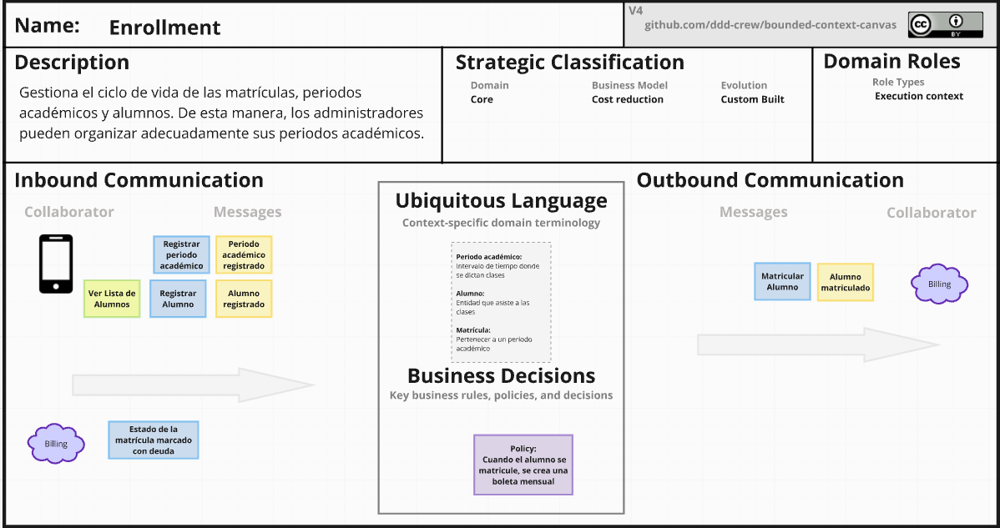

<h2 style="text-align: center;"> Universidad Peruana de Ciencias Aplicadas </h2>

  

<h4 style="text-align: center"> Ingeniería de Software </h4>

<h4 style="text-align: center"> CC238 - Aplicaciones para Dispositivos Móviles </h4>

<h4 style="text-align: center"> NRC: 1798  </h4>

<h4 style="text-align: center"> Docente: Jorge Luis Mayta Guillermo </h4>

<h4 style="text-align: center;"> Informe del Trabajo Final </h4>

<h4 style="text-align: center"> Startup: Nistra </h4>

<h4 style="text-align: center"> Producto: Demy </h4>

<h3 style="text-align: center">Team members:</h2>

  <table style="display:inline-table; border-collapse:collapse; text-align:center; width:550px;">
    <thead>
      <tr>
        <th style="padding:6px 12px;">Código</th>
        <th style="padding:6px 12px;">Nombre</th>
      </tr>
    </thead>
    <tbody>
      <tr>
        <td style="padding:6px 12px;">U202224135</td>
        <td style="padding:6px 12px;">Aponte Cruzado, Andrea Marielena</td>
      </tr>
      <tr>
        <td style="padding:6px 12px;">U20221G120</td>
        <td style="padding:6px 12px;">Crispin Ramos, Daniel Franco</td>
      </tr>
      <tr>
        <td style="padding:6px 12px;">U20201E843</td>
        <td style="padding:6px 12px;">Ramirez Mestanza, Salim Ignacio</td>
      </tr>
      <tr>
        <td style="padding:6px 12px;">U20221C486</td>
        <td style="padding:6px 12px;">Sulca Gonzales, Paúl Fernando</td>
      </tr>
      <tr>
        <td style="padding:6px 12px;">U20231A778</td>
        <td style="padding:6px 12px;">Vilca Saboya, Diego Alejandro</td>
      </tr>
    </tbody>
  </table>

<h5 style="text-align: center"> Ciclo 2025-20 </h5>

# Registro de Versiones del Informe

| Versión | Fecha        | Autor                                                                                   | Descripción de modificación                                                          |
|---------|--------------|-----------------------------------------------------------------------------------------|--------------------------------------------------------------------------------------|
| 1.0     | 30/08/2025   | Salim Ramirez                                                                           | Creación inicial de la estructura del informe                                        |
| 2.0     | 06/09/2025   | Andrea Aponte   Daniel Crispin    Salim Ramirez   Paúl Sulca   Diego Vilca  | Se completó el Capítulo I: Presentación                                              |
| 3.0     | 17/09/2025   | Andrea Aponte   Daniel Crispin    Salim Ramirez   Paúl Sulca   Diego Vilca  | Se completó el Capitulo II: : Requirements Development and Software Solution Design  |

# Project Report Collaboration Insights

Enlace para acceder al repositorio para el reporte del proyecto. [Ver en Github](https://github.com/nistrahq/demy-report)

**TB1**
Para el desarrollo del TB1 cada participante del equipo realizo las siguientes tareas

| Integrantes                      | Tarea asignada                                                                                                                                                                                                                                                                 |
|----------------------------------|--------------------------------------------------------------------------------------------------------------------------------------------------------------------------------------------------------------------------------------------------------------------------------|
| Aponte Cruzado, Andrea Marielena | - Diseño de entrevistas   - Registro de entrevistas   - Análisis de Entrevistas   - User personas   - User Task Matrix   - User Journey Mapping   - Empathy Mapping     - Domain Message Flow  Modeling   - Tactical Level DDD for Institution Context |
| Crispin Ramos, Daniel Franco     | - Startup Profile   - Solution Profile   - Segmentos objetivo   - Competidores   - Ubiquitous Language   - Impact mapping    -  Context Mapping   - Tactical Level DDD for Scheduling Context                                                             |
| Ramirez Mestanza, Salim Ignacio  | - User stories   - Product Backlog   - Event Storming documentation   - Candidate Context Discovery   - Tactical Level DDD for Billing Context and Accounting Context                                                                                              |
| Sulca Gonzales, Paúl Fernando    | - Software Architecture Context Diagram   - Software Architecture Container Diagrams   - Software Architecture Deployments Diagrams   - Tactical Level DDD for Enrollment Context                                                                                     |
| Vilca Saboya, Diego Alejandro    | - Registro de versiones del informe   - Project Report Collaboration Insights   - Student Outcome documentation   - Objetivos Smart documentation   - Bounded Context Canvases   - Tactical Level DD for Attendance Context                                     |                                                  

**GitHub Collaboration Insights**
En GitHub se presenta un timeline de las principales ramas creadas por cada integrante del equipo, así como los procesos de merge realizados.  
Todas las ramas fueron gestionadas siguiendo el flujo de trabajo **GitFlow**, adaptado para una organización que utiliza un sistema de control de versiones.  

Los integrantes son:

| Integrantes                      | Nombre en GitHub |
|----------------------------------|------------------|
| Aponte Cruzado, Andrea Marielena | iconicmiau       |
| Crispin Ramos, Daniel Franco     | danielcr04       |
| Ramirez Mestanza, Salim Ignacio  | salimramirez     |
| Sulca Gonzales, Paúl Fernando    | Kyrubi           |
| Vilca Saboya, Diego Alejandro    | diesoks          |

Las principales ramas del repositorio son las siguientes:

- **main:** Rama principal que contiene la versión estable y consolidada del documento.
- **develop:** Rama de integración utilizada para fusionar los cambios realizados en las ramas de características.
- **feature/tbX-daniel:** Rama utilizada por Daniel para el desarrollo de las tareas correspondientes para una determinada entrega.
- **feature/tbX-diego:** Rama utilizada por Diego para el desarrollo de las tareas correspondientes para una determinada entrega.
- **feature/tbX-paul:** Rama utilizada por Paul para el desarrollo de las tareas correspondientes para una determinada entrega.
- **feature/tbX-andrea:** Rama utilizada por Andrea para el desarrollo de las tareas correspondientes para una determinada entrega.
- **feature/tbX-salim:** Rama utilizada por Salim para el desarrollo de las tareas correspondientes para una determinada entrega.
- **release/vX.X.X:** Rama creada para preparar versiones candidatas al reporte final, siguiendo *Semantic Versioning 2.0.0*. En esta rama se realizan ajustes finales como correcciones menores y revisiones antes de integrarla a `main`.
- **hotfix/urgent-fix:** Rama utilizada para aplicar correcciones críticas directamente sobre `main`, asegurando la estabilidad de la versión publicada.

**TB1**

Gráfico de red (*network graph*) de ramas en el repositorio de GitHub.

A continuación, se presentan los gráficos que muestran el análisis de los commits en el repositorio correspondiente al informe.  
Estos gráficos detallan la cantidad de líneas de código añadidas por cada miembro del equipo y la actividad de commits registrada.

Análisis de líneas de código añadidas por contribuyente.

El siguiente gráfico muestra la cantidad de commits realizados en la semana con mayor actividad en el proyecto.

Análisis de cantidad de commits realizados por semana.

# Contenido

- [Capítulo I: Introducción](#capítulo-i-introducción)
    - [1.1. Startup Profile](#11-startup-profile)
        - [1.1.1. Descripción de la Startup](#111-descripción-de-la-startup)
        - [1.1.2. Perfiles de los integrantes del equipo](#112-perfiles-de-los-integrantes-del-equipo)
    - [1.2. Solution Profile](#12-solution-profile)
        - [1.2.1. Antecedentes y problemática](#121-antecedentes-y-problemática)
        - [1.2.2. Lean UX Process](#122-lean-ux-process)
            - [1.2.2.1. Lean UX Problem Statements](#1221-lean-ux-problem-statements)
            - [1.2.2.2. Lean UX Assumptions](#1222-lean-ux-assumptions)
            - [1.2.2.3. Lean UX Hypothesis](#1223-lean-ux-hypothesis)
            - [1.2.2.4. Lean UX Canvas](#1224-lean-ux-canvas)
    - [1.3. Segmentos objetivo](#13-segmentos-objetivo)

- [Capítulo II: Requirements Elicitation & Analysis](#capítulo-ii-requirements-elicitation--analysis)
    - [2.1. Competidores](#21-competidores)
        - [2.1.1. Análisis competitivo](#211-análisis-competitivo)
        - [2.1.2. Estrategias y tácticas frente a competidores](#212-estrategias-y-tácticas-frente-a-competidores)
    - [2.2. Entrevistas](#22-entrevistas)
        - [2.2.1. Diseño de entrevistas](#221-diseño-de-entrevistas)
        - [2.2.2. Registro de entrevistas](#222-registro-de-entrevistas)
        - [2.2.3. Análisis de entrevistas](#223-análisis-de-entrevistas)
    - [2.3. Needfinding](#23-needfinding)
        - [2.3.1. User Personas](#231-user-personas)
        - [2.3.2. User Task Matrix](#232-user-task-matrix)
        - [2.3.3. User Journey Mapping](#233-user-journey-mapping)
        - [2.3.4. Empathy Mapping](#234-empathy-mapping)
        - [2.3.5. As-is Scenario Mapping](#235-as-is-scenario-mapping)
    - [2.4. Ubiquitous Language](#24-ubiquitous-language)

- [Capítulo III: Requirements Specification](#capítulo-iii-requirements-specification)
    - [3.1. To-Be Scenario Mapping](#31-to-be-scenario-mapping)
    - [3.2. User Stories](#32-user-stories)
    - [3.3. Impact Mapping](#33-impact-mapping)
    - [3.4. Product Backlog](#34-product-backlog)

- [Capítulo IV: Solution Software Design](#capítulo-iv-solution-software-design)
    - [4.1. Strategic-Level Domain-Driven Design](#41-strategic-level-domain-driven-design)
        - [4.1.1. EventStorming](#411-eventstorming)
            - [4.1.1.1. Candidate Context Discovery](#4111-candidate-context-discovery)
            - [4.1.1.2. Domain Message Flows Modeling](#4112-domain-message-flows-modeling)
            - [4.1.1.3. Bounded Context Canvases](#4113-bounded-context-canvases)
        - [4.1.2. Context Mapping](#412-context-mapping)
        - [4.1.3. Software Architecture](#413-software-architecture)
            - [4.1.3.1. Software Architecture Context Level Diagrams](#4131-software-architecture-context-level-diagrams)
            - [4.1.3.2. Software Architecture Container Level Diagrams](#4132-software-architecture-container-level-diagrams)
            - [4.1.3.3. Software Architecture Deployment Diagrams](#4133-software-architecture-deployment-diagrams)
    - [4.2. Tactical-Level Domain-Driven Design](#42-tactical-level-domain-driven-design)
        - [4.2.X. Bounded Context: <Bounded Context Name>](#42x-bounded-context-bounded-context-name)
            - [4.2.X.1. Domain Layer](#42X1-domain-layer)
            - [4.2.X.2. Interface Layer](#42X2-interface-layer)
            - [4.2.X.3. Application Layer](#42X3-application-layer)
            - [4.2.X.4. Infrastructure Layer](#42X4-infrastructure-layer)
            - [4.2.X.5. Bounded Context Software Architecture Component Level Diagrams](#42X5-bounded-context-software-architecture-component-level-diagrams)
            - [4.2.X.6. Bounded Context Software Architecture Code Level Diagrams](#42X6-bounded-context-software-architecture-code-level-diagrams)
                - [4.2.X.6.1. Bounded Context Domain Layer Class Diagrams](#42X61-bounded-context-domain-layer-class-diagrams)
                - [4.2.X.6.2. Bounded Context Database Design Diagram](#42X62-bounded-context-database-design-diagram)

- [Conclusiones](#conclusiones)
    - [Conclusiones y recomendaciones](#conclusiones-y-recomendaciones)
- [Bibliografía](#bibliografía)
- [Anexos](#anexos)

# Student Outcome
En el siguiente cuadro se describe las acciones realizadas y enunciados de conclusiones por parte del grupo, que permiten sustentar el haber alcanzado el logro del ABET – EAC - Student Outcome 7

| Criterio específico                                                                                                                                             | Acciones realizadas                                                                                                                                                                                                                                                                                                                                                                                                                                                                                                                                          | Conclusiones                                                                                                                                                                                                                                |
|-----------------------------------------------------------------------------------------------------------------------------------------------------------------|--------------------------------------------------------------------------------------------------------------------------------------------------------------------------------------------------------------------------------------------------------------------------------------------------------------------------------------------------------------------------------------------------------------------------------------------------------------------------------------------------------------------------------------------------------------|---------------------------------------------------------------------------------------------------------------------------------------------------------------------------------------------------------------------------------------------|
| Actualiza conceptos y  conocimientos necesarios   para su desarrollo  profesional y en especial   para su proyecto en   soluciones de software.  | Aponte Cruzado, Andrea Marielena   *TB1*:Agregue artefactos UX   del nuevo segmento objetivo    Crispin Ramos, Daniel Franco   *TB1*: Investigué los nuevos posibles competidores   de la aplicación en un ecosistema móvil    Ramirez Mestanza, Salim Ignacio   *TB1*: Actualizé user stories   Sulca Gonzales, Paúl Fernando   *TB1*: Actualizé la arquitectura del software   en base al nuevo entorno móvil    Vilca Saboya, Diego Alejandro   *TB1*: Actualizé mis conocimientos sobre la   parte táctica de DDD | Creemos que hemos logrado un buen desempeño en este aspecto,   ya que tuvimos que actualizar en algunos aspectos una   idea que utilizamos en un curso previo de desarrollo web.                                                      |
| Reconoce la necesidad del   aprendizaje permamente   para el desempeño   profesional y el desarrollo de   proyectos en soluciones de   software. | Aponte Cruzado, Andrea Marielena   *TB1*:Agregue artefactos UX   del nuevo segmento objetivo    Crispin Ramos, Daniel Franco   *TB1*: Investigué los nuevos posibles competidores   de la aplicación en un ecosistema móvil    Ramirez Mestanza, Salim Ignacio   *TB1*: Actualizé user stories   Sulca Gonzales, Paúl Fernando   *TB1*: Actualizé la arquitectura del software   en base al nuevo entorno móvil    Vilca Saboya, Diego Alejandro   *TB1*: Actualizé mis conocimientos sobre la   parte táctica de DDD | Consideramos que logramos cumplir este aspecto, ya que reconocemos la   necesidad de tener un aprendizaje permanente sobre nuevos entornos,  en este caso móvil, para reestructurar o actualizar  ideas de soluciones de software. |              

# Objetivos SMART
A continuación, cada integrante del equipo presenta sus objetivos SMART, enfocados en su desarrollo profesional luego de culminar la carrera universitaria.

**Integrante 1: Andrea Aponte**  
**Objetivo 1:**
En los primeros 12 meses después de graduarme, completar una certificación internacional en Lean Six Sigma (nivel Green Belt), para adquirir habilidades en la mejora de procesos y gestión de calidad, aplicables a proyectos de innovación en sectores estratégicos del país como minería o exportaciones.

**Objetivo 2:**
En un plazo de 5 años tras mi graduación, ser admitida en un programa de MBA con enfoque en innovación o gestión tecnológica, en una universidad reconocida internacionalmente, con el fin de fortalecer mis competencias de liderazgo y estrategia empresarial para dirigir proyectos con impacto regional.

**Objetivo 3:**  
Antes de cumplir 8 años desde mi graduación, liderar o fundar un equipo tecnológico multidisciplinario dedicado a resolver un problema crítico del Perú, validando el impacto del proyecto a través de pilotos en al menos dos regiones del país.

**Integrante 2: Daniel Crispin**  
**Objetivo 1:**
En los primeros 6 meses luego de graduarme, involucrarme activamente en al menos dos proyectos colaborativos relacionados con la creación de aplicaciones web y móvil, mejorando mis habilidades técnicas y construyendo una red profesional global para incrementar mis oportunidades laborales en el sector tecnológico.

**Objetivo 2:**
Dentro de los próximos 3 años, alcanzar un puesto de liderazgo como coordinador de equipo en una empresa de innovación tecnológica,  fortaleciendo mis habilidades en gestión de proyectos, liderazgo efectivo y metodologías ágiles a través de formación especializada y experiencia práctica, con el fin de optimizar la productividad y el desempeño del equipo.

**Integrante 3: Salim Ramirez**  
**Objetivo 1:**
Dentro de los primeros 12 meses después de graduarme, conseguir un puesto como desarrollador backend en una empresa tecnológica internacional, aplicando mis conocimientos en arquitecturas escalables y buenas prácticas de programación, con el fin de adquirir experiencia práctica en entornos de alto rendimiento.

**Objetivo 2:**
En un plazo máximo de 5 años tras la graduación, completar un MBA en gestión de proyectos tecnológicos en una universidad de prestigio, para fortalecer mis competencias de liderazgo y estrategia empresarial, y sentar las bases para dirigir equipos de desarrollo de software y proyectos innovadores.

**Objetivo 3:**
Antes de cumplir 7 años de egresado, fundar una startup tecnológica enfocada en soluciones móviles, validando el producto en el mercado local primero y luego expandiéndolo internacionalmente, con el objetivo de generar impacto y posicionarme como líder emprendedor en el ecosistema digital.

**Integrante 4: Paúl Sulca**  
**Objetivo 1:**
En un plazo máximo de 18 meses después de mi egreso, conseguir un puesto como desarrollador backend en una empresa consultora de software reconocida en el Perú (por ejemplo, Everis, Globant o Belatrix), aplicando mis conocimientos en desarrollo de software y fortaleciendo mis habilidades técnicas y blandas. Esto será medible al haber obtenido al menos un año de experiencia laboral formal en el sector, lo que me permitirá afianzar mi perfil profesional.

**Objetivo 2:**
En un plazo máximo de 5 años tras la graduación, cursar y completar una maestría en Ingeniería de Software o Gestión de Proyectos Ágiles en una universidad en Canada. Para lograrlo, me comprometo a postular a becas y programas de financiamiento durante los primeros tres años, con el objetivo de ampliar mis competencias de liderazgo, obtener mejores ingresos laborales y acceder a posiciones estratégicas dentro de la industria tecnológica.

**Objetivo 3:**
Antes de cumplir 10 años de egresado, liderar al menos dos proyectos tecnológicos de gran impacto (uno dentro de una empresa reconocida y otro como iniciativa emprendedora propia), enfocados en soluciones innovadoras basadas en inteligencia artificial aplicadas a la industria. El cumplimiento se medirá por mi rol de líder de equipo o gerente de proyecto, validado a través de la entrega de resultados concretos y la generación de valor en el mercado local e internacional.

**Integrante 5: Diego Vilca**  
**Objetivo 1:**
Al culminar mi carrera, conseguir un puesto como desarrollador web o móvil en un plazo máximo de 1 mes después de graduarme, aplicando a un mínimo de 5 ofertas laborales por semana y actualizando constantemente mi portafolio con proyectos en GitHub.

**Objetivo 2:**
Iniciar una maestría en Arquitectura de Software en un plazo máximo de 3 años después de graduarme, complementado mi experiencia laboral. El objetivo es finalizar la maestría en 2 años y, posteriormente, postularme como docente universitario dentro de los 5 años posteriores a la graduación.

# Capítulo I: Introducción

## 1.1. Startup Profile

### 1.1.1. Descripción de la Startup

Write here...

### 1.1.2. Perfiles de los integrantes del equipo

Write here...

## 1.2. Solution Profile

### 1.2.1. Antecedentes y problemática

Write here...

### 1.2.2. Lean UX Process

Write here...

#### 1.2.2.1 Lean UX Problem Statements

Write here...

#### 1.2.2.2. Lean UX Assumptions

Write here...

#### 1.2.2.3. Lean UX Hypothesis

Write here...

#### 1.2.2.4. Lean UX Canvas

Write here...

## 1.3. Segmentos objetivo

Write here...

# Capítulo II: Requirements Elicitation & Analysis

## 2.1. Competidores

### 2.1.1. Análisis competitivo

Write here...

### 2.1.2. Estrategias y tácticas frente a competidores

Write here...

## 2.2. Entrevistas

Write here...

### 2.2.1. Diseño de entrevistas

Write here...

### 2.2.2. Registro de entrevistas

Write here...

### 2.2.3. Análisis de entrevistas

Write here...

## 2.3. Needfinding

Write here...

### 2.3.1. User Personas

Write here...

### 2.3.2. User Task Matrix

Write here...

### 2.3.3. User Journey Mapping

Write here...

### 2.3.4. Empathy Mapping

Write here...

### 2.3.5. As-Is Scenario Mapping

Write here...

## 2.4. Ubiquitous Language

Write here...

# Capítulo III: Requirements Specification

## 3.1. To-Be Scenario Mapping.

Write here...

## 3.2. User Stories

Write here...

## 3.3. Impact Mapping

Write here...

## 3.4. Product Backlog

Write here...

# Capítulo IV: Solution Software Design

## 4.1. Strategic-Level Domain-Driven Design

Write here...

### 4.1.1. EventStorming

Write here...

#### 4.1.1.1. Candidate Context Discovery

En esta sección se presenta el proceso seguido por el equipo para la descubierta de bounded contexts candidatos a partir del Event Storming realizado previamente. El objetivo fue identificar los límites naturales del dominio, determinar cuáles son las partes core del negocio y cuáles cumplen roles de apoyo o genéricos, con el fin de priorizar los esfuerzos de diseño en aquellos elementos que aportan mayor valor estratégico.

**Preparación de la sesión:**

La sesión de Candidate Context Discovery se desarrolló en un espacio colaborativo inmediatamente después del taller de Event Storming, con una duración aproximada de 1 hora 30 minutos. Como insumo se utilizaron:

- La línea de tiempo de eventos generada en el Event Storming.
- Los clusters iniciales de eventos y agregados identificados.
- Los eventos clave (pivotal events) que marcaban cambios de estado relevantes.

El equipo estuvo conformado por cinco participantes, con un facilitador encargado de guiar la dinámica y un relator responsable de documentar la evolución del mural mediante fotografías.

**Técnica aplicada: *Start-with-Value***

Para este trabajo se aplicó la técnica Start-with-Value, cuyo principio consiste en priorizar aquellas partes del dominio que representan el mayor valor para el negocio. Esta técnica permitió separar con claridad qué bounded contexts debían ser considerados como Core, y cuáles como Supporting o Generic.

El proceso aplicado se organizó en tres pasos principales:

1. **Identificación de valor estratégico:** cada miembro del equipo respondió a la pregunta “¿Qué parte del sistema genera directamente valor para los usuarios y diferencia la solución de otras similares?”.

    

2. **Agrupación de eventos en torno al valor:** se revisaron los clusters de eventos y agregados formados en el Event Storming, destacando aquellos que respondían a las necesidades de mayor impacto.

    

3. **Clasificación Core, Supporting, Generic:** los contexts se categorizaron según su aporte al negocio y el nivel de complejidad de su modelo.

    

**Candidate Contexts identificados**

El análisis permitió identificar los siguientes bounded contexts candidatos:

| Candidate Context    | Eventos Clave Asociados                                                                                                                                   | Clasificación | Descripción                                                    | Justificación                                                                                         |
|----------------------|-----------------------------------------------------------------------------------------------------------------------------------------------------------|---------------|----------------------------------------------------------------|-------------------------------------------------------------------------------------------------------|
| Identity & Access    | Cuenta creada, Cuenta verificada, Organización asignada, Contraseña restablecida                                                                          | Generic       | Gestión de usuarios, roles y autenticación.                    | Es necesario para operar, pero no es diferenciador; existen soluciones estándar que podrían cubrirlo. |
| Institution          | Administrador registrado, Academia registrada, Academia asignada, Profesor registrado                                                                     | Core          | Administración de instituciones, academias y personal docente. | Representa la base del modelo educativo, aporta diferenciación al negocio.                            |
| Enrollment           | Alumno registrado, Alumno matriculado, Periodo académico registrado, Matrícula de alumno marcada con deuda                                                | Core          | Gestión del ciclo de vida de las matrículas y alumnos.         | Constituye el corazón del negocio académico, directamente ligado al valor central de la plataforma.   |
| Attendance           | Asistencia de sesión de clase registrada, Alumno marcado como inasistió, QR único de registro de asistencia de clase creado, Asistencia por QR registrada | Core          | Registro y control de la asistencia de alumnos.                | Provee trazabilidad y control, diferenciador frente a procesos manuales.                              |
| Scheduling           | Salón de clase registrado, Curso registrado, Horario registrado, Clase reprogramada                                                                       | Supporting    | Gestión de horarios, salones y clases programadas.             | Apoya el funcionamiento de las matrículas y asistencia, pero no es el núcleo del negocio.             |
| Billing              | Boleta de matrícula de alumno registrada, Boleta mensual asignada a estudiante, Boleta de estudiante pagada, Boleta de estudiante vencida                 | Supporting    | Emisión y control de boletas y obligaciones de pago.           | Es clave para la sostenibilidad financiera, pero su complejidad es secundaria frente al core.         |
| Accounting & Finance | Ingreso registrado, Egreso registrado, Reporte financiero creado, Reporte exportado a PDF                                                                 | Generic       | Registro de ingresos/egresos y reportes financieros.           | Puede externalizarse con software contable estándar, no genera diferenciación.                        |

**Clasificación estratégica**

Como parte del análisis Start-with-Value, se representó gráficamente la clasificación de los bounded contexts en una matriz de dos ejes:

- **Business Differentiation** (eje X): grado en que el contexto aporta valor estratégico o diferenciación frente a otras soluciones.
- **Model Complexity (eje Y):** nivel de complejidad requerido para implementar y mantener el contexto.

En esta matriz de clasificación de bounded contexts, distribuyeron los contextos en los tres tipos:

- **Core:** Institution, Enrollment, Attendance.
- **Supporting:** Scheduling, Billing.
- **Generic:** Identity & Access, Accounting & Finance.

**Resultados**

Se definieron siete bounded contexts candidatos, de los cuales:

- 3 Core (Institution, Enrollment y Attendance).
- 2 Supporting (Scheduling, Billing).
- 2 Generic (Identity & Access y Accounting & Finance).

La aplicación de la técnica Start-with-Value permitió asegurar que la atención principal del diseño táctico se concentre en el contexto de Institution, Enrollment y Attendance, dado que allí reside la propuesta de valor diferenciadora.

El resto de contexts serán modelados en las siguientes secciones mediante Bounded Context Canvas y Domain Message Flows, garantizando consistencia y claridad en la arquitectura estratégica.

#### 4.1.1.2. Domain Message Flows Modeling

Write here...

#### 4.1.1.3. Bounded Context Canvases

En esta sección el equipo presenta sus Bounded Context Canvases, empezando por los importantes.  

**Institution**  
Encargado de gestionar el ciclo de vida de las academias y su personal docente.  
  

**Enrollment**  
Encargado de gestionar el ciclo de vida de las matrículas y el registro de alumnos.  
  

**Attendance**  
Encargado de gestionar las asistencias de una clase.  
  

**Scheduling**  
Encargado de la gestión de horarios, salones y clases programadas.  

**Billing** 
Encargado de la emisión y control de boletas y obligaciones de pago.  

**Accounting & Finance**  
Encargado del control de ingresos y egresos de la academia.    

**IAM**  
Contexto génerico para la identificación y acceso.  

### 4.1.2. Context Mapping

Write here...

### 4.1.3. Software Architecture

#### 4.1.3.1. Software Architecture Context Level Diagrams

Write here...

#### 4.1.3.2. Software Architecture Container Level Diagrams

Write here...

#### 4.1.3.3. Software Architecture Deployment Diagrams

Write here...

## 4.2. Tactical-Level Domain-Driven Design

Write here...

### 4.2.X. Bounded Context: <Bounded Context Name>

Write here...

#### 4.2.X.1. Domain Layer

Write here...

#### 4.2.X.2. Interface Layer

Write here...

#### 4.2.X.3. Application Layer

Write here...

#### 4.2.X.4. Infrastructure Layer

Write here...

#### 4.2.X.5. Bounded Context Software Architecture Component Level Diagrams

Write here...

#### 4.2.X.6. Bounded Context Software Architecture Code Level Diagrams

Write here...

#### 4.2.X.6.1. Bounded Context Domain Layer Class Diagrams

Write here...

#### 4.2.X.6.2. Bounded Context Database Design Diagram

Write here...

### 4.2.4. Bounded Context: Attendance

El bounded context de Attendance gestiona todo el ciclo de registro y control de la asistencia de los estudiantes. Es un contexto core del dominio educativo, ya que brinda a los profesores la capacidad de monitorear, registrar y consultar la asistencia de manera estructurada y confiable.

#### 4.2.4.1. Domain Layer

En esta sección se describen los elementos del Domain Layer del contexto de Attendance, que encapsulan las reglas y lógica del dominio relacionadas con la gestión de asistencias.

  

1.**`ClassAttendance` (Aggregate Root)**

Representa la asistencia de todos los estudiantes de una sesión de clase.  

**Atributos principales:**

| Atributo         | Tipo                    | Visibilidad | Descripción                                                     |
|------------------|-------------------------|-------------|-----------------------------------------------------------------|
| `id`             | `Long`                  | `private`   | Identificador único de la asistencia de una sesión de clase     |
| `classSessionId` | `ClassSessionId`        | `private`   | Identificador único de una sesión de clase                      |
| `date`           | `LocalDate`             | `private`   | Fecha en la que fue tomada la asistencia de una sesión de clase |
| `attendances`    | `List<AttendanceRecord` | `private`   | Lista de asistencia  de cada estudiante                         |
| `academyId`      | `AcademyId`             | `private`   | Identificador único de la academia                              |

**Métodos principales:**

| Método                                                   | Tipo de retorno | Visibilidad    | Descripción                                                                          |
|----------------------------------------------------------|-----------------|----------------|--------------------------------------------------------------------------------------|
| `ClassAttendance()`                                      | `Constructor `  | `protected   ` | Constructor protegido para uso por el repositorio.                                   |
| `ClassAttendance(CreateClassAttendanceCommand command)`  | `Constructor`   | `public`       | Constructor que inicializa la asistencia de una sesión de clase mediante un comando  |

2.**`AttendanceRecord` (Entity)**  

Representa la asistencia de un solo estudiante.

| Atributo     | Tipo         | Visibilidad | Descripción                                            |
|--------------|--------------|-------------|--------------------------------------------------------|
| `id`         | `Long`       | `private`   | Identificador único de una asistencia de un estudiante | 
| `studentId`  | `StudentId`  | `private`   | Identificador único de un estudiante.                  |

**Métodos principales:**

| Método                                     | Tipo de retorno | Visibilidad | Descripción                                      |
|--------------------------------------------|-----------------|-------------|--------------------------------------------------|
| `changeStatus(AttendanceStatus newStatus)` | `void`          | `public`    | Cambia el status de asistencia de un estudiante  |

3.**`AttendanceStatus` (Value object)**

| Atributo     | Tipo    | Visibilidad | Descripción                        |
|--------------|---------|-------------|------------------------------------|
| `PRESENT`    | `Enum`  | `public`    | Estudiante presente en la clase    |
| `ABSENT`     | `Enum`  | `public`    | Estudiante ausente en la clase     |
| `EXCUSED`    | `Enum`  | `public`    | Estudiante con falta justificada   |

4.**`ClassSessionId` (Value object)**

| Atributo | Tipo   | Visibilidad | Descripción                                |
|----------|--------|-------------|--------------------------------------------|
| `id`     | `Long` | `public`    | Identificador único de una sesión de clase |

5.**`ClassAttendanceCommandService` (Domain Service)**

| Atributo                                           | Tipo                         | Visibilidad | Descripción                                                                |
|----------------------------------------------------|------------------------------|-------------|----------------------------------------------------------------------------|
| `handle (CreateClassAttendanceCommand command)`    | `Optional<ClassAttendance>`  | `public`    | Crea un nuevo registro de asistencia de una clase a partir de un comando.  |

6.**`ClassAttendanceQueryService` (Domain Service)**

| Atributo                                                               | Tipo                         | Visibilidad | Descripción                                                                       |
|------------------------------------------------------------------------|------------------------------|-------------|-----------------------------------------------------------------------------------|
| `handle(GetAttendanceRecordsByStudentIdCourseAndDateRangeQuery query)` | `Optional<AttendanceRecord>` | `public`    | Obtiene todas las asistencias por ID del estudiante, curso en un rango de fechas. |

#### 4.2.4.2. Interface Layer

1.**`ClassAttendanceController` (REST controller)**  
Controlador REST que expone endpoints para registrar asistencia o obtenerlas.

**Endpoints Principales:**

| Nombre del método       | Ruta base típica                    | Método HTTP | Descripción                                                                                         |
|-------------------------|-------------------------------------|-------------|-----------------------------------------------------------------------------------------------------|
| `CreateClassAttendance` | `/api/v1/class-attendances`         | `POST`      | Crea un nuevo registro de asistencia de una clase                                                   |
| `getAttendanceReport`   | `/api/v1/class-attendances/report`  | `GET`       | Obtiene el registro de asistencia de un estudiante según ID del estudiante, curso y rango de fechas |

#### 4.2.4.3. Application Layer

1.**`ClassAttendanceCommandServiceImpl` (Command Service Implementation)**  
Implementación del servicio de comandos para gestionar asistencias de una clase.

**Atributos principales**  

| Atributo                     | Tipo                         | Visibilidad | Descripción                                              |
|------------------------------|------------------------------|-------------|----------------------------------------------------------|
| `classAttendanceRepository`  | `ClassAttendanceRepository`  | `private`   | Repositorio para acceder a las asistencias de una clase  |

**Métodos principales**

| Nombre del método                                 | Tipo                        | Visibilidad | Descripción                                                                 |
|---------------------------------------------------|-----------------------------|-------------|-----------------------------------------------------------------------------|
| `handle (CreateClassAttendanceCommand command)`   | `Optional<ClassAttendance>` | `public`    | Maneja el comando para crear un nuevo registro de asistencia de una clase   |

2.**`ClassAttendanceQueryServiceImpl` (Query Service Implementation)**  
Implementación del servicio de consultas para obtener asistencias de una clase.

**Atributos principales**

| Atributo                     | Tipo                         | Visibilidad | Descripción                                              |
|------------------------------|------------------------------|-------------|----------------------------------------------------------|
| `classAttendanceRepository`  | `ClassAttendanceRepository`  | `private`   | Repositorio para acceder a las asistencias de una clase  |

**Métodos principales**

| Nombre del método                                                     | Tipo                    | Visibilidad | Descripción                                                                                                           |
|-----------------------------------------------------------------------|-------------------------|-------------|-----------------------------------------------------------------------------------------------------------------------|
| `handle(GetAttendanceRecordsByStudentIdCourseAndDateRangeQuery query` | `List<ClassAttendance>` | `public`    | Maneja la consulta para obtener registros de asistencia de una clase según ID del estudiante, curso y rango de fechas |

#### 4.2.4.4. Infrastructure Layer

1.**`ClassAttendanceRepository` (Repository Interface)**  
Interfaz del repositorio para acceder a los registros de asistencia de una sesión de clase.

**Métodos principales**

| Nombre del método                                                                          | Tipo de Retorno          | Visibilidad | Descripción                                                           |
|--------------------------------------------------------------------------------------------|--------------------------|-------------|-----------------------------------------------------------------------|
| `findByCourseIdAndDateBetween(CourseId courseId, LocalDate startDate, LocalDate endDate)`  | `List<ClassAttendance>`  | `public`    | Obtiene todas las asistencias por ID del course y un rango de fechas  |

#### 4.2.4.5. Bounded Context Software Architecture Component Level Diagrams

En esta sección se presentan los diagramas de nivel componente que ilustran la arquitectura de software del contexto de Attendance. Se muestra la interacción entre los diferentes componentes, servicios y capas que conforman este bounded context. Se integra con la base de datos relacional definida en el diagrama de contenedores.  

  

Además, se incluye el [código fuente del diagrama de componentes de Attendance](./assets/diagrams/software-architecture/components/src/attendance-component-level-diagram.dsl)

#### 4.2.4.6. Bounded Context Software Architecture Code Level Diagrams

En esta sección se presentan los diagramas de nivel código que detallan la estructura interna del contexto de Attendance. Se incluyen diagramas de clases y diseño de base de datos que reflejan cómo se implementan los elementos del dominio y cómo se gestionan las relaciones entre ellos.

#### 4.2.4.6.1. Bounded Context Domain Layer Class Diagrams

El diagrama de clases del Domain Layer del contexto de Attendance ilustra las entidades, objetos de valor y servicios que componen este bounded context. Se muestran las relaciones entre los diferentes elementos del dominio, así como sus atributos y métodos principales.

  

Además, se incluye el [código fuente del diagrama de clases del Domain Layer de Attendance](./assets/diagrams/uml/class/src/attendance-domain-layer-class-diagram.puml).

#### 4.2.4.6.2. Bounded Context Database Design Diagram

El diagrama de diseño de base de datos del contexto de Attendance muestra la estructura de las tablas y sus relaciones en la base de datos relacional. Se detallan las tablas principales, sus columnas, tipos de datos y claves primarias/foráneas que permiten gestionar la información relacionada con las asistencias de una clase.

Además, se incluye el [esquema SQL del diagrama de base de datos de Attendance](./assets/diagrams/database/schema/src/attendance-database-diagram-create.sql).

## Conclusiones y Recomendaciones

Write here...

### Conclusiones

Write here...

### Recomendaciones

Write here...

# Bibliografía

Write here...

# Anexos

Write here...