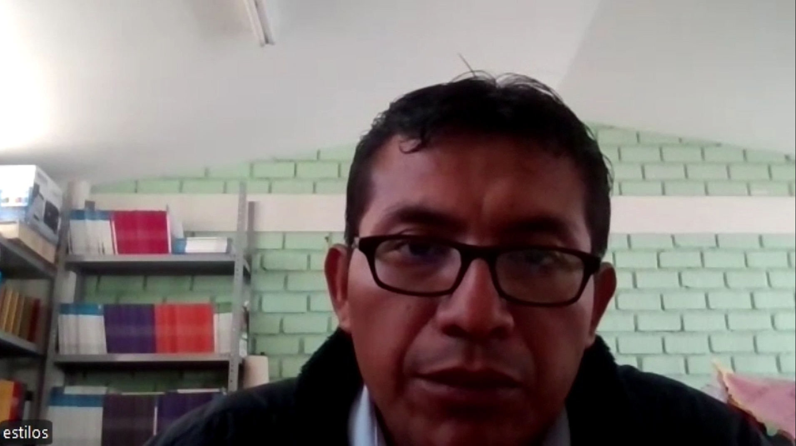

<h2 style="text-align: center;"> Universidad Peruana de Ciencias Aplicadas </h2>

  

<h4 style="text-align: center"> Ingeniería de Software </h4>

<h4 style="text-align: center"> CC238 - Aplicaciones para Dispositivos Móviles </h4>

<h4 style="text-align: center"> NRC: 1798  </h4>

<h4 style="text-align: center"> Docente: Jorge Luis Mayta Guillermo </h4>

<h4 style="text-align: center;"> Informe del Trabajo Final </h4>

<h4 style="text-align: center"> Startup: Nistra </h4>

<h4 style="text-align: center"> Producto: Demy </h4>

<h3 style="text-align: center">Team members:</h2>

  <table style="display:inline-table; border-collapse:collapse; text-align:center; width:550px;">
    <thead>
      <tr>
        <th style="padding:6px 12px;">Código</th>
        <th style="padding:6px 12px;">Nombre</th>
      </tr>
    </thead>
    <tbody>
      <tr>
        <td style="padding:6px 12px;">U202224135</td>
        <td style="padding:6px 12px;">Aponte Cruzado, Andrea Marielena</td>
      </tr>
      <tr>
        <td style="padding:6px 12px;">U20221G120</td>
        <td style="padding:6px 12px;">Crispin Ramos, Daniel Franco</td>
      </tr>
      <tr>
        <td style="padding:6px 12px;">U20201E843</td>
        <td style="padding:6px 12px;">Ramirez Mestanza, Salim Ignacio</td>
      </tr>
      <tr>
        <td style="padding:6px 12px;">U20221C486</td>
        <td style="padding:6px 12px;">Sulca Gonzales, Paúl Fernando</td>
      </tr>
      <tr>
        <td style="padding:6px 12px;">U20231A778</td>
        <td style="padding:6px 12px;">Vilca Saboya, Diego Alejandro</td>
      </tr>
    </tbody>
  </table>

<h5 style="text-align: center"> Ciclo 2025-20 </h5>

# Registro de Versiones del Informe

# Project Report Collaboration Insights

# Contenido

- [Capítulo I: Introducción](#capítulo-i-introducción)
    - [1.1. Startup Profile](#11-startup-profile)
        - [1.1.1. Descripción de la Startup](#111-descripción-de-la-startup)
        - [1.1.2. Perfiles de los integrantes del equipo](#112-perfiles-de-los-integrantes-del-equipo)
    - [1.2. Solution Profile](#12-solution-profile)
        - [1.2.1. Antecedentes y problemática](#121-antecedentes-y-problemática)
        - [1.2.2. Lean UX Process](#122-lean-ux-process)
            - [1.2.2.1. Lean UX Problem Statements](#1221-lean-ux-problem-statements)
            - [1.2.2.2. Lean UX Assumptions](#1222-lean-ux-assumptions)
            - [1.2.2.3. Lean UX Hypothesis](#1223-lean-ux-hypothesis)
            - [1.2.2.4. Lean UX Canvas](#1224-lean-ux-canvas)
    - [1.3. Segmentos objetivo](#13-segmentos-objetivo)

- [Capítulo II: Requirements Elicitation & Analysis](#capítulo-ii-requirements-elicitation--analysis)
    - [2.1. Competidores](#21-competidores)
        - [2.1.1. Análisis competitivo](#211-análisis-competitivo)
        - [2.1.2. Estrategias y tácticas frente a competidores](#212-estrategias-y-tácticas-frente-a-competidores)
    - [2.2. Entrevistas](#22-entrevistas)
        - [2.2.1. Diseño de entrevistas](#221-diseño-de-entrevistas)
        - [2.2.2. Registro de entrevistas](#222-registro-de-entrevistas)
        - [2.2.3. Análisis de entrevistas](#223-análisis-de-entrevistas)
    - [2.3. Needfinding](#23-needfinding)
        - [2.3.1. User Personas](#231-user-personas)
        - [2.3.2. User Task Matrix](#232-user-task-matrix)
        - [2.3.3. User Journey Mapping](#233-user-journey-mapping)
        - [2.3.4. Empathy Mapping](#234-empathy-mapping)
        - [2.3.5. As-is Scenario Mapping](#235-as-is-scenario-mapping)
    - [2.4. Ubiquitous Language](#24-ubiquitous-language)

- [Capítulo III: Requirements Specification](#capítulo-iii-requirements-specification)
    - [3.1. To-Be Scenario Mapping](#31-to-be-scenario-mapping)
    - [3.2. User Stories](#32-user-stories)
    - [3.3. Impact Mapping](#33-impact-mapping)
    - [3.4. Product Backlog](#34-product-backlog)

- [Capítulo IV: Solution Software Design](#capítulo-iv-solution-software-design)
    - [4.1. Strategic-Level Domain-Driven Design](#41-strategic-level-domain-driven-design)
        - [4.1.1. EventStorming](#411-eventstorming)
            - [4.1.1.1. Candidate Context Discovery](#4111-candidate-context-discovery)
            - [4.1.1.2. Domain Message Flows Modeling](#4112-domain-message-flows-modeling)
            - [4.1.1.3. Bounded Context Canvases](#4113-bounded-context-canvases)
        - [4.1.2. Context Mapping](#412-context-mapping)
        - [4.1.3. Software Architecture](#413-software-architecture)
            - [4.1.3.1. Software Architecture Context Level Diagrams](#4131-software-architecture-context-level-diagrams)
            - [4.1.3.2. Software Architecture Container Level Diagrams](#4132-software-architecture-container-level-diagrams)
            - [4.1.3.3. Software Architecture Deployment Diagrams](#4133-software-architecture-deployment-diagrams)
    - [4.2. Tactical-Level Domain-Driven Design](#42-tactical-level-domain-driven-design)
        - [4.2.X. Bounded Context: <Bounded Context Name>](#42x-bounded-context-bounded-context-name)
            - [4.2.X.1. Domain Layer](#42X1-domain-layer)
            - [4.2.X.2. Interface Layer](#42X2-interface-layer)
            - [4.2.X.3. Application Layer](#42X3-application-layer)
            - [4.2.X.4. Infrastructure Layer](#42X4-infrastructure-layer)
            - [4.2.X.5. Bounded Context Software Architecture Component Level Diagrams](#42X5-bounded-context-software-architecture-component-level-diagrams)
            - [4.2.X.6. Bounded Context Software Architecture Code Level Diagrams](#42X6-bounded-context-software-architecture-code-level-diagrams)
                - [4.2.X.6.1. Bounded Context Domain Layer Class Diagrams](#42X61-bounded-context-domain-layer-class-diagrams)
                - [4.2.X.6.2. Bounded Context Database Design Diagram](#42X62-bounded-context-database-design-diagram)

- [Conclusiones](#conclusiones)
    - [Conclusiones y recomendaciones](#conclusiones-y-recomendaciones)
- [Bibliografía](#bibliografía)
- [Anexos](#anexos)

# Student Outcome

# Objetivos SMART

# Capítulo I: Introducción

## 1.1. Startup Profile

### 1.1.1. Descripción de la Startup

Write here...

### 1.1.2. Perfiles de los integrantes del equipo

Write here...

## 1.2. Solution Profile

### 1.2.1. Antecedentes y problemática

Write here...

### 1.2.2. Lean UX Process

Write here...

#### 1.2.2.1 Lean UX Problem Statements

Write here...

#### 1.2.2.2. Lean UX Assumptions

Write here...

#### 1.2.2.3. Lean UX Hypothesis

Write here...

#### 1.2.2.4. Lean UX Canvas

Write here...

## 1.3. Segmentos objetivo

En el análisis del segmento objetivo para Demy, hemos previsto que nuestros principales usuarios de nuestra startup
serían profesores y personal administrativo de academias preuniversitarias.

#### Profesores de academias preuniversitarias

Según la revista Gan@Mas(24 de julio, 2014), sabemos que diversos docentes usan hasta el 29% de su tiempo en tareas administrativas, las cuales no deberían estar ligadas a profesionales de la educación. La gran demanda en estas academias preuniversitarias no permite a los profesores dedicar su tiempo laboral a ejercer plenamente su labor de docente.

* Edad: Buscamos profesores de cualquier edad.
* Necesidad clave: Reducir la carga administrativa y optimizar su tiempo para centrarse en la    enseñanza y mejorar su eficiencia en las aulas.
* Nivel educativo: Profesores con formación universitaria, preferiblemente con especialización en educación o áreas afines.
* Uso de tecnología: Profesores que utilizan tecnología en su labor docente, pero que requieren herramientas más eficientes para la gestión administrativa.

#### Administradores de academias preuniversitarias

Los administradores de las academias preuniversitarias suelen enfrentarse a una gran carga de trabajo relacionada con la planificación de horarios, gestión de pagos y matrículas. Según la Encuesta Nacional de Uso del Tiempo (ENUT) 2024, el 45% de los trabajadores en el sector educativo dedican más de 20 horas semanales a tareas administrativas, lo que refleja una carga significativa en el tiempo dedicado a tareas no pedagógicas (Instituto Nacional de Estadística e
Informática [INEI], 2024). Además, un estudio realizado por el Grupo de Análisis para el Desarrollo (GRADE) destaca que el 70% de los directores de instituciones educativas en Perú consideran que las herramientas actuales para la gestión administrativa son ineficientes, lo que subraya la necesidad de adoptar nuevas soluciones tecnológicas (GRADE, 2023). Este segmento busca soluciones tecnológicas que optimicen el manejo de información y mejoren la experiencia educativa de los alumnos.

* Edad: Buscamos personal administrativo de cualquier edad.
* Necesidad clave: Contar con una solución tecnológica que facilite la gestión, mejore la eficiencia operativa y brinde una experiencia más fluida tanto para el personal como para los alumnos y padres.
* Nivel educativo: Administradores con formación técnica o universitaria, preferiblemente en áreas de gestión, administración o educación.
* Uso de tecnología: Administradores que utilizan herramientas digitales para la gestión de información, pero que requieren una plataforma más integrada y eficiente para optimizar sus procesos.

#### Alumnos de academias preuniversitarias

Los estudiantes de academias se caracterizan por ser jóvenes disciplinados, por lo que organizan, desarrollan y planean sus actividades de acuerdo con el ambiente y tareas que escogen, lo que se relaciona con el nivel de autoeficacia que tengan. La autoeficacia les permite desenvolverse de acuerdo con las habilidades y capacidades que cree poseer (Bandura, 1997b; Domínguez, 2014; García et al., 2010, citado en Burgos-Torre & Salas-Blas, 2020).
En este sentido, este segmento busca optimizar su tiempo y requiere de una solución tecnológica que facilite dicha gestión.

* Edad: Buscamos estudiantes jóvenes
* Necesidad clave: Optimizar tiempo para gestionar mejor sus horarios académicos.
* Nivel Educativo: Alumnos de colegios o personas jóvenes que cuenten con educación secundaria completa.
* Uso de tecnología: Alumnos que utilizan tecnología en su día a día, pero que requieren herramientas más eficientes para la gestión administrativa.

# Capítulo II: Requirements Elicitation & Analysis

## 2.1. Competidores

### 2.1.1. Análisis competitivo

Write here...

### 2.1.2. Estrategias y tácticas frente a competidores

Para competir eficazmente en el mercado de plataformas de gestión para academias presenciales, Nistra aplicará las siguientes estrategias y tácticas preliminares, considerando sus propias fortalezas y debilidades, así como el contexto de oportunidades y amenazas en relación a sus competidores:

* Diferenciación por enfoque especializado
**Estrategia:** Posicionar a Demy como la plataforma especializada en academias preuniversitarias presenciales, a diferencia de otros competidores que ofrecen soluciones más genéricas o centradas en colegios o empresas.
**Tácticas:** Desarrollar funcionalidades específicas para academias preuniversitarias, como módulos de simulacros, cronogramas de preparación para exámenes de admisión

* Modelo de precios escalables
**Estrategia:** Mantener un esquema de precios accesible, con planes diferenciados según el tamaño de la academia, y con mejor relación calidad-precio frente a competidores como QuickSchools o Playoff.
**Tácticas:** Evaluar una prueba gratuita de n días, ofrecer descuentos cada cierto tiempo o evaluar una contratación anual incluida con descuento.

* Mejora progresiva del producto y adaptabilidad
**Estrategia:** Competir frente a soluciones más maduras (como QuickSchools) con un enfoque ágil y adaptable, incorporando mejoras constantes con base en la retroalimentación directa de los usuarios.
**Tácticas:** Lanzamientos de mejoras mensuales (por sprints).

* Seguridad y confianza
**Estrategia:** Reducir la percepción de riesgo en torno a ciberseguridad, una amenaza para startups, generando confianza desde etapas tempranas.
**Táctica:** Contratar un servicio externo para auditorías de seguridad básicas.

* Aprovechamiento del contexto post-pandemia
**Estrategia:** Capitalizar el aumento de la digitalización en la educación tras el COVID-19 para incentivar la transformación digital de academias tradicionales.
**Tácticas:** Ofrecer workshops gratuitos virtuales sobre “Digitaliza tu academia en 3 pasos con Demy”. Enseñar casos de éxito que muestren cómo academias presenciales mejoraron su eficiencia tras usar la plataforma.

## 2.2. Entrevistas

En esta sección se aborda la investigación cualitativa realizada mediante entrevistas a representantes de los segmentos objetivo del proyecto: administrativos, docentes y alumnos de academias educativas. El objetivo fue comprender las herramientas, procesos y problemáticas actuales en su gestión, así como validar posibles soluciones digitales a partir de sus propias experiencias.

### 2.2.1. Diseño de entrevistas

Para diseñar las entrevistas, se elaboraron dos bloques de preguntas, diferenciados según el segmento objetivo. Las preguntas buscaban obtener tanto información objetiva (como el contexto de trabajo y herramientas utilizadas) como información subjetiva (percepciones, frustraciones y expectativas respecto a posibles soluciones).

**Segmento 1: Administrativos de academias**

**Preguntas sobre la problemática**
1. ¿Cómo gestionan actualmente los procesos administrativos como matrículas, horarios, pagos y asistencia?
2. ¿Qué problemas frecuentes enfrentas con las herramientas o métodos que usas hoy?
3. ¿Qué tipo de información necesitas consultar con frecuencia, y qué tan fácil es acceder a ella?
4. ¿Qué consecuencias trae la desorganización o errores en la administración para ti o tu equipo?

**Preguntas sobre la solución**
1. ¿Qué funcionalidades crees que debería tener una herramienta ideal para facilitar tu trabajo administrativo?
2. ¿Qué tan importante sería para ti recibir alertas sobre tareas o pagos?
3. ¿Preferirías un sistema con muchas funciones o uno más simple pero fácil de usar?
4. ¿Qué beneficios esperas obtener si decides adoptar una nueva plataforma de gestión?
5. ¿Estarías dispuesto a aprender a usar una nueva herramienta si mejora tu gestión (organización)?

**Segmento 2: Docentes de academias**

**Preguntas sobre la problemática**
1. ¿Qué herramientas o métodos usas para registrar asistencia o notas en caso lo hagas? ¿Funcionan bien para usted?
2. ¿Qué tipo de coordinación tiene con el personal administrativo? ¿Es fácil comunicarse con ellos o enfrenta dificultades?
3. ¿Cómo accedes a la información de tus clases o alumnos cuando la necesitas?
4. ¿Cómo manejas los cambios de aula, horarios u otras incidencias en tu día a día?

**Preguntas sobre la solución**
1. ¿Qué funcionalidades te gustaría que tenga una herramienta digital para docentes?
2. ¿Qué tan útil sería para ti revisar tu horario o registrar asistencia desde cualquier dispositivo?
3. ¿Qué tan importante es que la plataforma sea fácil de usar e intuitiva?
4. ¿Preferirías acceder a la plataforma desde tu celular o tablet?
5. ¿Qué tan valioso sería que recibas alertas (notificaciones) sobre cambios de horario o asistencia irregular, y demás?
6. ¿Estarías dispuesto a aprender a usar una nueva herramienta si mejora tu gestión (organización)?

**Segmento 3: Alumnos de academias**

**Preguntas sobre la problemática**
1.¿Qué medio utilizas para consultar tu horario de academia? ¿Usas algún dispositivo digital?
2.¿Cuando te matriculas, ¿cómo te entregan o muestran tu horario?
3.¿Que tipo de informacion te gustaria ver en tu horario de clase?
4.¿Qué haces o cómo te organizas cuando la academia cambia de aula o reprograma alguna clase?
**Preguntas sobre la solución**
1.¿Qué funcionalidades te gustaría que tenga una herramienta digital para usar como alumno?
2.¿Qué tan útil sería para ti revisar tu horario desde tu celular?
3.En un sistema que gestione tu horario, ¿qué priorizarías más: facilidad de uso, rapidez, o ambas?
4.¿Qué características o beneficios esperas encontrar en el sistema?
5.¿Estarías dispuesto a aprender a usar una nueva herramienta si mejora tu gestión (organización)?

### 2.2.2. Registro de entrevistas

**Segmento Administrativos: Entrevistado 1**

<table style="width:100%; border-collapse: collapse; border: 1px solid #000;">
  <tr>
    <th style="border: 1px solid #000; border-right:none; text-align:left; padding:6px; width:30%;">Atributo</th>
    <th style="border: 1px solid #000; text-align:left; padding:6px; width:70%;">Detalle</th>
  </tr>
  <tr>
    <td style="border: 1px solid #000; border-right:none; padding:6px;">Nombre</td>
    <td style="border: 1px solid #000; padding:6px;">Kevin Rodriguez</td>
  </tr>
  <tr>
    <td style="border: 1px solid #000; border-right:none; padding:6px;">Edad</td>
    <td style="border: 1px solid #000; padding:6px;">28</td>
  </tr>
  <tr>
    <td style="border: 1px solid #000; border-right:none; padding:6px;">Sexo</td>
    <td style="border: 1px solid #000; padding:6px;">Masculino</td>
  </tr>
  <tr>
    <td style="border: 1px solid #000; border-right:none; padding:6px;">Distrito</td>
    <td style="border: 1px solid #000; padding:6px;">Ica</td>
  </tr>
  <tr>
    <td style="border: 1px solid #000; border-right:none; padding:6px;">Ocupación</td>
    <td style="border: 1px solid #000; padding:6px;">Coordinador de Academia</td>
  </tr>
  <tr>
    <td style="border: 1px solid #000; border-right:none; padding:6px;">Fecha de entrevista</td>
    <td style="border: 1px solid #000; padding:6px;">3 de septiembre de 2025</td>
  </tr>
  <tr>
    <td style="border: 1px solid #000; border-right:none; padding:6px;">Timing</td>
    <td style="border: 1px solid #000; padding:6px;">00:00 - 05:29</td>
  </tr>
  <tr>
    <td style="border: 1px solid #000; border-right:none; padding:6px;">Video</td>
    <td style="border: 1px solid #000; padding:6px;">
      <a href="https://upcedupe-my.sharepoint.com/:v:/g/personal/u20201e843_upc_edu_pe/EXN4PH3yo6BDpMxZlyfjpr8BqyL-elHkge9QM1vrQeoYRg?e=F1PS4p&nav=eyJyZWZlcnJhbEluZm8iOnsicmVmZXJyYWxBcHAiOiJTdHJlYW1XZWJBcHAiLCJyZWZlcnJhbFZpZXciOiJTaGFyZURpYWxvZy1MaW5rIiwicmVmZXJyYWxBcHBQbGF0Zm9ybSI6IldlYiIsInJlZmVycmFsTW9kZSI6InZpZXcifSwicGxheWJhY2tPcHRpb25zIjp7InN0YXJ0VGltZUluU2Vjb25kcyI6MS40Mn19" target="_blank">Ver en Microsoft Stream</a>
    </td>
  </tr>
  <tr>
    <td style="border: 1px solid #000; border-right:none; padding:6px;">Captura</td>
    <td style="border: 1px solid #000; padding:6px;">
      
    </td>
  </tr>
  <tr>
    <td style="border: 1px solid #000; border-right:none; padding:6px;">Resumen</td>
    <td style="border: 1px solid #000; padding:6px;">
      Kevin gestiona actualmente sus procesos administrativos con Excel y listas impresas, lo que considera poco eficiente y repetitivo. Necesita acceder con frecuencia a información como asistencias y notas, pero no siempre la tiene a la mano, lo que afecta la atención a padres. Desea un sistema automatizado con búsquedas rápidas por nombre o código y alertas sobre pagos. Está dispuesto a adoptar una herramienta intuitiva, que centralice la información y tenga un costo accesible, para mejorar organización y control.
    </td>
  </tr>
</table>

**Segmento Administrativos: Entrevistado 2**

<table style="width:100%; border-collapse: collapse; border: 1px solid #000;">
  <tr>
    <th style="border: 1px solid #000; border-right:none; text-align:left; padding:6px; width:30%;">Atributo</th>
    <th style="border: 1px solid #000; text-align:left; padding:6px; width:70%;">Detalle</th>
  </tr>
  <tr>
    <td style="border: 1px solid #000; border-right:none; padding:6px;">Nombre</td>
    <td style="border: 1px solid #000; padding:6px;">Marleni Rosa Flores</td>
  </tr>
  <tr>
    <td style="border: 1px solid #000; border-right:none; padding:6px;">Edad</td>
    <td style="border: 1px solid #000; padding:6px;">58</td>
  </tr>
  <tr>
    <td style="border: 1px solid #000; border-right:none; padding:6px;">Sexo</td>
    <td style="border: 1px solid #000; padding:6px;">Femenino</td>
  </tr>
  <tr>
    <td style="border: 1px solid #000; border-right:none; padding:6px;">Distrito</td>
    <td style="border: 1px solid #000; padding:6px;">Ica</td>
  </tr>
  <tr>
    <td style="border: 1px solid #000; border-right:none; padding:6px;">Ocupación</td>
    <td style="border: 1px solid #000; padding:6px;">Coordinadora de Academia</td>
  </tr>
  <tr>
    <td style="border: 1px solid #000; border-right:none; padding:6px;">Fecha de entrevista</td>
    <td style="border: 1px solid #000; padding:6px;">2 de septiembre de 2025</td>
  </tr>
  <tr>
    <td style="border: 1px solid #000; border-right:none; padding:6px;">Timing</td>
    <td style="border: 1px solid #000; padding:6px;">05:30 - 10:17</td>
  </tr>
  <tr>
    <td style="border: 1px solid #000; border-right:none; padding:6px;">Video</td>
    <td style="border: 1px solid #000; padding:6px;">
      <a href="https://upcedupe-my.sharepoint.com/:v:/g/personal/u20201e843_upc_edu_pe/EXN4PH3yo6BDpMxZlyfjpr8BqyL-elHkge9QM1vrQeoYRg?e=h4QH4g&nav=eyJyZWZlcnJhbEluZm8iOnsicmVmZXJyYWxBcHAiOiJTdHJlYW1XZWJBcHAiLCJyZWZlcnJhbFZpZXciOiJTaGFyZURpYWxvZy1MaW5rIiwicmVmZXJyYWxBcHBQbGF0Zm9ybSI6IldlYiIsInJlZmVycmFsTW9kZSI6InZpZXcifSwicGxheWJhY2tPcHRpb25zIjp7InN0YXJ0VGltZUluU2Vjb25kcyI6MzMwLjV9fQ%3D%3D" target="_blank">Ver en Microsoft Stream</a>
    </td>
  </tr>
  <tr>
    <td style="border: 1px solid #000; border-right:none; padding:6px;">Captura</td>
    <td style="border: 1px solid #000; padding:6px;">
      
    </td>
  </tr>
  <tr>
    <td style="border: 1px solid #000; border-right:none; padding:6px;">Resumen</td>
    <td style="border: 1px solid #000; padding:6px;">
      Marleni gestiona matrículas, pagos y asistencias de forma manual. Esto dificulta el control de pagos, ingresos, egresos y asistencia, afectando la organización. Le interesa una herramienta con registro de alumnos, control de pagos y reportes, además de alertas por pagos vencidos. Prefiere un sistema simple y con funciones esenciales; adoptaría una nueva plataforma si mejora su gestión.
    </td>
  </tr>
</table>

**Segmento Administrativos: Entrevistado 3**

<table style="width:100%; border-collapse: collapse; border: 1px solid #000;">
  <tr>
    <th style="border: 1px solid #000; border-right:none; text-align:left; padding:6px; width:30%;">Atributo</th>
    <th style="border: 1px solid #000; text-align:left; padding:6px; width:70%;">Detalle</th>
  </tr>
  <tr>
    <td style="border: 1px solid #000; border-right:none; padding:6px;">Nombre</td>
    <td style="border: 1px solid #000; padding:6px;">Jhon Robert Candioti</td>
  </tr>
  <tr>
    <td style="border: 1px solid #000; border-right:none; padding:6px;">Edad</td>
    <td style="border: 1px solid #000; padding:6px;">42</td>
  </tr>
  <tr>
    <td style="border: 1px solid #000; border-right:none; padding:6px;">Sexo</td>
    <td style="border: 1px solid #000; padding:6px;">Masculino</td>
  </tr>
  <tr>
    <td style="border: 1px solid #000; border-right:none; padding:6px;">Distrito</td>
    <td style="border: 1px solid #000; padding:6px;">Ica</td>
  </tr>
  <tr>
    <td style="border: 1px solid #000; border-right:none; padding:6px;">Ocupación</td>
    <td style="border: 1px solid #000; padding:6px;">Dueño y administrativo de la academia Enigmas</td>
  </tr>
  <tr>
    <td style="border: 1px solid #000; border-right:none; padding:6px;">Fecha de entrevista</td>
    <td style="border: 1px solid #000; padding:6px;">09 de abril de 2025</td>
  </tr>
  <tr>
    <td style="border: 1px solid #000; border-right:none; padding:6px;">Timing</td>
    <td style="border: 1px solid #000; padding:6px;">10:18 - 18:45</td>
  </tr>
  <tr>
    <td style="border: 1px solid #000; border-right:none; padding:6px;">Video</td>
    <td style="border: 1px solid #000; padding:6px;">
      <a href="https://upcedupe-my.sharepoint.com/:v:/g/personal/u20201e843_upc_edu_pe/EXN4PH3yo6BDpMxZlyfjpr8BqyL-elHkge9QM1vrQeoYRg?e=Tf0He1&nav=eyJyZWZlcnJhbEluZm8iOnsicmVmZXJyYWxBcHAiOiJTdHJlYW1XZWJBcHAiLCJyZWZlcnJhbFZpZXciOiJTaGFyZURpYWxvZy1MaW5rIiwicmVmZXJyYWxBcHBQbGF0Zm9ybSI6IldlYiIsInJlZmVycmFsTW9kZSI6InZpZXcifSwicGxheWJhY2tPcHRpb25zIjp7InN0YXJ0VGltZUluU2Vjb25kcyI6NjE5LjE5fX0%3D" target="_blank">Ver en Microsoft Stream</a>
    </td>
  </tr>
  <tr>
    <td style="border: 1px solid #000; border-right:none; padding:6px;">Captura</td>
    <td style="border: 1px solid #000; padding:6px;">
      
    </td>
  </tr>
  <tr>
    <td style="border: 1px solid #000; border-right:none; padding:6px;">Resumen</td>
    <td style="border: 1px solid #000; padding:6px;">
      Jhon Robert utiliza Excel para manejar matrículas, asistencia, pagos y horarios, lo que le genera desorganización y sobrecarga de tiempo. Reporta estrés y errores por navegar múltiples hojas. Busca una solución sencilla y automatizada, con consulta rápida por DNI de alumnos y apoderados, y registro de pagos pendientes. Está dispuesto a aprender una nueva plataforma si es fácil de usar y mejora la productividad.
    </td>
  </tr>
</table>

**Segmento Docente: Entrevistado 1**

<table style="width:100%; border-collapse: collapse; border: 1px solid #000;">
  <tr>
    <th style="border: 1px solid #000; border-right:none; text-align:left; padding:6px; width:30%;">Atributo</th>
    <th style="border: 1px solid #000; text-align:left; padding:6px; width:70%;">Detalle</th>
  </tr>
  <tr>
    <td style="border: 1px solid #000; border-right:none; padding:6px;">Nombre</td>
    <td style="border: 1px solid #000; padding:6px;">Luis de la Cruz Herrera</td>
  </tr>
  <tr>
    <td style="border: 1px solid #000; border-right:none; padding:6px;">Edad</td>
    <td style="border: 1px solid #000; padding:6px;">25</td>
  </tr>
  <tr>
    <td style="border: 1px solid #000; border-right:none; padding:6px;">Sexo</td>
    <td style="border: 1px solid #000; padding:6px;">Masculino</td>
  </tr>
  <tr>
    <td style="border: 1px solid #000; border-right:none; padding:6px;">Distrito</td>
    <td style="border: 1px solid #000; padding:6px;">La Molina</td>
  </tr>
  <tr>
    <td style="border: 1px solid #000; border-right:none; padding:6px;">Ocupación</td>
    <td style="border: 1px solid #000; padding:6px;">Docente de Círculos de Estudio en la UNALM</td>
  </tr>
  <tr>
    <td style="border: 1px solid #000; border-right:none; padding:6px;">Fecha de entrevista</td>
    <td style="border: 1px solid #000; padding:6px;">3 de septiembre de 2025</td>
  </tr>
  <tr>
    <td style="border: 1px solid #000; border-right:none; padding:6px;">Timing</td>
    <td style="border: 1px solid #000; padding:6px;">18:46 - 31:01</td>
  </tr>
  <tr>
    <td style="border: 1px solid #000; border-right:none; padding:6px;">Video</td>
    <td style="border: 1px solid #000; padding:6px;">
      <a href="https://upcedupe-my.sharepoint.com/:v:/g/personal/u20201e843_upc_edu_pe/EXN4PH3yo6BDpMxZlyfjpr8BqyL-elHkge9QM1vrQeoYRg?e=qvqo4T" target="_blank">Ver en Microsoft Stream</a>
    </td>
  </tr>
  <tr>
    <td style="border: 1px solid #000; border-right:none; padding:6px;">Captura</td>
    <td style="border: 1px solid #000; padding:6px;">
      
    </td>
  </tr>
  <tr>
    <td style="border: 1px solid #000; border-right:none; padding:6px;">Resumen</td>
    <td style="border: 1px solid #000; padding:6px;">
      Luis dicta clases en círculos de estudio de la UNALM y enfrenta problemas con la gestión manual de horarios y notas, usando principalmente Excel y cuadernos. Esto le consume tiempo y reduce su eficiencia. Percibe valor en una solución digital centralizada que le permita enfocarse más en la enseñanza. Está dispuesto a usar nuevas herramientas si son simples y accesibles desde celular.
    </td>
  </tr>
</table>

**Segmento Docente: Entrevistado 2**

<table style="width:100%; border-collapse: collapse; border: 1px solid #000;">
  <tr>
    <th style="border: 1px solid #000; border-right:none; text-align:left; padding:6px; width:30%;">Atributo</th>
    <th style="border: 1px solid #000; text-align:left; padding:6px; width:70%;">Detalle</th>
  </tr>
  <tr>
    <td style="border: 1px solid #000; border-right:none; padding:6px;">Nombre</td>
    <td style="border: 1px solid #000; padding:6px;">Jean Paul Benezú</td>
  </tr>
  <tr>
    <td style="border: 1px solid #000; border-right:none; padding:6px;">Edad</td>
    <td style="border: 1px solid #000; padding:6px;">21</td>
  </tr>
  <tr>
    <td style="border: 1px solid #000; border-right:none; padding:6px;">Sexo</td>
    <td style="border: 1px solid #000; padding:6px;">Masculino</td>
  </tr>
  <tr>
    <td style="border: 1px solid #000; border-right:none; padding:6px;">Distrito</td>
    <td style="border: 1px solid #000; padding:6px;">Santa Anita</td>
  </tr>
  <tr>
    <td style="border: 1px solid #000; border-right:none; padding:6px;">Ocupación</td>
    <td style="border: 1px solid #000; padding:6px;">Docente en CEPRE Agraria</td>
  </tr>
  <tr>
    <td style="border: 1px solid #000; border-right:none; padding:6px;">Fecha de entrevista</td>
    <td style="border: 1px solid #000; padding:6px;">3 de septiembre de 2025</td>
  </tr>
  <tr>
    <td style="border: 1px solid #000; border-right:none; padding:6px;">Timing</td>
    <td style="border: 1px solid #000; padding:6px;">31:01 - 45:48</td>
  </tr>
  <tr>
    <td style="border: 1px solid #000; border-right:none; padding:6px;">Video</td>
    <td style="border: 1px solid #000; padding:6px;">
      <a href="https://upcedupe-my.sharepoint.com/:v:/g/personal/u20201e843_upc_edu_pe/EXN4PH3yo6BDpMxZlyfjpr8BqyL-elHkge9QM1vrQeoYRg?e=amN8XV" target="_blank">Ver en Microsoft Stream</a>
    </td>
  </tr>
  <tr>
    <td style="border: 1px solid #000; border-right:none; padding:6px;">Captura</td>
    <td style="border: 1px solid #000; padding:6px;">
      
    </td>
  </tr>
  <tr>
    <td style="border: 1px solid #000; border-right:none; padding:6px;">Resumen</td>
    <td style="border: 1px solid #000; padding:6px;">
      Jean Paul enseña en CEPRE Agraria y usa Excel y Google Forms para registrar notas y asistencia. Para reprogramar clases recurre a encuestas improvisadas. Considera clave contar con una herramienta centralizada e intuitiva, accesible desde celular. Sugiere que tutores puedan consultar información académica y valora recibir notificaciones de cambios de horario. Está dispuesto a aprender nuevas herramientas si percibe mejoras en productividad.
    </td>
  </tr>
</table>

**Segmento Docente: Entrevistado 3**

<table style="width:100%; border-collapse: collapse; border: 1px solid #000;">
  <tr>
    <th style="border: 1px solid #000; border-right:none; text-align:left; padding:6px; width:30%;">Atributo</th>
    <th style="border: 1px solid #000; text-align:left; padding:6px; width:70%;">Detalle</th>
  </tr>
  <tr>
    <td style="border: 1px solid #000; border-right:none; padding:6px;">Nombre</td>
    <td style="border: 1px solid #000; padding:6px;">Jeff Aylas Quispe Vergara</td>
  </tr>
  <tr>
    <td style="border: 1px solid #000; border-right:none; padding:6px;">Edad</td>
    <td style="border: 1px solid #000; padding:6px;">25</td>
  </tr>
  <tr>
    <td style="border: 1px solid #000; border-right:none; padding:6px;">Sexo</td>
    <td style="border: 1px solid #000; padding:6px;">Masculino</td>
  </tr>
  <tr>
    <td style="border: 1px solid #000; border-right:none; padding:6px;">Distrito</td>
    <td style="border: 1px solid #000; padding:6px;">San Juan de Lurigancho</td>
  </tr>
  <tr>
    <td style="border: 1px solid #000; border-right:none; padding:6px;">Ocupación</td>
    <td style="border: 1px solid #000; padding:6px;">Docente en Academia ADUNI</td>
  </tr>
  <tr>
    <td style="border: 1px solid #000; border-right:none; padding:6px;">Fecha de entrevista</td>
    <td style="border: 1px solid #000; padding:6px;">2 de septiembre de 2025</td>
  </tr>
  <tr>
    <td style="border: 1px solid #000; border-right:none; padding:6px;">Timing</td>
    <td style="border: 1px solid #000; padding:6px;">45:49 - 50:16</td>
  </tr>
  <tr>
    <td style="border: 1px solid #000; border-right:none; padding:6px;">Video</td>
    <td style="border: 1px solid #000; padding:6px;">
      <a href="https://upcedupe-my.sharepoint.com/:v:/g/personal/u20201e843_upc_edu_pe/EXN4PH3yo6BDpMxZlyfjpr8BqyL-elHkge9QM1vrQeoYRg?e=KNljaH" target="_blank">Ver en Microsoft Stream</a>
    </td>
  </tr>
  <tr>
    <td style="border: 1px solid #000; border-right:none; padding:6px;">Captura</td>
    <td style="border: 1px solid #000; padding:6px;">
      
    </td>
  </tr>
  <tr>
    <td style="border: 1px solid #000; border-right:none; padding:6px;">Resumen</td>
    <td style="border: 1px solid #000; padding:6px;">
      Jeff combina su rol de docente con el de estudiante y organiza asistencia y notas en Excel y cuadernos. La coordinación con administrativos ocurre vía WhatsApp o correo, generando demoras y confusión en cambios de aula. Valora una plataforma digital que integre asistencia, notas y horarios, accesible desde celular. Considera esencial que sea intuitiva, pues si es compleja volvería a métodos tradicionales. Está dispuesto a adoptarla si facilita su gestión y aporta notificaciones claras.
    </td>
  </tr>
</table>

**Segmento Alumno: Entrevistado 1**

<table style="width:100%; border-collapse: collapse; border: 1px solid #000;">
  <tr>
    <th style="border: 1px solid #000; border-right:none; text-align:left; padding:6px; width:30%;">Atributo</th>
    <th style="border: 1px solid #000; text-align:left; padding:6px; width:70%;">Detalle</th>
  </tr>
  <tr>
    <td style="border: 1px solid #000; border-right:none; padding:6px;">Nombre</td>
    <td style="border: 1px solid #000; padding:6px;">Maykel Vivas Savedra</td>
  </tr>
  <tr>
    <td style="border: 1px solid #000; border-right:none; padding:6px;">Edad</td>
    <td style="border: 1px solid #000; padding:6px;">18</td>
  </tr>
  <tr>
    <td style="border: 1px solid #000; border-right:none; padding:6px;">Sexo</td>
    <td style="border: 1px solid #000; padding:6px;">Masculino</td>
  </tr>
  <tr>
    <td style="border: 1px solid #000; border-right:none; padding:6px;">Distrito</td>
    <td style="border: 1px solid #000; padding:6px;">Villa El Salvador - Lima</td>
  </tr>
  <tr>
    <td style="border: 1px solid #000; border-right:none; padding:6px;">Ocupación</td>
    <td style="border: 1px solid #000; padding:6px;">Alumno de Academia</td>
  </tr>
  <tr>
    <td style="border: 1px solid #000; border-right:none; padding:6px;">Fecha de entrevista</td>
    <td style="border: 1px solid #000; padding:6px;">02 de septiembre de 2025</td>
  </tr>
  <tr>
    <td style="border: 1px solid #000; border-right:none; padding:6px;">Timing</td>
    <td style="border: 1px solid #000; padding:6px;">00:00 - 000</td>
  </tr>
  <tr>
    <td style="border: 1px solid #000; border-right:none; padding:6px;">Video</td>
    <td style="border: 1px solid #000; padding:6px;">
    <a href="https://upcedupe-my.sharepoint.com/:v:/g/personal/u202224135_upc_edu_pe/ERoxZfqu0udFjTeXBnbdKj4B3sUFUqHSlfmcSS3jo959Tg?e=OXcmBm&nav=eyJyZWZlcnJhbEluZm8iOnsicmVmZXJyYWxBcHAiOiJTdHJlYW1XZWJBcHAiLCJyZWZlcnJhbFZpZXciOiJTaGFyZURpYWxvZy1MaW5rIiwicmVmZXJyYWxBcHBQbGF0Zm9ybSI6IldlYiIsInJlZmVycmFsTW9kZSI6InZpZXcifX0%3D" target="_blank">Ver en Microsoft Stream</a>    
    </td>
  </tr>
  <tr>
    <td style="border: 1px solid #000; border-right:none; padding:6px;">Captura</td>
    <td style="border: 1px solid #000; padding:6px;">
      
    </td>
  </tr>
  <tr>
    <td style="border: 1px solid #000; border-right:none; padding:6px;">Resumen</td>
    <td style="border: 1px solid #000; padding:6px;">Mikel es un estudiante de academia que consulta su horario principalmente desde el celular, aunque prefiere también tenerlo impreso. Señala que la información recibida al matricularse fue básica y tardía, y le gustaría que el horario incluya además los nombres de los profesores. Eventualmente, cuando hay cambios de clases, anota manualmente las nuevas fechas para reorganizarse. Por lo que, considera clave que una herramienta digital para organizarse exista y sea simple, ligera y fácil de usar, pues no se siente muy hábil con la tecnología. Valora funcionalidades como la posibilidad de revisar el horario desde el móvil y la incorporación de dinámicas interactivas. Además, está dispuesto a adoptar una nueva aplicación siempre que mejore su organización académica y le ayude a mantener todo en orden.</td>
  </tr>
</table>

**Segmento Alumno: Entrevistado 2**

<table style="width:100%; border-collapse: collapse; border: 1px solid #000;">
  <tr>
    <th style="border: 1px solid #000; border-right:none; text-align:left; padding:6px; width:30%;">Atributo</th>
    <th style="border: 1px solid #000; text-align:left; padding:6px; width:70%;">Detalle</th>
  </tr>
  <tr>
    <td style="border: 1px solid #000; border-right:none; padding:6px;">Nombre</td>
    <td style="border: 1px solid #000; padding:6px;">Yolanda Reyes Castillo</td>
  </tr>
  <tr>
    <td style="border: 1px solid #000; border-right:none; padding:6px;">Edad</td>
    <td style="border: 1px solid #000; padding:6px;">17</td>
  </tr>
  <tr>
    <td style="border: 1px solid #000; border-right:none; padding:6px;">Sexo</td>
    <td style="border: 1px solid #000; padding:6px;">Femenino</td>
  </tr>
  <tr>
    <td style="border: 1px solid #000; border-right:none; padding:6px;">Distrito</td>
    <td style="border: 1px solid #000; padding:6px;">Trujillo</td>
  </tr>
  <tr>
    <td style="border: 1px solid #000; border-right:none; padding:6px;">Ocupación</td>
    <td style="border: 1px solid #000; padding:6px;">Alumno de Academia</td>
  </tr>
  <tr>
    <td style="border: 1px solid #000; border-right:none; padding:6px;">Fecha de entrevista</td>
    <td style="border: 1px solid #000; padding:6px;">02 de septiembre de 2025</td>
  </tr>
  <tr>
    <td style="border: 1px solid #000; border-right:none; padding:6px;">Timing</td>
    <td style="border: 1px solid #000; padding:6px;">00:00 - 000</td>
  </tr>
  <tr>
    <td style="border: 1px solid #000; border-right:none; padding:6px;">Video</td>
    <td style="border: 1px solid #000; padding:6px;">
    <a href="https://upcedupe-my.sharepoint.com/:v:/g/personal/u202224135_upc_edu_pe/EZuq6orw4LVAh5t7cEBAf5cBopblUt9483KZhjoGn6l40w?e=Q5ID0c&nav=eyJyZWZlcnJhbEluZm8iOnsicmVmZXJyYWxBcHAiOiJTdHJlYW1XZWJBcHAiLCJyZWZlcnJhbFZpZXciOiJTaGFyZURpYWxvZy1MaW5rIiwicmVmZXJyYWxBcHBQbGF0Zm9ybSI6IldlYiIsInJlZmVycmFsTW9kZSI6InZpZXcifX0%3D" target="_blank">Ver en Microsoft Stream</a>    
    </td>
  </tr>
  <tr>
    <td style="border: 1px solid #000; border-right:none; padding:6px;">Captura</td>
    <td style="border: 1px solid #000; padding:6px;">
      
    </td>
  </tr>
  <tr>
    <td style="border: 1px solid #000; border-right:none; padding:6px;">Resumen</td>
    <td style="border: 1px solid #000; padding:6px;">Yolanda es una estudiante que consulta su horario principalmente desde el aula virtual de su academia, aunque afirma que al inicio de clases deben esperar hasta una semana para recibir el horario completo, lo que genera incertidumbre sobre con qué profesores le tocará. Considera necesario que el horario muestre no solo cursos y horas, sino también los nombres y horarios de los docentes, ya que ha tenido experiencias de retrasos significativos. Frente a reprogramaciones, asiste cuando puede y que muchos compañeros con trayectos largos no logran adaptarse a estos cambios inesperados. Considera que de presentarse una aplicación de gestión académica, valoraría que sea rápida y que no se bloquee o caiga con muchos usuarios conectados. Además, le gustaría que incluya mensajes motivacionales y que el horario esté disponible de inmediato en la pantalla de inicio junto con información indicada. Afirma que está dispuesta a usar una nueva herramienta siempre y cuando le facilite la organización y mejore su experiencia como estudiante.</td>
  </tr>
</table>

**Segmento Alumno: Entrevistado 3**

<table style="width:100%; border-collapse: collapse; border: 1px solid #000;">
  <tr>
    <th style="border: 1px solid #000; border-right:none; text-align:left; padding:6px; width:30%;">Atributo</th>
    <th style="border: 1px solid #000; text-align:left; padding:6px; width:70%;">Detalle</th>
  </tr>
  <tr>
    <td style="border: 1px solid #000; border-right:none; padding:6px;">Nombre</td>
    <td style="border: 1px solid #000; padding:6px;">Emy Luz Ganoza Suarez</td>
  </tr>
  <tr>
    <td style="border: 1px solid #000; border-right:none; padding:6px;">Edad</td>
    <td style="border: 1px solid #000; padding:6px;">16</td>
  </tr>
  <tr>
    <td style="border: 1px solid #000; border-right:none; padding:6px;">Sexo</td>
    <td style="border: 1px solid #000; padding:6px;">Femenino</td>
  </tr>
  <tr>
    <td style="border: 1px solid #000; border-right:none; padding:6px;">Distrito</td>
    <td style="border: 1px solid #000; padding:6px;">Trujillo</td>
  </tr>
  <tr>
    <td style="border: 1px solid #000; border-right:none; padding:6px;">Ocupación</td>
    <td style="border: 1px solid #000; padding:6px;">Alumno de Academia</td>
  </tr>
  <tr>
    <td style="border: 1px solid #000; border-right:none; padding:6px;">Fecha de entrevista</td>
    <td style="border: 1px solid #000; padding:6px;">02 de septiembre de 2025</td>
  </tr>
  <tr>
    <td style="border: 1px solid #000; border-right:none; padding:6px;">Timing</td>
    <td style="border: 1px solid #000; padding:6px;">00:00 - 000</td>
  </tr>
  <tr>
    <td style="border: 1px solid #000; border-right:none; padding:6px;">Video</td>
    <td style="border: 1px solid #000; padding:6px;">
    <a href="https://upcedupe-my.sharepoint.com/:v:/g/personal/u202224135_upc_edu_pe/EUVPNVaNxNtGnzL66FGLNEoBi9IrUSqM8EnaGxbzsFmnqQ?e=bwkaTS&nav=eyJyZWZlcnJhbEluZm8iOnsicmVmZXJyYWxBcHAiOiJTdHJlYW1XZWJBcHAiLCJyZWZlcnJhbFZpZXciOiJTaGFyZURpYWxvZy1MaW5rIiwicmVmZXJyYWxBcHBQbGF0Zm9ybSI6IldlYiIsInJlZmVycmFsTW9kZSI6InZpZXcifX0%3D" target="_blank">Ver en Microsoft Stream</a>    
    </td>
  </tr>
  <tr>
    <td style="border: 1px solid #000; border-right:none; padding:6px;">Captura</td>
    <td style="border: 1px solid #000; padding:6px;">
      
    </td>
  </tr>
  <tr>
    <td style="border: 1px solid #000; border-right:none; padding:6px;">Resumen</td>
    <td style="border: 1px solid #000; padding:6px;">Emy es una alumna que consulta su horario principalmente desde el celular, ya que la academia suele enviar imágenes del horario por WhatsApp, además de entregarlo impreso aproximadamente una semana después de la matrícula. El horario que le presentan incluye clases y horas, pero considera importante que también se indiquen los nombres de los profesores, sobre todo para los alumnos nuevos que no los conocen. Cuando ocurre un imprevisto, como un cambio de aula o reprogramación, suele acudir a recepción para preguntar, sim embargo, muchas veces no hay personal disponible, lo que genera incertidumbre. Para una aplicación de gestión académica, valora que sea fácil de usar y rápida de cargar, ya que muchas veces está contra el tiempo y necesita acceder de inmediato. Le gustaría que el sistema muestre también su nombre en pantalla y ofrezca la opción de añadir notas personales sobre el horario, algo que ahora resuelve escribiendo en las hojas impresas. Afirma que está dispuesta a aprender a usar una nueva herramienta siempre que le ayude a mejorar su organización y acceso al horario.</td>
  </tr>
</table>

### 2.2.3. Análisis de entrevistas

Las entrevistas se realizaron entre el 2 y el 3 de septiembre de 2025 a un total de nueve participantes: tres docentes, tres
administrativos/coordinadores de academias preuniversitarias y tres alumnos de las mismas en Lima, Ica y Trujillo. El objetivo fue entender sus contextos
operativos, frustraciones actuales y validar hipótesis sobre posibles soluciones digitales.

---

**Segmento: Docentes de academias**

**Total entrevistados:** 3  
**Edades:** 21, 25, 25 años  
**Distritos:** La Molina, Santa Anita, San Juan de Lurigancho  
**Instituciones:** CEPRE Agraria, Círculos de estudio UNALM, Academia ADUNI  
**Fechas:** 2 y 3 de septiembre de 2025  

**Características objetivas**  
* Usan Excel o Google Forms para registrar notas y asistencias: **3/3 (100%)**  
* Prefieren gestionar tareas desde celulares o laptops: **3/3 (100%)**  
* Los cambios de aula u horarios se gestionan por WhatsApp o encuestas improvisadas: **3/3 (100%)**
* No utilizan plataformas centralizadas ni automatizadas: **3/3 (100%)**  

**Características subjetivas**  
* Encuentran incómodo el uso de Excel en celular: **2/3 (66%)**  
* Consideran que el trabajo administrativo les resta tiempo valioso de enseñanza: **3/3 (100%)**  
* Ven con buenos ojos una solución intuitiva y fácil de usar: **3/3 (100%)**  
* Quieren acceso a la plataforma desde múltiples dispositivos, especialmente celular: **3/3 (100%)**  
* Notificaciones de cambios de horario son altamente valoradas: **2/3 (66%)**  
* Disposición a adoptar nuevas herramientas si mejoran su productividad: **3/3 (100%)**  

---

**Segmento: Administrativos de academias**

**Total entrevistados:** 3  
**Edades:** 28, 42, 58 años  
**Distritos:** Ica (todos)  
**Instituciones:** Enigmas, academias escolares particulares  
**Fechas:** 2 y 3 de septiembre de 2025  

**Características objetivas** 

- Utilizan Excel y registros manuales para manejar pagos, matrículas, asistencia y horarios: **3/3 (100%)**  
- Consultan frecuentemente asistencia, notas y estado de pagos: **3/3 (100%)**  
- Dependen de múltiples hojas y archivos, dificultando la trazabilidad: **3/3 (100%)** 

**Características subjetivas**  

- Consideran sus métodos actuales ineficientes y repetitivos: **3/3 (100%)**  
- Señalan consecuencias negativas como pérdida de tiempo y mala atención a padres: **3/3 (100%)**  
- Alertas para pagos vencidos son altamente valoradas: **3/3 (100%)**  
- Desean funcionalidades como búsqueda rápida por nombre o DNI: **2/3 (66%)**  
- Esperan una solución intuitiva, accesible y asequible: **3/3 (100%)**  
- Disposición a adoptar nuevas plataformas si mejoran su gestión: **3/3 (100%)** 

---

**Segmento: Estudiantes de academias**

**Total entrevistados:** 3  
**Edades:** 16–18 años  
**Ubicación:** Lima y Trujillo (varias academias)  
**Fechas:** 2 y 3 de septiembre de 2025  

**Características objetivas**  
- Consultan el horario desde el celular (aula virtual, WhatsApp, imágenes): **3/3 (100%)**  
- Reciben el horario tarde/incompleto tras la matrícula: **3/3 (100%)**  
- Requieren ver nombres de profesores en el horario: **3/3 (100%)**  
- Gestionan cambios manualmente (anotando o preguntando en recepción): **3/3 (100%)**  

**Características subjetivas**  
- Perciben desorganización por falta de notificaciones de cambios: **2/3 (66%)**  
- Priorizan simplicidad por baja confianza tecnológica: **2/3 (66%)**  
- Valoran rapidez de la app: **3/3 (100%)**  
- Interés por elementos motivacionales o interactivos (mensajes/juegos): **2/3 (66%)**  
- Quieren añadir notas personales en el horario: **1/3 (33%)**  
- Disposición a adoptar la herramienta si mejora su organización: **3/3 (100%)**

---

**Conclusión general**
Este análisis refleja claramente patrones de uso, frustraciones comunes y criterios clave que deben guiar el diseño del sistema. La coincidencia en prioridades entre ambos segmentos refuerza la necesidad de una plataforma centralizada, móvil, intuitiva y orientada a mejorar la eficiencia operativa diaria.

## 2.3. Needfinding

El Needfinding permite identificar necesidades reales de los usuarios mediante entrevistas y análisis del contexto.
A partir de esta información, se construyeron artefactos clave que ayudaron a comprender mejor sus objetivos, tareas, emociones y frustraciones.

### 2.3.1. User Personas

Los User Personas fueron elaborados a partir de los hallazgos de las entrevistas, reflejando perfiles representativos de los segmentos objetivo.
Cada ficha sintetiza aspectos demográficos, conductuales y emocionales que guían el diseño funcional y visual de la plataforma.

---

#### User Persona: Administrador de academia

Coordinadora administrativa que necesita centralizar pagos, matrículas y horarios.
Busca evitar errores, ahorrar tiempo y modernizar los procesos de su academia.

**Figura 2.** User Persona del segmento *Administrador*.

---

#### User Persona: Docente de academia

Profesor joven que busca herramientas simples y accesibles para gestionar asistencia y horarios desde su dispositivo movil.
Valora la movilidad y odia perder tiempo con tareas repetitivas.

**Figura 3.** User Persona del segmento *Docente*.

---

#### User Persona: Alumno de academia

Estudiante de secundaria o con secundaria completa que busca una herramienta digital rápida para gestionar sus horarios desde su celular. Valora la rapidez, facilidad de uso, y prioriza ahorrar tiempo.

**Figura 3.** User Persona del segmento *Alumno*.

---

### 2.3.2. User Task Matrix

En este User Task Matrix se detallan las tareas clave que cada tipo de usuario puede realizar dentro del sistema académico

| **TAREA**                                              |  **Carmen Gutierrez.(Administrador) - Frecuencia**  |  **Carmen Gutierrez.(Administrador) - Importancia**  |
|--------------------------------------------------------|:---------------------------------------------------:|:----------------------------------------------------:|
| Registrar matrícula de estudiantes                     |                       always                        |                         high                         |
| Gestionar los horarios de docentes y estudiantes       |                      sometimes                      |                         high                         |
| Controlar los pagos de estudiantes                     |                      sometimes                      |                         high                         |
| Visualizar la información académica                    |                        never                        |                        medium                        |
| Ver la información financiera de los estudiantes       |                      sometimes                      |                         high                         |
| Coordinar con los docentes para la gestión             |                      sometimes                      |                        medium                        |
| Gestionar reportes para estudiantes y profesores       |                      sometimes                      |                         high                         |
| Gestionar cambios en la asignación de aulas y horarios |                      sometimes                      |                         high                         |
| Supervisar los procesos administrativos                |                       always                        |                         high                         |

| **TAREA**                                       |  **Luis Mendoza(Profesor) - Frecuencia**  |  **Luis Mendoza(Profesor) - Importancia**  |
|-------------------------------------------------|:-----------------------------------------:|:------------------------------------------:|
| Registrar asistencia de estudiantes             |                 sometimes                 |                    high                    |
| Revisar y gestionar horarios de clases          |                 sometimes                 |                   medium                   |
| Registrar calificaciones                        |                  always                   |                    high                    |
| Acceder a información de los estudiantes        |                 sometimes                 |                 sometimes                  |
| Coordinar con el personal administrativo        |                 sometimes                 |                   medium                   |
| Comunicar incidencias en horario regular        |                   never                   |                    high                    |
| Preparar los materiales para las clases         |                  always                   |                    high                    |
| Diseñar las evaluaciones                        |                 sometimes                 |                    high                    |
| Gestionar que se cumplan las normas en el aula  |                  always                   |                    high                    |

| **TAREA**                                     | **Aleza Silva (Alumno) - Frecuencia** | **Aleza Silva (Alumno) - Importancia** |
|-----------------------------------------------|:-------------------------------------:|:--------------------------------------:|
| Visualizar matrícula                          |                always                |                  high                  |
| Consultar horario de clases                   |                always                |                  high                  |
| Visualizar detalles de horario                |              sometimes               |                 medium                 |
| Consultar detalles de profesores              |              sometimes               |                 medium                 |
| Acceder a información personal                |                never                 |                 medium                 |
| Consultar pagos                               |              sometimes               |                  high                  |
| Editar horario de clase                       |                never                 |                 medium                 |
| Recibir notificaciones sobre cambios de horario |             sometimes               |                 medium                 |
| Revisar cambios del horario                   |              sometimes               |                  high                  |

### 2.3.3. User Journey Mapping

A continuación se presentarán los User Journey Maps de cada User Persona. Estos mapas nos permitirán comprender los puntos de dolor que experimentan en cada etapa, desde que descubren nuestra app hasta que comparten su opinión sobre ella.

* User Journey Map de Luis Mendoza:
  
  [Ver Imagen detallada aquí](https://drive.google.com/file/d/1ZwP-W8qpUPP0yI6UFXMareIiCiphqNrr/view?usp=sharing)

* User Journey Map de Carmen Gutiérrez:
  
  [Ver Imagen detallada aquí](https://drive.google.com/file/d/1oGSadSkVdSIzf-MeaMGnYL06wVVFKkJG/view?usp=sharing)

* User Journey Map de Aleza Silva:
  
  [Ver Imagen detallada aquí](https://drive.google.com/file/d/1h3VG-vVbut3HhOvJeQxFUFK62cNVABqW/view?usp=sharing)

### 2.3.4. Empathy Mapping

Se elaboraron los Empathy Mapping para los dos User Personas: el Administrador de la academia y el Profesor. Este proceso permitió comprender mejor lo que dicen, piensan, hacen y sienten en su día a día, identificando sus principales pains y gains para diseñar una solución que realmente se adapte a sus necesidades.

---

#### Administrador de academia

**Figura 1.** Empathy Mapping del user persona *Administrador*.

---

#### Docente de academia

**Figura 2.** Empathy Mapping del user persona *Docente*.

---

#### Alumno de academia

**Figura 3.** Empathy Mapping del user persona *Alumno*.

---

### 2.3.5. Ubiquitous Language

## 2.4. Requirements Specification

Write here...

### 2.4.1. User Stories

Write here...

### 2.4.2. Impact Mapping

En esta sección hemos elaborado nuestro Impact Mapping. Para ello, utilizamos la hipótesis desarrollada durante nuestro proceso de Lean UX. Reemplazamos los segmentos de cliente por los User Personas, los cuales fueron elaborados en las secciones previas, y conectamos las funcionalidades con los objetivos, para que formen parte del Product Backlog.

[Ver Imagen detallada aquí](https://drive.google.com/file/d/1qX03tIoB5RfaTdrvkf7_UE9ZsFycgXJ-/view?usp=sharing)

Dentro de nuestro Impact Mapping se puede observar cómo los segmentos objetivos están relacionados con una acción representativa de cada uno, la cual, a su vez, es parte esencial de los business goals planteados anteriormente. Tanto el administrador, alumno como el profesor de academias desempeñan un papel crucial en el cumplimiento de los objetivos propuestos por Demy.

### 2.4.3. Product Backlog

Write here...

## 2.5 Strategic-Level Domain-Driven Design

Write here...

### 2.5.1. EventStorming

Write here...

#### 2.5.1.1. Candidate Context Discovery

Write here...

#### 2.5.1.2. Domain Message Flows Modeling

El Domain Storytelling es una técnica visual y colaborativa que facilita la exploración del conocimiento dentro del dominio del negocio, cuyo propósito principal es generar una comprensión común sobre lo que se desarrolla en un proceso específico, involucrando tanto a los expertos del negocio como a los equipos técnicos.

En este sentido, elaboramos los domain storytelling tomando como referencia las interacciones entre los bounded contexts, con el fin de analizar y comprender de manera más clara la lógica del negocio.

**Escenario 1:** Academia creada
**Objetivo:** Registrar una nueva academia en el sistema para habilitar su operación.

**Escenario 2:** Matricular alumno en periodo académico
**Objetivo:** Un alumno quiere matricularse en un nuevo periodo académico y hacer el pago de la matrícula.

**Escenario 3:** Periodo académico creado
**Objetivo:** Un administrador quiere abrir un nuevo periodo académico en su academia para habilitar matrículas, cursos y horarios correspondientes al ciclo.

**Escenario 4:** Gestionar horario académico
**Objetivo:** El alumno desea administrar su horario académico, pudiendo reorganizar sus cursos y consultar los detalles de cada curso y de los profesores que los dictan.

**Escenario 5:** Gestionar finanzas de alumnos en pagos académicos
**Objetivo:** La administración de la academia quiere manejar los cobros y pagos derivados de la matrícula, generando facturas, registrando pagos y actualizando el estado de cuenta

**Escenario 6:** Gestionar la asistencia de personal académico a las instalaciones de la academia
**Objetivo:** La administración de la academia quiere manejar la hora de llegada de su personal académico.

**Escenario 7:** Marcar la asistencia de alumnos a clases.
**Objetivo:** Los profesores quieren poder marcar la asistencia de los alumnos a las clases regulares.

#### 2.5.1.3. Bounded Context Canvases

Write here...

### 2.5.2. Context Mapping

Write here...

### 2.5.3. Software Architecture

#### 2.5.3.1. Software Architecture Context Level Diagrams

Write here...

#### 2.5.3.2. Software Architecture Container Level Diagrams

Write here...

#### 2.5.3.3. Software Architecture Deployment Diagrams

Write here...

## 2.6. Tactical-Level Domain-Driven Design

### 4.2.6. Bounded Context: Institution

Este contexto se encarga de la gestión de academias, administradores y docentes dentro de la plataforma.

#### 4.2.6.1. Domain Layer

En esta sección se describen los elementos del Domain Layer del contexto de Institution, que encapsulan la lógica central relacionada con el registro y administración de instituciones educativas.

1. **`Academy` (Aggregate Root)**

**Atributos principales:**

---

| Atributo             | Tipo                 | Visibilidad | Descripción                                             |
| -------------------- | -------------------- | ----------- | ------------------------------------------------------- |
| `id`                 | `Long`               | `private`   | Identificador único de la academia.                     |
| `administratorId`    | `AdministratorId`    | `private`   | Identificador del administrador asignado a la academia. |
| `academyName`        | `AcademyName`        | `private`   | Nombre oficial de la academia.                          |
| `academyDescription` | `AcademyDescription` | `private`   | Descripción de la academia.                             |
| `streetAddress`      | `StreetAddress`      | `private`   | Dirección física de la academia.                        |
| `emailAddress`       | `EmailAddress`       | `private`   | Correo electrónico institucional.                       |
| `phoneNumber`        | `PhoneNumber`        | `private`   | Número de teléfono institucional.                       |
| `ruc`                | `Ruc`                | `private`   | Registro Único de Contribuyentes de la academia.        |

**Métodos principales:**

| Método                                                                                    | Tipo Retorno  | Visibilidad | Descripción                                                    |
| ----------------------------------------------------------------------------------------- | ------------- | ----------- | -------------------------------------------------------------- |
| `Academy()`                                                                               | `Constructor`   | `protected` | Constructor protegido para JPA.                                |
| `Academy(AcademyName, AcademyDescription, StreetAddress, EmailAddress, PhoneNumber, Ruc)` | `Constructor` | `public`    | Crea una academia con sus datos básicos.                       |
| `Academy(RegisterAcademyCommand command)`                                                 | `Constructor` | `public`    | Crea una academia a partir de un comando de registro.          |
| `assignAdministrator(AdministratorId administratorId)`                                    | `void`        | `public`    | Asigna un administrador a la academia si no existe uno previo. |

2. **`Administrator` (Aggregate Root)**

**Atributos principales:**

| Atributo      | Tipo          | Visibilidad | Descripción                                      |
| ------------- | ------------- | ----------- | ------------------------------------------------ |
| `id`          | `Long`        | `private`   | Identificador único del administrador.           |
| `personName`  | `PersonName`  | `private`   | Nombre completo del administrador.               |
| `phoneNumber` | `PhoneNumber` | `private`   | Número de contacto del administrador.            |
| `dniNumber`   | `DniNumber`   | `private`   | Documento Nacional de Identidad.                 |
| `academyId`   | `AcademyId`   | `private`   | Identificador de la academia a la que pertenece. |
| `userId`      | `UserId`      | `private`   | Identificador del usuario asociado.              |

**Métodos principales:**

| Método                                                                 | Tipo Retorno | Visibilidad | Descripción                                               |
| ---------------------------------------------------------------------- | ------------ | ----------- | --------------------------------------------------------- |
| `Administrator()`                                                      | `Constructor`  | `protected` | Constructor protegido para JPA.                           |
| `Administrator(PersonName, PhoneNumber, DniNumber, AcademyId, UserId)` | `Constructor`  | `public`    | Crea un administrador con sus datos básicos.              |
| `Administrator(RegisterAdministratorCommand command)`                  | `Constructor`  | `public`    | Crea un administrador a partir de un comando de registro. |
| `registerAdministrator(Long academyId, Long userId)`                   | `void`       | `public`    | Publica un evento de registro de administrador.           |
| `disassociateAcademy(AcademyId academyId)`                             | `void`       | `public`    | Desasocia al administrador de una academia.               |

3. **`Teacher`(Aggregate Root)**

**Atributos principales:**

| Atributo     | Tipo         | Visibilidad | Descripción                                  |
| ------------ | ------------ | ----------- | -------------------------------------------- |
| `id`         | `Long`       | `private`   | Identificador único del docente.             |
| `personName` | `PersonName` | `private`   | Nombre completo del docente.                 |
| `academyId`  | `AcademyId`  | `private`   | Academia a la que está vinculado el docente. |
| `userId`     | `UserId`     | `private`   | Identificador del usuario asociado.          |

**Métodos principales:**

| Método      | Tipo Retorno | Visibilidad | Descripción                |
| ----------- | ------------ | ----------- | -------------------------- |
| `Teacher()` | `Constructor`  | `protected` | Constructor protegido JPA. |

4. **`RegisterAcademyCommand`(Command)**

**Atributos principales:**

| Atributo             | Tipo                 | Visibilidad | Descripción                       |
| -------------------- | -------------------- | ----------- | --------------------------------- |
| `academyName`        | `AcademyName`        | `public`    | Nombre de la academia.            |
| `academyDescription` | `AcademyDescription` | `public`    | Descripción de la academia.       |
| `streetAddress`      | `StreetAddress`      | `public`    | Dirección física.                 |
| `emailAddress`       | `EmailAddress`       | `public`    | Correo electrónico institucional. |
| `phoneNumber`        | `PhoneNumber`        | `public`    | Número de contacto.               |
| `ruc`                | `Ruc`                | `public`    | Registro Único de Contribuyentes. |

5. **`RegisterAdministratorCommand`(Command)**

**Atributos principales:**

| Atributo      | Tipo          | Visibilidad | Descripción                         |
| ------------- | ------------- | ----------- | ----------------------------------- |
| `personName`  | `PersonName`  | `public`    | Nombre del administrador.           |
| `phoneNumber` | `PhoneNumber` | `public`    | Número de contacto.                 |
| `dniNumber`   | `DniNumber`   | `public`    | DNI del administrador.              |
| `academyId`   | `AcademyId`   | `public`    | Identificador de la academia.       |
| `userId`      | `UserId`      | `public`    | Identificador del usuario asociado. |

6. **`RegisterTeacherCommand`(Command)**

**Atributos principales:**

| Atributo     | Tipo         | Visibilidad | Descripción                   |
| ------------ | ------------ | ----------- | ----------------------------- |
| `personName` | `PersonName` | `public`    | Nombre del docente.           |
| `academyId`  | `AcademyId`  | `public`    | Identificador de la academia. |
| `userId`     | `UserId`     | `public`    | Identificador del usuario.    |

7. **`Queries` (Query)**

| Query                              | Atributos principales   | Descripción                                |
| ---------------------------------- | ----------------------- | ------------------------------------------ |
| `GetAcademyByIdQuery`              | `academyId : Long`      | Obtiene una academia por su identificador. |
| `GetAdministratorByDniNumberQuery` | `dniNumber : DniNumber` | Busca administrador por DNI.               |
| `GetAllTeachersQuery`              | `*(sin atributos)*`       | Devuelve todos los docentes registrados.   |

8. **`AdministratorRegisteredEvent` (Domain Event)**

| Atributo    | Tipo     | Visibilidad | Descripción                              |
| ----------- | -------- | ----------- | ---------------------------------------- |
| `source`    | `Object` | `private`   | Objeto origen del evento.                |
| `academyId` | `Long`   | `private`   | Identificador de la academia asociada.   |
| `userId`    | `Long`   | `private`   | Identificador del usuario administrador. |

9. **`AcademyCommandService` (Domain Service)**

Proporciona métodos para manejar comandos relacionados con la gestión de academias.

**Métodos principales:**

| Método                                               | Tipo de Retorno     | Visibilidad | Descripción                                                     |
|------------------------------------------------------|---------------------|-------------|-----------------------------------------------------------------|
| `handle(RegisterAcademyCommand command)`             | `Optional<Academy>` | `public`    | Crea y registra una nueva academia a partir de un comando.      |
| `handle(AssignAdministratorToAcademyCommand command)`| `void`              | `public`    | Asigna un administrador a una academia existente.               |

---

10. **`AcademyQueryService` (Domain Service)**

Permite consultar información relacionada con academias.

**Métodos principales:**

| Método                                   | Tipo de Retorno     | Visibilidad | Descripción                                         |
|------------------------------------------|---------------------|-------------|-----------------------------------------------------|
| `handle(GetAcademyByIdQuery query)`      | `Optional<Academy>` | `public`    | Obtiene una academia específica por su identificador.|

---

11. **`AdministratorCommandService` (Domain Service)**

Proporciona métodos para manejar comandos relacionados con la gestión de administradores.

**Métodos principales:**

| Método                                         | Tipo de Retorno          | Visibilidad | Descripción                                                           |
|------------------------------------------------|--------------------------|-------------|-----------------------------------------------------------------------|
| `handle(RegisterAdministratorCommand command)` | `Optional<Administrator>`| `public`    | Registra un nuevo administrador a partir de un comando.               |

---

12. **`AdministratorQueryService` (Domain Service)**

Permite consultar información relacionada con administradores.

**Métodos principales:**

| Método                                                | Tipo de Retorno          | Visibilidad | Descripción                                                    |
|-------------------------------------------------------|--------------------------|-------------|----------------------------------------------------------------|
| `handle(GetAdministratorByDniNumberQuery query)`      | `Optional<Administrator>`| `public`    | Obtiene un administrador usando su número de DNI.              |

---

13. **`TeacherCommandService` (Domain Service)**

Proporciona métodos para manejar comandos relacionados con la gestión de docentes.

**Métodos principales:**

| Método                                   | Tipo de Retorno     | Visibilidad | Descripción                                                      |
|------------------------------------------|---------------------|-------------|------------------------------------------------------------------|
| `handle(RegisterTeacherCommand command)` | `Optional<Teacher>` | `public`    | Registra un nuevo docente en el sistema a partir de un comando.  |

---

14. **`TeacherQueryService` (Domain Service)**

Permite consultar información relacionada con docentes.

**Métodos principales:**

| Método                                 | Tipo de Retorno | Visibilidad | Descripción                                         |
|----------------------------------------|-----------------|-------------|-----------------------------------------------------|
| `handle(GetAllTeachersQuery query)`    | `List<Teacher>` | `public`    | Obtiene la lista completa de docentes registrados.  |

15. **`AcademyName` (Value Object)**

Representa el nombre de una academia, asegurando que no sea nulo, vacío ni supere los 80 caracteres.

**Atributos principales:**

| Atributo | Tipo     | Visibilidad | Descripción                                  |
|----------|----------|-------------|----------------------------------------------|
| `name`   | `String` | `private`   | Nombre de la academia (máx. 80 caracteres).  |

**Métodos principales:**

| Método                 | Tipo Retorno | Visibilidad | Descripción                                   |
|------------------------|--------------|-------------|-----------------------------------------------|
| `AcademyName()`        | `Constructor`  | `public`    | Constructor requerido por JPA (valor vacío).  |
| `AcademyName(String)`  | `Constructor`  | `public`    | Inicializa y valida el nombre de la academia. |

---

16. **`AcademyDescription` (Value Object)**

Encapsula la descripción de una academia, validando que no sea nula ni vacía.

**Atributos principales:**

| Atributo      | Tipo     | Visibilidad | Descripción                   |
|---------------|----------|-------------|-------------------------------|
| `description` | `String` | `private`   | Descripción de la academia.   |

**Métodos principales:**

| Método                        | Tipo Retorno | Visibilidad | Descripción                              |
|-------------------------------|--------------|-------------|------------------------------------------|
| `AcademyDescription()`        | `Constructor`  | `public`    | Constructor requerido por JPA (valor vacío). |
| `AcademyDescription(String)`  | `Constructor`  | `public`    | Inicializa y valida la descripción.      |

---

17. **`AdministratorId` (Value Object)**

Identificador único de un administrador, con la invariante de ser mayor que cero.

**Atributos principales:**

| Atributo           | Tipo  | Visibilidad | Descripción                                 |
|--------------------|-------|-------------|---------------------------------------------|
| `administratorId`  | `Long`| `private`   | Id del administrador.                       |

**Métodos principales:**

| Método                                 | Tipo Retorno | Visibilidad | Descripción                                      |
|----------------------------------------|--------------|-------------|--------------------------------------------------|
| `AdministratorId()`                    | `Constructor`  | `public`    | Constructor requerido por JPA (valor `null`).    |
| `AdministratorId(Long administratorId)`| `Constructor`  | `public`    | Inicializa y valida que sea mayor que cero.      |
| `isAssigned()`                         | `boolean`    | `public`    | Devuelve `true` si hay un ID válido asignado.    |

---

18. **`Ruc` (Value Object)**

Representa el RUC de la academia, validando que tenga exactamente 11 dígitos numéricos.

**Atributos principales:**

| Atributo | Tipo     | Visibilidad | Descripción                                  |
|----------|----------|-------------|----------------------------------------------|
| `ruc`    | `String` | `private`   | Número único de contribuyente (11 dígitos).  |

**Métodos principales:**

| Método        | Tipo Retorno | Visibilidad | Descripción                                   |
|---------------|--------------|-------------|-----------------------------------------------|
| `Ruc()`       | `Constructor`  | `public`    | Constructor requerido por JPA (valor vacío).  |
| `Ruc(String)` | `Constructor`  | `public`    | Inicializa y valida longitud y formato numérico. |

---

19. **`UserId` (Value Object)**

Identificador único de un usuario dentro del sistema.

**Atributos principales:**

| Atributo | Tipo  | Visibilidad | Descripción                           |
|----------|-------|-------------|---------------------------------------|
| `userId` | `Long`| `private`   | Identificador único del usuario.      |

**Métodos principales:**

| Método               | Tipo Retorno | Visibilidad | Descripción                                   |
|----------------------|--------------|-------------|-----------------------------------------------|
| `UserId()`           | `Constructor`  | `public`    | Constructor requerido por JPA (valor `0L`).   |
| `UserId(Long)`       | `Constructor`  | `public`    | Inicializa y valida que el ID sea mayor a 0.  |

#### 4.2.6.2. Interface Layer

1. **`AcademiesController` (REST Controller)**

**Endpoints principales:**

| Nombre del método | Ruta base típica    | Método HTTP | Descripción                  |
|-------------------|---------------------|-------------|------------------------------|
| `registerAcademy` | `/api/v1/academies` | `POST`      | Registra una nueva academia. |

---

2. **`AdministratorsController` (REST Controller)**

**Endpoints principales:**

| Nombre del método       | Ruta base típica         | Método HTTP | Descripción                       |
|-------------------------|--------------------------|-------------|-----------------------------------|
| `registerAdministrator` | `/api/v1/administrators` | `POST`      | Registra un nuevo administrador.  |

---

3. **`TeachersController` (REST Controller)**

**Endpoints principales:**

| Nombre del método | Ruta base típica   | Método HTTP | Descripción                            |
|-------------------|--------------------|-------------|----------------------------------------|
| `getAllTeachers`  | `/api/v1/teachers` | `GET`       | Obtiene la lista completa de docentes. |

#### 4.2.6.3. Application Layer

1. **`AcademyCommandServiceImpl` (Command Service Implementation)**

Implementación del servicio de comandos para gestionar academias.

**Atributos principales:**

| Atributo            | Tipo                | Visibilidad | Descripción                                   |
| ------------------- | ------------------- | ----------- | --------------------------------------------- |
| `academyRepository` | `AcademyRepository` | `private`   | Repositorio para operaciones de persistencia. |

**Métodos principales:**

| Método                                            | Tipo de Retorno     | Visibilidad | Descripción                                                           |
| ------------------------------------------------- | ------------------- | ----------- | --------------------------------------------------------------------- |
| `handle(RegisterAcademyCommand command)`          | `Optional<Academy>` | `public`    | Crea y persiste una nueva academia; valida email y RUC únicos.        |
| `handle(AssignAdministratorToAcademyCommand cmd)` | `void`              | `public`    | Asigna un administrador existente a una academia; persiste el cambio. |

2. **`AdministratorCommandServiceImpl` (Command Service Implementation)**

Implementación del servicio de comandos para gestionar administradores.

**Atributos principales:**

| Atributo                  | Tipo                      | Visibilidad | Descripción                                              |
| ------------------------- | ------------------------- | ----------- | -------------------------------------------------------- |
| `academyRepository`       | `AcademyRepository`       | `private`   | Acceso a academias para asociación y persistencia.       |
| `administratorRepository` | `AdministratorRepository` | `private`   | Acceso a administradores para validación y persistencia. |

**Métodos principales:**

| Método                                         | Tipo de Retorno           | Visibilidad | Descripción                                                                                                  |
| ---------------------------------------------- | ------------------------- | ----------- | ------------------------------------------------------------------------------------------------------------ |
| `handle(RegisterAdministratorCommand command)` | `Optional<Administrator>` | `public`    | Registra un administrador; valida duplicados por DNI; publica evento; asocia a la academia y persiste ambos. |

3. **`TeacherCommandServiceImpl` (Command Service Implementation)**

Implementación del servicio de comandos para gestionar docentes.

**Atributos principales:**

| Atributo             | Tipo                | Visibilidad | Descripción                                  |
|----------------------|---------------------|-------------|----------------------------------------------|
| `teacherRepository`  | `TeacherRepository` | `private`   | Repositorio para persistencia de docentes.   |

**Métodos principales:**

| Método                                   | Tipo de Retorno     | Visibilidad | Descripción                                    |
|------------------------------------------|---------------------|-------------|------------------------------------------------|
| `handle(RegisterTeacherCommand command)` | `Optional<Teacher>` | `public`    | Registra un nuevo docente en la academia.      |

4. **`ExternalIamService` (Outbound ACL Service)**

Adaptador de salida hacia IAM para obtener el contexto del usuario autenticado.

**Atributos principales:**

| Atributo           | Tipo               | Visibilidad | Descripción                                 |
| ------------------ | ------------------ | ----------- | ------------------------------------------- |
| `iamContextFacade` | `IamContextFacade` | `private`   | Fachada del contexto IAM (sistema externo). |

**Métodos principales:**

| Método                    | Tipo de Retorno       | Visibilidad | Descripción                                                           |
| ------------------------- | --------------------- | ----------- | --------------------------------------------------------------------- |
| `fetchCurrentAcademyId()` | `Optional<AcademyId>` | `public`    | Obtiene el `AcademyId` del usuario autenticado desde IAM (si existe). |

5. **`AcademyQueryServiceImpl` (Query Service Implementation)**

Implementación del servicio de consultas para academias.

**Atributos principales:**

| Atributo            | Tipo                | Visibilidad | Descripción                         |
| ------------------- | ------------------- | ----------- | ----------------------------------- |
| `academyRepository` | `AcademyRepository` | `private`   | Repositorio para acceso de lectura. |

**Métodos principales:**

| Método                              | Tipo de Retorno     | Visibilidad | Descripción                                |
| ----------------------------------- | ------------------- | ----------- | ------------------------------------------ |
| `handle(GetAcademyByIdQuery query)` | `Optional<Academy>` | `public`    | Obtiene una academia por su identificador. |

6. **`AdministratorQueryServiceImpl` (Query Service Implementation)**

Implementación del servicio de consultas para administradores.

**Atributos principales:**

| Atributo                  | Tipo                      | Visibilidad | Descripción                         |
| ------------------------- | ------------------------- | ----------- | ----------------------------------- |
| `administratorRepository` | `AdministratorRepository` | `private`   | Repositorio para acceso de lectura. |

**Métodos principales:**

| Método                                           | Tipo de Retorno           | Visibilidad | Descripción                          |
| ------------------------------------------------ | ------------------------- | ----------- | ------------------------------------ |
| `handle(GetAdministratorByDniNumberQuery query)` | `Optional<Administrator>` | `public`    | Obtiene un administrador por su DNI. |

7. **`TeacherQueryServiceImpl` (Query Service Implementation)**

Implementación del servicio de consultas para docentes.

**Atributos principales:**

| Atributo             | Tipo                 | Visibilidad | Descripción                                                      |
| -------------------- | -------------------- | ----------- | ---------------------------------------------------------------- |
| `teacherRepository`  | `TeacherRepository`  | `private`   | Repositorio para acceso de lectura de docentes.                  |
| `externalIamService` | `ExternalIamService` | `private`   | Servicio para obtener `AcademyId` del usuario autenticado (IAM). |

**Métodos principales:**

| Método                              | Tipo de Retorno | Visibilidad | Descripción                                                                                 |
| ----------------------------------- | --------------- | ----------- | ------------------------------------------------------------------------------------------- |
| `handle(GetAllTeachersQuery query)` | `List<Teacher>` | `public`    | Lista docentes filtrando por `AcademyId` obtenido desde IAM; requiere contexto de academia. |

#### 4.2.6.4. Infrastructure Layer

1. **`AcademyRepository` (Repository Interface)**

Interfaz del repositorio para gestionar academias.

**Métodos principales:**

| Método                                            | Tipo de Retorno     | Visibilidad | Descripción                                                |
| ------------------------------------------------- | ------------------- | ----------- | ---------------------------------------------------------- |
| `findById(Long id)`                               | `Optional<Academy>` | `public`    | Busca una academia por su identificador.                   |
| `save(Academy academy)`                           | `Academy`           | `public`    | Persiste o actualiza una academia.                         |
| `existsByEmailAddress(EmailAddress emailAddress)` | `boolean`           | `public`    | Verifica si existe una academia con el email especificado. |
| `existsByRuc(Ruc ruc)`                            | `boolean`           | `public`    | Verifica si existe una academia con el RUC especificado.   |

2. **`AdministratorRepository` (Repository Interface)**

Interfaz del repositorio para gestionar administradores.

**Métodos principales:**

| Método                                   | Tipo de Retorno           | Visibilidad | Descripción                                              |
| ---------------------------------------- | ------------------------- | ----------- | -------------------------------------------------------- |
| `findById(Long id)`                      | `Optional<Administrator>` | `public`    | Busca un administrador por su identificador.             |
| `save(Administrator administrator)`      | `Administrator`           | `public`    | Persiste o actualiza un administrador.                   |
| `findByDniNumber(DniNumber dniNumber)`   | `Optional<Administrator>` | `public`    | Obtiene un administrador por su DNI.                     |
| `existsByDniNumber(DniNumber dniNumber)` | `boolean`                 | `public`    | Verifica si existe un administrador con el DNI indicado. |

3. **`TeacherRepository` (Repository Interface)**

Interfaz del repositorio para gestionar docentes.

**Métodos principales:**

| Método                                    | Tipo de Retorno     | Visibilidad | Descripción                                                   |
| ----------------------------------------- | ------------------- | ----------- | ------------------------------------------------------------- |
| `findById(Long id)`                       | `Optional<Teacher>` | `public`    | Busca un docente por su identificador.                        |
| `save(Teacher teacher)`                   | `Teacher`           | `public`    | Persiste o actualiza un docente.                              |
| `findAllByAcademyId(AcademyId academyId)` | `List<Teacher>`     | `public`    | Recupera todos los docentes asociados a la academia indicada. |

#### 4.2.6.5. Bounded Context Software Architecture Component Level Diagrams

En esta sección se presentan los diagramas de nivel componente que ilustran la arquitectura de software del contexto de Institution. Se muestra la interacción entre los diferentes componentes, servicios y capas que conforman este bounded context. Se integra con la base de datos relacional definida en el diagrama de contenedores.

Además, se incluye el [código fuente del diagrama de componentes de Intitution](./assets/diagrams/software-architecture/components/src/billing-component-level-diagram.dsl).

#### 4.2.6.6. Bounded Context Software Architecture Code Level Diagrams

En esta sección se presentan los diagramas de nivel código que detallan la estructura interna del contexto de Institution. Se incluyen diagramas de clases y diseño de base de datos que reflejan cómo se implementan los elementos del dominio y cómo se gestionan las relaciones entre ellos.

#### 4.2.6.6.1. Bounded Context Domain Layer Class Diagrams

El diagrama de clases del Domain Layer del contexto de Institution ilustra las entidades, objetos de valor y servicios que componen este bounded context. Se muestran las relaciones entre los diferentes elementos del dominio, así como sus atributos y métodos principales.

Además, se incluye el [código fuente del diagrama de clases del Domain Layer de Institution](./assets/diagrams/uml/class/src/institution-domain-layer-class-diagram.puml).

#### 4.2.6.6.2. Bounded Context Database Design Diagram

El diagrama de diseño de base de datos del contexto de Billing muestra la estructura de las tablas y sus relaciones en la base de datos relacional. Se detallan las tablas principales, sus columnas, tipos de datos y claves primarias/foráneas que permiten gestionar la información relacionada con las cuentas de facturación y boletas.

Además, se incluye el [esquema SQL del diagrama de base de datos de Billing](./assets/diagrams/database/schema/src/billing-database-diagram-create.sql).

## Conclusiones y Recomendaciones

Write here...

### Conclusiones

Write here...

### Recomendaciones

Write here...

# Bibliografía

Write here...

# Anexos

Write here...

## Conclusiones y Recomendaciones

Write here...

### Conclusiones

Write here...

### Recomendaciones

Write here...

# Bibliografía

Write here...

# Anexos

Write here...